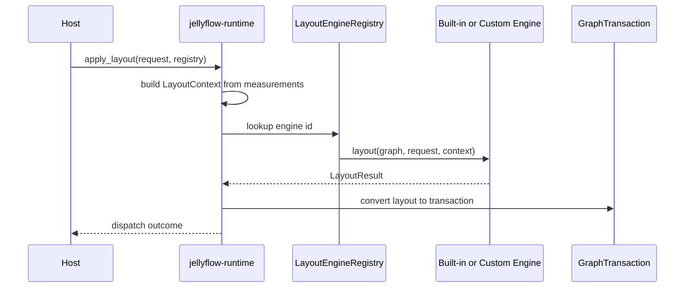

# ADR 0006: Mind Map Layout Strategy

Status: Proposed
Date: 2026-06-11

## Context

The layout engine boundary is now in place: `jellyflow-layout` owns engine selection, a caller-owned
registry, and the runtime context passed into a layout engine. `jellyflow-runtime` can build that
context from store measurements and dispatch the returned transaction through the existing graph
pipeline.

That boundary is enough for layered layout, but it does not yet answer the product question for
brain-map style experiences:

- the default arrangement needs to feel good for notes, images, annotations, and open-ended graph
  exploration;
- some hosts want a compact radial view, while others want a freer canvas with local adjustments;
- product teams need to customize the feel without forking Jellyflow or locking the runtime into a
  legacy layout library.

The risk is choosing a default layout strategy that is either too rigid or too dependent on an
external library that is hard to tune, hard to port, or hard to keep stable across releases.

## Decision

Use a **port-first, host-extensible** strategy for mind-map style layouts.

- Keep the default behavior in `jellyflow-layout`, not in `jellyflow-core` or `jellyflow-runtime`.
- Treat the default as a native engine family, implemented against the existing layout engine
  protocol, rather than as a hard dependency on an external legacy library.
- Expose extension points at the engine boundary so hosts can swap or supplement placement logic
  without changing core data model code.
- Support at least two product modes in the default family:
  - a radial mode for compact overview and hierarchy;
  - a freer mode for open canvas layouts where local adjustments matter more than strict layering.

Host applications may still use external layout libraries as references or optional adapters, but
they should not become the primary default dependency chain for the product experience.

## Alternatives Considered

### Option A: Native default engine family with extension hooks
**Pros**: stable UX control, no legacy dependency lock-in, easier to tune for Jellyflow fixtures,
clean host override path.
**Cons**: more engineering work upfront, more fixture investment.
**Decision**: Chosen.

### Option B: Base the default on an external mature library
**Pros**: faster first draft, wider algorithm surface immediately.
**Cons**: external tuning constraints, dependency churn, harder to preserve a stable product feel,
more adapter glue.
**Decision**: Rejected for the default path.

### Option C: No built-in default, only host-provided engines
**Pros**: maximum flexibility, smallest built-in surface.
**Cons**: poor out-of-the-box experience, harder onboarding, every host must solve the same problem
from scratch.
**Decision**: Rejected for now.

## Consequences

- Jellyflow keeps a clear separation between the graph document, runtime dispatch, and layout
  strategy.
- The default experience can be tuned around representative fixtures without freezing the core
  schema.
- Product teams can provide their own engines or override the default engine family through the
  registry.
- A native port must be maintained with a fixture corpus; it will not be as cheap as a thin wrapper
  around an existing layout library.
- The extension API should stay small, because every extra hook becomes part of the product contract.

## Success Metrics

| Metric | Target | Measurement |
| --- | --- | --- |
| Representative fixture coverage | 100% of checked-in mind-map fixtures lay out without invalid positions or routes | `cargo nextest` fixture tests |
| Determinism | Identical input + options produce identical positions across repeated runs | snapshot comparison |
| Extensibility | An external consumer can register a custom engine and invoke it through the runtime facade | external smoke project |
| Boundary hygiene | `jellyflow-core` and `jellyflow-runtime` stay free of renderer and legacy layout dependencies | manifest checks |

## Risks & Mitigations

| Risk | Severity | Likelihood | Mitigation |
| --- | --- | --- | --- |
| The default engine becomes too opinionated for some hosts | High | Medium | keep engine selection explicit and preserve custom registry injection |
| A native port diverges from the desired product feel | High | Medium | add fixture corpora and visual approval gates before widening the default |
| The layout engine becomes too slow on larger graphs | Medium | Medium | add performance budgets, measure against representative graphs, and defer incremental optimization where needed |
| The extension surface freezes too early | Medium | Medium | keep hooks narrow, document them as stable contracts, and evolve only through ADRs |

## Follow-Up

- Build the first native mind-map engine in `jellyflow-layout`.
- Define fixture families for radial, freeform, and mixed image/note boards.
- Decide which hooks are truly stable before any additional modes or external adapters are added.
- Re-evaluate external libraries only if the native port cannot match the fixture corpus or performance
  targets.

## Evidence

- `docs/adr/0005-layout-engine-extension-boundary.md`
- `crates/jellyflow-layout/src/engine.rs`
- `crates/jellyflow-layout/src/dugong.rs`
- `crates/jellyflow-runtime/src/runtime/layout.rs`
- `crates/jellyflow-runtime/src/runtime/measurement.rs`
