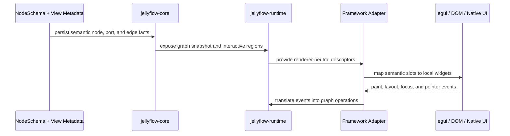

# ADR 0008: Semantic Surface and Framework Adapter Boundary

Status: Accepted
Date: 2026-06-19

## Context

Jellyflow already has a headless graph engine, a runtime policy layer, and adapter-owned rendering
seams. The current egui adapter shows that rich node surfaces are possible without putting
framework widgets into the core model:

- `renderer_key` selects an adapter-owned renderer;
- `PortViewDescriptor` describes handle presentation without changing semantic port meaning;
- `NodeInteractiveRegion` gives adapters node-local regions for hit testing and widget placement;
- `RichNodeRenderer` and `EguiNodeWidgetRenderer` keep measurement and widget painting inside the
  adapter.

The remaining design question is whether Jellyflow should expose framework-specific UI objects in
the headless crates, or whether it should expose a semantic surface that adapters can render in
their own toolkits.

The observed product pressure is clear:

- workflow builders need cards with headers, bodies, action rows, error badges, and nested regions;
- ERD-style nodes need field rows and anchored handles;
- mind maps and knowledge canvases need compact summaries plus optional rich internal content;
- future adapters may use egui, DOM, native retained widgets, or self-drawn canvas code.

If the headless surface grows framework objects, the portability boundary becomes shallow. If it
stays too small, product nodes collapse back to plain text labels.

## Decision

Jellyflow should expose a **semantic surface** instead of framework-specific UI objects.

The headless surface may describe:

- named node slots such as `header`, `body`, `footer`, `badge`, `icon`, `field_row`,
  `action_row`, `preview`, and `nested_region`;
- renderer-neutral placement metadata such as ordering, anchors, lanes, visibility, and hit
  regions;
- port presentation metadata that adapters can interpret consistently;
- adapter-owned renderer keys that map semantic descriptors to concrete renderers.

The headless surface must not contain:

- `egui::Ui`, DOM nodes, or other framework widget instances;
- callback closures that own widget lifecycle;
- adapter-local hover, focus, palette, or open-panel state;
- platform measurement APIs or event-loop state.

Adapters own the rendering implementation. They translate the semantic surface into local widgets
and feed interaction results back through the runtime and graph transaction seams.

## Alternatives Considered

### Option A: Put framework widgets in the core model

**Pros**: direct expressiveness for one frontend, less adapter code initially.

**Cons**: locks Jellyflow to a single UI model, makes future adapters shallow, and forces the core
to depend on rendering lifecycle details.

**Decision**: Rejected.

### Option B: Keep only plain labels and left/right ports

**Pros**: smallest possible model surface.

**Cons**: cannot express rich workflow cards, field rows, badges, nested content, or adapter-aware
handle placement.

**Decision**: Rejected.

### Option C: Expose semantic slots and regions, render them in adapters

**Pros**: portable across egui, DOM, native, and self-drawn adapters; rich enough for product
nodes; keeps the headless seam small.

**Cons**: requires a clear vocabulary for slots and adapter conformance tests.

**Decision**: Chosen.

## Consequences

- `jellyflow-core` and `jellyflow-runtime` stay renderer-free.
- Complex node UIs can be built without storing frontend widgets in the graph.
- `jellyflow-egui` remains an adapter, not the canonical UI model.
- Future adapters can reuse the same semantic descriptors while mapping them to different toolkits.
- The next design work should focus on the smallest stable slot vocabulary, not on framework
  bindings.

## Success Metrics

| Metric | Target | Measurement |
| --- | --- | --- |
| Core portability | No framework widget types in `jellyflow-core` or `jellyflow-runtime` | manifest and public-surface checks |
| Semantic reuse | The same node semantic descriptors support workflow, ERD, mind map, and knowledge board examples | sample gallery and conformance fixtures |
| Adapter portability | A second adapter can implement the same semantic surface without changing core types | external smoke or prototype adapter |
| Rich node UX | Nested regions, badges, actions, and field rows render without overlap at common zoom levels | screenshot review and gallery snapshots |

## Risks & Mitigations

| Risk | Severity | Likelihood | Mitigation |
| --- | --- | --- | --- |
| The semantic vocabulary is too weak | High | Medium | add named slots and region metadata incrementally, guided by samples |
| The semantic vocabulary becomes too framework-like | High | Medium | restrict the headless surface to data, regions, and layout hints only |
| Adapters diverge in behavior | Medium | Medium | add adapter conformance fixtures and visual review samples |
| Rich nodes become expensive to render | Medium | Medium | keep layout and widget rendering separate, and use adapter-local caches only where needed |

## Follow-Up

- Document the minimal slot vocabulary in runtime schema notes.
- Keep `jellyflow-egui` examples focused on workflow, ERD, mind map, and knowledge-canvas cases.
- Add adapter conformance fixtures for semantic region placement and selection behavior.

## Evidence

- `docs/adr/0001-jellyflow-headless-node-graph-engine-boundary.md`
- `docs/adr/0003-headless-adapter-testing-and-renderer-boundary.md`
- `docs/adr/0007-knowledge-canvas-foundations.md`
- `crates/jellyflow-egui/src/renderer.rs`
- `crates/jellyflow-runtime/src/schema/types.rs`
- `crates/jellyflow-egui/src/samples.rs`
