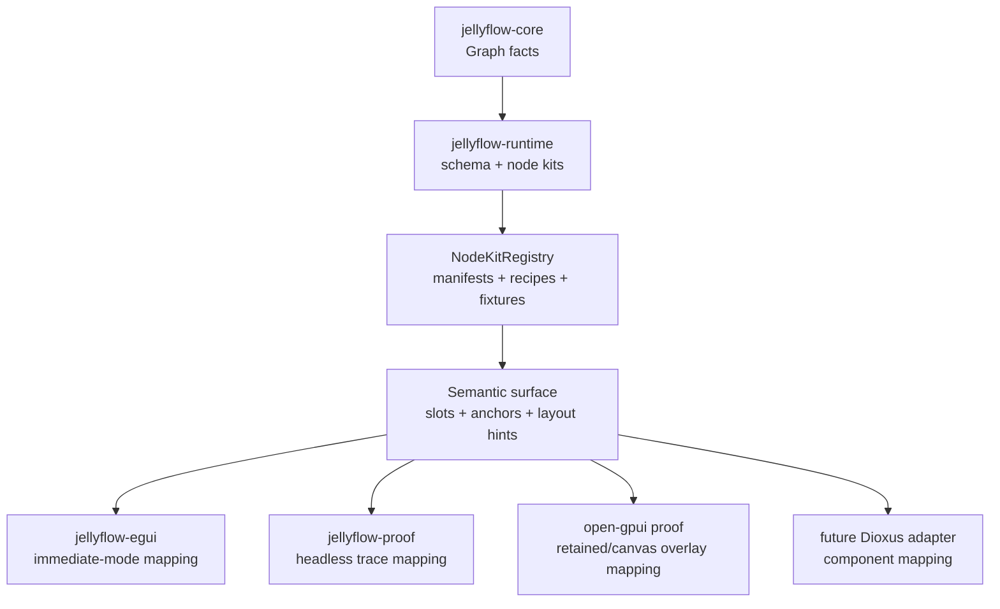
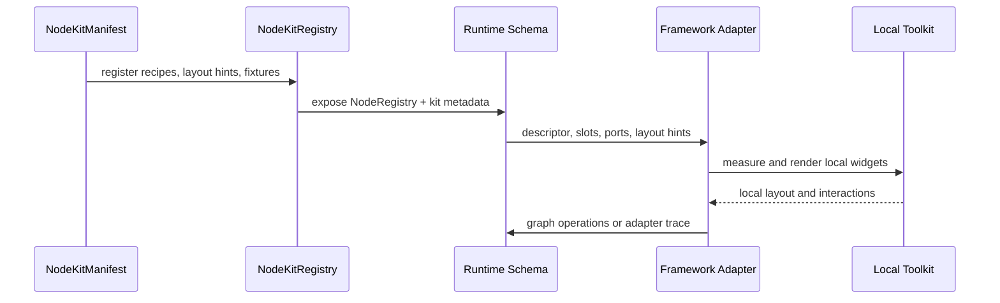

# ADR 0009: Node Kit and Adapter-Local Mapping Boundary

Status: Accepted
Date: 2026-06-29

## Context

ADR 0008 established Jellyflow's semantic surface: headless crates expose node meaning, slots,
anchors, ordering, visibility, and renderer keys while adapters own toolkit widgets and lifecycle.
The follow-up node-kit work turns that surface into reusable product-family packages.

The current implementation pressure comes from four directions:

- workflow and automation builders need Dify-like cards with headers, badges, actions, nested
  policy blocks, and branch/output ports;
- ERD and table graphs need field rows, key badges, relation summaries, and stable anchored ports;
- mind maps and knowledge canvases need topic/source/note nodes that degrade cleanly at low zoom;
- egui, proof traces, and the GPUI proof now consume the same semantic descriptors without sharing
  widget trees.

Without a node-kit boundary, repeated product shapes stay trapped in adapter samples. With the
wrong boundary, Jellyflow would drift into a shared widget crate and lose the ability to support
egui, Dioxus, GPUI, DOM, and self-drawn renderers on equal terms.

## Decision

Jellyflow should treat **node kits as versioned semantic packages**, not framework component
libraries.

A node kit may contain:

- a manifest key, version, supported adapter names, capabilities, and dependency notes;
- reusable node schemas and kind aliases;
- semantic surface recipes built from slots, anchors, lanes, ordering, visibility, and renderer
  keys;
- layout hints such as zoom density thresholds, field/action spacing, and measurement notes;
- default payloads that make newly created nodes render as real product surfaces;
- fixture graphs and trace cases that prove the kit behaves consistently across adapters.

A node kit must not contain:

- `egui`, Dioxus, GPUI, DOM, or platform widget types;
- retained widget instances, component trees, or callback closures;
- adapter-local hover, focus, palette, inspector, or open-panel state;
- runtime execution, scheduling, or workflow engine logic;
- toolkit-specific measurement APIs.

Adapters consume the same kit-aware descriptors and map them locally:

- egui maps slots into immediate-mode paint/widget code and child `Ui` regions;
- GPUI maps descriptors into retained views or canvas overlays;
- Dioxus should map descriptors into component trees and local signals;
- proof/headless adapters map descriptors into deterministic traces.

The shared contract stays data-first. Runtime exposes `NodeKitManifest`, `NodeKitRegistry`,
`NodeSchema`, semantic slots, port view metadata, layout hints, and fixtures. Each adapter owns
measurement, rendering, widget state, event routing, and visual degradation policy.

## Alternatives Considered

### Option A: Keep node shapes sample-local

**Pros**: no new abstraction, fastest path for one adapter.

**Cons**: workflow, ERD, and mind-map semantics duplicate across examples; Dioxus and GPUI cannot
consume the same product shape without copying egui-specific glue.

**Decision**: Rejected. It does not move Jellyflow toward a Rust-native XYFlow-style base.

### Option B: Create a shared widget crate

**Pros**: adapters could reuse visual components directly when their rendering models align.

**Cons**: egui, Dioxus, GPUI, DOM, and self-drawn canvas have different layout, ownership, and event
lifecycle models. A shared widget crate would either become framework-specific or force the
headless surface to leak widget concepts.

**Decision**: Rejected for the current phase. It can be revisited only after multiple adapters prove
real duplicated mapping logic that is safe to share.

### Option C: Use versioned semantic node kits with adapter-local mapping

**Pros**: reusable product families, stable fixtures, shared semantic descriptors, and no widget
types in headless crates. Adapters can still create native-feeling UIs.

**Cons**: requires conformance tests and adapter discipline because visual behavior is implemented
separately per toolkit.

**Decision**: Chosen.

## Consequences

- `jellyflow-runtime::schema::kit` is the right place for manifest, layout-hint, fixture, and
  registry contracts.
- `jellyflow-egui`, the GPUI proof, Dioxus adapters, and headless proofs should resolve the same
  descriptors from `NodeKitRegistry` or a kit-derived `NodeRegistry`.
- Adapter code may cap visible slots, choose local spacing, and implement local widget state, but
  should not reinterpret `slot` as placement. `slot` remains data lookup; `anchor` remains
  placement or binding metadata.
- The first built-in kit families are workflow/automation, ERD/table, and mind-map/knowledge
  canvas.
- A future shared UI crate remains deferred until at least two real adapters show duplicated logic
  that is neither toolkit-specific nor better represented as semantic metadata.

## Success Metrics

| Metric | Target | Measurement |
| --- | --- | --- |
| Headless purity | No framework widget types in `jellyflow-core` or `jellyflow-runtime` | public-surface checks and code review |
| Kit reuse | Workflow, ERD, and mind-map product families come from kit manifests, not sample-only schemas | runtime kit tests and sample code review |
| Adapter portability | egui, proof, and GPUI consume kit descriptors without changing graph storage | adapter tests and GPUI proof commit |
| Fixture stability | Built-in kit fixtures materialize deterministic graphs | `jellyflow-runtime` kit tests |
| Visual degradation | Adapters can reduce slot density without changing semantic descriptors | zoom/density tests and visual review |

## Risks & Mitigations

| Risk | Severity | Likelihood | Mitigation |
| --- | --- | --- | --- |
| Kits become too generic to help product nodes | High | Medium | keep built-ins tied to workflow, ERD, and knowledge-canvas pressure |
| Kits leak adapter concepts | High | Medium | reject framework types in headless crates and keep adapter state local |
| Adapters diverge in behavior | Medium | Medium | use fixtures, proof traces, and GPUI/egui examples as conformance evidence |
| Slot and anchor semantics blur again | Medium | Medium | document and test that `slot` is data lookup while `anchor` is placement/binding |
| Shared UI crate pressure returns too early | Medium | Medium | require repeated adapter-local duplication before promotion |

## Follow-Up

- Keep expanding runtime kit tests around fixture graphs, layout hints, density, and slot ordering.
- Use the GPUI proof commit as retained-view adapter evidence.
- Add a Dioxus proof before promoting any additional public UI-surface abstraction.
- Remove egui-only schema/sample duplication once the kit manifests cover the behavior.

## Evidence

- `docs/adr/0008-semantic-surface-and-framework-adapter-boundary.md`
- `docs/plans/2026-06-19-003-feat-adapter-node-kit-boundary-plan.md`
- `crates/jellyflow-runtime/src/schema/kit/mod.rs`
- `crates/jellyflow-runtime/src/schema/kit/builtins.rs`
- `crates/jellyflow-runtime/src/schema/tests/kit.rs`
- `crates/jellyflow-egui/src/samples.rs`
- `crates/jellyflow-proof/src/lib.rs`
- `repo-ref/open-gpui` commit `ce14140`
