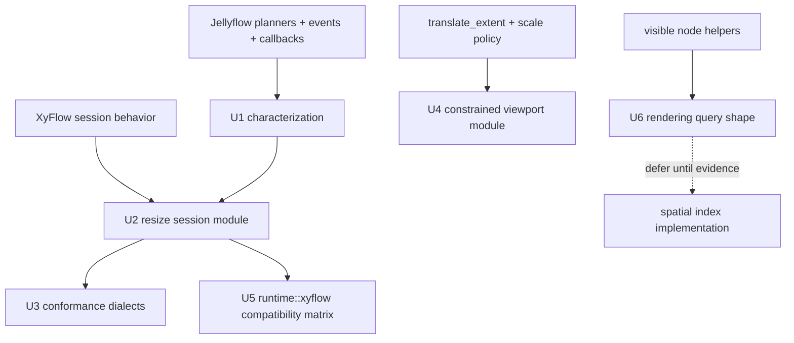

# refactor: Deepen Jellyflow Runtime Interaction Modules

## Summary

Deepen the highest-friction Jellyflow runtime modules where XyFlow session behavior currently leaks across planners, store glue, callbacks, and conformance fixtures. The first tranche should focus on node resize, conformance fixture structure, viewport constraints, and the XyFlow controlled-mode compatibility surface while preserving the headless crate boundary.

---

## Problem Frame

Jellyflow already has the right product shape: a headless Rust node/flow graph engine with XyFlow-like behavior at the runtime boundary and renderer work outside `jellyflow-core` and `jellyflow-runtime`. The remaining architectural friction is not a missing rewrite target. It is a set of shallow modules whose interfaces expose too much sequencing knowledge to adapters, conformance fixtures, or store callers.

The strongest signal is node resize. XyFlow's `XYResizer` is a session module that owns pointer start/update/end, `shouldResize`, geometry, child correction, callback ordering, and finalization. Jellyflow has useful headless planners and event payloads, but the lifecycle knowledge is spread across `runtime::resize`, `runtime::events`, `runtime::xyflow::callbacks`, and `runtime::conformance`.

---

## Requirements

- R1. Keep `jellyflow-core` and `jellyflow-runtime` renderer-free, platform-free, and free of Fret UI dependencies.
- R2. Preserve `NodeGraphPatch` and graph transactions as the canonical commit surface; keep XyFlow-shaped behavior under `runtime::xyflow`.
- R3. Concentrate node resize lifecycle semantics behind one headless runtime module so adapters do not sequence planner, event, callback, and fixture details themselves.
- R4. Make conformance extension local to interaction-specific modules rather than expanding one wide action enum and runner match for every behavior.
- R5. Route viewport pan/zoom through one constrained transform module that can honor scale and translate extents consistently.
- R6. Keep speculative seams deferred unless adapter evidence creates a second real adapter or a real workload.

---

## Scope Boundaries

### In Scope

- Node resize runtime deepening around headless pointer-session semantics.
- Conformance fixture structure that reduces shallow action-runner growth.
- Viewport transform constraint consolidation, especially `translate_extent`.
- XyFlow controlled-mode compatibility characterization for patch projection, apply helpers, and callback order.
- Rendering query planning only far enough to avoid adding more one-off culling helpers.

### Deferred to Follow-Up Work

- Exact XyFlow node-owned child containment and parent-local coordinate schema changes.
- Renderer crates such as egui, wgpu, or Fret adapters.
- Spatial index implementation behind `NodeGraphSpatialIndexTuning`.
- Async pre-delete veto unless a retained adapter needs `onBeforeDelete` parity.
- Main-branch `.trellis` deletion commit handling; that is repository hygiene, not part of this refactor plan.

---

## Key Technical Decisions

- **KTD1. Start with resize session depth:** Node resize is the top candidate because it has accepted ADR follow-up, XyFlow source evidence, and current lifecycle knowledge spread across multiple modules.
- **KTD2. Keep renderer mechanics adapter-owned:** Raw pointer capture, DOM handle lookup, cursor policy, frame clocks, screenshots, and pixel assertions stay outside the runtime crates.
- **KTD3. Treat conformance as a public contract surface:** Fixture JSON stability matters as much as Rust test stability, so conformance refactors need compatibility tests around loading and running existing suites.
- **KTD4. Avoid fake seams:** Do not introduce a spatial index adapter or async delete adapter until there is more than one real implementation pressure point.
- **KTD5. Characterize before reshaping:** The affected modules already have behavior coverage; each unit should start by pinning current traces and XyFlow parity expectations before moving code.

---

## High-Level Technical Design

The plan deepens modules by moving sequencing knowledge inward. Adapters should still translate raw input into headless intents, but they should not need to understand internal ordering between runtime planner output, store commits, gesture events, callback projection, and conformance traces.

---

## Implementation Units

### U1. Characterize Current Interaction Contracts

- **Goal:** Pin the current behavior and known XyFlow deltas before changing module shape.
- **Requirements:** R1, R2, R3, R5.
- **Dependencies:** None.
- **Files:** `docs/reviews/xyflow-gap-2026-06-02.md`, `crates/jellyflow-runtime/src/runtime/tests/resize.rs`, `crates/jellyflow-runtime/src/runtime/tests/viewport/store.rs`, `crates/jellyflow-runtime/src/runtime/tests/xyflow/callbacks/commit.rs`, `crates/jellyflow-runtime/src/runtime/tests/adapter_conformance/fixture_runner/*`, `templates/headless-adapter/src/lib.rs`.
- **Approach:** Add or tighten characterization coverage for resize lifecycle traces, viewport constraint expectations, and controlled-mode callback ordering without changing runtime behavior yet.
- **Execution note:** Characterization-first; preserve existing behavior unless the test names an accepted gap.
- **Patterns to follow:** Existing runtime tests under `crates/jellyflow-runtime/src/runtime/tests/resize.rs` and conformance scenarios in `templates/headless-adapter/src/lib.rs`.
- **Test scenarios:**
  - Bottom-right pointer resize keeps existing `set_node_size` commit behavior and callback trace order.
  - Top-left pointer resize preserves position-before-size transaction ordering.
  - Viewport pan and zoom with no `translate_extent` preserve current transform results.
  - XyFlow callbacks still fire graph commit, node/edge changes, and node/edge-specific callbacks in documented order.
- **Verification:** The characterization tests fail only for unpinned behavior gaps and pass before structural refactors begin.

### U2. Deepen Node Resize Gesture Session Semantics

- **Goal:** Move resize start/update/end sequencing behind one headless runtime module.
- **Requirements:** R1, R2, R3.
- **Dependencies:** U1.
- **Files:** `crates/jellyflow-runtime/src/runtime/resize/types.rs`, `crates/jellyflow-runtime/src/runtime/resize/planner.rs`, `crates/jellyflow-runtime/src/runtime/resize/store.rs`, `crates/jellyflow-runtime/src/runtime/events/node_resize.rs`, `crates/jellyflow-runtime/src/runtime/xyflow/callbacks/dispatch/gesture.rs`, `crates/jellyflow-runtime/src/runtime/tests/resize.rs`, `crates/jellyflow-runtime/src/runtime/tests/xyflow/callbacks/*`.
- **Approach:** Keep the existing target-size and pointer-derived planners, but wrap lifecycle decisions so callers exercise one runtime seam for start/update/end, rejection/no-op/cancel outcomes, and emitted traces.
- **Patterns to follow:** `runtime::drag` planner plus gesture event payload split; ADR 0004 resize lifecycle guidance.
- **Test scenarios:**
  - Resize start records the node, direction, and pointer without mutating the graph.
  - Resize update commits through the normal store dispatch path and emits update callbacks after the graph commit trace.
  - Resize end distinguishes committed, rejected, canceled, and no-op outcomes.
  - Keep-aspect-ratio pointer resize still honors min/max constraints and axis filters.
  - Group-based `NodeExtent::Parent` behavior remains intact and does not introduce node-owned containment.
- **Verification:** Resize adapters can use one headless resize module without manually stitching planner output to gesture events and XyFlow callbacks.

### U3. Split Conformance Actions into Interaction Dialect Modules

- **Goal:** Reduce the shallow growth pattern in `ConformanceAction` and `runner/actions.rs`.
- **Requirements:** R3, R4.
- **Dependencies:** U1, U2 if resize action shape changes.
- **Files:** `crates/jellyflow-runtime/src/runtime/conformance/scenario/action.rs`, `crates/jellyflow-runtime/src/runtime/conformance/runner/actions.rs`, `crates/jellyflow-runtime/src/runtime/conformance/scenario/*`, `crates/jellyflow-runtime/src/runtime/tests/conformance/*`, `crates/jellyflow-runtime/src/runtime/tests/adapter_conformance/fixture_runner/*`, `templates/headless-adapter/src/lib.rs`.
- **Approach:** Group action payloads, serde bridges, and executor logic by interaction dialect so resize, viewport, connection, delete, and rendering scenarios can evolve locally.
- **Patterns to follow:** Existing module split in `runtime::viewport::gesture` and `runtime::xyflow::callbacks`.
- **Test scenarios:**
  - Existing JSON fixture suites load and run with identical traces.
  - Existing adapter template scenarios still produce the same reports.
  - A resize scenario reaches the same store and callback traces through the new dialect module.
  - Low-level `dispatch_transaction` remains available as the documented escape hatch.
- **Verification:** Adding a new resize-specific conformance action no longer requires editing unrelated viewport, delete, or connection runner logic.

### U4. Deepen Viewport Constraint Handling

- **Goal:** Make viewport constraints part of the transform module rather than caller-side policy.
- **Requirements:** R1, R5.
- **Dependencies:** U1.
- **Files:** `crates/jellyflow-runtime/src/runtime/viewport/transform.rs`, `crates/jellyflow-runtime/src/runtime/viewport/gesture/*`, `crates/jellyflow-runtime/src/runtime/store/view/state.rs`, `crates/jellyflow-runtime/src/io/config/state/views/viewport.rs`, `crates/jellyflow-runtime/src/runtime/tests/viewport/*`, `crates/jellyflow-runtime/src/runtime/tests/conformance/runner/viewport.rs`.
- **Approach:** Route store pan/zoom and gesture-derived viewport intents through a constrained transform planner that can apply zoom clamps and `translate_extent` consistently.
- **Patterns to follow:** Existing `ViewportTransform` validation and `NodeGraphPanInteraction::translate_extent` accessors.
- **Test scenarios:**
  - Pan requests cannot move the visible viewport outside a finite `translate_extent`.
  - Anchored zoom keeps the anchor stable while clamping the resulting pan to `translate_extent`.
  - Missing `translate_extent` preserves current pan and zoom behavior.
  - Invalid viewport size or invalid extent rejects without mutating view state.
  - Conformance viewport fixtures can assert constrained pan/zoom traces.
- **Verification:** Store callers do not need to know whether a transform came from direct pan, scroll gesture, double-click zoom, animation frame, or inertia frame before constraints apply.

### U5. Tighten XyFlow Controlled-Mode Compatibility

- **Goal:** Put XyFlow-shaped patch projection, apply helpers, and callback order behind one stronger compatibility test surface.
- **Requirements:** R2, R3.
- **Dependencies:** U1; U2 if resize lifecycle callbacks change.
- **Files:** `crates/jellyflow-runtime/src/runtime/xyflow/changes/*`, `crates/jellyflow-runtime/src/runtime/xyflow/projection/*`, `crates/jellyflow-runtime/src/runtime/xyflow/transaction/*`, `crates/jellyflow-runtime/src/runtime/xyflow/apply/*`, `crates/jellyflow-runtime/src/runtime/xyflow/callbacks/*`, `crates/jellyflow-runtime/src/runtime/tests/xyflow/*`.
- **Approach:** Treat `runtime::xyflow` as the compatibility module for controlled integrations and document any intentional deviations from React `applyChanges` semantics in tests.
- **Patterns to follow:** `runtime::xyflow::callbacks::traits` ordering comments and tests under `runtime/tests/xyflow`.
- **Test scenarios:**
  - Remove and replace changes dominate later changes for the same item where parity is intended.
  - Add changes preserve index insertion behavior where Jellyflow can represent the order.
  - Dimension and resizing changes are either mapped to Jellyflow transactions or explicitly documented as unsupported compatibility vocabulary.
  - Patch projection and callback dispatch agree on connection, delete, and node/edge change counts.
- **Verification:** A controlled adapter can choose the XyFlow compatibility seam and know which React semantics are exact, approximate, or intentionally outside Jellyflow.

### U6. Shape Rendering Queries Without Premature Spatial Indexing

- **Goal:** Prepare rendering queries for visible edge culling without introducing a fake spatial seam.
- **Requirements:** R1, R6.
- **Dependencies:** U1.
- **Files:** `crates/jellyflow-runtime/src/runtime/rendering/visibility.rs`, `crates/jellyflow-runtime/src/runtime/rendering/order.rs`, `crates/jellyflow-runtime/src/runtime/rendering/store.rs`, `crates/jellyflow-runtime/src/runtime/utils/bounds.rs`, `crates/jellyflow-runtime/src/io/tuning/spatial_index.rs`, `crates/jellyflow-runtime/src/runtime/tests/rendering.rs`, `templates/headless-adapter/src/lib.rs`.
- **Approach:** Consolidate renderer-facing query shape around visible nodes, visible node render order, and future visible edge culling while keeping the current linear implementation internal.
- **Patterns to follow:** Existing `VisibleNodeIdsRequest` and render-order option structs.
- **Test scenarios:**
  - Existing visible node id and visible node render order behavior remains unchanged.
  - Hidden nodes and selected-node elevation keep current semantics.
  - A future visible edge query has a place to use endpoint or path bounds without leaking implementation choices to adapters.
  - Spatial index tuning remains inert unless a real workload justifies replacing the internal scan.
- **Verification:** Rendering helpers expose one query-oriented seam to adapters and do not require a new public spatial index adapter.

---

## Risks & Dependencies

- **Fixture churn:** Conformance restructuring can break saved JSON fixtures. Mitigation: keep compatibility tests around loading and running existing suites before moving action payloads.
- **Over-deepening:** Some candidates are future seams, not current needs. Mitigation: apply the two-adapter rule and defer async delete or spatial indexing until evidence exists.
- **ADR conflict risk:** Node-owned containment would contradict ADR 0004 unless reopened. Mitigation: keep resize work group-based and lifecycle-focused.
- **Behavior drift:** Refactoring planner/store/callback ordering can accidentally change adapter-visible traces. Mitigation: characterization-first tests in U1.

---

## Sources & Research

- `CONTEXT.md`
- `docs/adr/0001-jellyflow-headless-node-graph-engine-boundary.md`
- `docs/adr/0002-jellyflow-model-policy-boundary.md`
- `docs/adr/0003-headless-adapter-testing-and-renderer-boundary.md`
- `docs/adr/0004-resize-containment-and-lifecycle-boundary.md`
- `docs/reviews/xyflow-gap-2026-06-02.md`
- `repo-ref/xyflow/packages/system/src/xydrag/XYDrag.ts`
- `repo-ref/xyflow/packages/system/src/xyresizer/XYResizer.ts`
- `repo-ref/xyflow/packages/system/src/xyhandle/XYHandle.ts`
- `repo-ref/xyflow/packages/system/src/xypanzoom/XYPanZoom.ts`
- `repo-ref/xyflow/packages/react/src/utils/changes.ts`
- `repo-ref/xyflow/packages/system/src/utils/graph.ts`
