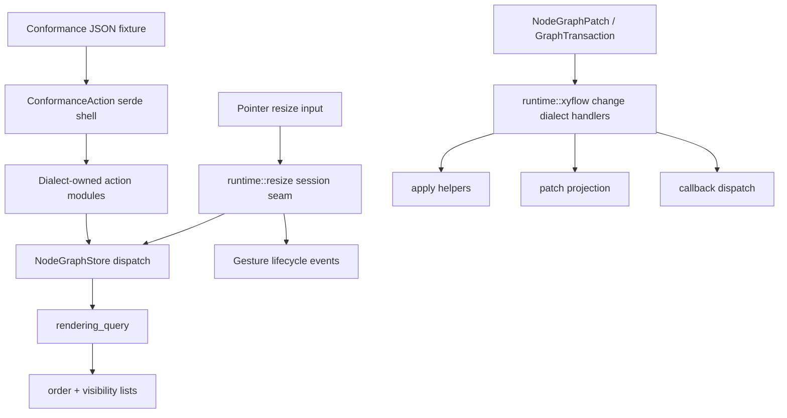

# refactor: Deepen Runtime Interaction Dialects

## Summary

Deepen the Jellyflow runtime seams that still make adapter-facing behavior grow through wide enums, duplicated XyFlow projections, session glue, and one-off rendering helpers. The refactor keeps the headless crate boundary intact while making conformance actions, resize lifecycle, XyFlow compatibility, and rendering queries evolve through smaller dialect-owned modules.

---

## Problem Frame

Jellyflow already has the right high-level boundary: `jellyflow-core` owns graph contracts, and `jellyflow-runtime` owns headless interaction behavior. The remaining friction is locality. A new adapter-visible behavior can still require edits across `ConformanceAction`, conformance runner dispatch, `runtime::xyflow` apply/projection/transaction/callback modules, store helper APIs, and session-level resize glue.

This plan supersedes the broad direction in `docs/plans/2026-06-09-001-refactor-runtime-deepening-plan.md` for the four refactor candidates selected on 2026-06-10. It does not rewrite that prior plan; it narrows execution around the seams that now have the clearest architectural signal.

---

## Requirements

- R1. Preserve the renderer-free and platform-free boundaries of `jellyflow-core` and `jellyflow-runtime`.
- R2. Keep `GraphTransaction`, `NodeGraphPatch`, and `NodeGraphStore` dispatch as the canonical mutation path.
- R3. Split conformance behavior by interaction dialect so adding a resize, viewport, rendering, connection, or selection fixture does not expand unrelated action constructors and runner branches.
- R4. Make resize lifecycle behavior flow through a single session seam that owns start/update/end events, commit/no-op/rejected outcomes, and pointer-derived resize requests.
- R5. Consolidate XyFlow compatibility around change dialect handlers so apply, transaction conversion, projection, and callback dispatch do not re-express the same per-change mapping in four unrelated places.
- R6. Expose rendering through one query-oriented store seam while retaining existing specific helpers as compatibility shims where needed.
- R7. Preserve existing JSON fixture loading, adapter template conformance scenarios, and public runtime behavior unless a test names an intentional compatibility clarification.

---

## Scope Boundaries

In scope:

- Internal Rust module refactors under `crates/jellyflow-runtime/src/runtime/conformance`, `resize`, `xyflow`, and `rendering`.
- Compatibility-preserving serde shape for existing conformance JSON actions.
- Characterization and regression tests for existing fixture, resize, xyflow, and rendering behavior.
- Public API shims where immediate removal would churn downstream adapters or examples.

Out of scope:

- Moving persisted fields out of `jellyflow_core::core::Graph`.
- Adding renderer, browser, Fret, `wgpu`, `winit`, egui, screenshot, or pixel-test dependencies to headless crates.
- Adding async delete veto or confirmation-dialog parity without adapter evidence.
- Replacing current linear rendering visibility scans with a spatial index implementation.
- Exact XyFlow node-owned child containment; ADR 0004 keeps resize containment group-based for v1.

---

## Key Technical Decisions

- KTD1. Conformance dialects are the first execution unit because `ConformanceAction` is the widest accidental interface. The enum can remain as the serde compatibility shell while payload types, constructors, kind mapping, and runner execution move into dialect modules.
- KTD2. Resize session work should deepen the existing `runtime::resize::session` seam instead of inventing a new gesture subsystem. ADR 0004 already pins renderer mechanics outside the runtime and lifecycle events inside the runtime.
- KTD3. XyFlow compatibility should use per-change dialect handlers shared by apply, transaction, projection, and callback surfaces. The goal is not to erase Rust enums; it is to make each new XyFlow change map in one local module.
- KTD4. Rendering query consolidation should make `NodeGraphStore::rendering_query` the primary adapter seam and keep specific helpers as wrappers until downstream usage proves they can be removed.
- KTD5. The refactor is characterization-first where behavior is already adapter-visible. Structural edits should follow tests that prove fixture JSON, callback traces, and render ordering stayed stable.

---

## High-Level Technical Design

The main design move is to keep public compatibility shells stable while moving behavior behind narrower module-owned dialects. This lets adapters and fixtures keep their current vocabulary while future behavior lands in the module that owns that interaction.

---

## Implementation Units

### U1. Split Conformance Action Dialects

- **Goal:** Turn the current wide `ConformanceAction` interface into a compatibility shell over interaction-specific dialect modules.
- **Requirements:** R1, R2, R3, R7.
- **Dependencies:** None.
- **Files:** `crates/jellyflow-runtime/src/runtime/conformance/scenario/action.rs`, `crates/jellyflow-runtime/src/runtime/conformance/scenario/mod.rs`, `crates/jellyflow-runtime/src/runtime/conformance/runner/actions.rs`, `crates/jellyflow-runtime/src/runtime/conformance/runner/actions/*.rs`, `crates/jellyflow-runtime/src/runtime/tests/conformance/*`, `crates/jellyflow-runtime/src/runtime/tests/adapter_conformance/*`, `templates/headless-adapter/src/lib.rs`.
- **Approach:** Keep `ConformanceAction` as the serialized top-level enum for fixture compatibility, but move grouped payload types, constructors, `kind` strings, and runner execution into modules such as graph, node, connection, viewport, rendering, and selection. The top-level match should delegate whole dialect groups instead of holding all behavior directly.
- **Execution note:** Start with fixture compatibility characterization before moving serde or runner code.
- **Patterns to follow:** Existing runner module split in `crates/jellyflow-runtime/src/runtime/conformance/runner/actions.rs` and action helper constructors in `crates/jellyflow-runtime/src/runtime/conformance/scenario/action.rs`.
- **Test scenarios:** Existing JSON fixture suites deserialize and run without changed traces. Existing adapter conformance tests using `ConformanceAction::apply_node_resize`, viewport actions, connection actions, and rendering assertions still compile. `dispatch_transaction` remains a documented escape hatch. Adding a new resize action requires editing only resize dialect files plus the top-level serde shell.
- **Verification:** Conformance action behavior is grouped by dialect, and the top-level runner/action files no longer contain all payload conversion and execution logic.

### U2. Deepen Resize Session Lifecycle

- **Goal:** Make pointer resize start/update/end behavior flow through one headless session seam instead of callers stitching planner, store commit, and gesture events manually.
- **Requirements:** R1, R2, R4, R7.
- **Dependencies:** U1 for any conformance action routing that exercises resize sessions.
- **Files:** `crates/jellyflow-runtime/src/runtime/resize/session.rs`, `crates/jellyflow-runtime/src/runtime/resize/store.rs`, `crates/jellyflow-runtime/src/runtime/resize/types.rs`, `crates/jellyflow-runtime/src/runtime/events/node_resize.rs`, `crates/jellyflow-runtime/src/runtime/xyflow/callbacks/dispatch/gesture.rs`, `crates/jellyflow-runtime/src/runtime/tests/resize.rs`, `crates/jellyflow-runtime/src/runtime/tests/xyflow/callbacks/*`, `crates/jellyflow-runtime/src/runtime/tests/adapter_conformance/fixture_runner/node_resize.rs`.
- **Approach:** Introduce a session outcome type that captures start event, optional update commit, update event, and end outcome in one return value. Keep pure planners intact, but route store and conformance session APIs through the session object so lifecycle ordering is represented once.
- **Execution note:** Characterization-first for current callback trace order and no-op/rejected behavior.
- **Patterns to follow:** `NodeResizeSession` in `crates/jellyflow-runtime/src/runtime/resize/session.rs`, store dispatch helpers in `crates/jellyflow-runtime/src/runtime/resize/store.rs`, and gesture callback dispatch in `crates/jellyflow-runtime/src/runtime/xyflow/callbacks/dispatch/gesture.rs`.
- **Test scenarios:** A successful pointer resize session emits start, graph commit, update, and end in the existing order. A hidden or missing node produces a rejected/no-op session outcome without graph mutation. Keep-aspect-ratio and axis-filtered sessions still produce the same transaction ops as direct pointer resize. Top-left resize preserves position-before-size transaction ordering. Group-based parent extent behavior remains unchanged.
- **Verification:** Adapter-facing resize session calls use one runtime seam for lifecycle semantics, and direct resize planners remain available for pure planning tests.

### U3. Consolidate XyFlow Change Dialects

- **Goal:** Reduce duplicated per-change mapping across `runtime::xyflow` apply, transaction, projection, and callback paths.
- **Requirements:** R2, R5, R7.
- **Dependencies:** U2 if resize lifecycle adds or clarifies XyFlow gesture change vocabulary.
- **Files:** `crates/jellyflow-runtime/src/runtime/xyflow/changes/*`, `crates/jellyflow-runtime/src/runtime/xyflow/apply/*`, `crates/jellyflow-runtime/src/runtime/xyflow/transaction/*`, `crates/jellyflow-runtime/src/runtime/xyflow/projection/*`, `crates/jellyflow-runtime/src/runtime/xyflow/callbacks/*`, `crates/jellyflow-runtime/src/runtime/tests/xyflow/*`.
- **Approach:** Add node-change and edge-change dialect modules that own the conversion decisions for a change family, then have apply, transaction, projection, and callbacks call those modules. Preserve XyFlow-shaped public types and serialized field names. Document intentional React/XyFlow semantic gaps in tests rather than scattering comments across call sites.
- **Execution note:** Add or tighten tests around ordering and unsupported vocabulary before moving logic.
- **Patterns to follow:** React-ordering tests in `crates/jellyflow-runtime/src/runtime/tests/xyflow/apply.rs`, transaction conversion tests in `crates/jellyflow-runtime/src/runtime/tests/xyflow/transaction.rs`, and callback ordering tests in `crates/jellyflow-runtime/src/runtime/tests/xyflow/callbacks`.
- **Test scenarios:** Remove and replace dominance behavior remains unchanged for node and edge apply helpers. Add changes preserve current index insertion behavior. Transaction conversion still rejects unsupported or invalid changes with the same error category. Patch projection and callback dispatch agree on node and edge change counts for commit, connection, and delete flows. Camel-case JSON compatibility for XyFlow-shaped changes remains intact.
- **Verification:** Adding or modifying a XyFlow node/edge change no longer requires independently editing unrelated apply, transaction, projection, and callback mapping code.

### U4. Consolidate Rendering Query Seam

- **Goal:** Make `NodeGraphStore::rendering_query` the primary renderer-facing API for order and visibility while keeping existing one-off helpers as wrappers.
- **Requirements:** R1, R6, R7.
- **Dependencies:** None.
- **Files:** `crates/jellyflow-runtime/src/runtime/rendering/query.rs`, `crates/jellyflow-runtime/src/runtime/rendering/store.rs`, `crates/jellyflow-runtime/src/runtime/rendering/visibility.rs`, `crates/jellyflow-runtime/src/runtime/rendering/order.rs`, `crates/jellyflow-runtime/src/runtime/tests/rendering.rs`, `crates/jellyflow-runtime/src/runtime/tests/adapter_conformance/fixture_runner/rendering.rs`, `templates/headless-adapter/src/lib.rs`.
- **Approach:** Move request construction for visible nodes and edges into query options or a small query builder, then implement `visible_node_ids`, `visible_node_render_order`, `visible_edge_ids`, and `visible_edge_render_order` through the unified query path. Keep the current linear visibility implementation private.
- **Execution note:** Characterize wrapper/helper parity before changing store helper internals.
- **Patterns to follow:** `RenderingQueryOptions` and `RenderingQueryResult` in `crates/jellyflow-runtime/src/runtime/rendering/query.rs`, plus current store helper behavior in `crates/jellyflow-runtime/src/runtime/rendering/store.rs`.
- **Test scenarios:** `rendering_query` returns the same node and edge order as specific helper calls for the same viewport. Hidden nodes, selected-node elevation, selected-edge elevation, and `only_render_visible_elements` keep existing behavior. Invalid viewport transforms still return empty visibility lists through wrapper APIs. Conformance rendering assertions can use the unified query without changing expected fixture traces.
- **Verification:** Adapter code can get renderer-facing order and visibility from one query result, and old helpers are thin compatibility wrappers rather than separate behavior surfaces.

### U5. Cross-Seam Verification and Cleanup

- **Goal:** Prove the four refactors did not change adapter-visible contracts and remove code that became dead after the new seams are in place.
- **Requirements:** R1, R2, R7.
- **Dependencies:** U1, U2, U3, U4.
- **Files:** `crates/jellyflow-runtime/src/runtime/tests/*`, `crates/jellyflow-runtime/tests/public_surface.rs`, `templates/headless-adapter/src/lib.rs`, `Cargo.toml`, `crates/jellyflow-runtime/Cargo.toml`.
- **Approach:** Run formatting and targeted tests first, then broader workspace checks. Remove obsolete helper functions only after callers move to the new module-owned APIs. Keep any public shim that is still needed by tests, examples, or the adapter template.
- **Patterns to follow:** Validation gates in `CONTEXT.md` and dependency smoke scripts under `tools/`.
- **Test scenarios:** Runtime unit tests pass for conformance, resize, xyflow, and rendering modules. The headless adapter template still compiles and runs its conformance check. Public surface tests confirm no accidental renderer dependencies or public API drift. Dependency smoke scripts still report no Fret or renderer dependency leakage into headless crates.
- **Verification:** `cargo fmt --check`, relevant `cargo nextest run` targets, `cargo check --workspace`, and dependency smoke scripts pass or any remaining failure is traced to pre-existing unrelated state.

---

## System-Wide Impact

The refactor touches adapter-facing fixture JSON, callback ordering, and public runtime helper APIs. Existing consumers should see stable behavior, but reviewers should pay special attention to serde tags, constructor names, public re-exports, and callback trace order because these are the contracts external adapters are most likely to rely on.

---

## Risks & Dependencies

- **Fixture compatibility risk:** Moving payload types can accidentally change serde tags or defaults. Mitigation: characterize deserialization and runner traces before moving code.
- **Callback drift risk:** Resize session consolidation can reorder graph commit and gesture events. Mitigation: keep explicit tests for start, update, commit, and end trace order.
- **Fake abstraction risk:** XyFlow consolidation can become a generic layer with no real ownership. Mitigation: split by concrete node/edge change dialects and require callers to reuse those handlers.
- **Public API churn risk:** Rendering helper cleanup can break adapter examples. Mitigation: keep wrappers until downstream usage proves removal is safe.

---

## Sources & Research

- `CONTEXT.md`
- `docs/adr/0001-jellyflow-headless-node-graph-engine-boundary.md`
- `docs/adr/0003-headless-adapter-testing-and-renderer-boundary.md`
- `docs/adr/0004-resize-containment-and-lifecycle-boundary.md`
- `docs/plans/2026-06-09-001-refactor-runtime-deepening-plan.md`
- `crates/jellyflow-runtime/src/runtime/conformance/scenario/action.rs`
- `crates/jellyflow-runtime/src/runtime/conformance/runner/actions.rs`
- `crates/jellyflow-runtime/src/runtime/resize/session.rs`
- `crates/jellyflow-runtime/src/runtime/xyflow`
- `crates/jellyflow-runtime/src/runtime/rendering/query.rs`
- `crates/jellyflow-runtime/src/runtime/rendering/store.rs`
