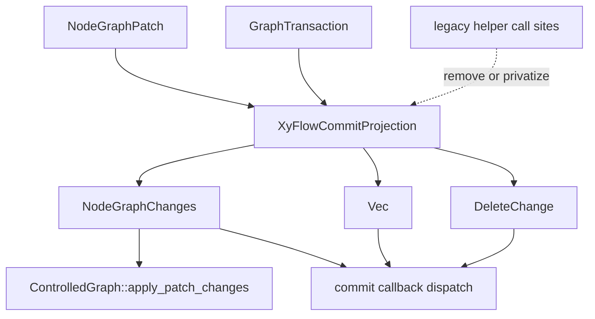

# refactor: Deepen XyFlow Commit Projection

## Summary

Deepen `runtime::xyflow` commit projection around one private projection result that derives all XyFlow-shaped commit payloads from a `NodeGraphPatch` or `GraphTransaction`. The first slice should favor a clean internal boundary over keeping legacy helper wrappers, then make callback dispatch and controlled-mode patch application consume the same projection semantics.

---

## Problem Frame

The previous runtime interaction refactor localized XyFlow update mapping, but commit projection still has one shallow boundary: the same graph commit is separately projected into `NodeGraphChanges`, `ConnectionChange`, and `DeleteChange`. Callback dispatch then assembles those payloads at the call site, while controlled-mode patch application separately asks for `NodeGraphChanges`.

That shape works today, but it spreads commit semantics across three projection functions and two consumers. The next useful architecture move is not to broaden the refactor into gestures, rendering, schema gates, or resize behavior. It is to introduce a single private XyFlow commit projection seam and make the existing consumers call through it.

---

## Requirements

- R1. Preserve the renderer-free and platform-free `jellyflow-runtime` boundary.
- R2. Preserve XyFlow-compatible behavior where it is still part of the intended runtime vocabulary, but do not preserve legacy Rust helper APIs solely for compatibility.
- R3. Add a private commit projection result that can expose node/edge changes, connection changes, and delete changes for one `NodeGraphPatch` or `GraphTransaction`.
- R4. Make commit callback dispatch construct the projection once and dispatch all XyFlow commit callbacks from that result without changing callback order.
- R5. Make controlled-mode patch application consume the same node/edge projection semantics as callback dispatch.
- R6. Centralize cascade and dedupe rules for removed edges and deleted resources behind the commit projection test surface.
- R7. Keep viewport gesture, rendering query assertions, conformance suite relocation, fixture schema gates, resize multi-update behavior, spatial indexing, and public API redesign out of this slice.

---

## Scope Boundaries

### Really Needed Now

- A private `runtime::xyflow::projection` commit result, likely in a new focused module such as `projection::commit`.
- One internal entry point for projecting a `NodeGraphPatch` or `GraphTransaction` into node/edge, connection, and delete payloads.
- Legacy projection helpers removed or made private when they only duplicate the new seam.
- Callback dispatch rewired to use the commit projection result.
- Controlled-mode patch application rewired to use the same node/edge projection path.
- Focused projection, callback, and controlled-mode tests that prove behavior did not drift.

### Worth Doing After The Seam Is Stable

- Consider moving conformance assertions toward a query-shaped XyFlow commit projection assertion if adapter fixtures start checking combined commit payloads.
- Consider clearer controlled-mode naming if the private seam exposes a better internal vocabulary.
- Consider documenting intentional projection gaps in `runtime::xyflow` module docs if implementation reveals ambiguous XyFlow parity rules.

### Deferred

- Moving the canonical adapter suite into `runtime::conformance`.
- Rendering query-shaped conformance assertions.
- Viewport gesture glue consolidation.
- Resize multi-update sessions.
- Fixture schema validation gates.
- New public commit projection APIs for external consumers.
- Spatial indexing, visible edge path culling, and node-owned resize containment.

---

## Key Technical Decisions

- KTD1. The new projection result stays private because the clean boundary should be proven by runtime consumers first. Existing helper functions should be deleted or made private when they only exist to preserve old call paths.
- KTD2. `NodeGraphPatch` is the primary callback input, while `GraphTransaction` remains the lower-level source for tests and transaction-shaped projection entry points that still carry a real runtime concept. This matches `NodeGraphStore` commit events without forcing every projection test to manufacture a store patch.
- KTD3. Callback dispatch owns callback ordering; projection owns payload derivation. The projection result should not know callback names or dispatch order.
- KTD4. Existing node graph, connection, and delete modules can remain as internal accumulators only when they clarify the projection implementation. Wrapper functions and public re-exports that merely mirror the new commit projection should be removed.
- KTD5. Cascade and dedupe behavior must be characterized before rewiring consumers. Removed-edge behavior is the highest-risk area because node/edge projection, connection callbacks, and delete callbacks each observe cascades differently.

---

## High-Level Technical Design

The projection result is a private data-flow boundary. It should expose borrowed or owned accessors that let runtime consumers dispatch callback payloads or apply controlled changes without re-projecting the same transaction. Old helper call sites should be migrated to the projection result and deleted when they no longer express a useful API.

---

## Implementation Units

### U1. Characterize Unified Commit Projection Behavior

- **Goal:** Pin the combined projection contract before moving callback and controlled consumers, without treating old helper APIs as compatibility obligations.
- **Requirements:** R2, R4, R5, R6.
- **Dependencies:** None.
- **Files:** `crates/jellyflow-runtime/src/runtime/tests/xyflow/projection/mod.rs`, `crates/jellyflow-runtime/src/runtime/tests/xyflow/projection/connections.rs`, `crates/jellyflow-runtime/src/runtime/tests/xyflow/projection/deletes.rs`, `crates/jellyflow-runtime/src/runtime/tests/xyflow/projection/node_graph/*`, `crates/jellyflow-runtime/src/runtime/tests/xyflow/callbacks/commit.rs`, `crates/jellyflow-runtime/src/runtime/tests/xyflow/controlled.rs`.
- **Approach:** Add a combined projection test surface that exercises one transaction and asserts the node/edge, connection, and delete outputs together. Keep existing focused tests where they document family-specific behavior.
- **Execution note:** Characterization-first; any behavior correction must be named by a failing test before implementation changes it.
- **Patterns to follow:** Existing projection tests under `crates/jellyflow-runtime/src/runtime/tests/xyflow/projection` and callback ordering tests in `crates/jellyflow-runtime/src/runtime/tests/xyflow/callbacks/commit.rs`.
- **Test scenarios:** A transaction with `AddEdge`, `SetEdgeEndpoints`, and `RemoveEdge` produces the intended connected, reconnected, and disconnected callback payloads while preserving node/edge projection behavior. A `RemoveNode` plus `RemovePort` cascade for the same edge reports one deleted edge and one disconnected edge. A port-only commit keeps `on_graph_commit` observable and produces empty node/edge changes. A store patch applied to `ControlledGraph` still reaches graph parity with the store after node and edge updates.
- **Verification:** The tests describe current behavior before the new projection seam exists and continue passing after consumer rewiring.

### U2. Add Private XyFlow Commit Projection Result

- **Goal:** Introduce the private seam that derives all XyFlow commit payloads from one patch or transaction, then eliminate redundant projection wrappers.
- **Requirements:** R1, R2, R3, R6.
- **Dependencies:** U1.
- **Files:** `crates/jellyflow-runtime/src/runtime/xyflow/projection/mod.rs`, `crates/jellyflow-runtime/src/runtime/xyflow/projection/commit.rs`, `crates/jellyflow-runtime/src/runtime/xyflow/projection/connections.rs`, `crates/jellyflow-runtime/src/runtime/xyflow/projection/deletes.rs`, `crates/jellyflow-runtime/src/runtime/xyflow/projection/node_graph/*`, `crates/jellyflow-runtime/src/runtime/xyflow/changes/model.rs`, `crates/jellyflow-runtime/src/runtime/xyflow/callbacks/dispatch/mod.rs`.
- **Approach:** Add a private projection result with accessors for `NodeGraphChanges`, connection changes, and delete changes. Move shared removed-edge cascade handling under the commit projection path. Delete or privatize `node_graph_changes_from_transaction`, `connection_changes_from_transaction`, and `delete_changes_from_transaction` unless an in-repo consumer still needs that exact concept after the seam exists.
- **Patterns to follow:** Current `projection::node_graph`, `projection::connections`, `projection::deletes`, and `projection::removed_edges` modules.
- **Test scenarios:** Former helper call paths now reach the combined commit projection or are deleted with their tests rewritten around the new contract. Repeated cascaded edge removals dedupe consistently across delete and connection outputs. Patch-based and transaction-based projection entry points agree when both remain useful.
- **Verification:** There is one internal commit projection entry point, and no obsolete projection wrapper remains public just for backwards compatibility.

### U3. Rewire Commit Callback Dispatch

- **Goal:** Make callback dispatch consume the private commit projection result instead of assembling payloads from separate projection calls.
- **Requirements:** R2, R3, R4, R6.
- **Dependencies:** U2.
- **Files:** `crates/jellyflow-runtime/src/runtime/xyflow/callbacks/dispatch/commit/mod.rs`, `crates/jellyflow-runtime/src/runtime/xyflow/callbacks/dispatch/commit/connection.rs`, `crates/jellyflow-runtime/src/runtime/xyflow/callbacks/dispatch/commit/delete.rs`, `crates/jellyflow-runtime/src/runtime/xyflow/callbacks/dispatch/mod.rs`, `crates/jellyflow-runtime/src/runtime/xyflow/callbacks/traits.rs`, `crates/jellyflow-runtime/src/runtime/tests/xyflow/callbacks/commit.rs`.
- **Approach:** Build the projection once in `dispatch_graph_commit_callbacks`, then pass projected connection and delete payloads to the focused dispatch helpers. Preserve the documented callback order: graph commit, node/edge aggregate, node changes, edge changes, connection callbacks, delete callbacks.
- **Patterns to follow:** Existing focused dispatch helpers in `crates/jellyflow-runtime/src/runtime/xyflow/callbacks/dispatch/commit`.
- **Test scenarios:** Commit callback order remains unchanged for node and edge updates. Remove-node commits still call node delete, edge delete, disconnect, and aggregate delete hooks with the same IDs. Port-only commits still call `on_graph_commit` and `on_node_edge_changes` with empty node/edge changes. Connection-specific callbacks still mirror `ConnectionChange` values in order.
- **Verification:** Callback dispatch does not call independent transaction projection helpers for each payload family.

### U4. Rewire Controlled Patch Projection And Remove Legacy Wrappers

- **Goal:** Make controlled-mode patch application consume the same internal projection seam and remove legacy wrapper APIs that no longer carry their weight.
- **Requirements:** R2, R3, R5.
- **Dependencies:** U2.
- **Files:** `crates/jellyflow-runtime/src/runtime/xyflow/controlled.rs`, `crates/jellyflow-runtime/src/runtime/xyflow/changes/model.rs`, `crates/jellyflow-runtime/src/runtime/xyflow/mod.rs`, `crates/jellyflow-runtime/src/runtime/xyflow/callbacks/mod.rs`, `crates/jellyflow-runtime/src/runtime/tests/xyflow/controlled.rs`, `crates/jellyflow-runtime/src/runtime/tests/xyflow/projection/mod.rs`.
- **Approach:** Route `ControlledGraph::apply_patch_changes` through the commit projection result's node/edge changes if patch application remains a primary controlled-mode API. Keep `NodeGraphChanges` only where it remains the clear vocabulary for apply/controlled semantics. Remove connection and delete transaction helper re-exports if tests can assert through the projection contract instead.
- **Patterns to follow:** Current `ControlledGraph::apply_patch_changes` and `NodeGraphChanges::from_patch` implementations.
- **Test scenarios:** Controlled patch application, if retained, reports the same applied and ignored counts for a projected store patch. Missing-node and missing-edge ignore behavior remains unchanged for direct change application. Deleted helper wrappers no longer appear in public re-exports or tests.
- **Verification:** Controlled-mode patch application, callback node/edge dispatch, and any retained `NodeGraphChanges` patch constructor share one internal projection path.

### U5. Cleanup And Cross-Gate Verification

- **Goal:** Remove obsolete internal projection assembly and prove adapter-visible behavior stayed stable.
- **Requirements:** R1, R2, R6, R7.
- **Dependencies:** U1, U2, U3, U4.
- **Files:** `crates/jellyflow-runtime/src/runtime/xyflow/projection/*`, `crates/jellyflow-runtime/src/runtime/xyflow/callbacks/dispatch/*`, `crates/jellyflow-runtime/src/runtime/tests/xyflow/*`, `crates/jellyflow-runtime/tests/public_surface.rs`, `templates/headless-adapter/src/lib.rs`, `tools/check_no_fret_dependencies.py`, `tools/check_external_consumer_smoke.py`.
- **Approach:** Remove dead private helpers and compatibility-only public shims once consumers use the new seam. Run the normal Rust formatting, workspace test, workspace check, clippy, dependency-smoke, and external-consumer-smoke gates.
- **Patterns to follow:** Validation guidance in `CONTEXT.md` and the previous runtime interaction refactor plan in `docs/plans/2026-06-10-001-refactor-runtime-interaction-dialects-plan.md`.
- **Test scenarios:** Runtime XyFlow projection, callback, apply, transaction, and controlled tests pass together. Public surface tests show no renderer or Fret dependency leakage. The headless adapter template still compiles and runs its conformance check after any API cleanup it needs. No deferred rendering, resize, viewport, or fixture schema behavior is introduced by this lane.
- **Verification:** The work leaves `runtime::xyflow` with one private commit projection seam and no compatibility-only wrapper surface.

---

## Acceptance Examples

- AE1. Given a committed transaction that removes a node and cascades an attached edge, when the private commit projection is built, then node/edge changes, connection changes, and delete changes all report the same removed edge according to their existing dedupe rules.
- AE2. Given a committed transaction that changes only a port payload, when callbacks dispatch from the projection, then `on_graph_commit` still receives the patch and node/edge callbacks receive an empty change set.
- AE3. Given a store patch with node position and edge reconnectable changes, when a controlled graph applies the patch, then the controlled graph reaches the same serialized graph state as the store.
- AE4. Given old tests or call sites that used `connection_changes_from_transaction` or `delete_changes_from_transaction`, when this refactor lands, then they are either migrated to the commit projection contract or removed with no loss of intended behavior coverage.

---

## System-Wide Impact

This is an internal architecture refactor under `runtime::xyflow`, but it sits on adapter-facing behavior. The important behavioral contracts are callback ordering, callback payload contents, and controlled-mode graph parity. Public helper availability is not a compatibility requirement before launch; review should prefer a smaller coherent API over preserving old helper names.

---

## Risks & Dependencies

- **Projection drift risk:** Rewiring multiple consumers can accidentally change payload contents. Mitigation: add combined projection characterization before moving consumers.
- **Callback order risk:** A cleaner projection result could tempt callback dispatch changes. Mitigation: keep ordering tests in `callbacks/commit.rs` and keep dispatch sequencing outside the projection result.
- **Over-abstraction risk:** A new commit projection type could become a public API too early. Mitigation: keep it private and delete compatibility-only wrappers instead of replacing them with a new public surface.
- **Dedupe ambiguity risk:** Edge remove/re-add and cascaded removals can have subtly different meanings for node/edge, connection, and delete payloads. Mitigation: test the combined outputs together and name any intentional semantic gap.

---

## Sources & Research

- `CONTEXT.md`
- `docs/adr/0001-jellyflow-headless-node-graph-engine-boundary.md`
- `docs/adr/0003-headless-adapter-testing-and-renderer-boundary.md`
- `docs/plans/2026-06-10-001-refactor-runtime-interaction-dialects-plan.md`
- `crates/jellyflow-runtime/src/runtime/xyflow/projection/mod.rs`
- `crates/jellyflow-runtime/src/runtime/xyflow/projection/connections.rs`
- `crates/jellyflow-runtime/src/runtime/xyflow/projection/deletes.rs`
- `crates/jellyflow-runtime/src/runtime/xyflow/projection/node_graph/*`
- `crates/jellyflow-runtime/src/runtime/xyflow/callbacks/dispatch/commit/mod.rs`
- `crates/jellyflow-runtime/src/runtime/xyflow/controlled.rs`
- `crates/jellyflow-runtime/src/runtime/tests/xyflow/projection/*`
- `crates/jellyflow-runtime/src/runtime/tests/xyflow/callbacks/commit.rs`
- `crates/jellyflow-runtime/src/runtime/tests/xyflow/controlled.rs`
