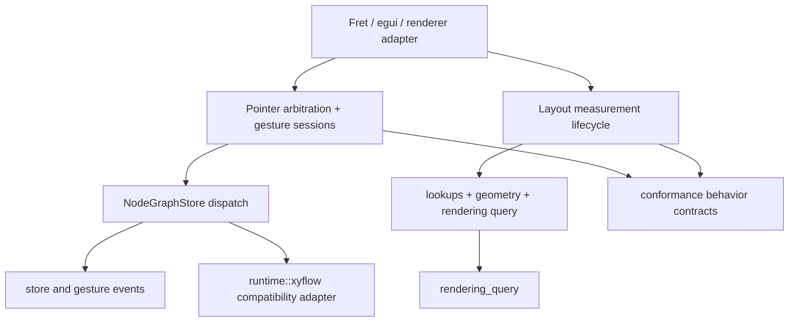

# refactor: Deepen Headless Adapter Architecture

## Summary

Deepen the adapter-facing Jellyflow runtime modules that still leak XyFlow-style editor sequencing to Fret, egui, or other Rust self-drawn adapters. The first slice should focus on pointer arbitration and gesture sessions, then add a renderer-neutral layout measurement lifecycle, while treating existing interaction and XyFlow projection plans as active supporting lanes.

---

## Problem Frame

Jellyflow already has the right headless package boundary: `jellyflow-core` owns the persisted graph model and transactions, and `jellyflow-runtime` owns store, interaction, policy, geometry, rendering query, XyFlow compatibility, and conformance. The architectural friction is now at the adapter interface. A consumer can use the crates without renderer dependencies, but must still understand too many shallow runtime seams: pointer claim helpers, planner/apply methods, gesture events, callback projection, measurement feedback, rendering visibility, and conformance trace choreography.

`repo-ref/xyflow` points to two useful deep modules to emulate without copying DOM/D3: pointer-session modules such as `XYDrag`, `XYHandle`, `XYPanZoom`, and `XYResizer`; and the measurement/canonicalization lifecycle around `adoptUserNodes`, `updateNodeInternals`, lookup maintenance, handle bounds, and render visibility.

---

## Requirements

- R1. Preserve the renderer-free and platform-free boundaries of `jellyflow-core` and `jellyflow-runtime`.
- R2. Keep `GraphTransaction`, `NodeGraphPatch`, and `NodeGraphStore` dispatch as the canonical mutation path.
- R3. Concentrate pointer arbitration so adapters do not choose between selection, node drag, connection, viewport pan, and gesture rejection through separate low-level helper calls.
- R4. Concentrate gesture lifecycle sequencing so adapters do not manually stitch planner output, store commits, gesture events, XyFlow callbacks, and conformance traces.
- R5. Add a renderer-neutral measurement lifecycle so adapters report measured node and handle facts while runtime owns derived lookups, endpoint invalidation, selection geometry, and rendering query inputs.
- R6. Keep XyFlow-shaped projection and callback vocabulary under `runtime::xyflow`, not as the canonical adapter interface.
- R7. Shift conformance from low-level trace choreography toward behavior contracts that expand through runtime-owned modules.
- R8. Do not split persisted policy/layout/presentation fields out of `Graph`, add node-owned containment, introduce renderer dependencies, or build a spatial index without ADR-backed evidence.

---

## Key Technical Decisions

- KTD1. Start with pointer arbitration and gesture sessions because that seam leaks across `drag`, `selection`, `viewport`, `connection`, public-surface tests, and adapter conformance.
- KTD2. Treat layout measurement as the second major lane because it is the largest useful XyFlow comparison gap not covered by the existing 2026-06-10 plans.
- KTD3. Reuse existing plans instead of duplicating them: `docs/plans/2026-06-10-001-refactor-runtime-interaction-dialects-plan.md` covers conformance/resize/rendering direction, and `docs/plans/2026-06-10-002-refactor-xyflow-commit-projection-plan.md` covers XyFlow commit projection.
- KTD4. Delay public-surface diet until deeper modules exist. Shrinking re-exports first would only move complexity to imports.
- KTD5. Keep fake seams out. `templates/headless-adapter`, `ControlledGraph`, callback installation, and spatial index tuning should not become generic renderer adapter traits without at least two real adapters or workload evidence.

---

## High-Level Technical Design

The target shape is fewer, deeper modules at the adapter seam. Adapters still own platform input capture, clocks, rendering, screenshots, and pixel tests. Runtime owns deterministic arbitration, lifecycle ordering, measurement-derived facts, conformance expansion, and XyFlow compatibility projection.

---

## Implementation Units

### U1. Characterize Pointer Arbitration And Gesture Ordering

- **Goal:** Pin current behavior before moving interaction sequencing behind deeper modules.
- **Requirements:** R1, R2, R3, R4.
- **Dependencies:** None.
- **Files:** `crates/jellyflow-runtime/src/runtime/drag/pointer_gesture.rs`, `crates/jellyflow-runtime/src/runtime/selection/pointer_claim.rs`, `crates/jellyflow-runtime/src/runtime/selection/node_drag_start.rs`, `crates/jellyflow-runtime/src/runtime/viewport/gesture/shared.rs`, `crates/jellyflow-runtime/src/runtime/tests/drag/*`, `crates/jellyflow-runtime/src/runtime/tests/selection/*`, `crates/jellyflow-runtime/src/runtime/tests/viewport/*`, `templates/headless-adapter/src/lib.rs`.
- **Approach:** Add characterization tests that describe which interaction owns a normalized pointer sequence under common configs: node drag, selection box, connection drag, viewport drag-pan, disabled interaction, and conflicting modifier/button states.
- **Execution note:** Characterization-first; preserve behavior unless a test names an accepted gap.
- **Patterns to follow:** Existing `runtime::keyboard::KeyboardIntent` as the deeper routing shape, and existing viewport gesture rejection tests.
- **Test scenarios:** A node pointer sequence over a draggable selected node resolves to node drag rather than viewport pan. A selection-on-drag sequence rejects viewport pan while user selection is active. A connection-in-progress context rejects viewport drag-pan and pinch-like zoom paths where current policy requires it. Invalid deltas and non-finite inputs reject without store mutation.
- **Verification:** Current scattered helpers have one shared behavior matrix before refactoring starts.

### U2. Deepen Pointer And Gesture Session Modules

- **Goal:** Move arbitration, planner dispatch, lifecycle outcome, and gesture event ordering behind runtime-owned session modules.
- **Requirements:** R1, R2, R3, R4, R7.
- **Dependencies:** U1.
- **Files:** `crates/jellyflow-runtime/src/runtime/drag/*`, `crates/jellyflow-runtime/src/runtime/selection/*`, `crates/jellyflow-runtime/src/runtime/connection/*`, `crates/jellyflow-runtime/src/runtime/viewport/gesture/*`, `crates/jellyflow-runtime/src/runtime/events/*`, `crates/jellyflow-runtime/src/runtime/conformance/*`, `crates/jellyflow-runtime/tests/public_surface.rs`.
- **Approach:** Introduce a deeper runtime module for normalized pointer sessions, then make drag, selection, connection, and viewport gesture code share the same arbitration path. Existing low-level planners stay available for tests and advanced callers, but adapters should exercise the session seam.
- **Patterns to follow:** XyFlow's `XYDrag`, `XYHandle`, `XYPanZoom`, and `XYResizer` as state-machine inspiration, without copying DOM or D3 mechanics.
- **Test scenarios:** A full node drag session emits start/update/end lifecycle events in the same order as current adapter conformance expects. Viewport drag-pan and scroll gestures still apply the same transform math. Connection targeting still uses renderer-provided handle candidates. Low-level planner tests continue to cover pure geometry and transaction behavior.
- **Verification:** Adapter template scenarios no longer need to manually encode pointer ownership and gesture event ordering for common flows.

### U3. Add A Renderer-Neutral Layout Measurement Lifecycle

- **Goal:** Concentrate measured node size, handle inventory, lookup refresh, endpoint invalidation, and rendering query inputs behind one measurement lifecycle.
- **Requirements:** R1, R5, R8.
- **Dependencies:** U1, U2 only when pointer sessions consume measured facts.
- **Files:** `crates/jellyflow-core/src/core/model/node.rs`, `crates/jellyflow-core/src/core/model/port.rs`, `crates/jellyflow-runtime/src/runtime/lookups/*`, `crates/jellyflow-runtime/src/runtime/geometry/*`, `crates/jellyflow-runtime/src/runtime/connection/*`, `crates/jellyflow-runtime/src/runtime/rendering/*`, `crates/jellyflow-runtime/src/runtime/tests/rendering.rs`, `templates/headless-adapter/src/lib.rs`.
- **Approach:** Define the runtime-owned lifecycle that accepts renderer-neutral measurement facts and updates derived runtime state without storing renderer or platform details in the graph document.
- **Patterns to follow:** XyFlow's `updateNodeInternals` and `adoptUserNodes` for locality, adapted to Jellyflow's typed IDs, graph transactions, and headless store.
- **Test scenarios:** A measured node size update changes visible-node culling and edge endpoint resolution consistently. A handle inventory update changes connection target resolution without adapter-side lookup rebuilding. Hidden or unmeasured nodes preserve existing fallback-size behavior. Measurement updates do not introduce persisted schema movement.
- **Verification:** Fret/egui-style adapters can report measurements once and avoid duplicating lookup, endpoint, and rendering invalidation rules.

### U4. Deepen Conformance From Trace Choreography To Behavior Contracts

- **Goal:** Make adapter conformance describe observable behavior while runtime expands it into low-level trace details.
- **Requirements:** R4, R7.
- **Dependencies:** U2; U3 when measurement behavior enters fixtures.
- **Files:** `crates/jellyflow-runtime/src/runtime/conformance/scenario/action.rs`, `crates/jellyflow-runtime/src/runtime/conformance/scenario/trace.rs`, `crates/jellyflow-runtime/src/runtime/conformance/runner/actions/*`, `crates/jellyflow-runtime/src/runtime/tests/conformance/*`, `templates/headless-adapter/src/lib.rs`, `templates/headless-adapter/tests/conformance.rs`.
- **Approach:** Keep saved JSON compatibility, but add higher-level scenario builders or dialect modules for common adapter contracts such as node drag, viewport gesture, rendering query, and connection target behavior.
- **Patterns to follow:** Existing conformance dialect split under `scenario/action/*` and runner action modules.
- **Test scenarios:** Existing JSON suites load and run unchanged. A high-level node drag contract expands to the same commit and callback trace as the current manual fixture. Rendering contract failures identify order, visibility, or elevation differences without requiring multiple template smoke scenarios.
- **Verification:** Adding a new adapter behavior does not require editing one global enum and hand-writing every intermediate trace event.

### U5. Promote Rendering Query As The Primary Read Seam

- **Goal:** Make `NodeGraphStore::rendering_query` the canonical renderer-facing read path while keeping specific helpers as wrappers until usage proves removal is safe.
- **Requirements:** R5, R7, R8.
- **Dependencies:** U3.
- **Files:** `crates/jellyflow-runtime/src/runtime/rendering/query.rs`, `crates/jellyflow-runtime/src/runtime/rendering/store.rs`, `crates/jellyflow-runtime/src/runtime/rendering/visibility.rs`, `crates/jellyflow-runtime/src/runtime/rendering/order.rs`, `crates/jellyflow-runtime/src/io/tuning/spatial_index.rs`, `crates/jellyflow-runtime/src/runtime/tests/rendering.rs`, `templates/headless-adapter/src/lib.rs`.
- **Approach:** Keep current linear visibility implementation internal, but make the query result the single place adapters read order, visibility, and future measurement-derived render facts.
- **Patterns to follow:** Existing `RenderingQueryResult`, `VisibleNodeIdsRequest`, and visible render order tests.
- **Test scenarios:** Existing node and edge visibility behavior remains unchanged. Selected-node elevation and hidden element filtering remain covered through query-level tests. Adapter template rendering checks collapse into one contract scenario after measurement facts are available.
- **Verification:** Adapters do not recompute order, visibility, and culling through multiple low-level calls.

### U6. Diet Public Surface After Deep Modules Land

- **Goal:** Replace broad symbol-existence tests with behavior-oriented adapter interface tests.
- **Requirements:** R3, R4, R5, R6, R7.
- **Dependencies:** U2, U3, U4, U5.
- **Files:** `crates/jellyflow-runtime/src/lib.rs`, `crates/jellyflow-runtime/src/runtime/mod.rs`, `crates/jellyflow-runtime/tests/public_surface.rs`, `templates/headless-adapter/src/lib.rs`, `README.md`, `CONTEXT.md`.
- **Approach:** Define a narrow adapter-facing prelude around store, session, measurement, rendering query, conformance, and optional XyFlow compatibility. Keep lower-level modules public only when they provide real leverage for advanced users.
- **Patterns to follow:** Current crate-root comment that identifies canonical runtime entry points.
- **Test scenarios:** Public-surface tests prove an external adapter can perform node drag, pointer arbitration, measurement feedback, rendering query, and conformance without importing every helper module. Existing template and external consumer smoke gates still pass.
- **Verification:** The interface shrinks after complexity has been absorbed into deeper modules, rather than before.

---

## Scope Boundaries

### Deferred To Follow-Up Work

- `GraphOpBuilderExt` cleanup in `crates/jellyflow-core/src/ops/build.rs`; it is a valid shallow module candidate, but it is not on the adapter critical path.
- Exact XyFlow node-owned child containment and parent-local coordinate schema changes; ADR 0004 requires a separate ADR.
- Moving persisted policy, layout, or presentation fields out of `Graph`; ADR 0002 defers this until a versioned migration plan exists.
- A generic `RendererAdapter` trait; current adapter examples do not justify the seam.
- Spatial index implementation behind `NodeGraphSpatialIndexTuning`; current rendering can keep linear scans until workload evidence arrives.
- Renderer smoke harnesses, screenshots, pixel tests, egui, Fret, `wgpu`, and `winit` dependencies inside headless crates.

---

## Risks & Dependencies

- **Behavior drift risk:** Pointer routing and gesture ordering are adapter-visible. Mitigation: U1 characterization matrix before moving code.
- **Fixture churn risk:** Conformance JSON is a public contract. Mitigation: keep old suites loading and running while adding higher-level builders.
- **Schema creep risk:** Measurement lifecycle may tempt persisted model changes. Mitigation: keep runtime-derived facts out of `Graph` unless a future ADR changes the v1 model policy.
- **Over-abstraction risk:** A session module can become a generic framework with only one adapter. Mitigation: start from concrete node drag, selection, connection, and viewport flows already present in tests.
- **Plan overlap risk:** Existing 2026-06-10 plans cover related work. Mitigation: treat this plan as the roadmap and use the existing plans for detailed XyFlow projection and interaction dialect execution.

---

## Sources & Research

- `CONTEXT.md`
- `README.md`
- `docs/adr/0001-jellyflow-headless-node-graph-engine-boundary.md`
- `docs/adr/0002-jellyflow-model-policy-boundary.md`
- `docs/adr/0003-headless-adapter-testing-and-renderer-boundary.md`
- `docs/adr/0004-resize-containment-and-lifecycle-boundary.md`
- `docs/plans/2026-06-10-001-refactor-runtime-interaction-dialects-plan.md`
- `docs/plans/2026-06-10-002-refactor-xyflow-commit-projection-plan.md`
- `crates/jellyflow-runtime/tests/public_surface.rs`
- `crates/jellyflow-runtime/src/runtime/drag/pointer_gesture.rs`
- `crates/jellyflow-runtime/src/runtime/selection/pointer_claim.rs`
- `crates/jellyflow-runtime/src/runtime/viewport/gesture/shared.rs`
- `crates/jellyflow-runtime/src/runtime/rendering/query.rs`
- `crates/jellyflow-runtime/src/runtime/conformance/scenario/action.rs`
- `templates/headless-adapter/src/lib.rs`
- `repo-ref/xyflow/packages/system/src/utils/store.ts`
- `repo-ref/xyflow/packages/system/src/xydrag/XYDrag.ts`
- `repo-ref/xyflow/packages/system/src/xyhandle/XYHandle.ts`
- `repo-ref/xyflow/packages/system/src/xypanzoom/XYPanZoom.ts`
- `repo-ref/xyflow/packages/system/src/xyresizer/XYResizer.ts`
