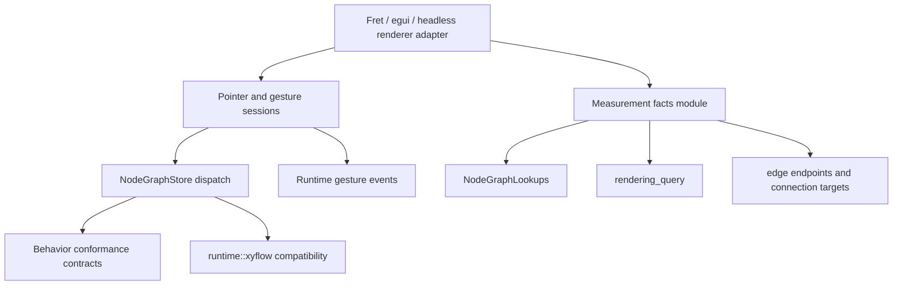

# refactor: Prioritize Fearless Refactor Options

## Summary

This plan prioritizes the remaining Jellyflow refactor options after comparing the current Rust implementation with `repo-ref/xyflow` and the existing 2026-06-10 plans. The highest-leverage work is not another split of `Graph` or `runtime::xyflow`; it is deepening the adapter-facing runtime modules that still force Fret, egui, or another headless renderer adapter to learn too many implementation details.

---

## Problem Frame

Jellyflow already has several deep modules: `Graph`, `GraphTransaction`, `NodeGraphStore`, `runtime::policy`, `runtime::rendering::RenderingQuery`, and the private `runtime::xyflow::projection::XyFlowCommitProjection`. Deletion tests show those modules earn their interfaces because removing them would push behavior into many callers.

The remaining friction is concentrated at the adapter seam. Pointer ownership, gesture lifecycle traces, renderer-neutral measurement facts, conformance scenario shape, and public-surface tests still expose more implementation than an adapter author should need.

---

## Requirements

- R1. Preserve accepted ADR decisions: `jellyflow-core` and `jellyflow-runtime` remain renderer-free, platform-free, and free of Fret UI dependencies.
- R2. Do not move persisted policy, layout, or presentation fields out of `jellyflow_core::core::Graph` without a new ADR-backed schema migration plan.
- R3. Keep `runtime::xyflow` as the explicit XyFlow compatibility module; do not promote XyFlow vocabulary into the canonical adapter interface.
- R4. Prioritize refactors that increase Depth at the adapter seam and improve Locality for tests.
- R5. Treat `NodeGraphStore::rendering_query` and `XyFlowCommitProjection` as existing deep modules; focus new work on remaining shallow interfaces.
- R6. Avoid fake seams such as a generic `RendererAdapter` trait, spatial-index adapter, or node-owned containment model until real adapter evidence justifies them.

---

## Key Technical Decisions

- KTD1. Start with pointer and gesture sessions: `drag::pointer_gesture`, `selection::pointer_claim`, `viewport::gesture::shared`, events, and adapter conformance all share pointer ownership and lifecycle ordering, but no one module owns the full behavior.
- KTD2. Treat measurement as the next major adapter-facing module: runtime already consumes node size and handle bounds, but adapters must currently supply those facts per call or rely on persisted size and fallback behavior.
- KTD3. Keep conformance JSON compatibility while raising the interface: `ConformanceAction` can remain the serialized shell, but adapter templates should prefer behavior contracts over hand-written trace choreography.
- KTD4. Defer public-surface diet until deeper modules exist: shrinking re-exports first would only move complexity into imports and examples.
- KTD5. Handle `GraphOpBuilderExt` as a small cleanup lane: it is shallow, but it is not on the adapter critical path.

---

## High-Level Technical Design

The design direction is fewer, deeper modules at the adapter seam. Adapters still own platform input capture, clocks, raw measurement collection, renderer integration, screenshots, and pixel tests. Runtime owns deterministic arbitration, lifecycle ordering, measurement-derived facts, rendering queries, and XyFlow-compatible projection where explicitly requested.

---

## Implementation Units

### U1. Characterize Pointer Ownership And Gesture Lifecycle

- **Goal:** Pin current pointer arbitration and gesture trace behavior before changing module shape.
- **Requirements:** R1, R3, R4.
- **Files:** `crates/jellyflow-runtime/src/runtime/drag/pointer_gesture.rs`, `crates/jellyflow-runtime/src/runtime/selection/pointer_claim.rs`, `crates/jellyflow-runtime/src/runtime/selection/node_drag_start.rs`, `crates/jellyflow-runtime/src/runtime/viewport/gesture/shared.rs`, `crates/jellyflow-runtime/src/runtime/events/*`, `crates/jellyflow-runtime/src/runtime/tests/{drag,selection,viewport}`, `templates/headless-adapter/src/lib.rs`.
- **Approach:** Build a behavior matrix for selection, node drag, connection, and viewport pan ownership under normalized pointer inputs and interaction state.
- **Test scenarios:** Selection key claims selection before viewport pan. Connection-in-progress rejects viewport drag-pan. Node drag wins only after drag threshold and policy allow it. Gesture start/update/end traces remain in current order for existing adapter conformance fixtures.
- **Verification:** Characterization tests pass before structural changes.

### U2. Deepen Pointer And Gesture Session Modules

- **Goal:** Move arbitration, lifecycle outcome, event emission, and store commit sequencing behind a runtime-owned session interface.
- **Requirements:** R1, R3, R4.
- **Dependencies:** U1.
- **Files:** `crates/jellyflow-runtime/src/runtime/drag/*`, `crates/jellyflow-runtime/src/runtime/selection/*`, `crates/jellyflow-runtime/src/runtime/connection/*`, `crates/jellyflow-runtime/src/runtime/viewport/gesture/*`, `crates/jellyflow-runtime/src/runtime/events/*`, `crates/jellyflow-runtime/src/runtime/conformance/*`, `templates/headless-adapter/src/lib.rs`.
- **Approach:** Keep pure planners as internal kernels or advanced entry points, but make normal adapter flows exercise a deeper session module for node drag, selection box, connection, and viewport pan.
- **Test scenarios:** Full node drag emits start, update, commit, and end through one session path. Viewport drag-pan rejects when selection or connection owns the pointer. Connection target resolution still consumes adapter-provided handle candidates. Existing conformance traces remain stable or are migrated to equivalent behavior contracts.
- **Verification:** Adapter template flows no longer need to hand-stitch gesture events and store calls for common pointer sessions.

### U3. Add Renderer-Neutral Measurement Facts

- **Goal:** Concentrate measured node size, handle inventory, lookup refresh, endpoint inputs, and rendering query inputs without introducing renderer dependencies or moving persisted schema.
- **Requirements:** R1, R2, R4, R6.
- **Dependencies:** U1; U2 only if sessions consume measured facts.
- **Files:** `crates/jellyflow-runtime/src/runtime/lookups/*`, `crates/jellyflow-runtime/src/runtime/utils/bounds.rs`, `crates/jellyflow-runtime/src/runtime/geometry/endpoints/*`, `crates/jellyflow-runtime/src/runtime/connection/target.rs`, `crates/jellyflow-runtime/src/runtime/rendering/*`, `crates/jellyflow-runtime/src/runtime/store/mod.rs`, `templates/headless-adapter/src/lib.rs`.
- **Approach:** Define non-persisted measurement facts that adapters can report after their own layout pass. Runtime uses those facts to update lookups and feed rendering, connection targeting, and edge endpoint resolution.
- **Test scenarios:** A measured size update changes visible-node and visible-edge culling consistently. A handle inventory update changes connection target resolution without adapter-side lookup rebuilding. Hidden or unmeasured nodes preserve existing fallback-size behavior. Measurement facts do not serialize into `Graph`.
- **Verification:** Fret or egui adapter code can report measurement once and reuse runtime-derived rendering and geometry results.

### U4. Deepen Conformance From Trace Choreography To Behavior Contracts

- **Goal:** Keep fixture compatibility while making adapter conformance describe behavior rather than every intermediate trace event.
- **Requirements:** R1, R3, R4.
- **Dependencies:** U2; U3 when measurement enters fixtures.
- **Files:** `crates/jellyflow-runtime/src/runtime/conformance/scenario/action.rs`, `crates/jellyflow-runtime/src/runtime/conformance/scenario/action/*`, `crates/jellyflow-runtime/src/runtime/conformance/runner/actions/*`, `crates/jellyflow-runtime/src/runtime/tests/conformance/*`, `crates/jellyflow-runtime/src/runtime/tests/adapter_conformance/*`, `templates/headless-adapter/src/lib.rs`.
- **Approach:** Preserve `ConformanceAction` as the serialized shell, but move scenario builders, payload conversion, runner execution, and assertions into dialect modules. Add higher-level scenario helpers for common adapter flows.
- **Test scenarios:** Existing JSON fixture suites deserialize and run with the same traces. A node drag behavior contract expands to the existing commit and callback trace. A rendering query assertion can compare one query result instead of four separate visible/order assertions.
- **Verification:** Adding a new adapter behavior is local to one conformance dialect plus the top-level serde shell.

### U5. Diet Public Surface And Shallow Core Helpers

- **Goal:** Remove or demote low-leverage public interfaces after deeper modules absorb behavior.
- **Requirements:** R1, R4, R5, R6.
- **Dependencies:** U2, U3, U4.
- **Files:** `crates/jellyflow-runtime/tests/public_surface.rs`, `crates/jellyflow-runtime/src/lib.rs`, `crates/jellyflow-runtime/src/runtime/mod.rs`, `crates/jellyflow-runtime/src/runtime/rendering/store.rs`, `crates/jellyflow-core/src/ops/build.rs`, `crates/jellyflow-core/src/lib.rs`, `crates/jellyflow-core/src/ops/tests/*`, `crates/jellyflow-runtime/src/runtime/tests/xyflow/callbacks/commit.rs`.
- **Approach:** Replace symbol-existence tests with adapter-flow tests. Keep old rendering helpers as thin wrappers only where needed. Migrate internal `GraphOpBuilderExt` call sites to `GraphMutationPlanner` and decide whether the trait stays as a legacy shim.
- **Test scenarios:** External adapter smoke still compiles against canonical runtime flows. Public-surface tests prove session, measurement, rendering query, conformance, and optional XyFlow compatibility are reachable without importing every low-level helper. `GraphMutationPlanner` tests keep cascade and undo snapshot behavior with explicit errors.
- **Verification:** Public API shape reflects deep modules, and shallow pass-through helpers no longer define the main interface.

---

## Scope Boundaries

- Do not split `Graph` into semantic, layout, policy, and presentation documents in this lane.
- Do not add `wgpu`, `winit`, egui, Fret UI, screenshots, or pixel tests to headless crates.
- Do not introduce a generic renderer adapter trait before at least two real adapters need the same interface.
- Do not implement a spatial index behind `NodeGraphSpatialIndexTuning` without workload evidence.
- Do not reopen XyFlow node-owned child containment without a new ADR.

---

## Risks & Dependencies

- **Adapter behavior drift:** Pointer sessions and conformance traces are adapter-visible. Mitigation: U1 characterization before U2 changes.
- **Schema creep:** Measurement work can accidentally become persisted model work. Mitigation: keep measurement facts runtime-owned and non-serialized unless a future ADR changes the model policy.
- **Fixture churn:** Conformance JSON is a public contract. Mitigation: keep compatibility tests for loading and running existing suites.
- **Over-abstraction:** A generic adapter interface would be premature. Mitigation: start from concrete Fret/egui-style adapter evidence and keep raw platform/rendering mechanics outside runtime.

---

## Sources & Research

- `CONTEXT.md`
- `README.md`
- `docs/adr/0001-jellyflow-headless-node-graph-engine-boundary.md`
- `docs/adr/0002-jellyflow-model-policy-boundary.md`
- `docs/adr/0003-headless-adapter-testing-and-renderer-boundary.md`
- `docs/adr/0004-resize-containment-and-lifecycle-boundary.md`
- `docs/plans/2026-06-10-001-refactor-runtime-interaction-dialects-plan.md`
- `docs/plans/2026-06-10-002-refactor-xyflow-commit-projection-plan.md`
- `docs/plans/2026-06-10-003-refactor-headless-adapter-depth-plan.md`
- `crates/jellyflow-runtime/src/runtime/drag/pointer_gesture.rs`
- `crates/jellyflow-runtime/src/runtime/selection/pointer_claim.rs`
- `crates/jellyflow-runtime/src/runtime/viewport/gesture/shared.rs`
- `crates/jellyflow-runtime/src/runtime/lookups/*`
- `crates/jellyflow-runtime/src/runtime/rendering/query.rs`
- `crates/jellyflow-runtime/src/runtime/xyflow/projection/commit.rs`
- `templates/headless-adapter/src/lib.rs`
- `repo-ref/xyflow/packages/system/src/xydrag/XYDrag.ts`
- `repo-ref/xyflow/packages/system/src/xyhandle/XYHandle.ts`
- `repo-ref/xyflow/packages/system/src/xypanzoom/XYPanZoom.ts`
- `repo-ref/xyflow/packages/system/src/utils/store.ts`
