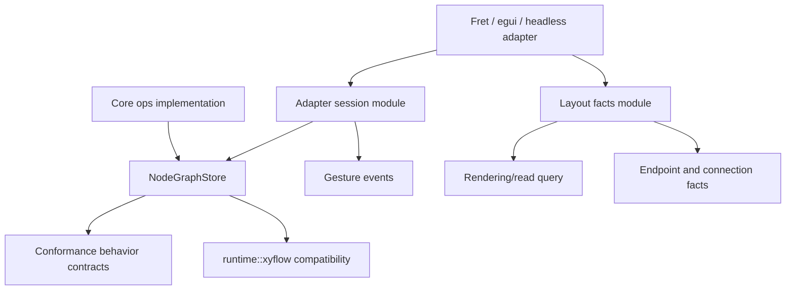

# refactor: Deepen Adapter Sessions And Layout Facts

## Summary

Jellyflow already has the right headless crate boundary and several deep modules: `Graph`,
`GraphTransaction`, `NodeGraphStore`, `runtime::gesture`, `runtime::measurement`,
`runtime::rendering::RenderingQuery`, and `runtime::xyflow`. The next fearless refactor should not
recreate xyflow's React package shape. It should make the ordinary adapter path deeper: sessions own
pointer lifecycle, layout facts own measurement-derived reads, conformance owns behavior contracts,
and low-level helpers become advanced implementation surfaces.

This plan covers the full refactor set from the architecture review, not a single selected
candidate. The sequencing keeps adapter-facing behavior stable first, then deepens runtime modules,
then tightens core implementation and public surface.

---

## Problem Frame

`repo-ref/xyflow` gives React and Svelte adapters relatively deep entry points over `@xyflow/system`:
store actions, drag/pan/handle modules, update-node-internals, and hook-like query facades. Jellyflow
has equivalent headless capabilities, but too many implementation details remain visible as peer
modules: planner calls, gesture event emission, lookup cache fields, measurement publication policy,
trace choreography, and GraphOp behavior matrices.

The desired refactor increases Depth at the adapter seam while preserving the ADRs: no renderer
dependency in headless crates, no `Graph` schema split, no node-owned XyFlow containment in v1, and
no generic renderer adapter trait before multiple real adapters prove the seam.

---

## Requirements

- R1. Preserve renderer-free, platform-free `jellyflow-core` and `jellyflow-runtime` boundaries.
- R2. Keep `Graph` as the v1 persisted document shape; measurement facts remain runtime-owned and
  non-serialized.
- R3. Make the default adapter path go through deep session and layout-fact modules rather than
  hand-stitching planners, dispatch, lookup cache, and gesture events.
- R4. Preserve existing `runtime::xyflow` compatibility as an explicit compatibility module, not the
  canonical Jellyflow adapter interface.
- R5. Keep fixture JSON compatibility and `DispatchTransaction` as a low-level conformance escape
  hatch.
- R6. Improve test locality: adapter tests should target behavior contracts and store/read-model
  outcomes rather than individual implementation traces where possible.

---

## Scope Boundaries

In scope:

- Adapter-facing runtime refactors under `runtime::gesture`, `runtime::measurement`,
  `runtime::lookups`, `runtime::rendering`, `runtime::fit_view`, and `runtime::conformance`.
- Core `ops` internal deepening where storage invariants and GraphOp behavior matrices create
  recurring drift.
- Public-surface test cleanup after deeper modules exist.

Out of scope:

- Moving persisted policy, layout, or presentation fields out of `Graph`.
- Adding `wgpu`, `winit`, egui, Fret UI, DOM, screenshot, or pixel dependencies to headless crates.
- Adding XyFlow node-owned containment or parent-local coordinates to Jellyflow v1.
- Introducing a public generic `RendererAdapter` trait.
- Implementing a real spatial index before adapter or workload evidence proves the need.

### Deferred to Follow-Up Work

- Renderer smoke harnesses in future adapter crates.
- Real spatial indexing behind `NodeGraphSpatialIndexTuning` after workload evidence exists.
- First-class node-owned containment or parent-local coordinate migration after a separate ADR.
- Removing public compatibility shims before external adapter smoke proves replacements are usable.

---

## Key Technical Decisions

- KTD1. Start with behavior characterization because session and measurement changes are adapter
  visible.
- KTD2. Treat `runtime::gesture` as the existing session nucleus. The refactor should deepen it, not
  replace it with a parallel abstraction.
- KTD3. Treat measurement plus lookup cache as one layout-facts implementation. Public callers should
  consume derived rendering, endpoint, and connection facts without depending on cache shape.
- KTD4. Keep conformance JSON as a compatibility shell while raising fixture authors toward behavior
  contracts.
- KTD5. Delay public surface diet until the deeper modules exist; shrinking exports first only moves
  complexity into examples and adapters.

---

## High-Level Technical Design

The refactor deepens adapter-facing modules first, then tightens core implementation modules that
would otherwise keep producing cross-file drift.

---

## Phased Delivery

### Phase 1: Lock Behavior Before Movement

U1 is the safety net. It should land before any structural refactor so later units can move code
without guessing whether callback order, measurement effects, or rendering reads changed.

### Phase 2: Deepen Runtime Adapter Seams

U2, U3, U4, and U5 are the adapter-facing refactor. They should land in that order because sessions
and layout facts are the behavior sources that conformance and read-model contracts should exercise.

### Phase 3: Tighten Core And Public Surface

U6 and U7 are cleanup and deepening after the adapter seam becomes clear. They are valuable, but
they should not block Fret or egui adapter ergonomics unless implementation discovers core drift that
prevents safe runtime work.

---

## Success Metrics

- New adapter examples prefer session, layout-facts, read-model, and conformance behavior paths over
  planner-plus-dispatch choreography.
- Measurement changes can drive redraw or re-query decisions through store publication without
  adapters reading lookup cache fields directly.
- Existing fixture JSON continues to load, run, and approve.
- `Graph` serialization remains unchanged after measurement operations.
- Adding a new GraphOp setter or adapter behavior has a smaller, obvious implementation surface than
  today.

---

## System-Wide Impact

This refactor touches public or semi-public adapter contracts in `jellyflow-runtime`, public core
exports in `jellyflow-core`, and the external headless adapter template. The intended behavior is
compatibility-preserving, but reviewers should treat callback order, store event order, fixture JSON,
and root re-exports as externally visible until proven otherwise.

The plan deliberately avoids changing persistence shape or dependency boundaries. Any implementation
that needs `Graph` schema changes, renderer dependencies, or node-owned containment must stop and
produce a separate ADR before continuing.

---

## Implementation Units

### U1. Characterize Current Adapter-Facing Behavior

**Goal:** Lock the current pointer, measurement, rendering, and conformance behavior before moving
module seams.

**Requirements:** R1, R3, R6.

**Dependencies:** None.

**Files:** `crates/jellyflow-runtime/src/runtime/tests/gesture.rs`,
`crates/jellyflow-runtime/src/runtime/tests/measurement.rs`,
`crates/jellyflow-runtime/src/runtime/tests/rendering.rs`,
`crates/jellyflow-runtime/src/runtime/tests/adapter_conformance/*`,
`templates/headless-adapter/src/lib.rs`.

**Approach:** Add missing characterization around pointer claim priority, measurement change
publication expectations, rendering query parity, and template behavior coverage. Do not restructure
code in this unit.

**Patterns to follow:** Existing `InteractionHarness` tests and `Conformance*SessionContract`
helpers.

**Test scenarios:** Selection and connection states suppress viewport pan consistently. Node drag,
viewport pan, resize, and connect sessions emit the existing start/commit/update/end order.
Reporting measurement once affects rendering visibility, edge endpoints, and connection target
resolution consistently. Existing template smoke scenarios still pass.

**Verification:** Characterization tests fail if current adapter-visible behavior changes.

### U2. Deepen Adapter Session Module

**Goal:** Make `runtime::gesture` the ordinary adapter-facing Module for pointer ownership, lifecycle
events, and store commit sequencing.

**Requirements:** R1, R3, R4, R6.

**Dependencies:** U1.

**Files:** `crates/jellyflow-runtime/src/runtime/gesture.rs`,
`crates/jellyflow-runtime/src/runtime/drag/store.rs`,
`crates/jellyflow-runtime/src/runtime/resize/store.rs`,
`crates/jellyflow-runtime/src/runtime/selection/*`,
`crates/jellyflow-runtime/src/runtime/connection/*`,
`crates/jellyflow-runtime/src/runtime/viewport/gesture/*`,
`crates/jellyflow-runtime/src/runtime/events/*`,
`crates/jellyflow-runtime/src/runtime/tests/gesture.rs`,
`templates/headless-adapter/src/lib.rs`.

**Approach:** Route ordinary node drag, selection, connection, viewport pan, and resize flows through
session-level store methods. Keep pure planners as lower-level kernels for tests and advanced users,
but make adapter examples and conformance contracts prefer sessions.

**Patterns to follow:** Existing `NodeDragSession`, `ConnectEdgeSession`,
`ViewportDragPanSession`, and `NodeResizeSession` behavior.

**Test scenarios:** A committed node drag emits one start, one commit, one update, and one end. A
rejected or no-op session emits a stable end outcome without graph mutation. Viewport drag-pan
returns the same rejection reasons as the existing gesture resolver. Resize session ordering remains
compatible with existing XyFlow callback projection tests.

**Verification:** Adapter template no longer needs to hand-stitch common pointer session traces.

### U3. Deepen Layout Facts And Measurement Publication

**Goal:** Concentrate non-persisted measurement facts, lookup invalidation, derived rendering facts,
endpoint facts, connection target facts, and change notification.

**Requirements:** R1, R2, R3, R6.

**Dependencies:** U1.

**Files:** `crates/jellyflow-runtime/src/runtime/measurement.rs`,
`crates/jellyflow-runtime/src/runtime/lookups/mod.rs`,
`crates/jellyflow-runtime/src/runtime/lookups/types/node.rs`,
`crates/jellyflow-runtime/src/runtime/rendering/query.rs`,
`crates/jellyflow-runtime/src/runtime/store/events.rs`,
`crates/jellyflow-runtime/src/runtime/store/subscriptions/*`,
`crates/jellyflow-runtime/src/runtime/tests/measurement.rs`,
`templates/headless-adapter/src/lib.rs`.

**Approach:** Treat measurement updates as store-visible layout-fact changes while keeping them out
of `Graph`. Hide lookup cache shape behind query methods, and make changed measurement facts notify
the same observer paths adapters use for redraw or re-query decisions.

**Patterns to follow:** Existing `NodeMeasurement`, `RenderingQueryResult`, store selector
subscriptions, and xyflow `updateNodeInternals` behavior as a comparison point.

**Test scenarios:** Reporting changed measurement facts notifies subscribers; reporting identical
facts does not. Clearing measurement facts invalidates derived rendering and endpoint facts. Measured
handle inventory updates connection target resolution without exposing lookup fields. Graph JSON is
unchanged after all measurement operations.

**Verification:** A headless adapter can report measurement once and rely on runtime-derived
rendering, endpoint, and connection facts without direct lookup cache knowledge.

### U4. Collapse Renderer-Facing Reads Into One Read Path

**Goal:** Reduce parallel read interfaces around rendering, fit-view, bounds, endpoints, and viewport
helpers.

**Requirements:** R3, R6.

**Dependencies:** U3.

**Files:** `crates/jellyflow-runtime/src/runtime/rendering/store.rs`,
`crates/jellyflow-runtime/src/runtime/rendering/query.rs`,
`crates/jellyflow-runtime/src/runtime/fit_view/*`,
`crates/jellyflow-runtime/src/runtime/geometry/*`,
`crates/jellyflow-runtime/src/runtime/utils/*`,
`crates/jellyflow-runtime/src/runtime/tests/rendering.rs`,
`crates/jellyflow-runtime/src/runtime/tests/measurement.rs`,
`templates/headless-adapter/src/lib.rs`.

**Approach:** Make the store/read-model path the primary way to ask for renderer-facing facts:
order, visibility, endpoint positions, and fit-view targets. Keep low-level math helpers available
where they are useful, but make examples and adapter conformance prefer the deeper read path.

**Patterns to follow:** Existing `NodeGraphStore::rendering_query` and measurement smoke coverage.

**Test scenarios:** The unified read path agrees with current visible node/edge helper outputs.
Measured and persisted node sizes produce the same fit-view behavior when their effective bounds
match. Invalid viewport transforms still reject or return empty results consistently. Adapter
template rendering scenarios can be expressed with one query result.

**Verification:** Renderer-facing examples do not need to recombine `lookups`, utility bounds, and
rendering helper functions manually.

### U5. Raise Conformance To Behavior Contracts

**Goal:** Keep fixture JSON compatibility while reducing trace choreography in adapter-facing tests.

**Requirements:** R5, R6.

**Dependencies:** U2, U3, U4.

**Files:** `crates/jellyflow-runtime/src/runtime/conformance/scenario/action.rs`,
`crates/jellyflow-runtime/src/runtime/conformance/scenario/behavior.rs`,
`crates/jellyflow-runtime/src/runtime/conformance/runner/actions/*`,
`crates/jellyflow-runtime/src/runtime/tests/conformance/*`,
`crates/jellyflow-runtime/src/runtime/tests/adapter_conformance/*`,
`templates/headless-adapter/src/lib.rs`.

**Approach:** Preserve the top-level `ConformanceAction` serialized shell and low-level transaction
escape hatch. Add or extend behavior contracts for common adapter flows so fixtures describe intent
and the runtime expands expected traces through the same session/read modules adapters should use.

**Patterns to follow:** Existing node drag, connect edge, and viewport drag-pan session contracts.

**Test scenarios:** Existing JSON fixtures still deserialize, run, and approve. Behavior contracts
expand to the same traces as existing hand-written fixtures. Measurement and rendering contracts
cover one report-once/read-many adapter flow. Rejected session contracts report stable rejection
reasons without requiring raw op traces.

**Verification:** Adding a new adapter behavior is local to one conformance dialect and the serde
shell.

### U6. Deepen Core Ops Implementation Where It Blocks Runtime Locality

**Goal:** Concentrate storage invariants, diff cascade state, and GraphOp behavior so runtime
refactors do not keep synchronizing low-level graph rules across files.

**Requirements:** R1, R2, R6.

**Dependencies:** U1.

**Files:** `crates/jellyflow-core/src/ops/apply/*`,
`crates/jellyflow-core/src/ops/mutation/*`,
`crates/jellyflow-core/src/ops/diff/*`,
`crates/jellyflow-core/src/ops/history/invert/*`,
`crates/jellyflow-core/src/ops/normalize/*`,
`crates/jellyflow-core/src/ops/transaction/op.rs`,
`crates/jellyflow-core/src/ops/tests/*`.

**Approach:** Keep public `Graph` and `GraphOp` shapes stable. Move repeated storage invariant
handling and GraphOp field-family behavior into private implementation modules. Treat
`GraphOpBuilderExt` as a cleanup after the deeper implementation exists.

**Patterns to follow:** Existing `GraphMutationPlanner`, `graph_diff`, normalization, and history
tests.

**Test scenarios:** Port removal, node removal, edge cascades, group detach, and port order restore
stay apply-safe and reversible. `graph_diff` output remains stable for removals and structural port
replacement. Setter no-op/coalesce/invert behavior remains consistent across node, port, edge,
group, sticky note, symbol, and import operations.

**Verification:** Adding a new GraphOp setter no longer requires unrelated drift-prone edits across
apply, invert, noop, coalesce, and diff modules.

### U7. Diet Public Surface After Deep Modules Land

**Goal:** Make canonical adapter paths obvious while retaining low-level power for advanced users.

**Requirements:** R3, R4, R5, R6.

**Dependencies:** U2, U3, U4, U5, U6.

**Files:** `crates/jellyflow-core/src/lib.rs`,
`crates/jellyflow-core/src/ops/build.rs`,
`crates/jellyflow-runtime/src/lib.rs`,
`crates/jellyflow-runtime/src/runtime/mod.rs`,
`crates/jellyflow-runtime/tests/public_surface.rs`,
`templates/headless-adapter/src/lib.rs`,
`README.md`,
`CONTEXT.md`.

**Approach:** Update public-surface tests from symbol-existence checks toward adapter-flow reachability.
Keep compatibility shims where downstream examples need them, but stop presenting shallow helpers as
canonical entry points.

**Patterns to follow:** Current dependency smoke scripts and headless adapter template gates.

**Test scenarios:** External adapter smoke still compiles against canonical session, layout-facts,
read-model, conformance, and optional xyflow compatibility paths. `GraphOpBuilderExt` either remains
as an explicitly legacy shim or is removed from root re-exports after callers migrate. Documentation
points new adapters at deep modules first.

**Verification:** Public API shape communicates the intended adapter seam without hiding advanced
low-level modules from expert users.

---

## Risks & Dependencies

- **Adapter behavior drift:** Session changes can reorder callbacks or store events. Mitigation:
  characterization tests before structural edits.
- **Schema creep:** Layout facts can accidentally become persisted graph state. Mitigation: tests
  assert graph serialization is unchanged after measurement operations.
- **Fake seam risk:** A generic renderer adapter trait would be premature. Mitigation: use concrete
  Fret/egui adapter evidence before introducing any public adapter trait.
- **Fixture churn:** Conformance JSON is an external contract. Mitigation: compatibility load/run
  and approval tests stay mandatory.
- **Core blast radius:** Core ops deepening can destabilize undo/diff/apply semantics. Mitigation:
  work behind existing public interfaces and keep focused regression tests per graph resource.

---

## Sources & Research

- `CONTEXT.md`
- `docs/adr/0001-jellyflow-headless-node-graph-engine-boundary.md`
- `docs/adr/0002-jellyflow-model-policy-boundary.md`
- `docs/adr/0003-headless-adapter-testing-and-renderer-boundary.md`
- `docs/adr/0004-resize-containment-and-lifecycle-boundary.md`
- `docs/reviews/xyflow-gap-2026-06-02.md`
- `docs/plans/2026-06-10-004-fearless-refactor-options-plan.md`
- `repo-ref/xyflow/packages/system/src/xydrag/XYDrag.ts`
- `repo-ref/xyflow/packages/system/src/xyhandle/XYHandle.ts`
- `repo-ref/xyflow/packages/system/src/xypanzoom/XYPanZoom.ts`
- `repo-ref/xyflow/packages/system/src/utils/store.ts`
- `repo-ref/xyflow/packages/react/src/store/index.ts`
- `repo-ref/xyflow/packages/react/src/hooks/useReactFlow.ts`
- `crates/jellyflow-runtime/src/runtime/gesture.rs`
- `crates/jellyflow-runtime/src/runtime/measurement.rs`
- `crates/jellyflow-runtime/src/runtime/rendering/query.rs`
- `crates/jellyflow-core/src/ops/*`
