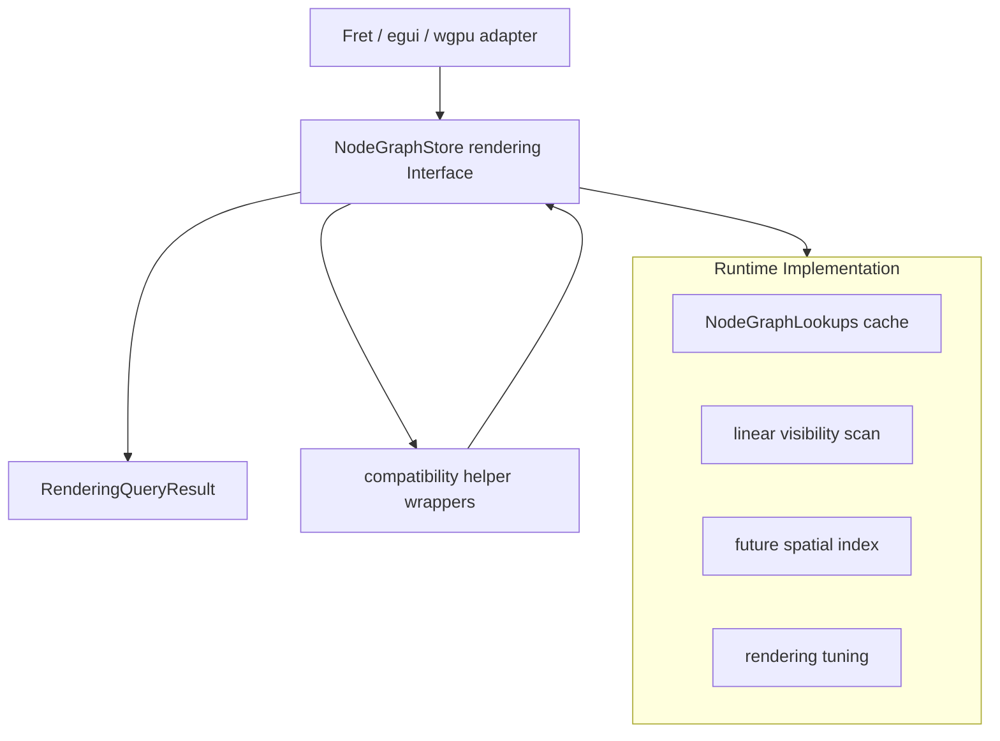

# refactor: Deepen Rendering Lookup Read Module

## Summary

Deepen Jellyflow's rendering and lookup read Module so adapters depend on a small store-level Interface for render order, visibility, and layout-derived facts, while lookup caches, linear scans, future spatial indexing, and low-level resolver helpers stay in the Implementation. This is the top recommendation from the architecture review because it improves Locality before real egui, Fret, or wgpu adapters begin depending on cache shape.

---

## Problem Frame

`NodeGraphStore::rendering_query` already points in the right direction: an adapter asks what to render and in what order, without learning how Jellyflow computes it. The shallow part is the surrounding public surface. `NodeGraphLookups` exposes `node_lookup`, `edge_lookup`, and `connection_lookup` as public fields, `NodeGraphStore::lookups()` gives callers the cache, and `runtime::rendering` still exposes low-level resolver functions that require callers to assemble `Graph`, `NodeGraphLookups`, `NodeGraphViewState`, fallback sizing, node-origin policy, and culling options.

That shape makes the current Implementation visible at the Adapter Seam. It also makes the placeholder spatial-index and paint-cache tuning look like stable public commitments before the runtime has a real index backend or adapter workload.

---

## Requirements

- R1. Preserve the renderer-free and platform-free boundaries of `jellyflow-core` and `jellyflow-runtime`.
- R2. Keep `Graph`, `GraphTransaction`, `NodeGraphPatch`, and `NodeGraphStore` as the canonical model and mutation path.
- R3. Make store-level rendering results the preferred Adapter Interface for visible node ids, visible edge ids, render order, and combined rendering queries.
- R4. Keep lookup maps and scan/index selection as runtime Implementation details unless a specific advanced Interface is justified by adapter evidence.
- R5. Preserve existing behavior for visible node ids, visible edge ids, selected elevation, hidden policy, node-origin handling, fallback size semantics, and render ordering.
- R6. Keep `runtime::xyflow` compatibility isolated; do not promote XyFlow React array or DOM vocabulary into the canonical rendering read Module.
- R7. Do not implement a real spatial index in this slice; only reshape the Seam so one can be added later without adapter churn.

---

## Scope Boundaries

In scope:

- Rendering and lookup public-surface cleanup under `crates/jellyflow-runtime/src/runtime/rendering/`, `crates/jellyflow-runtime/src/runtime/lookups/`, and store read helpers.
- Characterization and contract tests for `NodeGraphStore::rendering_query`, compatibility wrappers, and template adapter behavior.
- Documentation updates that steer adapters toward store-level rendering reads.
- Tuning visibility review for `NodeGraphSpatialIndexTuning` and `NodeGraphPaintCachePruneTuning` without changing persisted config semantics unless an ADR is added.

Out of scope:

- Adding `wgpu`, `winit`, egui, DOM, screenshot, or pixel-test dependencies to headless crates.
- Replacing the linear visibility scan with a spatial index.
- Moving persisted policy, layout, or presentation fields out of `Graph`.
- Redesigning `runtime::xyflow` apply/projection/callback modules.
- Adding a generic public `RendererAdapter` trait.

---

## Key Technical Decisions

- KTD1. Store-level rendering queries are the primary Adapter Seam: adapters should consume `NodeGraphStore` rendering results rather than call resolver functions with cache internals.
- KTD2. `NodeGraphLookups` remains a real Module, but its map shape should be treated as Implementation. The deletion test says deleting the cache is bad; deleting public cache dependence is good.
- KTD3. Low-level resolver functions can remain available only where they serve internal tests, advanced runtime composition, or deliberate compatibility shims. They should not be the normal external adapter path.
- KTD4. Spatial index and paint-cache tuning stay behavior-neutral in this plan. Reshaping the Seam comes before changing the backend.
- KTD5. Public-surface tests should verify adapter flows and compatibility promises, not every helper symbol that happens to be public today.

---

## High-Level Technical Design

The target shape is one deep read Module at the adapter seam. Adapters still own renderer integration and drawing. Jellyflow owns deterministic render order, culling input, hidden policy, selected elevation, and the Implementation choice between current linear scans and future indexing.

---

## Implementation Units

### U1. Characterize Current Rendering Read Contracts

- **Goal:** Pin the behavior that must survive the refactor before narrowing the public surface.
- **Requirements:** R1, R3, R5.
- **Files:** `crates/jellyflow-runtime/src/runtime/tests/rendering.rs`, `crates/jellyflow-runtime/tests/public_surface.rs`, `templates/headless-adapter/src/lib.rs`, `templates/headless-adapter/tests/conformance.rs`.
- **Patterns:** Follow existing rendering tests that compare `rendering_query` with `visible_node_ids`, `visible_node_render_order`, `visible_edge_ids`, and `visible_edge_render_order`.
- **Test Scenarios:** `rendering_query` matches existing visible-node helper results with culling enabled. `rendering_query` preserves selected-node and selected-edge elevation ordering. Unsized nodes with reported measurements participate in visibility, while unmeasured unsized nodes do not. Template adapter smoke still proves visible node and edge behavior through public store APIs.
- **Verification:** Characterization tests fail if behavior drifts before any public-surface narrowing begins.

### U2. Make Store Rendering Query The Preferred Adapter Interface

- **Goal:** Route adapter-facing examples, template code, and public-surface assertions through the deep store read Module.
- **Requirements:** R2, R3, R5, R6.
- **Dependencies:** U1.
- **Files:** `crates/jellyflow-runtime/src/runtime/rendering/store.rs`, `crates/jellyflow-runtime/tests/public_surface.rs`, `templates/headless-adapter/src/lib.rs`, `crates/jellyflow-runtime/README.md`, `README.md`.
- **Patterns:** Use the existing `NodeGraphStore::rendering_query` and specific store wrappers as compatibility affordances while steering new adapter code to the aggregate result.
- **Test Scenarios:** Public-surface coverage constructs a store and reads rendering results without direct `NodeGraphLookups` access. The template adapter demonstrates one store-level render query for visible ids and order. README examples describe the store read Module instead of low-level resolver assembly.
- **Verification:** Existing rendering behavior remains unchanged, and examples no longer teach adapters to depend on lookup cache fields.

### U3. Hide Lookup Cache Shape Behind Runtime Methods

- **Goal:** Reduce accidental dependence on `NodeGraphLookups` public fields without deleting the internal cache Module.
- **Requirements:** R3, R4, R5.
- **Dependencies:** U1, U2.
- **Files:** `crates/jellyflow-runtime/src/runtime/lookups/mod.rs`, `crates/jellyflow-runtime/src/runtime/lookups/types/*`, `crates/jellyflow-runtime/src/runtime/store/*`, `crates/jellyflow-runtime/src/runtime/selection/*`, `crates/jellyflow-runtime/src/runtime/rendering/*`, `crates/jellyflow-runtime/src/runtime/measurement.rs`.
- **Patterns:** Keep internal modules free to access cache details; expose behavior-shaped reads for external callers only where a real Adapter need exists.
- **Test Scenarios:** Internal selection, measurement, connection, and rendering tests still pass through runtime-owned access. External-facing tests do not destructure lookup maps. Removing a node or port still prunes measured handles and connection lookup entries.
- **Verification:** Cache map type or index backend could change without editing adapter template code.

### U4. Reclassify Low-Level Rendering Resolvers

- **Goal:** Decide which `runtime::rendering` resolver functions are internal kernels, advanced public tools, or compatibility wrappers.
- **Requirements:** R3, R4, R5, R7.
- **Dependencies:** U2, U3.
- **Files:** `crates/jellyflow-runtime/src/runtime/rendering/{mod,visibility,order,query,store}.rs`, `crates/jellyflow-runtime/src/runtime/tests/rendering.rs`, `crates/jellyflow-runtime/tests/public_surface.rs`.
- **Patterns:** Preserve pure kernels where they keep Implementation testable, but avoid making adapters assemble `Graph + NodeGraphLookups + NodeGraphViewState` for normal rendering reads.
- **Test Scenarios:** Pure kernel tests cover edge cases not reachable through store setup. Public-surface tests cover only intentional external functions. Store-level wrappers remain behavior-equivalent to the kernels.
- **Verification:** The public Interface is smaller or clearly tiered, while Implementation tests still have enough locality to catch math regressions.

### U5. Review Rendering Tuning Commitments

- **Goal:** Prevent placeholder tuning from freezing an unimplemented backend contract.
- **Requirements:** R1, R4, R7.
- **Dependencies:** U3, U4.
- **Files:** `crates/jellyflow-runtime/src/io/tuning/spatial_index.rs`, `crates/jellyflow-runtime/src/io/tuning/paint_cache.rs`, `crates/jellyflow-runtime/src/io/tuning/runtime.rs`, `crates/jellyflow-runtime/src/io/tests/*`, `docs/adr/README.md`.
- **Patterns:** Treat tuning fields as configuration payloads, not proof that a backend exists. If compatibility risk appears, document rather than silently remove persisted fields.
- **Test Scenarios:** Config serialization and defaults remain stable. Runtime rendering behavior does not depend on a nonexistent spatial index. Documentation names spatial indexing as deferred until adapter workload evidence exists.
- **Verification:** Future index work can happen behind the rendering read Module without changing adapter-facing code.

---

## Risks & Dependencies

- Public callers may already depend on `NodeGraphStore::lookups()` or `NodeGraphLookups` fields. Mitigate with a compatibility window or explicit advanced-read docs before removal.
- The template adapter is not part of the workspace test run. Keep `tools/check_external_consumer_smoke.py` aligned so external consumer coverage continues to exercise the preferred Interface.
- If tuning fields are persisted, removing or renaming them may require an ADR. This plan should avoid schema churn unless the implementation uncovers a hard compatibility problem.

---

## Sources / Research

- `CONTEXT.md`: headless product intent, crate boundaries, XyFlow compatibility isolation, and refactor guardrails.
- `docs/adr/0001-jellyflow-headless-node-graph-engine-boundary.md`: renderer/platform dependencies stay outside headless crates.
- `docs/adr/0003-headless-adapter-testing-and-renderer-boundary.md`: adapter conformance and renderer smoke split.
- `docs/reviews/xyflow-gap-2026-06-02.md`: XyFlow gap review and intentional non-goals.
- `repo-ref/xyflow/packages/react/src/hooks/useVisibleNodeIds.ts`: React visible-node consumer shape.
- `repo-ref/xyflow/packages/system/src/utils/store.ts`: XyFlow lookup and measurement lifecycle reference.
- `crates/jellyflow-runtime/src/runtime/rendering/store.rs`: current store-level rendering read methods.
- `crates/jellyflow-runtime/src/runtime/lookups/mod.rs`: current public cache shape.
- `crates/jellyflow-runtime/src/runtime/measurement.rs`: measurement facts feeding rendering, connection targets, and edge endpoints.
