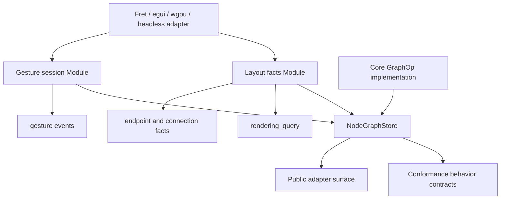

# refactor: Prioritize Adapter Seam Deepening

## Summary

Deepen the remaining adapter-facing Jellyflow Modules in priority order after the rendering lookup
read Module has been tightened. The sequence starts with layout facts because Rust self-drawn
adapters and headless renderers need reliable report-once/read-many behavior before pointer session
and conformance cleanup can pay off fully.

---

## Problem Frame

`NodeGraphStore::rendering_query` is now the preferred adapter Interface for ordering and
visibility. The next shallow seams are measurement/layout facts, pointer gesture sessions,
conformance behavior contracts, core `GraphOp` field-family implementation, and public surface
cleanup.

The main risk is doing these in the wrong order. Public-surface diet before deeper Modules only
moves complexity into examples. Gesture-session changes before characterization risk callback-order
drift. Core ops cleanup is valuable, but it is not the first blocker for Fret, egui, wgpu, or other
self-drawn adapters.

---

## Requirements

- R1. Preserve renderer-free, platform-free `jellyflow-core` and `jellyflow-runtime` boundaries.
- R2. Keep `Graph` as the v1 persisted document shape; measurement and layout facts remain
  runtime-owned and non-serialized.
- R3. Make ordinary adapter flows cross deep store/session/read Interfaces instead of assembling
  planner calls, lookup cache state, and trace choreography.
- R4. Preserve `runtime::xyflow` as explicit compatibility vocabulary, not the canonical Jellyflow
  adapter Interface.
- R5. Preserve existing callback ordering, conformance JSON compatibility, store dispatch behavior,
  undo/redo, and graph serialization.
- R6. Improve test locality so adapter-facing behavior is verified through the same Interfaces
  adapters should use.
- R7. Keep scene-wide renderer read plans speculative until at least one concrete adapter repeatedly
  needs those facts together.

---

## Priority Order

| Priority | Candidate | Why now |
| --- | --- | --- |
| P1 | Layout facts and measurement publication | Direct continuation of rendering query work; unlocks self-drawn adapter redraw and derived geometry reads. |
| P2 | Pointer arbitration and gesture sessions | High adapter value, but callback and rejection behavior must be characterized before movement. |
| P3 | Conformance behavior contracts | Best after sessions and layout facts exist, so contracts describe the new deep Interfaces. |
| P4 | Core `GraphOp` field-family implementation | Important locality work, but not the first adapter seam blocker. |
| P5 | Public surface diet and scene facts | Should follow deeper Modules and concrete adapter evidence. |

---

## Key Technical Decisions

- KTD1. Layout facts come before pointer sessions: measurement-derived rendering, endpoint, and
  connection facts are already used by the template adapter and have lower callback-order risk.
- KTD2. Characterization precedes each behavior-visible refactor: pointer sessions and measurement
  publication affect adapters and conformance traces.
- KTD3. Store-level read Modules remain the canonical adapter seam: lower-level kernels can stay
  internal or advanced, but examples and public-surface tests should teach the deep Interface.
- KTD4. Conformance action JSON remains a compatibility shell: behavior contracts can grow without
  breaking existing fixture files.
- KTD5. Core ops deepening keeps public `GraphOp` and `GraphTransaction` stable: the refactor should
  concentrate implementation behavior, not change serialized operations.
- KTD6. Public surface diet is last: only remove or demote exports after replacement Interfaces are
  real and covered by external adapter smoke tests.

---

## High-Level Technical Design

The target shape is one deeper adapter seam per behavior family. Adapters still own platform input
capture, renderer measurement collection, clocks, renderer integration, screenshots, and pixels.
Jellyflow owns deterministic runtime sequencing, layout-derived facts, conformance contracts, and
graph operation semantics.

---

## Implementation Units

### U1. Characterize Layout-Fact Derived Behavior

- **Goal:** Lock current measurement effects before changing publication or read-model shape.
- **Priority:** P1.
- **Execution note:** Characterization-first.
- **Requirements:** R1, R2, R5, R6.
- **Files:** `crates/jellyflow-runtime/src/runtime/tests/measurement.rs`,
  `crates/jellyflow-runtime/src/runtime/tests/rendering.rs`,
  `templates/headless-adapter/src/lib.rs`.
- **Patterns to follow:** Existing `measured_size_feeds_rendering_query_without_persisting_graph_size`
  and `run_measurement_smoke`.
- **Test scenarios:** Reported size affects `rendering_query` visibility without persisting into
  `Graph`. Reported handles affect edge endpoints and connection target resolution. Clearing
  measurement removes derived facts. Invalid measurement input stays rejected.
- **Verification:** Current report-once/read-many behavior is covered before store publication
  changes.

### U2. Publish Layout-Fact Changes Through Store Observation

- **Goal:** Make changed measurement facts visible to the same observer paths adapters use for
  redraw or re-query decisions.
- **Priority:** P1.
- **Execution note:** Test-first for new publication behavior.
- **Requirements:** R2, R3, R5, R6.
- **Dependencies:** U1.
- **Files:** `crates/jellyflow-runtime/src/runtime/measurement.rs`,
  `crates/jellyflow-runtime/src/runtime/store/events.rs`,
  `crates/jellyflow-runtime/src/runtime/store/subscriptions/*`,
  `crates/jellyflow-runtime/src/runtime/tests/measurement.rs`,
  `crates/jellyflow-runtime/src/runtime/tests/store/subscriptions.rs`.
- **Patterns to follow:** Existing selector subscription and view/config notification tests.
- **Test scenarios:** Reporting changed measurement facts notifies selectors or an equivalent store
  observer. Reporting identical facts does not notify. Clearing existing facts notifies. Missing or
  invalid measurement does not publish.
- **Verification:** An adapter can subscribe once and know when layout-derived rendering, endpoint,
  or connection facts should be re-read.

### U3. Deepen Layout Facts Read Methods

- **Goal:** Concentrate measurement-derived rendering, endpoint, and connection reads behind a
  smaller store-level layout-facts Interface.
- **Priority:** P1.
- **Requirements:** R2, R3, R6.
- **Dependencies:** U2.
- **Files:** `crates/jellyflow-runtime/src/runtime/measurement.rs`,
  `crates/jellyflow-runtime/src/runtime/rendering/store.rs`,
  `crates/jellyflow-runtime/src/runtime/geometry/*`,
  `crates/jellyflow-runtime/src/runtime/connection/*`,
  `crates/jellyflow-runtime/tests/public_surface.rs`,
  `templates/headless-adapter/src/lib.rs`,
  `README.md`,
  `crates/jellyflow-runtime/README.md`.
- **Patterns to follow:** `NodeGraphStore::rendering_query` and the headless adapter measurement
  smoke.
- **Test scenarios:** Template adapter reports measurements once, then reads rendering, endpoint,
  and connection facts through store-level methods. Public-surface tests avoid lookup fields and
  low-level utility assembly. Graph serialization remains unchanged after measurement operations.
- **Verification:** Adapter examples no longer teach direct lookup or utility recomposition for
  layout-derived facts.

### U4. Characterize Pointer Arbitration And Gesture Lifecycle

- **Goal:** Pin current session claim priority, rejection reasons, and gesture trace ordering.
- **Priority:** P2.
- **Execution note:** Characterization-first.
- **Requirements:** R1, R3, R4, R5, R6.
- **Files:** `crates/jellyflow-runtime/src/runtime/gesture.rs`,
  `crates/jellyflow-runtime/src/runtime/drag/pointer_gesture.rs`,
  `crates/jellyflow-runtime/src/runtime/selection/pointer_claim.rs`,
  `crates/jellyflow-runtime/src/runtime/viewport/gesture/shared.rs`,
  `crates/jellyflow-runtime/src/runtime/tests/gesture.rs`,
  `crates/jellyflow-runtime/src/runtime/tests/adapter_conformance/*`,
  `templates/headless-adapter/src/lib.rs`.
- **Patterns to follow:** Existing `ConformanceNodeDragSessionContract`,
  `ConformanceViewportDragPanSessionContract`, and gesture runner tests.
- **Test scenarios:** Selection key claims selection before viewport pan. Connection-in-progress
  blocks pane drag-pan. Node drag claims only after threshold and policy allow it. Node drag,
  connect, viewport pan, and resize lifecycle traces remain ordered.
- **Verification:** Gesture refactors fail fast on adapter-visible drift.

### U5. Deepen Gesture Sessions As The Ordinary Adapter Path

- **Goal:** Make `runtime::gesture` own ordinary pointer ownership, lifecycle event emission, and
  store commit sequencing.
- **Priority:** P2.
- **Requirements:** R1, R3, R4, R5, R6.
- **Dependencies:** U4.
- **Files:** `crates/jellyflow-runtime/src/runtime/gesture.rs`,
  `crates/jellyflow-runtime/src/runtime/drag/*`,
  `crates/jellyflow-runtime/src/runtime/resize/*`,
  `crates/jellyflow-runtime/src/runtime/selection/*`,
  `crates/jellyflow-runtime/src/runtime/connection/*`,
  `crates/jellyflow-runtime/src/runtime/viewport/gesture/*`,
  `crates/jellyflow-runtime/src/runtime/events/*`,
  `crates/jellyflow-runtime/tests/public_surface.rs`,
  `templates/headless-adapter/src/lib.rs`.
- **Patterns to follow:** Existing `NodeDragSession`, `ConnectEdgeSession`, `ViewportDragPanSession`,
  and `NodeResizeSession`.
- **Test scenarios:** Common node drag, resize, connection, selection, and viewport sessions can be
  exercised through session-level store methods. Rejected sessions return stable outcomes without
  graph mutation. Existing conformance traces remain stable or migrate to equivalent behavior
  contracts.
- **Verification:** Adapter template flows no longer hand-stitch common planner, dispatch, and
  gesture-event sequences.

### U6. Raise Conformance To Behavior Contracts

- **Goal:** Keep fixture JSON compatibility while making fixture authoring describe behavior instead
  of trace choreography.
- **Priority:** P3.
- **Requirements:** R3, R4, R5, R6.
- **Dependencies:** U3, U5.
- **Files:** `crates/jellyflow-runtime/src/runtime/conformance/scenario/action.rs`,
  `crates/jellyflow-runtime/src/runtime/conformance/scenario/behavior.rs`,
  `crates/jellyflow-runtime/src/runtime/conformance/scenario/action/*`,
  `crates/jellyflow-runtime/src/runtime/conformance/runner/actions/*`,
  `crates/jellyflow-runtime/src/runtime/tests/conformance/*`,
  `crates/jellyflow-runtime/src/runtime/tests/adapter_conformance/*`,
  `templates/headless-adapter/src/lib.rs`.
- **Patterns to follow:** Existing session contracts and fixture directory load/run/approve tests.
- **Test scenarios:** Existing JSON fixtures deserialize and run unchanged. New behavior contracts
  cover layout report-once/read-many and rendering query assertions. Session contracts expand to
  the same traces as existing hand-written fixtures.
- **Verification:** Adding a new adapter behavior is local to one conformance dialect and the serde
  shell.

### U7. Characterize Core GraphOp Field-Family Behavior

- **Goal:** Create a safety net for graph operation behavior before consolidating implementation
  internals.
- **Priority:** P4.
- **Execution note:** Characterization-first.
- **Requirements:** R1, R2, R5, R6.
- **Files:** `crates/jellyflow-core/src/ops/tests/apply.rs`,
  `crates/jellyflow-core/src/ops/tests/history.rs`,
  `crates/jellyflow-core/src/ops/tests/normalize.rs`,
  `crates/jellyflow-core/src/ops/tests/diff/*`,
  `crates/jellyflow-core/src/ops/tests/mutation.rs`.
- **Patterns to follow:** Existing diff cascade, setter, normalization, and history tests.
- **Test scenarios:** Node, port, edge, group, sticky note, symbol, and import setters have stable
  no-op, coalesce, invert, apply, and diff behavior. Node/port removal cascades remain reversible.
- **Verification:** Core behavior drift is detectable before private implementation movement.

### U8. Consolidate Core GraphOp Implementation Internals

- **Goal:** Reduce duplicated `GraphOp` field-family logic across apply, invert, noop, coalesce,
  diff, and mutation planning without changing public operation shapes.
- **Priority:** P4.
- **Requirements:** R1, R2, R5, R6.
- **Dependencies:** U7.
- **Files:** `crates/jellyflow-core/src/ops/apply/*`,
  `crates/jellyflow-core/src/ops/history/invert/*`,
  `crates/jellyflow-core/src/ops/normalize/*`,
  `crates/jellyflow-core/src/ops/diff/*`,
  `crates/jellyflow-core/src/ops/mutation/*`,
  `crates/jellyflow-core/src/ops/build.rs`,
  `crates/jellyflow-core/src/ops/mod.rs`.
- **Patterns to follow:** Existing `GraphMutationPlanner`, `GraphTransaction`, and resource-specific
  apply/diff modules.
- **Test scenarios:** Public serialized `GraphOp` JSON stays unchanged. Existing apply, history,
  normalize, diff, and mutation tests pass. `GraphOpBuilderExt` is either retained as an explicit
  legacy shim or demoted after callers migrate.
- **Verification:** Adding a new setter or resource field no longer requires drift-prone edits in
  many unrelated files.

### U9. Diet Public Surface After Deep Modules Land

- **Goal:** Make canonical adapter paths obvious and stop public-surface tests from blessing shallow
  helper symbols as normal adapter Interfaces.
- **Priority:** P5.
- **Requirements:** R3, R4, R5, R6.
- **Dependencies:** U3, U5, U6, U8.
- **Files:** `crates/jellyflow-core/src/lib.rs`,
  `crates/jellyflow-core/src/ops/build.rs`,
  `crates/jellyflow-runtime/src/lib.rs`,
  `crates/jellyflow-runtime/src/runtime/mod.rs`,
  `crates/jellyflow-runtime/tests/public_surface.rs`,
  `templates/headless-adapter/src/lib.rs`,
  `README.md`,
  `crates/jellyflow-runtime/README.md`,
  `CONTEXT.md`.
- **Patterns to follow:** Current public-surface migration from low-level rendering resolvers to
  `NodeGraphStore::rendering_query`.
- **Test scenarios:** External adapter smoke compiles against session, layout facts, rendering
  query, conformance, and optional `runtime::xyflow` compatibility paths. Public-surface tests
  verify adapter-flow reachability instead of broad symbol existence.
- **Verification:** Public shape communicates the intended adapter seam without removing expert
  low-level power prematurely.

### U10. Evaluate A Scene Facts Read Module After Adapter Evidence

- **Goal:** Decide whether renderer-facing facts beyond rendering query should be grouped into a
  broader scene facts read Module.
- **Priority:** P5.
- **Execution note:** Research/evidence-first; do not implement without adapter evidence.
- **Requirements:** R1, R3, R7.
- **Dependencies:** U3, U5, U9.
- **Files:** `crates/jellyflow-runtime/src/runtime/rendering/store.rs`,
  `crates/jellyflow-runtime/src/runtime/fit_view/*`,
  `crates/jellyflow-runtime/src/runtime/geometry/*`,
  `crates/jellyflow-runtime/src/runtime/utils/*`,
  `templates/headless-adapter/src/lib.rs`.
- **Patterns to follow:** The deletion test from the architecture review: only deepen when deleting
  the Module would push repeated recomposition into adapters.
- **Test scenarios:** If implemented, a concrete adapter fixture should show repeated joint use of
  rendering order, effective bounds, endpoint facts, and fit-view facts. If not implemented, record
  why existing read Modules are sufficient.
- **Verification:** The project avoids a fake scene seam until at least one real adapter makes the
  grouping valuable.

---

## Scope Boundaries

In scope:

- Runtime adapter seam deepening for layout facts, gesture sessions, conformance contracts, and
  public surface after replacements exist.
- Core ops implementation deepening where it improves locality behind stable public shapes.
- Documentation and template updates that steer adapters toward deep Interfaces.

Out of scope:

- Moving persisted policy, layout, or presentation fields out of `Graph`.
- Adding `wgpu`, `winit`, egui, Fret UI, DOM, screenshot, or pixel dependencies to headless crates.
- Introducing a generic public `RendererAdapter` trait.
- Implementing a real spatial index without adapter workload evidence.
- Reopening XyFlow node-owned containment without a separate ADR.

---

## System-Wide Impact

This plan affects adapter-facing runtime behavior, conformance fixture authoring, public exports, and
core graph operation internals. The execution should use focused commits per priority lane rather
than one giant commit, even when working directly on the main development line.

Callback ordering, fixture JSON compatibility, store observer behavior, and serialized `GraphOp`
payloads are externally visible and should be treated as compatibility contracts unless a later ADR
changes them.

---

## Risks & Dependencies

- **Measurement publication churn:** Store observers may need a new fact revision or event shape.
  Mitigation: test notification semantics before introducing new public types.
- **Gesture behavior drift:** Session refactors can reorder callbacks. Mitigation: characterize
  pointer claim priority and trace ordering first.
- **Fixture compatibility drift:** Conformance action cleanup can break JSON fixtures. Mitigation:
  keep load/run/approval tests for existing suites.
- **Core ops blast radius:** Consolidating `GraphOp` internals touches undo, diff, normalize, and
  apply. Mitigation: isolate after adapter seam work and keep serialized operation shapes stable.
- **Fake seam risk:** Scene facts may be premature. Mitigation: defer until concrete adapter evidence
  shows repeated recomposition.

---

## Sources / Research

- `CONTEXT.md`
- `README.md`
- `crates/jellyflow-runtime/README.md`
- `docs/adr/0001-jellyflow-headless-node-graph-engine-boundary.md`
- `docs/adr/0002-jellyflow-model-policy-boundary.md`
- `docs/adr/0003-headless-adapter-testing-and-renderer-boundary.md`
- `docs/adr/0004-resize-containment-and-lifecycle-boundary.md`
- `docs/plans/2026-06-10-004-fearless-refactor-options-plan.md`
- `docs/plans/2026-06-10-005-refactor-adapter-session-layout-facts-plan.md`
- `docs/plans/2026-06-10-006-refactor-rendering-lookup-read-module-plan.md`
- `crates/jellyflow-runtime/src/runtime/measurement.rs`
- `crates/jellyflow-runtime/src/runtime/gesture.rs`
- `crates/jellyflow-runtime/src/runtime/conformance/scenario/action.rs`
- `crates/jellyflow-runtime/src/runtime/conformance/scenario/behavior.rs`
- `crates/jellyflow-core/src/ops/transaction/op.rs`
- `crates/jellyflow-core/src/ops/apply/*`
- `crates/jellyflow-core/src/ops/history/invert/*`
- `crates/jellyflow-core/src/ops/normalize/*`
- `crates/jellyflow-core/src/ops/diff/*`
- `templates/headless-adapter/src/lib.rs`
