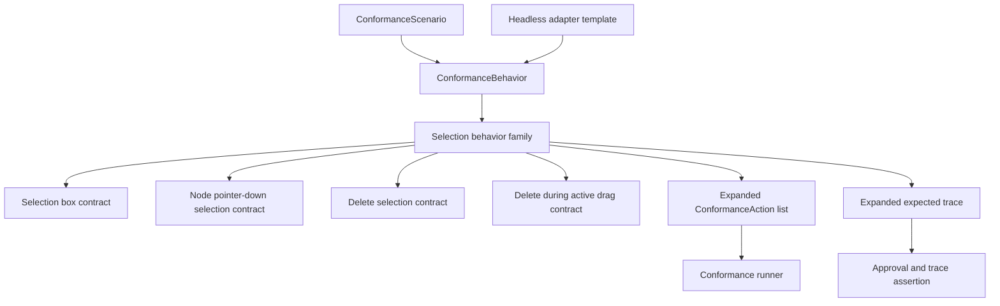

# refactor: Deepen Selection Behavior Family

## Summary

Deepen Jellyflow's adapter conformance around selection so ordinary selection,
delete, and selection-interaction lifecycle scenarios are expressed as behavior
contracts instead of hand-written action and trace choreography.

---

## Problem Frame

`ConformanceSelectionBoxContract` and `ConformanceDeleteSelectionContract` now
cover two important selection behaviors, but the behavior surface is still
fragmented. Selection box, delete selection, node pointer-down selection, and
delete-during-drag lifecycles share the same view selection callbacks, yet those
expectations are still repeated or assembled through low-level
`ConformanceAction` entries in adapter conformance fixtures.

The next refactor should make selection a coherent behavior family. Fixture
authors should state the adapter-visible behavior, while runtime conformance
expands that behavior into the expected store action and trace sequence.

---

## Requirements

**Behavior contracts**

- R1. Express selection box, delete selection, node pointer-down selection, and
  delete-during-active-drag as selection-family behavior contracts.
- R2. Preserve the observable callback ordering already covered by runtime and
  adapter conformance tests.
- R3. Keep low-level `ConformanceAction` variants available for setup,
  assertions, legacy fixture loading, and edge-case tests.

**Adapter and fixture authoring**

- R4. Make adapter-facing scenarios prefer `ConformanceBehavior` builders over
  hand-written action and trace lists.
- R5. Keep existing conformance JSON loading and approval behavior compatible.
- R6. Update the headless adapter template so it demonstrates the deeper
  selection behavior contracts instead of low-level trace assembly.

**Public surface and verification**

- R7. Cover new contract constructors, serde shape, and public exports in
  `crates/jellyflow-runtime/tests/public_surface.rs`.
- R8. Avoid widening viewport, layout facts, pointer-session, or XyFlow
  compatibility scope in this refactor.

---

## Key Technical Decisions

- KTD1. Treat selection as a behavior family: selection box and delete selection
  remain valid contracts, but shared trace vocabulary and composite lifecycle
  cases move into the same conformance behavior area.
- KTD2. Add behavior contracts before deleting action usage: the first pass
  should prove equivalent trace expansion, then migrate fixtures away from
  low-level assembly.
- KTD3. Verify node pointer-down decisions inside conformance instead of
  discarding them: `ApplyNodePointerDown` currently updates selection but the
  runner does not assert the returned drag claim, so the behavior contract should
  close that gap.
- KTD4. Model delete-during-drag as a composite selection behavior: the delete
  operation is selection-owned, but the surrounding drag start/end events are
  part of the adapter-visible lifecycle that the fixture is trying to preserve.
- KTD5. Keep compatibility shell semantics: existing `actions` and
  `expected_trace` fields continue to work, while new scenarios should put
  reusable behavior under `behaviors`.

---

## High-Level Technical Design

The behavior family owns the adapter-visible trace vocabulary for selection
state, view changes, selection callbacks, delete callbacks, and the lifecycle
events needed by composite scenarios. Low-level actions remain useful for setup
and rare tests, but they stop being the recommended way to describe ordinary
adapter behavior.

---

## Implementation Units

### U1. Characterize Current Selection Lifecycle Coverage

- **Goal:** Lock the current selection lifecycle behavior before adding new
  conformance contracts.
- **Requirements:** R1, R2.
- **Dependencies:** None.
- **Files:** `crates/jellyflow-runtime/src/runtime/tests/selection/box_selection.rs`,
  `crates/jellyflow-runtime/src/runtime/tests/selection/node_drag_start.rs`,
  `crates/jellyflow-runtime/src/runtime/tests/delete.rs`,
  `crates/jellyflow-runtime/src/runtime/tests/adapter_conformance/fixture_runner/node_drag.rs`,
  `templates/headless-adapter/src/lib.rs`.
- **Approach:** Review and, where needed, add focused characterization coverage
  for current selection box, node pointer-down selection, delete selection, and
  delete-during-active-drag behavior. This unit should not change runtime
  behavior.
- **Execution note:** Characterization-first.
- **Patterns to follow:** Existing `node_pointer_down_combines_selection_and_drag_readiness`,
  `store_apply_node_pointer_down_updates_selection_and_returns_decision`,
  `selection_box_replaces_selection_with_policy_filtered_sorted_result`, and
  `adapter_conformance_fixture_runner_records_delete_during_active_drag_lifecycle`.
- **Test scenarios:** A replacement selection box emits sorted node and edge
  selection after policy filtering. Additive selection box unions with existing
  selection and preserves sorted output. Node pointer-down on an unselected node
  selects only that node and returns a node-drag claim once threshold input is
  present. Node pointer-down without threshold keeps drag unclaimed while still
  applying the selection action. Deleting during an active node drag emits drag
  start, delete commit and callbacks, selection clear, then canceled drag end in
  the current order.
- **Verification:** Existing behavior is named in tests before contract shape is
  changed.

### U2. Share Selection Trace Vocabulary

- **Goal:** Remove duplicated selection trace construction from individual
  behavior contracts.
- **Requirements:** R1, R2, R4.
- **Dependencies:** U1.
- **Files:** `crates/jellyflow-runtime/src/runtime/conformance/scenario/behavior.rs`,
  `crates/jellyflow-runtime/src/runtime/conformance/scenario/trace.rs`,
  `crates/jellyflow-runtime/src/runtime/tests/conformance/runner/scenario.rs`,
  `crates/jellyflow-runtime/src/runtime/tests/conformance/runner/mod.rs`.
- **Approach:** Add an internal trace helper or equivalent local abstraction for
  selection state, view-change callback, and selection-change callback events.
  Use it from selection box and delete selection contracts without changing
  serialized fixture shape.
- **Patterns to follow:** Existing `ConformanceTraceEvent::selection`,
  `ConformanceCallbackEvent::ViewChange`, and
  `ConformanceCallbackEvent::SelectionChange` expansion in
  `ConformanceSelectionBoxContract` and `ConformanceDeleteSelectionContract`.
- **Test scenarios:** Selection box contract still expands to the same three
  selection-related trace events. Delete selection contract still clears
  selection after delete callbacks. Trace helper preserves node, edge, and group
  ordering supplied by the contract. Behavior-expanded expected trace remains
  compatible with approval trace trimming.
- **Verification:** No fixture or approval output changes except where tests
  intentionally migrate to new contracts in later units.

### U3. Add Node Pointer-Down Selection Contract

- **Goal:** Promote node pointer-down selection and drag-readiness from a
  low-level action into a selection-family behavior contract.
- **Requirements:** R1, R2, R3, R4, R7.
- **Dependencies:** U2.
- **Files:** `crates/jellyflow-runtime/src/runtime/conformance/scenario/action/node.rs`,
  `crates/jellyflow-runtime/src/runtime/conformance/scenario/behavior.rs`,
  `crates/jellyflow-runtime/src/runtime/conformance/runner/actions/node.rs`,
  `crates/jellyflow-runtime/src/runtime/tests/adapter_conformance/fixture_runner/node_drag.rs`,
  `crates/jellyflow-runtime/tests/public_surface.rs`.
- **Approach:** Add a behavior contract that carries node pointer-down input,
  expected selected node/edge/group IDs, and expected pointer claim. The runner
  should assert the action's returned decision rather than discarding it.
- **Patterns to follow:** Existing `ConformanceNodePointerDownInput`,
  `NodePointerDownDecision`, `NodeDragStartSelectionAction`, and
  `PointerGestureClaim` tests under `runtime/tests/selection/node_drag_start.rs`.
- **Test scenarios:** Contract selecting an unselected node emits the expected
  selection trace and asserts `PointerGestureClaim::NodeDrag` when threshold
  input is present. Contract without threshold emits the expected selection trace
  and asserts `PointerGestureClaim::None`. Multi-selection input can add or
  remove a selected node while preserving existing edge selection. Hidden or
  non-selectable node input can assert unchanged selection and no drag claim.
  Serde round-trip preserves node, modifier, delta, selected IDs, and expected
  claim.
- **Verification:** Adapter conformance can state pointer-down selection in one
  behavior instead of combining `ApplyNodePointerDown` with manual expected
  trace.

### U4. Add Delete-During-Active-Drag Contract

- **Goal:** Replace the current hand-written delete-during-drag fixture with a
  composite behavior contract.
- **Requirements:** R1, R2, R4, R5, R7.
- **Dependencies:** U2.
- **Files:** `crates/jellyflow-runtime/src/runtime/conformance/scenario/behavior.rs`,
  `crates/jellyflow-runtime/src/runtime/conformance/scenario/action/selection.rs`,
  `crates/jellyflow-runtime/src/runtime/conformance/runner/actions/selection.rs`,
  `crates/jellyflow-runtime/src/runtime/tests/adapter_conformance/fixture_runner/node_drag.rs`,
  `crates/jellyflow-runtime/tests/public_surface.rs`.
- **Approach:** Add a composite selection behavior that emits drag start, applies
  delete selection or key-bound delete, then emits canceled drag end. Reuse the
  delete selection trace expansion for graph commit, node/edge changes,
  disconnect callbacks, delete callbacks, and selection clearing.
- **Patterns to follow:** Existing
  `adapter_conformance_fixture_runner_records_delete_during_active_drag_lifecycle`,
  `ConformanceDeleteSelectionContract::for_key`, and
  `ConformanceNodeDragSessionContract` trace ordering.
- **Test scenarios:** Key-bound Backspace delete during active drag expands to
  the same trace as the current manual fixture. Explicit delete during active
  drag works without a key. A selected node with an attached edge records both
  node and edge delete callbacks and disconnected connection callbacks. A
  node-only delete records node callbacks without edge disconnect events. Serde
  round-trip preserves drag start, drag end, key choice, deleted counts,
  commit op kinds, and disconnected connections.
- **Verification:** The manual action and trace list in the adapter conformance
  fixture is no longer necessary for the ordinary delete-during-drag scenario.

### U5. Migrate Adapter Fixtures And Template To Selection Behaviors

- **Goal:** Make runtime adapter conformance and the headless adapter template
  demonstrate the behavior-level selection API.
- **Requirements:** R3, R4, R5, R6.
- **Dependencies:** U3, U4.
- **Files:** `crates/jellyflow-runtime/src/runtime/tests/adapter_conformance/fixture_runner/node_drag.rs`,
  `crates/jellyflow-runtime/src/runtime/tests/conformance/runner/scenario.rs`,
  `templates/headless-adapter/src/lib.rs`,
  `templates/headless-adapter/tests/conformance.rs`.
- **Approach:** Replace ordinary selection-related low-level action and trace
  assembly with behavior contracts. Leave low-level action tests in place only
  where they prove escape-hatch compatibility or setup behavior.
- **Patterns to follow:** Recent migrations to `ConformanceSelectionBoxContract`
  and `ConformanceDeleteSelectionContract` in runtime and template tests.
- **Test scenarios:** Delete-during-active-drag fixture passes through the new
  composite behavior. Node pointer-down selection fixture passes through the new
  behavior and asserts returned pointer claim. Headless adapter delete-selection
  smoke still runs as one scenario. Existing JSON suites without behaviors still
  load and run unchanged.
- **Verification:** Selection behavior examples in the template match the
  recommended adapter-facing path.

### U6. Tighten Public Surface And Documentation Around Selection Behaviors

- **Goal:** Ensure the new selection behavior family is visible to consumers
  without teaching low-level fixture internals as the default path.
- **Requirements:** R3, R6, R7, R8.
- **Dependencies:** U5.
- **Files:** `crates/jellyflow-runtime/src/runtime/conformance/mod.rs`,
  `crates/jellyflow-runtime/src/runtime/conformance/scenario/mod.rs`,
  `crates/jellyflow-runtime/tests/public_surface.rs`,
  `crates/jellyflow-runtime/README.md`,
  `templates/headless-adapter/README.md`.
- **Approach:** Re-export the new contract types alongside existing conformance
  contracts. Adjust docs only where they mention adapter conformance examples;
  avoid broad runtime or viewport documentation changes.
- **Patterns to follow:** Existing exports for `ConformanceSelectionBoxContract`,
  `ConformanceDeleteSelectionContract`, `ConformanceNodeDragSessionContract`,
  and `ConformanceRenderingQueryContract`.
- **Test scenarios:** Public-surface test constructs every selection-family
  contract. Public-surface test serializes and deserializes a scenario containing
  each new behavior. External consumer smoke can import the recommended
  conformance types without reaching into private modules.
- **Verification:** Public API coverage proves the intended adapter-facing path,
  and documentation no longer presents low-level trace assembly as the ordinary
  selection conformance style.

---

## Scope Boundaries

### Deferred to Follow-Up Work

- Viewport behavior contracts beyond the existing drag-pan session contract.
- Pointer session unification across node drag, selection, connection, resize,
  and viewport.
- Layout facts and measurement publication beyond existing contracts.
- `ConformanceScenario` approval surface restructuring outside the selection
  behavior migration.
- Public API diet unrelated to selection conformance exports.

### Out of Scope

- Renderer dependencies, screenshot tests, pixel tests, `wgpu`, `winit`, Fret,
  or egui integration.
- Persisted graph schema changes.
- XyFlow compatibility behavior changes under `runtime::xyflow`.
- Changes to delete, selection, or drag runtime semantics unless a
  characterization test exposes a bug that the user separately approves fixing.

---

## Risks & Dependencies

- **Trace-order drift:** Selection and delete callbacks are adapter-visible.
  Mitigation: U1 characterization and U2 trace helper equivalence tests before
  migration.
- **Contract overreach:** Composite behavior contracts can hide too much if they
  absorb unrelated gesture semantics. Mitigation: keep this plan limited to
  selection-owned behavior plus the minimum drag lifecycle needed by
  delete-during-drag.
- **Fixture compatibility risk:** Existing JSON action fixtures must keep
  loading. Mitigation: add behaviors without removing low-level action variants.
- **Public surface bloat:** New contracts add exported names. Mitigation: export
  behavior-level contracts while keeping lower-level actions as compatibility and
  test tools.

---

## Sources & Research

- `docs/adr/0003-headless-adapter-testing-and-renderer-boundary.md`
- `docs/plans/2026-06-10-003-refactor-headless-adapter-depth-plan.md`
- `docs/plans/2026-06-10-007-prioritized-adapter-seam-deepening-plan.md`
- `crates/jellyflow-runtime/src/runtime/conformance/scenario/behavior.rs`
- `crates/jellyflow-runtime/src/runtime/conformance/scenario/action.rs`
- `crates/jellyflow-runtime/src/runtime/conformance/scenario/action/selection.rs`
- `crates/jellyflow-runtime/src/runtime/conformance/runner/actions/selection.rs`
- `crates/jellyflow-runtime/src/runtime/conformance/runner/actions/node.rs`
- `crates/jellyflow-runtime/src/runtime/tests/selection/box_selection.rs`
- `crates/jellyflow-runtime/src/runtime/tests/selection/node_drag_start.rs`
- `crates/jellyflow-runtime/src/runtime/tests/adapter_conformance/fixture_runner/node_drag.rs`
- `crates/jellyflow-runtime/tests/public_surface.rs`
- `templates/headless-adapter/src/lib.rs`
