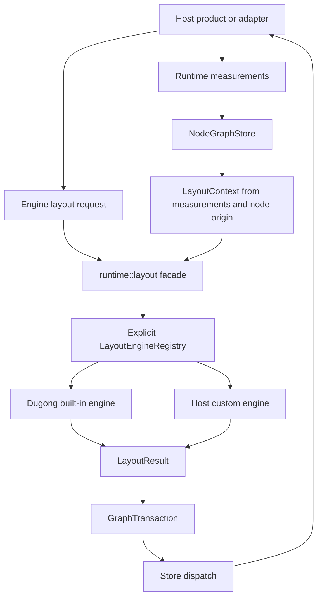

# feat: Add Layout Engine Extension Boundary

## Summary

Jellyflow should turn the current `dugong` adapter into the first implementation of a small
headless layout engine boundary. This first slice records the architecture decision, preserves
existing `dugong` APIs, adds explicit engine selection and registry ownership, and proves the
surface through runtime dispatch plus an external headless adoption check.

---

## Problem Frame

`jellyflow-layout` already has the right primitive: a graph goes in, a `LayoutResult` comes out, and
node moves become a normal `GraphTransaction`. `jellyflow-runtime::runtime::layout` then lets the
store apply that transaction through the existing dispatch pipeline.

The missing piece is not a large bundle of layout algorithms. Product-grade canvases need custom
layout heuristics, but stabilizing a broad registry plus mind-map, radial, and freeform engines in
one pass would freeze API choices before enough engines have pressured the protocol. The first
adoption slice is narrower: a Rust self-drawn or headless adapter can report measurements, choose a
layout engine, receive a transaction, and dispatch it without renderer dependencies or store
internals.

---

## Requirements

**Headless boundary**

- R1. Keep `jellyflow-core`, `jellyflow-runtime`, and `jellyflow-layout` renderer-free and
  platform-free.
- R2. Keep automatic layout outside the persisted core graph schema; layout results may update
  existing layout fields through normal graph transactions.
- R3. Keep adapter-reported measurements runtime-owned; store-level layout facades may consume them
  but must not persist measurement cache state into `Graph`.

**Engine boundary**

- R4. Provide a minimal replaceable layout engine boundary so host products can supply custom
  algorithms without mutating `Graph` or `NodeGraphStore` directly.
- R5. Make engine selection deterministic and serializable through stable engine IDs, with clear
  duplicate-ID and missing-engine errors.
- R6. Keep registry ownership explicit: pure graph-level functions accept explicit layout context,
  while runtime store facades accept a registry reference or use a built-in registry convenience
  path.
- R7. Preserve the existing `dugong` public facade as compatibility wrappers over the broader
  engine surface.

**Adoption and future defaults**

- R8. Prove the surface with `dugong` as the first built-in engine before adding other default
  layout families.
- R9. Gate future mind-map, radial, and freeform engines behind representative graph fixtures,
  build-vs-use comparison, and default-safety criteria.
- R10. Keep product-specific image/PDF annotation widgets, rich text editing, handwriting,
  animation curves, and renderer gestures outside Jellyflow core crates.
- R11. Protect public API reachability with runtime public-surface tests, examples, and an external
  headless consumer smoke gate.

---

## Scope Boundaries

In scope:

- ADR 0005 for the layout engine extension boundary.
- A minimal `jellyflow-layout` engine ID, engine trait, registry, context, and run function.
- Migration of `dugong` behind that boundary while preserving existing wrapper functions.
- Runtime facades that build store-owned layout context from measurements and resolved node origin.
- Documentation and smoke coverage proving a headless adapter can use the boundary without Fret or
  renderer dependencies.

Out of scope:

- Implementing mind-map tree, radial, freeform relax, compound, FCoSE, or COSE engines in this
  slice.
- Adding `manatee`, Graphviz, ELK, D3, JavaScript, DOM, egui, Fret UI, `wgpu`, or `winit` as core
  layout dependencies.
- Introducing a generic renderer adapter trait.
- Moving layout fields out of `Graph` or changing graph serialization.
- Implementing product UI features such as PDF rendering, image annotation editing, rich text,
  handwriting, synchronization, or gesture animation.

### Deferred to Follow-Up Work

- A mind-map/radial validation plan with representative fixtures for multiple roots, cycles, cross
  edges, hidden subtrees, large nodes, partial pins, deep trees, and wide trees.
- A freeform-relax experimental engine whose default mode only resolves overlaps until safety gates
  prove edge springs and broader movement are acceptable.
- Optional external adapters for Graphviz, ELK, or other engines after native-vs-external comparison
  is documented.
- Compound layout support if a real host product needs group-aware automatic layout.
- Animation hints or transition planning after layout result semantics settle.

---

## Key Technical Decisions

- KTD1. Write ADR 0005 before implementation. The extensibility boundary affects public API,
  dependency policy, product customization, and future algorithm ownership.
- KTD2. Put the engine protocol in `jellyflow-layout`, not `jellyflow-core`. Layout is optional,
  algorithmic, and transaction-producing; the core graph model should stay a storage and ops
  substrate.
- KTD3. Keep runtime as a thin dispatch facade. `jellyflow-runtime` should resolve measurements and
  node-origin fallback into layout context, then apply resulting transactions through normal store
  dispatch.
- KTD4. Pass registries explicitly instead of storing custom engines in `NodeGraphStore` or using a
  global mutable registry. This keeps host-owned product strategy outside the store lifecycle.
- KTD5. Stabilize only a small engine identity contract in this slice: built-in ID namespace,
  custom-ID collision rules, duplicate/missing-engine errors, and a semantic-change policy for
  built-in IDs.
- KTD6. Preserve `dugong` APIs as wrappers. Existing users of `plan_dugong_layout`,
  `dugong_layout_transaction`, and `apply_dugong_layout` should not be forced to adopt the registry
  immediately.
- KTD7. Treat mind-map, radial, and freeform as follow-up engines until native-vs-external
  comparison and representative fixtures prove they should become default capabilities.

---

## High-Level Technical Design

The lifecycle stays explicit: adapters report measurements, callers choose an engine request and
registry, runtime builds layout context from store facts, the selected engine returns `LayoutResult`,
and runtime applies the converted transaction through the existing dispatch pipeline.

---

## Primary Adoption Slice

The first consumer workflow is a Rust headless or self-drawn adapter that already uses
`NodeGraphStore`. Success means that adapter can report node sizes, run `dugong` through the generic
engine path, optionally register a simple custom test engine, and apply the result without reading
lookup internals or adding renderer dependencies.

Mind-map, radial, and freeform experiences remain the reason this boundary exists, but they are not
the first proof point. Their follow-up plans should use this slice to pressure-test whether the
request, context, registry, and result semantics are enough.

---

## System-Wide Impact

This change touches the public shape of `jellyflow-layout` and the adapter-facing runtime facade.
The highest-risk surfaces are compatibility wrappers, transaction labels, dispatch behavior,
measurement ownership, engine ID compatibility, and external headless dependency expectations.

The plan avoids graph serialization changes and renderer responsibilities. If implementation needs
a new persisted layout field, node-owned containment model, global registry, or renderer dependency,
that work should stop and produce a separate ADR.

---

## Implementation Units

### U1. Record The Layout Engine Boundary ADR

**Goal:** Add ADR 0005 to define layout engine ownership, registry ownership, default-engine gates,
and dependency policy.

**Requirements:** R1, R2, R3, R4, R5, R8, R9, R10.

**Dependencies:** None.

**Files:** `docs/adr/0005-layout-engine-extension-boundary.md`, `docs/adr/README.md`.

**Approach:** Follow the existing ADR format and connect the decision to ADR 0001, ADR 0002, ADR
0003, and ADR 0004. Name `jellyflow-layout` as the optional algorithm crate, keep runtime as the
store facade, preserve `dugong`, reject renderer-owned concerns, and add a build-vs-use gate for
future native or ported engines.

**Patterns to follow:** `docs/adr/0001-jellyflow-headless-node-graph-engine-boundary.md`,
`docs/adr/0003-headless-adapter-testing-and-renderer-boundary.md`,
`docs/adr/0004-resize-containment-and-lifecycle-boundary.md`.

**Test scenarios:** Test expectation: none -- ADR and index updates are documentation-only.

**Verification:** The ADR explains why Jellyflow needs product-extensible layout while keeping the
first implementation focused on `dugong` plus a minimal registry boundary.

### U2. Introduce The Minimal Layout Engine Protocol

**Goal:** Add the smallest registry-backed protocol that can run a built-in engine and a host
provided engine through the same request/result lifecycle.

**Requirements:** R1, R2, R4, R5, R6, R11.

**Dependencies:** U1.

**Files:** `crates/jellyflow-layout/src/lib.rs`, `crates/jellyflow-layout/src/engine.rs`,
`crates/jellyflow-layout/src/tests/engine.rs`.

**Approach:** Split protocol code out of the current single-file crate without changing `dugong`
behavior. Add `LayoutEngineId`, `LayoutEngine`, `LayoutEngineRegistry`, `LayoutContext`, and a
generic run function. Keep v1 capabilities minimal: engine lookup, duplicate/missing-engine errors,
explicit context, and `LayoutResult` conversion. Do not stabilize a broad capabilities model yet.

**Execution note:** Add protocol tests with a custom test engine before moving `dugong` behind the
registry.

**Patterns to follow:** `crates/jellyflow-runtime/src/schema/registry/mod.rs` for deterministic
registry shape, `crates/jellyflow-runtime/src/profile/mod.rs` for object-safe extension patterns,
and the existing `LayoutError` style in `crates/jellyflow-layout/src/lib.rs`.

**Test scenarios:**

- Register and resolve a custom test engine by stable ID.
- Reject duplicate custom or built-in engine IDs with a deterministic error.
- Return a stable missing-engine error when a request names an unknown engine.
- Preserve request validation for invalid default sizes, invalid spacing, invalid margins, missing
  scope nodes, and invalid measured sizes.
- Convert a generic layout result into a `GraphTransaction` without duplicate node positions.
- Keep pinned-node IDs and explicit measured sizes available to engines without requiring store
  access.
- Serialize and deserialize an engine request with a stable engine ID and recover cleanly when the
  registry lacks that ID.

**Verification:** A custom test engine can be registered, run against a `Graph`, and return a normal
`LayoutResult` that converts to existing graph ops.

### U3. Move Dugong Behind The Engine Surface

**Goal:** Re-express the current `dugong` backend as the first built-in layout engine while
preserving existing public functions and runtime methods.

**Requirements:** R1, R2, R3, R5, R7, R8, R11.

**Dependencies:** U2.

**Files:** `crates/jellyflow-layout/src/lib.rs`, `crates/jellyflow-layout/src/dugong.rs`,
`crates/jellyflow-layout/src/tests/dugong.rs`, `crates/jellyflow-runtime/src/runtime/layout.rs`,
`crates/jellyflow-runtime/src/runtime/tests/layout.rs`,
`crates/jellyflow-runtime/tests/public_surface.rs`.

**Approach:** Move the current projection code into a `dugong` module and expose it through the
generic engine protocol. Keep `layout_graph_with_dugong`, `layout_graph_to_transaction_with_dugong`,
and the runtime `dugong_*` functions as wrappers. Existing transaction labels, edge route behavior,
parallel edge handling, hidden element filtering, node origin math, and bounds semantics should
remain unchanged.

**Execution note:** Treat current `dugong` tests as characterization tests; refactor around them
before changing any behavior.

**Patterns to follow:** Current tests in `crates/jellyflow-layout/src/lib.rs` and runtime facade
tests in `crates/jellyflow-runtime/src/runtime/tests/layout.rs`.

**Test scenarios:**

- The generic registry path and `layout_graph_with_dugong` return equivalent node positions for a
  simple connected graph.
- `dugong_layout_transaction` returns a labeled `GraphTransaction` without mutating store state.
- `apply_dugong_layout` dispatches through `NodeGraphStore` and preserves history, lookup, and
  layout-facts behavior.
- Hidden nodes and hidden edges remain excluded from the `dugong` projection.
- Parallel edges between the same nodes still produce distinct edge routes.
- Invalid ports and missing endpoint nodes still return the same `LayoutError` variants.
- Public-surface tests compile against generic layout types and legacy `dugong` wrappers.

**Verification:** Existing downstream code can keep using `dugong`-named APIs, while new code can
select the same engine through the generic registry.

### U4. Add Runtime Context And Generic Store Facades

**Goal:** Let runtime callers use the generic engine surface without manually copying measurement
facts or bypassing store dispatch.

**Requirements:** R3, R4, R6, R7, R11.

**Dependencies:** U2, U3.

**Files:** `crates/jellyflow-runtime/src/runtime/layout.rs`,
`crates/jellyflow-runtime/src/runtime/tests/layout.rs`,
`crates/jellyflow-runtime/tests/public_surface.rs`.

**Approach:** Add generic plan, transaction, and apply facades that accept `&LayoutEngineRegistry`.
Store-level methods should build `LayoutContext` from `NodeGraphStore` measurements and the resolved
interaction `node_origin` fallback. Pure graph-level functions should keep accepting explicit
layout context so `jellyflow-layout` remains usable outside runtime.

**Patterns to follow:** Existing `runtime::layout` facade, measurement APIs in
`crates/jellyflow-runtime/src/runtime/measurement.rs`, and store dispatch behavior in
`crates/jellyflow-runtime/src/runtime/store/dispatch/*`.

**Test scenarios:**

- Generic runtime layout planning returns `LayoutResult` without mutating store state.
- Generic runtime apply returns layout plus optional dispatch outcome and skips dispatch for no-op
  transactions.
- Reporting `NodeMeasurement::with_size(...)` before store-level layout causes measured sizes to
  influence layout while leaving `Graph` node size unchanged.
- Store-level context uses resolved runtime `node_origin` when a graph node has no per-node origin.
- A custom test engine in an explicit registry can be run through the store facade and dispatch a
  normal transaction.
- Legacy `dugong` store methods still behave as compatibility wrappers.

**Verification:** Runtime users can choose built-in or custom layout engines while preserving
measurement ownership, dispatch, history, lookups, and subscriptions.

### U5. Document And Dogfood The Adoption Path

**Goal:** Make the first layout-engine slice easy for headless adapters to adopt and validate that
the public API works outside this workspace.

**Requirements:** R1, R6, R7, R8, R11.

**Dependencies:** U3, U4.

**Files:** `crates/jellyflow-layout/README.md`,
`crates/jellyflow-runtime/examples/dugong_layout.rs`,
`crates/jellyflow-runtime/examples/layout_engines.rs`,
`crates/jellyflow-runtime/tests/public_surface.rs`,
`tools/check_external_consumer_smoke.py`.

**Approach:** Update docs and examples around the primary adoption slice: report measurements,
choose an engine, optionally register a custom engine, receive a transaction, and dispatch through
runtime. Extend the external consumer smoke gate enough to prove this path compiles without Fret or
renderer dependencies.

**Patterns to follow:** Existing `crates/jellyflow-runtime/examples/dugong_layout.rs` and the
headless dependency smoke checks in `tools/check_external_consumer_smoke.py`.

**Test scenarios:**

- The new example compiles and demonstrates built-in registry use with `dugong`.
- The example demonstrates a minimal custom engine registration without storing the registry in
  `NodeGraphStore`.
- Public-surface tests compile against engine IDs, registry types, generic layout methods, and
  legacy `dugong` methods.
- External consumer smoke can depend on `jellyflow-core`, `jellyflow-layout`, and
  `jellyflow-runtime` without pulling Fret or renderer dependencies.

**Verification:** A fresh Rust headless consumer can follow the docs to run a built-in layout and
understand where a custom product engine plugs in.

---

## Acceptance Examples

- AE1. Given a headless adapter with measured node sizes, when it requests `dugong` through the
  generic engine path, then the resulting transaction matches the existing `dugong` wrapper
  behavior.
- AE2. Given a store with reported runtime measurements and no persisted node size, when generic
  store layout runs, then measured sizes influence layout and `Graph` remains unchanged except for
  dispatched node positions.
- AE3. Given a custom test engine registered in an explicit registry, when runtime applies that
  engine, then Jellyflow returns a normal `GraphTransaction` and dispatches through the store
  pipeline.
- AE4. Given a serialized request naming an engine ID missing from the registry, when layout runs,
  then Jellyflow returns a recoverable missing-engine error without mutating graph or store state.
- AE5. Given an external headless consumer, when it compiles the layout-engine example path, then no
  Fret or renderer dependency appears in the dependency tree.

---

## Risks & Dependencies

- **Public API churn:** A generic layout protocol can become hard to change after release.
  Mitigation: stabilize only engine identity, explicit registry ownership, context passing, and
  result conversion in this slice.
- **Fake renderer seam:** Product layout customization can be mistaken for renderer abstraction.
  Mitigation: ADR 0005 should state that engines compute positions only; adapters still own
  rendering, widgets, gestures, and animation.
- **Behavior drift in `dugong`:** Moving current code behind the registry may change existing layout
  output. Mitigation: keep current tests as characterization and compare wrapper vs registry
  results.
- **Overreach into default algorithms:** Mind-map, radial, and freeform layout can back-pressure the
  first registry API. Mitigation: defer them until representative fixtures and build-vs-use gates
  prove the protocol shape.
- **Engine ID compatibility:** Serialized requests depend on engine IDs staying meaningful.
  Mitigation: document built-in ID namespace, custom ID collision rules, and semantic-change policy.

---

## Documentation / Operational Notes

- `crates/jellyflow-layout/README.md` should explain engine IDs, explicit registries, context
  ownership, and why layout returns transactions instead of mutating graphs.
- Runtime docs should explain that store-level layout uses runtime measurements and interaction
  origin, while graph-level layout functions require explicit context.
- ADR 0005 should record that external layout engines and additional native engines may become
  optional adapters or follow-up built-ins after validation.

---

## Sources & Research

- Existing layout implementation: `crates/jellyflow-layout/src/lib.rs`.
- Existing runtime facade: `crates/jellyflow-runtime/src/runtime/layout.rs`.
- Existing measurement/layout-facts boundary: `crates/jellyflow-runtime/src/runtime/measurement.rs`.
- Headless and renderer boundary ADRs: `docs/adr/0001-jellyflow-headless-node-graph-engine-boundary.md`,
  `docs/adr/0002-jellyflow-model-policy-boundary.md`,
  `docs/adr/0003-headless-adapter-testing-and-renderer-boundary.md`,
  `docs/adr/0004-resize-containment-and-lifecycle-boundary.md`.
- External algorithm references: [Graphviz twopi](https://graphviz.org/docs/layouts/twopi/),
  [ELK Radial](https://eclipse.dev/elk/reference/algorithms/org-eclipse-elk-radial.html),
  [D3 tree](https://d3js.org/d3-hierarchy/tree), and [D3 force](https://d3js.org/d3-force).
  These references justify treating future radial, tree, and force-style layout as known algorithm
  families, but they do not justify adding those engines to the first public extension slice.
