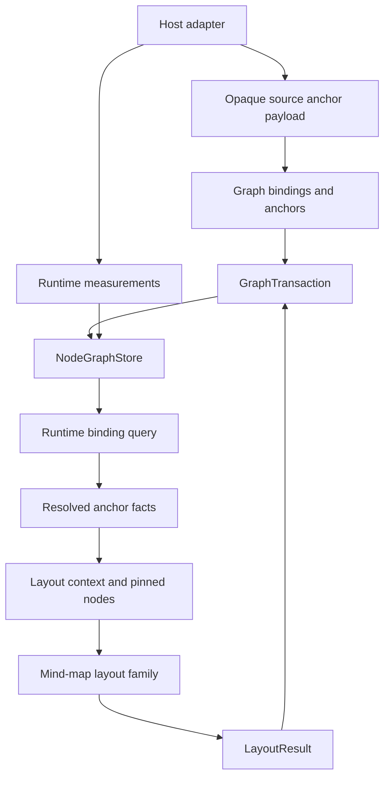
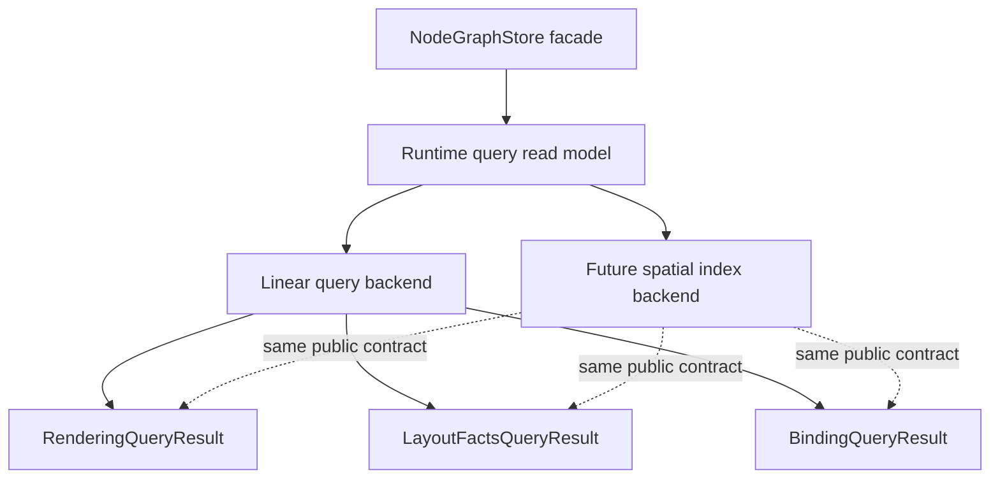

# feat: Add Knowledge Canvas Foundations

## Summary

Jellyflow should add the next headless foundations for knowledge-canvas products: first-class
binding and anchor records, layout family discovery around the existing mind-map engines, and a
runtime query seam that can preserve today's linear behavior while preparing for larger graphs.

---

## Problem Frame

The layout engine boundary and native radial/freeform mind-map engines make Jellyflow usable as a
brain-map graph substrate. The next product pressure is a MarginNote-like knowledge canvas where
graph nodes are not only free objects on a canvas, but can also be tied to source material,
annotations, images, or other stable anchors.

Jellyflow already has lower-level ingredients: `Node.origin`, runtime `node_origin`, reported
measurements, endpoint anchors, rendering queries, layout facts, and layout engine registries. Those
concepts are still scattered across model, runtime, geometry, and layout modules. This plan turns
them into explicit contracts without moving renderer, DOM, PDF, image editing, or Fret behavior into
the headless crates.

---

## Requirements

**Binding and anchor model**

- R1. Add a first-class persisted binding/anchor model that can represent graph-local and
  host-owned source anchors without depending on a renderer or external document parser.
- R2. Preserve the current `Node.origin` meaning as a node-rectangle origin, and avoid reusing it as
  the knowledge-canvas anchor abstraction.
- R3. Validate graph-local binding targets and keep binding edits undoable through normal
  `GraphTransaction` operations.
- R4. Keep host-owned source anchors opaque enough that Jellyflow does not need to understand PDF,
  image, text, or annotation schemas in `jellyflow-core`.

**Layout family evolution**

- R5. Group built-in radial and freeform mind-map engines under a discoverable layout family without
  breaking existing engine IDs or wrapper functions.
- R6. Let layout callers derive pinned or anchor-sensitive layout context from binding facts through
  runtime, rather than making engines read `NodeGraphStore`.
- R7. Keep layout engines renderer-free and transaction-producing, matching ADR 0005 and ADR 0006.

**Runtime query seam**

- R8. Move store-level rendering and layout-facts reads behind a runtime query read model while
  preserving the current public `NodeGraphStore` methods.
- R9. Keep the first query backend behavior-equivalent to today's deterministic linear scans before
  adding any optimized spatial backend.
- R10. Use the existing reserved spatial/cache tuning payloads as the configuration home for future
  index behavior, not as renderer policy.

**Adoption and compatibility**

- R11. Keep `jellyflow-core`, `jellyflow-runtime`, and `jellyflow-layout` free of Fret, DOM, React,
  `wgpu`, `winit`, egui, PDF, or image-processing dependencies.
- R12. Protect public API reachability with public-surface tests, conformance coverage where
  adapter-facing behavior changes, and the external consumer smoke gate.

---

## Scope Boundaries

In scope:

- ADR 0007 for knowledge-canvas binding, layout-family, and query-read-model ownership.
- Additive core model fields and graph operations for first-class bindings and anchors.
- Runtime anchor resolution and binding queries based on graph facts, measurements, and geometry.
- Layout family metadata/discovery over the existing `dugong`, radial mind-map, and freeform
  mind-map engines.
- A runtime query module that owns rendering query and layout-facts composition behind store
  facades.

Out of scope:

- Building a renderer, PDF reader, image annotation editor, handwriting engine, or MarginNote clone.
- Moving existing `Node.origin`, layout fields, policy fields, transactions, or history out of
  `Graph`.
- Moving or expanding `runtime::xyflow` beyond compatibility projections.
- Replacing the existing layout engine protocol or introducing external layout dependencies.
- Changing public store methods in a breaking way.

### Deferred to Follow-Up Work

- A host source-resource model if real adapters need Jellyflow to own source documents rather than
  opaque source references.
- Renderer-specific binding handles, annotation overlays, screenshots, and pixel tests in adapter
  crates.
- Performance budgets and benchmarks for very large knowledge canvases after the query read model is
  in place.
- More advanced layout modes such as incremental anchored relaxation, group-aware mind maps, or
  source-column layout.

---

## Key Technical Decisions

- KTD1. Add bindings as an additive core model resource. Knowledge-canvas attachments need to
  survive serialization, undo/redo, fragment copy, and validation; keeping them only in runtime
  would make them second-class editor state.
- KTD2. Keep source anchors opaque at the core layer. Jellyflow should store stable source identity
  and anchor payloads, but host adapters own PDF coordinates, OCR ranges, image regions, and source
  lifecycle policy.
- KTD3. Separate rectangle origins from knowledge anchors. `Node.origin` and runtime `node_origin`
  continue to describe how `Node.pos` maps to a node rect; new binding anchors describe attachment
  relationships.
- KTD4. Resolve binding geometry in runtime queries. Core should validate references and store data,
  while runtime combines measurements, node origin, handle bounds, and graph lookups into
  adapter-facing anchor facts.
- KTD5. Treat layout family as discovery and capability metadata first. Existing engine IDs remain
  the dispatch contract; a family layer helps hosts choose radial/freeform modes without freezing a
  broad preset API too early.
- KTD6. Extract a query read model before optimizing. A linear backend that preserves current
  ordering, hidden policy, measurement fallback, and edge visibility behavior gives adapters a
  stable seam before any spatial index changes the backend.
- KTD7. Keep `NodeGraphStore` as the facade. Store methods should delegate to binding/layout/query
  modules, not expose lookup internals or force adapters to assemble geometry rules themselves.

---

## High-Level Technical Design

Binding records are persisted and edited through core transactions. Runtime turns those records into
resolved anchor facts using store measurements and geometry, then layout callers can convert those
facts into pinned-node context without layout engines reading store internals.

The query read model becomes the stable adapter contract. The first backend is the current linear
behavior lifted into a replaceable module; future spatial indexing must prove identical public
results before it can become active.

---

## Phased Delivery

- Phase A: establish binding and anchor ownership in core and runtime.
- Phase B: make the existing layout engines discoverable as families and feed them binding-derived
  context.
- Phase C: move rendering, layout-facts, and binding reads behind a query read model, then add the
  optional spatial backend only after equivalence tests exist.

---

## System-Wide Impact

This work crosses `jellyflow-core`, `jellyflow-runtime`, `jellyflow-layout`, examples,
conformance fixtures, and external smoke tests. The main compatibility risks are schema shape,
transaction inversion, lookup rebuild behavior, public runtime method reachability, and preserving
current rendering/layout-facts ordering while the query backend moves.

The plan avoids a schema migration by using additive serde-defaulted fields. If implementation
requires changing existing serialized fields, moving history semantics, or adding renderer
dependencies, that work should stop and produce a separate ADR.

---

## Implementation Units

### U1. Record The Knowledge Canvas Boundary ADR

**Goal:** Add ADR 0007 to define binding/anchor ownership, layout-family scope, query-read-model
ownership, and explicit non-goals.

**Requirements:** R1, R2, R4, R5, R7, R8, R11.

**Dependencies:** None.

**Files:** `docs/adr/0007-knowledge-canvas-foundations.md`, `docs/adr/README.md`, `CONTEXT.md`.

**Approach:** Follow the existing ADR style. Tie the decision back to ADR 0001, ADR 0002, ADR 0005,
and ADR 0006. Name the three boundaries clearly: core persists bindings, runtime resolves anchor
facts, layout discovers engine families, and adapters own source parsing/rendering.

**Patterns to follow:** `docs/adr/0002-jellyflow-model-policy-boundary.md`,
`docs/adr/0005-layout-engine-extension-boundary.md`,
`docs/adr/0006-mind-map-layout-strategy.md`.

**Test scenarios:** Test expectation: none -- ADR and context updates are documentation-only.

**Verification:** The ADR explains why bindings are persisted while renderer/source document
behavior remains outside the headless crates.

### U2. Add Core Binding And Anchor Model Types

**Goal:** Add first-class binding and anchor data structures to the portable graph document.

**Requirements:** R1, R2, R3, R4, R11.

**Dependencies:** U1.

**Files:** `crates/jellyflow-core/src/core/ids.rs`,
`crates/jellyflow-core/src/core/model/binding.rs`,
`crates/jellyflow-core/src/core/model/graph.rs`,
`crates/jellyflow-core/src/core/model/mod.rs`,
`crates/jellyflow-core/src/core/mod.rs`,
`crates/jellyflow-core/src/core/validate/structural.rs`,
`crates/jellyflow-core/src/core/tests/binding.rs`,
`crates/jellyflow-core/src/core/tests/mod.rs`,
`crates/jellyflow-core/src/lib.rs`.

**Approach:** Add a serde-defaulted `bindings` map to `Graph` plus IDs and model types for
graph-local anchors and opaque host source anchors. Keep graph-local references validateable; keep
host source anchors as stable references plus opaque payload. Do not change `Node.origin` or existing
node/edge schemas.

**Execution note:** Start with serialization and structural-validation tests before adding mutation
helpers.

**Patterns to follow:** `crates/jellyflow-core/src/core/model/resources.rs`,
`crates/jellyflow-core/src/core/validate/structural.rs`,
`crates/jellyflow-core/src/core/tests/structural.rs`.

**Test scenarios:**

- Serialize and deserialize a graph with no bindings and confirm old documents default to an empty
  binding map.
- Serialize and deserialize a graph with one node-bound anchor and one opaque source anchor without
  losing payload data.
- Reject a graph-local binding that references a missing node, group, sticky note, port, or edge.
- Accept an opaque host source anchor without requiring Jellyflow to validate the external source
  payload.
- Preserve `Node.origin` serialization and validation independently from binding anchor data.

**Verification:** Bindings are part of the portable document model and do not introduce renderer or
external parser dependencies.

### U3. Make Binding Edits Transactional

**Goal:** Add reversible graph operations, diffing, normalization, mutation planning, and fragment
handling for bindings.

**Requirements:** R1, R3, R11, R12.

**Dependencies:** U2.

**Files:** `crates/jellyflow-core/src/ops/transaction/op.rs`,
`crates/jellyflow-core/src/ops/apply/bindings.rs`,
`crates/jellyflow-core/src/ops/apply/mod.rs`,
`crates/jellyflow-core/src/ops/history/invert/binding.rs`,
`crates/jellyflow-core/src/ops/history/invert/mod.rs`,
`crates/jellyflow-core/src/ops/normalize/coalesce/binding.rs`,
`crates/jellyflow-core/src/ops/normalize/coalesce/mod.rs`,
`crates/jellyflow-core/src/ops/diff/metadata/bindings.rs`,
`crates/jellyflow-core/src/ops/diff/metadata/mod.rs`,
`crates/jellyflow-core/src/ops/mutation/planner/bindings.rs`,
`crates/jellyflow-core/src/ops/mutation/planner/mod.rs`,
`crates/jellyflow-core/src/ops/fragment/collect/collector.rs`,
`crates/jellyflow-core/src/ops/fragment/remap.rs`,
`crates/jellyflow-core/src/ops/tests/bindings.rs`,
`crates/jellyflow-core/src/ops/tests/mod.rs`.

**Approach:** Mirror existing graph resource operations. Add add/remove/set operations only for the
fields that need independent undoable edits. Ensure node or graph-local target removal either
cascades attached bindings in the same transaction or rejects unsafe removals through planners.
Fragment copy should include bindings only when both graph-local endpoints remain meaningful after
remap.

**Patterns to follow:** `crates/jellyflow-core/src/ops/apply/resources.rs`,
`crates/jellyflow-core/src/ops/diff/metadata/groups.rs`,
`crates/jellyflow-core/src/ops/mutation/planner/nodes.rs`,
`crates/jellyflow-core/src/ops/fragment/collect/collector.rs`.

**Test scenarios:**

- Add and remove a binding through `GraphTransaction`, then invert the transaction and recover the
  original graph.
- Coalesce multiple edits to the same binding field into one final operation.
- Diff two graphs where a binding was added, removed, and modified, and produce stable binding ops.
- Remove a node with attached graph-local bindings and confirm the planner preserves graph
  validity.
- Copy a fragment containing a node-bound binding endpoint and remap the endpoint to the pasted node.
- Exclude or preserve opaque host source anchors according to the fragment policy recorded in ADR
  0007.

**Verification:** Binding edits participate in the same apply, undo/redo, diff, and fragment
lifecycles as nodes, groups, sticky notes, and symbols.

### U4. Add Runtime Binding Anchor Resolution

**Goal:** Expose renderer-neutral binding query results that adapters can use for source-linked
canvas behavior.

**Requirements:** R1, R2, R4, R6, R8, R11, R12.

**Dependencies:** U2, U3.

**Files:** `crates/jellyflow-runtime/src/runtime/binding/mod.rs`,
`crates/jellyflow-runtime/src/runtime/binding/query.rs`,
`crates/jellyflow-runtime/src/runtime/binding/resolve.rs`,
`crates/jellyflow-runtime/src/runtime/mod.rs`,
`crates/jellyflow-runtime/src/runtime/lookups/mod.rs`,
`crates/jellyflow-runtime/src/runtime/lookups/rebuild.rs`,
`crates/jellyflow-runtime/src/runtime/lookups/apply/mod.rs`,
`crates/jellyflow-runtime/src/runtime/store/view/document.rs`,
`crates/jellyflow-runtime/src/runtime/tests/binding.rs`,
`crates/jellyflow-runtime/src/runtime/tests/mod.rs`,
`crates/jellyflow-runtime/tests/public_surface.rs`.

**Approach:** Add runtime lookup indexes for binding endpoints and a store-level binding query. The
resolver should return stable binding IDs, endpoint references, visibility/resolution status, and
canvas-space anchor geometry when graph-local geometry is resolvable. Missing measurements should
produce unresolved geometry rather than fake positions unless an explicit fallback exists.

**Patterns to follow:** `crates/jellyflow-runtime/src/runtime/measurement.rs`,
`crates/jellyflow-runtime/src/runtime/geometry/endpoints/resolve.rs`,
`crates/jellyflow-runtime/src/runtime/rendering/store.rs`,
`crates/jellyflow-runtime/src/runtime/tests/measurement.rs`.

**Test scenarios:**

- Resolve a node-bound anchor using explicit node size, per-node `Node.origin`, and runtime
  `node_origin` fallback.
- Resolve a node-bound anchor using reported `NodeMeasurement` size without persisting that size
  into `Graph`.
- Return unresolved geometry for an unmeasured unsized node when no fallback size exists.
- Exclude or mark hidden graph-local binding targets according to the policy recorded in ADR 0007.
- Update binding lookup indexes after add, remove, node removal, and document replacement.
- Keep the public binding query reachable from `NodeGraphStore` and from runtime re-exports.

**Verification:** Adapters can read binding facts once from the store without duplicating geometry
rules or depending on lookup internals.

### U5. Add Layout Family Metadata And Discovery

**Goal:** Make the existing engines discoverable by family while preserving engine-ID dispatch.

**Requirements:** R5, R7, R11, R12.

**Dependencies:** U1.

**Files:** `crates/jellyflow-layout/src/engine.rs`,
`crates/jellyflow-layout/src/family.rs`,
`crates/jellyflow-layout/src/lib.rs`,
`crates/jellyflow-layout/src/tests/family.rs`,
`crates/jellyflow-layout/src/tests/mod.rs`,
`crates/jellyflow-runtime/src/runtime/layout.rs`,
`crates/jellyflow-runtime/src/runtime/tests/layout.rs`,
`crates/jellyflow-runtime/tests/public_surface.rs`.

**Approach:** Add small metadata types for layout family IDs, family names, and engine capabilities.
Keep `LayoutEngineRequest.engine` as the dispatch key. Register `mind_map_radial` and
`mind_map_freeform` under a `mind_map` family and keep `dugong` under a layered/DAG family. Avoid
locking in broad mode-specific option structs until fixtures prove which knobs should be stable.

**Patterns to follow:** `crates/jellyflow-layout/src/engine.rs`,
`crates/jellyflow-layout/src/tests/engine.rs`,
`docs/adr/0006-mind-map-layout-strategy.md`.

**Test scenarios:**

- Built-in registry lists `mind_map_radial` and `mind_map_freeform` under the same mind-map family.
- Built-in registry still resolves all existing engine IDs directly.
- Duplicate engine IDs and duplicate family metadata remain deterministic errors.
- Runtime public-surface tests can discover family metadata without applying a layout.
- Existing radial, freeform, and `dugong` wrapper tests keep passing without request-shape changes.

**Verification:** Hosts can choose a layout mode by family metadata while existing engine requests
remain stable.

### U6. Feed Binding-Derived Context Into Mind-Map Layout

**Goal:** Let runtime callers derive layout context from bindings without coupling layout engines to
`NodeGraphStore`.

**Requirements:** R5, R6, R7, R11, R12.

**Dependencies:** U4, U5.

**Files:** `crates/jellyflow-runtime/src/runtime/layout.rs`,
`crates/jellyflow-runtime/src/runtime/binding/query.rs`,
`crates/jellyflow-layout/src/mind_map.rs`,
`crates/jellyflow-layout/src/freeform.rs`,
`crates/jellyflow-layout/src/tests/mind_map.rs`,
`crates/jellyflow-layout/src/tests/freeform.rs`,
`crates/jellyflow-runtime/src/runtime/tests/layout.rs`.

**Approach:** Add runtime helpers that convert binding query results into `LayoutContext` inputs
such as pinned nodes and measured-size fallbacks. Keep the layout crate consuming only
`LayoutContext`. Radial and freeform engines should continue to honor existing pinned nodes and
measured sizes.

**Patterns to follow:** `crates/jellyflow-runtime/src/runtime/layout.rs`,
`crates/jellyflow-layout/src/tests/freeform.rs`,
`crates/jellyflow-layout/src/tests/mind_map.rs`.

**Test scenarios:**

- A node with a resolvable source binding can be added to layout context as pinned when requested by
  the runtime helper.
- Freeform layout preserves pinned source-bound node positions while resolving overlap around
  unpinned nodes.
- Radial layout preserves a pinned root or source-bound node while placing descendants
  deterministically.
- Hidden or unresolved binding targets do not become pinned layout facts.
- Direct layout crate callers can still provide `LayoutContext::with_pinned_nodes` without runtime.

**Verification:** Binding-aware layout behavior is opt-in at the runtime context boundary and does
not make layout engines store-aware.

### U7. Extract The Runtime Query Read Model

**Goal:** Move rendering, layout-facts, and binding reads behind a shared query module while
preserving current `NodeGraphStore` methods.

**Requirements:** R8, R9, R10, R11, R12.

**Dependencies:** U4.

**Files:** `crates/jellyflow-runtime/src/runtime/query/mod.rs`,
`crates/jellyflow-runtime/src/runtime/query/backend.rs`,
`crates/jellyflow-runtime/src/runtime/query/linear.rs`,
`crates/jellyflow-runtime/src/runtime/query/rendering.rs`,
`crates/jellyflow-runtime/src/runtime/query/layout_facts.rs`,
`crates/jellyflow-runtime/src/runtime/query/bindings.rs`,
`crates/jellyflow-runtime/src/runtime/rendering/query.rs`,
`crates/jellyflow-runtime/src/runtime/rendering/store.rs`,
`crates/jellyflow-runtime/src/runtime/measurement.rs`,
`crates/jellyflow-runtime/src/runtime/store/mod.rs`,
`crates/jellyflow-runtime/src/runtime/tests/rendering.rs`,
`crates/jellyflow-runtime/src/runtime/tests/measurement.rs`,
`crates/jellyflow-runtime/src/runtime/tests/query.rs`,
`crates/jellyflow-runtime/src/runtime/tests/mod.rs`.

**Approach:** Introduce a query input snapshot containing graph, view state, lookups, interaction
state, and runtime tuning. Rehome the current linear visibility, render-order composition,
layout-facts composition, and binding resolution behind a backend trait or enum. Store methods keep
their names and delegate to the query module.

**Execution note:** Treat existing rendering and measurement tests as characterization coverage
before moving code.

**Patterns to follow:** `crates/jellyflow-runtime/src/runtime/rendering/query.rs`,
`crates/jellyflow-runtime/src/runtime/rendering/visibility.rs`,
`crates/jellyflow-runtime/src/runtime/measurement.rs`,
`crates/jellyflow-runtime/src/runtime/utils/bounds.rs`.

**Test scenarios:**

- `NodeGraphStore::rendering_query` returns the same group order, node order, edge order, visible
  node IDs, and visible edge IDs before and after extraction.
- `NodeGraphStore::layout_facts_query` returns the same visible edge positions and connection
  target candidates after extraction.
- Selection box computation and visible-node culling continue to share the same node-origin and
  hidden-node policies.
- Invalid viewport size or transform still returns empty visibility results rather than panicking.
- Binding queries can reuse the same query snapshot without requiring separate lookup scans in
  callers.

**Verification:** The query module owns read-model composition and existing store APIs remain
behavior-compatible.

### U8. Add Optional Spatial Query Backend Behind Tuning

**Goal:** Prepare large-graph query performance without changing adapter-facing query contracts.

**Requirements:** R8, R9, R10, R11, R12.

**Dependencies:** U7.

**Files:** `crates/jellyflow-runtime/src/runtime/query/spatial.rs`,
`crates/jellyflow-runtime/src/runtime/query/backend.rs`,
`crates/jellyflow-runtime/src/runtime/lookups/types/node.rs`,
`crates/jellyflow-runtime/src/runtime/store/events.rs`,
`crates/jellyflow-runtime/src/runtime/store/dispatch/mod.rs`,
`crates/jellyflow-runtime/src/io/config/state/views/rendering.rs`,
`crates/jellyflow-runtime/src/runtime/tests/query_spatial.rs`,
`crates/jellyflow-runtime/src/runtime/tests/rendering.rs`,
`crates/jellyflow-runtime/src/runtime/tests/store/subscriptions.rs`,
`crates/jellyflow-runtime/src/runtime/tests/mod.rs`.

**Approach:** Add an optional spatial backend that indexes resolved node bounds from the same
snapshot facts as the linear backend. Use `NodeGraphRuntimeTuning` rendering settings to choose the
backend. Invalidate or rebuild the index on graph commits, document replacement, view-relevant
measurement changes, and interaction-state changes that affect node origin or fallback geometry.

**Patterns to follow:** `crates/jellyflow-runtime/src/io/config/state/views/rendering.rs`,
`crates/jellyflow-runtime/src/runtime/store/events.rs`,
`crates/jellyflow-runtime/src/runtime/tests/utils/inside.rs`.

**Test scenarios:**

- Spatial visible-node results match linear results for partial inclusion, full inclusion, hidden
  nodes, node-origin override, and measured-size fallback.
- Spatial visible-edge results match linear endpoint-union visibility for inside, outside, spanning,
  hidden, and unresolved endpoint nodes.
- Index invalidation runs after node position, size, origin, hidden state, measurement, document
  replacement, and runtime origin changes.
- Disabling the spatial backend falls back to linear behavior with identical public results.
- Layout-facts revision and selector subscriptions still fire on measurement-derived geometry
  changes.

**Verification:** Large-graph optimization is backend-swappable and behavior-equivalent to the
linear query contract.

### U9. Document And Dogfood The Adoption Path

**Goal:** Make the new knowledge-canvas foundations understandable and compilable for external
headless consumers.

**Requirements:** R1, R5, R8, R11, R12.

**Dependencies:** U4, U5, U7.

**Files:** `README.md`,
`crates/jellyflow-core/README.md`,
`crates/jellyflow-layout/README.md`,
`crates/jellyflow-runtime/README.md`,
`crates/jellyflow-runtime/examples/layout_engines.rs`,
`crates/jellyflow-runtime/examples/knowledge_canvas.rs`,
`crates/jellyflow-runtime/tests/public_surface.rs`,
`tools/check_external_consumer_smoke.py`,
`templates/headless-adapter/src/lib.rs`.

**Approach:** Add a small example that creates a graph binding, reports measurement facts, queries
resolved anchors, chooses a mind-map family engine, and runs layout through the existing runtime
facade. Extend external smoke only far enough to prove public reachability and dependency hygiene.

**Patterns to follow:** `crates/jellyflow-runtime/examples/layout_engines.rs`,
`templates/headless-adapter/src/lib.rs`,
`tools/check_external_consumer_smoke.py`.

**Test scenarios:**

- The new example compiles and demonstrates binding creation plus runtime anchor query.
- Public-surface tests compile against binding IDs/types, binding query results, layout family
  metadata, and unchanged store rendering/layout methods.
- External consumer smoke can depend on `jellyflow-core`, `jellyflow-layout`, and
  `jellyflow-runtime` without pulling renderer dependencies.
- Template smoke can continue running existing conformance and optionally assert binding query
  reachability without requiring source-rendering UI.

**Verification:** A fresh headless adapter can discover the new APIs without importing Fret,
renderer, or source-document dependencies.

---

## Acceptance Examples

- AE1. Given an old graph JSON document without a bindings field, when it is deserialized, then the
  graph has an empty binding map and existing node origin behavior is unchanged.
- AE2. Given a graph with a node-bound binding and an opaque source anchor, when the graph is
  serialized, deserialized, diffed, and edited through transactions, then binding identity and
  payloads are preserved.
- AE3. Given a graph-local binding target that points at a removed node, when structural validation
  runs, then validation reports the missing target or the planner cascades the binding removal in
  the same transaction.
- AE4. Given a measured source-bound node, when runtime binding query runs, then the result includes
  canvas-space anchor geometry derived from measurement, node position, and node origin.
- AE5. Given the built-in layout registry, when a host asks for the mind-map family, then radial and
  freeform engines are discoverable while direct engine ID dispatch still works.
- AE6. Given a store using `rendering_query` and `layout_facts_query`, when the query read model is
  extracted, then returned order, visibility, edge endpoint, and connection candidate results remain
  behavior-equivalent.
- AE7. Given the optional spatial backend enabled, when the same viewport and graph are queried,
  then visible-node and visible-edge results match the linear backend.
- AE8. Given an external headless consumer, when it compiles the knowledge-canvas example path, then
  no Fret, DOM, React, PDF, image, or renderer dependency appears in the dependency tree.

---

## Risks & Dependencies

- **Schema ambiguity:** The word "anchor" can collide with `Node.origin` and viewport zoom anchors.
  Mitigation: ADR 0007 should define distinct terms and keep model names explicit.
- **Core overreach into source documents:** First-class bindings could tempt Jellyflow to own PDF or
  image semantics. Mitigation: keep source anchors opaque in core and put source interpretation in
  adapters.
- **Transaction blast radius:** Adding a graph resource affects apply, invert, diff, fragment, and
  validation. Mitigation: mirror existing resource patterns and add tests across all lifecycle
  surfaces before runtime work.
- **Layout API churn:** Family metadata can become a second dispatch protocol. Mitigation: keep
  engine ID dispatch canonical and use family metadata only for discovery/capability selection.
- **Query behavior drift:** Extracting query code can accidentally reorder results or change hidden
  policies. Mitigation: run characterization tests before extraction and compare linear/spatial
  backend outputs.
- **Premature spatial complexity:** Indexing can add invalidation bugs before workloads justify it.
  Mitigation: ship the linear query seam first and make the spatial backend optional behind tuning.

---

## Documentation / Operational Notes

- README updates should explain bindings as headless graph/source relationships, not UI overlays.
- Runtime docs should distinguish `rendering_query`, `layout_facts_query`, and binding queries:
  rendering is order/visibility, layout facts add edge endpoints and connection targets, bindings
  add source/graph anchor relationships.
- Layout docs should describe family discovery as host selection metadata while engine IDs remain
  the stable execution key.
- Adapter docs should state that source parsing, source coordinate conversion, and rendered
  annotation UI remain adapter-owned.

---

## Sources & Research

- Product and boundary context: `CONTEXT.md`, `README.md`.
- XyFlow reference boundary and gap snapshot: `docs/reviews/xyflow-gap-2026-06-02.md`.
- Accepted model/layout decisions: `docs/adr/0002-jellyflow-model-policy-boundary.md`,
  `docs/adr/0005-layout-engine-extension-boundary.md`,
  `docs/adr/0006-mind-map-layout-strategy.md`.
- Existing layout plan: `docs/plans/2026-06-11-001-feat-layout-engine-extension-plan.md`.
- Core model and transaction surfaces: `crates/jellyflow-core/src/core/model/graph.rs`,
  `crates/jellyflow-core/src/core/model/node.rs`,
  `crates/jellyflow-core/src/ops/transaction/op.rs`.
- Runtime measurement/query surfaces: `crates/jellyflow-runtime/src/runtime/measurement.rs`,
  `crates/jellyflow-runtime/src/runtime/rendering/query.rs`,
  `crates/jellyflow-runtime/src/runtime/rendering/visibility.rs`,
  `crates/jellyflow-runtime/src/runtime/utils/bounds.rs`.
- Layout engine surfaces: `crates/jellyflow-layout/src/engine.rs`,
  `crates/jellyflow-layout/src/mind_map.rs`,
  `crates/jellyflow-layout/src/freeform.rs`.
- External research was not run; local ADRs and code already define the relevant boundary, and
  additional web research would not materially change the headless architecture decisions here.
