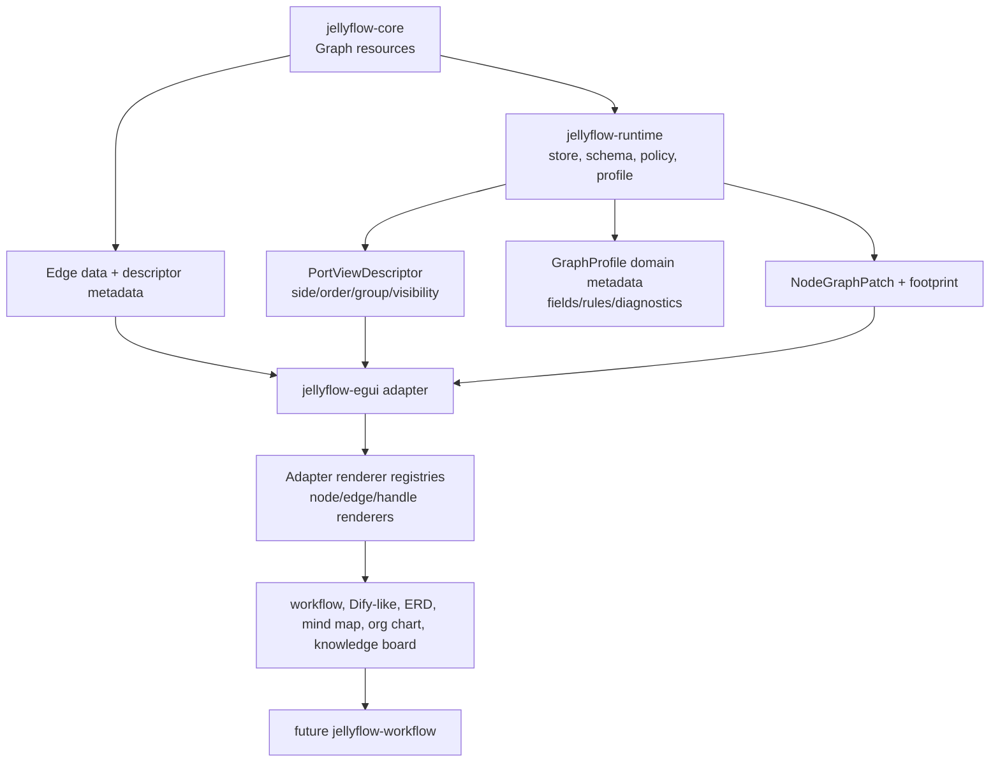
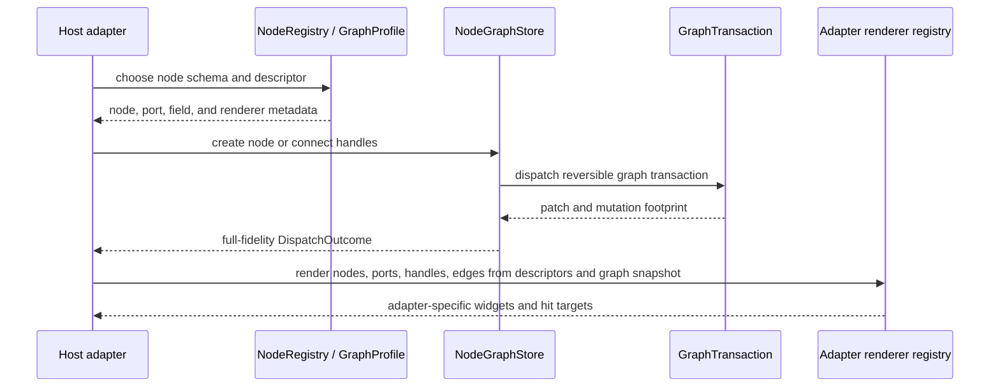

# feat: Deepen Jellyflow XYFlow-Style Product Surface

## Summary

Jellyflow should deepen the public extension surface that lets one headless graph engine support workflow builders, Dify-like automation canvases, ERD editors, mind maps, organization charts, and knowledge boards. The current plan must not create a new crate; it should add the missing core/runtime/adapter protocols for rich nodes, flexible handles, edge-owned render data, and domain-profile metadata. A later, separate plan can introduce `jellyflow-workflow` only after the protocol evidence rubric in this document passes.

---

## Problem Frame

The current engine already has a strong headless base: graph transactions, nodes, ports, edges, groups, sticky notes, bindings, runtime policy, selection, drag, resize, viewport, layout, and XyFlow-style projections. The weak point is the product surface above that base. `jellyflow-egui` renders nodes as color cards with `title` and `summary`, handle placement is left/right by direction, `Edge` has no domain payload or renderer metadata, and `GraphProfile` has hooks but no reusable field-schema or domain-rule kit.

XYFlow's extensibility comes from stable protocols rather than built-in product types: data records with `type` and `data`, renderer registries for custom nodes and edges, handle geometry, interaction/change protocols, viewport math, and internal lookups. Jellyflow should keep its Rust/headless boundary but deepen equivalent seams so adapters and future domain crates can build real product experiences without forking the core model.

---

## Requirements

**Headless protocol surface**

- R1. Keep `jellyflow-core` and `jellyflow-runtime` renderer-free while exposing enough metadata for adapters to render rich nodes, ports, handles, and edges.
- R2. Preserve the transaction, validation, history, middleware, footprint, and external-consumer smoke paths for every new persisted graph field.
- R3. Treat XyFlow compatibility as a projection surface under `runtime::xyflow`, not as the canonical model for every Jellyflow feature.

**Rich node and handle support**

- R4. Allow node schemas to describe adapter-facing port view metadata such as side, order, group, anchor, label, icon key, and visibility without storing framework components.
- R5. Let adapters compute handle bounds from schema metadata, anchor descriptors, and measured node geometry instead of assuming all inputs are left and all outputs are right.
- R6. Give `jellyflow-egui` a renderer seam that can draw product-shaped node cards and forms while keeping the current simple style renderer and interaction states as fallback-compatible behavior.

**Edge product surface**

- R7. Add edge-owned domain data and adapter-facing view descriptor metadata so branches, labels, cardinality, error paths, and renderer-neutral edge renderers do not have to live in node payloads.
- R8. Update edge ops, diff, invert, normalize, serialization, XyFlow projection compatibility, external smoke, and public-surface tests for the new edge fields.

**Domain profile and future crates**

- R9. Deepen `GraphProfile` and schema support with reusable domain metadata for field schemas, validation hints, diagnostics, connection rules, variable surfaces, and dynamic-port concretization.
- R10. Defer a first-party `jellyflow-workflow` crate until the common protocols are proven by adapter examples and external consumer smoke tests.
- R11. Avoid adding `jellyflow-erd`, `jellyflow-whiteboard`, or `jellyflow-mindmap` until a real product fixture proves that domain-specific reuse is larger than local schema presets.

**Examples and confidence**

- R12. Add automation/workflow as the release-blocking anchor adoption fixture, and add Dify-like LLM/tool flow, ERD/table graph, mind-map editor, organization chart, and knowledge board as protocol probes.
- R13. Document what Jellyflow supports directly, what adapters own, and what future domain crates may provide.
- R14. Keep performance and compatibility checks tied to existing benchmark, conformance, projection-compatibility, public-surface, and external consumer smoke gates.

---

## Scope Boundaries

In scope:

- Core edge data and adapter-facing edge descriptor metadata.
- Runtime schema metadata for port/handle presentation.
- Adapter-owned rich node and edge renderer seams in `jellyflow-egui`.
- Domain-profile metadata and diagnostics scaffolding that remains renderer-neutral.
- Product-shaped examples and fixtures that expose gaps before a workflow crate is created.
- Documentation and README guidance explaining which product shapes are supported by primitives versus domain kits.

Out of scope:

- A full Dify-compatible workflow runner, scheduler, credential store, LLM/tool execution layer, or deployment model.
- CRDT merge semantics, multiplayer presence, or network synchronization.
- A first-party React, Svelte, DOM, or browser adapter.
- Whiteboard freehand drawing, image asset storage, rich text editing, or rotation transforms.
- Full ERD import/export, SQL DDL generation, or database introspection.
- Moving persisted policy/layout/presentation fields out of `Graph`; ADR 0002 keeps that as a later schema-migration decision.
- Persisting adapter-ephemeral state such as hover, selection, open toolbar state, editor focus, or transient connection previews in core graph resources.

### Deferred to Follow-Up Work

- `jellyflow-workflow` with trigger/action/condition/tool/LLM presets, variable model, workflow diagnostics, and optional execution-plan APIs, tracked in a separate follow-up plan after U1-U7 land.
- Domain crates for ERD or whiteboard only after product fixtures show repeated reusable semantics.
- WASM or JavaScript bindings after the Rust protocol surface is stable.
- Solver-level incremental layout and real spatial indexing after adapter workloads prove the need.

---

## Key Technical Decisions

- KTD1. Deepen common protocols before adding `jellyflow-workflow`. Renderer, handle, edge, and profile seams are shared by workflow builders, ERD, mind maps, and knowledge canvases; moving too early to a domain crate would freeze unstable interfaces.
- KTD2. Keep adapters responsible for rendering implementation. Core/runtime should expose descriptors, measurements, policy, geometry, and dispatch results, but never egui widgets, DOM components, or callback closures.
- KTD3. Split edge state into `EdgeDomainData`, `EdgeViewDescriptor`, and adapter-ephemeral state. Branch labels, ERD cardinality, error paths, renderer keys, and adapter labels can belong to the edge resource for locality and undo/diff correctness; toolbar open state, hover, focus, and selection remain adapter-local.
- KTD4. Model handle placement as adapter-facing schema metadata. Direction and kind remain semantic, while side/order/group/anchor/visibility describe how adapters place handles.
- KTD5. Make `jellyflow-egui` the first proving adapter, not the product framework. It should expose rich renderer and plugin seams, while renderer-independent conformance tests prove the protocol does not depend on egui's immediate-mode lifecycle.
- KTD6. Treat vertical examples as protocol tests early. Thin automation, ERD, and mind-map tracers should pressure each protocol unit before the full example set lands, so U6 is not the first moment evidence arrives.
- KTD7. Keep XyFlow projection lossy by design, but make the loss explicit. Full-fidelity consumers should use `NodeGraphPatch` and footprints; `NodeGraphChanges` should stay the compatibility view for node/edge changes, with a field-support matrix and tests proving non-projectable data is not cleared by round trips.

---

## High-Level Technical Design

The common path keeps persisted model changes in `jellyflow-core`, renderer-neutral descriptors and domain hooks in `jellyflow-runtime`, and concrete UI rendering in `jellyflow-egui`. The future `jellyflow-workflow` crate consumes the same descriptors and profiles after examples prove that workflow semantics repeat across hosts.

This sequencing preserves the existing write path. Rich UI is derived from descriptors and graph snapshots rather than bypassing transactions or storing framework-specific state in the graph.

---

## Phased Delivery

- Phase 0: add thin automation, ERD, and mind-map tracer fixtures that express the target product pressure before public protocol fields are finalized.
- Phase A: add edge data and descriptor metadata because this is the only required persisted model expansion.
- Phase B: add port view metadata, anchor descriptors, and handle layout descriptors in runtime schema, then route egui handle bounds through them.
- Phase C: deepen egui renderer seams for rich node and edge rendering while preserving simple fallback styles.
- Phase D: add domain-profile metadata and vertical fixtures that pressure the seams.
- Phase E: run the post-U7 protocol evidence gate and create a separate follow-up plan only if `jellyflow-workflow` has earned a crate boundary.

## Protocol Evidence Rubric

A protocol is ready for public API exposure only when it meets at least one reuse signal and one compatibility signal.

Reuse signals:

- At least two vertical fixtures use the same protocol primitive without fixture-specific branches.
- Or one anchor fixture and one external consumer smoke test use the same primitive through public APIs.
- Workflow-specific semantics must be shared by both the automation/workflow anchor fixture and the Dify-like LLM/tool probe before they can justify `jellyflow-workflow`.

Compatibility signals:

- The primitive is covered by public-surface tests, external consumer smoke, and serde/default compatibility where it is persisted.
- The primitive has a renderer-independent conformance test or fake-adapter test when it affects adapter behavior.
- XyFlow projection has an explicit support matrix entry, warning/capability behavior for unsupported fields, and round-trip tests proving compatibility changes do not clear full-fidelity payloads.

If a primitive fails this rubric, keep it in local sample/schema code instead of promoting it to a stable shared abstraction.

---

## System-Wide Impact

This plan crosses `jellyflow-core`, `jellyflow-runtime`, `jellyflow-layout` only as a consumer of existing layout behavior, `jellyflow-egui`, examples, public-surface tests, external consumer smoke, README content, and changelog entries. The highest compatibility risk is adding persisted edge fields incorrectly; every edge field must flow through serde defaults, transactions, inverse operations, diffing, normalization, and controlled projections.

The highest architecture risk is turning adapter descriptors into a UI framework. The accepted ADRs require a renderer-free core/runtime, so all rich rendering implementation must stay in adapter crates or downstream host products.

## Edge Model Contract

U1 should settle the persisted edge shape before adding operations:

- `EdgeDomainData`: opaque domain payload stored on the edge, serde-defaulted to empty, intended for branch labels, cardinality metadata, error path facts, workflow condition facts, and adapter-readable labels that are part of graph meaning.
- `EdgeViewDescriptor`: typed renderer-neutral presentation metadata stored on the edge, serde-defaulted to empty, intended for renderer key, label placement hints, interaction width or hit target hints, marker keys, and style tokens that can be interpreted by multiple adapters.
- `AdapterEphemeralState`: not persisted in core; hover, selection, focus, open toolbar, in-place editor state, and connection preview state stay in adapter state.

XyFlow projection should define which `EdgeDomainData` and `EdgeViewDescriptor` fields are readable, writable, best-effort, or unsupported. Compatibility changes must never clear unsupported full-fidelity fields.

---

## Implementation Units

### U1. Add edge-owned data and descriptor metadata

**Goal:** Make edges capable of carrying product facts such as branch labels, cardinality, error path state, renderer-neutral renderer keys, and adapter labels without moving those facts into node payloads.

**Requirements:** R1, R2, R3, R7, R8.

**Dependencies:** None.

**Files:** `crates/jellyflow-core/src/core/model/edge.rs`, `crates/jellyflow-core/src/ops/transaction/op.rs`, `crates/jellyflow-core/src/ops/apply/edges.rs`, `crates/jellyflow-core/src/ops/apply/dispatch.rs`, `crates/jellyflow-core/src/ops/history/invert/edge.rs`, `crates/jellyflow-core/src/ops/history/invert/mod.rs`, `crates/jellyflow-core/src/ops/diff/edges.rs`, `crates/jellyflow-core/src/ops/normalize/coalesce/edge.rs`, `crates/jellyflow-core/src/ops/normalize/noop.rs`, `crates/jellyflow-core/src/ops/transaction/footprint.rs`, `crates/jellyflow-core/src/ops/tx_sanity.rs`, `crates/jellyflow-core/src/ops/mutation/planner/edges.rs`, `crates/jellyflow-core/src/ops/tests/diff/edge_endpoints.rs`, `crates/jellyflow-core/src/ops/tests/setters.rs`, `crates/jellyflow-runtime/src/runtime/xyflow/projection/node_graph/edges.rs`, `crates/jellyflow-runtime/src/runtime/xyflow/changes/edge.rs`, `crates/jellyflow-runtime/src/runtime/tests/xyflow/projection/node_graph/metadata.rs`, `crates/jellyflow-runtime/tests/public_surface.rs`, `tools/check_external_consumer_smoke.py`.

**Approach:** Add serde-defaulted edge payload and descriptor fields with reversible set operations. Keep the canonical endpoint model unchanged. Split persisted edge surface into domain data and renderer-neutral view descriptors, and explicitly exclude toolbar, hover, focus, selection, and editor-open state from core. Extend transaction op enums, apply dispatch, invert dispatch, noop normalization, footprint calculation, transaction sanity checks, mutation planner, diff/invert/normalize, and fragment-oriented paths so the new fields behave like node data and metadata setters. Update XyFlow projection only for fields that have an XyFlow-compatible representation.

**Execution note:** Start with characterization tests for current edge metadata projection before adding new fields.

**Patterns to follow:** `crates/jellyflow-core/src/core/model/node.rs` for `data`, `crates/jellyflow-core/src/ops/tests/setters.rs` for reversible setter tests, `crates/jellyflow-runtime/src/runtime/xyflow/projection/node_graph/metadata.rs` for projection coverage.

**Test scenarios:**

- Creating an edge without new fields deserializes with defaults and preserves existing graph validation behavior.
- Setting edge data commits through a reversible `GraphTransaction`, undo restores the previous payload, and redo reapplies it.
- Graph diff reports edge data and descriptor changes without producing endpoint changes.
- Dispatch outcomes include mutation footprints for edge data and descriptor changes.
- No-op detection drops setters that write the current edge data or descriptor value.
- Mutation planner and fragment paste paths preserve edge data and descriptor values where they preserve edge identity.
- Normalization coalesces repeated edge data or descriptor setters and drops no-op setters.
- XyFlow projection maps supported edge label/metadata fields, reports unsupported fields through the compatibility surface, and ignores non-projectable payload without losing full-fidelity patch data.
- Applying `NodeGraphChanges` from the XyFlow compatibility view does not clear edge payload or descriptor fields that XyFlow cannot represent.
- External consumer smoke reads and updates edge payload through public graph operations without private field access.

**Verification:** Edge-owned product metadata can be persisted, diffed, undone, projected where applicable, and consumed externally without bypassing the transaction path.

### U2. Add port view metadata and schema descriptor support

**Goal:** Let node schemas describe where and how adapters should present handles without changing semantic port direction or kind.

**Requirements:** R1, R4, R5, R9.

**Dependencies:** U1 is not required, but both should land before rich egui examples.

**Files:** `crates/jellyflow-runtime/src/schema/types.rs`, `crates/jellyflow-runtime/src/schema/registry/mod.rs`, `crates/jellyflow-runtime/src/schema/tests/builder.rs`, `crates/jellyflow-runtime/src/schema/tests/view_descriptor.rs`, `crates/jellyflow-runtime/tests/public_surface.rs`, `crates/jellyflow-egui/src/samples.rs`, `README.md`.

**Approach:** Extend `PortDecl` with an adapter-facing `PortViewDescriptor` that can express side, order, group, optional anchor id, lane or slot, label override, icon key, and visibility. Include this metadata in node-kind view descriptors while keeping graph `Port` semantic storage stable. Builder helpers should make common top/right/bottom/left ports cheap without forcing every host to specify presentation metadata.

**Execution note:** Add schema builder tests first, because this unit is mostly public interface shape.

**Patterns to follow:** Existing `NodeSchemaBuilder::renderer_key`, `NodeKindViewDescriptor`, and schema tests for deterministic descriptor output.

**Test scenarios:**

- A schema with no port view metadata preserves current descriptors and egui fallback behavior.
- A schema with top, right, bottom, and left ports exposes deterministic descriptor ordering.
- A schema can anchor ports to table fields, form rows, or generated slots, and falls back to deterministic side/order placement when no anchor exists.
- Hidden or collapsed handle metadata is available to adapters without removing the semantic port from the graph.
- Builder helpers produce the same serialized schema as explicit descriptor construction.
- External consumer smoke registers a custom node kind with port view metadata and creates a node from it.

**Verification:** Adapter authors can define rich handle placement through runtime schema descriptors while core graph storage remains semantic and renderer-free.

### U3. Route egui handle bounds through descriptors

**Goal:** Replace the current left/right-only handle layout with descriptor-driven handle placement in the egui adapter.

**Requirements:** R4, R5, R6, R12, R14.

**Dependencies:** U2.

**Files:** `crates/jellyflow-egui/src/bridge.rs`, `crates/jellyflow-egui/src/state.rs`, `crates/jellyflow-egui/src/ui/canvas.rs`, `crates/jellyflow-egui/src/samples.rs`, `crates/jellyflow-egui/src/lib.rs`.

**Approach:** Introduce an egui-local handle layout module or helper that consumes node rects, graph ports, schema port view descriptors, and measured anchor regions. Keep `default_handle_bounds` as a compatibility fallback, but make descriptor-based placement the normal path for sample nodes.

**Patterns to follow:** Existing `JellyflowEguiBridge::default_handle_bounds`, `CanvasSnapshot::handle_screen_rect`, and canvas tests for drag preview geometry.

**Test scenarios:**

- A node with top/bottom ports reports handle bounds on those sides and edge endpoints use those bounds.
- A node with multiple ports on one side orders handles deterministically by descriptor order and port order fallback.
- A hidden handle descriptor is excluded from hit testing while the underlying port remains in graph storage.
- Field-level ERD handles follow their measured row anchors and fall back to side/order placement when a row is collapsed or not measured.
- Existing samples without explicit side metadata still render connectable handles using the fallback layout.
- Connection drag from a descriptor-positioned output to a descriptor-positioned input commits the same graph transaction shape as current left/right handles.

**Verification:** egui samples can show multi-side handles without changing connection semantics or graph storage.

### U4. Deepen egui renderer catalog for rich nodes and edges

**Goal:** Turn `jellyflow-egui` from a color-card demo into a proving adapter for custom node and edge rendering.

**Requirements:** R5, R6, R7, R12, R13, R14.

**Dependencies:** U1, U2, U3.

**Files:** `crates/jellyflow-egui/src/bridge.rs`, `crates/jellyflow-egui/src/ui/canvas.rs`, `crates/jellyflow-egui/src/ui/inspector.rs`, `crates/jellyflow-egui/src/ui/mod.rs`, `crates/jellyflow-egui/src/samples.rs`, `crates/jellyflow-egui/README.md`, `crates/jellyflow-egui/examples/workflow.rs`, `crates/jellyflow-egui/examples/knowledge_board.rs`.

**Approach:** Split style lookup from rendering behavior. Keep `NodeRendererStyle` as fallback style data, but add adapter-owned renderer entries that can draw structured node bodies from schema descriptors and `node.data`. Add edge style/render descriptors that can display labels and distinguish branch/error/data/control edges. Define a shared renderer state contract for selected, hovered, focused, dragging, connection-preview, valid-target, invalid-target, disabled, hidden, and diagnostic states.

**Execution note:** Add focused rendering model tests for renderer selection, renderer state propagation, text extraction, and measurement/hit-test output before broad canvas refactors.

**Patterns to follow:** Current `RendererCatalog`, `node_title`/summary extraction in canvas, and sample graph registry.

**Test scenarios:**

- Renderer lookup falls back to the existing style card when no rich renderer is registered.
- Workflow decision nodes render branch labels or port groups derived from schema metadata.
- Edge labels render from edge data or descriptor metadata without changing hit-test path geometry.
- Inspector shows edge data and renderer key for a selected edge.
- Rich renderers do not panic on missing or malformed `node.data`; they show fallback text.
- Rich renderer layout reports measured body rect, desired or minimum size, port anchor basis, child interactive regions, edge label rect, z-order, clipping, and event propagation behavior.
- Selection, hover, connection preview, invalid target, hidden handle, and diagnostic states are visible through both rich renderers and the fallback style renderer.
- A renderer-independent conformance test or fake adapter validates the same renderer input/state/layout contract without importing egui.

**Verification:** egui examples visibly demonstrate richer product-shaped nodes and labeled edges while still using headless runtime mutations.

### U5. Add domain-profile metadata and diagnostics scaffolding

**Goal:** Make product semantics reusable without pushing workflow, ERD, or mind-map rules into the core graph model.

**Requirements:** R3, R9, R10, R11, R12.

**Dependencies:** U1, U2.

**Files:** `crates/jellyflow-runtime/src/profile/mod.rs`, `crates/jellyflow-runtime/src/profile/pipeline/apply.rs`, `crates/jellyflow-runtime/src/schema/types.rs`, `crates/jellyflow-runtime/src/schema/tests/builder.rs`, `crates/jellyflow-runtime/src/profile/pipeline/tests.rs`, `crates/jellyflow-runtime/src/rules/tests/profile.rs`, `README.md`.

**Approach:** Add renderer-neutral domain metadata for field schemas, variable surfaces, validation hints, and connection-rule labels. Keep `GraphProfile` as the execution hook interface, but give profiles structured inputs and diagnostics so products can express rules like single-parent mind maps, DAG-only exec flows, ERD cardinality, and required workflow parameters.

**Execution note:** Characterize existing `GraphProfile` apply/concretize behavior before adding new metadata paths.

**Patterns to follow:** Existing `GraphProfile::validate_graph`, `GraphProfile::plan_connect`, and schema builder tests.

**Test scenarios:**

- A profile can expose required field metadata for a node kind without changing node creation semantics.
- Validation diagnostics can point at a node, port, or edge and include stable codes for adapter display.
- A DAG workflow profile rejects cycles for exec edges while preserving allowed data-edge cycles when configured.
- A mind-map profile rejects a second parent connection for a non-root idea node.
- Dynamic-port concretization remains bounded and deterministic when field metadata implies generated ports.

**Verification:** Domain rules can be described and tested in runtime without creating a domain crate or adding renderer dependencies.

### U6. Add vertical product fixtures and examples

**Goal:** Use concrete product shapes to validate that the common protocols are enough before creating domain crates.

**Requirements:** R6, R9, R10, R11, R12, R13, R14.

**Dependencies:** U1, U2, U3, U4, U5.

**Files:** `crates/jellyflow-egui/src/samples.rs`, `crates/jellyflow-egui/examples/workflow.rs`, `crates/jellyflow-egui/examples/mind_map.rs`, `crates/jellyflow-egui/examples/tree.rs`, `crates/jellyflow-egui/examples/knowledge_board.rs`, `crates/jellyflow-egui/examples/automation_builder.rs`, `crates/jellyflow-egui/examples/erd.rs`, `crates/jellyflow-runtime/src/runtime/conformance/scenario`, `crates/jellyflow-runtime/src/runtime/tests/adapter_conformance`, `README.md`, `crates/jellyflow-egui/README.md`.

**Approach:** Expand sample graphs from layout demos into product fixtures. The automation/workflow example is the release-blocking anchor adoption fixture and must demonstrate the full add/connect/edit/delete/inspect/reset loop. Dify-like LLM/tool flow, ERD, mind map, org chart, and knowledge board are protocol probes that validate the same primitives across different product shapes without needing equal demo depth.

The Dify-like probe should explicitly cover LLM/tool nodes, branch and error paths, parameter metadata, variable surfaces, and diagnostics. ERD should stress field-level handles and cardinality labels. Mind map and org chart should stress single-parent and hierarchy ordering. Knowledge board should stress source cards, bindings, and freeform layout.

**Patterns to follow:** Existing `SampleGraphKind`, egui example entrypoints, runtime conformance fixture runner, and layout tests.

**Test scenarios:**

- Automation builder fixture has trigger, condition, tool, LLM, error path, and output nodes with distinct handle positions.
- Dify-like probe reuses the same schema/profile/edge descriptor primitives as the automation anchor instead of inventing fixture-local workflow semantics.
- ERD fixture renders table fields with field-level ports and relation edge labels.
- Mind-map fixture rejects multiple parent connections when the relevant profile is active.
- Organization chart fixture uses tree layout and preserves node renderer metadata for person/department nodes.
- Knowledge board fixture combines source cards, claim cards, normal edges, and binding-derived facts without requiring host document parsing.
- Runtime conformance fixtures verify the graph mutations behind one product-shaped create/connect/delete path per vertical example.
- Each egui example has a shared UX contract for entry, default canvas, adding nodes, connecting handles, selecting nodes or edges, inspector editing, deleting, undoing or resetting, displaying diagnostics, and leaving the example.
- Keyboard acceptance covers `Tab`/`Shift+Tab` focus movement, `Delete` deletion, `Escape` cancellation, `Enter` inspector focus, arrow-key node movement where practical, and accessible names for node titles, port labels, edge labels, and diagnostics. Keyboard edge creation can remain deferred if the equivalent mouse path and cancel/delete/focus paths are covered.

**Verification:** Each target product shape has a runnable or headless fixture that exercises shared protocols rather than one-off sample code.

### U7. Update documentation, release notes, and external smoke coverage

**Goal:** Make the new surface understandable to adapter authors and safe for downstream consumers.

**Requirements:** R1, R3, R10, R11, R13, R14.

**Dependencies:** U1, U2, U3, U4, U5, U6.

**Files:** `README.md`, `CHANGELOG.md`, `crates/jellyflow-egui/README.md`, `docs/releasing/CRATES_IO.md`, `tools/check_external_consumer_smoke.py`, `tools/check_no_fret_dependencies.py`, `.github/workflows/ci.yml`, `.github/workflows/release-preflight.yml`.

**Approach:** Document the split between core primitives, adapter responsibilities, and future domain crates. Add external smoke cases for edge data, port view metadata, rich schema descriptors, profile diagnostics, and egui app construction. Keep release documentation honest that `jellyflow-workflow` is deferred until protocol evidence exists.

**Patterns to follow:** Existing external consumer smoke scenarios and current README entry-point tables.

**Test scenarios:**

- External consumer smoke compiles a custom schema with port view metadata and edge data.
- External consumer smoke constructs a profile diagnostic without depending on egui or renderer crates.
- Dependency-boundary checks confirm core/runtime still have no egui, Fret, DOM, `wgpu`, or windowing dependencies.
- README example commands for egui product fixtures match actual example names.
- Changelog states which changes are protocol additions and which future domain crates remain deferred.
- Documentation includes the protocol evidence rubric and the XyFlow projection support matrix.

**Verification:** A downstream adapter author can discover the new protocol surface from README/docs and verify it through external smoke without reading internal modules.

## Post-U7 Decision Gate

Do not scaffold `jellyflow-workflow` in this plan. After U1-U7 land, open a separate plan only if all gate conditions are true:

- U1-U7 pass public-surface tests, external consumer smoke, renderer-independent conformance tests, and dependency-boundary checks.
- Automation/workflow and Dify-like fixtures reuse the same schema/profile/edge descriptor primitives for trigger/action/condition/tool/LLM, branch/error paths, variable surfaces, and diagnostics.
- The workflow semantics can no longer be maintained cleanly as local schema presets without duplicating rules across fixtures.
- The first workflow crate remains limited to presets, profile rules, descriptors, diagnostics, and optional execution-plan skeletons.
- Runner execution, credentials, provider integrations, deployment, and scheduling remain out of scope.

If any condition fails, keep workflow semantics in examples and local schema/profile fixtures until the evidence improves.

---

## Acceptance Examples

- AE1. Given a custom workflow node with two exec outputs and three data inputs, when an egui adapter renders it, then handles appear on the descriptor-specified sides and connections still dispatch normal graph transactions.
- AE2. Given an ERD relation edge with cardinality metadata, when the graph is serialized, diffed, undone, and redone, then the cardinality remains edge-owned and does not move into either table node's payload.
- AE3. Given a Dify-like branch node, when a branch edge is selected, then the inspector can show edge label/data and the canvas can render the branch label without a domain runner.
- AE4. Given a mind-map profile that disallows multiple parents, when a second parent connection is planned for the same idea node, then the profile returns a diagnostic and no transaction is committed.
- AE5. Given a downstream adapter crate with no egui dependency, when it registers port view metadata and edge data through public APIs, then external consumer smoke compiles and dependency checks remain headless.

---

## Alternative Approaches Considered

- Add `jellyflow-workflow` first. This would give a visible product story quickly, but it would force workflow-specific choices before renderer, handle, edge, and profile seams are stable.
- Keep everything inside `jellyflow-egui`. This would improve the demo but provide little leverage for other adapters or headless consumers.
- Copy XYFlow's React-oriented surface directly. This conflicts with Jellyflow's ADRs and would import DOM/component assumptions into a Rust headless engine.
- Create separate `jellyflow-erd`, `jellyflow-whiteboard`, and `jellyflow-mindmap` crates now. Those domains need fixture evidence first; otherwise crate boundaries would be speculative.

---

## Risks & Dependencies

| Risk | Mitigation |
| --- | --- |
| Edge data becomes a schema break or misses ops coverage | Add serde defaults and full apply/invert/diff/normalize tests in U1 before adapter usage. |
| Port view metadata leaks UI framework concepts into runtime | Store only renderer-neutral descriptors such as side, order, group, and icon keys. |
| egui renderer seam overfits one demo | Require vertical fixtures for automation, ERD, mind map, org chart, and knowledge board before considering the seam stable. |
| Domain profile scaffolding becomes a second graph model | Keep `Graph` canonical and make profiles produce diagnostics, connection plans, and concretization ops only. |
| Workflow crate scope expands into runner/provider work | Start with schemas, profile rules, descriptors, and diagnostics; defer execution, credentials, provider integrations, and deployment. |

---

## Documentation / Operational Notes

The README should describe Jellyflow as a headless graph engine with adapter and domain-kit layers. It should avoid promising a full Dify clone or whiteboard product. The docs should say that workflow, ERD, mind-map, org-chart, and knowledge-board examples are protocol fixtures unless a future domain crate provides reusable semantics.

Release documentation should add a new crate only after the post-U7 decision gate passes and a separate follow-up plan exists. Until then, CI and release preflight should focus on the existing crates and external consumer smoke for the new public protocols.

---

## Sources / Research

- `CONTEXT.md` sets Jellyflow's target as a headless Rust node/flow graph engine preserving XyFlow-like editor feel without copying React or DOM architecture.
- `docs/adr/0001-jellyflow-headless-node-graph-engine-boundary.md` keeps renderer and platform integration outside core/runtime.
- `docs/adr/0002-jellyflow-model-policy-boundary.md` keeps v1 persisted semantic, layout, policy, and presentation fields in `Graph` until a schema migration plan exists.
- `docs/adr/0003-headless-adapter-testing-and-renderer-boundary.md` requires renderer-independent contracts before renderer smoke tests.
- `docs/adr/0005-layout-engine-extension-boundary.md` and `docs/adr/0006-mind-map-layout-strategy.md` keep layout in `jellyflow-layout` with host-extensible engines.
- `docs/adr/0007-knowledge-canvas-foundations.md` adds binding relationships and keeps source parsing in host adapters.
- `repo-ref/xyflow/packages/system/src/types/nodes.ts` shows XyFlow's framework-independent node data shape with arbitrary data, handles, parent/extent, and measurement fields.
- `repo-ref/xyflow/packages/system/src/types/edges.ts` shows edge-owned type, data, handles, markers, and interaction width.
- `repo-ref/xyflow/packages/react/src/types/component-props.ts` shows `nodeTypes`, `edgeTypes`, `connectionLineComponent`, selection, viewport, and interaction policy props as top-level extension surfaces.
- `repo-ref/xyflow/packages/react/src/components/NodeWrapper/index.tsx` shows the wrapper pattern: custom node rendering is adapter-owned while selection, drag, measurement, and focus stay standardized.
- `crates/jellyflow-core/src/core/model/edge.rs` currently lacks edge data or renderer metadata.
- `crates/jellyflow-runtime/src/schema/types.rs` currently exposes node renderer keys and port labels but not port view metadata.
- `crates/jellyflow-runtime/src/profile/mod.rs` has useful hooks but lacks structured field-schema and domain-diagnostic metadata.
- `crates/jellyflow-egui/src/bridge.rs` currently maps renderer keys to styles and places handles by left/right direction.
