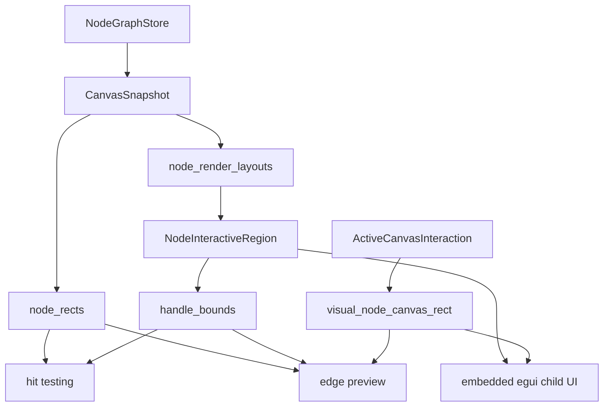
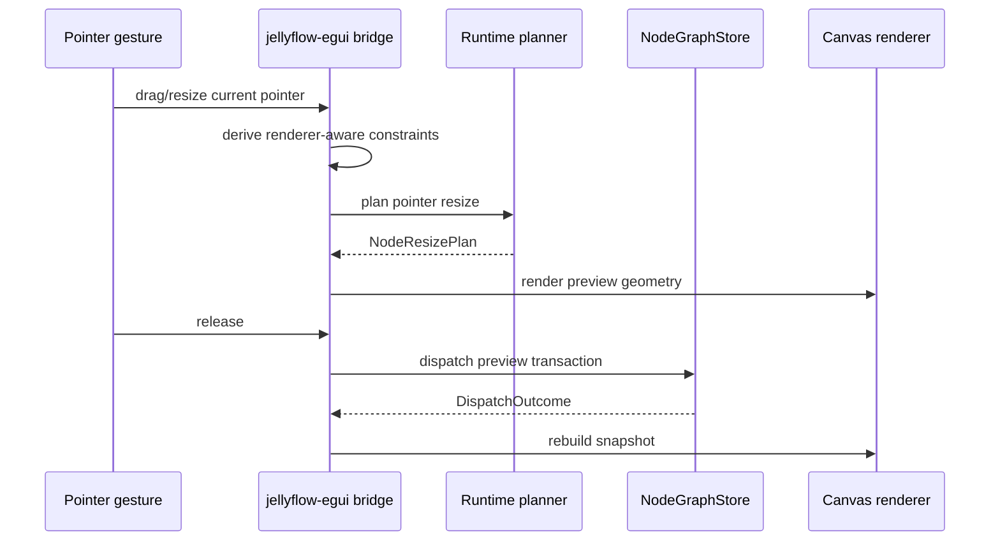

# fix: Harden egui adapter interaction and node UI

## Summary

This plan hardens `jellyflow-egui` after the first real user pass exposed resize degeneration, overlapping field content, unstable cursor affordances, and a gap between rich node layout data and real embedded UI. The goal is to make the adapter credible as a user-facing surface while keeping Jellyflow's headless runtime and adapter-owned renderer boundaries intact.

---

## Problem Frame

The current adapter has moved past a demo skeleton, but several defects have the same root shape: visual geometry, hit testing, interaction commit, and renderer layout are calculated through adjacent paths that can drift. One example has already been fixed in the active branch: resize preview used renderer-aware constraints, while release previously recalculated through a session path without those adapter constraints. The same class can recur in handle placement, edge preview, embedded node widgets, and cursor priority.

The product bar is also higher than basic rectangles and labels. Users expect Dify/XyFlow-like nodes to contain structured controls, field rows, badges, status areas, and anchor-specific ports. Jellyflow should not put UI components into headless crates, but the egui adapter needs a clear extension surface for rendering real child `Ui` regions inside node bounds.

---

## Requirements

**Geometry and interaction correctness**

- R1. Resize preview, resize commit, stored node size, node shell, handle placement, edge preview, and hit testing must use the same effective visual geometry.
- R2. Node resize must never commit non-finite, zero, negative, or renderer-incompatible dimensions, including when the pointer overshoots past zero.
- R3. Drag, resize, pan, connect, selection, and click interactions must update visual feedback during the gesture rather than only after pointer release.
- R4. Cursor priority must match the topmost actionable target so hovering text or embedded fields does not flicker into unrelated resize or drag cursors.

**Embedded node UI**

- R5. Built-in field/table nodes must render non-overlapping internal UI at normal zoom and degrade gracefully at low zoom.
- R6. The adapter must expose a path for renderer-owned embedded egui content without leaking egui, windowing, or renderer concepts into `jellyflow-core`, `jellyflow-layout`, `jellyflow-runtime`, or the top-level `jellyflow` facade.
- R7. Interactive regions must remain the shared contract for child UI placement, port anchors, and hit testing.

**Example quality and regression coverage**

- R8. User-facing examples must demonstrate common graph products: workflow builders, agent/Dify-style nodes, mind maps, trees, ERD/table relations, and annotation/source canvases.
- R9. Regressions must be covered by deterministic adapter-level tests before relying on manual screenshots.
- R10. Headless crates must stay free of egui/Fret/windowing dependencies while the egui adapter can depend on eframe.

---

## Scope Boundaries

In scope:

- Hardening the existing `jellyflow-egui` adapter and its tests.
- Runtime resize constraint semantics that affect adapter correctness.
- Adapter-owned renderer and embedded egui UI contracts.
- User-facing examples and visual acceptance checks that run without a full GUI automation dependency when possible.

Out of scope:

- React, DOM, JavaScript, or browser adapters.
- CRDT, multiplayer editing, network sync, or plugin sandboxing.
- Moving egui renderer concepts into headless crates.
- Full pixel-perfect visual design system polish across every sample.

### Deferred to Follow-Up Work

- Publicizing a stable `NodeWidgetRenderer` API after the built-in egui path proves out on examples.
- Playwright-like screenshot automation for native egui windows once CI environment support is chosen.
- Accessibility and keyboard focus policy for embedded node controls.
- Dynamic plugin loading or third-party renderer packaging.

---

## Key Technical Decisions

- KTD1. Treat visual geometry as a single adapter snapshot contract. Node rects, cached render layouts, handle bounds, hit targets, and edge previews should be derived together so drag and resize previews cannot show one geometry while commit or hit testing uses another.
- KTD2. Commit adapter interactions from planned transactions when adapter-specific constraints are involved. Recomputing at release time through a lower-level session API risks dropping renderer constraints unless the same constraints are carried explicitly.
- KTD3. Keep embedded UI adapter-owned. The headless crates should continue to expose schema descriptors, renderer keys, sizes, ports, anchors, regions, and transactions; egui widgets belong in `jellyflow-egui`.
- KTD4. Use `NodeInteractiveRegion` as the bridge between rich layout and concrete widgets. It already anchors ports and field regions, so extending it avoids a separate geometry DSL.
- KTD5. Prefer deterministic unit and integration tests over screenshot-only validation. Native screenshots are useful for review, but geometry and interaction regressions can be locked down in Rust tests.
- KTD6. Add visual LOD rather than scaling every detail indefinitely. At low zoom, table rows and embedded controls should collapse to summary glyphs or simplified structure instead of overlapping unreadable text.

---

## High-Level Technical Design

The adapter should treat `CanvasSnapshot` plus `ActiveCanvasInteraction` as the source of visual truth. A preview interaction may override node rects, but every dependent read should use the same visualized geometry and renderer layout for that frame.

The same preview plan should drive both the visual preview and the final transaction when adapter constraints are part of planning.

---

## System-Wide Impact

This work mainly affects `jellyflow-egui`, but it also touches `jellyflow-runtime` where resize constraints define headless semantics. The public value is adapter credibility: users can evaluate Jellyflow through the examples without seeing geometry collapse, unreadable field rows, cursor flicker, or stale previews. The architectural value is a clearer boundary between headless graph semantics and adapter-owned rich UI.

---

## Implementation Units

### U1. Consolidate Adapter Visual Geometry Reads

**Goal:** Make node rects, render layouts, handles, edge previews, and hit tests derive from one preview-aware visual geometry path.

**Requirements:** R1, R3, R9.

**Dependencies:** None.

**Files:** `crates/jellyflow-egui/src/bridge.rs`, `crates/jellyflow-egui/src/state.rs`, `crates/jellyflow-egui/src/ui/canvas.rs`, `crates/jellyflow-egui/src/lib.rs`.

**Approach:** Audit every call that reads `snapshot.node_rects`, `snapshot.node_render_layouts`, `snapshot.handle_bounds`, and `snapshot.edge_paths`. Promote helper functions that take `ActiveCanvasInteraction` into one visual geometry layer, then route draw, hit testing, edge preview, and handle rendering through those helpers.

**Patterns to follow:** Existing `visual_node_canvas_rect`, `preview_edge_path`, and `CanvasSnapshot` caching in `crates/jellyflow-egui/src/ui/canvas.rs`.

**Test scenarios:**

- Dragging a node changes its visual rect and the connected edge endpoint in the same frame.
- Resizing a table node changes its visual rect, handle positions, and anchored field handles in the same frame.
- A stale snapshot handle bound does not override a preview render layout during resize.
- Hidden nodes stay absent from visual geometry even when an interaction references them.

**Verification:** Adapter tests prove preview geometry, handles, and edge paths move together under drag and resize.

### U2. Finish Resize Constraint and Lifecycle Hardening

**Goal:** Prevent invalid or renderer-incompatible resize commits across direct resize, pointer resize, and session-style runtime APIs.

**Requirements:** R1, R2, R9, R10.

**Dependencies:** U1.

**Files:** `crates/jellyflow-runtime/src/runtime/resize/types.rs`, `crates/jellyflow-runtime/src/runtime/resize/session.rs`, `crates/jellyflow-runtime/src/runtime/resize/store.rs`, `crates/jellyflow-runtime/src/runtime/tests/resize.rs`, `crates/jellyflow-egui/src/bridge.rs`, `crates/jellyflow-egui/src/lib.rs`.

**Approach:** Keep the runtime clamp behavior that clamps finite overshoot values through min/max before final positive-size validation. Then verify the session update path can carry constraints when adapters need lifecycle events. Keep egui commit on preview transaction unless it intentionally emits gesture events through a constrained session request.

**Patterns to follow:** `NodePointerResizeRequest::with_constraints`, `NodeResizeSessionUpdateRequest::with_constraints`, and existing runtime resize lifecycle tests.

**Test scenarios:**

- Pointer resize with min constraints and a pointer far past zero returns a min-size plan.
- Session update with min constraints matches direct pointer resize output.
- egui table resize commit stores the renderer minimum after overshoot.
- Invalid min/max constraints still reject the request rather than producing a transaction.

**Verification:** Runtime resize tests and egui adapter tests pass without allowing zero or negative node sizes.

### U3. Extract Embedded Node UI Renderer Boundary

**Goal:** Turn the current built-in field row child `Ui` path into an explicit adapter-owned renderer boundary.

**Requirements:** R5, R6, R7, R10.

**Dependencies:** U1.

**Files:** `crates/jellyflow-egui/src/renderer.rs`, `crates/jellyflow-egui/src/ui/canvas.rs`, `crates/jellyflow-egui/src/lib.rs`, `crates/jellyflow-egui/README.md`.

**Approach:** Separate layout-only rendering from widget rendering with an egui-specific trait or callback owned by `jellyflow-egui`. Keep `NodeRenderLayout` as the measurement and region output. Let built-in table/field nodes implement both layout and widget rendering while fallback nodes stay painter-based.

**Patterns to follow:** Existing `RichNodeRenderer`, `RendererCatalog::register_rich`, and `NodeInteractiveRegion` in `crates/jellyflow-egui/src/renderer.rs`.

**Test scenarios:**

- The table renderer emits field regions and the egui canvas uses those regions for child UI placement.
- Multiple table nodes with the same field names do not collide in egui widget IDs.
- A renderer without widget support falls back to painter title/summary/port summary.
- Widget rendering remains unavailable to headless crates and public surface checks keep those crates dependency-free.

**Verification:** Built-in table nodes render through the new adapter-owned widget boundary, and public dependency smoke tests still keep headless crates clean.

### U4. Fix Cursor, Hit Target, and Interaction Priority

**Goal:** Make hover affordances stable over node text, embedded fields, handles, resize controls, edges, and canvas background.

**Requirements:** R3, R4, R7.

**Dependencies:** U1, U3.

**Files:** `crates/jellyflow-egui/src/ui/canvas.rs`, `crates/jellyflow-egui/src/state.rs`.

**Approach:** Define an explicit target priority order and apply it consistently for hover state, cursor icon, drag start, and click selection. Embedded child UI should not produce resize cursors unless the pointer is inside the actual resize handle geometry. Resize handles should be discoverable only when selected or when the resize tool is active.

**Patterns to follow:** Existing `hit_target`, `hit_handle`, `hit_resize_handle`, and `update_cursor` in `crates/jellyflow-egui/src/ui/canvas.rs`.

**Test scenarios:**

- Hovering a table field row returns `HoverTarget::Node` or a field-specific target, not `ResizeHandle`.
- Hovering a resize handle on a selected node returns the matching resize cursor.
- Hovering a handle returns crosshair only when connection is possible for the current tool.
- Pan mode and spacebar pan override node hover cursors during drag.

**Verification:** Cursor-target unit tests cover topmost target priority without requiring a native window.

### U5. Add Zoom-Aware Node Content LOD

**Goal:** Prevent detailed node content from becoming unreadable or overlapping at low zoom.

**Requirements:** R5, R8, R9.

**Dependencies:** U3.

**Files:** `crates/jellyflow-egui/src/renderer.rs`, `crates/jellyflow-egui/src/ui/canvas.rs`, `crates/jellyflow-egui/src/samples.rs`, `crates/jellyflow-egui/src/lib.rs`.

**Approach:** Add simple adapter-owned LOD thresholds derived from zoom. At normal zoom, render full title, field rows, badges, and port hints. At low zoom, hide row labels and port summaries while preserving node shell, title hint, and handles. At very low zoom, collapse to shell/accent only.

**Patterns to follow:** Existing `NodeRendererState`, `draw_nodes`, `draw_interactive_regions`, and renderer style methods.

**Test scenarios:**

- Table field rows are visible at normal zoom.
- Field labels are omitted or simplified below the configured zoom threshold.
- Handles remain correctly placed even when field labels are not drawn.
- Port summary does not overlap title or embedded regions at any tested zoom threshold.

**Verification:** Adapter layout/render tests assert LOD decisions from deterministic zoom inputs.

### U6. Improve User-Facing Samples and Visual Acceptance

**Goal:** Make examples demonstrate credible product classes rather than only proving the adapter compiles.

**Requirements:** R8, R9.

**Dependencies:** U3, U4, U5.

**Files:** `crates/jellyflow-egui/src/samples.rs`, `crates/jellyflow-egui/examples/demo.rs`, `crates/jellyflow-egui/README.md`, `crates/jellyflow-egui/src/lib.rs`.

**Approach:** Expand samples around concrete use cases: workflow builder, Dify-style agent workflow, ERD/table graph, mind map, tree/outline, and source annotation graph. Each sample should use schema descriptors, renderer keys, ports, anchors, layout presets, and meaningful data payloads. Keep tests headless by constructing samples, rebuilding snapshots, and asserting visible nodes, edges, field regions, handles, and layout defaults.

**Patterns to follow:** Existing `SampleGraphKind`, `sample_graph`, `register_demo_node_kinds`, and sample smoke tests in `crates/jellyflow-egui/src/lib.rs`.

**Test scenarios:**

- Every sample builds with at least four visible nodes and at least one edge.
- Dify-style workflow sample includes structured agent/tool/decision/output node data.
- ERD sample anchors PK/FK handles to field regions.
- Mind map and tree samples use their default layout preset and preserve readable node sizes.

**Verification:** Sample smoke tests provide deterministic coverage for each user-facing example.

---

## Risks & Dependencies

- Native screenshot capture may remain unreliable on developer machines or CI because macOS screen recording permissions can block automated capture. The plan relies on deterministic geometry tests first.
- egui child `Ui` rendering can accidentally advance parent layout cursors if the wrong API is used. Embedded node UI should use fixed child UI regions that do not mutate the canvas layout flow.
- A public embedded-widget trait is easy to over-stabilize too early. Keep the first pass adapter-owned and document it as experimental until examples prove the shape.
- Runtime resize sessions emit gesture events, while preview transaction commits are simpler for adapter correctness. If egui needs lifecycle events, constrained session requests must be wired deliberately.

---

## Acceptance Examples

- AE1. Given an enlarged ERD table node, when the user drags its bottom-right resize handle far past zero, then the committed node size equals the renderer minimum and the table remains visible.
- AE2. Given a table node with PK/FK fields, when the user views it at normal zoom, then badges and field labels do not overlap title, summary, handles, or each other.
- AE3. Given a selected node, when the pointer moves from internal text to a resize handle, then the cursor changes only when the pointer enters the actual resize handle geometry.
- AE4. Given a node with anchored handles, when it is resized in preview, then connected edge previews follow the preview handle positions before mouse release.
- AE5. Given any shipped egui sample, when a headless test builds its snapshot, then visible node order, handle bounds, and edge paths are non-empty and finite.

---

## Sources & Research

- `crates/jellyflow-egui/src/bridge.rs` currently owns adapter planning, snapshot rebuild, renderer-aware resize constraints, and interaction commit.
- `crates/jellyflow-egui/src/ui/canvas.rs` currently owns drawing, hit testing, cursor selection, visual preview helpers, and embedded field child UI.
- `crates/jellyflow-egui/src/renderer.rs` currently owns `RichNodeRenderer`, `NodeRenderLayout`, `NodeInteractiveRegion`, and built-in field/table layout.
- `crates/jellyflow-runtime/src/runtime/resize/` owns headless resize requests, constraints, sessions, store helpers, and lifecycle tests.
