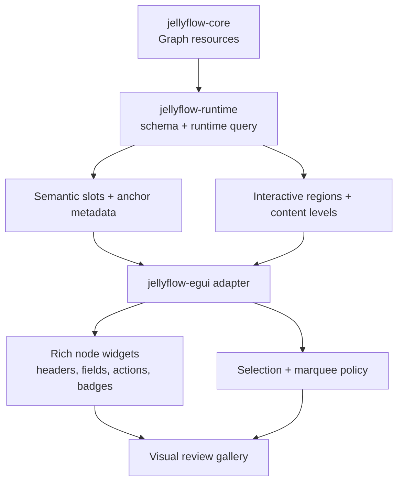
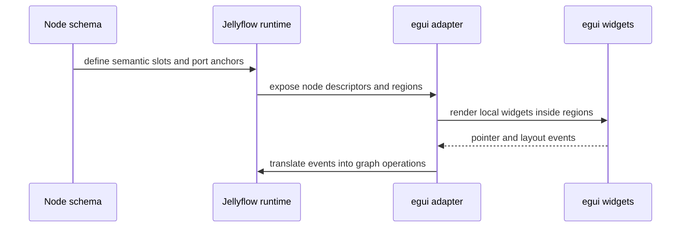

# feat: Semantic Surface and Adapter-First Node UI

## Summary

Jellyflow should turn the new semantic-surface ADR into a concrete implementation target. The next
slice should deepen rich node composition, adapter-owned widget rendering, and selection behavior
without introducing a new crate yet. The first proving surface stays inside `jellyflow-runtime`
schema metadata plus the existing `jellyflow-egui` adapter.

This plan is the follow-up to:

- ADR 0008, which fixes the semantic-surface boundary;
- the existing XYFlow-style product-surface work, which already identified rich nodes, flexible
  handles, and user-facing examples as the missing surface area.

The desired outcome is not "more text labels". It is a node surface that can express workflow
cards, ERD rows, mind-map topics, and knowledge-canvas blocks with nested controls, badges,
summaries, and anchor-aware regions.

---

## Problem Frame

The current `jellyflow-egui` adapter can already render product-shaped samples, but the node model
is still too shallow for the kind of UI users expect from Blueprint, Shader Graph, Dify-style flow
builders, MindNode, or MarginNote-like canvases.

Observed gaps:

- nodes still feel like cards with text instead of structured surfaces;
- box selection is stricter than the expected canvas UX;
- nested controls and field rows need to be composed from semantic regions, not ad hoc widget code;
- future adapters need a vocabulary they can reuse without sharing egui-specific types;
- examples need to prove that the library can support multiple product shapes, not just one visual
  style.

The risk is adding UI framework concepts too early. The solution is to keep the headless seam
semantic, then let adapters map those semantics to widgets.

---

## Requirements

**Headless contract**

- R1. Keep `jellyflow-core` and `jellyflow-runtime` free of framework widget types.
- R2. Preserve transaction, undo/redo, diff, and public-surface behavior for every new semantic
  field.
- R3. Keep semantic slots and interactive regions renderer-neutral.

**Node surface**

- R4. Support named semantic slots such as `header`, `body`, `footer`, `badge`, `icon`,
  `field_row`, `action_row`, `preview`, and `nested_region`.
- R5. Support anchor-aware fields and port placement for ERD-style and form-style nodes.
- R6. Support content-level degradation so rich nodes remain readable when zoomed out.

**Adapter behavior**

- R7. Let adapters render real widgets inside semantic regions without persisting widget trees in
  the graph.
- R8. Make marquee selection behavior configurable and improve the default UX for common canvas
  workflows.
- R9. Keep adapter caches and layout details local to the adapter.

**Examples and validation**

- R10. Prove the surface with workflow, automation, ERD, mind map, tree, org chart, and knowledge
  board samples.
- R11. Use gallery snapshots or equivalent visual checks to catch overlap, clipping, and unreadable
  nodes.
- R12. Keep benchmark and regression checks focused on the adapter surface that is actually changing.

---

## Scope Boundaries

In scope:

- semantic slot metadata in runtime schema;
- adapter-owned rich node and widget renderers;
- anchor-aware field and port placement;
- selection behavior tuning and conformance;
- sample graph updates and visual review coverage;
- docs that explain supported product shapes.

Out of scope:

- a new shared UI crate in the first slice;
- CRDT, multiplayer, or sync semantics;
- browser or DOM adapter implementation;
- workflow execution, scheduler, or LLM runtime;
- schema migration that moves graph ownership across crates.

### Deferred

- A shared `jellyflow-ui-surface` crate can still be revisited later if a second adapter proves the
  seam is real.
- Collaboration and incremental layout remain separate follow-up tracks.

---

## Key Technical Decisions

- KTD1. Keep the first semantic-surface implementation inside existing crates. Use
  `jellyflow-runtime::schema` for the data model and `jellyflow-egui` for the first proving
  adapter.
- KTD2. Treat semantic slots as data, not components. The graph should describe what the surface
  means, not how a widget system should own its lifecycle.
- KTD3. Make adapter renderers responsible for nested composition. Rich nodes should be built from
  slot descriptors, render regions, and style keys.
- KTD4. Use intersection-based marquee selection by default, with a stricter containment mode
  available for precision workflows.
- KTD5. Treat the visual gallery as a regression gate, not just a demo.

---

## High-Level Technical Design

---

## Alternatives Considered

### Option A: Add a new shared UI crate now

**Pros**: creates an obvious abstraction for future adapters.

**Cons**: the seam is not yet proven by multiple adapters, so this would likely become a shallow
pass-through crate.

**Decision**: Rejected for the first slice.

### Option B: Keep everything in egui-only renderers

**Pros**: fastest path for the current adapter.

**Cons**: locks the semantic model to one frontend and makes future adapters harder.

**Decision**: Rejected.

### Option C: Put the semantic surface in runtime schema and let adapters render it

**Pros**: preserves portability, keeps the first slice small, and is enough to prove the model.

**Cons**: requires disciplined slot vocabulary and visual regression checks.

**Decision**: Chosen.

---

## Phased Delivery

- Phase 0: lock the semantic slot vocabulary and the adapter contract for regions and anchors.
- Phase 1: extend runtime schema descriptors so rich node surfaces can be expressed without
  framework widgets.
- Phase 2: deepen `jellyflow-egui` rendering so nodes can compose headers, bodies, field rows,
  badges, and nested widgets.
- Phase 3: tune selection behavior and canvas interactions for the expected canvas UX.
- Phase 4: update samples, gallery snapshots, README guidance, and regression coverage.

---

## Implementation Target

Likely touch points for the first slice:

- `crates/jellyflow-runtime/src/schema/types.rs`
- `crates/jellyflow-runtime/src/schema/registry/mod.rs`
- `crates/jellyflow-egui/src/renderer.rs`
- `crates/jellyflow-egui/src/ui/canvas.rs`
- `crates/jellyflow-egui/src/samples.rs`
- `crates/jellyflow-egui/examples/gallery_snapshot.rs`
- `crates/jellyflow-runtime/src/runtime/selection/*`
- `crates/jellyflow-egui/README.md`

This slice should stay close to the existing boundary. It should extend the current surface, not
replace it with a new framework.

---

## Success Metrics

| Metric | Target | Measurement |
| --- | --- | --- |
| Core portability | No widget types in core/runtime | public-surface checks |
| Semantic reuse | Workflow, ERD, and mind-map samples reuse the same slot vocabulary | sample gallery |
| Selection UX | Box selection matches the expected canvas behavior by default | adapter conformance tests |
| Rich node readability | Nested controls and field rows remain readable at common zoom levels | visual review snapshots |
| Adapter reuse | The same semantic surface can be mapped without changing graph storage | external smoke/prototype adapter |

---

## Risks & Mitigations

| Risk | Severity | Likelihood | Mitigation |
| --- | --- | --- | --- |
| Slot vocabulary becomes too large | High | Medium | keep the first vocabulary small and grow only from repeated sample pressure |
| Rendering becomes adapter-specific too quickly | High | Medium | keep framework types out of runtime and graph storage |
| Selection changes surprise existing users | Medium | Medium | make the policy explicit and keep the strict mode available |
| Rich node layout regresses at low zoom | Medium | Medium | keep gallery snapshots and content-level degradation tests |

---

## Notes

- This plan intentionally does not introduce `jellyflow-workflow` yet.
- The first proof should come from current samples and adapter conformance, not from a new domain
  crate.
- If a second adapter appears, revisit whether a shared UI crate is actually justified.

