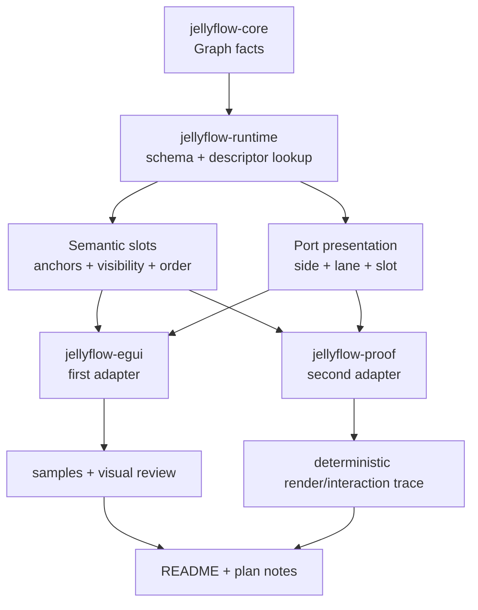
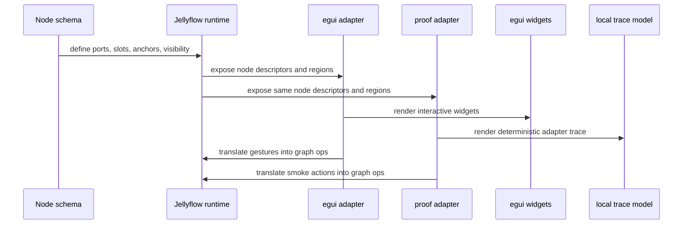

# feat: Second Adapter Semantic Surface Contract

## Summary

Jellyflow has already accepted the semantic-surface boundary and proven it once in `jellyflow-egui`.
The next plan should validate that boundary as a real interface: make the slot/anchor model easier
to consume, prove it with a second adapter that does not depend on egui, and keep the public
surface narrow enough that a shared UI crate is still unnecessary.

This is not a UI-framework rewrite. It is a contract-hardening pass for the adapter seam.

---

## Problem Frame

The current codebase already has the right direction:

- `jellyflow-runtime::schema` carries semantic node slots and port presentation metadata;
- `jellyflow-egui` renders those semantics into a rich immediate-mode frontend;
- `jellyflow-proof` exists as a lightweight second-adapter boundary.

What is still missing is evidence that the interface is actually stable outside egui. Right now,
the contract is visible, but it has only been exercised in one real frontend. That leaves three
risks:

1. the semantic vocabulary drifts toward egui-shaped needs;
2. adapters start duplicating resolution logic instead of sharing the same contract;
3. future customization work becomes harder because the seam was never validated by a second
   consumer.

This plan makes the interface deeper by proving it against another adapter and by tightening the
resolution helpers that both adapters need.

---

## Requirements

**Headless contract**

- R1. Keep `jellyflow-core` and `jellyflow-runtime` renderer-free.
- R2. Keep graph mutation, transactions, and descriptor lookup as the source of truth.
- R3. Keep semantic slots and port anchors renderer-neutral and serializable.

**Adapter contract**

- R4. Make the semantic slot vocabulary stable enough for workflow cards, ERD rows, mind-map
  topics, knowledge boards, and custom node surfaces.
- R5. Let adapters resolve slots, anchors, ordering, and visibility without framework widget
  types in the headless crates.
- R6. Prove a second adapter can consume the same surface without depending on `egui`.

**Conformance and examples**

- R7. Add coverage for selection, hit regions, anchored handles, and low-zoom degradation.
- R8. Keep user-facing examples focused on real product shapes, not toy cards.
- R9. Document how to build custom node UI without turning the core model into a widget tree.

**Deferred**

- R10. Keep a shared UI crate deferred until the second adapter proves the seam is real.
- R11. Keep CRDT, incremental layout, and execution/runtime work outside this plan.

---

## Scope Boundaries

In scope:

- runtime schema helper methods for slot and anchor resolution;
- second-adapter proof work in `jellyflow-proof`;
- conformance fixtures for semantic regions and selection behavior;
- egui sample and documentation refresh where it explains the contract.

Out of scope:

- a shared UI surface crate;
- browser or DOM adapter implementation;
- CRDT or multiplayer sync;
- workflow execution or scheduling;
- performance tuning as a primary goal.

### Deferred

- A shared `jellyflow-ui-surface` crate can be revisited later if the second adapter makes the seam
  obviously real.
- Incremental layout and deeper spatial indexing remain separate tracks.

---

## Key Technical Decisions

- KTD1. Treat semantic slots as the public interface, not as a thin wrapper over egui widgets.
- KTD2. Keep `slot` for data lookup and `anchor` for adapter-local placement or port binding.
- KTD3. Make the second adapter a real consumer of the contract, not a pass-through around egui
  types.
- KTD4. Keep adapter-local render state and widget lifecycle outside the headless crates.
- KTD5. Use deterministic traces and conformance fixtures to validate behavior before widening the
  vocabulary.

---

## High-Level Technical Design

---

## Phased Delivery

- Phase 0: tighten the runtime-facing slot and anchor helpers so both adapters use the same
  resolution rules.
- Phase 1: deepen `jellyflow-proof` into a real second-adapter smoke that consumes the semantic
  surface without egui.
- Phase 2: add adapter conformance coverage for selection, hit regions, and zoom-sensitive content
  behavior.
- Phase 3: refresh samples and docs so users can see how to build custom node surfaces for multiple
  frontend styles.
- Phase 4: decide whether the seam justifies a shared UI crate, based on actual reuse pressure.

---

## System-Wide Impact

This plan touches `jellyflow-runtime`, `jellyflow-egui`, `jellyflow-proof`, the top-level
`jellyflow` facade, product samples, and the documentation that explains how node surfaces are
supposed to work.

The main architecture risk is widening the headless surface too early. The plan avoids that by
forcing a second adapter to consume the same interface before any shared UI abstraction is added.

---

## Implementation Units

### U1. Stabilize adapter-facing slot and anchor resolution

**Goal:** Make the runtime schema the single place where adapters learn how to resolve slot keys,
anchor keys, ordering, and visibility.

**Requirements:** R1, R2, R3, R5.

**Dependencies:** None.

**Files:** `crates/jellyflow-runtime/src/schema/types.rs`, `crates/jellyflow-runtime/src/schema/registry/mod.rs`, `crates/jellyflow-runtime/src/schema/tests/builder.rs`, `crates/jellyflow-runtime/src/schema/tests/view_descriptor.rs`, `crates/jellyflow-runtime/tests/public_surface.rs`, `crates/jellyflow-egui/src/renderer.rs`.

**Approach:** Add helper methods that make the current semantic vocabulary easy to query by key,
kind, anchor, and order. Keep the descriptor as the canonical contract and avoid introducing
framework-specific types or adapter-local caches into the runtime surface.

**Patterns to follow:** `NodeKindViewDescriptor`, `NodeSurfaceSlotDescriptor`, `PortViewDescriptor`,
and the existing egui renderer lookup flow.

**Test scenarios:**

- A schema with no extra metadata preserves the current fallback behavior.
- Slot order is deterministic when multiple slots share a kind or lane.
- Anchor-based lookup returns the same region identity across callers.
- Hidden and collapsed metadata remain visible to adapters as data, but not as widget state.
- Public-surface tests continue to reject framework-widget types in headless crates.

**Verification:** Runtime schema tests and public-surface checks cover the helper behavior.

### U2. Turn `jellyflow-proof` into a real second-adapter smoke

**Goal:** Make the proof crate consume the semantic surface as an actual adapter, not as a thin
wrapper around egui concepts.

**Requirements:** R4, R6, R9, R10.

**Dependencies:** U1.

**Files:** `crates/jellyflow-proof/src/lib.rs`, `crates/jellyflow-proof/src/main.rs`, `crates/jellyflow-proof/examples/adapter_smoke.rs`, `crates/jellyflow-proof/tests/proof.rs`, `crates/jellyflow-proof/README.md`.

**Approach:** Give the proof crate a small local adapter model that reads `NodeGraphStore` and
`NodeKindViewDescriptor`, resolves semantic slots, and emits a deterministic render or interaction
trace for review. Keep the crate headless and publish-disabled. The point is to prove that a second
frontend can consume the interface without egui.

**Patterns to follow:** `templates/headless-adapter`, the current `jellyflow-proof` skeleton, and
the `jellyflow-egui` renderer/state split.

**Test scenarios:**

- The proof registry exposes a rich node surface with the same semantic fields as egui.
- Proof graph instantiation builds nodes and ports through the headless model.
- The adapter trace is deterministic for a given graph and schema.
- The proof crate does not depend on `egui` or `eframe`.
- Hidden/collapsed metadata stays semantic rather than becoming adapter state.
- The proof smoke runs through create, query, and render-like steps without private field access.

**Verification:** `cargo test -p jellyflow-proof` and the proof smoke path stay green.

### U3. Add conformance coverage for selection and region behavior

**Goal:** Lock down the behaviors that matter across adapters: selection, hit regions, anchored
handles, and zoom-sensitive content degradation.

**Requirements:** R3, R5, R6, R7.

**Dependencies:** U1, U2.

**Files:** `crates/jellyflow-runtime/src/runtime/tests/adapter_conformance/product_fixtures.rs`, `crates/jellyflow-runtime/src/runtime/tests/adapter_conformance/mod.rs`, `crates/jellyflow-egui/src/samples.rs`, `crates/jellyflow-proof/tests/proof.rs`.

**Approach:** Keep fixtures small but product-shaped. Validate the same semantic rules in both the
egui and proof paths, even if the renderers themselves are different. Focus on graph facts and
adapter-visible traces, not on framework-specific controls.

**Test scenarios:**

- Workflow, ERD, mind map, and knowledge-board shapes can all be expressed with the same semantic
  surface.
- Field rows and action rows anchor handles consistently.
- Selection remains reversible through the headless runtime path.
- Low zoom suppresses detail without breaking the node shell or overlapping content.
- The same semantic graph can be consumed by egui and proof without changing core storage.

**Verification:** Adapter conformance tests and the proof smoke cover the same contract from two
frontend angles.

### U4. Refresh examples and documentation for custom node surfaces

**Goal:** Make the supported surface obvious to users and future contributors.

**Requirements:** R8, R9.

**Dependencies:** U2, U3.

**Files:** `crates/jellyflow-egui/README.md`, `crates/jellyflow-proof/README.md`, `crates/jellyflow/README.md`, `README.md`, `crates/jellyflow-egui/examples/*.rs`, `crates/jellyflow-proof/examples/adapter_smoke.rs`.

**Approach:** Update the egui examples and README text so they explain how to build custom node UI
with semantic slots, anchors, and adapter-owned renderers. Make the proof README explain why it is
not a shared UI layer. Keep the supported product shapes visible: workflow, ERD, mind map, tree,
knowledge board, and custom widgets.

**Test scenarios:**

- Example commands still match the actual crate layout.
- README guidance explains the semantic surface without implying widget ownership in headless
  crates.
- The custom node example describes how slots, anchors, and renderers fit together.
- The proof README clearly states the crate's role as a boundary proof.

**Verification:** Documentation matches the code structure and the example gallery remains
representative.

---

## Success Metrics

| Metric | Target | Measurement |
| --- | --- | --- |
| Adapter portability | A second adapter consumes the same semantic surface without egui types | proof smoke |
| Semantic reuse | Workflow, ERD, mind map, and knowledge-board nodes use the same slot vocabulary | sample set |
| Contract clarity | `slot` and `anchor` mean the same thing everywhere | runtime helpers + docs |
| Behavior stability | Selection and region behavior stay deterministic across adapters | conformance tests |
| User clarity | Docs explain how to build custom node surfaces without editing headless crates | README review |

---

## Risks & Mitigations

| Risk | Severity | Likelihood | Mitigation |
| --- | --- | --- | --- |
| The semantic vocabulary becomes too egui-shaped | High | Medium | keep runtime helpers renderer-neutral and prove them in the second adapter |
| The proof crate stays too shallow to matter | High | Medium | require a deterministic trace and graph-backed smoke path |
| Adapters diverge in selection or region behavior | Medium | Medium | add conformance coverage that checks the same semantic contract twice |
| The plan starts to imply a shared UI crate too early | Medium | Medium | keep shared UI deferred until reuse pressure is demonstrated |
