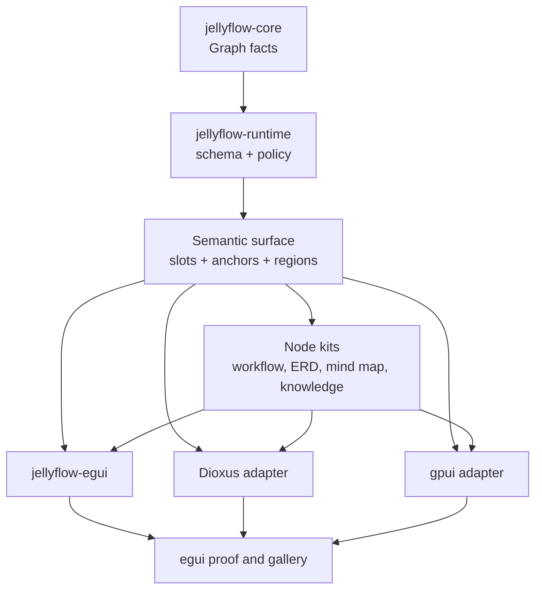
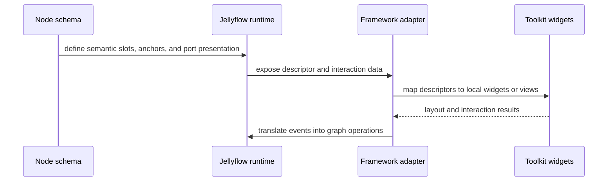

# feat: Adapter Node-Kit Boundary and Multi-Framework Proof

## Summary

Jellyflow should turn the semantic-surface decision into a reusable adapter and node-kit boundary.
The next slice should not introduce a shared widget crate. Instead, it should define the smallest
stable contract that lets egui, Dioxus, gpui, and future frontends consume the same node
descriptors, slot vocabulary, and interaction results while each adapter owns its local widgets and
lifecycle.

This is a follow-up to:

- ADR 0008, which fixes the semantic-surface boundary;
- the second-adapter proof work, which showed that the headless seam can be consumed outside egui;
- the current product-surface work, which already identified workflow, automation, ERD, mind map,
  and knowledge-canvas pressure.

The goal is to make Jellyflow feel like a Rust-native XYFlow base plus node kits, not like a single
adapter with a thin facade.

---

## Problem Frame

The repository already has the important primitives:

- semantic slots and port presentation metadata live in `jellyflow-runtime::schema`;
- `jellyflow-egui` consumes that surface through adapter-owned render traits;
- `jellyflow-proof` and the headless adapter template prove the boundary can be consumed without
  egui widget ownership.

What is still missing is a durable answer to the next level of reuse:

1. where the reusable node-kit boundary should live;
2. what the shared adapter contract should look like across egui, Dioxus, and gpui;
3. which egui-specific helpers are temporary glue versus real reusable surface;
4. which product shapes should become first-class kits instead of sample-local code.

The risk is either freezing too early on a shallow shared UI layer or leaving all reuse trapped in
per-example code. The plan should force the contract to be real before any shared UI crate exists.

---

## Node Kit Base Design

A node kit is not a widget library. It is a versioned package of semantic node families, layout
recipes, default data, and conformance fixtures that multiple adapters can consume.

### Node kit contents

Each kit should contain:

- `manifest`: kit id, version, supported adapters, capabilities, and dependency notes.
- `node kinds`: the reusable semantic node schemas exposed to palette, creation, and inspection.
- `surface recipes`: how slots, ports, regions, badges, action rows, previews, and nested regions
  are composed.
- `layout hints`: zoom degradation thresholds, anchor rules, spacing defaults, and measurement
  expectations.
- `default payloads`: starter data that makes the first rendered node look like a real product
  surface.
- `fixtures`: sample graphs and trace cases that prove the kit behaves the same across adapters.

The kit should not contain:

- widget trees;
- adapter caches;
- retained UI state;
- runtime execution logic;
- toolkit-specific measurement APIs.

### Component taxonomy

The reusable building blocks should be semantic blocks, not generic controls:

- structural blocks: `CardShell`, `HeaderBlock`, `BodyBlock`, `FooterBlock`, `Divider`, `Spacer`;
- content blocks: `Title`, `Summary`, `Badge`, `Icon`, `FieldRow`, `PreviewBlock`;
- interactive blocks: `ActionRow`, `InputRow`, `ToggleChip`, `PortRail`, `Handle`;
- diagnostic blocks: `ValidationBadge`, `ErrorBanner`, `WarningBanner`;
- composition blocks: `NestedRegion`, `FieldGroup`, `Rail`, `Stack`, `Band`.

These blocks describe intent, layout, and interaction, but each adapter maps them to its own
toolkit primitives:

- egui uses immediate-mode child `Ui` regions and adapter-owned render traits;
- Dioxus uses component trees and local signals;
- gpui uses retained views and incremental update state.

### Adapter contract

The shared contract between runtime and adapters should stay small:

1. resolve a node kind to a kit-aware descriptor;
2. measure the node and its semantic regions;
3. render local toolkit widgets for those regions;
4. emit interaction events back to runtime;
5. keep adapter-local state out of headless crates.

That contract should be described in data, not in toolkit types. The headless surface can expose
semantic slots, anchors, ordering, visibility, and port presentation metadata; adapters decide how
to realize those hints locally.

### First kit families

The first reusable kits should be aligned with repeated product pressure:

- workflow / automation: trigger, tool, decision, branch, error path, output;
- ERD / table: table, column row, key badge, relation summary, cardinality marker;
- mind map / knowledge canvas: topic, summary, source, note, nested region, compact preview.

These kits should mostly differ in default schemas and surface recipes, not in the underlying
semantic vocabulary. If a new kit demands new primitives, the design should prove that the primitive
is reusable outside that one product family.

### Evolution rules

- Add a primitive only when at least two kit families need it.
- Keep kit versioning explicit so adapters can support older descriptors while a new recipe rolls
  out.
- Prefer removing egui-specific glue once a shared semantic recipe exists.
- Avoid a shared widget crate until the same contract has been consumed by multiple adapters.

---

## Requirements

**Headless contract**

- R1. Keep `jellyflow-core` and `jellyflow-runtime` renderer-free.
- R2. Keep semantic slots, anchors, ordering, visibility, and port presentation renderer-neutral
  and serializable.
- R3. Keep graph mutation, store commit, conformance, and projection behavior as the source of
  truth.

**Adapter contract**

- R4. Define a small reusable adapter contract for node measurement, slot layout, render output,
  and interaction events without exposing widget types in headless crates.
- R5. Keep adapter-local state, widget lifecycle, memoization, and toolkit-specific measurement
  inside the adapter.
- R6. Make egui, Dioxus, and gpui able to consume the same node descriptors and node-kit metadata
  without changing graph storage.

**Node kits**

- R7. Extract reusable node kits for workflow/automation, ERD/table relations, mind map /
  knowledge canvas, and other repeated product shapes when the semantics actually repeat.
- R8. Keep product kits focused on semantic descriptors and default data, not on framework
  components.
- R9. Allow fearless refactoring to delete egui-specific duplication once the reusable contract is
  covered by tests and adapter proofs.

**Validation**

- R10. Prove the contract with at least one non-egui adapter path, then extend to a second
  framework-shaped consumer.
- R11. Add behavior tests and trace fixtures for region resolution, slot ordering, low-zoom
  degradation, and anchored handle placement where relevant.
- R12. Keep a shared UI crate deferred until multiple adapters show real reuse pressure.

---

## Scope Boundaries

In scope:

- adapter-facing node-kit contract and naming;
- reusable slot/anchor/layout metadata cleanup;
- egui glue simplification where it is clearly duplicated or temporary;
- Dioxus and gpui proof adapters or adapter templates;
- workflow, ERD, mind-map, and knowledge-canvas node-kit extraction;
- docs and README guidance for custom node UI.

Out of scope:

- a shared widget crate in the first slice;
- browser or DOM adapter implementation;
- execution runtime, scheduler, or collaboration features;
- CRDT or multiplayer sync;
- visual design system work unrelated to the node-kit contract.

### Deferred

- A shared `jellyflow-ui-surface` crate can be revisited later if reuse pressure becomes obvious.
- Full product implementations for Dify, Unreal Blueprints, Unity Shader Graph, or MarginNote-like
  apps remain outside the headless engine boundary.

---

## Key Technical Decisions

- KTD1. Keep the contract semantic, not widget-based. The shared surface should describe node
  meaning, slot layout, and interaction outcomes, not `egui::Ui`, component trees, or retained
  widget instances.
- KTD2. Treat node kits as product-family packages. A workflow kit and an ERD kit should share the
  same runtime vocabulary, but each kit can define its own schema presets and default data.
- KTD3. Make adapter implementations responsible for toolkit mapping. egui, Dioxus, and gpui
  should each translate the same descriptors into local render trees and event systems.
- KTD4. Delete code aggressively once it is proven redundant. If a helper only exists because the
  old surface was too shallow, replace it with the reusable contract or remove it.
- KTD5. Use proof adapters to validate the contract before promoting it to a broader public API.
- KTD6. Keep kit contents data-first. Descriptors, recipes, and fixtures belong in the kit; widget
  instances, memoization, and gesture ownership stay in the adapter.

---

## High-Level Technical Design

---

## Phased Delivery

- Phase 0: inventory current egui-only helpers and decide which ones are real contract surface.
- Phase 1: define the reusable adapter/node-kit boundary and update the semantic vocabulary notes.
- Phase 2: extract the first reusable node kits for workflow/automation and ERD/table nodes.
- Phase 3: add a Dioxus proof adapter that consumes the same descriptors without egui types.
- Phase 4: add a gpui proof adapter and verify retained-view semantics are still fully headless.
- Phase 5: prune egui-specific duplication and update docs, examples, and conformance fixtures.

---

## Success Metrics

| Metric | Target | Measurement |
| --- | --- | --- |
| Semantic reuse | The same descriptors support workflow, ERD, mind map, and knowledge-board kits | sample gallery and kit fixtures |
| Adapter portability | egui, Dioxus, and gpui consume the same surface without headless widget types | proof adapters |
| Node-kit reuse | Repeated product shapes stop duplicating slot and anchor logic in samples | code review and tests |
| Fearless cleanup | Temporary egui helpers are deleted once their behavior is covered elsewhere | diff size and passing tests |
| Boundary stability | No framework widget types leak into `jellyflow-core` or `jellyflow-runtime` | public-surface checks |

---

## Risks & Mitigations

| Risk | Severity | Likelihood | Mitigation |
| --- | --- | --- | --- |
| The boundary becomes too abstract | High | Medium | keep the first contract small and driven by concrete kits |
| The boundary stays egui-shaped | High | Medium | force Dioxus and gpui proofs early |
| Cleanup deletes needed behavior | Medium | Medium | keep conformance fixtures and regression tests ahead of refactors |
| The plan drifts toward a shared UI crate too soon | Medium | Medium | defer that decision until reuse pressure is visible |

---

## Implementation Shape

### Minimal module split

- `jellyflow-runtime::schema`: owns semantic descriptors, kit manifests, and node recipes.
- `jellyflow-egui`: owns the first adapter implementation and any adapter-local widget glue.
- `jellyflow-proof`: proves a second consumer can render or trace the same descriptors.
- `templates/headless-adapter`: stays the external consumer template for non-egui proof.

### Refactor policy

- If code only exists because the node surface is too shallow, move the missing semantics into the
  kit contract or delete the code.
- If code is just an egui rendering convenience and no other adapter needs it, keep it adapter-local
  or drop it.
- If a helper is shared across kits and adapters, promote it to runtime schema or a shared
  descriptor helper.

### First deliverables

- a node kit manifest shape;
- a kit-aware semantic recipe vocabulary;
- a reusable component taxonomy;
- one workflow/automation kit;
- one ERD kit;
- one mind-map / knowledge-canvas kit;
- one Dioxus proof surface;
- one gpui proof surface.

---

## Implementation Units

### U1. Introduce node-kit manifests and recipe descriptors in runtime schema

**Goal:** Add first-class kit metadata to `jellyflow-runtime::schema` so a kit can name its family, version, supported adapters, surface recipe, and layout hints without embedding widget data.

**Files:** `crates/jellyflow-runtime/src/schema/types.rs`, `crates/jellyflow-runtime/src/schema/mod.rs`, `crates/jellyflow-runtime/src/schema/tests/builder.rs`, `crates/jellyflow-runtime/src/schema/tests/view_descriptor.rs`, `crates/jellyflow-runtime/tests/public_surface.rs`.

**Patterns:** `NodeSchema`, `NodeKindViewDescriptor`, `NodeSurfaceSlotDescriptor`, `PortViewDescriptor`, `NodeRegistry`.

**Test Scenarios:**

- A kit manifest round-trips through `serde` with stable defaults.
- Recipe ordering stays deterministic when slots share kind, lane, or anchor.
- `slot` continues to mean data lookup while `anchor` remains placement or binding.
- Public-surface checks still reject toolkit-specific types in headless crates.

**Verification:** `cargo nextest run -p jellyflow-runtime --lib` plus the public-surface checks.

### U2. Encode the first kit families and fixture packs

**Goal:** Define workflow/automation, ERD/table, and mind map/knowledge canvas kits as reusable semantic families with default payloads and fixture graphs.

**Files:** `crates/jellyflow-runtime/src/schema/kits/mod.rs`, `crates/jellyflow-runtime/src/schema/kits/workflow.rs`, `crates/jellyflow-runtime/src/schema/kits/erd.rs`, `crates/jellyflow-runtime/src/schema/kits/mind_map.rs`, `crates/jellyflow-runtime/src/schema/tests/kits.rs`, `crates/jellyflow-egui/src/samples.rs`.

**Patterns:** the current egui examples, `proof_node_registry()`, and the existing `task_card_schema()` test-fixture pattern.

**Test Scenarios:**

- Workflow kits expose trigger, tool, decision, branch, error, and output descriptors with consistent port anchors.
- ERD kits express tables, column rows, key badges, and relation summaries with stable ordering.
- Mind map kits express topic, summary, source, note, nested-region, and low-zoom recipes.
- Fixture graphs render or trace the same semantics across registry lookup and sample creation.

**Verification:** kit tests and sample or gallery snapshots stay green.

### U3. Rework `jellyflow-egui` into a pure semantic-kit adapter and delete duplicate glue

**Goal:** Consume kit manifests and recipe descriptors in the egui renderer, then remove any helper that only exists because the contract was too shallow.

**Files:** `crates/jellyflow-egui/src/renderer.rs`, `crates/jellyflow-egui/src/handle_layout.rs`, `crates/jellyflow-egui/src/ui/mod.rs`, `crates/jellyflow-egui/src/ui/canvas.rs`, `crates/jellyflow-egui/src/ui/inspector.rs`, `crates/jellyflow-egui/src/samples.rs`, `crates/jellyflow-egui/examples/*.rs`, `crates/jellyflow-egui/README.md`.

**Patterns:** `RichNodeRenderer`, `EguiNodeWidgetRenderer`, `NodeRenderLayout`, `NodeInteractiveRegion`, `NodeContentLevel`.

**Test Scenarios:**

- Workflow, ERD, and mind map nodes resolve to the same semantic recipe shapes in egui.
- Low zoom degrades detail without overlapping text, ports, or action rows.
- Removed egui-only helpers do not change rendering traces or selection behavior.
- Anchor-driven field rows keep ports aligned to their owning region.

**Verification:** targeted egui `nextest` runs and the gallery snapshot example remain green.

### U4. Extend proof and template coverage so the same contract works outside egui

**Goal:** Keep `jellyflow-proof` and `templates/headless-adapter` as deterministic consumers of the same kit and descriptor surface, proving the contract stays framework-neutral before any Dioxus or gpui port is attempted.

**Files:** `crates/jellyflow-proof/src/lib.rs`, `crates/jellyflow-proof/src/main.rs`, `crates/jellyflow-proof/examples/adapter_smoke.rs`, `crates/jellyflow-proof/tests/proof.rs`, `crates/jellyflow-proof/README.md`, `templates/headless-adapter/src/lib.rs`, `templates/headless-adapter/tests/conformance.rs`, `templates/headless-adapter/README.md`.

**Patterns:** the existing proof trace model, the adapter smoke suite, and the template's `AdapterRendererRegistry`.

**Test Scenarios:**

- Proof traces remain deterministic for a fixed graph, schema, and kit manifest.
- The template smoke suite consumes the same semantic descriptors without egui or eframe dependencies.
- Hidden and collapsed metadata stays semantic data rather than becoming adapter-local state.
- Public-surface tests continue to block framework-widget leakage into headless crates.

**Verification:** `cargo test -p jellyflow-proof`, `cargo test -p jellyflow-proof --example adapter_smoke`, and `cargo test --manifest-path templates/headless-adapter/Cargo.toml`.

### U5. Refresh docs and engineering memory for the new kit boundary

**Goal:** Update public docs and the engineering wiki so later work can resume without rediscovering the node-kit decision.

**Files:** `crates/jellyflow/README.md`, `crates/jellyflow-egui/README.md`, `crates/jellyflow-proof/README.md`, `docs/knowledge/engineering/current-state.md`, `docs/knowledge/engineering/log.md`, `docs/knowledge/engineering/sessions/2026-06-19-semantic-surface-node-kit-gap.md`.

**Patterns:** ADR 0008, current-state and log style, and the existing README guidance around headless adapters.

**Test Scenarios:**

- README snippets match the actual crate names and commands.
- The semantic-vs-widget distinction stays explicit in user-facing docs.
- The wiki bundle still points to the plan and proof artifacts that justify the boundary.

**Verification:** doc review, no broken links, and the engineering wiki validates.

---

## Notes

- ADR 0008 remains the durable architectural boundary for now.
- Add a new ADR only if the adapter/node-kit boundary becomes stable enough to freeze as a lasting
  repository decision.
- The main output of this slice is a reusable contract plus proof adapters, not a new product
  framework.
