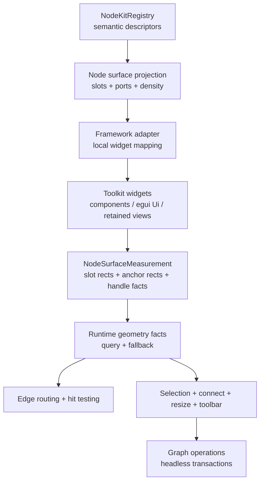
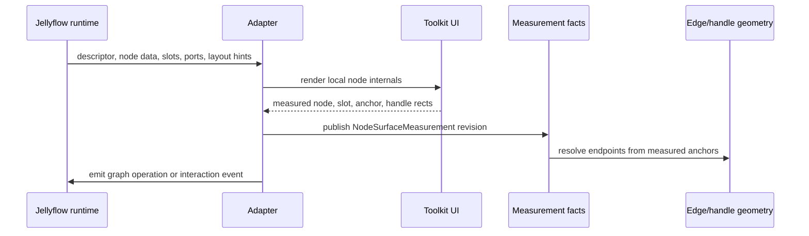
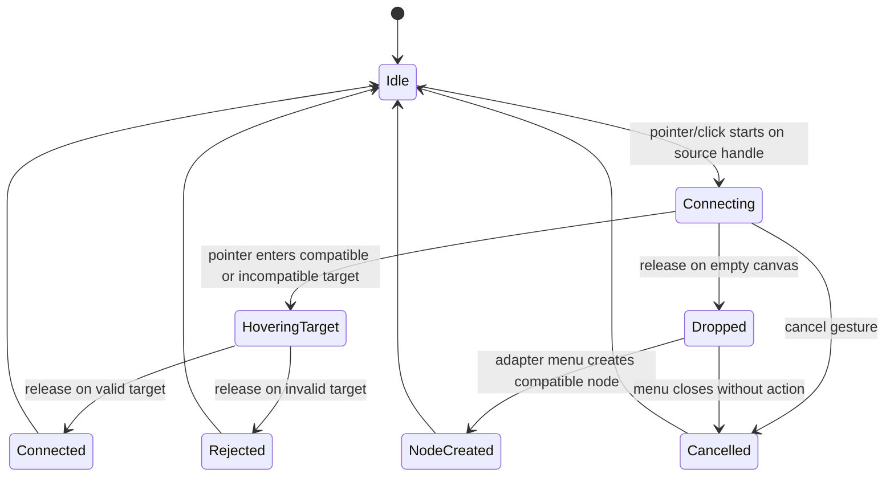

# feat: Node UI Capability Parity

## Goal Capsule

| Field | Value |
| --- | --- |
| Objective | Bring Jellyflow's node UI foundation up to the level expected from egui-snarl and XYFlow-style custom node libraries while preserving the headless semantic-surface and node-kit boundary. |
| Primary audience | Rust UI adapter authors building Dify-style workflow nodes, shader graph nodes, ERD/table nodes, and knowledge-canvas nodes. |
| Scope authority | ADR 0008 and ADR 0009 remain authoritative: core/runtime stay renderer-free, node kits stay semantic, adapters own toolkit widgets and state. |
| Stop condition | The runtime exposes the missing semantic/measurement contracts, egui and GPUI prove real measured node internals and connection behavior, examples demonstrate credible custom node UI, and conformance tests cover the new behavior. |
| Explicit non-goal | Do not build backend workflow execution, scheduling, remote collaboration, or a shared widget crate. |

---

## Product Contract

### Summary

Jellyflow should become a strong Rust-native node UI foundation, not merely a graph data model with simple boxes.
The target capability is comparable to the parts users value in egui-snarl and XYFlow: rich custom node internals, stable handles, measured geometry, polished wire interactions, resizers, toolbars, viewport affordances, and examples that resemble real Dify, Unreal Blueprint, Unity Shader Graph, ERD, and MarginNote-style products.

The implementation must keep Jellyflow's current positioning.
The reusable layer is headless runtime schema, node kits, semantic slots, anchors, measurements, interactions, and adapter conformance.
Framework widgets remain adapter-local for egui, GPUI, Dioxus, DOM, or other future renderers.

### Problem Frame

The current architecture has the right direction but not yet the full UI power.
ADR 0008 established semantic slots and framework adapter ownership.
ADR 0009 established node kits as versioned semantic packages.
The GPUI proof now shows semantic slots mapped to real component-library widgets, but the recent handle bug exposed the core gap: adapter UI, measured regions, port handles, and edge routing can still drift because the geometry contract is too shallow.

egui-snarl has the opposite strengths and weaknesses.
It is not headless and is tied to egui, but its UI loop is mature: node parts, pin widgets, wire dragging, hover hit-testing, dropped-wire menus, contextual menus, selection, zoom, and measured pin positions are all handled in one coherent UI flow.

XYFlow adds another useful reference point.
Its custom nodes are ordinary framework components; handles are embedded in those components; `useUpdateNodeInternals` lets dynamic handles trigger remeasurement; node resizers, node toolbars, minimap, background, viewport controls, controlled state, and connection validation are first-class user-facing patterns.

Jellyflow needs those capabilities without copying either library's framework binding.

### Requirements

**Headless capability**

- R1. Keep `jellyflow-core`, `jellyflow-layout`, and `jellyflow-runtime` free of egui, GPUI, Dioxus, DOM, windowing, and platform widget types.
- R2. Add renderer-neutral contracts for measured node internals, slot rectangles, port anchor rectangles, content density, and handle placement so adapters no longer rely on parallel geometry guesses.
- R3. Preserve `slot` as data lookup and `anchor` as placement or binding metadata across runtime, node kits, examples, and tests.
- R4. Support dynamic node internals: adapters must be able to report that a node's slot/handle layout changed after node data, component state, zoom, or size changes.

**Custom node UI**

- R5. Let adapters render real node-internal toolkit widgets for semantic slots such as field rows, action rows, badges, previews, nested regions, validation banners, and tool/status strips.
- R6. Support Dify-style nodes with model badges, prompt/config rows, action buttons, run status, error state, and nested policy/tool regions.
- R7. Support shader/blueprint-style typed ports, colored wires, compact labels, preview widgets, and dense field rows.
- R8. Support ERD/table nodes with anchored field handles, primary/foreign-key badges, relation cardinality, and resize-stable field geometry.
- R9. Support knowledge-canvas nodes with title/source/preview regions and low-zoom degradation that preserves anchors.

**Interaction parity**

- R10. Provide an adapter-facing connection lifecycle equivalent to mature node editors: connect start, hover target, validation, connect end, cancel, reconnect, disconnect, and dropped-wire handling.
- R11. Support wire hit-testing, hover styling, selectable edges, edge toolbars or labels, and route styles without baking one renderer's drawing model into runtime.
- R12. Support node resizer and node toolbar semantics in the adapter layer while keeping resize constraints and graph mutations headless.
- R13. Support selection, panning, zooming, fit-view, minimap/overview data, and low-zoom content reduction from shared geometry facts.

**Adapter proof**

- R14. Make egui prove immediate-mode measured internals through `NodeInteractiveRegion` or its successor.
- R15. Make GPUI prove retained/component node internals with real component-library widgets and measured handle positions, not fixed formulas.
- R16. Prepare Dioxus as a component-tree proof consumer after the measurement and interaction contracts are stable enough.

**Validation**

- R17. Add conformance fixtures and tests that catch handle/slot drift, dynamic internal updates, connection lifecycle regressions, and low-zoom degradation.
- R18. Keep user-facing examples credible enough to evaluate product fit without reading implementation notes.

### Scope Boundaries

In scope:

- Runtime contracts for node-internal measurements, semantic regions, port-anchor facts, dynamic internals, connection lifecycle, edge interaction, and adapter conformance.
- egui adapter hardening where it proves measured custom node UI.
- GPUI proof work in `repo-ref/open-gpui/examples/canvas-jellyflow` and, where needed, `repo-ref/open-gpui/crates/canvas`.
- Node-kit vocabulary additions when multiple product families need them.
- Examples for workflow/Dify, shader/blueprint, ERD/table, and knowledge-canvas style nodes.

Out of scope:

- Backend workflow execution, schedulers, model/tool execution, server APIs, persistence services, or distributed collaboration.
- A shared widget crate.
- A full product clone of Dify, Unreal Blueprint, Unity Shader Graph, or MarginNote.
- Browser automation or DOM adapter implementation in this slice.
- Pixel-perfect visual branding for every example.

### Acceptance Examples

- AE1. Given a Dify-style LLM node whose prompt/config rows change, when the adapter remeasures node internals, then connected handles and edge endpoints move to the updated semantic rows without a manual formula change.
- AE2. Given a shader-style node with typed ports, when a user drags a wire over an incompatible target, then the adapter can show invalid-target feedback and runtime rejects the connection consistently.
- AE3. Given an ERD table node with many fields, when the node is resized, then field rows, PK/FK badges, anchored handles, and edge endpoints stay aligned.
- AE4. Given a wire dropped on empty canvas, when the active adapter supports dropped-wire menus, then the UI can offer compatible node creation without runtime depending on that toolkit menu.
- AE5. Given a low zoom level, when a rich node collapses to a compact shell, then semantic anchors and visible handles remain stable enough for edge routing and hit testing.

---

## Planning Contract

### Key Technical Decisions

- KTD1. Make measurement the missing bridge. Semantic slots are not enough for rich UI parity; adapters must report measured `slot`, `anchor`, `handle`, and node bounds facts so edges and hit tests follow real rendered content.
- KTD2. Keep custom UI adapter-owned. Jellyflow should expose what exists and what changed, not toolkit widget instances. egui renders child `Ui`, GPUI renders retained/component views, and Dioxus renders component trees.
- KTD3. Treat egui-snarl as interaction prior art, not an architecture template. Borrow its node-part layout, pin measurement, wire lifecycle, and menu affordances, but keep Jellyflow's graph/runtime/adapter split.
- KTD4. Treat XYFlow as API prior art for custom nodes. Borrow dynamic internal update, handles embedded in custom nodes, node resizers, toolbars, minimap, and controlled-state semantics, but translate them into Rust data contracts and adapter APIs.
- KTD5. Promote only semantic reuse. If duplicated adapter code is visual toolkit glue, keep it local. If duplicated code describes slots, anchors, connection lifecycle, geometry facts, or conformance behavior, promote it to runtime or proof fixtures.
- KTD6. Measure before routing. Edge endpoints, wire previews, and handle hit targets should use adapter-reported region facts when present and deterministic fallback geometry only when measurement is missing.
- KTD7. Examples are part of the contract. The UI library claim is not credible until examples demonstrate real nodes with internal controls, dynamic handles, resizers, toolbar affordances, and connection validation.

### Real Gap Inventory

| Area | Current Jellyflow state | egui-snarl / XYFlow reference | Gap |
| --- | --- | --- | --- |
| Node internals | Semantic slots and adapter-local rendering exist | Custom UI directly owns visible controls | Need measured slot/region reporting and dynamic update events |
| Handle placement | Runtime has port view anchors; GPUI proof recently added slot-anchor formulas | Pins/handles are measured from actual UI elements | Replace formulas with measurement-backed anchor facts |
| Connection lifecycle | Core graph mutations and adapter connection basics exist | Mature connect, reconnect, drop, cancel, hover, validation flows | Need renderer-neutral connection interaction contract |
| Wire interaction | Edge routes and geometry exist | Wire hover hit-test, styles, disconnect, menus, widgets | Need adapter-facing edge interaction and route-style surface |
| Resizer/toolbars | Resize semantics exist; egui has hardening plan | XYFlow exposes NodeResizer and NodeToolbar | Need adapter-owned node chrome semantics and examples |
| Dynamic handles | Not first-class as a user-facing contract | XYFlow has `useUpdateNodeInternals` | Need node-internal invalidation and remeasurement request path |
| Examples | Workflow/ERD/mind-map kits and GPUI proof exist | Examples show real UI patterns | Need credible Dify/shader/ERD/knowledge examples across adapters |
| Conformance | Runtime/proof tests exist | UI libraries exercise custom nodes and interactions | Need adapter conformance for measurement and connection lifecycle |

### High-Level Technical Design

### Sequencing

The work should land in phases:

1. Establish runtime measurement and dynamic-internals contracts.
2. Use those facts for handle, edge, and hit-test resolution.
3. Add connection lifecycle and edge interaction semantics.
4. Prove egui and GPUI adapters with real internal UI.
5. Expand node-kit recipes and examples to product-grade nodes.
6. Add Dioxus proof after the measurement contract is stable.

---

## Implementation Units

### U1. Define node surface measurement facts

**Goal:** Add renderer-neutral measurement data for node internals so adapters can report actual slot, anchor, handle, and node bounds facts after rendering local widgets.

**Requirements:** R1, R2, R3, R4, R17, AE1, AE3, AE5.

**Dependencies:** None.

**Files:** `crates/jellyflow-runtime/src/runtime/measurement.rs`, `crates/jellyflow-runtime/src/runtime/geometry/`, `crates/jellyflow-runtime/src/schema/types.rs`, `crates/jellyflow-runtime/src/schema/kit/mod.rs`, `crates/jellyflow-runtime/src/runtime/tests/measurement.rs`, `crates/jellyflow-runtime/src/schema/tests/view_descriptor.rs`, `crates/jellyflow-runtime/tests/public_surface.rs`.

**Approach:** Extend the existing measurement/geometry surface with node-local semantic measurement facts. The contract should record node id, revision, measured node size, slot key rects, anchor id rects, port id or port key handle facts, content density, visibility, and fallback reason when measurement is absent. Keep all geometry in renderer-neutral canvas/node-local coordinates.

**Patterns to follow:** `NodeSurfaceSlotDescriptor`, `NodeKindViewDescriptor`, `NodeKitLayoutHints`, `NodeInteractiveRegion`, and existing runtime measurement tests.

**Test scenarios:**

- Report a measured `field.prompt` anchor for a node and resolve the associated port endpoint from that anchor instead of fallback side spacing.
- Report a changed measurement revision after node data changes and verify stale anchor facts are not reused.
- Omit a slot measurement and verify endpoint resolution falls back deterministically to port side and order.
- Serialize and deserialize measurement facts without any framework-specific type.
- Keep `slot` data lookup and `anchor` placement semantics distinct in tests.

**Verification:** Runtime tests prove measured anchor facts drive endpoint resolution and public-surface checks keep headless crates renderer-free.

### U2. Add dynamic internals invalidation and remeasurement flow

**Goal:** Give adapters a first-class way to say that a node's internal UI changed and its measured handles/slots must be refreshed, matching the role of XYFlow's node internals update without copying its DOM model.

**Requirements:** R2, R4, R10, R14, R15, R17, AE1.

**Dependencies:** U1.

**Files:** `crates/jellyflow-runtime/src/runtime/store/`, `crates/jellyflow-runtime/src/runtime/measurement.rs`, `crates/jellyflow-runtime/src/runtime/tests/measurement.rs`, `crates/jellyflow-egui/src/bridge.rs`, `repo-ref/open-gpui/examples/canvas-jellyflow/src/main.rs`, `templates/headless-adapter/src/lib.rs`.

**Approach:** Introduce an adapter-facing invalidation request for one or more nodes. Runtime should mark measurement facts dirty or revisioned, adapters should refresh measurements on the next render/update pass, and edge/handle queries should know whether they are using fresh, stale, or fallback geometry. This is a headless event and query contract, not a scheduling or backend feature.

**Patterns to follow:** `NodeGraphStore` transaction and view-state publication patterns, existing resize/session request structs, and the GPUI proof's current `project_semantic_port_y` fallback as a behavior to replace.

**Test scenarios:**

- Change a node's data so a field row value appears or disappears, invalidate internals, and verify endpoint facts are recomputed.
- Invalidate multiple nodes in one request and verify unrelated measurements remain valid.
- Query geometry while a node is dirty and verify callers receive either explicit stale metadata or deterministic fallback.
- Ensure invalidation does not mutate graph semantic data by itself.

**Verification:** Runtime and adapter tests can reproduce a dynamic-handle scenario without manual recalculation.

### U3. Route handles, edges, and hit tests through measured geometry

**Goal:** Make edge endpoints, handle hit targets, connection previews, and node-region hit tests use one measurement-backed geometry path.

**Requirements:** R2, R10, R11, R13, R17, AE1, AE2, AE3, AE5.

**Dependencies:** U1, U2.

**Files:** `crates/jellyflow-runtime/src/runtime/geometry/`, `crates/jellyflow-runtime/src/runtime/binding/resolve.rs`, `crates/jellyflow-runtime/src/runtime/tests/geometry/`, `crates/jellyflow-egui/src/ui/canvas.rs`, `crates/jellyflow-egui/src/renderer.rs`, `repo-ref/open-gpui/crates/canvas/src/geometry_facts.rs`, `repo-ref/open-gpui/examples/canvas-jellyflow/src/main.rs`.

**Approach:** Define a single resolver order: measured handle rect, measured anchor rect, declared port view side/order, node bounds fallback. Adapters should consume that resolver for edge drawing and hit testing rather than maintaining separate formula paths. GPUI's proof helper that estimates anchor y from slot order should become a fallback or disappear.

**Patterns to follow:** `NodeInteractiveRegion`, `CanvasHandle::bounds_in_node`, `CanvasGeometryFacts`, runtime `handle_anchor_position`, and the new handle-anchor regression in the GPUI example.

**Test scenarios:**

- A resized ERD node keeps PK/FK edge endpoints aligned with measured field rows.
- A GPUI LLM node with reordered component slots keeps prompt/completion handles aligned with measured slot rows.
- Edge previews during drag use the same measured endpoint as committed edges.
- Hidden or collapsed slots do not produce pickable handles unless their port view explicitly remains visible.
- Fallback side spacing remains deterministic for nodes without measurement facts.

**Verification:** Runtime, egui, and GPUI tests catch geometry drift between node internals, handles, and edge endpoints.

### U4. Introduce connection lifecycle and validation semantics

**Goal:** Add a renderer-neutral connection lifecycle that adapters can map to rich UI behavior: connect start, hover target, validation, connect end, reconnect, disconnect, cancel, and dropped-wire actions.

**Requirements:** R10, R11, R17, AE2, AE4.

**Dependencies:** U3.

**Files:** `crates/jellyflow-runtime/src/runtime/connection/`, `crates/jellyflow-runtime/src/runtime/tests/connection.rs`, `crates/jellyflow-core/src/core/`, `crates/jellyflow-egui/src/bridge.rs`, `crates/jellyflow-egui/src/ui/canvas.rs`, `repo-ref/open-gpui/crates/canvas/src/tool.rs`, `repo-ref/open-gpui/crates/canvas/src/document.rs`.

**Approach:** Model connection interaction as a headless state machine with adapter-owned presentation. Runtime validates source/target roles, capacity, port type, custom validation hooks where already modeled, and graph mutation output. Adapters own menus, cursor feedback, sounds, colors, and local hover rendering.

**Patterns to follow:** egui-snarl `SnarlViewer::connect`, `disconnect`, `has_dropped_wire_menu`, XYFlow handle connection state, existing `GraphOp::AddEdge`, and current adapter input handling.

**Test scenarios:**

- Start a connection from a source port, hover a compatible target, and commit an edge.
- Hover an incompatible target and verify invalid-target state is exposed without creating an edge.
- Cancel a connection and verify no graph mutation occurs.
- Drop a wire on empty canvas and verify runtime reports a dropped-wire result that adapters can map to a menu.
- Reconnect an existing edge endpoint and verify capacity rules are applied consistently.

**Verification:** Connection lifecycle tests cover state transitions and adapter tests can render valid/invalid target feedback.

### U5. Add edge interaction and route-style surface

**Goal:** Support wire hover, selection, disconnect affordances, edge labels/toolbars, and route styles as adapter-facing semantics.

**Requirements:** R11, R13, R17, AE2, AE4.

**Dependencies:** U3, U4.

**Files:** `crates/jellyflow-core/src/core/`, `crates/jellyflow-runtime/src/runtime/geometry/`, `crates/jellyflow-runtime/src/runtime/tests/xyflow/`, `crates/jellyflow-egui/src/ui/canvas.rs`, `repo-ref/open-gpui/crates/canvas/src/routing.rs`, `repo-ref/open-gpui/crates/canvas/src/geometry_facts.rs`.

**Approach:** Keep concrete drawing adapter-owned, but expose route intent and interaction facts: straight, orthogonal, cubic/bezier-like, hit width, label anchor, selected/hovered state, and disconnect/reconnect capability. Do not force egui-snarl's wire formula into runtime; instead make route style an input to adapter routing.

**Patterns to follow:** `EdgeViewDescriptor`, GPUI `CanvasEdgeRouteKind`, egui-snarl `WireStyle`, and existing edge projection tests.

**Test scenarios:**

- Edge hit-testing uses interaction width and measured endpoints.
- Selected and hovered edge state can be represented without modifying edge semantic data.
- Orthogonal and bezier route hints survive projection to proof traces.
- Edge label anchor remains stable when node handles move after remeasurement.

**Verification:** Runtime/proof tests assert route metadata and adapter geometry tests assert hit-test behavior.

### U6. Formalize adapter-owned node chrome: resizer, toolbar, and overlays

**Goal:** Give adapters a stable way to implement NodeResizer, NodeToolbar, status strips, run controls, and overlay UI around nodes without leaking toolkit widgets into runtime.

**Requirements:** R5, R6, R7, R8, R9, R12, R13, R18.

**Dependencies:** U1, U3.

**Files:** `crates/jellyflow-runtime/src/schema/types.rs`, `crates/jellyflow-runtime/src/runtime/resize/`, `crates/jellyflow-egui/src/renderer.rs`, `crates/jellyflow-egui/src/ui/canvas.rs`, `repo-ref/open-gpui/examples/canvas-jellyflow/src/main.rs`, `repo-ref/open-gpui/crates/canvas/src/schema.rs`.

**Approach:** Add semantic chrome/overlay descriptors only where the concept is shared: resize controls, node toolbar placement, status strip, validation banner, run/action strip, and inspector anchor. Runtime owns resize constraints and semantic placement. Adapters own actual buttons, tooltips, popovers, focus, and visual styling.

**Patterns to follow:** XYFlow `NodeResizer`, `NodeToolbar`, existing runtime resize constraints, and egui `NodeRendererState`.

**Test scenarios:**

- A selected node exposes resize affordance metadata and resize constraints without storing toolkit state.
- A toolbar placement follows node bounds after drag, resize, and zoom.
- A Dify-style run/status strip can be represented as semantic chrome while GPUI/egui render different widgets.
- Headless proof traces can list toolbar/status semantics without rendering them.

**Verification:** Schema/runtime tests cover descriptors and adapter examples render chrome without changing core dependencies.

### U7. Expand semantic component recipes for product-grade nodes

**Goal:** Extend node-kit recipes enough to describe credible Dify, shader/blueprint, ERD, and knowledge-canvas nodes while keeping component mapping adapter-local.

**Requirements:** R5, R6, R7, R8, R9, R14, R15, R18, AE1, AE2, AE3, AE5.

**Dependencies:** U1, U6.

**Files:** `crates/jellyflow-runtime/src/schema/types.rs`, `crates/jellyflow-runtime/src/schema/kit/builtins.rs`, `crates/jellyflow-runtime/src/schema/tests/kit.rs`, `crates/jellyflow-proof/src/lib.rs`, `crates/jellyflow-egui/src/samples.rs`, `repo-ref/open-gpui/examples/canvas-jellyflow/src/main.rs`.

**Approach:** Add only reusable semantic slot kinds or renderer keys that at least two product families need. Likely additions include validation/status banner, typed port rail, key-value config group, run/action strip, preview/media block, and compact metric/status badge. Each addition needs proof trace output and at least one adapter mapping.

**Patterns to follow:** Existing `NodeSurfaceSlotKind`, builtin workflow/ERD/mind-map manifests, and GPUI component-library mapping for Badge/Button/Progress.

**Test scenarios:**

- Workflow LLM kit describes prompt/config/action/status regions without GPUI-only component names.
- Shader-style node describes typed ports and compact preview without relying on egui widgets.
- ERD table kit continues to use field rows and anchors after new recipe fields are added.
- Proof output can summarize every new slot kind deterministically.

**Verification:** Runtime kit tests and proof tests pass with new semantic recipes.

### U8. Harden egui adapter as the immediate-mode reference implementation

**Goal:** Make `jellyflow-egui` demonstrate egui-snarl-class measured pins, rich node internals, connection lifecycle, wire interaction, resizer behavior, and low-zoom degradation.

**Requirements:** R5, R10, R11, R12, R13, R14, R17, R18.

**Dependencies:** U1, U2, U3, U4, U5, U6, U7.

**Files:** `crates/jellyflow-egui/src/bridge.rs`, `crates/jellyflow-egui/src/renderer.rs`, `crates/jellyflow-egui/src/ui/canvas.rs`, `crates/jellyflow-egui/src/samples.rs`, `crates/jellyflow-egui/src/lib.rs`, `crates/jellyflow-egui/examples/custom_widget.rs`.

**Approach:** Use egui as the first full UI proof because its immediate-mode model is closest to egui-snarl. The adapter should render node internals, report measured regions, route handles through those measurements, expose connection states, and keep low-zoom details from overlapping.

**Patterns to follow:** Existing `EguiNodeWidgetRenderer`, `NodeInteractiveRegion`, `NodeContentLevel`, and prior egui UX hardening plan.

**Test scenarios:**

- Field-row widgets produce measured interactive regions and anchored handles.
- Connection drag shows valid and invalid target states.
- Wire hover hit-tests use measured endpoints and interaction width.
- Node resize updates measured internals and edge endpoints in the same visual frame.
- Low zoom hides detail while preserving shells and handles.

**Verification:** `jellyflow-egui` unit/integration tests and sample smoke tests pass with measured-region assertions.

### U9. Harden GPUI proof as the retained/component reference implementation

**Goal:** Make the GPUI proof show that retained/native component frameworks can consume the same contracts with real component-library widgets and measured handle placement.

**Requirements:** R5, R6, R10, R11, R12, R13, R15, R17, R18, AE1, AE4.

**Dependencies:** U1, U2, U3, U4, U6, U7.

**Files:** `repo-ref/open-gpui/examples/canvas-jellyflow/Cargo.toml`, `repo-ref/open-gpui/examples/canvas-jellyflow/src/main.rs`, `repo-ref/open-gpui/crates/canvas/src/document.rs`, `repo-ref/open-gpui/crates/canvas/src/geometry_facts.rs`, `repo-ref/open-gpui/crates/canvas/src/schema.rs`, `repo-ref/open-gpui/crates/ui_components/`.

**Approach:** Replace the GPUI example's slot-order handle formula with measurement-backed component geometry. Keep `CanvasKindRegistry` focused on renderer policy, use `NodeKitRegistry::builtin()` for semantic source, and map semantic slots to the open-gpui component library locally.

**Patterns to follow:** Current GPUI proof, `CanvasHandle`, `CanvasGeometryFacts`, `CanvasNodeRenderPolicy`, and the component-library contract in `repo-ref/open-gpui`.

**Test scenarios:**

- Component-rendered Prompt and Completion rows report measured anchors and handles follow them.
- Dynamic component visibility changes trigger node internals invalidation.
- Toolbar/status/action components fit within node bounds at normal zoom and degrade at compact zoom.
- Edge endpoints stay aligned after node resize and slot reordering.

**Verification:** `cargo fmt --manifest-path repo-ref/open-gpui/examples/canvas-jellyflow/Cargo.toml --check`, `RUSTFLAGS='-Awarnings' cargo test --quiet --manifest-path repo-ref/open-gpui/examples/canvas-jellyflow/Cargo.toml --bin open-gpui-canvas-jellyflow`, and `RUSTFLAGS='-Awarnings' cargo check --quiet --manifest-path repo-ref/open-gpui/examples/canvas-jellyflow/Cargo.toml` pass after the proof changes.

### U10. Add Dioxus proof after measurement contract stabilizes

**Goal:** Prove that the same semantic and measurement contracts can drive a component-tree adapter without egui or GPUI assumptions.

**Requirements:** R1, R5, R15, R16, R17.

**Dependencies:** U1, U2, U3, U7.

**Files:** `templates/headless-adapter/`, `crates/jellyflow-proof/src/lib.rs`, `docs/examples/`, `crates/jellyflow-runtime/tests/public_surface.rs`, optional future `repo-ref/dioxus-jellyflow-proof/` if the repository creates one.

**Approach:** Start as a proof or template rather than a full supported adapter. The proof should consume `NodeKitRegistry::builtin()`, render or trace component-tree regions, report measurement facts, and prove no egui/GPUI assumptions leak into the runtime API.

**Patterns to follow:** `jellyflow-proof`, `templates/headless-adapter`, and ADR 0008/0009.

**Test scenarios:**

- A Dioxus-shaped proof can project a workflow node into semantic component regions.
- The proof can report slot/anchor measurements with framework-neutral types.
- Public-surface checks continue to reject framework widget types in runtime/core.

**Verification:** Proof/template tests compile and consume the same node-kit descriptors as egui and GPUI.

### U11. Build product-grade example gallery and conformance fixtures

**Goal:** Turn examples into the acceptance surface for the node UI library claim.

**Requirements:** R6, R7, R8, R9, R13, R17, R18, AE1, AE2, AE3, AE4, AE5.

**Dependencies:** U7, U8, U9.

**Files:** `crates/jellyflow-egui/src/samples.rs`, `crates/jellyflow-egui/examples/`, `crates/jellyflow-runtime/src/schema/kit/builtins.rs`, `crates/jellyflow-proof/src/lib.rs`, `repo-ref/open-gpui/examples/canvas-jellyflow/src/main.rs`, `docs/README.md`, `README.md`.

**Approach:** Create or refresh example graphs for Dify-style workflow, shader/blueprint typed ports, ERD/table relations, and knowledge-canvas notes. Each example should use real node-kit descriptors, semantic slots, measured anchors, resize constraints, connection validation, and at least one dynamic internal update.

**Patterns to follow:** Existing builtin kit fixtures, egui sample graph smoke tests, GPUI canvas proof, and XYFlow example taxonomy.

**Test scenarios:**

- Every example graph has visible nodes, edges, semantic slots, and finite measured anchors.
- Dify example includes action rows, model/status badges, nested policy/tool regions, and dynamic prompt/config rows.
- Shader example includes typed ports, incompatible connection feedback, and compact preview.
- ERD example includes field handles, PK/FK badges, resize, and stable relation edges.
- Knowledge example degrades from rich preview to compact shell while preserving anchors.

**Verification:** Runtime fixture tests, proof traces, egui sample tests, and GPUI example tests all pass.

### U12. Document custom node authoring and adapter responsibilities

**Goal:** Make third-party adapter and node-kit authors understand how to build custom nodes without depending on backend logic or framework leakage.

**Requirements:** R1, R3, R4, R5, R10, R12, R17, R18.

**Dependencies:** U1, U4, U7, U8, U9.

**Files:** `README.md`, `docs/adr/README.md`, `docs/knowledge/engineering/current-state.md`, `docs/knowledge/engineering/log.md`, `templates/headless-adapter/README.md`, `crates/jellyflow-egui/README.md`, `docs/examples/`.

**Approach:** Document the mental model: node kits define semantics, adapters map widgets, measurements feed geometry, interactions emit runtime events, and backend execution is outside Jellyflow. Include a "custom node checklist" for slot design, anchor design, measurement reporting, dynamic internals, connection validation, and low-zoom behavior.

**Patterns to follow:** ADR 0008, ADR 0009, existing headless adapter template, and engineering memory conventions.

**Test scenarios:**

- Documentation examples compile where code snippets are part of templates.
- Public README does not imply Jellyflow owns backend execution.
- Adapter checklist distinguishes semantic descriptors from toolkit widgets.

**Verification:** Documentation review plus template tests.

---

## Verification Contract

| Gate | Applies to | Expected signal |
| --- | --- | --- |
| Runtime schema and measurement | U1, U2, U3, U4, U5, U7 | `cargo fmt --all --check` and `cargo nextest run -p jellyflow-runtime --lib` pass. |
| egui adapter | U3, U4, U5, U6, U8, U11 | `cargo nextest run -p jellyflow-egui --lib` passes with measured-region and interaction tests. |
| Proof/template | U7, U10, U11, U12 | `cargo test -p jellyflow-proof --example adapter_smoke` and `cargo test --manifest-path templates/headless-adapter/Cargo.toml` pass. |
| GPUI proof | U3, U6, U9, U11 | GPUI example format, test, and check commands pass under `repo-ref/open-gpui/examples/canvas-jellyflow`. |
| Public boundary | U1, U7, U10, U12 | Public-surface tests reject framework widget types in headless crates. |
| Visual confidence | U8, U9, U11 | Manual launch or screenshots show no node-internal overflow, stale handles, or obvious wire drift in Dify/ERD/shader/knowledge examples. |

---

## Definition of Done

- Runtime exposes measurement, dynamic internals, and connection lifecycle contracts without framework dependencies.
- egui and GPUI prove measured node internals with real custom UI and handle/edge alignment.
- At least one proof/template path shows a non-egui, non-GPUI consumer can use the same contracts.
- Dify-style, shader/blueprint-style, ERD/table, and knowledge-canvas examples exist as credible product-shaped demos.
- Handle placement, edge endpoints, wire previews, and hit targets resolve through the same measurement-aware geometry path.
- Dynamic internal updates can move handles without changing adapter formulas.
- Tests cover measured anchors, stale measurement fallback, connection validation, dropped-wire behavior, resize alignment, and low-zoom degradation.
- Documentation clearly states that Jellyflow is a front-end/headless node UI foundation and does not own backend workflow execution.
- Abandoned experimental code from implementation attempts is removed before completion.

---

## Risks & Dependencies

| Risk | Impact | Mitigation |
| --- | --- | --- |
| Measurement contract becomes too adapter-shaped | Runtime loses portability | Keep facts in canvas/node-local coordinates and reject toolkit widget types in public-surface tests. |
| Geometry resolver grows too complex | Edge and hit-test behavior becomes hard to reason about | Use a fixed resolver order and test every fallback tier. |
| GPUI proof requires upstream canvas changes | Work may span the fork and main repo | Keep GPUI changes isolated in `repo-ref/open-gpui` and only promote runtime contracts after proof. |
| Examples overfit to one product style | Node kits become Dify-specific | Require shader, ERD, and knowledge examples to share new primitives before promoting them. |
| Dioxus proof starts too early | Component-tree design may churn | Defer Dioxus until measurement and semantic recipe contracts stabilize through egui and GPUI. |
| UI ambition drifts into backend execution | Scope balloons | Keep execution, scheduling, tools, and server state explicitly out of scope. |

---

## Sources & Research

- `docs/adr/0008-semantic-surface-and-framework-adapter-boundary.md`
- `docs/adr/0009-node-kit-and-adapter-local-mapping-boundary.md`
- `docs/plans/2026-06-17-002-fix-egui-adapter-ux-hardening-plan.md`
- `docs/plans/2026-06-19-003-feat-adapter-node-kit-boundary-plan.md`
- `repo-ref/egui-snarl/src/ui/viewer.rs`
- `repo-ref/egui-snarl/src/ui/pin.rs`
- `repo-ref/egui-snarl/src/ui/wire.rs`
- `repo-ref/egui-snarl/src/ui.rs`
- `repo-ref/xyflow/packages/react/src/components/Handle/index.tsx`
- `repo-ref/xyflow/packages/react/src/hooks/useUpdateNodeInternals.ts`
- `repo-ref/xyflow/packages/react/src/additional-components/NodeResizer/NodeResizer.tsx`
- `crates/jellyflow-runtime/src/schema/types.rs`
- `crates/jellyflow-runtime/src/schema/kit/mod.rs`
- `crates/jellyflow-egui/src/renderer.rs`
- `repo-ref/open-gpui/examples/canvas-jellyflow/src/main.rs`
- `repo-ref/open-gpui/crates/canvas/src/document.rs`
- `repo-ref/open-gpui/crates/canvas/src/schema.rs`
