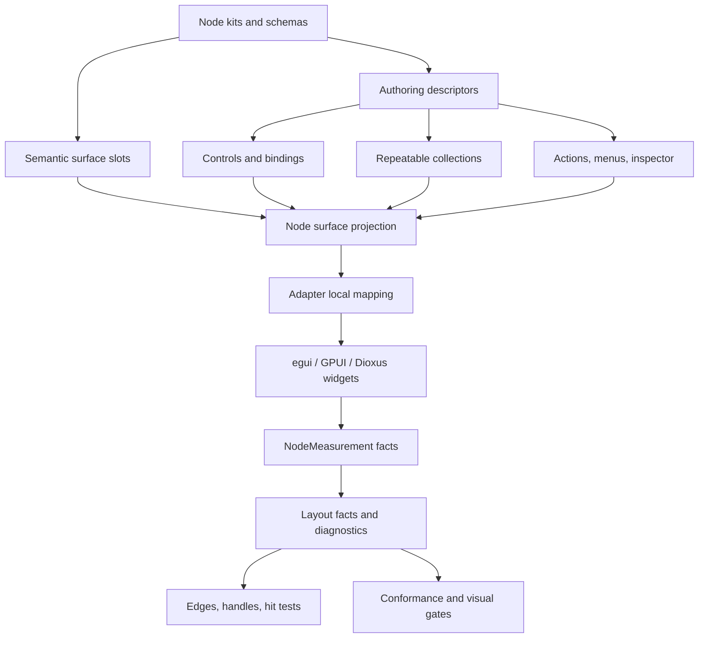
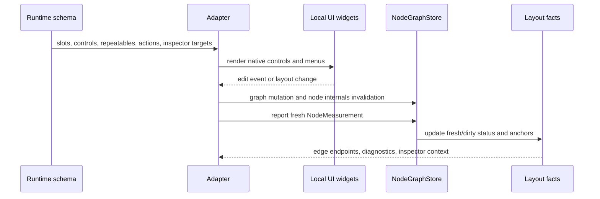
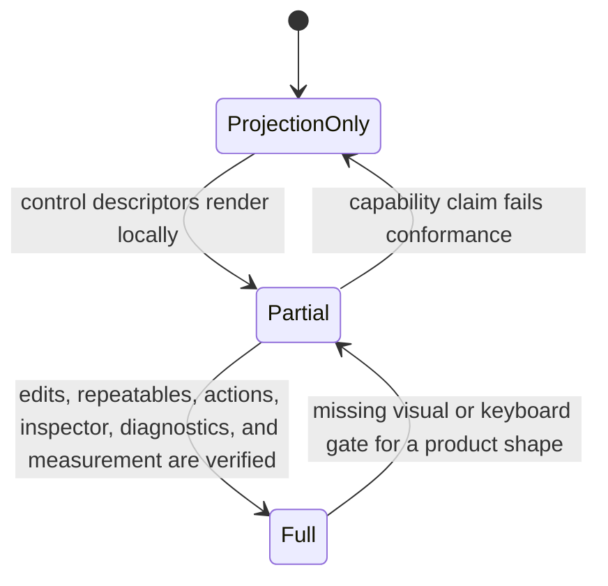

# feat: Node UI Authoring Contracts

## Goal Capsule

| Field | Value |
| --- | --- |
| Objective | Add the authoring-layer contracts Jellyflow needs for Dify-style workflow nodes, shader/blueprint nodes, ERD tables, and knowledge or mind-map nodes without introducing a shared widget crate. |
| Target repos | Jellyflow root and `repo-ref/open-gpui` for the GPUI proof. Paths in this plan are repo-relative to the Jellyflow root. |
| Source authority | ADR 0008, ADR 0009, the Node UI Kit Component Contract, and the completed Node UI Capability Parity work are the baseline. Runtime stays headless; adapters map semantic descriptors to local UI. |
| Execution profile | Cross-cutting feature work across runtime schema, conformance, builtin kits, proof/template consumers, egui, GPUI, docs, and visual regression. |
| Stop condition | Adapters can consume a stable semantic authoring contract for controls, repeatable rows, actions, menus, inspector targets, capability reporting, and visual regression scenarios; egui proves native authoring controls; GPUI either reports at least one real layout-pass node-surface bound into `NodeMeasurement` or records the exact missing open-gpui hook while capability reporting stays on projection or partial support. |
| Explicit non-goal | Do not build Dify backend execution, a shader compiler, database modeling IO, real-time collaboration, or `jellyflow-ui-widgets`. |

---

## Product Contract

### Summary

This plan moves Jellyflow from rich node surface display to rich node authoring.
The reusable layer remains a headless semantic component contract: runtime describes controls, repeatable collections, action intents, menu targets, inspector metadata, diagnostics, and adapter capabilities; egui, GPUI, Dioxus, and future adapters render their own widgets and report real geometry.

### Problem Frame

The previous node UI parity plan closed the core geometry gap: `NodeMeasurement`, `MeasuredSurfaceSlot`, `MeasuredSurfaceAnchor`, dirty/fresh internals, `NodeInternalsController`, typed feedback, chrome, and product-shaped proof paths now exist.
The remaining gap is not "can we draw rich nodes" but "can users author rich nodes in multiple UI frameworks without every adapter inventing its own metadata model."

Current `NodeSurfaceSlotDescriptor` can say "this row is a field row" and project a label/value preview, but it cannot say whether the row is a text input, select, toggle, code editor, color picker, asset picker, variable picker, or dynamic collection item.
Current chrome can describe resizers and toolbars, and the connection lifecycle can identify a dropped wire, but runtime does not yet expose a durable action/menu/inspector contract for dropped-wire insert menus, node context menus, graph menus, toolbars, blackboards, or inspector panels.

The product bar is set by mature node editors.
React Flow keeps custom node widgets framework-local but exposes handles, node toolbar, node resizer, and dynamic handle updates.
Rete separates node data, sockets, controls, renderer plugins, context menu plugin, and validation.
Dify workflow nodes use editable variables and parameter extraction shapes.
Unity Shader Graph uses a blackboard for ordered, categorized properties and a node settings surface.
Unreal Blueprint uses pins, typed execution/data separation, and context menus that depend on the selected graph or pin.
Jellyflow should borrow these product contracts while staying renderer-free.

### Requirements

**Headless authoring model**

- R1. Keep `jellyflow-core`, `jellyflow-layout`, and `jellyflow-runtime` free of egui, GPUI, Dioxus, DOM, and widget instance types.
- R2. Add `Field/Control Descriptor` metadata for input, select, toggle, code, color, asset, variable-picker, expression, textarea, slider, and port-binding controls.
- R3. Bind controls to semantic data paths and validation facts, not to adapter widget objects.
- R4. Extend surface projection so adapters receive typed control metadata in addition to label/value previews.

**Dynamic rows and parameters**

- R5. Add repeatable collection descriptors for ERD fields, shader dynamic inputs, Dify parameter arrays, tool argument lists, and grouped blackboard properties.
- R6. Keep repeatable item identity stable across add, remove, and reorder so anchors and edges can follow the same logical item.
- R7. Make repeatable changes participate in node internals invalidation and remeasurement.

**Actions, menus, and inspector**

- R8. Add renderer-neutral action descriptors with target, intent, availability, disabled reason, order, group, danger level, and optional shortcut metadata.
- R9. Add menu descriptors for graph, node, edge, port, slot, control, dropped-wire, toolbar, blackboard, and inspector surfaces.
- R10. Add inspector descriptors for selected graph objects, slots, controls, repeatable items, and diagnostics.
- R11. Keep runtime responsible for action intent and applicability, while adapters own popup state, menu widgets, focus, keyboard routing, and local component libraries.

**Adapter maturity**

- R12. Add a machine-readable adapter capability matrix covering measurement, dynamic internals, controls, repeatables, actions, menus, inspector, typed diagnostics, visual regression, and keyboard accessibility.
- R13. Extend adapter conformance scenarios so an adapter cannot claim a capability without proving the relevant headless facts.
- R14. Make egui render real local controls from the semantic authoring contract and invalidate internals when edits change layout.
- R15. Make GPUI continue as the retained/component reference path, but do not mark it full until actual GPUI layout-pass bounds can be reported to runtime.
- R16. Keep Dioxus at proof/template level until the authoring descriptors are stable enough to map into a component tree.

**Product-shaped validation**

- R17. Provide fixtures that resemble Dify workflow nodes, shader/blueprint nodes, ERD table nodes, and knowledge or mind-map nodes.
- R18. Add visual and interaction regression coverage for full, compact, shell, resize, invalid hover, dropped-wire menu, inspector, and dynamic collection scenarios.
- R19. Document the boundary clearly enough that adapter authors know what belongs in Jellyflow, what belongs in their UI framework, and what must not be shared.

### Acceptance Examples

- AE1. Given a Dify-style LLM node with a model select, prompt textarea, variable picker, run toggle, and parameter array, when an egui adapter renders it, then each control comes from semantic descriptors and editing a layout-affecting value marks node internals dirty.
- AE2. Given a shader node with dynamic input rows, when the user adds or reorders inputs, then stable repeatable item anchors drive the same port handles after remeasurement.
- AE3. Given an ERD table node with field rows, PK/FK badges, and field-level handles, when a field is removed, then old anchors become unavailable and edge fallback behavior is explicit.
- AE4. Given a wire dropped on empty canvas, when the source port type can create compatible nodes, then runtime can describe compatible insert actions without owning the popup widget.
- AE5. Given a selected graph, node, edge, slot, or control, when an adapter opens an inspector, then the inspector target and editable fields come from descriptor metadata and adapter-local widgets render the panel.
- AE6. Given a GPUI node whose component layout changes, when the proof reports measurement facts, then handles and edges follow the shared component-region model now; if real layout-pass bounds are not yet available, the proof records the missing hook and refuses to claim `layout_pass_measurement: full`.
- AE7. Given Dify, shader, ERD, and mind-map examples, when visual regression runs, then snapshots or geometry assertions cover full/compact/shell density, resize, invalid hover, dropped-wire menu, and inspector states.

### Scope Boundaries

#### In Scope

- Runtime schema descriptors for controls, repeatable collections, actions, menus, inspectors, diagnostics, and adapter capabilities.
- Projection and conformance tests that prove the descriptors are renderer-neutral and usable by adapters.
- Builtin node-kit fixtures for Dify-style workflow, shader/blueprint, ERD, and knowledge or mind-map examples.
- egui local rendering of the first useful control set.
- GPUI proof improvements in `repo-ref/open-gpui/examples/canvas-jellyflow` and, if required, small canvas or GPUI measurement hooks in `repo-ref/open-gpui/crates/canvas`.
- Visual or geometry regression gates for the product-shaped examples.
- Documentation for the adapter-local widget boundary.

#### Deferred to Follow-Up Work

- Full Dioxus adapter implementation beyond proof/template conformance.
- A production-grade GPUI layout-pass measurement API if the proof shows it requires broad open-gpui framework changes.
- Full keyboard authoring parity for every control kind; this plan should define capability reporting and cover the first egui/GPUI proof cases.
- Full UI theming/token system for all adapters.

#### Outside This Product's Identity

- Workflow execution, model calls, tool execution, shader compilation, database migrations, and persistence services.
- A shared cross-framework widget crate.
- Product clones of Dify, Unreal Blueprint, Unity Shader Graph, or MarginNote.
- DOM/React adapter implementation in this slice.

---

## Planning Contract

### Key Technical Decisions

- KTD1. Standardize semantic authoring descriptors, not widgets. Runtime should describe controls, repeatables, actions, menus, inspectors, diagnostics, and capability facts; adapters render egui widgets, GPUI components, Dioxus components, or DOM elements locally.
- KTD2. Treat the completed measurement contract as a dependency. `NodeMeasurement`, measured anchors, dirty/fresh internals, and `NodeInternalsController` are not re-planned here; new authoring contracts must use them when controls or repeatables change geometry.
- KTD3. Make control binding data-oriented. A control binds to a node data path, option source, validation rule, and editability state; it never stores a function pointer or toolkit component reference.
- KTD4. Make repeatable identity explicit. Dynamic rows need item ids that survive reorder so ports, anchors, diagnostics, and inspector targets do not drift.
- KTD5. Model actions as intent plus target. Runtime can say "open compatible insert menu for this dropped wire" or "remove this repeatable item"; adapters decide the popup, button, command palette, or keyboard UI.
- KTD6. Capability reporting is part of the contract. An adapter should be able to say "projection proof", "partial", or "full" per capability, and conformance should catch false claims.
- KTD7. GPUI remains adapter-local. Short term, the proof should eliminate drift between rendering and projected measurement; full maturity requires actual GPUI layout-pass bounds, which may need open-gpui canvas support.
- KTD8. Visual regression belongs to adapters. Runtime verifies facts and conformance; egui and GPUI verify pixels, overlap, clipping, and native interaction polish.

### High-Level Technical Design

### Product Shape Mapping

| Product shape | Required descriptors | Adapter proof target |
| --- | --- | --- |
| Dify workflow | config groups, select/input/textarea/toggle/code controls, variable picker, parameter arrays, status banners, run actions, dropped-wire insert actions | egui full; GPUI projection or partial |
| Shader/Blueprint | typed ports, dynamic inputs, exec/data separation metadata, preview regions, blackboard entries, invalid hover diagnostics | egui full; GPUI partial |
| ERD/table | repeatable field rows, stable item anchors, PK/FK badges, field inspector, add/remove/reorder actions | egui full; GPUI partial |
| Mind-map/knowledge canvas | low-zoom shell density, title/source/preview controls, relation actions, inspector chips | egui full; proof/template partial |

### Alternatives Considered

| Alternative | Decision | Rationale |
| --- | --- | --- |
| Build a shared `jellyflow-ui-widgets` crate | Rejected | It would force egui, GPUI, Dioxus, and future adapters into a lowest-common-denominator UI model and violate the established adapter-local mapping boundary. |
| Keep using `FieldRow` label/value only | Rejected | It cannot express Dify configuration forms, shader parameters, ERD field editing, or disabled/validation states. |
| Encode product-specific menu enums | Rejected | Dify, Blueprint, Shader Graph, ERD, and mind-map actions share target/intent/applicability patterns but not product vocabulary. |
| Make GPUI full before egui controls | Rejected | egui has the most complete measured-internals loop today; GPUI should prove retained mapping and real bounds in parallel, not block the headless contract. |
| Put visual regression in runtime | Rejected | Runtime should verify semantic facts and conformance; pixels and clipping are adapter responsibilities. |

### System-Wide Impact

- Runtime public API grows from display-oriented surface slots into authoring descriptors.
- Builtin node kits become the canonical fixture source for adapter conformance, not just examples.
- Adapter authors need a clear capability table before adopting Jellyflow in GPUI, Dioxus, or custom self-drawn frameworks.
- Existing egui and GPUI examples must avoid overstating support: egui can become the first full authoring adapter, while GPUI remains partial until real layout-pass bounds are captured.

### Assumptions

- The previous node UI parity work is current: `NodeInternalsController`, measured slots, measured anchors, typed-port feedback, node chrome, and product-shaped examples exist and should be reused.
- `repo-ref/open-gpui` can be modified when needed, but changes should remain isolated to the example or canvas measurement hooks unless a small open-gpui library change is required.
- The first authoring slice should prefer stable semantic coverage over exhaustive control polish.

---

## Implementation Units

### U1. Add adapter capability matrix and authoring conformance vocabulary

**Goal:** Define how Jellyflow names adapter support levels for authoring features and how conformance proves each claim.

**Requirements:** R1, R12, R13, R19.

**Dependencies:** None.

**Files:** `crates/jellyflow-runtime/src/runtime/conformance/mod.rs`, `crates/jellyflow-runtime/src/runtime/conformance/reports.rs`, `crates/jellyflow-runtime/src/runtime/conformance/scenario/behavior.rs`, `crates/jellyflow-runtime/src/runtime/conformance/scenario/action.rs`, `crates/jellyflow-runtime/tests/public_surface.rs`, `templates/headless-adapter/src/lib.rs`, `templates/headless-adapter/README.md`, `docs/knowledge/engineering/decisions/node-ui-kit-component-contract.md`.

**Approach:** Add an adapter capability descriptor with support states such as `none`, `projection`, `partial`, and `full`.
Capabilities should include measured anchors, dynamic internals, control projection, editable controls, repeatable collections, actions, menus, inspector, typed diagnostics, visual regression, keyboard accessibility, and layout-pass measurement.
Conformance should expose authoring scenario names even before every adapter reaches full support.

**Patterns to follow:** Existing conformance action and report modules, `templates/headless-adapter` smoke tests, and the Node UI Kit Component Contract's current proof-level language.

**Test scenarios:**

- A template adapter can report `projection` for controls without claiming edit support.
- A conformance report distinguishes `partial` from `full` when repeatable collection edits are not verified.
- `jellyflow-runtime` public-surface tests prove capability descriptors carry no framework-specific types.
- A GPUI proof capability row cannot claim `layout_pass_measurement: full` while measurements come from `NodeSurfaceComponentLayout` projection.

**Verification:** Runtime and template tests expose a machine-readable matrix and docs name egui, GPUI, and proof/template support accurately.

### U2. Add Field/Control Descriptor contract

**Goal:** Give node kits a renderer-neutral way to describe editable controls inside nodes.

**Requirements:** R1, R2, R3, R4, R10, R17, AE1, AE5.

**Dependencies:** U1.

**Files:** `crates/jellyflow-runtime/src/schema/types.rs`, `crates/jellyflow-runtime/src/schema/mod.rs`, `crates/jellyflow-runtime/src/schema/tests/view_descriptor.rs`, `crates/jellyflow-runtime/src/schema/tests/kit.rs`, `crates/jellyflow-runtime/tests/public_surface.rs`, `templates/headless-adapter/src/lib.rs`, `crates/jellyflow-proof/src/lib.rs`.

**Approach:** Add `NodeControlDescriptor`, `NodeControlKind`, `NodeControlBinding`, `NodeControlOption`, `NodeControlValidation`, `NodeControlPresentation`, and `NodeControlEditability`.
Controls should attach to field rows, config groups, action rows, inspector surfaces, or repeatable item templates without naming adapter widgets.
Projection should include typed control metadata beside the existing `NodeSurfaceSlotProjection` label/value preview.

**Patterns to follow:** `NodeSurfaceSlotDescriptor`, `NodeChromeDescriptor`, `PortDecl::with_view_anchor`, and `NodeSurfaceSlotDescriptor::data_key`.

**Test scenarios:**

- A text input, select, toggle, code editor, color picker, asset picker, variable picker, and textarea descriptor serialize and deserialize.
- A field-row control bound to `slot` reads the same data path as the slot preview.
- A control with validation metadata reports required, enum, regex, range, or expression-shape constraints without adapter types.
- A read-only or disabled control carries a disabled reason that adapters can render.
- A control descriptor can be projected in compact density without losing identity or binding.

**Verification:** Schema tests prove the contract is stable and public-surface tests keep runtime headless.

### U3. Add repeatable collection descriptors and stable item anchors

**Goal:** Support dynamic field lists, shader inputs, Dify parameter arrays, and blackboard property groups with stable semantic identity.

**Requirements:** R5, R6, R7, R17, AE2, AE3.

**Dependencies:** U1, U2.

**Files:** `crates/jellyflow-runtime/src/schema/types.rs`, `crates/jellyflow-runtime/src/schema/kit/builtins.rs`, `crates/jellyflow-runtime/src/schema/tests/view_descriptor.rs`, `crates/jellyflow-runtime/src/runtime/tests/measurement.rs`, `crates/jellyflow-proof/src/lib.rs`, `crates/jellyflow-proof/tests/proof.rs`, `templates/headless-adapter/src/lib.rs`.

**Approach:** Add `NodeRepeatableCollectionDescriptor` with item source path, item id path, item template slots, min/max, empty state, reorderable flag, add/remove/reorder action references, and stable item anchor key rules.
Item slot keys should be deterministic and anchored by item id rather than visible index.
Adapters should use `NodeInternalsController` when collection changes affect layout.

**Patterns to follow:** Existing measured-anchor dirty/fresh tests, proof dynamic child remeasurement tests, and builtin ERD/shader fixtures.

**Test scenarios:**

- Adding a shader input creates a new item slot and anchor while existing item anchors keep their ids.
- Reordering ERD fields changes measured y positions while edge bindings still resolve to the same logical item.
- Removing an item marks old anchors unavailable and produces explicit fallback or disconnect behavior.
- Empty collection state can be projected without creating fake field handles.
- Min/max rules disable add/remove actions with reasons.

**Verification:** Runtime, schema, and proof tests show repeatable collections drive stable anchors and remeasurement.

### U4. Add action, menu, inspector, and blackboard contracts

**Goal:** Provide headless metadata for commands and authoring panels without making runtime own popup UI.

**Requirements:** R8, R9, R10, R11, R17, AE4, AE5.

**Dependencies:** U1, U2, U3.

**Files:** `crates/jellyflow-runtime/src/schema/types.rs`, `crates/jellyflow-runtime/src/runtime/connection/lifecycle.rs`, `crates/jellyflow-runtime/src/runtime/conformance/scenario/action.rs`, `crates/jellyflow-runtime/src/runtime/conformance/scenario/action/connection.rs`, `crates/jellyflow-runtime/src/runtime/conformance/runner/actions/connection.rs`, `crates/jellyflow-runtime/src/runtime/tests/connection/`, `crates/jellyflow-egui/src/ui/inspector.rs`, `templates/headless-adapter/src/lib.rs`.

**Approach:** Add `NodeActionDescriptor`, `ActionTarget`, `ActionIntent`, `ActionAvailability`, `MenuDescriptor`, `MenuSurface`, `InspectorDescriptor`, `InspectorTarget`, and a blackboard descriptor for graph-level property lists.
Connection lifecycle dropped-on-pane output should be able to reference compatible insert menu actions.
Runtime should validate action applicability and describe intent, while adapters choose menu rendering and focus behavior.

**Patterns to follow:** Existing `ConnectionLifecycleState::DroppedOnPane`, `NodeChromeDescriptor`, egui `InspectorState`, Rete's plugin split, and Unreal's context-menu-by-selection pattern.

**Test scenarios:**

- Dropping a wire on empty canvas yields a menu descriptor with compatible node insert actions for the source type.
- A disabled action carries a reason and cannot be executed through the conformance runner.
- A node context menu, port menu, graph menu, toolbar action, and inspector action can share the same descriptor shape.
- Selecting a repeatable item resolves an inspector target that includes collection key and item id.
- A blackboard property reorder action updates item order and invalidates affected internals.

**Verification:** Runtime conformance can drive dropped-wire menu, node menu, and inspector target scenarios without adapter UI types.

### U5. Upgrade builtin kits, proof crate, and template fixtures to authoring descriptors

**Goal:** Make the new contracts visible through product-shaped fixtures that adapter authors can reuse.

**Requirements:** R2, R5, R8, R12, R16, R17, R19, AE1, AE2, AE3, AE4, AE5.

**Dependencies:** U2, U3, U4.

**Files:** `crates/jellyflow-runtime/src/schema/kit/builtins.rs`, `crates/jellyflow-runtime/src/schema/tests/kit.rs`, `crates/jellyflow-proof/src/lib.rs`, `crates/jellyflow-proof/tests/proof.rs`, `templates/headless-adapter/src/lib.rs`, `templates/headless-adapter/README.md`, `crates/jellyflow-runtime/tests/public_surface.rs`.

**Approach:** Extend builtin fixtures for workflow, shader, ERD, and knowledge nodes with controls, repeatables, actions, menus, and inspector descriptors.
`jellyflow-proof` should remain framework-free but should project a component-tree trace containing controls, repeatable items, action targets, and inspector targets.
The headless adapter template should show how to map descriptors locally without importing egui or GPUI.

**Patterns to follow:** Existing builtin node-kit manifests, `jellyflow-proof` review-card proof, headless adapter measurement smoke, and the previous product-shaped example gallery.

**Test scenarios:**

- Workflow LLM fixture includes model select, prompt textarea, variable picker, parameter repeatable, status banner, and run action descriptors.
- Shader fixture includes typed dynamic inputs, blackboard properties, preview region, and invalid-hover diagnostic metadata.
- ERD fixture includes repeatable fields with PK/FK badges, field anchors, add/remove/reorder actions, and inspector targets.
- Knowledge fixture includes title/source/preview controls and low-zoom shell descriptor behavior.
- Proof/template tests consume the same descriptors as egui and GPUI without framework dependencies.

**Verification:** Builtin kit tests, proof tests, and template tests pass and expose the same semantic descriptors.

### U6. Implement egui authoring renderer and interaction wiring

**Goal:** Make egui the first full local authoring adapter for the semantic control, repeatable, action, menu, and inspector contracts.

**Requirements:** R14, R17, R18, R19, AE1, AE2, AE3, AE4, AE5, AE7.

**Dependencies:** U2, U3, U4, U5.

**Files:** `crates/jellyflow-egui/src/renderer.rs`, `crates/jellyflow-egui/src/bridge.rs`, `crates/jellyflow-egui/src/state.rs`, `crates/jellyflow-egui/src/ui/canvas.rs`, `crates/jellyflow-egui/src/ui/inspector.rs`, `crates/jellyflow-egui/src/ui/palette.rs`, `crates/jellyflow-egui/src/samples.rs`, `crates/jellyflow-egui/src/lib.rs`, `crates/jellyflow-egui/examples/workflow.rs`, `crates/jellyflow-egui/examples/shader_graph.rs`, `crates/jellyflow-egui/examples/erd.rs`, `crates/jellyflow-egui/examples/mind_map.rs`, `crates/jellyflow-egui/examples/gallery_snapshot.rs`.

**Approach:** Upgrade `FieldListNodeRenderer` from label/value rows to descriptor-driven local egui widgets.
The first full set should cover text input, number input, select, toggle, textarea, code display/edit stub, color swatch, variable picker stub, repeatable add/remove/reorder controls, dropped-wire insert menu, and inspector target rendering.
Edits that change layout must invalidate node internals through the existing bridge path before remeasurement.

**Patterns to follow:** `FieldListNodeRenderer`, `JellyflowEguiBridge::rebuild_snapshot`, `InspectorState`, current measured-region reporting, and existing product examples.

**Test scenarios:**

- Editing a prompt textarea updates node data and marks internals dirty when row height changes.
- Selecting a model option updates data without changing anchors when layout is unchanged.
- Adding, removing, and reordering ERD fields updates repeatable item anchors and edge endpoints after remeasurement.
- Dropping a wire opens an egui-local compatible insert menu backed by action descriptors.
- Inspector renders node, edge, slot, control, and repeatable-item targets from descriptors.
- Low zoom collapses rich controls to shell or compact projections while measured anchors remain usable.

**Verification:** egui lib tests and example checks prove descriptor-driven authoring, interaction wiring, and measurement invalidation.

### U7. Harden GPUI retained proof and define real layout-pass measurement handoff

**Goal:** Make the GPUI proof honest and useful: retained components should consume the same authoring descriptors now, and the unit should either capture at least one actual GPUI layout-pass bound or identify the exact open-gpui hook needed before full layout-pass measurement can be claimed.

**Requirements:** R15, R17, R18, R19, AE1, AE2, AE4, AE6, AE7.

**Dependencies:** U1, U2, U3, U4, U5.

**Files:** `repo-ref/open-gpui/examples/canvas-jellyflow/src/main.rs`, `repo-ref/open-gpui/crates/canvas/src/gpui/frame.rs`, `repo-ref/open-gpui/crates/canvas/src/gpui/painter.rs`, `repo-ref/open-gpui/crates/canvas/src/gpui/view.rs`, `repo-ref/open-gpui/crates/canvas/src/geometry_facts.rs`, `repo-ref/open-gpui/crates/canvas/src/schema.rs`, `repo-ref/open-gpui/crates/ui_components/`, `repo-ref/open-gpui/crates/ui_core/`, and only if the example cannot read needed bounds through existing APIs, `repo-ref/open-gpui/crates/gpui/src/view.rs`, `repo-ref/open-gpui/crates/gpui/src/window.rs`, `repo-ref/open-gpui/crates/gpui/src/taffy.rs`.

**Approach:** Keep `NodeSurfaceComponentLayout` as a projection-layout fallback and make that limitation explicit in capability reporting.
Map the new control/repeatable/action descriptors to open-gpui local components in the example.
Add a measured-region abstraction that can be populated from either the projection fallback or real GPUI layout bounds.
The preferred spike is a measured node-surface element or wrapper that assigns stable ids to slot, control, anchor, and chrome sub-elements, reads layout bounds from the GPUI layout/prepaint path, converts them into document and node-local coordinates, and reports them through `NodeInternalsController`.
If open-gpui lacks an element bounds callback suitable for node-local measurement, add the smallest canvas-level measurement hook and document the required upstream handoff.

**Patterns to follow:** Current `NodeSurfaceComponentLayout`, `project_node_measurement`, `measured_surface_anchors`, `projected_handles_use_runtime_measurement_facts`, `CanvasPaintModel`, `CanvasGeometryFacts`, and local `ui_components` mapping.

**Test scenarios:**

- GPUI example renders workflow, shader, and ERD authoring descriptors with local components.
- Projected measurements and rendered component regions come from one shared local layout model.
- A real-bounds spike reports at least one GPUI element bound into `NodeMeasurement`, or a focused regression proves capability reporting stays below `full` with a documented missing hook.
- Changing node size updates component regions and measured anchors without reintroducing slot-index-only edge placement.
- Capability reporting marks GPUI controls as `projection` or `partial` until real layout-pass bounds are available.
- A control whose rendered size differs from projection fallback exposes that difference in the measurement or in a fallback-status assertion.

**Verification:** GPUI canvas-jellyflow format, check, and tests pass; capability docs do not claim full layout-pass measurement prematurely.

### U8. Add visual and interaction regression gates

**Goal:** Prevent rich nodes from regressing into clipped, overlapping, or connection-drifting UI across product shapes and density modes.

**Requirements:** R12, R13, R18, R19, AE6, AE7.

**Dependencies:** U5, U6, U7.

**Files:** `crates/jellyflow-egui/examples/gallery_snapshot.rs`, `crates/jellyflow-egui/README.md`, `crates/jellyflow-egui/src/lib.rs`, `crates/jellyflow-runtime/src/runtime/conformance/scenario/behavior.rs`, `templates/headless-adapter/README.md`, `repo-ref/open-gpui/examples/canvas-jellyflow/src/main.rs`, `docs/testing/node-ui-authoring-regression.md`, `docs/knowledge/engineering/decisions/node-ui-kit-component-contract.md`.

**Approach:** Add a product-shape scenario matrix covering Dify workflow, shader/blueprint, ERD, and mind-map nodes in full, compact, shell, resize, invalid hover, dropped-wire menu, and inspector states.
For egui, generate gallery snapshots and add geometry assertions for overlap, clipping, slot-in-node bounds, and handle-anchor proximity.
For GPUI, start with geometry assertions and a manual or automated screenshot path only where the local example can run deterministically.

**Patterns to follow:** Existing `gallery_snapshot` example, egui measured-region tests, runtime conformance fixtures, and GPUI canvas-jellyflow geometry tests.

**Test scenarios:**

- Each product shape has at least one full and one compact snapshot or geometry trace.
- Shell density hides rich controls but preserves visible handles and anchor facts.
- Resizing a rich node keeps controls within node bounds and edges within measured handle tolerances.
- Invalid hover states are visible in egui and represented in GPUI geometry or state assertions.
- Dropped-wire menu and inspector states have regression coverage where adapter support is full or partial.

**Verification:** Visual and geometry gates are documented, runnable, and included in the plan's verification contract.

---

## Verification Contract

| Gate | Command | Proves |
| --- | --- | --- |
| Workspace format | `cargo fmt --all -- --check` | Main Rust workspace formatting stays clean. |
| Runtime, egui, proof tests | `cargo nextest run -p jellyflow-runtime -p jellyflow-egui -p jellyflow-proof --lib --no-fail-fast` | Headless schema, conformance, egui adapter, and proof contracts compile and pass together. |
| Runtime public surface | `cargo test -p jellyflow-runtime --test public_surface -- --nocapture` | Authoring descriptors stay renderer-neutral and public API exports are intentional. |
| Proof integration | `cargo test -p jellyflow-proof --test proof -- --nocapture` | Component-tree proof consumes controls, repeatables, actions, and measurements. |
| Headless adapter template | `cargo test --manifest-path templates/headless-adapter/Cargo.toml` | Third-party adapter template can consume capability and authoring contracts. |
| egui examples | `cargo check -p jellyflow-egui --examples` | Product-shaped authoring examples compile. |
| egui snapshots | `cargo run -p jellyflow-egui --example gallery_snapshot -- target/jellyflow-egui-gallery` | Visual output can be regenerated for Dify, shader, ERD, and mind-map scenarios. |
| GPUI example check | `RUSTFLAGS='-Awarnings' cargo check --quiet --manifest-path repo-ref/open-gpui/examples/canvas-jellyflow/Cargo.toml` | open-gpui retained proof compiles against current Jellyflow contracts. |
| GPUI example tests | `RUSTFLAGS='-Awarnings' cargo test --quiet --manifest-path repo-ref/open-gpui/examples/canvas-jellyflow/Cargo.toml --bin open-gpui-canvas-jellyflow` | GPUI projection/measurement/capability tests pass. |

---

## Definition of Done

- `NodeControlDescriptor` and related binding, option, validation, presentation, and editability descriptors exist and are covered by schema tests.
- Repeatable collection descriptors support stable item identity, add/remove/reorder action references, and measurement invalidation scenarios.
- Action, menu, inspector, blackboard, and dropped-wire intent descriptors exist without adapter widget types.
- Adapter capability reporting can distinguish `none`, `projection`, `partial`, and `full` support for authoring capabilities.
- Builtin fixtures cover Dify workflow, shader/blueprint, ERD, and knowledge or mind-map authoring shapes.
- egui renders the first full set of native authoring controls and proves edit, repeatable, menu, inspector, and invalidation behavior.
- GPUI consumes the authoring descriptors locally and truthfully reports projection or partial support until real layout-pass bounds are captured; U7 must leave either a real-bounds proof or a documented open-gpui hook gap.
- Visual or geometry regression gates cover full, compact, shell, resize, invalid hover, dropped-wire menu, and inspector states for the supported product shapes.
- Runtime, proof, template, egui, and GPUI verification commands in the Verification Contract pass.
- Documentation and engineering memory state clearly that Jellyflow standardizes semantic authoring contracts, not a shared widget crate.
- Abandoned experimental code, stale helper formulas, and misleading "full adapter" claims are removed or downgraded before completion.

---

## Appendix

### Sources and Research

External links below returned HTTP 200 during planning on 2026-06-30.

- `docs/knowledge/engineering/decisions/node-ui-kit-component-contract.md` defines the durable boundary: runtime owns semantic facts and conformance; adapters own widgets, focus, menus, layout reporting, and visual regression.
- `docs/plans/2026-06-29-001-feat-node-ui-capability-parity-plan.md` is the baseline plan whose geometry and measurement units should not be repeated.
- `crates/jellyflow-runtime/src/schema/types.rs` currently has `NodeSurfaceSlotDescriptor`, `NodeSurfaceSlotProjection`, and `NodeChromeDescriptor`, but no control, repeatable, action, menu, or inspector descriptor contract.
- `crates/jellyflow-runtime/src/runtime/measurement.rs` already has `NodeMeasurement`, `MeasuredSurfaceSlot`, `MeasuredSurfaceAnchor`, dirty/fresh status, and `NodeInternalsController`.
- `crates/jellyflow-egui/src/bridge.rs` and `crates/jellyflow-egui/src/renderer.rs` are the strongest current adapter proof for measured rich-node rendering.
- `repo-ref/open-gpui/examples/canvas-jellyflow/src/main.rs` currently shares `NodeSurfaceComponentLayout` between rendering and projected measurement, but still does not recover actual GPUI layout-pass bounds.
- `repo-ref/egui-snarl/src/ui.rs` shows the mature immediate-mode reference shape: node layout, pin placement, wire style, and interaction are tightly integrated in egui.
- React Flow handles documentation: `https://reactflow.dev/learn/customization/handles`.
- React Flow NodeToolbar documentation: `https://reactflow.dev/api-reference/components/node-toolbar`.
- React Flow NodeResizer documentation: `https://reactflow.dev/api-reference/components/node-resizer`.
- Rete basic editor and control/socket documentation: `https://retejs.org/docs/guides/basic/`.
- Rete context menu and validation documentation: `https://retejs.org/docs/guides/context-menu/` and `https://retejs.org/docs/guides/validation/`.
- Dify Variable Assigner documentation: `https://docs.dify.ai/en/cloud/use-dify/nodes/variable-assigner`.
- Dify Parameter Extractor documentation: `https://docs.dify.ai/en/cloud/use-dify/nodes/parameter-extractor`.
- Unity Shader Graph Blackboard documentation: `https://docs.unity3d.com/Packages/com.unity.shadergraph@17.0/manual/Blackboard.html`.
- Unreal Engine Nodes documentation: `https://dev.epicgames.com/documentation/en-us/unreal-engine/nodes-in-unreal-engine`.

### Research Notes

- React Flow reinforces the adapter-local widget direction: custom nodes own framework UI, but handles, toolbar, resizer, and dynamic internals are first-class node-editor concepts.
- Rete reinforces a plugin and preset split: controls, sockets, context menus, validation, renderers, and connection paths can be modeled separately.
- Dify reinforces the need for editable variable and parameter forms, especially array-like parameter extraction and assignment surfaces.
- Unity Shader Graph reinforces blackboard-style ordered and categorized properties with node settings or inspector editing.
- Unreal Blueprint reinforces pin-specific context menus and execution/data pin separation.
- egui-snarl reinforces that a usable Rust node editor must make pins, wire interaction, context menus, and node body UI feel native, even if Jellyflow implements them through headless contracts and adapter mapping.
