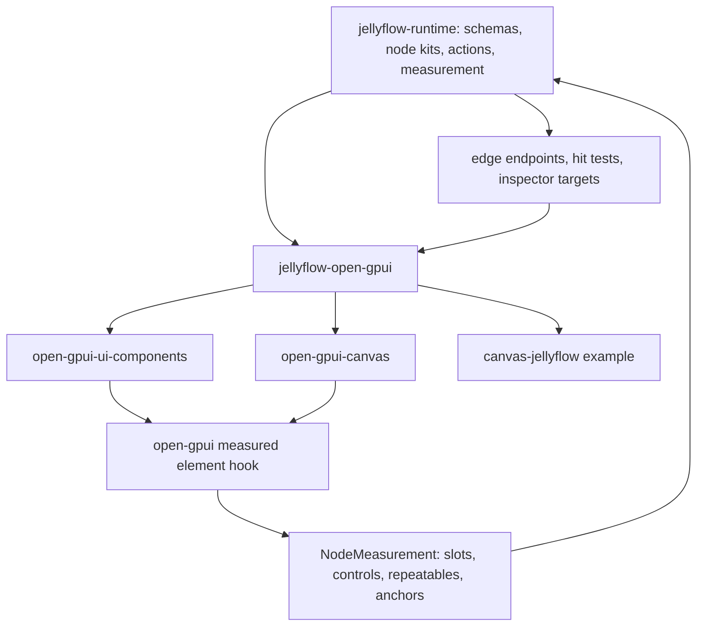
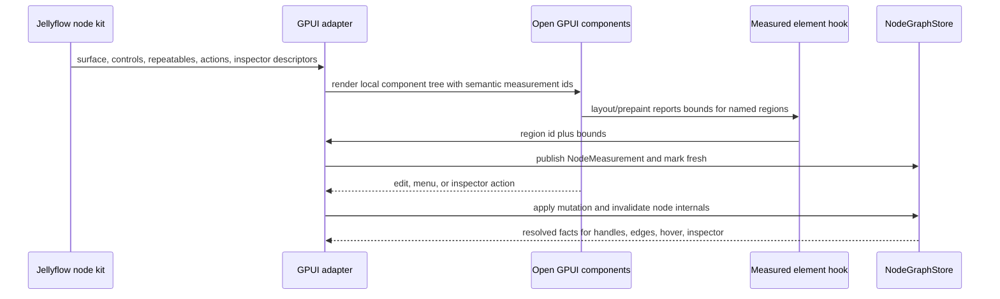
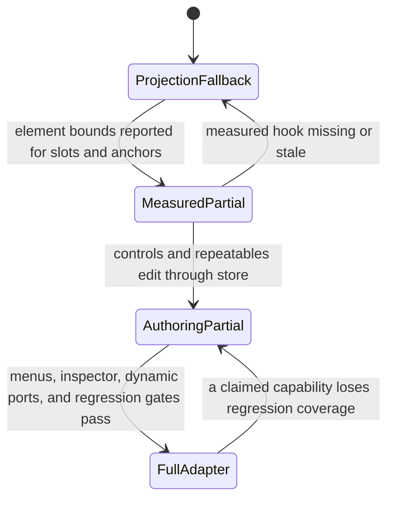

# feat: Open GPUI Mature Adapter

## Goal Capsule

| Field | Value |
| --- | --- |
| Objective | Promote `repo-ref/open-gpui` from a projection proof into Jellyflow's first mature retained UI adapter, with real component bounds, editable node controls, repeatable fields, menus, dropped-wire actions, and inspector support. |
| Target repos | Jellyflow root and `repo-ref/open-gpui`. Paths are repo-relative to the Jellyflow root. |
| Source authority | ADR 0008, ADR 0009, the Node UI Kit Component Contract, the Node UI Authoring Contracts implementation, and the current `canvas-jellyflow` GPUI proof. |
| Execution profile | Deep cross-repo feature/refactor work: a new Jellyflow adapter crate, a small open-gpui element-bounds hook, example migration, runtime integration, and geometry/interaction regression gates. |
| Stop condition | `jellyflow-open-gpui` owns the GPUI adapter surface; `canvas-jellyflow` consumes it; slots, controls, repeatables, and anchors can publish real GPUI layout-pass bounds into `NodeMeasurement`; handles and edges follow those bounds; authoring controls, menus, and inspector flows are driven by semantic descriptors and rendered with open-gpui components. |
| Explicit non-goal | Do not build a shared widget crate, Dify backend execution, shader compilation, a Dioxus mature adapter, an egui expansion slice, or a product clone of Dify, Unreal Blueprint, Unity Shader Graph, or MarginNote. |

---

## Product Contract

### Summary

Jellyflow should keep its core promise: runtime is headless, node kits are semantic, and adapters render native UI locally.
For the next stage, the only mature adapter target is `open-gpui` because this project exists mainly to support the user's GPUI fork.

The current GPUI proof is valuable but not mature.
It uses Jellyflow semantic descriptors and open-gpui components, yet node-internal geometry still comes from a local projection model.
That means a retained component can visually change without the runtime receiving real child bounds, so handles, edges, invalid hovers, and inspector targets cannot be trusted as GPUI-native layout facts.

### Problem Frame

The Node UI Authoring Contracts work added the semantic vocabulary Jellyflow needs for Dify-style forms, shader/blueprint parameters, ERD rows, knowledge nodes, repeatables, actions, menus, blackboards, inspector targets, diagnostics, and adapter capability reporting.
The remaining gap is adapter maturity.

`repo-ref/open-gpui/examples/canvas-jellyflow` proves local rendering, but the example still owns too much adapter logic and marks measurement as projection fallback.
The proof cannot graduate until open-gpui exposes a stable way to name component regions and report their layout-pass bounds back to Jellyflow.
Once that exists, Jellyflow can implement a real `jellyflow-open-gpui` adapter that maps semantic descriptors to open-gpui components without pushing widget types into runtime.

The target UX is not backend execution.
It is authoring-grade node UI: Dify-like configuration controls, shader graph dynamic inputs, ERD field rows, mind-map shells, context menus, dropped-wire insert menus, and inspector edits, all with handles and edges following real node-internal component geometry.

### Requirements

**Adapter scope and boundary**

- R1. Treat `open-gpui` as the only mature adapter target for this stage.
- R2. Keep `jellyflow-core`, `jellyflow-layout`, and `jellyflow-runtime` free of open-gpui, egui, Dioxus, DOM, and toolkit widget types.
- R3. Create a GPUI adapter boundary in Jellyflow rather than continuing to grow `repo-ref/open-gpui/examples/canvas-jellyflow` as the adapter.
- R4. Keep egui, Dioxus, proof, and templates on their current roles unless a compile or public-surface fix is required by shared runtime changes.

**Open-gpui measurement**

- R5. Add a small open-gpui element-bounds reporting hook or wrapper that can associate stable semantic ids with layout-pass bounds during element layout/prepaint.
- R6. The bounds hook must support nested component regions, not only direct children of a single `div`.
- R7. The hook must report enough coordinate context for Jellyflow to convert local component bounds into node-local and canvas-space `NodeMeasurement` facts.
- R8. The hook must avoid a broad taffy or canvas rewrite unless implementation proves there is no smaller safe path.

**Jellyflow GPUI adapter**

- R9. Add a `jellyflow-open-gpui` crate or equivalent first-class adapter module that owns semantic projection, open-gpui component mapping, measurement publication, action dispatch, and adapter capability reporting.
- R10. Migrate reusable GPUI adapter logic out of the example into the adapter crate so the example becomes a consumer and visual fixture.
- R11. The adapter must map Field/Control Descriptor kinds to open-gpui component-library controls where available, with explicit local fallbacks where the component library does not yet have a specialized widget.
- R12. Edits must write through Jellyflow store/runtime mutation paths and invalidate node internals when layout-affecting data changes.

**Dynamic authoring and geometry**

- R13. Repeatable collections must preserve stable item identity across add, remove, and reorder.
- R14. Dynamic shader/blueprint and ERD-style ports must update graph port facts or produce explicit unsupported-capability diagnostics; they must not leave stale handles or edges pretending to be valid.
- R15. Handles, edge endpoints, hit tests, invalid hover feedback, and inspector targets must resolve through real measured slot/control/repeatable/anchor bounds when the adapter claims full measurement.
- R16. Projection fallback may remain as a safety mode, but capability reporting must make fallback visible and must not claim mature support.

**Authoring interactions**

- R17. Node controls must cover the first practical Dify/shader/ERD set: text input, textarea, select, number input, slider, switch or toggle, code or expression text, color, asset or variable-picker stub, and port-binding display.
- R18. Menus and actions must cover graph menu, node menu, port or slot menu, dropped-wire compatible insert menu, toolbar actions, and disabled-action presentation.
- R19. Inspector support must cover graph, node, slot, control, repeatable item, and diagnostic targets using open-gpui local components.
- R20. Keyboard/focus handling belongs to open-gpui adapter code; runtime owns only semantic targets, commands, and capability facts.

**Regression and documentation**

- R21. Add geometry and interaction regression gates for Dify, shader/blueprint, ERD, and mind-map/knowledge fixtures across full, compact, shell, resize, invalid hover, dropped-wire menu, and inspector states.
- R22. Update adapter capability docs so the project clearly states what GPUI supports fully, what remains projection fallback, and why there is still no shared widget crate.
- R23. Remove or demote stale projection-only helper code and misleading comments once real bounds drive measurement.

### Acceptance Examples

- AE1. Given a Dify-style LLM node with model select, prompt textarea, variable picker stub, run toggle, and parameters, when rendered through the GPUI adapter, then visible controls come from semantic descriptors, edits update node data, and changed layout marks node internals dirty.
- AE2. Given a shader node with dynamic input rows, when a row is added, reordered, or removed, then stable repeatable ids keep matching handles attached to the same logical item and removed ports do not keep stale edge endpoints.
- AE3. Given an ERD table node with field rows and field-level handles, when the node resizes or field text changes, then handle positions and edge routes follow real measured row bounds rather than projection formulas.
- AE4. Given a wire dropped on empty canvas, when compatible insert actions exist, then the adapter opens an open-gpui context menu and dispatches the selected action through Jellyflow action intent.
- AE5. Given a selected node, control, repeatable item, or diagnostic, when the inspector is opened, then the inspector renders local open-gpui controls and writes edits through the same store path as in-node controls.
- AE6. Given compact and shell density states, when nodes are zoomed or resized, then content clips or degrades without overflowing fixed node bounds and capability tests still use actual measured regions.
- AE7. Given a GPUI capability report, when `layout_pass_measurement` is marked full, then tests prove the measurement came from the element-bounds hook rather than `NodeSurfaceComponentLayout` projection.

### Scope Boundaries

#### In Scope

- A first-class Jellyflow GPUI adapter crate or module.
- The smallest open-gpui element-bounds reporting primitive needed for semantic child regions.
- Migration of reusable `canvas-jellyflow` projection, measurement, action, and component mapping logic into the adapter boundary.
- Descriptor-driven open-gpui controls for the first Dify/shader/ERD authoring set.
- Repeatable item add/remove/reorder behavior and dynamic port lifecycle policy for GPUI.
- Context menus, dropped-wire insert menus, toolbar actions, and inspector panels rendered with open-gpui components.
- Geometry and interaction regression gates for the product-shaped fixtures.
- Documentation and engineering memory updates for the new mature-adapter boundary.

#### Deferred to Follow-Up Work

- A mature Dioxus adapter.
- Further egui feature work beyond compile compatibility and shared contract fixes.
- Full visual screenshot infrastructure if open-gpui lacks deterministic headless rendering primitives in this slice.
- Advanced keyboard parity for every control kind.
- Advanced blackboard editing beyond the inspector/menu paths needed for the first GPUI mature adapter.

#### Outside This Product's Identity

- Dify workflow execution, LLM calls, tool execution, shader compilation, database migration, sync, collaboration, or persistence services.
- A shared `jellyflow-ui-widgets` crate.
- A DOM/React adapter.
- Replacing open-gpui's component library with Jellyflow-owned widgets.

---

## Planning Contract

### Key Technical Decisions

- KTD1. Build the mature adapter around `open-gpui` only. This keeps the next refactor aligned with the real product target instead of spending effort on framework breadth.
- KTD2. Add an open-gpui bounds hook at the element layer, not a broad taffy rewrite, unless implementation proves a wrapper cannot reach nested semantic regions.
- KTD3. Keep `NodeMeasurement` as the single geometry handoff. GPUI reports measured slots, controls, repeatable items, and anchors through runtime facts; edges and hit tests read those facts.
- KTD4. Use open-gpui's component library for widgets. Jellyflow should map descriptors to local components such as text input, textarea, select, number input, slider, switch or toggle, context menu, popover, toolbar, tabs, fields, and focus primitives.
- KTD5. Move adapter logic out of the example. `canvas-jellyflow` should demonstrate the adapter, not define the adapter.
- KTD6. Treat projection as fallback only. A mature support claim requires real layout-pass measurement tests.
- KTD7. Runtime owns semantic action intent and applicability. The GPUI adapter owns popup state, focus, keyboard routing, local menu widgets, and command presentation.
- KTD8. Dynamic ports must be explicit. Add/remove/reorder either updates graph port facts and incident edge behavior or reports unsupported dynamic-port capability for that node shape.

### High-Level Technical Design

The sketches below are directional. They describe boundaries and data flow, not final Rust signatures.







### Output Structure

```text
crates/jellyflow-open-gpui/
  Cargo.toml
  src/lib.rs
  src/adapter.rs
  src/projection.rs
  src/measurement.rs
  src/controls.rs
  src/repeatable.rs
  src/actions.rs
  src/inspector.rs
  src/testing.rs

repo-ref/open-gpui/
  crates/gpui/...
  examples/canvas-jellyflow/...
```

The exact file split can change during implementation, but the ownership boundary should not: Jellyflow adapter code lives in the new crate, while `repo-ref/open-gpui` owns only framework hooks and the example host.

### Product Shape Mapping

| Product shape | GPUI adapter behavior | Geometry proof |
| --- | --- | --- |
| Dify workflow node | Descriptor-driven selects, textarea, toggles, variable-picker stub, parameters, run/status actions | Controls and parameter rows report measured regions; overflow is clipped or density-degraded |
| Shader/Blueprint node | Dynamic typed inputs, port-binding display, preview area, invalid connection diagnostics | Dynamic input rows keep stable measured anchors and update ports |
| ERD/table node | Repeatable field rows, field menu, PK/FK badge display, inspector edits | Field rows publish measured handles; removed rows remove or invalidate anchors |
| Mind-map/knowledge node | Compact/shell density, title/source/preview controls, relation actions | Shell density remains bounded and still exposes semantic targets |

### Research and Evidence

- `repo-ref/open-gpui/examples/canvas-jellyflow/src/main.rs` already consumes Jellyflow semantic descriptors and records its current missing hook as an element-bounds callback gap.
- `repo-ref/open-gpui/crates/gpui/src/element.rs` shows element prepaint receives bounds and elements have stable ids, making an element-level reporting wrapper plausible.
- `repo-ref/open-gpui/crates/gpui/src/elements/div.rs` has a prepaint listener for direct child bounds, but that is not enough for nested semantic node regions.
- `repo-ref/open-gpui/crates/gpui/src/taffy.rs` exposes layout bounds after layout, which suggests the missing piece is stable semantic region association and callback plumbing, not a full layout engine replacement.
- `repo-ref/open-gpui/crates/ui_components/src` already contains the likely component primitives for controls, menus, popovers, toolbars, fields, tabs, and focus handling.
- `crates/jellyflow-runtime/src/runtime/measurement.rs` and the authoring descriptors provide the runtime side of the geometry and semantic contract.
- `crates/jellyflow-egui/src/bridge.rs` is useful prior art for store edits, repeatable outcomes, dirty invalidation, and descriptor-driven authoring without copying egui-specific widgets.

### Assumptions

- `repo-ref/open-gpui` is the user's fork and can accept targeted internal changes.
- The open-gpui component library is the preferred source of widgets for this adapter.
- A path dependency from Jellyflow into the local open-gpui fork is acceptable for this stage if it keeps the proof executable in this workspace.
- The first version can use explicit fallbacks for specialized controls such as asset picker or variable picker, as long as the capability report is honest.
- If open-gpui cannot produce deterministic screenshots in this slice, geometry assertions and launch smoke coverage can stand in for pixel regression until a later visual harness exists.

### Alternative Approaches Considered

| Alternative | Decision | Rationale |
| --- | --- | --- |
| Keep `canvas-jellyflow` as the adapter | Rejected | It makes the example both consumer and implementation, which hides API boundaries and makes reuse impossible. |
| Build a shared widget crate | Rejected | It contradicts ADR 0008/0009 and would force GPUI, egui, and future adapters into a lowest-common-denominator widget model. |
| Mark GPUI mature with projection measurement | Rejected | Projection can be useful fallback, but mature adapter support requires actual retained component bounds. |
| Modify taffy broadly first | Deferred | Current evidence points to a narrower element-bounds reporting hook; broad layout engine surgery should be a last resort. |
| Expand egui and Dioxus in parallel | Rejected for this stage | The project target is open-gpui; broader adapter parity would dilute the next refactor. |

### Risks and Mitigation

| Risk | Mitigation |
| --- | --- |
| Open-gpui bounds reporting requires deeper framework changes than expected | Start with an element wrapper or listener path, add tests around nested semantic bounds, and keep projection fallback until real bounds pass. |
| Two repos drift during implementation | Keep Jellyflow adapter changes and open-gpui hook changes separately understandable; verify both repo worktrees before handoff. |
| Dynamic port removal breaks existing edges unexpectedly | Define and test the edge lifecycle for removed ports; removed handles must not silently continue resolving. |
| Focus and menus fight canvas input handling | Route popup/focus behavior through open-gpui component primitives and add dropped-wire/menu interaction tests. |
| Capability reporting overclaims support | Make full capability depend on regression evidence for measured bounds, edits, menus, inspector, and dynamic ports. |
| The new crate accidentally pulls open-gpui into runtime | Keep dependencies one-way: adapter depends on runtime; runtime never depends on adapter or open-gpui. |

---

## Implementation Units

### U1. Add open-gpui semantic element-bounds reporting

**Goal:** Give retained GPUI component regions stable, named bounds that Jellyflow can consume as real layout-pass geometry.

**Requirements:** R5, R6, R7, R8, R15, R16, AE3, AE6, AE7.

**Dependencies:** None.

**Files:** `repo-ref/open-gpui/crates/gpui/src/element.rs`, `repo-ref/open-gpui/crates/gpui/src/elements/div.rs`, `repo-ref/open-gpui/crates/gpui/src/window.rs`, `repo-ref/open-gpui/crates/canvas/src/gpui/view.rs`, `repo-ref/open-gpui/crates/canvas/src/gpui/frame.rs`, `repo-ref/open-gpui/examples/canvas-jellyflow/src/main.rs`.

**Approach:** Introduce the smallest open-gpui primitive that can associate an adapter-provided semantic measurement id with the element bounds observed during layout/prepaint.
Prefer a reusable element wrapper or listener over a taffy rewrite.
The primitive must work for nested regions inside node content and must report coordinate context clearly enough for node-local conversion.

**Test scenarios:**

- A parent and nested child region both report distinct bounds during a render pass.
- A translated or offset node reports bounds that convert to the expected node-local rectangles.
- Hidden or non-rendered regions do not produce stale fresh measurements.
- A changed component size updates the reported bounds on the next pass.

**Verification:** open-gpui framework or example tests prove nested measured elements report current bounds, and the existing GPUI proof no longer needs projection formulas for the tested regions.

### U2. Add `jellyflow-open-gpui` adapter crate

**Goal:** Establish a first-class adapter boundary in the Jellyflow workspace.

**Requirements:** R1, R2, R3, R4, R9, R10, R22.

**Dependencies:** U1 can land independently, but U2 should define the crate boundary before moving large example logic.

**Files:** `Cargo.toml`, `crates/jellyflow-open-gpui/Cargo.toml`, `crates/jellyflow-open-gpui/src/lib.rs`, `crates/jellyflow-open-gpui/src/adapter.rs`, `crates/jellyflow-open-gpui/src/testing.rs`, `docs/knowledge/engineering/decisions/node-ui-kit-component-contract.md`, `README.md`.

**Approach:** Add an adapter crate that depends on Jellyflow runtime and the local open-gpui fork, while keeping core/runtime free of toolkit dependencies.
Expose adapter capabilities, projection state, measurement publication, component mapping entry points, and test helpers.
Keep crate API small enough that `canvas-jellyflow` can be the first consumer without becoming the implementation.

**Test scenarios:**

- The workspace public-surface check proves runtime does not depend on open-gpui.
- The adapter can load builtin node kits and produce GPUI adapter state without launching the full example.
- Capability output distinguishes projection fallback, partial authoring, and full measured support.
- A template or proof consumer remains unchanged unless shared runtime API changes require updates.

**Verification:** Jellyflow workspace checks include the new crate, and docs explain that the mature adapter target is open-gpui only for this stage.

### U3. Move GPUI projection and measurement bridge out of the example

**Goal:** Make `canvas-jellyflow` consume adapter logic rather than owning it.

**Requirements:** R3, R9, R10, R15, R16, R23.

**Dependencies:** U1, U2.

**Files:** `crates/jellyflow-open-gpui/src/projection.rs`, `crates/jellyflow-open-gpui/src/measurement.rs`, `crates/jellyflow-open-gpui/src/adapter.rs`, `repo-ref/open-gpui/examples/canvas-jellyflow/src/main.rs`.

**Approach:** Extract reusable `NodeSurfaceComponentLayout`-style projection, measured region conversion, adapter capability reporting, and runtime measurement publication into the new crate.
The example should keep only document setup, canvas wiring, demo data, and visual host code.
Projection fallback stays available but becomes an explicit fallback path.

**Test scenarios:**

- The example renders the same builtin fixture through the adapter crate.
- Adapter tests publish measured slots and anchors from real bounds when the hook provides them.
- Adapter tests fall back to projection with a visible capability downgrade when bounds are absent.
- Stale projection-only helpers in the example are removed or isolated behind fallback naming.

**Verification:** `canvas-jellyflow` still runs its GPUI proof tests, but adapter behavior is covered from the Jellyflow crate side.

### U4. Map semantic controls to open-gpui components

**Goal:** Render descriptor-driven, editable controls with GPUI component-library widgets.

**Requirements:** R11, R12, R17, R20, AE1, AE5.

**Dependencies:** U2, U3.

**Files:** `crates/jellyflow-open-gpui/src/controls.rs`, `crates/jellyflow-open-gpui/src/adapter.rs`, `repo-ref/open-gpui/examples/canvas-jellyflow/src/main.rs`.

**Approach:** Map the authoring descriptor kinds to open-gpui controls where the component library already has a primitive.
Use local adapter fallbacks for variable picker, asset picker, or expression/code inputs when a specialized component is missing.
All edits must flow through Jellyflow store/runtime update paths and mark internals dirty when layout can change.

**Test scenarios:**

- Text input, textarea, select, number input, slider, and toggle descriptors render with the expected control metadata.
- Editing a Dify prompt textarea updates node data and invalidates measurement.
- Disabled or readonly controls render as unavailable and do not dispatch edits.
- Variable picker and asset picker stubs report partial capability rather than pretending to be complete product pickers.

**Verification:** GPUI adapter tests prove descriptor-to-component mapping and store edit outcomes for the first Dify/shader/ERD control set.

### U5. Implement repeatables and dynamic port lifecycle policy

**Goal:** Make dynamic field lists and shader inputs authorable without stale anchors or edges.

**Requirements:** R13, R14, R15, R21, AE2, AE3.

**Dependencies:** U3, U4.

**Files:** `crates/jellyflow-open-gpui/src/repeatable.rs`, `crates/jellyflow-open-gpui/src/measurement.rs`, `crates/jellyflow-open-gpui/src/adapter.rs`, `crates/jellyflow-runtime/src/schema/types.rs`, `crates/jellyflow-runtime/src/runtime/measurement.rs`.

**Approach:** Use stable repeatable item ids as the bridge between semantic rows, measured regions, and ports.
For node shapes where repeatable items represent actual graph ports, add/remove/reorder must update the graph's port facts and define incident edge behavior.
For display-only repeatables, the adapter must still remove stale measured anchors and report unsupported dynamic-port capability when graph ports cannot be updated.

**Test scenarios:**

- Adding a shader dynamic input creates a stable measured row and matching port anchor.
- Reordering repeatable rows preserves item identity and moves the measured handle with the item.
- Removing a row removes or invalidates the corresponding anchor, and incident edges follow the defined removed-port behavior.
- ERD field rows and Dify parameter arrays use the same repeatable identity mechanism even when their port behavior differs.

**Verification:** Runtime and GPUI adapter tests cover add, remove, reorder, measurement invalidation, and edge/handle resolution after dynamic changes.

### U6. Add GPUI menus, actions, and dropped-wire insert flow

**Goal:** Render semantic Jellyflow actions with open-gpui menus while keeping runtime free of popup state.

**Requirements:** R18, R20, AE4.

**Dependencies:** U2, U3.

**Files:** `crates/jellyflow-open-gpui/src/actions.rs`, `crates/jellyflow-open-gpui/src/adapter.rs`, `repo-ref/open-gpui/examples/canvas-jellyflow/src/main.rs`.

**Approach:** Map `NodeActionDescriptor` and menu descriptors to open-gpui context menu, toolbar, and popover primitives.
The adapter owns open/close state, focus, disabled presentation, and event routing.
Runtime remains responsible for target, intent, availability, disabled reason, ordering, grouping, and compatibility facts.

**Test scenarios:**

- Dropping a wire on empty canvas opens a compatible insert menu when actions are available.
- Selecting a compatible insert action dispatches the correct semantic action intent.
- Disabled actions show their unavailable state and do not dispatch.
- Node, port, slot, graph, and toolbar menu surfaces resolve distinct targets.

**Verification:** GPUI interaction tests and adapter unit tests prove action routing without adding toolkit state to runtime.

### U7. Add GPUI inspector bridge

**Goal:** Let selected graph objects, controls, repeatable items, and diagnostics open editable inspector panels using GPUI local components.

**Requirements:** R19, R20, AE5.

**Dependencies:** U4, U5, U6.

**Files:** `crates/jellyflow-open-gpui/src/inspector.rs`, `crates/jellyflow-open-gpui/src/controls.rs`, `repo-ref/open-gpui/examples/canvas-jellyflow/src/main.rs`.

**Approach:** Map inspector descriptors to an adapter-local panel, sheet, popover, or sidebar using open-gpui component primitives.
Inspector edits should reuse the same control write path as in-node controls.
Selection context and diagnostic targets come from Jellyflow descriptors, while view state and focus stay in GPUI.

**Test scenarios:**

- Selecting a node opens node-level inspector sections.
- Selecting a control opens the corresponding control inspector and edits the same data binding.
- Selecting a repeatable item exposes item-level add/remove/reorder actions where applicable.
- Selecting a diagnostic opens a read-only or editable inspector target according to descriptor availability.

**Verification:** Inspector tests prove target resolution, local rendering state, data writes, and dirty measurement invalidation.

### U8. Add GPUI product-fixture regression gates

**Goal:** Prevent Dify/shader/ERD/mind-map GPUI regressions in geometry, clipping, and interaction states.

**Requirements:** R21, R22, AE1, AE2, AE3, AE4, AE5, AE6, AE7.

**Dependencies:** U3, U4, U5, U6, U7.

**Files:** `crates/jellyflow-open-gpui/src/testing.rs`, `repo-ref/open-gpui/examples/canvas-jellyflow/src/main.rs`, `docs/testing/node-ui-authoring-regression.md`, `docs/knowledge/engineering/current-state.md`.

**Approach:** Build adapter-level fixture tests for the four product shapes and keep the example as a manual/launch smoke surface.
Prefer deterministic geometry assertions first: measured region existence, bounds containment, non-overlap, handle alignment, edge endpoint resolution, fallback downgrade, and disabled action behavior.
Add screenshot or launch-smoke coverage only where open-gpui can support it reliably.

**Test scenarios:**

- Dify full, compact, and shell modes do not overflow fixed node bounds.
- Shader dynamic input rows maintain measured handles after resize and reorder.
- ERD field handles align to measured field rows after text edits.
- Mind-map shell density keeps semantic targets measurable without rendering dense controls.
- Invalid hover and dropped-wire menu states are covered through adapter interaction tests.

**Verification:** Regression gates fail if real-bounds support regresses to projection while capability still claims full support.

### U9. Clean up stale proof code and update docs

**Goal:** Leave the codebase with one clear GPUI adapter story and no misleading projection-era language.

**Requirements:** R16, R22, R23.

**Dependencies:** U1 through U8.

**Files:** `repo-ref/open-gpui/examples/canvas-jellyflow/src/main.rs`, `docs/knowledge/engineering/decisions/node-ui-kit-component-contract.md`, `docs/testing/node-ui-authoring-regression.md`, `docs/knowledge/engineering/current-state.md`, `docs/knowledge/engineering/log.md`, `README.md`.

**Approach:** Delete or rename projection-only helpers that are no longer the primary path.
Update capability documentation so GPUI support levels are precise.
Record the final adapter boundary, verification evidence, and any remaining projection fallback in engineering memory.

**Test scenarios:**

- Searching the example no longer finds obsolete projection helper names used as the primary measurement path.
- Docs do not call GPUI full unless real layout-pass bounds are the source of measurement.
- Engineering memory points to this plan and the final implementation state without stale "pending commit" or "not started" language.

**Verification:** Documentation, search checks, and final regression gates agree on the GPUI support level.

---

## Verification Contract

### Required Gates

- Jellyflow Rust formatting and diff hygiene across the workspace.
- Jellyflow runtime, proof, template, egui compatibility, and `jellyflow-open-gpui` tests through nextest or the repo's established Rust test runner.
- Public-surface tests proving runtime/core remain toolkit-free.
- Adapter tests for real measured GPUI bounds, projection fallback downgrade, descriptor-driven controls, repeatables, menus, dropped-wire actions, inspector targets, dynamic port lifecycle, and product fixtures.
- open-gpui formatting and diff hygiene for touched crates and examples.
- open-gpui tests covering the measured element-bounds primitive, including nested semantic regions.
- `canvas-jellyflow` check/test coverage after it consumes the adapter crate.
- A short launch smoke for the GPUI example when GUI launch is available in the environment.

### Review Gates

- Confirm the new adapter crate is the only place that depends on open-gpui from the Jellyflow workspace.
- Confirm `canvas-jellyflow` is a consumer, not the owner, of reusable adapter projection/measurement/control logic.
- Confirm capability claims cannot mark full layout-pass measurement without evidence from the open-gpui bounds hook.
- Confirm projection fallback remains available but visibly downgraded.
- Confirm removed dynamic ports do not leave stale fresh anchors or silently valid edge endpoints.
- Confirm docs still describe semantic contracts and adapter-local widgets, not a shared widget crate.

### Manual QA Focus

- Dify-style LLM node: edit controls, resize, low zoom, compact/shell density, dropped-wire insert.
- Shader node: add/reorder/remove dynamic inputs, invalid type hover, edge endpoint follow-up after resize.
- ERD node: field edit, field remove, handle alignment, inspector edit.
- Mind-map/knowledge node: shell density, relation action, inspector target.

---

## Definition of Done

1. `jellyflow-open-gpui` exists as the first-class GPUI adapter boundary.
2. `repo-ref/open-gpui` exposes a tested semantic element-bounds reporting primitive or an equivalent minimal hook.
3. GPUI slots, controls, repeatable items, and anchors can publish real layout-pass bounds into `NodeMeasurement`.
4. Handles, edge endpoints, hit tests, invalid hover feedback, and inspector targets resolve through those measured facts when full support is claimed.
5. Descriptor-driven GPUI controls edit node data through Jellyflow store/runtime paths and invalidate node internals when layout can change.
6. Repeatable add/remove/reorder works for Dify parameters, shader dynamic inputs, and ERD field rows with stable identity and explicit dynamic-port behavior.
7. GPUI menus, dropped-wire compatible insert actions, disabled actions, toolbar actions, and inspector panels render through open-gpui local components.
8. `canvas-jellyflow` consumes the adapter crate and no longer hides reusable adapter logic inside the example.
9. Regression gates cover the Dify, shader/blueprint, ERD, and mind-map/knowledge product fixtures across density, resize, invalid hover, dropped-wire, and inspector states.
10. Capability docs and engineering memory are honest about full support versus projection fallback.
11. Runtime/core remain toolkit-free and no shared widget crate is introduced.
12. All required Jellyflow and open-gpui verification gates pass, or any remaining unavailable GUI smoke is documented with a concrete reason.
