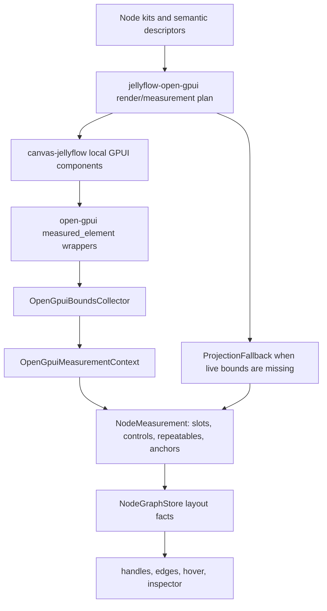
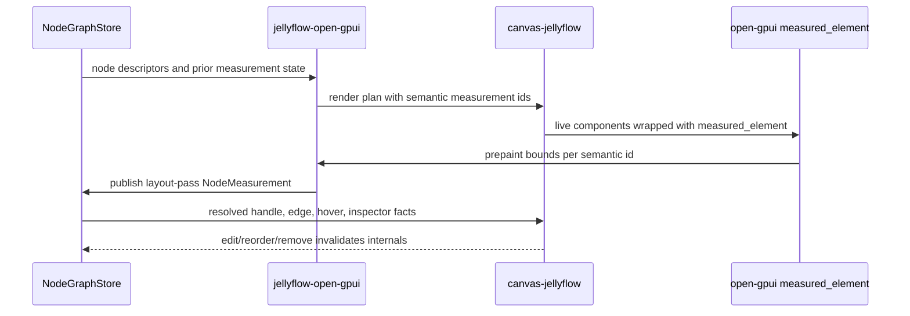
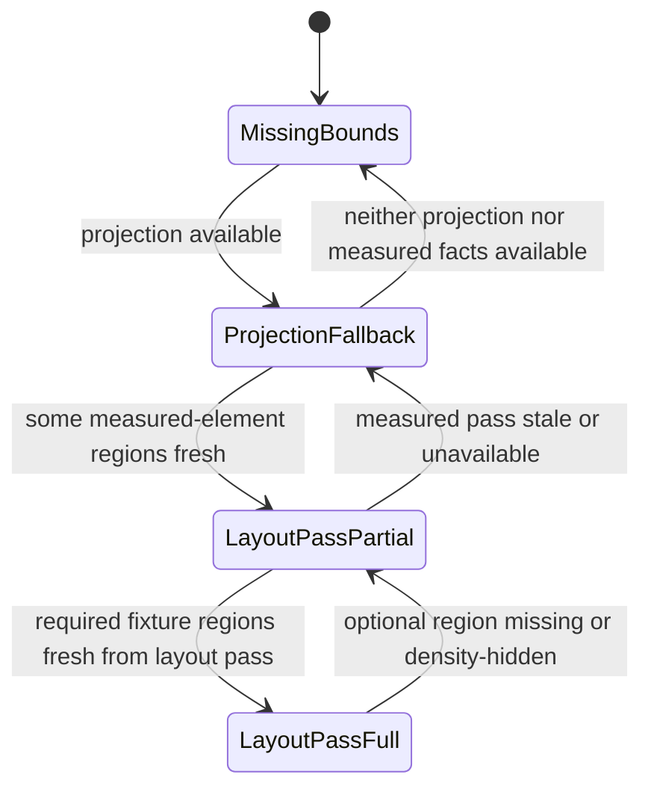

# Open GPUI Layout-Pass Measurement

## Goal Capsule

| Field | Value |
| --- | --- |
| Objective | Promote GPUI measurement from honest `ProjectionFallback` to real layout-pass bounds by wiring open-gpui `measured_element` reporting into live `canvas-jellyflow` node component rendering and publishing those facts through `jellyflow-open-gpui` into `NodeMeasurement`. |
| Target repos | Jellyflow root and `repo-ref/open-gpui`. Paths are repo-relative to the Jellyflow root. |
| Source authority | ADR 0008, ADR 0009, Node UI Kit Component Contract, Open GPUI Mature Adapter plan, `jellyflow-open-gpui`, and the open-gpui `measured_element` primitive. |
| Execution profile | Deep cross-repo fearless refactor: adapter measurement plumbing, example integration, runtime fact consumption, product fixture gates, and docs cleanup. |
| Stop condition | `canvas-jellyflow` wraps real slot/control/repeatable/anchor UI regions with measured elements; `jellyflow-open-gpui` collects fresh layout-pass bounds, converts them into `NodeMeasurement`, and marks coverage/source honestly; handles, edges, hover targets, and inspector targets use the measured facts when available; projection fallback remains explicit and tested for missing or stale regions. |
| Explicit non-goal | Do not build a shared widget crate, backend execution, shader compilation, broad screenshot infrastructure, a mature egui/Dioxus expansion, or a product clone of Dify, Unreal Blueprint, Unity Shader Graph, or MarginNote. |

---

## Product Contract

### Summary

The previous plan correctly moved reusable GPUI work into `jellyflow-open-gpui` and left `canvas-jellyflow` as a consumer/manual fixture.
It also kept capability reporting honest: the adapter can project rich semantic regions today, but it cannot claim full layout-pass measurement while geometry still comes from `OpenGpuiNodeSurfaceLayout` formulas.

This plan narrows the next stage to the missing maturity step.
Open GPUI must report the actual bounds of rendered node internals, and Jellyflow must treat those reported bounds as the source of truth for handles, edges, hover, and inspector geometry.
Projection remains useful as a fallback, but it should no longer be the path that makes GPUI feel mature.

### Problem Frame

Dify-style nodes, shader graphs, ERD tables, and mind-map shells all depend on node-internal UI that can change size or structure after the node itself is created.
Textareas grow, controls collapse, repeatable rows are added or removed, shader inputs reorder, diagnostics appear, and inspector targets shift.
If Jellyflow keeps relying on projection math, GPUI visuals can diverge from runtime geometry: handles stay in old positions, edge endpoints detach from real rows, invalid hover regions become misleading, and inspector targets point to approximations.

Open GPUI already has a `measured_element` wrapper that reports nested layout-pass bounds during prepaint.
The missing work is to use that primitive in the live Jellyflow example, make `jellyflow-open-gpui` own the collection/conversion contract, and harden tests so capability claims require real measured data.

### Requirements

**Live measured component tree**

- R1. Keep `jellyflow-core`, `jellyflow-layout`, and `jellyflow-runtime` free of open-gpui, GPUI element, and widget types.
- R2. Keep `jellyflow-open-gpui` as the only Jellyflow crate that owns GPUI adapter mapping, projection fallback, measurement conversion, controls, repeatables, menus, inspector planning, and product fixture gates.
- R3. Render `canvas-jellyflow` node internals from semantic descriptors using stable measurement ids for slots, controls, repeatable items, and anchors.
- R4. Wrap live rendered GPUI regions with open-gpui `measured_element`, not only isolated unit-test elements.
- R5. Measure the same UI regions the user sees. The layout-pass path must not rebuild a separate invisible geometry model that can drift from rendered controls.

**Bounds collection and coordinate conversion**

- R6. Reset or scope bounds collection per render/prepaint cycle so stale measurements from prior node states cannot remain fresh.
- R7. Convert GPUI view-space bounds into node-local and canvas-space measurement facts with the correct node origin, viewport pan, and zoom.
- R8. Preserve measurement revision/freshness and semantic ids so runtime can tell fresh measured bounds from dirty, missing, or fallback facts.
- R9. Support nested regions: a node surface can contain controls inside slots, repeatable rows inside repeatable groups, and anchors inside rows.
- R10. Treat zero-size, clipped, hidden, or density-degraded regions explicitly rather than silently publishing misleading full bounds.

**Runtime fact consumption**

- R11. Publish layout-pass `NodeMeasurement` through the existing runtime measurement path.
- R12. Resolve handles and edge endpoints from layout-pass slot/anchor/repeatable facts when fresh facts exist.
- R13. Use measured facts for hover and invalid connection target feedback where the GPUI example currently uses projection layout.
- R14. Use measured facts for inspector target placement and node-internal selection/highlight regions.
- R15. Keep projection fallback as a visible degrade path when layout-pass bounds are missing, incomplete, stale, or unsupported for a region.

**Dynamic authoring**

- R16. Repeatable add, remove, reorder, and edit operations must invalidate measurements and refresh bounds on the next layout pass.
- R17. Dynamic shader/blueprint and ERD-style item ports must keep stable item identity across reorder and must clear or downgrade removed anchors.
- R18. Dify-style control edits that affect layout, such as textarea content changes or collapsed/expanded groups, must refresh measured slot/control bounds.
- R19. Disabled or unsupported dynamic-port behavior must report explicit capability/diagnostic facts rather than silently producing stale endpoints.

**Capability honesty and tests**

- R20. `OpenGpuiMeasurementMode::LayoutPass` can only claim full layout-pass support when test fixtures prove the data source is real measured-element bounds.
- R21. Product fixture reports must expose measurement source coverage: layout-pass, projection fallback, missing, stale, and partial.
- R22. Tests must fail if a full capability claim is backed only by `OpenGpuiNodeSurfaceLayout` projection.
- R23. Existing projection fallback tests should remain, but their expected capability level must stay projection/partial.

**Documentation**

- R24. Update `jellyflow-open-gpui` docs to explain the measured-element data flow, fallback behavior, and capability levels.
- R25. Update engineering memory with the new current state after implementation.
- R26. Do not present this stage as cross-framework UI widget parity. It is GPUI maturity for the existing headless semantic contract.

### Acceptance Examples

- AE1. Given a Dify-style LLM node with prompt textarea and parameter controls, when the textarea grows or a group expands, then the next GPUI layout pass reports changed bounds and handles/inspector targets update without projection-only math.
- AE2. Given a shader node with dynamic input rows, when an input row is reordered, then the measured anchor follows the stable item id and edge endpoints stay attached to the same logical input.
- AE3. Given a shader or ERD repeatable item that is removed, when the next layout pass completes, then removed item anchors are no longer fresh and incident edges/hover targets do not keep stale positions.
- AE4. Given an ERD table node with field rows, when field text edits change row height or clipping, then field-level handles and edge routes resolve from measured row bounds.
- AE5. Given compact, shell, or low-zoom density, when node internals are clipped or hidden, then the measurement report either publishes the real clipped target or downgrades that region instead of reporting a full invisible hit region.
- AE6. Given a node whose measured-element reporting is unavailable, when the adapter renders it, then capability/reporting shows projection fallback and the UI remains usable.
- AE7. Given a GPUI capability report that says layout-pass measurement is full, when regression tests inspect the report, then every required fixture proves non-projection measured-element source coverage.

### Scope Boundaries

#### In Scope

- Using `repo-ref/open-gpui/crates/gpui/src/elements/measured.rs` in the live `canvas-jellyflow` render tree.
- Extending `jellyflow-open-gpui` measurement helpers so they can consume actual measured-element regions.
- Keeping `OpenGpuiNodeSurfaceLayout` as fallback/projection support while removing any misleading full-support path.
- Updating the GPUI example so handles, edges, hover, and inspector regions can read measured layout-pass facts.
- Adding deterministic unit and example tests for Dify, shader/blueprint, ERD, and mind-map fixture geometry.
- Updating README/current-state/log docs after implementation.

#### Deferred to Follow-Up Work

- Full visual screenshot automation and pixel-level regression for all GPUI states.
- Mature Dioxus adapter work.
- Additional egui UI authoring beyond compatibility with shared runtime facts.
- Advanced keyboard/focus parity for every GPUI control.
- Blackboard editing beyond geometry/fact compatibility.

#### Outside This Product's Identity

- A backend workflow engine.
- Shader compilation or graph execution.
- A shared widget crate.
- DOM/React compatibility.
- Replacing open-gpui's component library with Jellyflow-owned widgets.

---

## Planning Contract

### Key Technical Decisions

- KTD1. Real GPUI geometry must come from `measured_element` in the rendered component tree. Projection formulas remain fallback only.
- KTD2. `OpenGpuiBoundsCollector` is the adapter collection boundary. It should be scoped/reset so each publish can prove which pass produced its regions.
- KTD3. `NodeMeasurement` remains the cross-boundary handoff. Runtime never learns GPUI element or widget types.
- KTD4. Stable semantic ids bridge rendered GPUI elements to Jellyflow descriptors. Slot keys, control keys, repeatable item ids, and anchor/port keys must be preserved through measurement.
- KTD5. Capability reporting is source-gated. Full layout-pass support requires real measured-element evidence, not a mode flag alone.
- KTD6. Dynamic repeatable identity is the hardest correctness point. Item ids, dynamic port keys, and measured anchors must remain stable across reorder and disappear cleanly on removal.
- KTD7. `canvas-jellyflow` stays a consumer and manual fixture. Reusable logic belongs in `jellyflow-open-gpui`.
- KTD8. Tests should prove deterministic geometry and source coverage before adding broad screenshot infrastructure.

### High-Level Technical Design

The design keeps runtime headless and makes GPUI the only framework-aware participant.







### Output Structure

The exact file split can change during implementation, but the ownership boundary should stay stable.

```text
crates/jellyflow-open-gpui/
  src/adapter.rs
  src/measurement.rs
  src/projection.rs
  src/repeatable.rs
  src/controls.rs
  src/inspector.rs
  src/testing.rs
  README.md

repo-ref/open-gpui/
  crates/gpui/src/elements/measured.rs
  examples/canvas-jellyflow/src/main.rs
```

### Measurement Source Model

| Source | Meaning | Capability level |
| --- | --- | --- |
| `LayoutPass` | Bounds came from live open-gpui `measured_element` reports for rendered UI regions. | Full only when fixture coverage passes. |
| `LayoutPassPartial` | Some required regions were measured, but coverage is incomplete, clipped, or density-hidden. | Partial with explicit gaps. |
| `ProjectionFallback` | Bounds came from `OpenGpuiNodeSurfaceLayout` or equivalent deterministic projection. | Projection only; never full. |
| `Missing` | No usable region exists for a target. | Unsupported/missing with diagnostic. |
| `Stale` | Previously measured data is no longer valid after edit/reorder/resize/zoom. | Dirty until refreshed or downgraded. |

---

## Implementation Units

### U1. Bind Semantic Measurement Ids to Live GPUI Components

**Purpose:** Ensure every meaningful rendered node-internal region has a stable semantic measurement id before collecting bounds.

**Files:**

- `crates/jellyflow-open-gpui/src/measurement.rs`
- `crates/jellyflow-open-gpui/src/projection.rs`
- `crates/jellyflow-open-gpui/src/controls.rs`
- `crates/jellyflow-open-gpui/src/repeatable.rs`
- `repo-ref/open-gpui/examples/canvas-jellyflow/src/main.rs`

**Approach:**

- Add or refine a semantic measurement id type/function for node surface, slot, control, repeatable group, repeatable item, and anchor regions.
- Keep id generation deterministic and descriptor-backed. Do not derive ids from display labels or row indexes alone.
- Thread those ids into `canvas-jellyflow` rendering for real GPUI controls and repeatable rows.
- Preserve projection layout ids for fallback, but label their source separately.

**Test Scenarios:**

- Dify prompt/control ids are stable across re-render.
- Shader repeatable item ids remain stable after reorder.
- ERD field row ids include item identity rather than display text.
- Duplicate semantic ids in one node are rejected or diagnosed.

### U2. Collect Live Layout-Pass Bounds and Convert Them into `NodeMeasurement`

**Purpose:** Make measured-element reports publishable as runtime geometry.

**Files:**

- `crates/jellyflow-open-gpui/src/measurement.rs`
- `crates/jellyflow-open-gpui/src/adapter.rs`
- `repo-ref/open-gpui/examples/canvas-jellyflow/src/main.rs`
- `repo-ref/open-gpui/crates/gpui/src/elements/measured.rs` only if the existing primitive needs a minimal compatibility fix

**Approach:**

- Use the existing `measured_element` callback to feed `OpenGpuiBoundsCollector` during live prepaint.
- Add a pass/revision model or equivalent freshness token so collected regions cannot be confused with old renders.
- Convert view-space bounds through `OpenGpuiMeasurementContext` using node origin, viewport pan, and zoom.
- Publish measured slots, controls, repeatable item slots, and anchors through `NodeMeasurement`.
- Mark missing, clipped, and zero-size regions explicitly in adapter reports.

**Test Scenarios:**

- Nested measured elements report distinct parent and child bounds.
- View-space to node-local conversion handles non-zero node origin and zoom.
- Re-render after size change updates a region's bounds and freshness.
- Bounds collected for one node do not leak into another node's measurement.

### U3. Route Handles, Edges, Hover, and Inspector Through Measured Facts

**Purpose:** Make GPUI user-facing geometry consume measured layout-pass facts instead of projection formulas when possible.

**Files:**

- `repo-ref/open-gpui/examples/canvas-jellyflow/src/main.rs`
- `crates/jellyflow-open-gpui/src/measurement.rs`
- `crates/jellyflow-open-gpui/src/testing.rs`
- `crates/jellyflow-runtime/src/**` only if an existing runtime fact cannot represent a needed measured target

**Approach:**

- Resolve handles through `NodeGraphStore` measurement-aware handle and anchor APIs after publishing layout-pass facts.
- Update edge endpoint and route projection in the example to prefer fresh measured anchors.
- Use measured slot/control/repeatable bounds for hover and invalid connection target hit regions.
- Use measured target bounds to locate inspector highlights/targets.
- Keep the fallback branch obvious in code and tests.

**Test Scenarios:**

- ERD field handle follows a measured row after row height changes.
- Shader dynamic input edge endpoint follows a measured row after reorder.
- Invalid hover feedback resolves against measured anchors.
- Inspector target for a control resolves to measured control bounds when available and projection fallback otherwise.

### U4. Handle Dynamic Repeatables and Measurement Invalidation

**Purpose:** Prevent stale anchors when node-internal structure changes.

**Files:**

- `crates/jellyflow-open-gpui/src/repeatable.rs`
- `crates/jellyflow-open-gpui/src/measurement.rs`
- `crates/jellyflow-open-gpui/src/testing.rs`
- `repo-ref/open-gpui/examples/canvas-jellyflow/src/main.rs`

**Approach:**

- Ensure repeatable add/remove/reorder/edit operations invalidate the affected node internals.
- Preserve stable item ids through reorder and expose item id in measured region ids.
- When an item is removed, clear or downgrade its measured slot/anchor freshness.
- Keep dynamic port policy explicit: bound to graph port, display only, missing graph port, or unsupported.
- Make density-hidden and clipped repeatable regions report partial coverage rather than stale full coverage.

**Test Scenarios:**

- Shader input reorder keeps the same logical edge endpoint attached to the same item id.
- Shader input removal clears stale anchors and reports missing/downgraded facts.
- ERD field edit invalidates and refreshes measured row facts.
- Hidden compact repeatable rows do not publish full visible hit regions.

### U5. Gate Capability Reports on Measured-Element Source Coverage

**Purpose:** Prevent the adapter from overclaiming maturity.

**Files:**

- `crates/jellyflow-open-gpui/src/adapter.rs`
- `crates/jellyflow-open-gpui/src/testing.rs`
- `crates/jellyflow-open-gpui/README.md`
- `docs/knowledge/engineering/current-state.md`

**Approach:**

- Add source coverage fields to product fixture reports if the existing report cannot distinguish measured-element and projection sources per region.
- Keep `OpenGpuiAdapter::projection_fallback()` available and honest.
- Make `OpenGpuiAdapter::layout_pass()` or its final equivalent require real source coverage in tests before reporting full support.
- Fail fixture gates if a full claim is backed by projection-only data.
- Document partial and fallback states in adapter docs.

**Test Scenarios:**

- Projection fallback report cannot satisfy full layout-pass capability.
- Full layout-pass claim fails when any required Dify/shader/ERD fixture region lacks measured-element source coverage.
- Partial coverage reports exact missing/stale regions.
- Capability docs/examples mention the fallback path without implying full support.

### U6. Add Product-Shaped Layout-Pass Regression Gates

**Purpose:** Prove the measured path works for the node families Jellyflow actually cares about.

**Files:**

- `crates/jellyflow-open-gpui/src/testing.rs`
- `repo-ref/open-gpui/examples/canvas-jellyflow/src/main.rs`
- `docs/examples/README.md` if examples guidance changes
- `README.md` if public adapter status changes

**Approach:**

- Extend product fixture gates for Dify workflow, shader/blueprint, ERD, and mind-map/knowledge nodes.
- For each fixture, assert required regions are inside node bounds, non-overlapping where expected, and sourced from layout-pass measurement where full support is claimed.
- Include compact/shell/density cases and resize cases.
- Keep tests deterministic and local; do not require broad screenshot automation for this slice.

**Test Scenarios:**

- Dify prompt textarea, select, variable picker stub, and parameter controls report measured bounds.
- Shader dynamic inputs report measured item anchors after reorder/remove.
- ERD field rows report measured bounds after text/size change.
- Mind-map shell content either reports measured shell targets or explicit hidden/partial coverage.

### U7. Final Cleanup, Documentation, and Launch Smoke

**Purpose:** Remove misleading projection-era language and finish with reproducible evidence.

**Files:**

- `crates/jellyflow-open-gpui/README.md`
- `docs/knowledge/engineering/current-state.md`
- `docs/knowledge/engineering/log.md`
- `repo-ref/open-gpui/examples/canvas-jellyflow/src/main.rs`

**Approach:**

- Search for stale "proof-only" or "projection proves full support" wording and replace it with precise capability language.
- Keep old helper names only when they clearly describe fallback behavior.
- Run the full verification contract below.
- Launch the GPUI example for a short smoke when the local GUI environment permits it, then stop the process before final handoff.

**Test Scenarios:**

- Documentation names `jellyflow-open-gpui` as adapter boundary and `canvas-jellyflow` as consumer/manual fixture.
- No plan-facing docs claim full support without layout-pass source coverage.
- Final `git diff --check` passes in both repositories.

---

## Verification Contract

Run focused checks as units land, then run the final gate before marking the plan complete.

```bash
cargo fmt --all -- --check
cargo fmt --manifest-path repo-ref/open-gpui/examples/canvas-jellyflow/Cargo.toml -- --check
git diff --check
git -C repo-ref/open-gpui diff --check
cargo nextest run -p jellyflow-open-gpui --no-fail-fast
cargo nextest run -p jellyflow-runtime -p jellyflow-egui -p jellyflow-proof --lib --no-fail-fast
cargo test -p jellyflow-runtime --test public_surface -- --nocapture
cargo test -p jellyflow-proof --test proof -- --nocapture
cargo test --manifest-path templates/headless-adapter/Cargo.toml
cargo check -p jellyflow-egui --examples
cargo test --manifest-path repo-ref/open-gpui/crates/gpui/Cargo.toml measured_element_reports_nested_layout_pass_bounds -- --nocapture
cargo check --manifest-path repo-ref/open-gpui/examples/canvas-jellyflow/Cargo.toml
cargo test --manifest-path repo-ref/open-gpui/examples/canvas-jellyflow/Cargo.toml --bin open-gpui-canvas-jellyflow -- --nocapture
```

When GUI launch is available:

```bash
cargo run --manifest-path repo-ref/open-gpui/examples/canvas-jellyflow/Cargo.toml
```

Interrupt the launch smoke after confirming the window starts and measured node internals render without obvious overflow.
Existing open-gpui `gpui_macos` check-cfg and unused-unsafe warnings are not part of this plan unless a touched file introduces new failures.

---

## Definition of Done

- `canvas-jellyflow` wraps live node-internal regions with measured elements for slots, controls, repeatable items, and anchors.
- `jellyflow-open-gpui` collects layout-pass bounds, converts them correctly, and publishes fresh `NodeMeasurement` facts.
- Handles, edge endpoints, hover targets, invalid connection feedback, and inspector targets prefer fresh measured facts over projection.
- Projection fallback remains available, explicit, and tested.
- Dynamic repeatable add/remove/reorder/edit invalidates and refreshes measured facts without stale anchors.
- Capability reporting cannot claim full layout-pass measurement without real measured-element source coverage.
- Dify, shader/blueprint, ERD, and mind-map fixture gates cover full/compact/shell, resize or edit, dynamic repeatable, and missing/fallback cases where applicable.
- Runtime/core/layout remain toolkit-free.
- `canvas-jellyflow` remains a consumer/manual fixture and does not regain adapter ownership.
- Documentation and engineering memory explain the new layout-pass path and remaining fallback boundary.
- Final verification contract passes, aside from explicitly noted pre-existing open-gpui warnings.

---

## Implementation-Time Unknowns

- The exact lifetime owner for `OpenGpuiBoundsCollector` in the live GPUI app may need to be chosen during implementation: window-local, view-local, or render-plan-local.
- The exact semantic id encoding should be kept internal unless tests show downstream diagnostics need stable string formatting.
- Some regions may be intentionally hidden at low zoom. Implementation should decide whether hidden regions publish zero-size measured facts, partial coverage, or missing facts, but tests must make that choice explicit.
- A minimal open-gpui API adjustment may be needed if the existing measured-element callback cannot access enough coordinate context in the live canvas stack.
- GUI launch smoke may not be deterministic in headless sessions; unit and example tests remain the required evidence.
