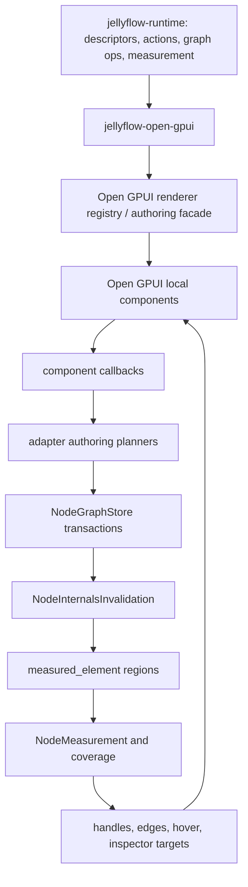
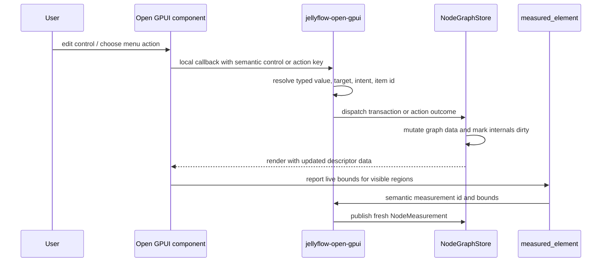
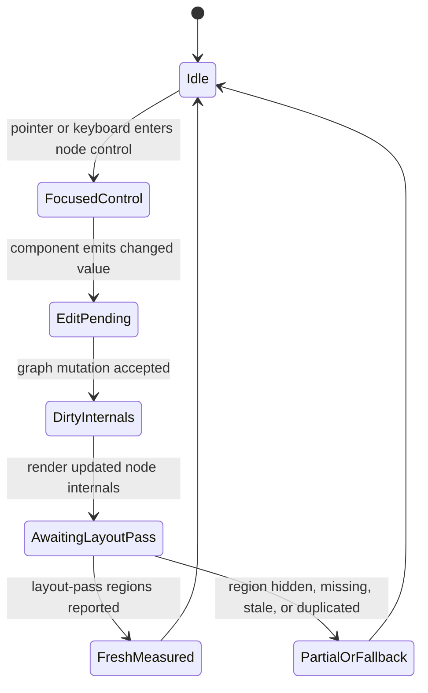

# Open GPUI Productized Authoring - Plan

## Goal Capsule

| Field | Value |
| --- | --- |
| Objective | Promote `jellyflow-open-gpui` and `canvas-jellyflow` from layout-pass measurement proof to a productized Open GPUI authoring adapter: editable in-node controls, adapter-local custom node renderers, repeatable authoring, action/menu dispatch, dropped-wire insert, inspector/blackboard panels, and regression gates for Dify-style workflow, shader/blueprint, ERD, and mind-map shapes. |
| Target repos | Jellyflow root and `repo-ref/open-gpui`. Paths are repo-relative to the Jellyflow root. |
| Source authority | ADR 0008, ADR 0009, Node UI Kit Component Contract, Open GPUI Mature Adapter plan, Open GPUI Layout-Pass Measurement plan, `jellyflow-open-gpui`, `canvas-jellyflow`, and the local Open GPUI component library. |
| Execution profile | Deep cross-repo fearless refactor: adapter API design, live component event wiring, dynamic authoring flows, example UX, regression gates, and docs cleanup. |
| Stop condition | Users can edit practical Dify/shader/ERD node internals through Open GPUI components; edits and repeatable actions mutate Jellyflow graph data through adapter-owned planners, invalidate internals, refresh layout-pass measurement, and keep handles/menus/inspector targets honest; capability/status docs no longer describe completed layout-pass work as missing. |
| Explicit non-goal | Do not build a shared widget crate, backend workflow execution, shader compilation, DOM/React adapter, broad egui/Dioxus expansion, full pixel-golden visual system, or a product clone of Dify, Unreal Blueprint, Unity Shader Graph, or MarginNote. |

---

## Product Contract

### Summary

The previous stage completed the GPUI layout-pass measurement path: live Open GPUI `measured_element` reports can become Jellyflow `NodeMeasurement` facts, and full layout-pass claims are source-gated.
The remaining product gap is interaction maturity.
Open GPUI nodes can render semantic controls, repeatables, menus, and inspector plans, but the live example still behaves mostly like a projection and display surface: controls do not write back, action/menu selections do not form a full user path, repeatables are not authorable, and inspector UI is still a summary panel.

This plan narrows the next stage to Open GPUI product authoring.
Runtime remains headless and semantic; `jellyflow-open-gpui` owns adapter-local plans and authoring helpers; `canvas-jellyflow` owns concrete Open GPUI widgets, focus, popup, and smoke UX.
The target is not framework breadth.
It is the first mature Rust-native custom-node authoring experience for this project.

### Problem Frame

Dify-style workflow nodes, shader graph nodes, ERD table nodes, and mind-map shells need real node-internal UI.
Users expect to edit textareas, selects, toggles, sliders, repeatable parameter rows, dynamic shader inputs, table fields, node menus, and inspectors without handles drifting or canvas gestures fighting form controls.

Jellyflow already has the semantic contracts for these surfaces and the GPUI adapter already has control/action/inspector/repeatable render plans.
The missing layer is the authoring loop: local Open GPUI component events must become Jellyflow graph mutations, those mutations must invalidate and refresh measured internals, and example-level UI state must prove the flow works without pushing widget concepts into runtime.

The plan also needs to absorb the practical lesson from `egui-snarl`.
Its custom-node authoring is easy because a viewer can render arbitrary UI inside a node.
Jellyflow should not expose toolkit widgets in runtime, but Open GPUI does need an adapter-local renderer registry or authoring facade so users can plug custom GPUI node bodies into the semantic measurement/action pipeline.

### Requirements

**Adapter-local authoring facade**

- R1. Keep `jellyflow-core`, `jellyflow-layout`, and `jellyflow-runtime` free of Open GPUI, egui, Dioxus, DOM, widget, element, focus, popup, and event-loop types.
- R2. Keep `jellyflow-open-gpui` adapter-specific. It may expose GPUI render plans, authoring planners, measurement ids, capability facts, and test helpers, but it must not become a shared widget crate.
- R3. Add an Open GPUI custom-node authoring facade or renderer registry keyed by semantic renderer information, with fallback rendering for unknown or unsupported node kinds.
- R4. The renderer facade must give GPUI-local code access to descriptor-derived slots, controls, actions, repeatables, measurement ids, and dispatch helpers without letting runtime own GPUI widgets.

**Live controls and event dispatch**

- R5. Wire Open GPUI `TextInput`, `Textarea`, `NumberInput`, `Select`, `Switch`, `Slider`, `Button`, and `Menu` callbacks into `jellyflow-open-gpui` authoring plans where those components already support events.
- R6. Text, textarea, number, slider, switch, and select edits must write typed JSON values through Jellyflow graph mutation paths and mark node internals dirty when layout can change.
- R7. Select controls must write the original descriptor option value, not a display label or lossy string.
- R8. Disabled, read-only, unsupported, and stub controls must render with explicit unavailable state and must not dispatch mutations.
- R9. Node-internal interactive controls must not accidentally trigger canvas drag, node selection, edge drawing, or graph-level keyboard shortcuts while focused or actively edited.

**Repeatable authoring and dynamic ports**

- R10. Repeatable collections must support practical add, remove, reorder, and edit flows for Dify parameters, shader dynamic inputs, and ERD fields.
- R11. Repeatable identity must remain item-id based. Reorder must move the same logical item, and removal must clear or downgrade stale item rows, anchors, hover targets, and incident edge endpoints.
- R12. Dynamic port behavior must be explicit: a repeatable item either updates graph port facts, reports a missing-port diagnostic, or stays display-only without publishing fake handles.

**Actions, menus, dropped-wire, inspector, and blackboard**

- R13. Node, toolbar, graph, port, slot, control, repeatable item, inspector, and blackboard action surfaces must dispatch semantic action plans through GPUI-local UI.
- R14. Dropped-wire insert must become a user path: dropping a compatible wire opens or resolves compatible insert actions, choosing an action creates the target node at the pointer, and the source connection is applied or rejected through the existing connection lifecycle.
- R15. Inspector panels must render editable controls and action menus for selected nodes, slots, controls, repeatable items, and diagnostics, while keeping open/close/focus state in GPUI-local code.
- R16. Blackboard support for this stage is a minimal graph-level authoring surface: list semantic blackboard entries and dispatch declared actions. Advanced blackboard drag/drop and rich variable management are deferred.

**Measurement, capability, and UX honesty**

- R17. Every authoring mutation that can affect layout must invalidate internals and recover fresh layout-pass measurement on the next pass.
- R18. Measurement coverage must continue to distinguish layout-pass, projection fallback, missing, stale, duplicate, and partial regions. Full support cannot be claimed through projection.
- R19. `canvas-jellyflow` capability/status UI and docs must stop presenting the completed layout-pass measurement hook as a missing gap; the remaining gap should be described as productized authoring interaction coverage.
- R20. Low-density, compact, shell, clipped, and hidden regions must produce honest partial/missing/fallback facts rather than invisible full hit regions.

**Regression and documentation**

- R21. Product-shaped gates must cover Dify workflow, shader/blueprint, ERD, and mind-map shapes across full, compact, shell, resize, invalid hover, dropped-wire menu, inspector, repeatable add/remove/reorder, and missing/fallback states where applicable.
- R22. Hard gates should prefer structured geometry, capability, and interaction reports over pixel-golden screenshots.
- R23. A minimal launch or screenshot smoke may prove the native GPUI window renders and key regions are nonblank, but full pixel-baseline infrastructure is deferred.
- R24. Documentation and engineering memory must explain the new Open GPUI authoring boundary, remaining component stubs, and why runtime still does not own widgets.

### Acceptance Examples

- AE1. Given a Dify-style LLM node with a prompt textarea, when the user edits the prompt in `canvas-jellyflow`, then node data changes through a Jellyflow transaction, internals become dirty, and the next layout pass publishes fresh measured control and slot bounds.
- AE2. Given a Dify-style model select, when the user chooses a model, then the stored value equals the descriptor option value and not the display label.
- AE3. Given a user clicks or types inside a node-internal input, when the pointer or keyboard event fires, then the control handles the event without starting node drag, canvas pan, selection replacement, or a dropped-wire gesture.
- AE4. Given a shader node with dynamic inputs, when an input is added, reordered, or removed, then stable item ids preserve logical identity, measured anchors follow the item, and removed anchors no longer remain fresh.
- AE5. Given an ERD table node, when a field row is edited or removed, then field-level handles and edge endpoints update through fresh measured row bounds or explicitly downgrade when the row disappears.
- AE6. Given a wire is dropped on empty canvas, when compatible insert actions exist, then the GPUI menu/action path can create a compatible node near the pointer and connect the original source handle through Jellyflow connection validation.
- AE7. Given a selected node, control, repeatable item, or diagnostic, when the inspector is opened, then inspector controls and action menus render with GPUI components, edits use the same write path as in-node controls, and the target highlight prefers measured bounds.
- AE8. Given compact or shell density, when controls or repeatable rows are hidden or clipped, then measurement and capability reports mark those targets partial or missing instead of reporting full invisible hit regions.
- AE9. Given the example status panel, when layout-pass measurement is active but authoring interaction remains partial, then the user-facing capability text reflects that exact state.

### Scope Boundaries

#### In Scope

- Open GPUI as the only mature adapter target for this stage.
- Adapter-local custom renderer registry or authoring facade for Open GPUI node internals.
- Event wiring for existing Open GPUI text, textarea, number, select, switch, slider, button, menu, checkbox-like, and popover-capable primitives where needed by the product fixtures.
- Graph mutation, invalidation, and refresh flow for GPUI controls, inspector controls, menu actions, and repeatable operations.
- Dropped-wire insert flow in the Open GPUI example.
- Minimal blackboard panel/action surface needed to prove graph-level authoring descriptors.
- Regression gates based on structured geometry, interaction, and capability evidence.
- Docs and engineering memory updates that distinguish completed layout-pass measurement from remaining authoring maturity.

#### Deferred to Follow-Up Work

- Full pixel-golden screenshot baselines for GPUI.
- Mature Dioxus adapter.
- Additional egui feature work beyond compile compatibility or shared contract fixes.
- Product-grade asset picker, variable picker, code editor, color picker, and multiselect widgets.
- Open GPUI component-library changes for slider drag, numeric free-text editing, color picking, or multiselect unless implementation proves they are required for the first productized path.
- Advanced blackboard drag/drop, variable scoping, and rich symbol management.
- Collaboration, persistence services, real Dify workflow execution, LLM/tool execution, shader compilation, and database migration behavior.

#### Outside This Product's Identity

- A shared `jellyflow-ui-widgets` crate.
- Runtime-owned GPUI widgets, focus state, popup state, menu state, or framework event loops.
- A DOM/React adapter.
- A backend workflow engine.
- Replacing Open GPUI's component library with Jellyflow-owned widgets.

---

## Planning Contract

### Key Technical Decisions

- KTD1. Product authoring stays adapter-local. Runtime owns semantic descriptors, action intent, graph transactions, measurement lifecycle, and conformance vocabulary; Open GPUI owns concrete components, focus, popup state, and widget event handling.
- KTD2. Add an Open GPUI authoring facade instead of a shared widget crate. The facade is the GPUI equivalent of an `egui-snarl` viewer entry point, but it lives in `jellyflow-open-gpui` and consumes semantic contracts rather than exposing toolkit types upstream.
- KTD3. Use existing Open GPUI components before changing the fork. `TextInput`, `Textarea`, `Select`, `Switch`, `NumberInput`, `Slider`, `Button`, and `Menu` already have callback patterns; component-library edits are reserved for proven gaps.
- KTD4. Treat control edit planning as an adapter helper for now. If egui or proof later duplicates the same data-binding write logic, a renderer-neutral planner can be promoted to runtime, but no UI state moves with it.
- KTD5. Values must remain semantic and typed. Select and repeatable actions resolve descriptor values and item ids, not labels, row indexes, or presentation strings.
- KTD6. Event arbitration is a first-class correctness requirement. Node-internal controls must consume pointer and keyboard events when appropriate so authoring does not fight canvas tools.
- KTD7. Repeatable item identity drives dynamic ports. Graph ports, measured anchors, inspector targets, and incident edge behavior must use item ids and port keys, not visual row positions.
- KTD8. Menus and inspector panels split intent from state. Runtime provides targets, intents, availability, groups, disabled reasons, and diagnostics; GPUI owns menu open state, selection focus, popover placement, and sidebar rendering.
- KTD9. Visual regression remains structured-first. Geometry and capability reports are hard gates; screenshot or launch smoke is supportive evidence until Open GPUI has stable golden-image infrastructure.
- KTD10. Capability text must be current. After layout-pass measurement completion, any remaining `ProjectionFallback` or gap label must correspond to real fallback coverage, not stale proof-era messaging.

### High-Level Technical Design







### Output Structure

The exact file split can change during implementation, but the ownership boundary should stay stable.

```text
crates/jellyflow-open-gpui/
  src/authoring.rs
  src/renderer.rs
  src/adapter.rs
  src/controls.rs
  src/actions.rs
  src/inspector.rs
  src/repeatable.rs
  src/measurement.rs
  src/testing.rs
  src/lib.rs
  README.md

repo-ref/open-gpui/
  examples/canvas-jellyflow/src/main.rs
  crates/ui_components/src/...

docs/
  testing/node-ui-authoring-regression.md
  knowledge/engineering/current-state.md
  knowledge/engineering/log.md
```

### Research and Evidence

- `crates/jellyflow-open-gpui/src/controls.rs` already maps semantic control descriptors to Open GPUI primitive families and can build `GraphTransaction + NodeInternalsInvalidation` edit plans.
- `crates/jellyflow-open-gpui/src/actions.rs`, `inspector.rs`, and `repeatable.rs` already project semantic actions, menus, inspectors, repeatable items, dynamic-port diagnostics, and dropped-wire insert plans.
- `repo-ref/open-gpui/examples/canvas-jellyflow/src/main.rs` already consumes live `measured_element` regions and routes handles, hit tests, invalid connection feedback, and inspector target highlights through measurement facts.
- `repo-ref/open-gpui/crates/ui_components/src` already provides callback-capable `Button`, `TextInput`, `Textarea`, `Select`, `Switch`, `NumberInput`, `Slider`, `Menu`, `Checkbox`, and `Popover` primitives.
- `docs/testing/node-ui-authoring-regression.md` already establishes the right verification posture: hard gates should be semantic geometry/capability evidence, with pixel snapshots as review support.
- `repo-ref/egui-snarl` shows the authoring ergonomics gap: users need a direct custom-node rendering entry point. Jellyflow should match the ease at the Open GPUI adapter layer while preserving the headless runtime boundary.

### Assumptions

- `repo-ref/open-gpui` is the user's fork and may receive targeted component fixes, but this plan should first use the existing component library.
- Open GPUI text editing requires initialization of the UI component adapter in the example application before live `TextInput` and `Textarea` authoring is reliable.
- The first productized path may keep `Color`, `Asset`, `VariablePicker`, `Code`, `Expression`, `PortBinding`, and `MultiSelect` as fallback/stub/partial components as long as capability reporting is honest.
- A one-frame measurement feedback loop is acceptable: edits mutate data, the next render lays out updated components, and the next measurement publish makes geometry fresh.
- If generic repeatable graph-port mutation primitives are missing in runtime, the implementation can add renderer-neutral graph operations or keep a GPUI example-local demo path, but stale anchors must not remain fresh.

### Alternative Approaches Considered

| Alternative | Decision | Rationale |
| --- | --- | --- |
| Put custom node widgets in runtime | Rejected | It breaks the headless adapter contract and blocks future egui, Dioxus, DOM, and self-drawn adapters from mapping semantics locally. |
| Build a shared widget crate now | Rejected | Current reuse pressure is semantic, not widget-level. A shared widget crate would become a lowest-common-denominator UI layer before two mature adapters prove the need. |
| Keep extending `canvas-jellyflow` without an authoring facade | Rejected | It would keep the example as the real adapter and leave users without a reusable Open GPUI custom-node entry point. |
| Modify Open GPUI components first | Deferred | Existing callbacks are enough for the first edit/menu/repeatable loop. Component-library changes should follow concrete gaps such as slider drag or multiselect. |
| Make screenshots the primary gate | Rejected for this stage | Native rendering is useful for smoke, but structured geometry and capability facts give more deterministic regression evidence. |

### Risks and Mitigation

| Risk | Mitigation |
| --- | --- |
| Component events trigger canvas tools | Add an adapter/example interactive-region wrapper and tests proving input clicks and text edits do not start drag, selection, pan, or wire gestures. |
| Select writes labels instead of semantic values | Resolve option selections through descriptor option values and add tests for non-label JSON values. |
| Repeatable mutation leaves stale handles | Gate add/remove/reorder on item-id based measurement and explicit removed-anchor downgrade tests. |
| Runtime accidentally gains GPUI types | Keep dependencies one-way and include public-surface/cargo dependency checks in the verification contract. |
| `canvas-jellyflow` becomes the adapter again | Move reusable authoring planners and renderer registry into `jellyflow-open-gpui`; keep the example as host, demo, and smoke fixture. |
| Capability reporting overclaims maturity | Require source coverage and interaction evidence before full claims; update stale UI gap text in the example. |
| Open GPUI widget gaps block UX | Start with supported callback components and keep advanced widgets as partial capability; only patch Open GPUI for proven blocker gaps. |

---

## Implementation Units

### U1. Add an Open GPUI Authoring Controller

**Goal:** Centralize GPUI-local authoring commands so component callbacks can produce graph mutations, action dispatch, and internals invalidation through one adapter-owned path.

**Requirements:** R1, R2, R5, R6, R7, R8, R17, AE1, AE2.

**Dependencies:** None.

**Files:** `crates/jellyflow-open-gpui/src/authoring.rs`, `crates/jellyflow-open-gpui/src/controls.rs`, `crates/jellyflow-open-gpui/src/actions.rs`, `crates/jellyflow-open-gpui/src/inspector.rs`, `crates/jellyflow-open-gpui/src/lib.rs`.

**Approach:** Add adapter-local helpers that translate component events into existing `plan_control_edit`, `plan_inspector_control_edit`, `plan_action_dispatch`, and repeatable/action outcomes.
Keep the helper free of Open GPUI widget objects so it can be unit-tested without launching a window.
It should accept semantic ids and typed values from the GPUI layer, return dispatchable outcomes, and describe why an event was ignored when a control is read-only, disabled, unsupported, or unchanged.

**Patterns to follow:** `crates/jellyflow-open-gpui/src/controls.rs`, `actions.rs`, `inspector.rs`, `repeatable.rs`.

**Test scenarios:**

- Text input and textarea events produce a `SetNodeData` transaction and `DataChanged` internals invalidation.
- Number input and slider events write JSON numbers rather than strings.
- Switch events write JSON booleans.
- Select events resolve the original descriptor option `Value`, including a value whose label differs from its stored value.
- Disabled, read-only, stub, no-binding, and unchanged controls produce no mutation and preserve the reason.
- Invalid JSON pointer or dot-path write attempts fail without mutating node data.
- Inspector control edits reuse the same edit path as in-node controls.

**Verification:** Unit tests prove the controller can plan edits, skipped edits, and action dispatch outcomes without importing Open GPUI into runtime/core.

### U2. Wire Live Controls in `canvas-jellyflow`

**Goal:** Make rendered Open GPUI controls in the native example actually edit Jellyflow node data.

**Requirements:** R5, R6, R7, R8, R9, R17, AE1, AE2, AE3.

**Dependencies:** U1.

**Files:** `repo-ref/open-gpui/examples/canvas-jellyflow/src/main.rs`, `repo-ref/open-gpui/examples/canvas-jellyflow/Cargo.toml`.

**Approach:** Initialize the Open GPUI text-input component adapter in the application startup path.
Pass node id, node data, control plan, and a dispatch callback into control rendering.
Attach `on_change`, `on_select`, `on_click`, or equivalent callbacks for the supported component primitives.
Dispatch accepted edit plans through `NodeGraphStore`, refresh the canvas document, mark measurement dirty, and schedule the next measurement frame.
Wrap node-internal interactive controls so pointer and keyboard events do not bubble into canvas tools while the control is active.

**Patterns to follow:** Existing `render_control_plan`, `render_measured_region`, `refresh_editor_from_store`, `consume_layout_pass_measurements`, and Open GPUI component callback patterns.

**Test scenarios:**

- Editing the Dify prompt textarea updates `fields.prompt`, refreshes the rendered value, invalidates internals, and recovers fresh measured bounds after the next layout pass.
- Selecting a Dify model writes the descriptor option value rather than the label.
- Changing a switch, number input, and slider updates boolean/number data with correct JSON types.
- Clicking inside text input or textarea does not move the node, replace selection, start pan, or begin a connection gesture.
- Disabled and read-only controls render as unavailable and do not call the store dispatch path.
- A stub variable/asset/port-binding control renders as partial and does not pretend to be editable.

**Verification:** Example tests cover live edit outcomes and event arbitration; launch smoke confirms the window starts with editable controls visible.

### U3. Add an Open GPUI Custom Node Renderer Facade

**Goal:** Give users an adapter-local way to plug native Open GPUI node internals into Jellyflow without adding toolkit widgets to runtime.

**Requirements:** R1, R2, R3, R4, R9, AE3.

**Dependencies:** U1.

**Files:** `crates/jellyflow-open-gpui/src/renderer.rs`, `crates/jellyflow-open-gpui/src/adapter.rs`, `crates/jellyflow-open-gpui/src/projection.rs`, `crates/jellyflow-open-gpui/src/measurement.rs`, `crates/jellyflow-open-gpui/src/lib.rs`, `repo-ref/open-gpui/examples/canvas-jellyflow/src/main.rs`.

**Approach:** Introduce a GPUI-local renderer registry or facade keyed by semantic renderer information.
The renderer receives descriptor-derived slots, controls, actions, repeatable plans, measurement ids, and dispatch helpers, then returns local GPUI UI from the example/adapter host.
Unknown renderer keys use the existing descriptor-driven fallback renderer.
The public runtime surface must remain unchanged and toolkit-free.

**Patterns to follow:** `repo-ref/egui-snarl` viewer ergonomics at adapter altitude; existing `jellyflow-open-gpui` projection and measurement id helpers.

**Test scenarios:**

- A known renderer key routes to a custom GPUI renderer.
- An unknown renderer key routes to descriptor fallback.
- A custom renderer can publish slot, control, repeatable, and anchor measurement ids into the existing collector.
- Renderer dispatch helpers can plan a control edit and an action dispatch without direct store mutation in the renderer body.
- Runtime public-surface tests confirm no Open GPUI or adapter renderer type leaks into runtime/core.

**Verification:** The example demonstrates at least one custom renderer path and one fallback renderer path using the same measurement/action contracts.

### U4. Productize Actions, Menus, and Dropped-Wire Insert

**Goal:** Turn semantic action/menu plans into real GPUI user flows.

**Requirements:** R13, R14, R17, AE6.

**Dependencies:** U1, U2.

**Files:** `crates/jellyflow-open-gpui/src/actions.rs`, `crates/jellyflow-open-gpui/src/authoring.rs`, `repo-ref/open-gpui/examples/canvas-jellyflow/src/main.rs`.

**Approach:** Attach Open GPUI `Button`, `Menu`, context-menu, toolbar, or popover callbacks to `OpenGpuiActionPlan` and `OpenGpuiMenuPlan`.
Route selected actions through adapter-owned dispatch plans.
For dropped-wire insert, use the existing compatible insert menu planning and apply a create-and-connect flow through Jellyflow graph/connection validation.
Keep menu open/close state, placement, focus, and disabled presentation in GPUI-local code.

**Patterns to follow:** `project_actions_for_surface`, `project_menu`, `project_dropped_wire_menu`, `plan_action_dispatch`, `plan_dropped_wire_insert`, and existing canvas connection lifecycle tests.

**Test scenarios:**

- Clicking an enabled node toolbar action dispatches the expected action key and target.
- Clicking a disabled action does not dispatch and preserves the disabled reason.
- Node, graph, port, slot, control, toolbar, inspector, and blackboard surfaces resolve distinct action targets.
- Dropping a wire on empty canvas filters compatible insert candidates by source port and hides incompatible candidates.
- Selecting a dropped-wire insert action creates the target node near the pointer and attempts the source connection through the existing connection lifecycle.
- A rejected insert or connection leaves the graph unchanged and reports the failure path.

**Verification:** Adapter unit tests prove dispatch planning; example interaction tests prove the live menu path reaches graph mutation or rejection.

### U5. Add Repeatable Authoring and Dynamic Port Lifecycle

**Goal:** Make dynamic field lists and shader inputs authorable while preventing stale anchors and edge endpoints.

**Requirements:** R10, R11, R12, R17, R20, AE4, AE5.

**Dependencies:** U1, U2, U4.

**Files:** `crates/jellyflow-open-gpui/src/repeatable.rs`, `crates/jellyflow-open-gpui/src/actions.rs`, `crates/jellyflow-open-gpui/src/measurement.rs`, `crates/jellyflow-open-gpui/src/authoring.rs`, `repo-ref/open-gpui/examples/canvas-jellyflow/src/main.rs`, `crates/jellyflow-runtime/src/schema/types.rs`, `crates/jellyflow-runtime/src/runtime/measurement.rs`.

**Approach:** Extend repeatable action planning so add/remove/reorder/edit events update node data and, where the node shape declares graph ports, update or validate graph port facts.
Use item id as the durable bridge between data rows, measured slots, anchors, inspector targets, and dynamic ports.
If runtime needs a renderer-neutral graph operation for dynamic ports, add it there; otherwise keep demo-specific mutation in the GPUI example and report unsupported dynamic-port diagnostics honestly.

**Patterns to follow:** Existing `OpenGpuiRepeatableItemProjection`, `OpenGpuiDynamicPortPolicy`, `repeatable_port_diagnostics`, and runtime `NodeInternalsInvalidation`.

**Test scenarios:**

- Adding a shader dynamic input creates or validates a stable item id, item row, graph port policy, and measured anchor.
- Reordering shader inputs preserves item identity while changing visual order and measured anchor position.
- Removing a shader input clears or downgrades the measured anchor and does not leave incident edge endpoints fresh.
- Editing an ERD field row updates field data and refreshes the measured row.
- Removing an ERD field row clears field-level hit/handle targets.
- Dify parameter arrays can add/remove rows without publishing fake graph handles.
- Missing graph ports produce diagnostics rather than valid-looking handles.

**Verification:** Unit and example tests cover repeatable add, reorder, remove, edit, dynamic-port policy, incident edge behavior, and measurement freshness.

### U6. Build Inspector and Minimal Blackboard Authoring Panels

**Goal:** Make selected semantic targets editable through Open GPUI panels while keeping panel state local.

**Requirements:** R13, R15, R16, R17, AE7.

**Dependencies:** U1, U2, U4, U5.

**Files:** `crates/jellyflow-open-gpui/src/inspector.rs`, `crates/jellyflow-open-gpui/src/actions.rs`, `crates/jellyflow-open-gpui/src/controls.rs`, `crates/jellyflow-open-gpui/src/authoring.rs`, `repo-ref/open-gpui/examples/canvas-jellyflow/src/main.rs`.

**Approach:** Replace summary-only inspector rendering with interactive GPUI controls and action menus.
Use measured target bounds for highlights, and explicitly display measured, fallback, missing, read-only, and diagnostic states.
Add a minimal blackboard panel or section that lists descriptor-provided entries/actions and dispatches graph-level or blackboard-level actions through the same adapter action path.

**Patterns to follow:** `project_inspectors_for_surface`, `plan_inspector_control_edit`, `resolve_inspector_target_bounds`, and existing sidebar rendering.

**Test scenarios:**

- Selecting an LLM node renders editable inspector controls and updates node data through the same path as in-node controls.
- Selecting a repeatable item renders item-scoped inspector controls and action menu entries with the correct item id.
- Diagnostic inspector targets render read-only or editable state according to descriptor metadata.
- Inspector target highlight prefers fresh measured control/repeatable bounds, falls back only when necessary, and reports missing when no target exists.
- Blackboard actions dispatch through semantic action plans without runtime owning panel state.

**Verification:** Adapter tests prove inspector edit planning; example tests prove selected-target rendering, target highlighting, and local panel action dispatch.

### U7. Harden Interaction and Regression Gates

**Goal:** Make productized GPUI authoring hard to regress without relying on full pixel baselines.

**Requirements:** R18, R20, R21, R22, R23, AE3, AE8.

**Dependencies:** U2, U4, U5, U6.

**Files:** `crates/jellyflow-open-gpui/src/testing.rs`, `crates/jellyflow-open-gpui/src/measurement.rs`, `repo-ref/open-gpui/examples/canvas-jellyflow/src/main.rs`, `docs/testing/node-ui-authoring-regression.md`.

**Approach:** Extend structured product fixture reports to include density mode, resize size, region source, hidden/missing/partial state, invalid hover state, inspector target state, dropped-wire menu state, and repeatable mutation evidence.
Keep full layout-pass support source-gated.
Add example-level interaction smoke for focus/pointer arbitration, dropped-wire insert, inspector edit, and repeatable operations.
Add screenshot or launch smoke only as supportive evidence when the native environment can provide it.

**Patterns to follow:** `assert_product_fixture_regression_gates`, `assert_authoring_interaction_regression_gates`, `layout_pass_product_fixture_report`, and existing `canvas-jellyflow` example tests.

**Test scenarios:**

- Dify, shader/blueprint, ERD, and mind-map reports cover full, compact, shell, and resize states where the descriptor supports them.
- Full layout-pass capability fails if any required region is projection, missing, stale, duplicate, or partial.
- Shader invalid hover rejects incompatible typed targets through measured handle facts.
- Dropped-wire menu smoke proves semantic insert actions are visible and dispatchable.
- Inspector target smoke proves measured, fallback, and missing target states.
- Repeatable add/remove/reorder reports stable identity and removed-anchor downgrade.
- Native launch smoke reaches a nonblank window with node internals visible when GUI launch is available.

**Verification:** The final test gate can fail on missing structured evidence even when the UI launches visually.

### U8. Clean Capability Status, Docs, and Memory

**Goal:** Align documentation and user-facing status with the new reality: layout-pass geometry exists, product authoring is the remaining maturity work.

**Requirements:** R19, R24, AE9.

**Dependencies:** U1, U2, U7.

**Files:** `crates/jellyflow-open-gpui/src/adapter.rs`, `crates/jellyflow-open-gpui/README.md`, `repo-ref/open-gpui/examples/canvas-jellyflow/src/main.rs`, `docs/testing/node-ui-authoring-regression.md`, `docs/knowledge/engineering/current-state.md`, `docs/knowledge/engineering/log.md`.

**Approach:** Update capability labels, README language, example status panel, and engineering memory so they distinguish layout-pass measurement coverage from interactive authoring coverage.
Remove stale projection-era text that still says Open GPUI lacks an element-bounds hook when the live example is already consuming `measured_element`.
Keep partial/stub labels for advanced widgets and unsupported dynamic-port behavior.

**Patterns to follow:** Current `OpenGpuiAdapter::capability_matrix`, `GpuiAuthoringCapabilitySummary`, `crates/jellyflow-open-gpui/README.md`, and `docs/testing/node-ui-authoring-regression.md`.

**Test scenarios:**

- Capability reports can show full layout-pass measurement while controls/actions/repeatables/inspector remain partial until their interaction gates pass.
- Example status text no longer includes stale element-bounds-gap language after layout-pass coverage is active.
- Advanced widget stubs still report partial/fallback support.
- Docs keep the headless semantic boundary and adapter-local widget rule explicit.

**Verification:** Review gates confirm no stale proof-era messaging remains and engineering memory records the new current state.

---

## Verification Contract

Run focused checks as units land, then run the final gate before marking the plan complete.

```bash
cargo fmt --all -- --check
cargo fmt --manifest-path repo-ref/open-gpui/examples/canvas-jellyflow/Cargo.toml -- --check
git diff --check
git -C repo-ref/open-gpui diff --check
cargo nextest run -p jellyflow-open-gpui --no-fail-fast
cargo nextest run -p jellyflow-runtime -p jellyflow-egui -p jellyflow-proof --lib --no-fail-fast
cargo test -p jellyflow-runtime --test public_surface -- --nocapture
cargo test -p jellyflow-proof --test proof -- --nocapture
cargo test --manifest-path templates/headless-adapter/Cargo.toml
cargo check -p jellyflow-egui --examples
cargo test --manifest-path repo-ref/open-gpui/crates/gpui/Cargo.toml measured_element_reports_nested_layout_pass_bounds -- --nocapture
cargo check --manifest-path repo-ref/open-gpui/examples/canvas-jellyflow/Cargo.toml
cargo test --manifest-path repo-ref/open-gpui/examples/canvas-jellyflow/Cargo.toml --bin open-gpui-canvas-jellyflow -- --nocapture
```

When GUI launch is available:

```bash
cargo run --manifest-path repo-ref/open-gpui/examples/canvas-jellyflow/Cargo.toml
```

Interrupt the launch smoke after confirming the window starts, node internals render, controls are editable, and no obvious overflow or stale capability status appears.
Existing Open GPUI macOS `check-cfg` and `unused_unsafe` warnings remain out of scope unless touched files introduce new failures.

### Review Gates

- Confirm `jellyflow-runtime`, `jellyflow-core`, and `jellyflow-layout` do not depend on `open_gpui`, `open_gpui_ui_components`, or `jellyflow-open-gpui`.
- Confirm reusable authoring planning lives in `jellyflow-open-gpui`, while `canvas-jellyflow` remains the host and smoke fixture.
- Confirm Open GPUI component callbacks dispatch typed semantic values rather than labels or row indexes.
- Confirm focus/pointer arbitration prevents controls from fighting canvas tools.
- Confirm full capability claims are backed by layout-pass source coverage and interaction evidence.
- Confirm advanced controls that remain fallback/stub are labeled partial and are not productized by implication.

---

## Definition of Done

- Open GPUI controls in `canvas-jellyflow` can edit practical Dify/shader/ERD node data through adapter-planned graph mutations.
- Control edits invalidate node internals and recover fresh layout-pass measurement on the next pass.
- Select values preserve descriptor option values, and disabled/read-only/stub controls do not mutate data.
- Node-internal control focus does not trigger canvas drag, selection, pan, or connection gestures.
- Open GPUI custom node renderers can be registered adapter-locally, with fallback rendering for unsupported renderer keys.
- Node, toolbar, context-menu, inspector, blackboard, and dropped-wire actions dispatch through semantic action plans.
- Dropped-wire insert can create a compatible node and attempt the source connection through Jellyflow validation.
- Repeatable add/remove/reorder/edit works for the first product fixtures and keeps item ids, ports, anchors, edges, and diagnostics honest.
- Inspector and minimal blackboard panels are interactive, measured, and local to the Open GPUI adapter/example.
- Product fixture regression gates cover Dify, shader/blueprint, ERD, and mind-map authoring states without relying on pixel-golden screenshots.
- Capability/status text reflects completed layout-pass measurement and remaining authoring maturity accurately.
- Runtime/core/layout remain toolkit-free and no shared widget crate is introduced.
- Documentation and engineering memory capture the Open GPUI productized authoring boundary and remaining deferred widget gaps.
- Final verification contract passes, aside from explicitly noted pre-existing Open GPUI warnings or unavailable GUI smoke.

---

## Implementation-Time Unknowns

- The exact public shape of the Open GPUI renderer registry should be chosen while integrating with `canvas-jellyflow`; the plan requires the boundary and behavior, not a specific trait signature.
- The exact event-arbitration wrapper may live in the example or adapter crate depending on how much Open GPUI event plumbing is reusable.
- If repeatable dynamic port mutation requires new renderer-neutral graph operations, implementation should add them to runtime; if it remains demo-specific, the adapter must report the limitation clearly.
- Slider drag, number free-text editing, multiselect, color editing, asset picking, and variable picking may expose Open GPUI component-library gaps. These should become targeted follow-up changes unless they block the first productized fixture path.
- Native screenshot smoke depends on local platform support. Structured geometry and interaction gates remain required even when screenshot capture is unavailable.
