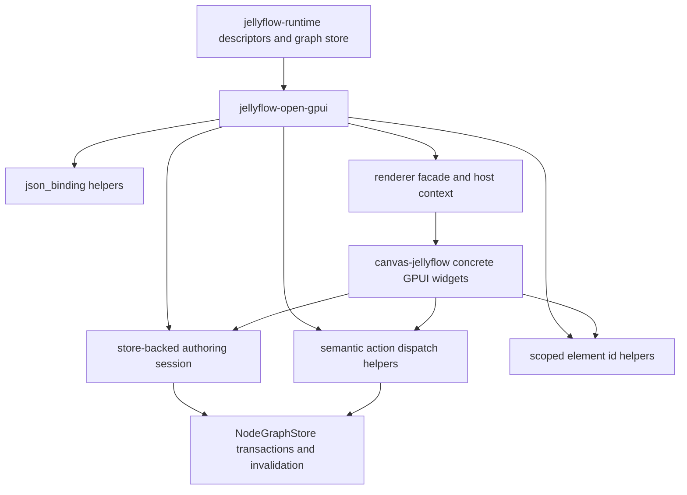
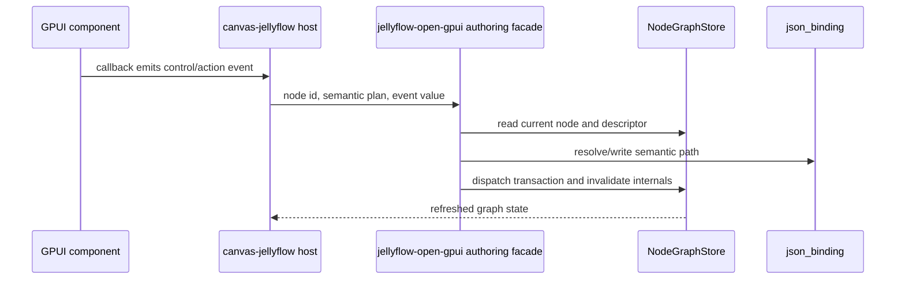

# Open GPUI Authoring Facade Cleanup - Plan

## Goal Capsule

| Field | Value |
| --- | --- |
| Objective | Deepen `jellyflow-open-gpui` from a set of render/action planners into a cleaner adapter authoring facade by moving reusable JSON binding, live-store authoring, semantic action mapping, scoped element ids, and renderer host context contracts out of `canvas-jellyflow` where they are not truly example-specific. |
| Target repos | Jellyflow root and `repo-ref/open-gpui`. Paths are repo-relative to the Jellyflow root. |
| Source authority | ADR 0008, ADR 0009, Node UI Kit Component Contract, Open GPUI Productized Authoring plan, current `jellyflow-open-gpui` modules, and the `repo-ref/open-gpui/examples/canvas-jellyflow` host fixture. |
| Execution profile | Standard cross-repo refactor. Breaking adapter API changes are acceptable because `jellyflow-open-gpui` is still maturing and `canvas-jellyflow` is the only mature Open GPUI consumer. |
| Stop condition | The Open GPUI example keeps owning concrete widgets and demo UX, while reusable binding, dispatch, repeatable action planning, renderer context resolution, and stable id generation live in `jellyflow-open-gpui` with regression tests. |
| Explicit non-goal | Do not add a shared widget crate, change runtime to own GPUI widgets, expand Dioxus/egui, build a backend executor, or introduce product-grade color/asset/variable/code editor widgets in this refactor. |

---

## Product Contract

### Summary

The previous Open GPUI productized authoring stage proved that Dify-style controls, shader repeatables, ERD rows, dropped-wire insert, inspector panels, and minimal blackboard actions can work through semantic Jellyflow contracts.
That success left a new shape problem: `canvas-jellyflow` now contains reusable authoring glue that belongs in the adapter crate, while `jellyflow-open-gpui` still has duplicated JSON binding helpers across controls, repeatables, and inspectors.

This plan narrows the next stage to cleanup that improves the authoring API without broadening product scope.
The adapter crate should provide the headless-to-GPUI authoring facade that a real Open GPUI app can depend on.
The example should remain a host and smoke fixture: concrete component tree, focus/popup behavior, demo item factories, and visual polish.

### Problem Frame

Jellyflow wants to be the Rust-native equivalent of XyFlow for node graph authoring while preserving a headless semantic core.
For Open GPUI, that means users should be able to register local node renderers and wire local component events without copying internal helper code from `examples/canvas-jellyflow/src/main.rs`.

The current implementation already respects the runtime boundary, but the API shape is still uneven.
`controls.rs`, `repeatable.rs`, and `inspector.rs` each carry private JSON lookup and write helpers.
The example owns live-store planning, semantic action-to-repeatable mapping, scoped element id generation, and renderer host wiring.
Those pieces are not widget rendering; they are adapter authoring infrastructure.

### Requirements

**Adapter boundary**

- R1. Keep `jellyflow-core`, `jellyflow-layout`, and `jellyflow-runtime` free of Open GPUI, widget, focus, popup, and event-loop types.
- R2. Keep `jellyflow-open-gpui` adapter-specific rather than a shared widget crate.
- R3. Move reusable authoring glue into `jellyflow-open-gpui`; leave concrete GPUI element construction and app state in `canvas-jellyflow`.

**Binding and mutation**

- R4. Replace duplicated semantic JSON lookup, dot-path write, JSON pointer write, path join, scalar-id, and repeatable item lookup helpers with one adapter-local binding module.
- R5. Preserve existing binding semantics: `DataPath`, `Slot`, field-row `fields.*` fallback, `JsonPointer`, array indexes, object traversal, and non-writable `GraphSymbol` / `PortAnchor` behavior.
- R6. Live-store control planning must always read the current `NodeGraphStore` node at dispatch time so quick consecutive edits cannot overwrite each other with stale snapshots.

**Semantic action dispatch**

- R7. Adapter helpers must map semantic repeatable action intents to repeatable edit plans using current node data and descriptor metadata.
- R8. Unsupported semantic actions must remain explicit skipped outcomes with reasons rather than enabled no-ops or host-only log messages.
- R9. Repeatable add should support adapter-derived minimal items where descriptor metadata is sufficient, while allowing the host to supply product-specific demo item factories.

**Renderer facade and host context**

- R10. `OpenGpuiNodeRendererRegistry` should expose a practical host-context facade for custom renderers that need semantic context plus host-owned dispatch and measurement plumbing.
- R11. Renderer facade APIs must not expose GPUI element types from runtime or require `jellyflow-runtime` to know about local components.
- R12. Stable element ids for controls, actions, menus, repeatable rows, blackboard entries, and fallback chrome should be reusable adapter-local helpers so multiple same-kind nodes do not collide.

**Regression and docs**

- R13. Existing productized authoring behavior must continue to pass for Dify workflow, shader/blueprint, ERD, and mind-map fixtures.
- R14. Tests must prove the example consumes the new facade instead of reimplementing reusable binding/action/id rules.
- R15. Documentation and engineering memory must describe which helpers moved into `jellyflow-open-gpui` and which responsibilities remain in the Open GPUI host.

### Acceptance Examples

- AE1. Given two fast edits to different controls on the same Dify-style node, when the second edit is planned, then it reads the current store data and preserves the first edit.
- AE2. Given a repeatable inspector or blackboard add action, when the action is selected, then adapter helpers produce a repeatable edit plan or an explicit skipped reason; the example does not own the generic action-intent mapping.
- AE3. Given two nodes of the same kind, when each renders `control.prompt` or the same action menu, then generated element ids differ by node and surface scope.
- AE4. Given controls, repeatable rows, and inspector targets use dot paths or JSON pointers, when they read or write data, then all paths go through the same adapter-local binding rules.
- AE5. Given a custom Open GPUI renderer, when the host resolves it, then the renderer receives descriptor-derived slots, repeatables, actions, measurement ids, and host dispatch handles without runtime importing GPUI widgets.

### Scope Boundaries

#### In Scope

- Adapter-local JSON binding module inside `crates/jellyflow-open-gpui`.
- Store-backed authoring helpers that plan from current `NodeGraphStore` data.
- Semantic action-to-repeatable planning helpers and explicit skipped outcomes.
- Adapter-local element id helpers for host GPUI components.
- Renderer registry/facade cleanup that gives host renderers richer context without introducing toolkit types into runtime.
- Refactoring `repo-ref/open-gpui/examples/canvas-jellyflow` to consume the new adapter helpers.
- Focused regression gates for the authoring behavior that moved.

#### Deferred to Follow-Up Work

- Object-backed repeatable mutation beyond lookup and inspector targeting if it expands the current refactor too far.
- Product-grade color picker, asset picker, variable picker, code editor, and multiselect widgets.
- Advanced blackboard drag/drop and variable scoping.
- Broad Dioxus/egui adapter parity work.
- Pixel-golden visual infrastructure.

#### Outside This Product's Identity

- A shared `jellyflow-ui-widgets` crate.
- Runtime-owned GPUI widgets, popup state, focus state, or retained component lifecycle.
- Backend Dify workflow execution, shader compilation, database migrations, or collaboration services.

---

## Planning Contract

### Key Technical Decisions

- KTD1. Binding cleanup stays adapter-local. `jellyflow-open-gpui` may share JSON binding helpers across its modules, but runtime should continue to expose only semantic descriptors and graph transactions.
- KTD2. The live-store authoring facade should plan from `NodeGraphStore` at dispatch time. Host callbacks should carry stable ids, plans, and event values; they should not capture full node-data snapshots for later mutation.
- KTD3. Repeatable action mapping belongs in the adapter, while item creation defaults can be host-provided. The adapter can derive safe fallback item ids and sparse object values from descriptor metadata, but Dify/demo-specific placeholder content remains a host policy.
- KTD4. Renderer facade should pass host services through generic structs or traits that contain no GPUI element type. Host-owned callbacks, weak entities, and measured-element wrappers stay in the example or Open GPUI app.
- KTD5. Element id helpers are adapter-local strings, not runtime identity. Runtime owns node ids, slot keys, control keys, action keys, and repeatable item ids; the adapter combines them into collision-resistant local component ids.
- KTD6. Object-backed repeatables are not the primary mutation target in this cleanup. Shared binding helpers may make future object mutation easier, but array-backed add/remove/reorder/edit remains the required authoring path for this plan.

### High-Level Technical Design





### Output Structure

```text
crates/jellyflow-open-gpui/src/
  json_binding.rs
  authoring.rs
  actions.rs
  controls.rs
  inspector.rs
  renderer.rs
  repeatable.rs
  element_ids.rs
  lib.rs
repo-ref/open-gpui/examples/canvas-jellyflow/src/main.rs
```

### Assumptions

- `repo-ref/open-gpui/examples/canvas-jellyflow` remains the only mature Open GPUI consumer during this refactor.
- Breaking changes inside `jellyflow-open-gpui` are acceptable when they reduce duplicated host logic and preserve the public headless boundary.
- The refactor should prefer structured tests over visual screenshots; a launch smoke remains useful but not sufficient.

---

## Implementation Units

### U1. Add Adapter-Local JSON Binding Helpers

- **Goal:** Create one `jellyflow-open-gpui` binding module for semantic JSON lookup, dot-path writes, JSON pointer writes, field-row slot fallback, path joining, scalar item ids, and repeatable item lookup.
- **Requirements:** R1, R2, R4, R5, AE4.
- **Dependencies:** None.
- **Files:** `crates/jellyflow-open-gpui/src/json_binding.rs`, `crates/jellyflow-open-gpui/src/controls.rs`, `crates/jellyflow-open-gpui/src/repeatable.rs`, `crates/jellyflow-open-gpui/src/inspector.rs`, `crates/jellyflow-open-gpui/src/lib.rs`.
- **Approach:** Extract the duplicated private helpers from controls, repeatables, and inspector into a module that exposes small semantic operations rather than raw string manipulation everywhere. Keep error wording precise enough for tests and host diagnostics. Do not move these helpers to runtime unless another adapter proves the same write behavior needs to be shared.
- **Patterns to follow:** Current `plan_control_edit` and `plan_repeatable_action` behavior in `crates/jellyflow-open-gpui/src/controls.rs` and `crates/jellyflow-open-gpui/src/repeatable.rs`.
- **Test scenarios:** 
  - Dot-path lookup and write preserve nested object creation, array index behavior, empty-path root replacement, and scalar traversal errors.
  - JSON pointer lookup and write decode `~0` / `~1`, reject missing leading `/`, and preserve the existing empty-pointer root replacement behavior.
  - Field-row `Slot` binding resolves through `fields.<key>` for node controls and through item data for repeatable controls.
  - Repeatable item id lookup returns stable string/number/bool ids and rejects invalid ids with the same public error family as before.
- **Verification:** Existing control, repeatable, inspector, and product fixture tests pass with duplicated helper implementations removed from those modules.

### U2. Add Store-Backed Authoring Session Helpers

- **Goal:** Move live-store control planning and dispatch-shaped outcomes from `canvas-jellyflow` into `jellyflow-open-gpui` so hosts do not capture stale node-data snapshots.
- **Requirements:** R3, R6, R8, AE1.
- **Dependencies:** U1.
- **Files:** `crates/jellyflow-open-gpui/src/authoring.rs`, `crates/jellyflow-open-gpui/src/lib.rs`, `repo-ref/open-gpui/examples/canvas-jellyflow/src/main.rs`.
- **Approach:** Add an adapter helper that accepts a `NodeGraphStore`, `NodeRegistry`, `NodeId`, semantic control plan, and typed event value, then resolves the current node and returns a planned edit or explicit skip. Keep actual `cx.notify()`, local refresh, and GPUI lifecycle in the host. Model missing node, missing descriptor, disabled/read-only/stub/no-binding, unchanged values, and unsupported actions as structured outcomes.
- **Execution note:** Start with the existing stale-snapshot regression in the example, then move it or duplicate it into `jellyflow-open-gpui` before replacing example code.
- **Patterns to follow:** `OpenGpuiAuthoringController` in `crates/jellyflow-open-gpui/src/authoring.rs`; `plan_control_authoring_event_from_store` in `repo-ref/open-gpui/examples/canvas-jellyflow/src/main.rs`.
- **Test scenarios:** 
  - Two consecutive control edits on the same node preserve both changes because the second edit reads the current store.
  - Missing node and missing descriptor return explicit skipped/error outcomes without mutating the store.
  - Disabled, read-only, stub, and unsupported controls do not dispatch transactions.
  - Select events still write descriptor option values rather than labels.
- **Verification:** `canvas-jellyflow` no longer defines its own generic `plan_control_authoring_event_from_store` helper, and the adapter crate owns the live-store planning test.

### U3. Productize Semantic Action and Repeatable Dispatch Helpers

- **Goal:** Move generic semantic action-to-repeatable mapping into `jellyflow-open-gpui` while leaving demo-specific add-item content to a host-supplied factory.
- **Requirements:** R3, R7, R8, R9, AE2.
- **Dependencies:** U1, U2.
- **Files:** `crates/jellyflow-open-gpui/src/actions.rs`, `crates/jellyflow-open-gpui/src/repeatable.rs`, `crates/jellyflow-open-gpui/src/authoring.rs`, `crates/jellyflow-open-gpui/src/lib.rs`, `repo-ref/open-gpui/examples/canvas-jellyflow/src/main.rs`.
- **Approach:** Introduce an adapter-level dispatch planner for `ActionIntent::AddRepeatableItem`, `RemoveRepeatableItem`, and `ReorderRepeatableItem`. The planner should read current item counts and descriptor constraints, request a host item from a small factory callback when adding, and produce `OpenGpuiRepeatableActionPlan` or an explicit skip/error for unsupported intents. Preserve dropped-wire insert as its own already-specialized path.
- **Patterns to follow:** `repeatable_action_plan_from_dispatch` and `apply_repeatable_action_to_store` in `repo-ref/open-gpui/examples/canvas-jellyflow/src/main.rs`; `OpenGpuiAuthoringOutcome` skip semantics in `crates/jellyflow-open-gpui/src/authoring.rs`.
- **Test scenarios:** 
  - Blackboard `AddRepeatableItem` for `shader.properties` maps to a repeatable add plan and mutates node data through `plan_repeatable_action`.
  - Repeatable remove intent maps by item id and does not use row index as identity.
  - Reorder intent without a target index returns an explicit skipped outcome rather than an enabled no-op.
  - Unsupported `RunNode`, `OpenInspector`, `OpenBlackboard`, and custom intents remain skipped unless a host executor handles them.
  - Host item factory is called for add actions and can supply Dify/shader/ERD-specific defaults.
- **Verification:** `canvas-jellyflow` no longer owns generic repeatable action mapping, but still owns its demo item factory and UI refresh.

### U4. Deepen Renderer Facade and Scoped Element Id API

- **Goal:** Make custom Open GPUI node renderers easier to integrate by providing reusable host context and scoped id helpers without exposing widget types upstream.
- **Requirements:** R10, R11, R12, AE3, AE5.
- **Dependencies:** U2, U3.
- **Files:** `crates/jellyflow-open-gpui/src/renderer.rs`, `crates/jellyflow-open-gpui/src/element_ids.rs`, `crates/jellyflow-open-gpui/src/lib.rs`, `repo-ref/open-gpui/examples/canvas-jellyflow/src/main.rs`.
- **Approach:** Replace or extend the current thin `render_with` helper with a facade that resolves renderer registration, fallback reason, semantic context, measurement ids, and host-provided services. Add adapter-local id builders for controls, action buttons, action menus, slot badges/values, repeatable rows/actions, blackboard rows/status, and fallback chrome. Keep the return type generic so the crate does not depend on GPUI element types.
- **Patterns to follow:** `OpenGpuiNodeRendererContext` in `crates/jellyflow-open-gpui/src/renderer.rs`; id helpers currently local to `repo-ref/open-gpui/examples/canvas-jellyflow/src/main.rs`.
- **Test scenarios:** 
  - Registered renderer receives semantic slots, repeatables, action menus, toolbar menu, measurement ids, and host service markers.
  - Missing host renderer produces fallback output with `MissingHostRenderer`; unregistered key produces `UnregisteredRenderer`.
  - Element id builders differ for two nodes with the same control/action/repeatable keys and use a graph scope for graph-level actions.
  - Renderer facade does not introduce Open GPUI widget or element types into runtime/core/layout public surfaces.
- **Verification:** Example custom renderers use the facade/id helpers instead of duplicating registration and id construction logic.

### U5. Slim `canvas-jellyflow` and Refresh Regression Documentation

- **Goal:** Refactor the Open GPUI example to consume the new adapter facade and update docs/memory so future work starts from the new ownership split.
- **Requirements:** R13, R14, R15, AE1, AE2, AE3, AE5.
- **Dependencies:** U1, U2, U3, U4.
- **Files:** `repo-ref/open-gpui/examples/canvas-jellyflow/src/main.rs`, `crates/jellyflow-open-gpui/README.md`, `docs/testing/node-ui-authoring-regression.md`, `docs/knowledge/engineering/current-state.md`, `docs/knowledge/engineering/log.md`.
- **Approach:** Remove generic helper code from the example after adapter equivalents exist. Keep concrete `Button`, `Menu`, `TextInput`, `Textarea`, `Select`, `Switch`, `Slider`, `measured_element`, local refresh, focus arbitration, and demo visual layout in the example. Update documentation to say the adapter owns binding/authoring/semantic dispatch/id helpers, while the host owns widgets and local state.
- **Patterns to follow:** The current documentation split in `crates/jellyflow-open-gpui/README.md` and the memory update style in `docs/knowledge/engineering/log.md`.
- **Test scenarios:** 
  - Existing `canvas-jellyflow` tests for live controls, disabled controls, blackboard actions, repeatable actions, custom renderer routing, dropped-wire insert, measured handles, inspector bounds, and product fixture gates still pass.
  - A search or test confirms the example does not define generic JSON binding, live-store control planning, repeatable action mapping, or scoped element id helpers after the move.
  - Documentation names remaining non-productized widget gaps without implying a shared widget crate.
- **Verification:** Final diff shows thinner example-owned glue, updated adapter docs, and no plan-progress edits written into this plan file.

---

## Verification Contract

Run focused checks as units land, then run the final gate before marking the plan complete.

```bash
cargo fmt --all -- --check
cargo fmt --manifest-path repo-ref/open-gpui/examples/canvas-jellyflow/Cargo.toml -- --check
git diff --check
git -C repo-ref/open-gpui diff --check
cargo nextest run -p jellyflow-open-gpui --no-fail-fast
cargo nextest run -p jellyflow-runtime -p jellyflow-egui -p jellyflow-proof --lib --no-fail-fast
cargo test -p jellyflow-runtime --test public_surface -- --nocapture
cargo test -p jellyflow-proof --test proof -- --nocapture
cargo test --manifest-path templates/headless-adapter/Cargo.toml
cargo check -p jellyflow-egui --examples
cargo test --manifest-path repo-ref/open-gpui/crates/gpui/Cargo.toml measured_element_reports_nested_layout_pass_bounds -- --nocapture
cargo check --manifest-path repo-ref/open-gpui/examples/canvas-jellyflow/Cargo.toml
cargo test --manifest-path repo-ref/open-gpui/examples/canvas-jellyflow/Cargo.toml --bin open-gpui-canvas-jellyflow -- --nocapture
```

When GUI launch is available:

```bash
cargo run --manifest-path repo-ref/open-gpui/examples/canvas-jellyflow/Cargo.toml
```

Interrupt the launch smoke after confirming the native example reaches the running binary and the window starts.
Existing Open GPUI macOS `check-cfg` and `unused_unsafe` warnings remain out of scope unless touched files introduce new failures.

### Review Gates

- Confirm `jellyflow-runtime`, `jellyflow-core`, and `jellyflow-layout` do not depend on `open_gpui`, `open_gpui_ui_components`, or `jellyflow-open-gpui`.
- Confirm reusable JSON binding and semantic authoring helpers live in `jellyflow-open-gpui`, not in `canvas-jellyflow`.
- Confirm `canvas-jellyflow` still owns concrete GPUI widgets, focus/popup state, local refresh, and demo item factories.
- Confirm live-store helpers read current store state rather than captured node-data snapshots.
- Confirm unsupported semantic actions surface skipped outcomes rather than enabled no-ops.
- Confirm renderer facade APIs remain generic over host output and do not expose GPUI element types to runtime/core/layout.

---

## Definition of Done

- `jellyflow-open-gpui` has one adapter-local JSON binding module used by controls, repeatables, and inspector code.
- Live control authoring can be planned from current `NodeGraphStore` state without stale snapshot overwrite risk.
- Semantic repeatable action mapping is reusable from the adapter crate and keeps host add-item defaults pluggable.
- Scoped element id helpers live in the adapter crate and prevent same-kind node collisions.
- Custom renderer facade gives host renderers semantic context, measurement ids, action/control planning entry points, and generic host service hooks without exposing GPUI widget types upstream.
- `canvas-jellyflow` consumes the new helpers and keeps only concrete widget rendering, focus/event arbitration, local state refresh, and demo fixture policy.
- Productized authoring behavior for Dify workflow, shader/blueprint, ERD, and mind-map fixtures remains covered by structured tests.
- Runtime/core/layout remain toolkit-free and no shared widget crate is introduced.
- Documentation and engineering memory capture the refined Open GPUI adapter ownership split.
- Final verification contract passes, aside from explicitly noted pre-existing Open GPUI warnings or unavailable GUI smoke.

---

## Implementation-Time Unknowns

- The exact public names for the JSON binding and authoring-session helpers should be chosen during implementation to fit current module naming.
- The renderer facade may be a new host-context type or a breaking replacement for `render_with`; either is acceptable if the example becomes thinner and tests cover fallback behavior.
- Descriptor-derived repeatable add items may be too sparse for real product demos. If so, keep adapter defaults minimal and require a host factory for rich demo content.
- Object-backed repeatable mutation should be added only if it falls out naturally from shared binding cleanup; otherwise leave it as a follow-up.
