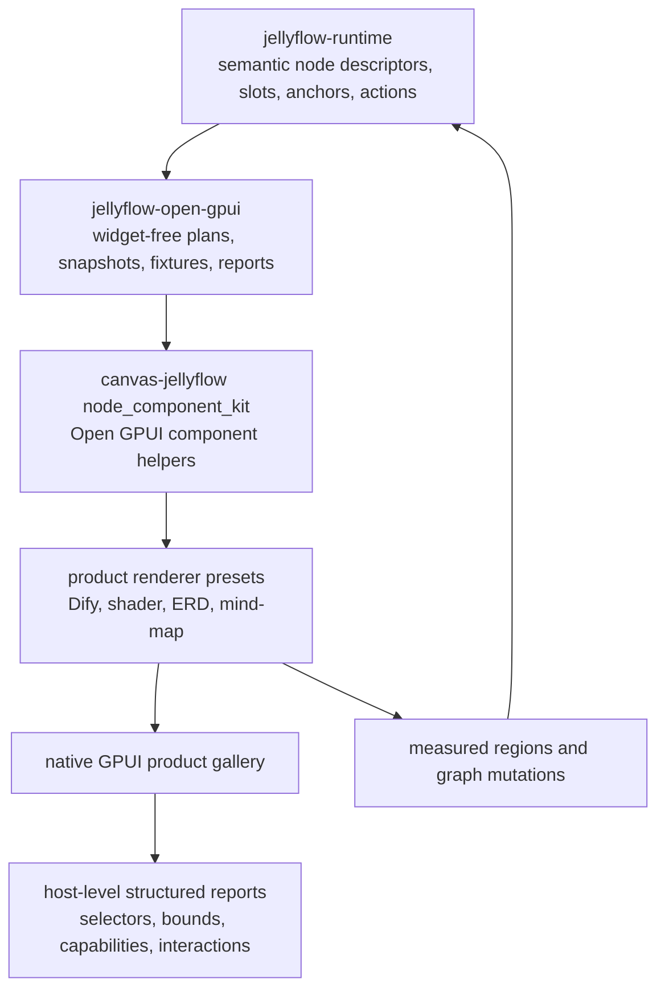
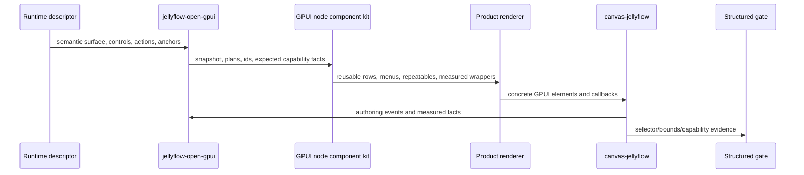

# Open GPUI Node Component Kit and Product Gallery - Plan

## Goal Capsule

| Field | Value |
| --- | --- |
| Objective | Make Open GPUI the first mature Jellyflow adapter surface for reusable node-internal component presets, product-shaped custom renderers, and structured visual regression across Dify-style workflow, shader graph, ERD, and mind-map nodes. |
| Target repos | Jellyflow root and `repo-ref/open-gpui`. Paths are repo-relative to the Jellyflow root. |
| Source authority | ADR 0008, ADR 0009, Node UI Kit Component Contract, Open GPUI Productized Authoring plan, Open GPUI Authoring Facade Cleanup plan, current `jellyflow-open-gpui` modules, `repo-ref/open-gpui/examples/canvas-jellyflow`, and the local Open GPUI `ui_components` gallery/test APIs. |
| Execution profile | Deep cross-repo feature/refactor. Breaking Open GPUI adapter/example APIs are acceptable while the adapter is still maturing; runtime/headless contracts must remain stable unless compatibility requires a narrow change. |
| Stop condition | A user can inspect native GPUI gallery cases for Dify, shader, ERD, and mind-map shapes; implement a custom node renderer from a minimal recipe; reuse host-local component presets for controls, actions, repeatables, inspector rows, measured regions, and fallback chrome; and run structured gates proving host-level layout/measurement evidence. |
| Explicit non-goal | Do not add a shared widget crate, put GPUI widgets in runtime, expand egui/Dioxus, build Dify backend execution, compile shaders, add database semantics, implement collaboration, or make pixel-golden screenshots the only hard gate. |

---

## Product Contract

### Summary

The previous Open GPUI work created the adapter authoring facade: binding, live-store edit planning, semantic repeatable actions, renderer host context, scoped ids, and ownership docs now sit on the correct side of the boundary.
That is the right foundation, but it still leaves the product authoring experience under-shaped.
`canvas-jellyflow` can prove controls and custom renderers exist, yet a user mostly sees one rich decision card plus fallback semantic surfaces.
There is not yet a reusable Open GPUI node component kit, a clear custom-node recipe, or a gallery that makes Dify/shader/ERD/mind-map capabilities visible and regression-testable.

This plan turns Open GPUI from a projection/authoring proof into the first mature Jellyflow adapter experience.
The runtime remains headless and semantic.
The adapter crate continues to own widget-free renderer plans, authoring outcomes, capability/testing reports, and measurement semantics.
The Open GPUI host owns concrete components, layout composition, focus, popup state, and product gallery UX.

### Problem Frame

Jellyflow's target is not only to draw nodes and edges.
It needs to let Rust applications build node graphs where each node can contain meaningful native UI: Dify workflow config cards, Unreal/Unity-style shader parameters and dynamic inputs, ERD table rows, and MarginNote-like knowledge canvas topics.

The core design direction is still correct: headless semantic surfaces plus adapter-local mapping.
The missing piece is a practical Open GPUI layer that makes the semantic contract convenient to consume.
Today, each serious custom node renderer must know too much about control rendering, repeatable row composition, action menus, measured regions, event shielding, fallback behavior, and gallery fixture setup.
That friction is the current gap between "we have the contracts" and "this feels like Rust's XyFlow for custom node UIs".

### Requirements

**Boundary and ownership**

- R1. Keep `jellyflow-core`, `jellyflow-layout`, and `jellyflow-runtime` free of Open GPUI, widget, focus, popup, event-loop, and component lifecycle types.
- R2. Keep `jellyflow-open-gpui` adapter-specific and mostly widget-free. It may expose semantic snapshots, plans, capability facts, testing fixtures, renderer metadata, and host-service contracts, but it must not become a shared widget crate.
- R3. Define "Open GPUI node component kit" as adapter/host-local component presets and renderer helpers, not as a new runtime `NodeKitManifest` concept and not as a cross-framework widget package.
- R4. Preserve the established `slot` versus `anchor` split: `slot` resolves semantic data; `anchor` binds layout, ports, handles, measurement targets, and hit geometry.

**Authoring ergonomics**

- R5. Provide a minimal custom-node recipe that starts from runtime node schema/renderer metadata, registers a host renderer, uses component-kit primitives, and participates in measurement and authoring dispatch.
- R6. Extract reusable host-local GPUI component helpers for control rows, action/menu buttons, repeatable item rows, measured regions, inspector targets, blackboard entries, fallback chrome, and event shielding.
- R7. Renderer registration should be easier than manually building low-level `BTreeMap<String, Box<dyn Fn(...)>>` entries for every product node.
- R8. Fallback behavior must remain explicit: unknown renderer keys, unsupported controls, disabled actions, and missing measured regions render honest unavailable/fallback states and report capability facts.

**Product gallery**

- R9. Add product-shaped native GPUI gallery fixtures for Dify-style workflow, shader graph/material graph, ERD/table editing, and mind-map/knowledge-canvas nodes.
- R10. The gallery must show more than a progress bar or one custom card. It should visibly exercise text, textarea, number, select, switch, slider, progress/status, action menus, repeatable rows, measured handles, inspector/edit affordances, and fallback states where those contracts exist.
- R11. Advanced controls that are not productized in this stage, such as code editor, color picker, asset picker, variable picker, port-binding picker, and multiselect, must render as documented partial/stub states rather than pretending to be complete.
- R12. Low-density shell/preview behavior is a gallery/review state, not a new runtime density enum. Runtime density remains the current compact/regular/full contract unless a separate contract change is approved.

**Repeatables and dynamic ports**

- R13. Repeatable rows must demonstrate add, remove, reorder, edit, disabled, invalid, and missing-port states for product fixtures where relevant.
- R14. Dynamic port lifecycle must be explicit. Adding a repeatable item either creates/updates graph port facts through a host/runtime policy or reports a missing-port diagnostic; the renderer must not publish fake fresh handles.
- R15. Reorder and removal must preserve item identity semantics and keep measured anchors, hover targets, inspector targets, and incident edge behavior honest.

**Visual regression and testability**

- R16. Add host-level structured reports proving that the real `canvas-jellyflow` Open GPUI host rendered product fixtures through the intended renderer/component-kit path.
- R17. Hard gates should use structured geometry, semantic capability, selector/debug-bounds, and interaction reports before pixel-golden screenshots.
- R18. Optional screenshots may be exported as review aids and smoke-tested for nonblank dimensions/basic histogram properties, but they are not the primary correctness oracle.
- R19. Tests must catch the classes of regressions users already noticed: content only appearing on selection, node-internal content overflowing the node body, controls overlapping handles, and handle/edge geometry not following edited repeatable rows.

**Documentation**

- R20. Update Open GPUI docs with the custom-node recipe, component-kit ownership, gallery commands, expected limitations, and verification commands.
- R21. Update engineering memory so future work starts from "Open GPUI component kit and gallery" rather than re-litigating widget-crate or cross-framework expansion decisions.

### Acceptance Examples

- AE1. Given a new product renderer key, when an Open GPUI app follows the documented recipe, then it can register a renderer, render semantic controls/repeatables/actions through component-kit helpers, dispatch edits, and report measurement ids without runtime importing GPUI widgets.
- AE2. Given the Dify workflow gallery fixture, when it is launched, then the user can see and interact with prompt/model/temperature-style controls, action menus, status/progress, dropped-wire or inspector affordances where available, and fallback states for unavailable advanced controls.
- AE3. Given the shader/material gallery fixture, when a dynamic input row is added, removed, reordered, or marked invalid, then row identity, handles, measured anchors, and diagnostics update or downgrade through explicit facts.
- AE4. Given the ERD/table gallery fixture, when field rows are edited or resized, then the table body remains clipped within the node, handle regions stay aligned with visible rows, and stale row anchors do not remain fresh.
- AE5. Given the mind-map/knowledge-canvas gallery fixture, when low-zoom shell/preview state is used, then content degrades into an honest preview without reporting hidden controls as full interactive hit regions.
- AE6. Given a renderer key is missing or a control kind is unsupported, when the gallery renders the node, then fallback chrome shows an explicit reason and structured reports mark the unsupported capability.
- AE7. Given the host-level visual report is run, when a fixture accidentally falls back to generic descriptor rendering instead of its product renderer, then the report fails with a named product-case failure.
- AE8. Given optional gallery screenshot export is enabled, when screenshots are generated, then they are nonblank and placed under a target directory for review; pixel drift alone does not fail the structured gate.

### Scope Boundaries

#### In Scope

- Open GPUI as the only mature adapter target for this stage.
- Host-local node component kit helpers for the Open GPUI example and future Open GPUI apps.
- Widget-free adapter snapshot/report/test helpers in `jellyflow-open-gpui`.
- Product gallery fixtures and renderers for Dify workflow, shader/material graph, ERD/table, and mind-map/knowledge-canvas shapes.
- Structured visual/geometry/interaction reports that exercise the real `canvas-jellyflow` host path.
- Optional non-golden screenshot smoke/export support.
- Docs and engineering memory updates.

#### Deferred to Follow-Up Work

- A public standalone Open GPUI component-kit crate, unless the host-local module stabilizes and a later plan promotes it.
- Product-grade code editor, color picker, asset picker, variable picker, port-binding picker, and multiselect widgets.
- Full pixel-golden visual regression infrastructure.
- Mature egui and Dioxus component-kit parity.
- Advanced blackboard drag/drop, variable scoping, and rich symbol management.
- Real workflow execution, shader compilation, persistence/database behavior, and collaboration.

#### Outside This Product's Identity

- Runtime-owned widgets or retained UI lifecycle.
- A shared `jellyflow-ui-widgets` crate.
- A DOM/React adapter.
- A backend Dify clone.
- Replacing the local Open GPUI component library with Jellyflow-owned primitives.

---

## Planning Contract

### Key Technical Decisions

- KTD1. Start the Open GPUI node component kit as a host-local module inside `repo-ref/open-gpui/examples/canvas-jellyflow/src/`. This keeps concrete GPUI element types out of `jellyflow-open-gpui` while still proving the ergonomics in a real app.
- KTD2. Add widget-free snapshot/report/catalog types to `jellyflow-open-gpui` only when they can be reused by any Open GPUI host without depending on GPUI element construction.
- KTD3. Product renderers are renderer presets, not runtime schema. Runtime can expose renderer keys and semantic descriptors; Open GPUI decides how to render those keys.
- KTD4. The product fixture catalog should be semantic first. Fixture ids, product families, expected capabilities, and measurement expectations can live in `jellyflow-open-gpui` test helpers; concrete gallery controls and screens stay in `canvas-jellyflow`.
- KTD5. Use Open GPUI's existing `ui_components` and `ui_core` exports before modifying the fork. Changes to `repo-ref/open-gpui/crates/ui_components` should be reserved for proven gaps in selectors, event shielding, or component APIs.
- KTD6. Structured visual regression comes before pixel goldens. Selector/debug-bounds, semantic capability facts, measured region coverage, and interaction reports are hard gates; screenshots are supportive artifacts.
- KTD7. Dynamic ports remain policy-driven. Repeatable UI can surface "missing graph port" diagnostics unless a fixture explicitly creates or updates graph port facts through the existing graph model.
- KTD8. Measurement revision and dirty-region semantics must remain honest. Component-kit helpers should make measured regions easier to use, not bypass layout-pass measurement or report invisible full hit regions.
- KTD9. The gallery can introduce shell/preview visual states locally, but it must not add or imply a new runtime density enum in this plan.
- KTD10. Keep breaking changes narrow and justified. Removing duplicate example code is welcome; changing runtime public API requires a compatibility reason that benefits more than Open GPUI.

### High-Level Technical Design





### Output Structure

```text
crates/jellyflow-open-gpui/src/
  lib.rs
  testing.rs
  renderer.rs
  controls.rs
  repeatable.rs
  inspector.rs
  # optional if useful
  gallery.rs

repo-ref/open-gpui/examples/canvas-jellyflow/src/
  main.rs
  node_component_kit.rs
  product_gallery.rs
  product_renderers.rs
  visual_regression.rs
  # optional if screenshot smoke is implemented
  gallery_screenshot.rs
```

### Assumptions

- A1. `repo-ref/open-gpui/crates/ui_components` exports enough controls for the first component-kit pass: badge/button/listbox/menu/number/progress/select/slider/switch/text input/textarea-style primitives already exist in the local fork.
- A2. The existing Open GPUI test/debug infrastructure can provide enough host-level bounds evidence for structured gates. If not, the implementation should add the smallest Open GPUI test hook needed in the local fork.
- A3. Screenshot export is optional and platform-sensitive. It should not block the core plan if structured gates already prove layout and interaction facts.
- A4. The component kit starts as an example/host module. It can be promoted later after its API survives real product renderers.
- A5. Current runtime density remains compact/regular/full. Shell/preview is a renderer/gallery state.

### Local Evidence

- `crates/jellyflow-open-gpui/src/renderer.rs` already provides renderer registry and host-context concepts, but custom renderer ergonomics are still low-level.
- `crates/jellyflow-open-gpui/src/controls.rs`, `repeatable.rs`, `inspector.rs`, and `testing.rs` already contain the semantic plans and structured gates that the host component kit should reuse.
- `repo-ref/open-gpui/examples/canvas-jellyflow/src/main.rs` currently carries the concrete GPUI rendering path and is the right place to prove host-local component presets.
- `repo-ref/open-gpui/crates/ui_components/src/lib.rs` and `repo-ref/open-gpui/examples/ui-foundation-gallery` confirm the local Open GPUI fork has a component library and gallery/test style to build on.
- `docs/testing/node-ui-authoring-regression.md` already frames structured geometry/capability evidence as hard gates and screenshots as review aids.
- `docs/knowledge/engineering/decisions/node-ui-kit-component-contract.md` locks the semantic boundary: runtime owns descriptors, slots, anchors, actions, and capability vocabulary; adapters own widgets and local mapping.

### Risks and Mitigations

- **Risk:** The component kit drifts into a new framework abstraction.  
  **Mitigation:** Keep it under `repo-ref/open-gpui/examples/canvas-jellyflow/src/` until the API is proven; do not expose it as runtime or cross-framework API in this plan.
- **Risk:** Product gallery looks polished but falls back to generic descriptor rendering.  
  **Mitigation:** Add host-level reports that assert which product renderer path handled each fixture.
- **Risk:** Dynamic repeatable UI creates visual handles that do not exist in graph facts.  
  **Mitigation:** Require explicit missing-port diagnostics or explicit graph-port updates; never publish fake fresh measured anchors.
- **Risk:** Screenshot stability becomes a time sink.  
  **Mitigation:** Treat screenshots as non-golden smoke/export artifacts; keep selector/bounds/capability evidence as the release gate.
- **Risk:** Open GPUI component APIs lack a needed hook.  
  **Mitigation:** First prove the gap in `canvas-jellyflow`; then make the smallest local Open GPUI fork change with tests.

---

## Implementation Units

### U1. Define Product Fixture Catalog and Host Surface Report Contract

- **Goal:** Add semantic product fixture metadata and host-level report contracts so tests can prove product cases are rendered through the intended Open GPUI host path.
- **Requirements:** R2, R8, R9, R16, R17, R19, AE6, AE7.
- **Dependencies:** None.
- **Files:** `crates/jellyflow-open-gpui/src/testing.rs`, `crates/jellyflow-open-gpui/src/lib.rs`, optional `crates/jellyflow-open-gpui/src/gallery.rs`, `repo-ref/open-gpui/examples/canvas-jellyflow/src/main.rs`.
- **Approach:** Add widget-free fixture case ids, product families, expected renderer keys, expected capability groups, and structured report rows. The adapter crate should not import GPUI. The host example should fill the report after rendering real product nodes.
- **Test scenarios:**
  - Dify, shader, ERD, and mind-map cases appear in the catalog with stable ids.
  - Unknown/missing renderer cases produce explicit fallback report rows.
  - The report can distinguish product renderer, generic descriptor fallback, unsupported control, missing measured region, and partial/hidden region.
  - Catalog/report structs remain serializable/debuggable enough for regression output.
- **Verification:** `cargo nextest run -p jellyflow-open-gpui --no-fail-fast`.

### U2. Extract Host-Local Open GPUI Node Component Kit

- **Goal:** Move reusable concrete GPUI node-body helpers out of the monolithic example renderer into a host-local module.
- **Requirements:** R3, R5, R6, R8, R10, R11, R17, AE1, AE2, AE6.
- **Dependencies:** U1.
- **Files:** `repo-ref/open-gpui/examples/canvas-jellyflow/src/main.rs`, `repo-ref/open-gpui/examples/canvas-jellyflow/src/node_component_kit.rs`.
- **Approach:** Create helpers for control rows, select/slider/switch/text inputs, action buttons/menus, repeatable rows, inspector target rows, blackboard rows, fallback chrome, measured wrappers, and pointer/keyboard event shielding. Keep helpers local to the Open GPUI example so GPUI element types do not leak into `jellyflow-open-gpui`.
- **Test scenarios:**
  - Each supported control kind maps to a visible component helper with disabled/read-only/stub styling.
  - Component helpers generate scoped ids through adapter id helpers.
  - Pointer/focus shielding prevents node drag or edge creation from ordinary form interactions.
  - Measured wrappers preserve existing measurement ids and dirty-region behavior.
- **Verification:** `cargo check --manifest-path repo-ref/open-gpui/examples/canvas-jellyflow/Cargo.toml`.

### U3. Add Renderer Presets and Ergonomic Registration

- **Goal:** Provide product renderer presets and a clearer custom renderer registration path for Open GPUI apps.
- **Requirements:** R5, R7, R8, R9, R10, R11, R12, AE1, AE6, AE7.
- **Dependencies:** U2.
- **Files:** `crates/jellyflow-open-gpui/src/renderer.rs`, `repo-ref/open-gpui/examples/canvas-jellyflow/src/product_renderers.rs`, `repo-ref/open-gpui/examples/canvas-jellyflow/src/main.rs`, optional `repo-ref/open-gpui/examples/canvas-jellyflow/src/product_gallery.rs`.
- **Approach:** Keep renderer registration widget-free in the adapter crate, but add a host-side builder or preset map that registers `decision-card`, Dify workflow cards, shader/material cards, ERD table cards, topic/source knowledge cards, and fallback cards through a consistent API.
- **Test scenarios:**
  - Registered product keys resolve to product renderers.
  - Missing keys resolve to fallback renderer with explicit report facts.
  - Product renderers consume component-kit helpers rather than duplicating low-level row/menu/control composition.
  - Documentation can show the minimal recipe without referencing private example internals.
- **Verification:** `cargo nextest run -p jellyflow-open-gpui --no-fail-fast` and `cargo check --manifest-path repo-ref/open-gpui/examples/canvas-jellyflow/Cargo.toml`.

### U4. Build Native GPUI Product Gallery and Fixture Selection

- **Goal:** Make Dify, shader, ERD, and mind-map shapes visible and selectable in the native Open GPUI example.
- **Requirements:** R9, R10, R11, R12, R13, AE2, AE3, AE4, AE5.
- **Dependencies:** U1, U2, U3.
- **Files:** `repo-ref/open-gpui/examples/canvas-jellyflow/src/main.rs`, `repo-ref/open-gpui/examples/canvas-jellyflow/src/product_gallery.rs`, `repo-ref/open-gpui/examples/canvas-jellyflow/src/product_renderers.rs`.
- **Approach:** Add a small gallery selector or launch configuration that can build at least these cases: `workflow.automation`, `workflow.review`, `shader.blueprint`, `shader.material_mix`, `erd.customer_orders`, and `mind-map.strategy`. Keep the default launch useful and visually rich.
- **Test scenarios:**
  - Each fixture builds without panics and exposes expected node kinds/renderers.
  - Gallery selector changes the active fixture without corrupting graph state.
  - Product cases exercise native Open GPUI components rather than only textual fallback previews.
  - Shell/preview state is represented as renderer-local behavior and does not mutate runtime density vocabulary.
- **Verification:** `cargo test --manifest-path repo-ref/open-gpui/examples/canvas-jellyflow/Cargo.toml --bin open-gpui-canvas-jellyflow -- --nocapture`.

### U5. Add Structured Visual and Interaction Regression Gates

- **Goal:** Turn user-visible layout issues into repeatable host-level regression tests.
- **Requirements:** R16, R17, R18, R19, AE3, AE4, AE5, AE7.
- **Dependencies:** U4.
- **Files:** `repo-ref/open-gpui/examples/canvas-jellyflow/src/visual_regression.rs`, `repo-ref/open-gpui/examples/canvas-jellyflow/src/main.rs`, `crates/jellyflow-open-gpui/src/testing.rs`.
- **Approach:** Add host-level reports with selectors/debug bounds proving that product node content is visible when unselected, clipped within node bounds, not overlapping handles, not occluding menu/inspector regions, and using measured bounds after resize or repeatable edits.
- **Test scenarios:**
  - Unselected nodes still render node-internal content.
  - Blue/fixed-size nodes clip or reduce content instead of overflowing.
  - Controls do not overlap source/target handle rails.
  - Repeatable edit/reorder/remove updates or downgrades row anchors and edge endpoints.
  - Invalid hover and dropped-wire menu states remain inside expected bounds.
- **Verification:** `cargo test --manifest-path repo-ref/open-gpui/examples/canvas-jellyflow/Cargo.toml --bin open-gpui-canvas-jellyflow -- --nocapture`.

### U6. Strengthen Dynamic Repeatable and Port Policy in Product Fixtures

- **Goal:** Make dynamic shader inputs, Dify parameter rows, and ERD fields honest about graph ports, handles, and lifecycle.
- **Requirements:** R13, R14, R15, AE3, AE4.
- **Dependencies:** U4, U5.
- **Files:** `crates/jellyflow-open-gpui/src/testing.rs`, `repo-ref/open-gpui/examples/canvas-jellyflow/src/product_renderers.rs`, `repo-ref/open-gpui/examples/canvas-jellyflow/src/product_gallery.rs`, `docs/testing/node-ui-authoring-regression.md`.
- **Approach:** Document and test the host/runtime policy for dynamic ports. Where graph ports are not created by the action, show a missing-port diagnostic and prevent fake handles. Where a fixture does update graph port facts, assert that measured anchors and incident edge behavior follow item ids.
- **Test scenarios:**
  - Add item either creates graph port facts or emits a missing-port diagnostic.
  - Remove item clears or downgrades anchors and incident edge targets.
  - Reorder preserves item ids and measured row identity.
  - Field rows and shader inputs do not reuse stale row bounds after edits.
- **Verification:** `cargo nextest run -p jellyflow-open-gpui --no-fail-fast` plus the `canvas-jellyflow` bin tests.

### U7. Add Optional Screenshot Smoke/Exporter

- **Goal:** Provide reviewable visual artifacts without making pixel goldens the release gate.
- **Requirements:** R18, AE8.
- **Dependencies:** U4, U5.
- **Files:** `repo-ref/open-gpui/examples/canvas-jellyflow/src/gallery_screenshot.rs`, `repo-ref/open-gpui/examples/canvas-jellyflow/src/main.rs`, optional `repo-ref/open-gpui/examples/canvas-jellyflow/Cargo.toml`.
- **Approach:** Add an opt-in command/env path that renders gallery fixtures and writes screenshots under `target/open-gpui-jellyflow-gallery/`. Assert dimensions, nonblank output, and a basic histogram when the platform supports it. Mark platform-sensitive screenshot tests ignored or smoke-only if necessary.
- **Test scenarios:**
  - Screenshot export produces at least one file per product family when enabled.
  - Empty/transparent output fails the smoke check.
  - Structured gates still pass without screenshots.
- **Verification:** Run the exporter manually during implementation and keep automated checks non-flaky.

### U8. Refresh Docs, Recipe, and Engineering Memory

- **Goal:** Make the new component-kit usage understandable to future implementers and users.
- **Requirements:** R20, R21, AE1.
- **Dependencies:** U1 through U7.
- **Files:** `crates/jellyflow-open-gpui/README.md`, `docs/testing/node-ui-authoring-regression.md`, `docs/examples/README.md`, `docs/knowledge/engineering/current-state.md`, `docs/knowledge/engineering/log.md`, optional `docs/knowledge/engineering/decisions/open-gpui-node-component-kit.md`.
- **Approach:** Document the recipe: define runtime schema and renderer key, register host renderer preset, compose controls/repeatables/actions through the Open GPUI node component kit, dispatch edits through adapter authoring helpers, wrap measured regions, and run the gallery/regression checks.
- **Test scenarios:**
  - The documented commands match the actual crate/example paths.
  - Docs clearly say advanced controls are partial/stub if not productized.
  - Engineering memory points to this plan as the next stage after authoring facade cleanup.
- **Verification:** `git diff --check` and a manual docs link/path review.

---

## Verification Contract

Run these before marking implementation complete:

```bash
cargo fmt --all -- --check
cargo fmt --manifest-path repo-ref/open-gpui/examples/canvas-jellyflow/Cargo.toml -- --check
git diff --check
git -C repo-ref/open-gpui diff --check
cargo nextest run -p jellyflow-open-gpui --no-fail-fast
cargo nextest run -p jellyflow-runtime -p jellyflow-egui -p jellyflow-proof --lib --no-fail-fast
cargo test -p jellyflow-runtime --test public_surface -- --nocapture
cargo test -p jellyflow-proof --test proof -- --nocapture
cargo test --manifest-path templates/headless-adapter/Cargo.toml
cargo check -p jellyflow-egui --examples
cargo check --manifest-path repo-ref/open-gpui/examples/canvas-jellyflow/Cargo.toml
cargo test --manifest-path repo-ref/open-gpui/examples/canvas-jellyflow/Cargo.toml --bin open-gpui-canvas-jellyflow -- --nocapture
cargo test --manifest-path repo-ref/open-gpui/crates/gpui/Cargo.toml measured_element_reports_nested_layout_pass_bounds -- --nocapture
```

Also run a short native launch smoke after UI changes:

```bash
cargo run --manifest-path repo-ref/open-gpui/examples/canvas-jellyflow/Cargo.toml
```

If U7 is implemented, run the screenshot exporter once locally and confirm artifacts under `target/open-gpui-jellyflow-gallery/` are nonblank.

---

## Definition of Done

- Open GPUI product gallery contains Dify, shader, ERD, and mind-map cases with visibly distinct node-internal UI.
- Product renderers use the host-local node component kit instead of duplicating control/repeatable/menu/measured-region plumbing.
- A minimal custom renderer recipe is documented and works against the current API.
- Structured reports catch product renderer fallback, content overflow, missing unselected content, handle overlap, stale measured regions, and dynamic repeatable/port honesty issues.
- Runtime/headless crates remain free of GPUI widget dependencies.
- `jellyflow-open-gpui` retains widget-free adapter/test contracts and does not become a shared widget crate.
- Advanced controls that are not complete are explicitly represented as partial/stub states.
- Docs and engineering memory describe the new state and the remaining gaps.
- No unrelated local changes are staged or committed.

---

## Implementation-Time Unknowns

- Whether the local Open GPUI test harness exposes enough debug bounds/selectors for all desired host-level assertions without small fork changes.
- Whether screenshot capture is stable enough on the target macOS/Open GPUI environment to automate beyond smoke checks.
- Whether the host-local component kit should remain example-only after this stage or move into a small Open GPUI-side module in a later plan.
- The exact gallery selection UX: toolbar, side panel, command-line/env fixture selector, or a combination.
- How far to take dynamic graph-port creation in product fixtures versus explicit missing-port diagnostics.
