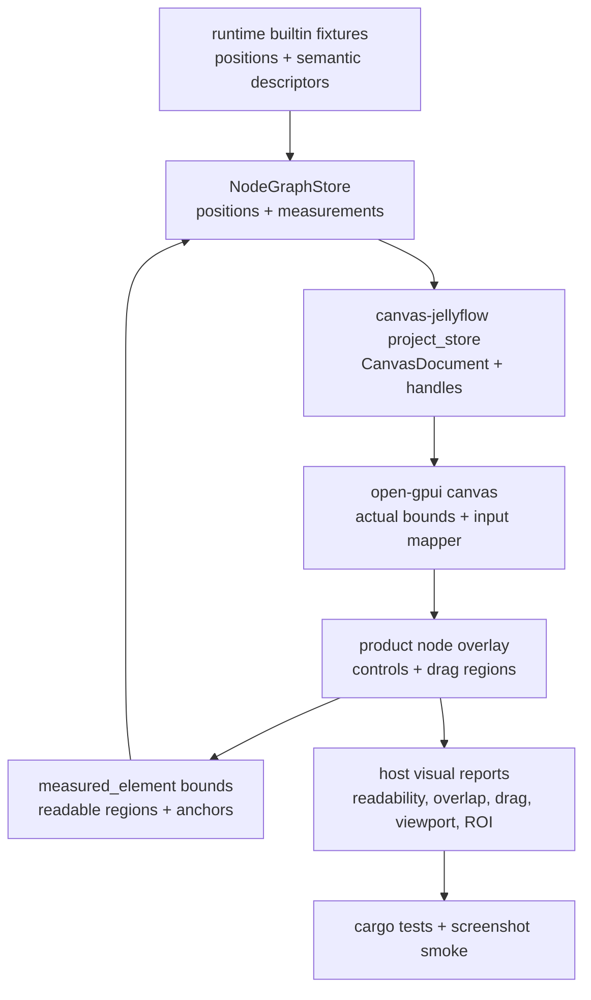

# Open GPUI Product Gallery UX Stabilization - Plan

## Goal Capsule

| Field | Value |
| --- | --- |
| Objective | Stabilize the Open GPUI product gallery so Dify-style workflow, shader graph, ERD, and mind-map nodes are readable, draggable where expected, correctly laid out, and covered by regressions that catch the issues seen in native review. |
| Target repos | Jellyflow root and `repo-ref/open-gpui`. Paths are repo-relative to the Jellyflow root. |
| Source authority | User native review feedback, ADR 0008, ADR 0009, Node UI Kit Component Contract, Open GPUI Node Component Kit decision, `docs/testing/node-ui-authoring-regression.md`, `jellyflow-open-gpui` testing contracts, `repo-ref/open-gpui` canvas/input code, and `canvas-jellyflow` product gallery code. |
| Execution profile | Deep cross-repo fix/refactor. Breaking `canvas-jellyflow` and `jellyflow-open-gpui` adapter/example APIs is acceptable; headless runtime changes are allowed only for semantic fixture/layout facts and must remain toolkit-free. Delete stale example hacks when replaced by stronger contracts. |
| Stop condition | Native Open GPUI gallery review shows readable node-internal UI, no initial mind-map overlap, no top-stuck resize behavior, no box-selection offset, shader nodes draggable from non-control regions, and no unrelated node reset after edits or drags. |
| Explicit non-goal | Do not add a shared widget crate, expand egui/Dioxus parity, build Dify backend execution, compile shaders, add database semantics, or make pixel-perfect screenshots the primary correctness gate. |

---

## Product Contract

### Summary

The previous product gallery work made Open GPUI show native node-internal UI, but user review exposed that the experience is not yet robust: text clips, some fixtures do not adapt node size, marquee selection starts offset from the pointer, shader nodes do not drag from useful regions, ERD rows are too short, and mind-map nodes start overlapped.
This plan keeps the current headless semantic boundary and hardens the Open GPUI adapter/example layer around readable layout, pointer coordinates, drag/event partitioning, deterministic product fixtures, and visual/geometry regression evidence.

### Problem Frame

Jellyflow's stated target is a Rust-native XYFlow-like node library where applications can build Dify, Unreal Blueprint, Unity Shader Graph, ERD, and knowledge-canvas style nodes without pushing widget lifecycles into runtime.
The current Open GPUI proof has the right architectural split, but it still behaves like a proof in several user-visible places.
Structured reports prove that surfaces exist and stay inside nominal node bounds, yet they do not prove that text is readable, rows do not collapse, overlay controls leave drag regions available, or canvas input coordinates match the visible canvas after toolbar/sidebar layout.

### Requirements

**User-visible gallery behavior**

- R1. Product gallery nodes must show readable node-internal UI at default launch and after window resize; critical labels, field names, row values, and action text must not be hidden by fixed row heights.
- R2. Product nodes must either auto-size to their readable minimum or degrade to a documented compact shell; they must not depend on silent clipping as the normal full-density path.
- R3. Mind-map product fixtures must initialize with non-overlapping node positions and a viewport that shows the whole graph with padding.
- R4. Resizing the window must preserve the current graph center after user interaction and must not keep product nodes pinned to the top edge.

**Canvas interaction**

- R5. Marquee selection must start at the canvas-local pointer position even when the canvas is below a toolbar and beside a sidebar.
- R6. Shader graph nodes and other product nodes must be draggable from non-control regions while real controls, buttons, menus, sliders, and text inputs keep their own event handling.
- R7. Dragging or editing one node must not reset other nodes to fixture positions during store-to-canvas reprojection.

**Adapter and headless boundary**

- R8. `slot` remains the data lookup path and `anchor` remains placement/port binding; fixes must not blur that boundary.
- R9. Runtime changes are limited to semantic fixture/layout facts such as deterministic mind-map positions or layout hints; Open GPUI widgets, focus, popup state, and event shielding stay adapter/host-local.
- R10. `jellyflow-open-gpui` may add widget-free report fields for readability, overlap, drag, viewport, and ROI evidence, but concrete GPUI components remain in `canvas-jellyflow`.

**Regression and verification**

- R11. Regression gates must fail for the five observed classes: clipped unreadable text, box-selection offset, shader drag failure, ERD row collapse, and mind-map initial overlap.
- R12. Screenshot smoke remains a review aid, but structured geometry/readability/interaction reports are the hard gate.
- R13. Existing broad verification remains valid: runtime/core stay framework-free, `jellyflow-open-gpui` stays widget-free, and `repo-ref/open-gpui` local warning noise remains out of scope.

### Acceptance Examples

- AE1. Given the shader material fixture, when the user drags from the shader card header or empty body region, then that shader node moves, connected edges follow, and unrelated nodes keep their positions after store reprojection.
- AE2. Given the shader material fixture, when the user clicks an Add/Delete/select/text control, then the control handles the event and the node does not start dragging.
- AE3. Given the ERD customer orders fixture, when the default view renders, then table rows have enough height for their badge, field label, type label, and port-policy badge to be readable without row overlap.
- AE4. Given the mind-map strategy fixture, when the gallery opens, then the topic, idea, risk, and source nodes occupy distinct positions and the initial viewport contains the whole graph with padding.
- AE5. Given the user starts marquee selection below the toolbar, when the pointer moves, then the painted selection rectangle's origin matches the canvas-local pointer-down coordinate.
- AE6. Given a product node was moved and then a control edit triggers `refresh_editor_from_store`, when the editor is rebuilt, then moved canvas positions remain reflected in the Jellyflow store and are not reset to fixture defaults.
- AE7. Given screenshot export runs, when node regions are cropped from the output, then each product node region has nonblank visible content; screenshot drift alone does not fail the build.

### Scope Boundaries

#### In Scope

- Open GPUI `canvas-jellyflow` product gallery layout, interaction, screenshot smoke, and tests.
- `repo-ref/open-gpui/crates/canvas` input/view callback contracts when actual canvas bounds must be exposed to fix coordinate correctness.
- `jellyflow-open-gpui` widget-free testing/report contracts for readability, overlap, drag, viewport, and screenshot ROI evidence.
- Runtime builtin fixture/layout-hint changes needed for deterministic product fixtures, especially mind-map positions.
- Docs and engineering memory updates that record the stabilized Open GPUI state.

#### Deferred to Follow-Up Work

- A public standalone Open GPUI component-kit crate.
- Product-grade code editor, color picker, asset picker, variable picker, port-binding picker, and multiselect widgets.
- Full pixel-golden visual regression infrastructure.
- Mature egui and Dioxus component-kit parity.
- Advanced keyboard accessibility and screen-reader contracts beyond preserving current widget semantics.

#### Outside This Product's Identity

- Runtime-owned GPUI widgets or retained UI lifecycle.
- A shared `jellyflow-ui-widgets` crate.
- A DOM/React adapter.
- Dify backend execution, shader compilation, database persistence, or collaboration.

---

## Planning Contract

### Key Technical Decisions

- KTD1. Treat the current failures as adapter/product-gallery maturity bugs, not as a rejection of the headless semantic direction. Runtime may fix fixture facts; concrete layout, event shielding, component sizing, and screenshots stay Open GPUI-local.
- KTD2. Make real canvas bounds the single source of truth for input and viewport sizing. `CanvasInputMapper` local math is correct in isolation, but `canvas-jellyflow` must stop relying on inferred frame/viewport size when actual `Bounds<Pixels>` are available.
- KTD3. Split node-internal UI into interactive controls and drag surfaces. Controls should stop mouse events; product headers, shell, and non-control whitespace should allow canvas drag/selection.
- KTD4. Use readable minimum layout budgets before clipping. Full-density product renderers should compute or receive min readable row sizes; clipping is reserved for compact/shell degradation, not the default success path.
- KTD5. Keep transform sync bidirectional around reprojection. Canvas drags update Jellyflow store before any store-driven editor rebuild; authoring actions rebuild from the current store rather than fixture defaults.
- KTD6. Promote visual gates from existence to readability. A row that is clipped inside the node is not enough; tests must assert non-overlap, minimum visible region sizes, node bounds, and screenshot ROI evidence.
- KTD7. Fix deterministic fixture facts at the source. Mind-map overlap belongs in the runtime builtin fixture or layout hint, not in GPUI-only post-projection offsets.

### High-Level Technical Design



```mermaid
sequenceDiagram
  participant User as Pointer
  participant Bounds as Canvas bounds callback
  participant Mapper as CanvasInputMapper
  participant Tool as Select tool
  participant Store as Jellyflow store
  participant Overlay as Product overlay

  Bounds->>Mapper: register actual canvas origin and size
  User->>Overlay: pointer down on control or drag surface
  Overlay-->>Mapper: controls stop; drag surfaces pass through
  Mapper->>Tool: canvas-local pointer event
  Tool->>Store: drag updates CanvasDocument then store transform
  Store->>Overlay: reprojection keeps moved positions
```

### Assumptions

- A1. The user's approval to create the plan and set a goal authorizes skipping an additional scoping-confirmation pause; unconfirmed agent bets are kept visible here.
- A2. The local Open GPUI component library is sufficient for this fix; fork changes should be limited to canvas/input bounds hooks or test-support gaps proven by implementation.
- A3. Screenshot ROI checks can remain smoke-level and platform-sensitive. They support manual review but do not replace structured geometry tests.
- A4. Product nodes may grow to fit readable full-density content. If the viewport becomes crowded, adapter-local compact/shell degradation should trigger instead of shrinking text below readable budgets.
- A5. Existing uncommitted `repo-ref/open-gpui/examples/canvas-jellyflow` changes are part of the current workstream and must be preserved unless the user explicitly approves discarding them.

### Local Evidence

- `repo-ref/open-gpui/examples/canvas-jellyflow/src/product_renderers.rs` uses fixed absolute heights such as 24-30 px rows for ERD/repeatable content; these can satisfy inside-bounds checks while still clipping text.
- `repo-ref/open-gpui/examples/canvas-jellyflow/src/node_component_kit.rs` currently wraps controls with `block_mouse_except_scroll` and left-click propagation stopping; this is correct for controls but too broad if applied to node regions that should drag.
- `repo-ref/open-gpui/crates/canvas/src/gpui/input.rs` maps window coordinates to canvas-local coordinates by subtracting registered bounds origin; the likely bug is not the math but which bounds are registered and reused by the example.
- `repo-ref/open-gpui/examples/canvas-jellyflow/src/main.rs` rebuilds the `CanvasEditor` from `project_store` after measurements and authoring actions, so stale store transforms can reset canvas positions.
- `crates/jellyflow-runtime/src/schema/kit/builtins.rs` initializes every `mind-map.strategy` node at `CanvasPoint::default()`, producing deterministic overlap before any adapter gets involved.
- `crates/jellyflow-open-gpui/src/testing.rs` has visual report gates, but `content_clipped || content_within_node_bounds` does not catch unreadable clipped text.

### Risks and Mitigations

- **Risk:** Event pass-through makes controls draggable or breaks form interaction.  
  **Mitigation:** Tests must cover both sides: controls consume pointer events; header/blank regions drag the node.
- **Risk:** Auto-sizing product nodes fights viewport fitting and creates new top-edge pinning.  
  **Mitigation:** Separate readable node-size policy from viewport fit; preserve viewport center after user interaction and only auto-fit on explicit fixture switches or first launch.
- **Risk:** Open GPUI canvas API changes widen beyond Jellyflow needs.  
  **Mitigation:** Add the smallest bounds callback/test-support surface needed and keep Jellyflow-specific policy in the example.
- **Risk:** Screenshot ROI checks become flaky.  
  **Mitigation:** Use coarse nonblank/multicolor per-node ROI checks only; structured reports remain the release gate.
- **Risk:** Runtime fixture changes accidentally become adapter layout policy.  
  **Mitigation:** Limit runtime to deterministic graph positions or semantic layout hints, and keep pixel sizes/widget choices in the adapter.

---

## Implementation Units

### U1. Add Failing Product UX Regression Characterization

- **Goal:** Convert the reported native review failures into focused tests before refactoring layout and input behavior.
- **Requirements:** R1, R3, R5, R6, R7, R11, R12, AE1, AE3, AE4, AE5, AE6.
- **Dependencies:** None.
- **Files:** `repo-ref/open-gpui/examples/canvas-jellyflow/src/visual_regression.rs`, `repo-ref/open-gpui/examples/canvas-jellyflow/src/main.rs`, `repo-ref/open-gpui/crates/canvas/src/gpui.rs`, `crates/jellyflow-open-gpui/src/testing.rs`, `crates/jellyflow-runtime/src/schema/tests/kit.rs`.
- **Approach:** Add geometry/readability assertions that fail on the current weak spots: overlapping mind-map nodes, too-short product rows, selection origin mismatch under toolbar/sidebar offsets, shader node drag path, and store reprojection after a drag/edit. Keep these tests structural and deterministic before touching screenshots.
- **Execution note:** Characterization-first. Add the smallest failing tests for each observed behavior, then implement the later units until they pass.
- **Patterns to follow:** Existing `canvas_host_visual_interaction_report`, `assert_host_visual_interaction_report_gates`, `CanvasInputMapper` tests in `repo-ref/open-gpui/crates/canvas/src/gpui.rs`, and `canvas_node_transform_sync_survives_store_reprojection`.
- **Test scenarios:**
  - `mind-map.strategy` fixture materializes nodes with pairwise non-overlapping bounds.
  - Product renderer rows expose readable minimum region sizes for controls and repeatable items.
  - Selection bounds generated from a non-zero canvas origin start at the canvas-local pointer-down point.
  - Dragging shader-card non-control area moves only the intended node.
  - After a drag followed by a store-driven editor rebuild, all moved node transforms remain in the store.
- **Verification:** The new tests fail on current behavior for at least mind-map overlap, shader drag, and readability gaps before fixes land.

### U2. Make Canvas Bounds the Input and Viewport Source of Truth

- **Goal:** Eliminate coordinate drift between the visible canvas, input mapper, selection feedback, and viewport sizing.
- **Requirements:** R4, R5, R11, AE5.
- **Dependencies:** U1.
- **Files:** `repo-ref/open-gpui/crates/canvas/src/gpui/view.rs`, `repo-ref/open-gpui/crates/canvas/src/gpui/input.rs`, `repo-ref/open-gpui/crates/canvas/src/gpui.rs`, `repo-ref/open-gpui/examples/canvas-jellyflow/src/main.rs`.
- **Approach:** Extend the canvas view callback or local wrapper so `canvas-jellyflow` receives actual `Bounds<Pixels>` from the GPUI canvas paint path. Use those bounds to update `last_canvas_view_size`, initial fit, resize preservation, and any selection-origin tests. Keep `CanvasInputMapper` simple; add tests for non-zero canvas origins and pointer moves that continue after leaving bounds during active interaction.
- **Patterns to follow:** `canvas_editor_view_with_frame`, `CanvasInputMapper::local_position`, `preserve_viewport_center_for_resize`, and Open GPUI canvas frame collection.
- **Test scenarios:**
  - A canvas registered at a non-zero origin maps window pointer coordinates to local coordinates exactly.
  - Selection feedback view bounds match the pointer-down local coordinate after toolbar/sidebar offsets.
  - Window resize after user interaction preserves the same document center rather than re-fitting to the top.
  - First launch and fixture switch still auto-fit the graph once using actual canvas size.
- **Verification:** Canvas input tests and `canvas-jellyflow` viewport tests pass without hardcoded toolbar/sidebar compensation beyond layout constants.

### U3. Add Readable Surface Layout and Auto-Size Policy

- **Goal:** Make product node internals readable by giving full-density surfaces a measured minimum size and by degrading intentionally when space is insufficient.
- **Requirements:** R1, R2, R8, R10, R11, AE3.
- **Dependencies:** U1.
- **Files:** `repo-ref/open-gpui/examples/canvas-jellyflow/src/main.rs`, `repo-ref/open-gpui/examples/canvas-jellyflow/src/product_renderers.rs`, `repo-ref/open-gpui/examples/canvas-jellyflow/src/node_component_kit.rs`, `crates/jellyflow-open-gpui/src/testing.rs`, optional `crates/jellyflow-open-gpui/src/projection.rs`.
- **Approach:** Introduce adapter-local readable layout budgets for control rows, repeatable rows, port rails, badges, textarea previews, and action chips. Product renderers should request or compute a minimum readable node size before the full-density layout is used; otherwise they switch to compact/shell presentation with explicit report facts. Update CanvasNode size through the existing store/projection path rather than overlaying content outside fixed bounds.
- **Patterns to follow:** `NodeSurfaceComponentLayout`, `layout_pass_measurement_from_regions`, `project_node_measurement`, existing adapter measurement revision reuse, and `docs/testing/node-ui-authoring-regression.md` rich-node min-size rule.
- **Test scenarios:**
  - ERD field rows have enough height for badge, field label, type label, port-policy badge, and action buttons.
  - Shader repeatable chips do not overlap and do not truncate every visible label to an unreadable stub.
  - Workflow prompt/model controls keep visible labels at default zoom.
  - Full-density content either fits a grown node or reports compact/shell degradation; silent clipping alone fails the readability gate.
- **Verification:** `canvas_host_visual_interaction_report` includes readable-region evidence and no product fixture carries a readability gap at default launch.

### U4. Partition Product Node Events into Controls and Drag Surfaces

- **Goal:** Restore node dragging while preserving native control interactions inside product nodes.
- **Requirements:** R6, R7, R11, AE1, AE2, AE6.
- **Dependencies:** U1, U2.
- **Files:** `repo-ref/open-gpui/examples/canvas-jellyflow/src/node_component_kit.rs`, `repo-ref/open-gpui/examples/canvas-jellyflow/src/product_renderers.rs`, `repo-ref/open-gpui/examples/canvas-jellyflow/src/main.rs`, `crates/jellyflow-open-gpui/src/testing.rs`.
- **Approach:** Replace the current broad node-internal event shield with explicit helpers: interactive controls stop pointer/key events, passive display rows do not, and product headers or shell regions are deliberate drag surfaces. Ensure overlay hitboxes do not cover the whole node with `block_mouse_except_scroll` unless the region is a real control.
- **Patterns to follow:** `render_node_internal_interaction_region`, Open GPUI component event callbacks, and `SelectToolStateMachine` translation behavior for `HitTarget::Node`.
- **Test scenarios:**
  - Drag from shader-card header moves the shader node and keeps edges attached.
  - Drag from ERD card empty/header region moves the table node.
  - Clicking Add/Delete/select/text controls dispatches the adapter action or edit and does not enter canvas translation.
  - A moved node remains moved after measurement consumption and after an authoring action rebuilds the editor.
- **Verification:** Shader and ERD drag tests pass, and control interaction tests still pass.

### U5. Stabilize Product Renderer Layouts

- **Goal:** Fix the concrete Dify, shader, ERD, and mind-map renderer layouts that currently look cramped or clipped.
- **Requirements:** R1, R2, R3, R8, R9, R10, R11, AE3, AE4.
- **Dependencies:** U3, U4.
- **Files:** `repo-ref/open-gpui/examples/canvas-jellyflow/src/product_renderers.rs`, `repo-ref/open-gpui/examples/canvas-jellyflow/src/node_component_kit.rs`, `repo-ref/open-gpui/examples/canvas-jellyflow/src/product_gallery.rs`, `repo-ref/open-gpui/examples/canvas-jellyflow/src/main.rs`.
- **Approach:** Replace brittle absolute row placement where it prevents readability. Use stable region constants, clearer min/max width rules, line-height budgets, and per-product density fallbacks. ERD table rows should grow taller or use a compact multi-line arrangement. Shader graph should preserve a draggable header and readable dynamic input chips. Mind-map topic/source cards should avoid relying on overlapped default positions.
- **Patterns to follow:** Existing product renderer keys `decision-card`, `shader-card`, `table-card`, `topic-card`, `source-card`; host-local `node_component_kit` helpers; Open GPUI `ui_components` sizing conventions.
- **Test scenarios:**
  - ERD `customers`, `orders`, and `order_items` rows are readable and non-overlapping.
  - Shader material mix dynamic inputs remain readable with missing-port diagnostics visible.
  - Dify workflow card shows prompt/model/temperature/action affordances without covering handles.
  - Topic/source cards have readable title/summary or intentionally reported shell preview.
- **Verification:** Native launch review and structured reports show no readability, overlap, or handle-overlap gaps.

### U6. Fix Fixture Layout and Transform Reprojection Consistency

- **Goal:** Make product fixtures deterministic and keep store/canvas transforms synchronized across drag, resize, measurement, and authoring rebuilds.
- **Requirements:** R3, R4, R7, R8, R9, R11, AE4, AE6.
- **Dependencies:** U1, U2.
- **Files:** `crates/jellyflow-runtime/src/schema/kit/builtins.rs`, `crates/jellyflow-runtime/src/schema/tests/kit.rs`, `repo-ref/open-gpui/examples/canvas-jellyflow/src/main.rs`, `repo-ref/open-gpui/examples/canvas-jellyflow/src/visual_regression.rs`.
- **Approach:** Move mind-map fixture nodes to deterministic radial positions or add a runtime-owned fixture layout hint that materialization applies. Strengthen `sync_store_from_canvas_document` and `refresh_editor_from_store` tests so moving one canvas node updates the Jellyflow store before any projection rebuild and never resets unrelated nodes. Keep runtime fixture changes semantic and toolkit-neutral.
- **Patterns to follow:** Existing builtin fixture tests, `project_store`, `project_kit_fixture`, `canvas_document_transform_transaction`, and `NodeKitRegistry::fixture_graph`.
- **Test scenarios:**
  - `mind-map.strategy` graph has four unique node positions and pairwise non-overlapping default bounds.
  - Product gallery default viewport contains the full graph with padding after fixture switch.
  - A shader or ERD node move updates store position, survives `refresh_editor_from_store`, and does not reset sibling nodes.
  - Measurement-driven editor refresh preserves selection and viewport without reintroducing auto-fit after user interaction.
- **Verification:** Runtime kit tests and `canvas-jellyflow` transform/viewport tests pass.

### U7. Upgrade Screenshot Smoke and Documentation Memory

- **Goal:** Keep review artifacts useful and record the new stabilized baseline for future work.
- **Requirements:** R12, R13, AE7.
- **Dependencies:** U1 through U6.
- **Files:** `repo-ref/open-gpui/examples/canvas-jellyflow/src/gallery_screenshot.rs`, `repo-ref/open-gpui/examples/canvas-jellyflow/src/main.rs`, `docs/testing/node-ui-authoring-regression.md`, `docs/knowledge/engineering/current-state.md`, `docs/knowledge/engineering/log.md`, optional `docs/knowledge/engineering/decisions/open-gpui-product-gallery-ux.md`.
- **Approach:** Add per-node ROI smoke checks that crop product node regions from screenshot artifacts and assert nonblank/multicolor content. Update docs to distinguish structured hard gates from screenshot review aids and to record the interaction/layout contracts introduced by this fix.
- **Patterns to follow:** Existing `export_gallery_screenshot_smoke`, screenshot artifacts under `repo-ref/open-gpui/target/open-gpui-jellyflow-gallery/`, and engineering memory decision format.
- **Test scenarios:**
  - Screenshot export still skips gracefully when headless capture is unavailable.
  - When screenshots are written, each product family has at least one nonblank node ROI.
  - Docs name the exact fixture families and clarify that ROI smoke is not a golden diff.
- **Verification:** Screenshot smoke passes or skips with a clear reason, and docs paths/commands match the current repo.

---

## Verification Contract

Run focused checks as units land, then finish with the broad gate:

```bash
cargo fmt --all -- --check
cargo fmt --manifest-path repo-ref/open-gpui/examples/canvas-jellyflow/Cargo.toml -- --check
git diff --check
git -C repo-ref/open-gpui diff --check
cargo nextest run -p jellyflow-open-gpui --no-fail-fast
cargo nextest run -p jellyflow-runtime -p jellyflow-egui -p jellyflow-proof --lib --no-fail-fast
cargo test -p jellyflow-runtime --test public_surface -- --nocapture
cargo test --manifest-path repo-ref/open-gpui/examples/canvas-jellyflow/Cargo.toml --bin open-gpui-canvas-jellyflow -- --nocapture --test-threads=1
cargo check --manifest-path repo-ref/open-gpui/examples/canvas-jellyflow/Cargo.toml
cargo test --manifest-path repo-ref/open-gpui/crates/gpui/Cargo.toml measured_element_reports_nested_layout_pass_bounds -- --nocapture
```

After UI changes, run a native launch smoke:

```bash
cargo run --manifest-path repo-ref/open-gpui/examples/canvas-jellyflow/Cargo.toml
```

If screenshot ROI is implemented, run the gallery screenshot exporter once locally and confirm artifacts under `repo-ref/open-gpui/target/open-gpui-jellyflow-gallery/` are nonblank and have visible per-node regions.

---

## Definition of Done

- Product gallery default launch shows readable Dify, shader, ERD, and mind-map nodes.
- Mind-map nodes no longer initialize overlapped.
- Window resize and fixture switch behavior use actual canvas bounds and do not keep nodes pinned to the top after user interaction.
- Marquee selection starts at the visible canvas pointer location under toolbar/sidebar layout.
- Shader and ERD product nodes drag from non-control regions; controls still consume their own interactions.
- Store/canvas transform sync preserves moved positions across measurement and authoring reprojection.
- Structured reports catch readability, overlap, drag, viewport, handle, stale measurement, and renderer fallback regressions.
- Screenshot smoke provides useful review artifacts without becoming a pixel-golden gate.
- Runtime/headless crates remain free of Open GPUI widget types.
- `jellyflow-open-gpui` remains widget-free and `canvas-jellyflow` owns concrete Open GPUI components.
- Obsolete example-only hacks made redundant by stronger contracts are deleted.
- No unrelated local changes are staged or committed.

---

## Implementation-Time Unknowns

- Whether `canvas_editor_view_with_frame` should expose full `Bounds<Pixels>` in its callback or whether `canvas-jellyflow` should wrap the canvas with a local measured bounds element.
- Whether product node auto-size should update the graph node size immediately after measurement or use a renderer-local compact/shell fallback until the user resizes.
- Which Open GPUI controls need narrower event shielding because their own components already stop propagation.
- How much screenshot ROI evidence is stable across the local macOS renderer and future CI runners.
- Whether a new engineering decision document is warranted after implementation, or whether updating the existing Open GPUI node component kit decision is enough.
