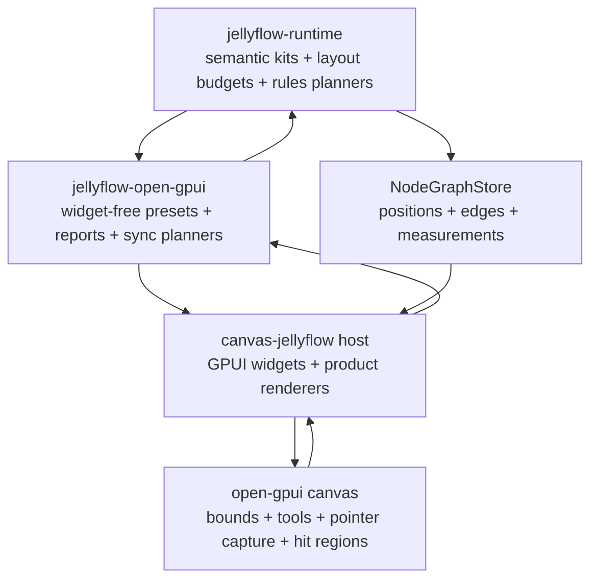
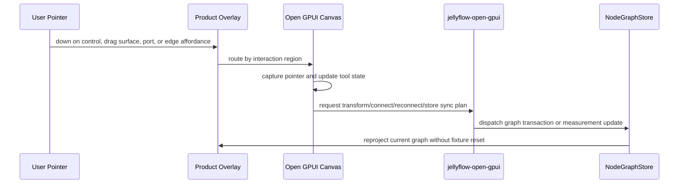

# Open GPUI Product Interactions - Plan

## Goal Capsule

| Field | Value |
| --- | --- |
| Objective | Productize the Open GPUI adapter path so Dify-style workflow, shader graph, ERD, and mind-map nodes have reliable rich UI, draggable custom surfaces, reachable ports, usable connection editing, and reusable widget-free adapter contracts. |
| Target repos | Jellyflow root and `repo-ref/open-gpui`. Paths are repo-relative to the Jellyflow root. |
| Source authority | User native review feedback, ADR 0008, ADR 0009, Node UI Kit Component Contract, Open GPUI Node Component Kit decision, node UI authoring regression gates, read-only subagent audits, and current Open GPUI canvas/example code. |
| Execution profile | Deep cross-repo feature/refactor. Breaking `canvas-jellyflow`, `jellyflow-open-gpui`, and local `open-gpui` canvas APIs is acceptable when it removes proof-only glue or makes product interactions testable. Runtime changes must stay semantic and toolkit-free. |
| Stop condition | Native Open GPUI review can drag shader/ERD nodes from non-control regions, use visible port/connection affordances, switch/create/reconnect graph connections through discoverable UI, and read product node internals without silent clipping. |
| Explicit non-goal | Do not add a shared widget crate, move GPUI widget types into runtime, replace Jellyflow graph/store with egui-snarl-style data structures, or build backend workflow/shader/database execution. |

---

## Product Contract

### Summary

This plan turns the current Open GPUI product gallery from a visual proof into a mature adapter slice.
It fixes the reported shader drag and connection edit gaps, improves component readability, and promotes stable widget-free contracts into `jellyflow-open-gpui` so `canvas-jellyflow` becomes a host renderer instead of the owner of adapter policy.

### Problem Frame

The previous Open GPUI gallery work proved that native node-internal UI can be rendered, measured, and edited, but user review still found product-level failures: shader nodes do not drag, port/connection affordances are hard or impossible to hit, connection switching is not discoverable, and component rows still clip or truncate important text.
Local review shows the root cause is not a single renderer bug.
The current system splits the same decisions across runtime default sizes, example-local readable clamps, visual-report thresholds, overlay event bridges, and canvas tool state.
The result is a proof that passes structural gates while missing real interaction paths a Dify, Blueprint, Shader Graph, or mind-map user expects.

### Requirements

**User-visible interactions**

- R1. Shader, ERD, Dify, and mind-map product nodes must drag from headers, card bodies, and passive display regions without breaking real controls.
- R2. Product controls must keep native interaction behavior: text inputs, text areas, selects, sliders, buttons, menus, and repeatable action controls must not start a node drag.
- R3. Ports and handles must be visually discoverable and practically clickable at default zoom, including measured dynamic ports and fallback ports.
- R4. Users must be able to enter connection mode through visible Open GPUI UI and create a valid connection by dragging from a source endpoint to a target endpoint.
- R5. Users must be able to select edges and switch/reconnect an existing connection when runtime policy allows it.
- R6. Dropped-wire insertion must be connected to a real connection end flow, not only a toolbar demo button.
- R7. Canvas edge insert/update/remove events must synchronize back to the Jellyflow `NodeGraphStore` through rules-derived graph transactions.

**Component UI and layout**

- R8. Product renderers must consume a single readable layout budget source for min size, row height, visible repeatable count, overflow indicators, and density fallback.
- R9. Dify, Shader, ERD, and MindMap product fixtures must show readable critical text at default launch and after resize; silent clipping cannot be counted as success.
- R10. Repeatable regions must make hidden overflow visible through an indicator, scroll, or compact summary; renderers must not silently `.take(3)` product data with no user-visible signal.
- R11. Runtime node kits may publish semantic layout budgets and fixture topology, but concrete pixel constants, widget composition, event shielding, focus, and popup state stay Open GPUI adapter/host-local.

**Adapter productization**

- R12. `jellyflow-open-gpui` must own widget-free product interaction contracts: readable budgets, renderer preset metadata, interaction region reports, host visual gates, layout-pass consumption helpers, and transform/edge sync planners.
- R13. `canvas-jellyflow` must own concrete Open GPUI widgets, product visual styling, gallery UI, local dispatch, and screenshot smoke.
- R14. `repo-ref/open-gpui/crates/canvas` may add generic canvas APIs for bounds, pointer capture, overlay event routing, handle hit regions, tool switching, and reconnect state, but must not depend on Jellyflow.
- R15. The plan must preserve the `slot` vs `anchor` boundary: `slot` is data lookup, `anchor` is placement or port binding.

**Regression and verification**

- R16. Tests must cover complete pointer sequences for drag and connection flows, not just helper calls or runtime hit-test shortcuts.
- R17. Host reports must expose why a product node is unreadable or unclickable: text overflow, clipped controls, hidden repeatable overflow, handle overlap, stale/missing measured regions, missing port hotspots, or inaccessible tool state.
- R18. Screenshot smoke remains a review aid; structured geometry, interaction, measurement, and sync reports are the hard gates.

### Acceptance Examples

- AE1. Given the shader material fixture, when the user presses on the shader header, moves the pointer, and releases, then the shader node moves, connected edges follow, and the Jellyflow store keeps the new position after measurement refresh.
- AE2. Given the shader material fixture, when the user edits the factor slider or type select, then the control changes data and the node does not enter translating state.
- AE3. Given the shader material fixture, when the user switches to Connect and drags from a source port to a compatible target port, then the connection commits through the Jellyflow store and typed invalid targets show rejection feedback.
- AE4. Given an existing edge, when the user grabs a reconnect affordance on an allowed endpoint and drops it on another valid port, then the edge id is preserved and the Jellyflow reconnect transaction is dispatched.
- AE5. Given an edge is selected, when the user invokes dropped-wire insertion and picks a compatible node action, then the new node is inserted and connected at the dropped point.
- AE6. Given the ERD customer orders fixture has more fields than the full card can show, when it renders at default size, then visible rows are readable and hidden rows are represented by an overflow affordance.
- AE7. Given the Dify LLM fixture has a long prompt and multiple controls, when the window is resized, then readable budgets or compact fallback preserve critical labels and port hit regions.
- AE8. Given the mind-map strategy fixture, when a topic/source node renders, then title and summary/preview are readable or intentionally summarized without overlapping connection handles.

### Scope Boundaries

#### In Scope

- `jellyflow-open-gpui` widget-free product contracts, report builders, testing gates, measurement helpers, and sync planners.
- `repo-ref/open-gpui/examples/canvas-jellyflow` product renderer cleanup, node component kit polish, tool UI, port hotspots, connection wiring, screenshot smoke, and native review surface.
- `repo-ref/open-gpui/crates/canvas` generic APIs required for pointer capture, overlay event routing, handle hit regions, connect/reconnect tools, or bounds reporting.
- Runtime schema additions limited to semantic layout budgets, repeatable overflow metadata, and fixture topology.
- Documentation and engineering memory updates that record the new adapter maturity boundary.

#### Deferred to Follow-Up Work

- Mature egui and Dioxus adapter parity for the new Open GPUI facade.
- A public standalone Open GPUI component-kit crate.
- Pixel-perfect golden visual regression.
- Advanced accessibility contracts such as full keyboard focus order and screen-reader labels.
- Multi-edge bundle routing and advanced cable editing beyond the first reconnect/switch path.

#### Outside This Product's Identity

- Shared runtime-owned widgets or retained UI instances.
- Replacing Jellyflow graph/runtime with `egui-snarl`'s data model.
- Backend Dify execution, shader compilation, database persistence, collaboration, or cloud sync.

---

## Planning Contract

### Key Technical Decisions

- KTD1. Keep the headless direction and productize only the Open GPUI adapter path. Runtime publishes semantic contracts; Open GPUI owns retained widgets and interaction policy.
- KTD2. Promote duplicated readable-size and visual-report constants into widget-free adapter contracts before polishing individual renderers. The same budget must drive projection, reports, and host rendering choices.
- KTD3. Treat overlay event routing as a first-class canvas integration problem. A robust solution must handle down, move, up, cancel, pointer capture, and focus consistently across canvas and node-internal widgets.
- KTD4. Make connection editing discoverable through Open GPUI UI, not only through runtime capability. The example must expose tool switching, port hotspots, connection preview, edge selection, and reconnect affordances.
- KTD5. Use Jellyflow runtime planners for graph connection semantics. Open GPUI canvas may manage gestures, but connect/reconnect commits must flow through `NodeGraphStore` rules and transactions.
- KTD6. Introduce adapter-local style presets for port/edge affordances. Handle radius, hit width, wire stroke, invalid feedback, row height, and density thresholds are Open GPUI adapter concerns.
- KTD7. Keep screenshot evidence coarse. Per-node ROI smoke helps review, but structured reports must identify actionable failures.
- KTD8. Borrow `egui-snarl`'s product API ergonomics, not its storage model. Jellyflow's graph, schema, measurement, and transaction runtime remain the source of truth.

### High-Level Technical Design





### Assumptions

- A1. The user's latest feedback supersedes the previous stabilization stop condition; unresolved shader drag and connection editing are in scope even where existing tests passed.
- A2. `repo-ref/open-gpui` can change locally on `main`, but plan execution should keep Jellyflow-specific code out of generic canvas crates.
- A3. `jellyflow-open-gpui` should remain free of concrete GPUI widget types; if an Open GPUI type is unavoidable, it belongs in `canvas-jellyflow` or a future integration crate, not the adapter core.
- A4. Connection switching means at least reconnecting one endpoint of an existing edge through a visible affordance. More advanced bundle/yank interactions can be deferred after the first product path works.
- A5. Layout budgets can begin as semantic and adapter-local metadata, then become more precise after implementation proves which fields belong in runtime versus adapter presets.

### Local Evidence

- `repo-ref/open-gpui/examples/canvas-jellyflow/src/product_renderers.rs` defines renderer keys, card layout constants, drag-surface mouse down forwarding, and repeated `.take(3)` repeatable truncation.
- `repo-ref/open-gpui/examples/canvas-jellyflow/src/node_component_kit.rs` wraps controls with `block_mouse_except_scroll` and stops pointer/key events, which is correct for controls but cannot be the only event policy.
- `repo-ref/open-gpui/examples/canvas-jellyflow/src/main.rs` owns `project_store`, `project_node`, readable size clamps, layout-pass measurement consumption, transform sync, gallery toolbar, and overlay rendering.
- `repo-ref/open-gpui/examples/canvas-jellyflow/src/visual_regression.rs` computes readable size thresholds separately from `main.rs`, so gates and projection can drift.
- `crates/jellyflow-open-gpui/src/testing.rs` has useful product fixture and host visual gates, but it does not yet report full drag/connection/reconnect accessibility or detailed text/repeatable overflow facts.
- `repo-ref/open-gpui/crates/canvas/src/tool/builtin.rs` supports a basic Connect tool, but the example does not expose tool switching and the generic canvas layer does not yet provide a product reconnect/switch workflow.
- `crates/jellyflow-runtime/src/rules/connection/reconnect/planner.rs` and related tests already provide reconnect planning; the missing work is adapter/canvas gesture and store synchronization.

### Risks and Mitigations

| Risk | Mitigation |
| --- | --- |
| Adapter productization pulls concrete GPUI widgets into `jellyflow-open-gpui`. | Keep public adapter APIs as data plans, reports, ids, budgets, and sync planners; widget construction stays in `canvas-jellyflow`. |
| Fixing shader drag by forwarding only one more event leaves pointer capture brittle. | Characterize full down/move/up/cancel sequences and prefer generic canvas pointer capture or overlay routing support. |
| Connect/reconnect duplicates runtime connection rules in Open GPUI canvas. | Use canvas tools for gesture state and Jellyflow runtime planners for graph acceptance, rejection, and transaction generation. |
| Adding layout budget fields to runtime overfits GPUI pixel layout. | Keep runtime fields semantic: min readable size, line budgets, visible item policy, overflow intent, and density priority; leave exact widget sizes in adapter presets. |
| Renderer polish hides data instead of making it readable. | Require overflow indicators and report fields whenever visible repeatable rows are capped. |
| Large cross-repo changes make regression failures hard to locate. | Land in dependency order: characterization, contracts, canvas input/tool APIs, adapter sync, renderer polish, final hard gates. |

### Phased Delivery

| Phase | Units | Outcome |
| --- | --- | --- |
| Phase 1: Characterize | U1 | Failing tests prove the reported native review issues and current product gaps. |
| Phase 2: Contracts | U2, U3 | Runtime and adapter expose a single widget-free vocabulary for readable layouts, interaction regions, and style budgets. |
| Phase 3: Canvas Integration | U4, U5 | Open GPUI canvas and the host example support robust drag surfaces, pointer capture, tool switching, connection, and reconnect gestures. |
| Phase 4: Product UI | U6, U7 | Dify, shader, ERD, and mind-map renderers consume the contracts and provide readable product affordances. |
| Phase 5: Gates and Docs | U8 | Structured reports, screenshot smoke, docs, and memory reflect the productized state. |

---

## Implementation Units

### U1. Characterize Real Product Interaction Failures

- **Goal:** Add focused failing tests and report gaps for shader drag, port clickability, Connect tool access, reconnect absence, edge/store sync, and product UI readability.
- **Requirements:** R1, R2, R3, R4, R5, R7, R9, R10, R16, R17, AE1, AE2, AE3, AE4, AE6.
- **Dependencies:** None.
- **Files:** `repo-ref/open-gpui/examples/canvas-jellyflow/src/main.rs`, `repo-ref/open-gpui/examples/canvas-jellyflow/src/visual_regression.rs`, `repo-ref/open-gpui/crates/canvas/src/gpui.rs`, `repo-ref/open-gpui/crates/canvas/src/tool.rs`, `crates/jellyflow-open-gpui/src/testing.rs`, `crates/jellyflow-runtime/src/schema/tests/view_descriptor.rs`.
- **Approach:** Create characterization tests for full pointer sequences rather than isolated helpers: overlay drag surface down/move/up, control event shielding, visible tool switching, source-to-target port connection, existing-edge reconnect attempt, and long/repeatable content readability. Record current missing capabilities as explicit report gaps until later units satisfy them.
- **Execution note:** Characterization-first. These tests should fail or expose report gaps before U2-U7 change behavior.
- **Patterns to follow:** Existing `CanvasInputMapper` tests, `connect_tool_uses_handles_when_available`, `canvas_hit_testing_uses_measured_handle_positions_for_connection_targets`, `canvas_host_visual_interaction_report`, and runtime reconnect planner tests.
- **Test scenarios:**
  - Shader card header receives pointer down, pointer move, and pointer up; expected result is node translation and store position update.
  - Shader slider/select receives pointer or click; expected result is control edit without translating tool state.
  - Port hotspot under product overlay is hit at default zoom; expected result is handle/connection endpoint evidence rather than hidden overlay consumption.
  - Connect tool is discoverable and changes editor tool state from the toolbar.
  - Reconnect attempt on an existing edge reports unsupported or failing state before implementation, not silent no-op.
  - ERD with more than three columns and shader with more than three dynamic inputs produce visible overflow evidence.
- **Verification:** Focused tests identify at least shader drag, connection tool access, reconnect, and readability overflow as current failing or incomplete behaviors.

### U2. Add Semantic Layout Budget and Overflow Contracts

- **Goal:** Give runtime node kits a toolkit-free way to describe readable sizes, line budgets, repeatable overflow intent, and density priorities.
- **Requirements:** R8, R9, R10, R11, R15, AE6, AE7, AE8.
- **Dependencies:** U1.
- **Files:** `crates/jellyflow-runtime/src/schema/types.rs`, `crates/jellyflow-runtime/src/schema/kit/builtins.rs`, `crates/jellyflow-runtime/src/schema/tests/view_descriptor.rs`, `crates/jellyflow-runtime/src/schema/tests/kit.rs`, `crates/jellyflow-runtime/tests/public_surface.rs`.
- **Approach:** Add semantic layout budget fields without introducing widget or GPUI concepts. Candidate facts include node min readable size, preferred size, slot/control line budget, repeatable visible item policy, overflow indicator intent, and density fallback priority. Apply them to builtin Dify, Shader, ERD, and MindMap kits where current fixtures already need product-readable defaults.
- **Patterns to follow:** `NodeKitLayoutHints`, `NodeSurfaceProjection`, `NodeControlPresentation`, `NodeRepeatableCollectionDescriptor`, and descriptor serialization tests.
- **Test scenarios:**
  - View descriptors serialize and deserialize layout budgets without losing stable IDs or existing control metadata.
  - Builtin product kits expose min readable size and repeatable overflow policy for Dify, Shader, ERD, and MindMap cases.
  - `slot` and `anchor` semantics remain unchanged: budget fields do not become data lookup or port binding aliases.
  - Existing public-surface tests compile with the new descriptor types.
- **Verification:** Runtime tests prove layout budgets are semantic, deterministic, and framework-free.

### U3. Productize Open GPUI Presets, Readability Reports, and Style Budgets

- **Goal:** Move duplicated Open GPUI product layout facts out of the example into `jellyflow-open-gpui` as widget-free adapter contracts.
- **Requirements:** R8, R12, R13, R17, R18, AE6, AE7, AE8.
- **Dependencies:** U2.
- **Files:** `crates/jellyflow-open-gpui/src/lib.rs`, `crates/jellyflow-open-gpui/src/testing.rs`, optional new `crates/jellyflow-open-gpui/src/product.rs`, optional new `crates/jellyflow-open-gpui/src/style.rs`, `repo-ref/open-gpui/examples/canvas-jellyflow/src/main.rs`, `repo-ref/open-gpui/examples/canvas-jellyflow/src/visual_regression.rs`.
- **Approach:** Introduce adapter-owned preset data for renderer keys, readable min sizes, row budgets, port/edge style tokens, handle hit widths, repeatable overflow expectations, and density fallback labels. Extend host visual reports from boolean readability to structured gap lists with actual size, minimum size, text/control overflow counts, repeatable overflow visibility, handle overlap, and inaccessible interaction region counts.
- **Patterns to follow:** `OpenGpuiHostVisualSurfaceRow`, `OpenGpuiProductFixtureReport`, `OpenGpuiAuthoringInteractionReport`, `OpenGpuiNodeRendererRegistry`, and existing element-id helpers.
- **Test scenarios:**
  - `main.rs` and `visual_regression.rs` consume the same adapter preset for readable size thresholds.
  - Host visual report fails when actual size is below min readable size and no compact/shell degradation is reported.
  - Report rows identify whether unreadability came from text overflow, control clipping, hidden repeatables, or handle overlap.
  - Style budget facts expose handle radius/hit width and edge interaction width without importing Open GPUI widget types.
- **Verification:** `jellyflow-open-gpui` tests pass with richer report contracts, and example gates no longer duplicate size constants.

### U4. Add Open GPUI Canvas Overlay and Pointer Routing Support

- **Goal:** Make rich-node overlays participate in canvas gestures reliably across down, move, up, cancel, focus, and pointer capture.
- **Requirements:** R1, R2, R14, R16, AE1, AE2.
- **Dependencies:** U1.
- **Files:** `repo-ref/open-gpui/crates/canvas/src/gpui/input.rs`, `repo-ref/open-gpui/crates/canvas/src/gpui/view.rs`, `repo-ref/open-gpui/crates/canvas/src/gpui.rs`, `repo-ref/open-gpui/examples/canvas-jellyflow/src/main.rs`, `repo-ref/open-gpui/examples/canvas-jellyflow/src/node_component_kit.rs`, `repo-ref/open-gpui/examples/canvas-jellyflow/src/product_renderers.rs`.
- **Approach:** Add a generic canvas event bridge or pointer-capture path that overlays can use without hand-rolling only `MouseDown` conversion. Controls continue to consume events; drag surfaces and passive regions forward or yield full pointer sequences to canvas. Prefer a generic `open-gpui` canvas API when possible, with the example only classifying regions.
- **Patterns to follow:** `CanvasEditorInputMapper`, `register_canvas_editor_input`, `canvas_editor_view_with_frame`, `CanvasWidgetOverlayHitPriority`, and current `dispatch_node_drag_surface_mouse_down` behavior.
- **Test scenarios:**
  - Overlay drag surface starts translating on down, updates position on move, commits on up, and cancels cleanly on cancel.
  - Pointer move/up outside canvas bounds still completes an active drag through pointer capture.
  - Text inputs, selects, sliders, and action buttons stop propagation and do not emit canvas drag events.
  - Non-zero canvas bounds and toolbar/sidebar layout still produce correct canvas-local pointer positions.
- **Verification:** Shader and ERD drag tests pass through the same path a native user exercises.

### U5. Productize Connection, Port, and Reconnect UX

- **Goal:** Expose complete Open GPUI connection editing: visible port hotspots, tool switching, connection preview, edge selection, dropped-wire insertion, and first reconnect path.
- **Requirements:** R3, R4, R5, R6, R7, R14, R15, R16, AE3, AE4, AE5.
- **Dependencies:** U1, U3, U4.
- **Files:** `repo-ref/open-gpui/crates/canvas/src/tool/builtin.rs`, `repo-ref/open-gpui/crates/canvas/src/tool.rs`, `repo-ref/open-gpui/crates/canvas/src/geometry_facts.rs`, `repo-ref/open-gpui/crates/canvas/src/gpui/frame.rs`, `repo-ref/open-gpui/crates/canvas/src/gpui/painter.rs`, `repo-ref/open-gpui/examples/canvas-jellyflow/src/main.rs`, `repo-ref/open-gpui/examples/canvas-jellyflow/src/product_renderers.rs`, `crates/jellyflow-open-gpui/src/actions.rs`, optional new `crates/jellyflow-open-gpui/src/connection.rs`.
- **Approach:** Add a toolbar tool selector for Select, Pan, and Connect. Give product port rails visible and measured hotspots with adapter style budgets. Bridge canvas edge insert/update/remove to Jellyflow graph transactions. Implement or expose a generic canvas reconnect/switch gesture, then route accepted reconnects through Jellyflow runtime planners so edge identity and policy are preserved. Connect dropped-wire menu insertion to connection end intent instead of keeping it as a standalone toolbar shortcut.
- **Patterns to follow:** `ConnectToolStateMachine`, `CanvasGeometryFacts::connection_endpoint_at`, `connection_hit_options`, `plan_dropped_wire_insert_transaction`, `plan_reconnect_edge`, and runtime adapter conformance reconnect tests.
- **Test scenarios:**
  - Toolbar can switch to Connect and back to Select; current tool is visible in the host report.
  - Dragging from a shader output hotspot to a compatible input commits an edge through `NodeGraphStore`.
  - Dragging to an incompatible shader target shows invalid hover feedback and does not commit.
  - Selecting an edge exposes reconnect handles for allowed endpoints.
  - Reconnecting an allowed endpoint preserves edge id and dispatches a Jellyflow reconnect transaction.
  - Dropping a connection on the pane opens a compatible insert menu and connects the inserted node when an action is chosen.
  - Edge insert/update/remove in `CanvasDocument` cannot reset node positions or bypass runtime connection policy.
- **Verification:** Product connection reports prove tool access, port hotspot accessibility, valid connect, invalid hover, dropped-wire insert, and reconnect/switch behavior.

### U6. Add Open GPUI Adapter Facade for Projection, Measurement, and Sync

- **Goal:** Reduce `canvas-jellyflow` proof glue by moving reusable widget-free projection, measurement, transform, and edge sync planning into `jellyflow-open-gpui`.
- **Requirements:** R7, R12, R13, R15, R17, AE1, AE3, AE4.
- **Dependencies:** U2, U3, U5.
- **Files:** `crates/jellyflow-open-gpui/src/measurement.rs`, `crates/jellyflow-open-gpui/src/projection.rs`, optional new `crates/jellyflow-open-gpui/src/sync.rs`, `crates/jellyflow-open-gpui/src/lib.rs`, `repo-ref/open-gpui/examples/canvas-jellyflow/src/main.rs`.
- **Approach:** Extract widget-free helpers for layout-pass measurement consumption, measurement revision reuse, transform snapshot planning, edge sync planning, and report building. Keep `CanvasDocument`, `CanvasEditor`, and concrete Open GPUI view types in the example or a future integration layer; the adapter core accepts neutral snapshots and returns Jellyflow transactions or report facts.
- **Patterns to follow:** `OpenGpuiMeasurementContext`, `layout_pass_measurement_from_regions`, `OpenGpuiAuthoringController`, `OpenGpuiActionDispatchPlan`, existing JSON binding helpers, and `canvas_document_transform_transaction`.
- **Test scenarios:**
  - Identical fresh measurement regions reuse existing revisions.
  - Dirty or changed measured regions invalidate only affected internals.
  - Transform snapshots generate graph transactions that update moved nodes and ignore unchanged nodes.
  - Edge sync planner maps accepted canvas edge changes to Jellyflow connect/reconnect transactions and rejects policy failures.
  - `canvas-jellyflow` can refresh from store after measurement, control edits, drag, and edge edits without fixture reset.
- **Verification:** Example `main.rs` loses adapter policy duplication while all product interaction tests still pass.

### U7. Polish Concrete Product Renderers Against the New Contracts

- **Goal:** Make Dify, Shader, ERD, and MindMap renderers feel like intentional product UI rather than clipped proof cards.
- **Requirements:** R1, R2, R3, R8, R9, R10, R13, AE2, AE6, AE7, AE8.
- **Dependencies:** U2, U3, U4, U5.
- **Files:** `repo-ref/open-gpui/examples/canvas-jellyflow/src/product_renderers.rs`, `repo-ref/open-gpui/examples/canvas-jellyflow/src/node_component_kit.rs`, `repo-ref/open-gpui/examples/canvas-jellyflow/src/main.rs`, `repo-ref/open-gpui/examples/canvas-jellyflow/src/product_gallery.rs`.
- **Approach:** Rebuild product cards around adapter budgets and interaction regions. Dify cards get readable prompt/config/action layout; shader cards get visible port rails, overflowed dynamic inputs, and draggable non-control body; ERD cards get readable field rows and explicit overflow; MindMap nodes get readable title/summary/source preview and better compact summaries. Avoid nested cards and keep controls sized to their actual components.
- **Patterns to follow:** Existing renderer keys `decision-card`, `shader-card`, `table-card`, `topic-card`, `source-card`; Open GPUI component-library controls; host-local `node_component_kit` helpers; adapter preset/style budgets from U3.
- **Test scenarios:**
  - Dify LLM prompt/model/temperature/action regions remain readable at default launch and after resize.
  - Shader dynamic inputs show at least the configured visible rows plus overflow indicator when more exist.
  - Shader output/input hotspots remain visible and do not overlap controls.
  - ERD table rows preserve field label, type, key badge, and action controls without row collapse.
  - MindMap topic/source cards show readable title/summary/preview or compact summaries with no handle overlap.
  - All product nodes retain a drag surface that is not covered by interactive controls.
- **Verification:** Native launch review matches structured report results for readability, drag, port, and overflow behavior.

### U8. Harden Visual, Interaction, and Documentation Gates

- **Goal:** Make the new productized interaction baseline durable for future adapter work.
- **Requirements:** R16, R17, R18.
- **Dependencies:** U1 through U7.
- **Files:** `crates/jellyflow-open-gpui/src/testing.rs`, `repo-ref/open-gpui/examples/canvas-jellyflow/src/visual_regression.rs`, `repo-ref/open-gpui/examples/canvas-jellyflow/src/gallery_screenshot.rs`, `docs/testing/node-ui-authoring-regression.md`, `docs/knowledge/engineering/current-state.md`, `docs/knowledge/engineering/log.md`, optional `docs/knowledge/engineering/decisions/open-gpui-product-interactions.md`.
- **Approach:** Extend structured gates to cover product interaction accessibility, real pointer sequences, port hotspot reachability, connect/reconnect support, dropped-wire gesture flow, readable regions, repeatable overflow visibility, and screenshot ROI smoke. Update docs and memory so future work starts from the productized Open GPUI boundary rather than reintroducing proof-only shortcuts.
- **Patterns to follow:** `assert_host_visual_interaction_report_gates`, `assert_authoring_interaction_report_gates`, screenshot smoke skip behavior, and engineering memory decision format.
- **Test scenarios:**
  - Host visual report fails when a product renderer hides repeatable overflow without an indicator.
  - Interaction report fails when Connect is unavailable, port hotspots are missing, shader drag is untested, or reconnect is unsupported without an explicit deferred flag.
  - Screenshot smoke still skips gracefully without headless renderer support.
  - When screenshots are written, each product fixture has nonblank per-node ROI content.
  - Docs name which guarantees are hard structured gates and which are manual/screenshot review aids.
- **Verification:** Broad verification passes and docs accurately describe the Open GPUI adapter/product renderer split.

---

## Verification Contract

Run focused checks during implementation, then finish with the broad gate:

```bash
cargo fmt --all -- --check
cargo fmt --manifest-path repo-ref/open-gpui/examples/canvas-jellyflow/Cargo.toml -- --check
git diff --check
git -C repo-ref/open-gpui diff --check
cargo nextest run -p jellyflow-open-gpui --no-fail-fast
cargo nextest run -p jellyflow-runtime -p jellyflow-egui -p jellyflow-proof --lib --no-fail-fast
cargo test -p jellyflow-runtime --test public_surface -- --nocapture
cargo test --manifest-path repo-ref/open-gpui/examples/canvas-jellyflow/Cargo.toml --bin open-gpui-canvas-jellyflow -- --nocapture --test-threads=1
cargo check --manifest-path repo-ref/open-gpui/examples/canvas-jellyflow/Cargo.toml
cargo test --manifest-path repo-ref/open-gpui/crates/gpui/Cargo.toml measured_element_reports_nested_layout_pass_bounds -- --nocapture
```

After interaction and renderer changes, run a native launch smoke:

```bash
cargo run --manifest-path repo-ref/open-gpui/examples/canvas-jellyflow/Cargo.toml
```

Manual native review must confirm:

- Shader and ERD nodes drag from header/body but not from controls.
- Connect tool is visible and can create a valid shader/ERD connection.
- Existing edge selection and reconnect/switch affordance are visible and functional for allowed endpoints.
- Dropped-wire menu is reachable from a real connection gesture.
- Dify, Shader, ERD, and MindMap nodes have readable internals and visible repeatable overflow.
- Window resize and measurement refresh do not reset node positions.

---

## Definition of Done

- Shader graph dragging works from non-control regions with a complete pointer sequence and survives store reprojection.
- Product controls remain interactive and do not start drag gestures.
- Product ports and handles are visible, styled, measured, and practically clickable.
- Open GPUI UI exposes Select, Pan, and Connect tool states.
- Valid connect, invalid hover, dropped-wire insertion, and first reconnect/switch flow are covered by structured gates.
- Canvas edge changes synchronize through Jellyflow store transactions and runtime connection/reconnect planners.
- Runtime semantic layout budgets remain framework-free and preserve `slot` vs `anchor`.
- `jellyflow-open-gpui` owns reusable widget-free presets, reports, style budgets, measurement/sync planners, and gates.
- `canvas-jellyflow` owns concrete GPUI widgets, visual styling, gallery controls, local dispatch, and screenshot smoke.
- Dify, Shader, ERD, and MindMap product renderers are readable at default launch and after resize, with explicit overflow indicators where content is capped.
- Generic `open-gpui` canvas changes remain Jellyflow-agnostic.
- Obsolete proof-only glue and duplicated budget constants are deleted.
- No unrelated user changes are staged or reverted.

---

## Implementation-Time Unknowns

- Whether Open GPUI should expose pointer capture through `canvas_editor_view_with_frame`, a new overlay routing API, or a separate canvas event bridge.
- Whether reconnect belongs in the existing Connect tool state machine or a new generic canvas edge-editing tool.
- How much of `project_store` can move to `jellyflow-open-gpui` without importing `open_gpui_canvas` types.
- Whether runtime layout budgets should live directly on descriptors or under a nested presentation/budget object to keep serialization stable.
- Which screenshot ROI thresholds remain stable across macOS local rendering and future CI runners.

---

## Sources and Research

- User native review feedback on shader drag, component UI polish, and connection/port clickability.
- Read-only subagent audits for shader/connection input, component UI polish, adapter productization, egui-snarl comparison, surface fixture gaps, and visual regression gaps.
- `docs/adr/0008-semantic-surface-and-framework-adapter-boundary.md`
- `docs/adr/0009-node-kit-and-adapter-local-mapping-boundary.md`
- `docs/knowledge/engineering/decisions/node-ui-kit-component-contract.md`
- `docs/knowledge/engineering/decisions/open-gpui-node-component-kit.md`
- `docs/testing/node-ui-authoring-regression.md`
- `repo-ref/egui-snarl/src/ui.rs`
- `repo-ref/egui-snarl/src/ui/viewer.rs`
- `repo-ref/egui-snarl/src/ui/pin.rs`
