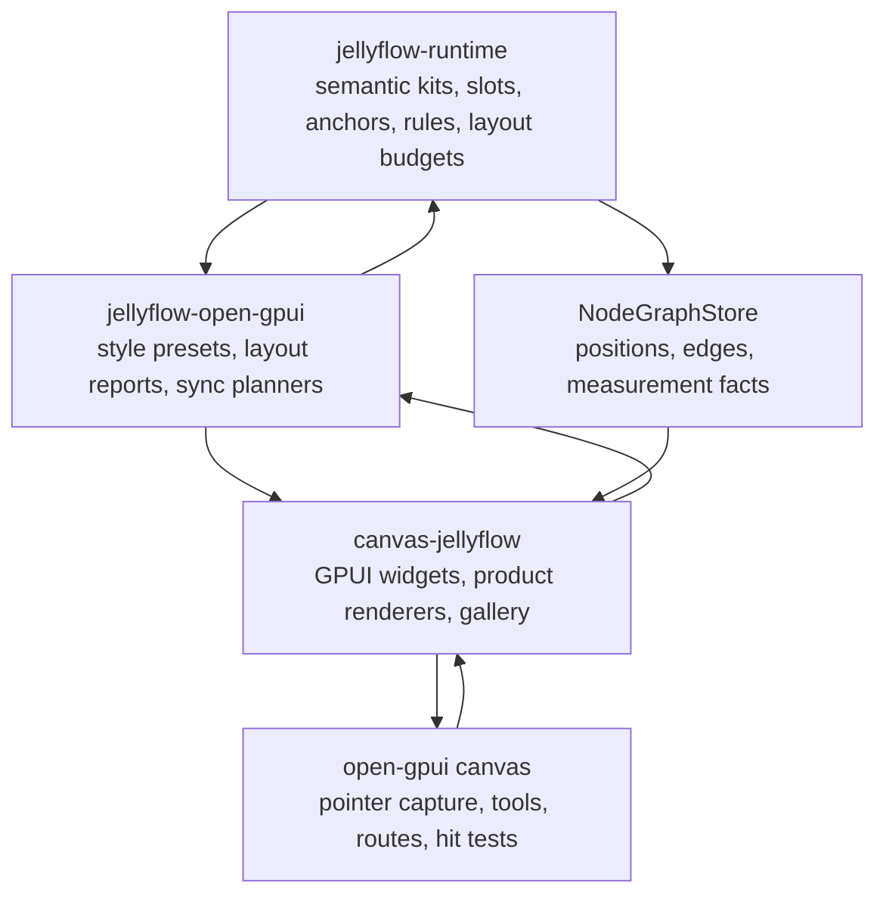
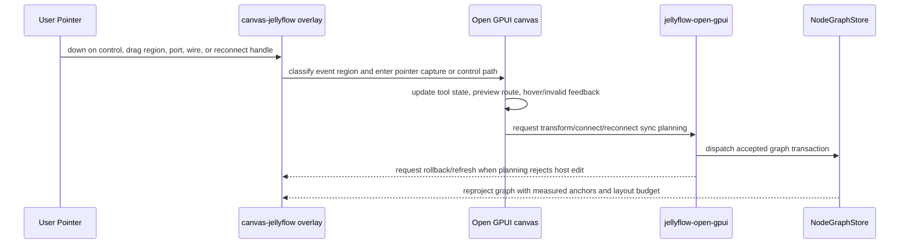
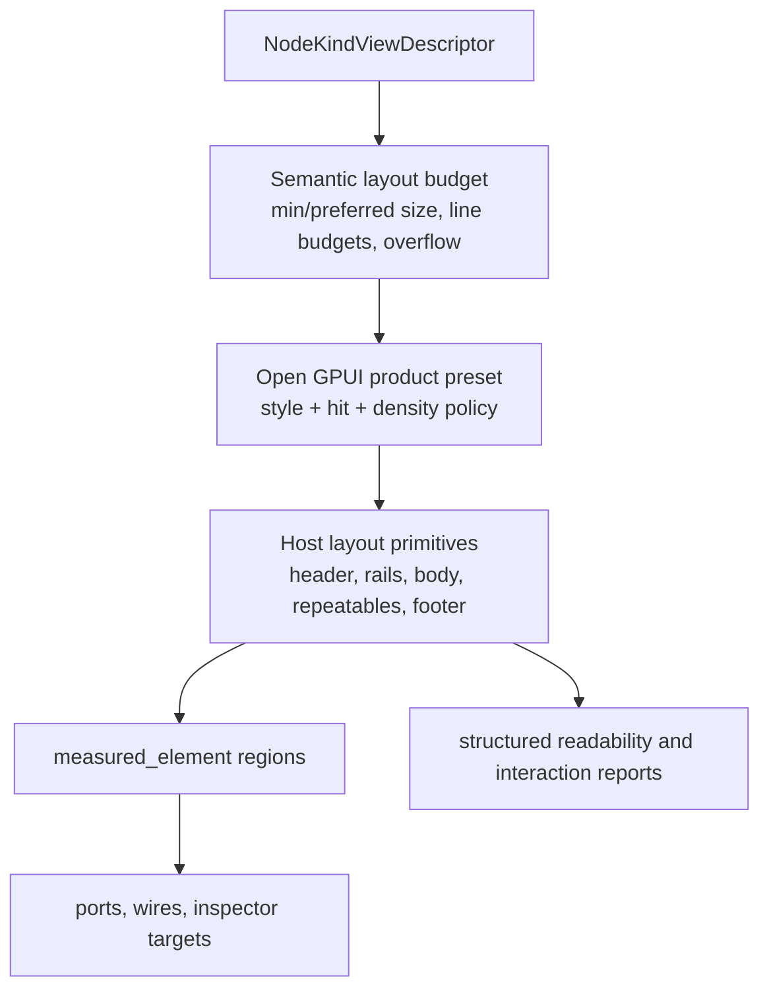

# Open GPUI Canvas Node UI Foundations - Plan

## Goal Capsule

| Field | Value |
| --- | --- |
| Objective | Raise the Open GPUI path from a product-gallery proof to a node-graph foundation with mature drag feel, wire routing/style, port/reconnect affordances, and adaptive node-internal layout primitives for Dify, shader graph, ERD, and mind-map shapes. |
| Target repos | Jellyflow root and `repo-ref/open-gpui`. Paths are repo-relative to the Jellyflow root. |
| Source authority | User native review feedback, ADR 0008, ADR 0009, Node UI Kit Component Contract, Open GPUI Node Component Kit decision, current Open GPUI canvas/example code, local egui-snarl reference code, and official React Flow / egui-snarl docs. |
| Execution profile | Deep cross-repo fearless refactor. Breaking `canvas-jellyflow`, `jellyflow-open-gpui`, and generic `repo-ref/open-gpui/crates/canvas` APIs is acceptable when it removes proof-only glue or creates reusable product-quality graph interaction primitives. |
| Stop condition | A native Open GPUI reviewer can drag nodes easily, see polished selectable wires, hit ports and reconnect handles reliably, switch/reconnect endpoints, and inspect node-internal UI that adapts instead of clipping critical text. |
| Explicit non-goal | Do not add a shared widget crate, move GPUI widget types into runtime, replace Jellyflow graph/runtime with egui-snarl, build Dify backend execution, compile shaders, add database persistence, or expand mature adapter scope beyond Open GPUI in this stage. |

---

## Product Contract

### Summary

The latest Open GPUI path now proves rich node UI, layout-pass measurement, product renderers, drag-state preservation, connect/reconnect store sync, and rejected reconnect rollback.
That is enough to keep the architecture, but not enough to feel like a mature node library.
The next stage should productize the canvas interaction layer and the host-local layout system: wires must look and behave like first-class graph objects, ports must be easy to target, and node interiors must use adaptive measured regions instead of fixed absolute rows that only pass narrow fixture gates.

### Problem Frame

egui-snarl feels stronger because it exposes node graph ergonomics directly: viewer callbacks own semantic decisions, pin layout is explicit, wires have a style system, hover/hit logic is tuned around pins and wires, and dropped-wire/yank flows are part of the UI model.
React Flow / xyflow feels stronger because custom nodes, handles, dynamic handle updates, reconnect callbacks, and UI components are public product surfaces rather than demo-only wiring.
Jellyflow has a stronger headless semantic runtime than either of those local references, but the Open GPUI adapter still spreads graph interaction decisions across `canvas-jellyflow`, `jellyflow-open-gpui`, and generic canvas internals.

The design direction remains correct: runtime owns semantic node kits, slots, anchors, controls, repeatables, rules, measurement facts, and conformance; Open GPUI owns concrete widgets, canvas tools, pointer capture, visual polish, and layout reporting.
The gap is a missing product-quality Open GPUI canvas/node-UI foundation layer between those two responsibilities.

### Requirements

**Canvas interaction feel**

- R1. Node dragging must be tolerant and predictable across headers, passive node body regions, selection state, pointer leaving canvas bounds, and post-sync editor refresh.
- R2. Interactive controls must keep focus, edit, popup, scroll, and button behavior without accidentally starting canvas drags.
- R3. The Open GPUI canvas must expose pointer-capture and drag-threshold behavior as reusable canvas infrastructure instead of example-local event forwarding.
- R4. macOS application lifecycle and rejected reconnect rollback must remain stable while broader interaction code is refactored.

**Ports, handles, and reconnect**

- R5. Product ports must have visible, role-aware hit targets that stay aligned to measured anchors after resize, dynamic repeatable edits, and layout-pass refresh.
- R6. Users must be able to select wires, see endpoint affordances, reconnect one endpoint through a full pointer sequence, and receive clear invalid-target feedback.
- R7. Rejected connect/reconnect attempts must roll back host document state to the Jellyflow store projection and must not spam repeated planning errors on later frames.
- R8. Dropped-wire insertion must behave as a natural canvas gesture with a menu anchored to the release point, not only as a toolbar demo path.

**Wire style and routing**

- R9. The canvas must provide product-quality wire style presets covering straight, polyline, orthogonal/smooth-step, and bezier-like routes, with hover/selected/invalid/preview states.
- R10. Connection previews must use the same route/style policy as committed edges so dragging a wire does not degrade to a bare straight line.
- R11. Wire hit testing must use style-owned interaction width and route geometry, including cubic and orthogonal segments.
- R12. Jellyflow edge view descriptors may select semantic route intent, but exact stroke, marker, hover, and animation choices stay adapter/canvas-local.

**Node-internal layout and component design**

- R13. Dify, shader, ERD, and mind-map renderers must move away from brittle absolute-row layouts where possible and toward host-local layout primitives that adapt to measured node size.
- R14. Node interiors must publish clear regions: header, body, port rails, control rows, repeatable lists, preview/media, footer/status, inspector target, and overflow indicator.
- R15. Text and controls must fit their regions at default launch and after resize, using compact/shell degradation or visible overflow indicators rather than silent clipping.
- R16. Runtime semantic layout budgets remain widget-free: min/preferred readable size, line budgets, density priority, overflow intent, and anchor roles. Open GPUI owns concrete pixel constants, component composition, focus, menu, and measured-element wrappers.

**Adapter productization and regression**

- R17. `jellyflow-open-gpui` must own widget-free canvas/node UI presets and reports for wire styles, port hit budgets, drag regions, readability, and interaction coverage.
- R18. `canvas-jellyflow` must own concrete Open GPUI components and product renderer composition, but it should consume adapter presets instead of duplicating thresholds.
- R19. `repo-ref/open-gpui/crates/canvas` may add generic APIs for routes, pointer capture, hover affordances, reconnect gestures, and preview style, but it must not depend on Jellyflow.
- R20. Structured interaction and visual gates must remain the hard proof; screenshots and native smoke are review aids.

### Acceptance Examples

- AE1. Given the shader graph fixture, when the user drags from the header or a passive body region, then the node follows the pointer smoothly, connected edges follow, and the move survives store sync and editor refresh.
- AE2. Given the shader graph fixture, when the user drags a slider or opens a select, then the control remains interactive and the node does not translate.
- AE3. Given a visible source port, when the user switches to Connect and drags toward a compatible target, then the preview uses the configured wire style and the committed edge follows the same route policy.
- AE4. Given a selected edge, when the user grabs a reconnect handle and drops it on another valid port, then the edge id is preserved, the Jellyflow reconnect transaction commits, and the host document stays synchronized.
- AE5. Given an invalid reconnect target, when the user releases, then invalid feedback is shown, the editor rolls back to the store projection, and later frames do not repeat the same planning error.
- AE6. Given an ERD node with more fields than the readable body can show, when it renders at default size and after resize, then rows remain readable and hidden fields have an explicit overflow affordance.
- AE7. Given a Dify node with a long prompt and several controls, when the node is resized smaller than full density, then compact or shell layout preserves the title, key status, ports, and edit affordance without overlapping handles.
- AE8. Given a mind-map/source node, when it renders at low zoom, then relation/source chips degrade into a preview without publishing invisible full hit regions.

### Scope Boundaries

#### In Scope

- Generic Open GPUI canvas wire style, route preview, pointer capture, reconnect gesture, hover/selection affordance, and hit-test improvements.
- `jellyflow-open-gpui` widget-free presets/reports for wire, port, drag-region, readability, layout, and product interaction coverage.
- `canvas-jellyflow` host-local node component layout primitives and product renderer rewrites for Dify, shader, ERD, and mind-map cases.
- Preservation of the current local Open GPUI hotfix baseline for macOS quit mode and rejected reconnect rollback.
- Structured tests for full pointer sequences, wire previews, reconnect rollback, port reachability, and text/layout readability.
- Docs and engineering memory updates that explain the new canvas/node-UI foundation boundary.

#### Deferred to Follow-Up Work

- Publicly extracting the host-local Open GPUI node component kit as a standalone crate.
- Full pixel-golden visual regression and animation review infrastructure.
- Keyboard-only graph editing, screen-reader semantics, and complete focus-order accessibility contracts.
- Mature egui and Dioxus parity for the new Open GPUI foundation layer.
- Advanced cable bundling, graph minimap polish, edge labels/toolbars, and multi-edge route avoidance beyond the first product-quality route presets.

#### Outside This Product's Identity

- Shared runtime-owned widgets or retained UI instances.
- A DOM/React adapter.
- Backend workflow execution, shader compilation, database persistence, collaboration, or cloud sync.
- Replacing Jellyflow semantic runtime with egui-snarl's graph storage or immediate-mode viewer model.

---

## Planning Contract

### Key Technical Decisions

- KTD1. Keep runtime headless and make Open GPUI the only mature adapter target for this stage. Broader adapter parity waits until the Open GPUI foundation proves the right vocabulary.
- KTD2. Promote wire, port, drag, and readability choices into widget-free adapter presets before rewriting individual renderers. Otherwise thresholds and visual behavior will keep drifting between tests and host code.
- KTD3. Treat `repo-ref/open-gpui/crates/canvas` as the owner of generic graph interaction mechanics: pointer capture, drag threshold, route preview, edge hover, reconnect gesture, and hit testing.
- KTD4. Treat `jellyflow-open-gpui` as the owner of Jellyflow-specific interpretation: semantic route intent, style budgets, product reports, sync planning, rejected edit rollback policy, and layout capability evidence.
- KTD5. Treat `canvas-jellyflow` as the concrete product host: Open GPUI widgets, local component-kit layout helpers, renderer composition, focus/menu state, and native smoke UI.
- KTD6. Borrow egui-snarl's viewer ergonomics, pin/wire styling, dropped-wire, and yank/reconnect concepts without adopting its immediate-mode storage model.
- KTD7. Borrow React Flow's custom node and handle model at the contract level: multiple handles need stable ids, dynamic handles require an explicit internals update path, and custom node internals must identify drag-excluded controls.
- KTD8. Connection previews must share the edge routing pipeline. A straight preview line while committed edges are orthogonal or bezier makes connection editing feel unfinished.
- KTD9. Layout primitives should be adaptive regions, not a new shared widget crate. The same semantic descriptors can drive GPUI, egui, Dioxus, or proof adapters while each host maps them locally.
- KTD10. Characterization and regression gates should fail on user-perceived regressions: node moves only a little, wires are hard to grab, ports are visually hidden, text clips, or invalid reconnects leave stale editor state.

### High-Level Technical Design

### Assumptions

- A1. The current local `repo-ref/open-gpui` `main` branch may remain unpublished while this plan executes, but the working tree must preserve the existing `examples/canvas-jellyflow/src/main.rs` macOS quit and rejected reconnect rollback changes.
- A2. The first product-quality target is native Open GPUI. egui-snarl is a reference for UX shape and API ergonomics, not a replacement dependency.
- A3. Existing `CanvasEdgeRouteKind`, `CanvasEdgeRouter`, `CanvasRoutePath`, `interaction_width`, and cubic/orthogonal geometry are sufficient foundations for the first wire polish pass. If implementation proves otherwise, add narrow generic canvas APIs rather than Jellyflow-specific canvas code.
- A4. Current product fixture reports already prove important flows, but they do not prove subjective drag ease, wire visual polish, or adaptive layout quality. This plan turns those into structured evidence where possible.
- A5. Some layout improvements can remain host-local in `canvas-jellyflow` until at least two product renderers reuse them. Promotion to `jellyflow-open-gpui` should be data-plan/report oriented, not widget oriented.

### Local Evidence

- `repo-ref/open-gpui/crates/canvas/src/document.rs` already has `CanvasEdgeRouteKind`, `CanvasEdgeRoute`, handle roles, and edge `interaction_width`.
- `repo-ref/open-gpui/crates/canvas/src/routing.rs` already routes polyline, orthogonal, and cubic bezier paths through `CanvasEdgeRouter`.
- `repo-ref/open-gpui/crates/canvas/src/gpui/painter.rs` paints committed route segments, but connection preview is still a simple line and visual states are thin.
- `repo-ref/open-gpui/crates/canvas/src/tool/context.rs` has selected reconnect targets and route-aware hit testing, but the visible/product gesture layer is still young.
- `repo-ref/open-gpui/crates/canvas/src/gpui/input.rs` maps pointer events and has pointer-interaction escape hatch behavior, but full overlay pointer capture and drag threshold should be genericized.
- `crates/jellyflow-open-gpui/src/presets.rs` already owns readable size, overflow, and style budget evidence; it can grow into wire/port/drag style evidence.
- `crates/jellyflow-open-gpui/src/testing.rs` already gates product drag, port hotspot, connect/reconnect, dropped-wire, and overflow facts; it can grow richer route/style/layout facts.
- `repo-ref/open-gpui/examples/canvas-jellyflow/src/product_renderers.rs` still uses many absolute positions and fixed heights, which explains why product text can clip even after readable-size gates pass.
- `repo-ref/egui-snarl/src/ui.rs` exposes `NodeLayout`, `PinPlacement`, `WireStyle`, `WireLayer`, `PinInfo`, `PinWireInfo`, dropped-wire menu flow, and yanked wire flows as first-class UI concerns.

### External Research

- React Flow custom nodes explicitly support arbitrary node internals with source/target handles and recommends custom nodes for rich UI. Source: https://reactflow.dev/learn/customization/custom-nodes.
- React Flow handles use stable handle ids, `sourceHandle` / `targetHandle`, dynamic internals updates, custom handle styling, and connecting/valid classes. Source: https://reactflow.dev/learn/customization/handles.
- egui-snarl 0.11.0 documents `NodeLayout`, `PinInfo`, `PinWireInfo`, `PinPlacement`, `WireLayer`, `WireStyle`, and `SnarlViewer` as UI module concepts. Source: https://docs.rs/egui-snarl/latest/egui_snarl/ui/index.html.

### Risks and Mitigations

| Risk | Mitigation |
| --- | --- |
| Broad canvas changes destabilize already-green product interaction tests. | Start with characterization and preserve current hotfix tests; refactor behind existing `CanvasEditor` / `CanvasPaintModel` boundaries. |
| Wire polish becomes Jellyflow-specific inside generic Open GPUI canvas. | Keep generic route/style/hit APIs in canvas; map Jellyflow semantic route intent and style presets in `jellyflow-open-gpui` and `canvas-jellyflow`. |
| Layout primitives turn into a shared widget crate. | Keep primitives host-local or widget-free; promote only data plans, reports, ids, and layout budgets to adapter/runtime. |
| Adaptive layout hides data rather than improving readability. | Require explicit overflow indicators and structured hidden-overflow counts for every capped repeatable/slot region. |
| Reconnect rollback masks real planner errors. | Report rejection once, refresh editor from store projection, and keep diagnostics visible in structured reports or invalid hover feedback. |
| Pixel polish is hard to assert in Rust tests. | Gate geometry, hit regions, route kinds, preview style, text overflow, and interaction reports; use screenshots and native launch smoke as review aids. |

### Sequencing

| Phase | Units | Outcome |
| --- | --- | --- |
| Phase 1: Stabilize and characterize | U1 | Current hotfix baseline is protected and user-visible regressions become failing or reportable tests. |
| Phase 2: Canvas interaction foundation | U2, U3, U4 | Generic Open GPUI canvas gains wire style/preview, pointer capture, drag threshold, and reconnect primitives. |
| Phase 3: Adapter presets and reports | U5 | Jellyflow-specific Open GPUI presets and structured reports describe graph affordances without widgets. |
| Phase 4: Layout/component foundation | U6, U7 | Product renderers consume adaptive layout primitives and stop relying on brittle fixed absolute rows. |
| Phase 5: Gates and docs | U8, U9 | Verification, docs, and engineering memory make the new foundation durable. |

---

## Implementation Units

### U1. Stabilize Current Interaction Baseline

- **Goal:** Protect the already-fixed drag-state, macOS quit, and rejected reconnect rollback behavior before deeper refactors.
- **Requirements:** R1, R4, R7, AE1, AE5.
- **Dependencies:** None.
- **Files:** `repo-ref/open-gpui/examples/canvas-jellyflow/src/main.rs`, `crates/jellyflow-open-gpui/src/testing.rs`, `docs/knowledge/engineering/current-state.md`.
- **Approach:** Keep or land the current `QuitMode::LastWindowClosed` and rejected reconnect refresh behavior. Add or preserve regression tests proving a rejected reconnect refreshes the editor from store projection, repeated sync is a no-op, pointer-interaction refresh defers during drag, and the host does not reset fixture state after resize or drag.
- **Execution note:** Characterization-first. Do not begin route/style rewrites until this baseline is green.
- **Test Scenarios:**
  - Closing the last macOS example window exits the app process when run through the Open GPUI example.
  - Reconnecting an edge to a runtime-rejected target logs at most once for the attempted edit, refreshes the editor, and leaves the store edge unchanged.
  - Dragging a product node through multiple pointer moves keeps `CanvasEditor` in translating state until pointer up.
  - Window resize after a user drag preserves document center and does not reset product fixture positions.
- **Verification:** The full `open-gpui-canvas-jellyflow` test binary passes with `open_gpui_platform/runtime_shaders`, and `repo-ref/open-gpui` diff checks pass.

### U2. Productize Canvas Wire Style and Route Preview

- **Goal:** Make wires visually mature and route-consistent across committed edges, hover/selection, invalid states, and connection previews.
- **Requirements:** R9, R10, R11, R12, AE3.
- **Dependencies:** U1.
- **Files:** `repo-ref/open-gpui/crates/canvas/src/document.rs`, `repo-ref/open-gpui/crates/canvas/src/routing.rs`, `repo-ref/open-gpui/crates/canvas/src/gpui/frame.rs`, `repo-ref/open-gpui/crates/canvas/src/gpui/painter.rs`, `repo-ref/open-gpui/crates/canvas/src/gpui/style.rs`, `repo-ref/open-gpui/crates/canvas/src/geometry_facts.rs`, `repo-ref/open-gpui/examples/canvas-jellyflow/src/main.rs`.
- **Approach:** Add a generic wire style model for route kind, stroke, interaction width, hover/selected/invalid stroke, endpoint marker intent, and preview routing. Reuse `CanvasEdgeRouter` for `CanvasPaintConnectionPreview` instead of painting a direct line. Keep style data generic in canvas; map Jellyflow route intent and product style budgets in the example/adapter.
- **Patterns to follow:** Existing `CanvasEdgeRoute`, `CanvasDefaultEdgeRouter`, `CanvasPaintEdgeGeometry`, `edge_paint_style`, and `CanvasGeometryFacts::nearest_point_to_route`.
- **Test Scenarios:**
  - A connecting preview for an orthogonal route produces route segments rather than a single direct line.
  - Hovered and selected edges paint with distinct style facts while preserving hit-test interaction width.
  - Cubic and orthogonal route hit testing still detects points near the visible path.
  - Jellyflow route hints for `Straight`, `Bezier`, `Orthogonal`, and `SmoothStep` map to expected canvas route/style presets.
- **Verification:** Canvas route/painter tests and `canvas-jellyflow` route projection tests pass; native review can visually distinguish normal, selected, hover, preview, and invalid wires.

### U3. Add Generic Pointer Capture and Drag Region Policy

- **Goal:** Make node drag feel easy and reliable without relying on one-off overlay `MouseDown` forwarding.
- **Requirements:** R1, R2, R3, R19, AE1, AE2.
- **Dependencies:** U1.
- **Files:** `repo-ref/open-gpui/crates/canvas/src/gpui/input.rs`, `repo-ref/open-gpui/crates/canvas/src/gpui/view.rs`, `repo-ref/open-gpui/crates/canvas/src/tool/select.rs`, `repo-ref/open-gpui/crates/canvas/src/tool/context.rs`, `repo-ref/open-gpui/examples/canvas-jellyflow/src/main.rs`, `repo-ref/open-gpui/examples/canvas-jellyflow/src/node_component_kit.rs`, `repo-ref/open-gpui/examples/canvas-jellyflow/src/product_renderers.rs`.
- **Approach:** Add canvas-level pointer capture or equivalent behavior so active drags keep receiving move/up/cancel outside local bounds. Introduce drag-region classification that differentiates passive node body, header drag zones, ports, wires, controls, popup/menu regions, and scrollable regions. Add a small drag threshold so clicks on nodes and wires do not accidentally become moves.
- **Patterns to follow:** `CanvasEditorInputMapper::with_pointer_interacting`, `CanvasToolStateMachine`, `block_mouse_except_scroll`, `render_interactive_control_region`, and existing drag-state regression tests.
- **Test Scenarios:**
  - Pointer down inside a passive product body starts drag only after threshold movement and then captures move/up outside canvas bounds.
  - Pointer down inside text input, select, slider, menu, button, or scrollable repeatable region never starts a node drag.
  - Pointer cancel while dragging restores or commits according to existing tool semantics.
  - Box selection origin uses actual canvas bounds and is unaffected by toolbar height or overlay offsets.
- **Verification:** Canvas input tests and product renderer pointer sequence tests pass; manual shader drag feels continuous rather than moving a few pixels and stopping.

### U4. Productize Port, Edge, Reconnect, and Dropped-Wire Gestures

- **Goal:** Turn ports and edge editing into discoverable product interactions comparable to egui-snarl and xyflow.
- **Requirements:** R5, R6, R7, R8, R11, AE3, AE4, AE5.
- **Dependencies:** U2, U3.
- **Files:** `repo-ref/open-gpui/crates/canvas/src/tool/builtin.rs`, `repo-ref/open-gpui/crates/canvas/src/tool/context.rs`, `repo-ref/open-gpui/crates/canvas/src/gpui/frame.rs`, `repo-ref/open-gpui/crates/canvas/src/gpui/painter.rs`, `repo-ref/open-gpui/crates/canvas/src/geometry_facts.rs`, `repo-ref/open-gpui/examples/canvas-jellyflow/src/main.rs`, `crates/jellyflow-open-gpui/src/connection.rs`, `crates/jellyflow-open-gpui/src/actions.rs`, `crates/jellyflow-open-gpui/src/testing.rs`.
- **Approach:** Add visible port and reconnect affordance styles, richer endpoint hover feedback, role-aware invalid feedback, and a complete reconnect pointer sequence. Keep graph acceptance in Jellyflow runtime planners. Connect dropped-wire release to menu projection and insertion planning at the release point. Consider egui-snarl-like endpoint yank semantics as an optional extension only after basic reconnect is robust.
- **Patterns to follow:** `CanvasReconnectTarget`, `reconnect_edge_transaction`, `OpenGpuiConnectionSyncRequest`, runtime reconnect planner tests, and `project_dropped_wire_menu`.
- **Test Scenarios:**
  - Source and target ports have visible hit bounds at default zoom and measured positions after resize.
  - Dragging a new connection over a valid target shows valid feedback; dragging over an invalid target shows invalid feedback and does not mutate store.
  - Selected edge reconnect handles are visible, hittable, and can preserve edge identity after a valid endpoint switch.
  - Dropping a wire on empty canvas opens or dispatches the compatible insert menu path using the release point.
  - A rejected reconnect refreshes host editor state once and does not repeat planning errors on later sync frames.
- **Verification:** Product interaction report gates include route preview, reconnect sequence, invalid feedback, dropped-wire insertion, and no stale host document state.

### U5. Extend `jellyflow-open-gpui` Affordance Presets and Reports

- **Goal:** Move Jellyflow-specific graph affordance vocabulary into widget-free adapter presets and structured evidence.
- **Requirements:** R12, R17, R18, R20.
- **Dependencies:** U2, U4.
- **Files:** `crates/jellyflow-open-gpui/src/presets.rs`, `crates/jellyflow-open-gpui/src/testing.rs`, `crates/jellyflow-open-gpui/src/connection.rs`, `crates/jellyflow-open-gpui/src/measurement.rs`, `crates/jellyflow-open-gpui/src/projection.rs`, `crates/jellyflow-open-gpui/src/lib.rs`, `repo-ref/open-gpui/examples/canvas-jellyflow/src/visual_regression.rs`, `repo-ref/open-gpui/examples/canvas-jellyflow/src/main.rs`.
- **Approach:** Extend `OpenGpuiProductSurfacePreset` / style evidence with wire route style, preview policy, port placement budget, endpoint hit budget, reconnect affordance budget, drag-region count, and readable layout region facts. Reports should state why a fixture is weak: wire style not applied, preview direct-line fallback, missing port hotspot, reconnect not visible, text overflow, clipped control, hidden repeatable overflow, or stale/missing measurement.
- **Patterns to follow:** Existing `OpenGpuiSurfaceStyleBudget`, `OpenGpuiHostVisualInteractionReport`, `OpenGpuiHostProductInteractionReport`, and product fixture catalog gates.
- **Test Scenarios:**
  - Adapter presets serialize route/hit/drag/readability evidence without importing Open GPUI widget types.
  - Host reports fail if a product fixture uses direct-line preview while committed edges use orthogonal or bezier routes.
  - Host reports fail if a fixture has hidden repeatable overflow without an indicator.
  - Host reports fail if a renderer falls back to projection/fallback geometry while claiming measured full capability.
- **Verification:** `jellyflow-open-gpui` nextest passes and `canvas-jellyflow` consumes the new report fields without duplicating constants.

### U6. Introduce Host-Local Adaptive Node Layout Primitives

- **Goal:** Replace brittle product-renderer absolute row stacks with reusable Open GPUI layout primitives that can adapt to measured node size and density.
- **Requirements:** R13, R14, R15, R16, AE6, AE7, AE8.
- **Dependencies:** U5.
- **Files:** `repo-ref/open-gpui/examples/canvas-jellyflow/src/node_component_kit.rs`, `repo-ref/open-gpui/examples/canvas-jellyflow/src/product_renderers.rs`, `repo-ref/open-gpui/examples/canvas-jellyflow/src/visual_regression.rs`, `crates/jellyflow-open-gpui/src/projection.rs`, `crates/jellyflow-open-gpui/src/presets.rs`.
- **Approach:** Add host-local layout helpers for header/body/footer, port rails, control rows, repeatable lists, preview panes, status strips, and overflow indicators. Helpers should consume semantic layout budgets and adapter presets, produce measured regions, and expose compact/shell fallbacks. Keep concrete element composition in Open GPUI; only promote widget-free region plans or report facts if reuse pressure appears.
- **Patterns to follow:** `render_measured_region`, `projected_node_surface_component_layout`, `OpenGpuiProductSurfacePreset`, and product renderer layout budget tests.
- **Test Scenarios:**
  - Dify prompt/status/control layout uses available body height and switches to compact summary before text overlaps ports.
  - Shader dynamic inputs fit the visible budget and expose hidden input count.
  - ERD field rows use repeatable layout helper and keep key/type labels readable.
  - Mind-map/source cards expose title, summary/source chip, and shell preview without overlapping handles.
  - Measured region ids remain stable after compact/full layout changes.
- **Verification:** Product renderer layout tests prove each family fits runtime readable budgets at default and reduced sizes; visual report rows name any compact fallback used.

### U7. Rework Product Renderers Around the New Foundation

- **Goal:** Apply the canvas, adapter, and layout foundations to the Dify, shader, ERD, and mind-map renderers so native review sees the intended product quality.
- **Requirements:** R1, R2, R5, R6, R8, R13, R15, AE1, AE2, AE3, AE4, AE6, AE7, AE8.
- **Dependencies:** U2, U3, U4, U5, U6.
- **Files:** `repo-ref/open-gpui/examples/canvas-jellyflow/src/product_renderers.rs`, `repo-ref/open-gpui/examples/canvas-jellyflow/src/product_gallery.rs`, `repo-ref/open-gpui/examples/canvas-jellyflow/src/node_component_kit.rs`, `repo-ref/open-gpui/examples/canvas-jellyflow/src/main.rs`, `crates/jellyflow-runtime/src/schema/kit/builtins.rs`.
- **Approach:** Rewrite each product renderer to use shared layout helpers, measured regions, drag-region annotations, port rail styles, and overflow indicators. Keep domain-specific visuals quiet and functional: Dify emphasizes configuration and status, shader emphasizes typed input/output ports and previews, ERD emphasizes dense readable rows, mind-map emphasizes shell/preview and relation chips.
- **Patterns to follow:** Existing product renderer registry and `OpenGpuiNodeRendererHostContext`, but reduce duplicated absolute constants and one-off `.take(3)` logic.
- **Test Scenarios:**
  - Dify card supports passive drag, prompt editing, model select, status/action row, and overflow/compact behavior.
  - Shader card supports passive drag, source/target port hit, dynamic input overflow indicator, valid/invalid connection feedback, and readable factor/texture controls.
  - ERD table supports readable field rows, selected edge/port alignment, and compact overflow.
  - Mind-map/source cards start non-overlapping, have readable title/summary/source preview, and degrade at low density.
- **Verification:** Native launch smoke plus structured reports show no unresolved product interaction or visual gaps for the four product families.

### U8. Harden Regression Harness and Manual Review Artifacts

- **Goal:** Make product-quality regressions fail before native review catches them.
- **Requirements:** R17, R20.
- **Dependencies:** U5, U7.
- **Files:** `crates/jellyflow-open-gpui/src/testing.rs`, `repo-ref/open-gpui/examples/canvas-jellyflow/src/visual_regression.rs`, `repo-ref/open-gpui/examples/canvas-jellyflow/src/gallery_screenshot.rs`, `repo-ref/open-gpui/examples/canvas-jellyflow/src/main.rs`, `docs/testing/node-ui-authoring-regression.md`.
- **Approach:** Extend the existing structured reports with route preview style, selected/hovered wire evidence, reconnect full sequence, drag-threshold/capture evidence, per-region readability, compact fallback, and screenshot smoke metadata. Keep screenshots as nonblank/ROI review artifacts, not exact pixel goldens.
- **Patterns to follow:** `assert_product_interaction_report_gates`, `assert_host_visual_interaction_report_gates`, gallery screenshot exporter, and existing broad verification contracts from recent plans.
- **Test Scenarios:**
  - A forced direct-line preview when edge style expects orthogonal/bezier fails the report gate.
  - A product renderer with clipped title/control text fails readability gates.
  - A fixture with hidden repeatables and no indicator fails product interaction gates.
  - Screenshot smoke writes nonblank artifacts for all product families when the renderer is available and skips honestly when unavailable.
  - Native smoke can launch, close last window, and exit without manual process cleanup.
- **Verification:** The final broad gate includes root format/diff checks, `jellyflow-open-gpui` nextest, runtime/egui/proof lib nextest, `canvas-jellyflow` check/test, Open GPUI canvas tests touched by wire/input changes, and a native launch smoke.

### U9. Update Docs, Decisions, and Engineering Memory

- **Goal:** Record the new foundation boundary so future work does not re-litigate widget crates, canvas ownership, or proof-only renderer code.
- **Requirements:** R16, R17, R18, R19, R20.
- **Dependencies:** U8.
- **Files:** `docs/knowledge/engineering/current-state.md`, `docs/knowledge/engineering/log.md`, `docs/knowledge/engineering/decisions/node-ui-kit-component-contract.md`, `docs/knowledge/engineering/decisions/open-gpui-node-component-kit.md`, `crates/jellyflow-open-gpui/README.md`, `docs/testing/node-ui-authoring-regression.md`.
- **Approach:** Update the component contract and Open GPUI decision with the split between generic canvas graph UX, widget-free adapter presets/reports, and host-local component layout primitives. Document what changed from prior plans: this stage is not about proving components exist; it is about making graph interaction and adaptive layout product-quality.
- **Test Scenarios:**
  - Docs name the current Open GPUI adapter capability honestly and do not claim mature egui/Dioxus parity.
  - Docs explain how to verify drag, wire, port, reconnect, overflow, and screenshot smoke gates.
  - Engineering memory cites the new plan and notes any open follow-up such as pixel-golden screenshots or accessibility.
- **Verification:** Documentation links are repo-relative, current-state memory matches the final implementation status, and diff checks pass.

---

## Verification Contract

| Gate | Applies To | Done Signal |
| --- | --- | --- |
| `cargo fmt --all -- --check` | Jellyflow root | Rust formatting unchanged outside intended edits. |
| `cargo fmt --manifest-path repo-ref/open-gpui/examples/canvas-jellyflow/Cargo.toml -- --check` | Open GPUI example | Example formatting passes. |
| `git diff --check` and `git -C repo-ref/open-gpui diff --check` | Both worktrees | No whitespace or conflict-marker issues. |
| `cargo nextest run -p jellyflow-open-gpui --no-fail-fast` | Adapter presets/reports/sync | Widget-free adapter gates pass. |
| `cargo nextest run -p jellyflow-runtime -p jellyflow-egui -p jellyflow-proof --lib --no-fail-fast` | Headless and existing adapters | Runtime semantics and non-GPUI adapters remain intact. |
| `cargo test -p jellyflow-runtime --test public_surface -- --nocapture` | Runtime public API | Public surface remains intentional. |
| `cargo test --manifest-path repo-ref/open-gpui/examples/canvas-jellyflow/Cargo.toml --features open_gpui_platform/runtime_shaders --bin open-gpui-canvas-jellyflow -- --nocapture --test-threads=1` | Product host | Full product gallery, interaction, layout, route, and rollback tests pass. |
| Targeted Open GPUI canvas tests for routes, painter, input, tool, geometry, and runtime query modules | Generic canvas foundation | Wire style, preview, reconnect, pointer capture, and hit-test changes are covered at canvas level. |
| Native launch smoke | User review surface | App launches, product gallery renders, nodes can be dragged, wires/ports are visible, and closing last window exits on macOS. |

---

## Definition of Done

- U1 protects the current hotfix and drag-state baseline before large refactors land.
- U2 makes committed wires and connection previews share product route/style policies.
- U3 makes node dragging and control shielding generic and reliable through pointer capture and region policy.
- U4 makes ports, reconnect, invalid feedback, and dropped-wire insertion discoverable and store-synchronized.
- U5 moves Jellyflow-specific graph affordance evidence into widget-free `jellyflow-open-gpui` presets/reports.
- U6 introduces adaptive host-local layout primitives that can replace brittle fixed absolute product card rows.
- U7 updates Dify, shader, ERD, and mind-map renderers to consume the new canvas/layout foundation.
- U8 extends structured gates so drag feel, wire style, port reachability, reconnect, overflow, and native close behavior regressions fail before manual review.
- U9 updates docs and memory with the final ownership boundary and any deferred follow-ups.
- No runtime crate imports Open GPUI, egui, Dioxus, DOM, or widget lifecycle types.
- Abandoned experiment code, duplicate constants, proof-only helpers, and misleading capability claims are removed or demoted before final handoff.
