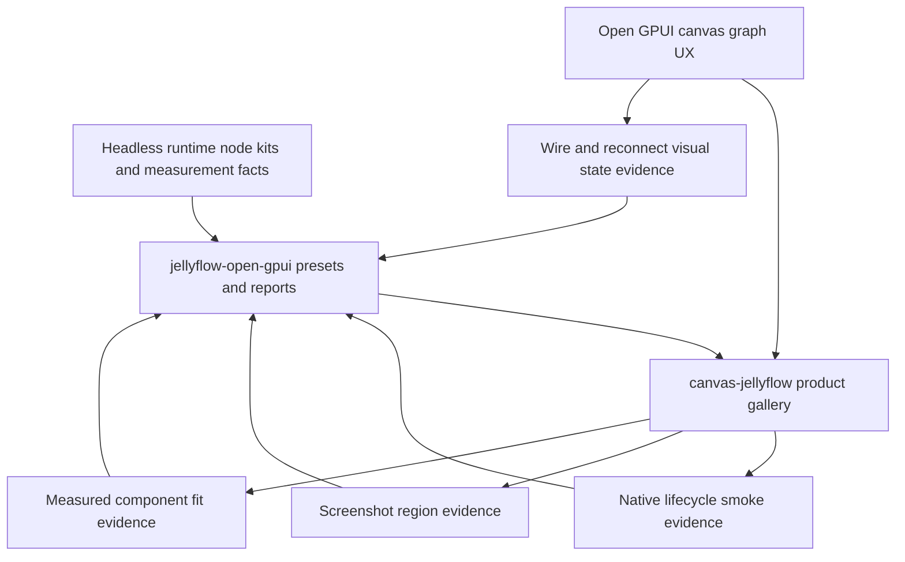
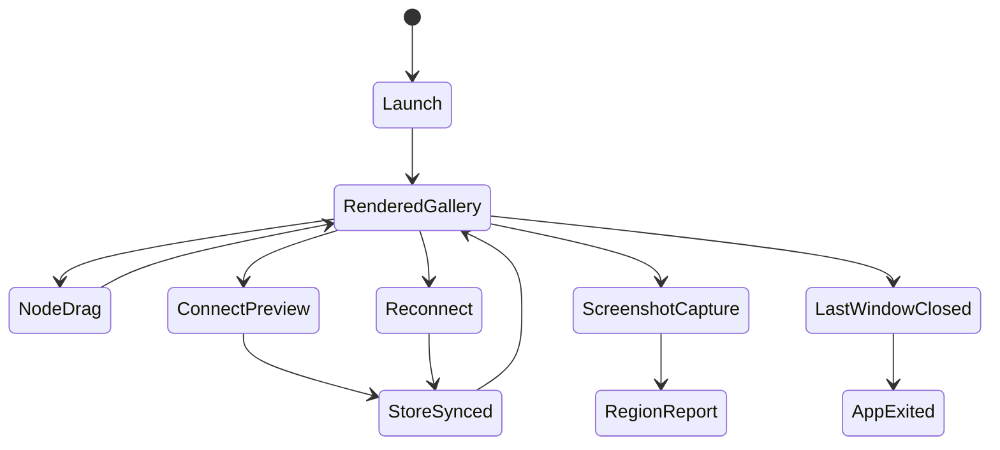

# Open GPUI Native UX Polish and Regression - Plan

## Goal Capsule

| Field | Value |
| --- | --- |
| Objective | Turn the Open GPUI product gallery from a structurally correct node UI into a native-feeling review surface with automated lifecycle smoke, stronger visual evidence, polished wires/ports/reconnect affordances, and node-internal UI that fits real text and controls. |
| Target repos | Jellyflow root and `repo-ref/open-gpui`. Paths are repo-relative to the Jellyflow root. |
| Source authority | User native review feedback, Open GPUI Canvas Node UI Foundations final state, Node UI Kit Component Contract, Open GPUI Node Component Kit decision, `jellyflow-open-gpui` product gates, Open GPUI canvas/test APIs, and current `canvas-jellyflow` product gallery code. |
| Execution profile | Deep Open GPUI-first product polish. Breaking `canvas-jellyflow`, `jellyflow-open-gpui`, and generic `repo-ref/open-gpui/crates/canvas` APIs is acceptable when it removes demo-only glue or creates reusable graph UX primitives. |
| Stop condition | A native reviewer can launch the gallery, close it cleanly, drag nodes, inspect readable Dify/shader/ERD/mind-map internals, select and reconnect wires, and trust automated gates to catch the regressions previously found by manual review. |
| Explicit non-goal | Do not add a shared widget crate, move Open GPUI widget types into runtime, build mature egui/Dioxus graph-tool parity, add workflow backend execution, compile shaders, add persistence/collaboration, or pursue full pixel-golden animation review in this slice. |

---

## Product Contract

### Summary

The current Open GPUI path has the right ownership boundary and passes structural gates, but manual review still carries too much of the product-quality burden.
This plan makes the next slice about reviewable native polish: lifecycle smoke must be automated enough to trust, screenshots must prove meaningful regions rather than only nonblank pixels, wires and reconnect handles must look and feel easier to use, and product node internals must handle long labels and dense controls without silent clipping.

### Problem Frame

The prior plan created the missing foundation: route-consistent previews, pointer capture, connection release events, graph affordance evidence, adaptive layout primitives, and product renderer rewrites.
That foundation still leaves a usability gap.
The test suite proves that the graph works; it does not yet prove that the native app closes cleanly through the window lifecycle, that screenshots contain the actual regions users inspect, or that long product content remains readable across default and reduced node sizes.

The right next direction is still Open GPUI-first.
Runtime should continue to own semantic descriptors, node kits, typed ports, measurement facts, and headless conformance.
Open GPUI canvas should own generic graph UX mechanics and visual state.
`jellyflow-open-gpui` should own widget-free evidence and regression gates.
`canvas-jellyflow` should own concrete components, layout policy, focus/menu behavior, and native product-gallery composition.

### Requirements

**Native lifecycle and smoke**

- R1. The Open GPUI example must have an automated or semi-automated native lifecycle smoke that opens the product gallery, proves the app enters a rendered state, simulates or verifies last-window close behavior, and leaves no running process behind.
- R2. macOS `QuitMode::LastWindowClosed` behavior must be covered through the closest available Open GPUI test API; any remaining manual-only gap must be explicit in structured evidence.
- R3. Native smoke must exercise the product gallery state, including a basic node-drag regression, not a blank test window, so lifecycle evidence is tied to the actual Jellyflow review surface.

**Visual evidence**

- R4. Screenshot smoke must graduate from nonblank-only evidence to product-region evidence for nodes, wires, ports, reconnect handles, and selected/invalid feedback where the renderer supports capture.
- R5. Visual regression reports must distinguish skipped, nonblank, region-present, and region-missing outcomes instead of treating every successful PNG as equally trustworthy.
- R6. ROI or region evidence must remain a review aid, not a pixel-golden oracle; structured geometry and interaction reports remain the hard correctness gate.

**Wires, ports, and reconnect**

- R7. Committed edges, previews, selected edges, hovered edges, invalid targets, reconnect handles, and configured route shapes must have distinct product visual states that are inspectable in paint frames and adapter reports.
- R8. Port and reconnect hit targets must remain easy to acquire while their visible affordances become clearer than translucent rectangles.
- R9. Reconnecting an endpoint to an alternate compatible port must be covered by a full pointer sequence at the generic canvas level and by a Jellyflow store-sync path in the product host.
- R10. Invalid reconnect and connect releases must show clear target feedback, roll back host document state, and avoid repeated planning-error noise on later frames.

**Node-internal component fit**

- R11. Dify, shader, ERD, topic, and source cards must fit long realistic labels, prompts, field names, model names, and source titles through measured region budgets, line clamps, compact rows, or explicit overflow affordances.
- R12. Product renderers must avoid silent clipping of controls and text at default launch, after fixture switches, after window resize, and at reduced node sizes used by tests.
- R13. Component layout primitives may grow inside `canvas-jellyflow`, but reusable semantics and evidence must stay widget-free in `jellyflow-open-gpui`.

**Adapter productization**

- R14. `jellyflow-open-gpui` must expose evidence structs and gate failures for native lifecycle coverage, screenshot region evidence, wire visual states, reconnect affordances, and component fit.
- R15. `canvas-jellyflow` must consume adapter gates and should not duplicate threshold policy that belongs in adapter presets.
- R16. Generic Open GPUI canvas improvements must stay independent of Jellyflow and be usable by other Open GPUI canvas consumers.

### Acceptance Examples

- AE1. Given the product gallery launches in a test context, when the last window is closed or the closest available close simulation runs, then the app records quit/closed evidence and no `open_gpui_canvas_jellyflow` process remains after the smoke.
- AE2. Given screenshot capture is available, when the gallery exports Dify, shader, ERD, and mind-map artifacts, then each artifact reports nonblank pixels plus expected node-body, wire, port, and product-region evidence, or it skips with a precise platform reason.
- AE3. Given a selected shader edge, when the user drags one reconnect handle to another compatible port, then the preview uses the configured route style, the handle is visually discoverable, the edge id is preserved, and the Jellyflow store commits the reconnect.
- AE4. Given an invalid reconnect target, when the endpoint is released, then invalid feedback is visible in the frame, the host projection is refreshed from the store, and later frames do not repeat the same planning error.
- AE5. Given a Dify prompt or ERD field with long text, when the node renders at default and reduced sizes, then important text fits via clamp/compact/overflow affordance and controls remain inside measured regions.
- AE6. Given a mind-map/source card at low or compact density, when relation/source content cannot fit, then the renderer shows shell/overflow evidence rather than publishing invisible full hit regions.

### Scope Boundaries

#### In Scope

- Open GPUI native test/smoke harness improvements for `canvas-jellyflow`.
- Screenshot ROI or region evidence for product-gallery review artifacts.
- Generic Open GPUI canvas visual state and hit-target polish for wires, ports, previews, reconnect handles, and invalid targets.
- Host-local component layout and text-fit improvements for the existing Dify, shader, ERD, topic, and source renderers.
- Widget-free `jellyflow-open-gpui` evidence and gates for the new native polish claims.
- Documentation and engineering memory updates after the implementation.

#### Deferred to Follow-Up Work

- Full pixel-golden visual regression with baselines and review tooling.
- Keyboard-only graph editing, complete focus-order maps, and screen-reader semantics.
- Advanced edge labels, edge toolbars, minimap polish, cable bundling, route avoidance, and animation review.
- Full Open GPUI layout-pass bound harvesting for arbitrary node-internal component trees.
- Promoting the host-local Open GPUI component kit into a public crate.
- Mature egui and Dioxus graph-tool UX parity for the new Open GPUI canvas mechanics.

#### Outside This Product's Identity

- Runtime-owned widgets or retained UI instances.
- Backend workflow execution, shader compilation, database persistence, collaboration, or cloud sync.
- A DOM/React adapter.

---

## Planning Contract

### Key Technical Decisions

- KTD1. Native lifecycle proof should extend Open GPUI's existing test context before adding app-specific process scripts. The current framework already has close simulation and quit-mode plumbing, so the first slice should improve or consume that path instead of relying only on timed `cargo run`.
- KTD2. Visual screenshots become region-evidence artifacts, not pixel goldens. This gives stronger native review confidence without freezing every antialiasing, font, and renderer detail.
- KTD3. Wire and reconnect polish belongs first in generic Open GPUI canvas. `canvas-jellyflow` may set product presets, but route paint, preview state, reconnect handles, hit testing, and target feedback should remain usable by non-Jellyflow canvas users.
- KTD4. Component fit stays host-local but evidence stays adapter-level. `node_component_kit` and product renderers can own pixel constants and GPUI composition, while `jellyflow-open-gpui` owns serializable fit and regression evidence.
- KTD5. The plan should harden the existing product gallery instead of creating a second demo. One native review surface keeps Dify, shader, ERD, and mind-map regressions visible in the same workflow users already run.

### High-Level Technical Design

### Assumptions

- The user has confirmed the next stage should stay Open GPUI-first and should not broaden into a shared cross-framework widget library.
- `repo-ref/open-gpui` may be changed on local `main` without pushing remote changes during this stage.
- Native close automation may require a small Open GPUI test-platform enhancement before `canvas-jellyflow` can prove app quit without a manual window click.
- Screenshot ROI evidence can be approximate and geometry-backed; it does not need stable pixel baselines in this slice.

### Local Evidence

- `repo-ref/open-gpui/examples/canvas-jellyflow/src/main.rs` already sets `QuitMode::LastWindowClosed`, builds the product gallery state, and has test-context coverage for drag, reconnect rollback, measured ports, and product interaction reports.
- `repo-ref/open-gpui/crates/gpui/src/app/test_context.rs` exposes `simulate_close`, while `repo-ref/open-gpui/crates/gpui/src/app.rs` contains the quit-on-empty-window behavior.
- `repo-ref/open-gpui/examples/canvas-jellyflow/src/gallery_screenshot.rs` exports nonblank product-gallery PNG artifacts and can be extended to report ROI metadata.
- `repo-ref/open-gpui/crates/canvas/src/gpui/painter.rs`, `frame.rs`, and `model.rs` already carry connection preview, reconnect handle, and target feedback paint paths.
- `repo-ref/open-gpui/examples/canvas-jellyflow/src/node_component_kit.rs` and `product_renderers.rs` already provide adaptive full/compact/shell layout primitives and renderer-specific region planning.
- `crates/jellyflow-open-gpui/src/testing.rs` is the existing hard gate surface for product interaction, host visual interaction, and product fixture evidence.

### Risks and Mitigations

| Risk | Mitigation |
| --- | --- |
| Native close behavior is hard to prove without a real macOS window. | First improve Open GPUI test-context close/quit evidence; keep a timed launch smoke as supporting evidence only. |
| Screenshot ROI checks become brittle across renderer/font/platform differences. | Base ROI checks on known product geometry and coarse nonblank/region-presence evidence, not exact pixels. |
| Wire visual polish spreads Jellyflow-specific policy into generic canvas. | Keep route and paint primitives generic; put Jellyflow policy choices in adapter presets and host gallery configuration. |
| Component fit fixes hide content instead of improving readability. | Require explicit line clamp, compact mode, shell mode, or overflow indicator evidence for every hidden region. |
| The example grows too much host-local complexity. | Move only widget-free reports and reusable graph mechanics upstream; leave concrete GPUI component composition local until reuse pressure appears. |

### Sequencing

Implement native lifecycle evidence first because it closes the current manual-smoke gap.
Then strengthen screenshot and visual evidence so later wire/component polish has review artifacts.
Wire and reconnect polish should precede adapter gate consolidation because the report fields need real canvas evidence.
Component fit can run after visual evidence exists, then final adapter gates and docs can lock the new boundary.

---

## Implementation Units

### U1. Automate Native Lifecycle Smoke Evidence

- **Goal:** Replace the current timed-launch-only native smoke with reusable Open GPUI test evidence for product-gallery launch and last-window-close behavior.
- **Requirements:** R1, R2, R3.
- **Dependencies:** None.
- **Files:** `repo-ref/open-gpui/crates/gpui/src/app/test_context.rs`, `repo-ref/open-gpui/crates/gpui/src/app.rs`, `repo-ref/open-gpui/examples/canvas-jellyflow/src/main.rs`, `repo-ref/open-gpui/examples/canvas-jellyflow/src/native_smoke.rs`, `docs/testing/node-ui-authoring-regression.md`.
- **Approach:** Start from the existing `simulate_close` and quit-mode plumbing. If the generic test context cannot observe quit-on-empty-window, add the smallest generic test-platform hook needed. The product host should open the same `JellyflowCanvasView` used by the gallery and report launch, render, close, and quit evidence as data.
- **Execution note:** Characterize the current close simulation before changing it; the expected failure is that the product gallery can launch but last-window-close quit evidence is incomplete.
- **Patterns to follow:** `gallery_screenshot::open_gallery_case_window`, `open_gpui::TestAppContext`, `QuitMode::LastWindowClosed`, existing `canvas_view_keeps_drag_state_while_syncing_product_surface_moves`.
- **Test scenarios:**
  - Product gallery opens through the test context and renders at least one product fixture before close simulation.
  - Dragging a product node in the smoke updates its observed position without resetting sibling product nodes.
  - Closing the last simulated window under `QuitMode::LastWindowClosed` marks the app as quit or records equivalent no-window evidence.
  - A non-product blank window cannot satisfy the `canvas-jellyflow` native smoke report.
  - If a platform cannot automate native close, the report carries an explicit skipped reason and the hard gate fails only when automation was expected.
- **Verification:** A focused Open GPUI app/test-context test proves quit-mode behavior, and the `canvas-jellyflow` full test suite includes native lifecycle evidence without leaving a running process.

### U2. Promote Screenshot Smoke to Product Region Evidence

- **Goal:** Make screenshots useful review artifacts by proving expected product regions are present when capture is available.
- **Requirements:** R4, R5, R6.
- **Dependencies:** U1.
- **Files:** `repo-ref/open-gpui/examples/canvas-jellyflow/src/gallery_screenshot.rs`, `repo-ref/open-gpui/examples/canvas-jellyflow/src/visual_regression.rs`, `repo-ref/open-gpui/examples/canvas-jellyflow/src/main.rs`, `crates/jellyflow-open-gpui/src/testing.rs`, `crates/jellyflow-open-gpui/src/lib.rs`, `docs/testing/node-ui-authoring-regression.md`.
- **Approach:** Extend screenshot export reports with coarse ROI metadata derived from product fixture geometry: node body, visible internal regions, wire path area, port area, and feedback overlays where present. Keep skip semantics honest for missing headless renderer support.
- **Patterns to follow:** `GalleryScreenshotExportReport`, `OpenGpuiHostVisualInteractionReport`, `assert_host_visual_interaction_report_gates`, existing product fixture catalog.
- **Test scenarios:**
  - When capture is available, every product fixture reports nonblank pixels plus at least one expected node-body ROI.
  - A synthetic blank or single-color image fails region evidence even if dimensions are nonzero.
  - A product fixture with visible ports but no port-region evidence fails the visual report gate.
  - A platform without headless capture reports a precise skip reason and no files.
- **Verification:** `canvas-jellyflow` screenshot smoke still writes PNG review artifacts when supported, and `jellyflow-open-gpui` gates reject missing ROI evidence.

### U3. Polish Generic Wire and Reconnect Visual States

- **Goal:** Make wires, previews, selected edges, invalid targets, and reconnect handles visually distinct and easier to inspect.
- **Requirements:** R7, R8, R16.
- **Dependencies:** U2.
- **Files:** `repo-ref/open-gpui/crates/canvas/src/gpui/model.rs`, `repo-ref/open-gpui/crates/canvas/src/gpui/frame.rs`, `repo-ref/open-gpui/crates/canvas/src/gpui/painter.rs`, `repo-ref/open-gpui/crates/canvas/src/gpui/style.rs`, `repo-ref/open-gpui/crates/canvas/src/tool/select.rs`, `repo-ref/open-gpui/crates/canvas/src/tool/context.rs`.
- **Approach:** Add generic paint/state vocabulary for wire visual states without naming Jellyflow. Reconnect handles should use endpoint-shaped affordances that are visible but do not shrink hit targets. Preview and invalid-target styles should derive from the same route policy as committed edges.
- **Execution note:** Prefer focused canvas-level tests first; this unit should not require the Jellyflow example to prove generic route and paint semantics.
- **Patterns to follow:** `connecting_preview_uses_configured_route_policy`, `reconnecting_preview_reuses_selected_edge_route_path`, `selected_edge_adds_reconnect_handles_to_paint_frame`, `connection_preview_style`.
- **Test scenarios:**
  - A selected edge frame includes reconnect affordances for both endpoints with hit bounds at or above the configured budget.
  - A reconnect preview reuses the selected edge route family and reports the correct target feedback state.
  - Straight, orthogonal, and smooth route policies remain distinguishable, and product fixtures do not silently fall back to direct-line previews.
  - Invalid target feedback paints a distinct state from free and valid target feedback.
  - Hovered and selected edge states can coexist without losing hit-test geometry.
- **Verification:** Generic Open GPUI canvas tests cover route, paint frame, painter style, input/tool, geometry, and runtime query behavior for the new states.

### U4. Harden Full Port and Reconnect Pointer Sequences

- **Goal:** Make endpoint switching and reconnect gestures reliable enough to match native node-graph expectations.
- **Requirements:** R8, R9, R10.
- **Dependencies:** U3.
- **Files:** `repo-ref/open-gpui/crates/canvas/src/tool/select.rs`, `repo-ref/open-gpui/crates/canvas/src/tool/context.rs`, `repo-ref/open-gpui/crates/canvas/src/tool.rs`, `repo-ref/open-gpui/examples/canvas-jellyflow/src/main.rs`, `crates/jellyflow-open-gpui/src/connection.rs`, `crates/jellyflow-open-gpui/src/testing.rs`.
- **Approach:** Strengthen the generic pointer sequence for selected-edge reconnect handles and make the product host consume the resulting release event through the Jellyflow reconnect planner. Invalid releases should surface once, refresh projection from store, and leave the editor ready for the next gesture.
- **Patterns to follow:** `select_tool_reconnects_selected_edge_source_handle`, `select_tool_reconnects_selected_edge_target_handle`, `selected_product_edge_reconnect_gesture_plans_jellyflow_transaction`, `rejected_product_edge_reconnect_refreshes_editor_from_store_projection`.
- **Test scenarios:**
  - Dragging a selected source reconnect handle to a compatible target preserves the edge id and commits a reconnect transaction.
  - Dragging a selected target reconnect handle to an alternate source preserves the edge id and commits a reconnect transaction.
  - Releasing on an incompatible port reports invalid feedback and rolls back host document state to the store projection.
  - Releasing on empty canvas reports a dropped reconnect outcome without corrupting the edge.
  - A second gesture after a rejection does not replay the previous planning error.
- **Verification:** Canvas tool tests and `canvas-jellyflow` product tests cover both source and target endpoint switching with store synchronization.

### U5. Tighten Product Component Fit and Text Readability

- **Goal:** Make node-internal UI adapt to realistic text and control density instead of only satisfying current geometry budgets.
- **Requirements:** R11, R12, R13.
- **Dependencies:** U2.
- **Files:** `repo-ref/open-gpui/examples/canvas-jellyflow/src/node_component_kit.rs`, `repo-ref/open-gpui/examples/canvas-jellyflow/src/product_renderers.rs`, `repo-ref/open-gpui/examples/canvas-jellyflow/src/visual_regression.rs`, `crates/jellyflow-open-gpui/src/presets.rs`, `crates/jellyflow-open-gpui/src/testing.rs`, `crates/jellyflow-runtime/src/schema/kit.rs`.
- **Approach:** Extend host-local layout primitives with text-fit and control-density evidence while keeping semantic budgets widget-free. Product renderers should use line clamps, compact rows, shell summaries, and visible overflow indicators for long prompts, ERD fields, shader parameters, and source titles.
- **Execution note:** Start with failing product-renderer tests using long realistic fixture data so the fix is driven by clipped content rather than by arbitrary constants.
- **Patterns to follow:** `AdaptiveNodeLayoutStack`, `adaptive_repeatable_list_plan`, `product_renderer_layouts_fit_runtime_readable_budgets`, `visual_gate_rejects_unreadable_product_content`.
- **Test scenarios:**
  - A Dify prompt with long text renders at default size without clipped controls and uses clamp/overflow evidence at reduced size.
  - Shader parameter names and values fit within port rail and control regions without hiding port anchors.
  - ERD field rows with long names and badges remain readable or report explicit overflow.
  - Topic and source titles degrade to compact/shell summaries without publishing invisible full hit regions.
  - Runtime readable-size budgets remain renderer-neutral and do not import Open GPUI types.
- **Verification:** Product renderer tests, host visual interaction gates, and runtime schema tests agree on readable budgets and explicit overflow evidence.

### U6. Consolidate Adapter Evidence and Hard Gates

- **Goal:** Promote native lifecycle, screenshot region, wire visual state, reconnect sequence, and component fit claims into `jellyflow-open-gpui` report gates.
- **Requirements:** R14, R15, R16.
- **Dependencies:** U1, U2, U3, U4, U5.
- **Files:** `crates/jellyflow-open-gpui/src/testing.rs`, `crates/jellyflow-open-gpui/src/presets.rs`, `crates/jellyflow-open-gpui/src/lib.rs`, `repo-ref/open-gpui/examples/canvas-jellyflow/src/main.rs`, `repo-ref/open-gpui/examples/canvas-jellyflow/src/visual_regression.rs`, `repo-ref/open-gpui/examples/canvas-jellyflow/src/gallery_screenshot.rs`.
- **Approach:** Add serializable evidence fields and gate failures only after the host can produce real data. Keep screenshots supporting; hard gates should be structured reports that fail for missing lifecycle, missing ROI, direct-line preview fallback, unreachable reconnect handles, hidden overflow without indicators, and unreadable content.
- **Patterns to follow:** `assert_product_interaction_report_gates`, `assert_host_visual_interaction_report_gates`, `OpenGpuiGraphAffordanceEvidence`, `OpenGpuiHostProductInteractionReport`.
- **Test scenarios:**
  - A report with no native lifecycle evidence fails the product gate.
  - A report with screenshots but no region evidence fails the visual gate.
  - A report with selected/reconnect wire state missing fails the product interaction gate.
  - A report with long-text clipping and no overflow indicator fails the visual gate.
  - A fully productized report for all gallery fixture families passes.
- **Verification:** `jellyflow-open-gpui` nextest covers every new failure mode and the `canvas-jellyflow` example consumes the stricter gates.

### U7. Update Docs, Memory, and Native Review Instructions

- **Goal:** Record the refined product-polish boundary so future work does not mistake screenshot artifacts for correctness or move widgets into runtime.
- **Requirements:** R6, R13, R14, R15, R16.
- **Dependencies:** U6.
- **Files:** `docs/testing/node-ui-authoring-regression.md`, `crates/jellyflow-open-gpui/README.md`, `docs/knowledge/engineering/current-state.md`, `docs/knowledge/engineering/log.md`, `docs/knowledge/engineering/decisions/open-gpui-node-component-kit.md`, `docs/knowledge/engineering/decisions/node-ui-kit-component-contract.md`.
- **Approach:** Update docs with the final native smoke command, automated close evidence limits, screenshot region evidence, graph UX gates, component fit gates, and remaining deferred work. Keep the docs honest about Open GPUI being the mature target for this stage.
- **Test scenarios:**
  - Documentation names Open GPUI as the mature adapter target without claiming egui/Dioxus parity for native graph UX.
  - Regression docs explain native lifecycle, screenshot region, wire/reconnect, and component fit gates.
  - Engineering memory cites this plan and records any residual manual smoke or pixel-golden follow-up.
- **Verification:** Documentation links are repo-relative, memory validates, and diff checks pass.

---

## Verification Contract

| Gate | Applies To | Done Signal |
| --- | --- | --- |
| `cargo fmt --all -- --check` | Jellyflow root | Formatting passes for root crates and docs-adjacent Rust changes. |
| `cargo fmt --manifest-path repo-ref/open-gpui/examples/canvas-jellyflow/Cargo.toml -- --check` | Open GPUI example | Example formatting passes. |
| `git diff --check` and `git -C repo-ref/open-gpui diff --check` | Both worktrees | No whitespace, conflict markers, or accidental generated artifact edits. |
| `cargo nextest run -p jellyflow-open-gpui --no-fail-fast` | Adapter reports and gates | Native lifecycle, screenshot region, wire visual state, reconnect, and component fit gates pass. |
| `cargo nextest run -p jellyflow-runtime -p jellyflow-egui -p jellyflow-proof --lib --no-fail-fast` | Headless and non-GPUI adapters | Runtime semantics and existing adapter contracts remain intact. |
| `cargo test -p jellyflow-runtime --test public_surface -- --nocapture` | Runtime public API | Public surface remains intentional. |
| `cargo test --manifest-path repo-ref/open-gpui/crates/canvas/Cargo.toml --lib -- --nocapture --test-threads=1` | Generic Open GPUI canvas | Route, painter, input/tool, geometry, reconnect, and runtime query tests pass. |
| `cargo test --manifest-path repo-ref/open-gpui/examples/canvas-jellyflow/Cargo.toml --features open_gpui_platform/runtime_shaders --bin open-gpui-canvas-jellyflow -- --nocapture --test-threads=1` | Product host | Product gallery interaction, layout, screenshot region, native lifecycle, and rollback tests pass. |
| Native launch smoke | User review surface | App launches, renders product gallery internals, shows wires/ports/reconnect handles, supports node drag, and exits on last-window close or records an explicit unsupported automation reason. |

---

## Definition of Done

- U1 proves product-gallery native lifecycle behavior through automated close/quit evidence or records an explicit platform automation limitation.
- U2 makes screenshot artifacts region-aware while keeping screenshots as review aids rather than goldens.
- U3 makes generic Open GPUI wire, preview, selected, invalid, and reconnect visual states inspectable and reusable.
- U4 covers full reconnect endpoint switching through generic canvas pointer sequences and Jellyflow store synchronization.
- U5 makes Dify, shader, ERD, topic, and source internals handle long realistic content through fit, compact, shell, or overflow evidence.
- U6 promotes all new native UX claims into widget-free `jellyflow-open-gpui` gates and keeps `canvas-jellyflow` as the concrete host.
- U7 updates docs and engineering memory with the refined boundary, verification commands, and deferred follow-ups.
- Runtime/core/layout crates remain free of Open GPUI, egui, Dioxus, DOM, and widget lifecycle types.
- `repo-ref/open-gpui/crates/canvas` remains Jellyflow-independent.
- Abandoned proof-only helpers, duplicate thresholds, stale screenshot-only claims, and misleading capability claims are removed or demoted before handoff.
