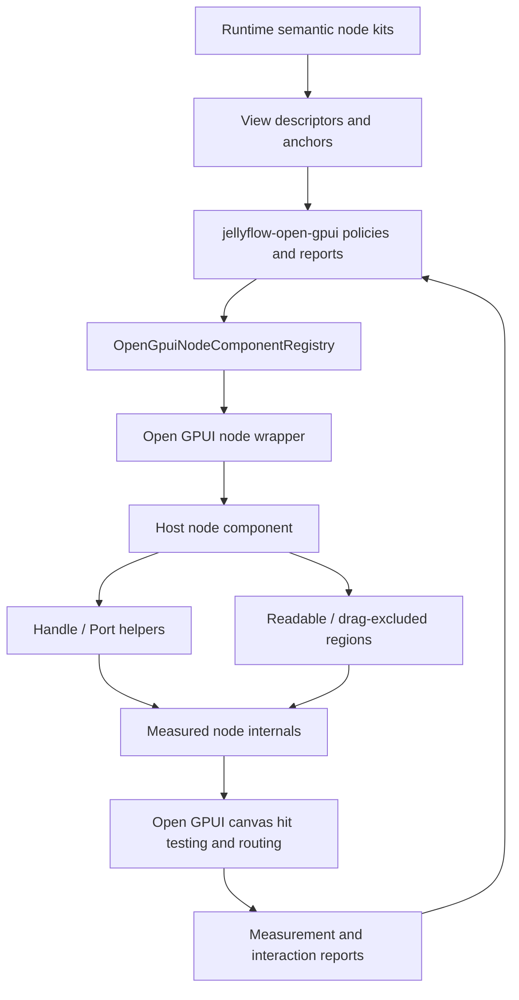
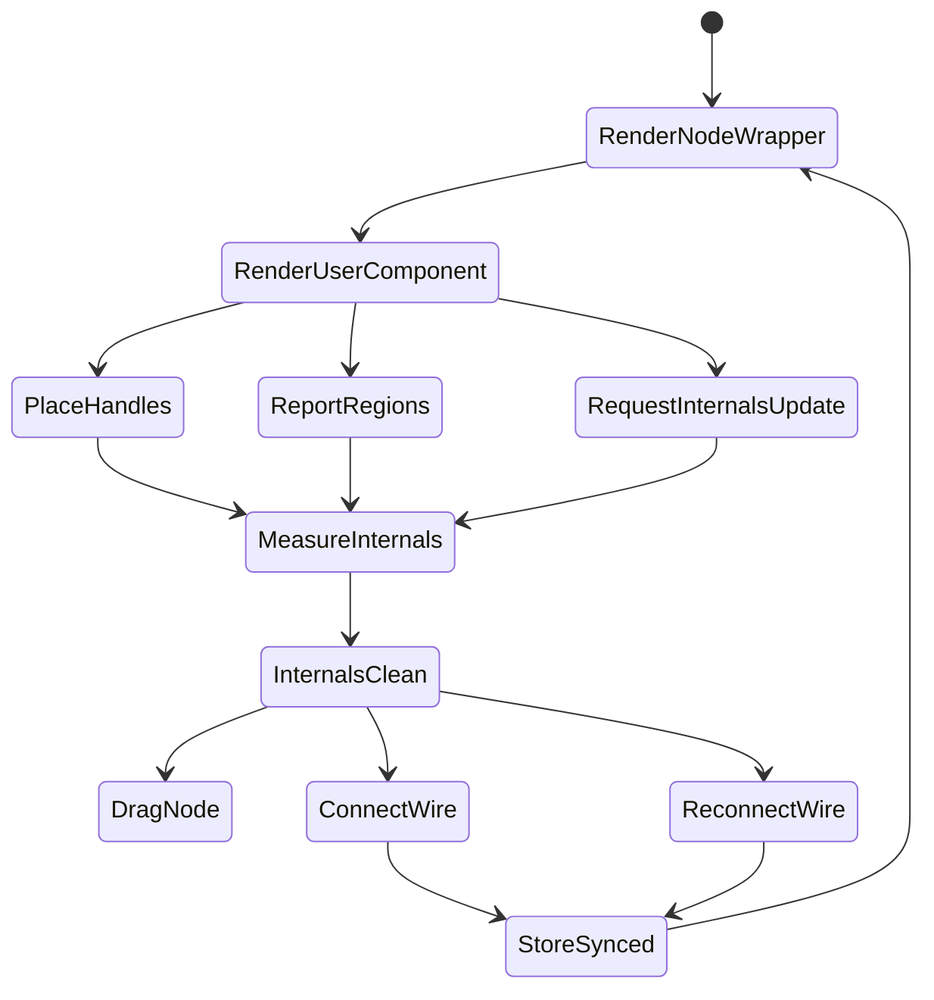

# Open GPUI XYFlow-Style Node Components - Plan

## Goal Capsule

| Field | Value |
| --- | --- |
| Objective | Replace adapter-level heuristic component-fit contracts with a cleaner XYFlow-style node component boundary for Open GPUI: user components own internal UI, Jellyflow/Open GPUI own node containers, handles, measured internals, graph interaction, and structured evidence. |
| Target repos | Jellyflow root and `repo-ref/open-gpui`. Paths are repo-relative to the Jellyflow root. |
| Source authority | User direction to delete hacky fit abstractions, local `repo-ref/xyflow` node/handle measurement model, local `repo-ref/egui-snarl` viewer/pin/wire model, current `jellyflow-open-gpui` adapter gates, and `canvas-jellyflow` product-gallery implementation. |
| Execution profile | Fearless breaking refactor. Delete demo-only or heuristic code when it weakens the public abstraction. Keep the library boundary small, measurement-backed, and Open GPUI-first. |
| Stop condition | The Open GPUI example can render Dify/shader/ERD/mind-map node internals through an explicit node component seam, connection endpoints follow measured handles, and no public adapter API claims text/control fit by character-count or preset-height heuristics. |
| Explicit non-goal | Do not build a shared cross-framework widget crate, mature egui/Dioxus adapters, backend workflow execution, shader compilation, persistence, or a DOM/React adapter in this slice. |

---

## Product Contract

### Summary

The previous native UX slice improved the product gallery, but it also promoted a weak idea too far: `jellyflow-open-gpui` now exposes component-fit budgets and evidence that estimate text/control fit from line counts, character width, and preset heights.
That is not how mature node-graph libraries scale.

XYFlow keeps the boundary sharper:

- The library wraps each node in a container that owns selection, drag, focus, visibility, z-index, and measurement.
- The host/user registers the actual node component and places handles inside that component.
- The library observes real node and handle bounds, then routes edges and hit tests from measured internals.
- Optional pieces such as node toolbars and resizers are composable additions, not internal-layout oracles.

egui-snarl points to the same product lesson in native Rust form:

- The graph container owns graph state, nodes, pins, wires, connect/disconnect effects, and wire routes.
- A `SnarlViewer` owns concrete node header/body/footer/pin UI.
- Pins return structured pin/wire information, while the graph still owns hit testing and connection effects.

Jellyflow should adopt that mature shape for Open GPUI.
Runtime stays semantic and headless.
Open GPUI adapter/reporting stays widget-free.
The Open GPUI host owns concrete node UI.
The bridge between them is measured internals and explicit component/handle registration, not guessed fit.

### Problem Frame

Current code mixes three different concerns:

1. Product node UI wants to adapt labels, controls, repeatable rows, and compact/shell modes.
2. The adapter wants hard evidence that a host is not hiding content, overflowing bounds, or losing ports.
3. The graph engine needs real node/handle geometry for dragging, connecting, reconnecting, routing, and hit testing.

The mistake is that adapter evidence currently tries to predict UI fit with host-local constants:

- `OpenGpuiComponentFitBudget`
- `OpenGpuiComponentFitEvidence`
- `adaptive_text_plan`
- `adaptive_control_row_plan`
- visual report code that re-runs these host heuristics

Those names make a temporary product-gallery workaround look like a reusable library contract.
The next refactor should delete or demote that surface and replace it with a deeper interface:

- node component registry
- node component props/context
- handle/port helper contract
- measured node internals report
- explicit stale/dirty update path
- graph interaction evidence that consumes measured internals

### Requirements

**Boundary cleanup**

- R1. Remove `OpenGpuiComponentFitBudget` from the public `jellyflow-open-gpui` preset/export surface.
- R2. Remove adapter hard gates that infer correctness from text line budgets, fixed control heights, or estimated character widths.
- R3. Keep coarse semantic sizing hints such as default/preferred/min-readable node size only if they remain descriptor-level layout hints, not proof that internal UI fits.
- R4. Keep style and interaction budgets only for graph affordances that the library owns: handle hit width, edge hit width, route family, reconnect affordance size, and drag/readable region counts.

**Node component seam**

- R5. Introduce an Open GPUI-first node component seam equivalent to XYFlow's `nodeTypes` + `NodeWrapper` split.
- R6. The seam must pass explicit component props: node id, node kind/type, semantic data, selected/dragging/disabled/connectable state, measured or requested size, density, renderer key, and access to a host context.
- R7. Component rendering must be host-local. `jellyflow-runtime` and `jellyflow-open-gpui` must not import Open GPUI element/widget types unless the crate is specifically the Open GPUI adapter.
- R8. The component seam must allow Dify, shader graph, ERD, topic/source, and future custom nodes to compose their own internal controls without adapter code guessing their layout.

**Real measurement and internals**

- R9. Add or formalize a measured node internals report that records actual node bounds, handle bounds, readable regions, drag-excluded regions, and update source.
- R10. Dynamic handle changes must have an explicit `request_node_internals_update` or equivalent host facade, analogous to XYFlow's `useUpdateNodeInternals`.
- R11. Repeated identical measurement reports must not churn revisions, reorder ports, or reset node positions.
- R12. Projection fallback must be honest: reports may mark inferred/projected internals, but product gates must not treat projected text/control fit as real component fit.

**Handle/port componentization**

- R13. Introduce a host-local Open GPUI `Handle`/`Port` helper or measured-region API so components can place visible and hittable endpoints inside their own UI.
- R14. Each measured handle must include stable id, role/direction, side/position, node id, bounds, connectability, and optional visual/wire style metadata.
- R15. Dynamic repeatable rows must bind ports to actual measured handles, not to row-index heuristics.
- R16. Internal controls must be able to opt out of drag/pan/keyboard graph gestures, matching XYFlow's `nodrag`/`nopan`/input shielding concept.

**Connection and wire UX**

- R17. Edge routing and reconnect hit testing must consume measured handle centers/bounds, not node side defaults when measured handles exist.
- R18. Route families should be first-class and testable: straight, bezier, smooth/axis-aligned, orthogonal/step, and custom future routers.
- R19. Preview, committed edge, selected edge, invalid target, and reconnect handles must have distinct visual states.
- R20. Reconnect to an alternate compatible port must be covered by a full pointer sequence in generic canvas tests and by Jellyflow host store-sync tests.

**Evidence and regression**

- R21. Replace component-fit evidence with measurement coverage evidence: real bounds present, handle coverage present, stale count, fallback count, interaction region coverage, and overflow indicators that the component explicitly reports.
- R22. Screenshot/visual artifacts may remain as review aids, but they must not masquerade as layout or text-fit truth.
- R23. Product gates should fail on missing measured internals, stale handles, endpoints not following handles, hidden content without explicit component-reported overflow, or missing interaction-region coverage.
- R24. Documentation must clearly state that Jellyflow does not provide a cross-framework widget crate and does not predict arbitrary node-internal UI fit.

### Acceptance Examples

- AE1. Given a Dify node component with long labels and controls, when it renders in Open GPUI, then the graph library receives measured node/handle/interaction regions and no adapter budget estimates text line fit.
- AE2. Given a shader node adds or removes a dynamic input port, when the component requests internals update, then measured handle bounds refresh and existing edges reroute without resetting node positions.
- AE3. Given an ERD field row handle is placed inside the row component, when the user drags a wire to it, then hit testing uses that measured handle and the committed edge endpoint follows the same bounds.
- AE4. Given a component cannot show all repeatable rows, when it reports an explicit overflow region/indicator, then product evidence records component-declared overflow instead of guessing hidden rows from row budgets.
- AE5. Given a visual regression row, when measured internals are missing or projected, then the gate reports a measurement coverage gap rather than pretending component fit passed.
- AE6. Given a selected edge, when the user reconnects it to another compatible port, then the route preview, target feedback, and final edge all use the configured route family and measured handle positions.

### Scope Boundaries

#### In Scope

- Breaking refactor of `crates/jellyflow-open-gpui` public preset/testing APIs.
- Breaking refactor of `repo-ref/open-gpui/examples/canvas-jellyflow` component-kit and product-renderer internals.
- Generic Open GPUI canvas changes needed for measured handles, route styles, hit testing, reconnect affordances, and control shielding.
- Documentation updates that retract the previous component-fit budget/evidence direction.
- Tests that prove the new measurement-backed seam and connection behavior.

#### Deferred Follow-Up Work

- Public `jellyflow-open-gpui-components` crate or reusable GPUI component library.
- Mature egui/Dioxus adapters. This plan should keep the semantic pattern portable, but implementation targets Open GPUI only.
- Full golden-image visual regression.
- Advanced routing such as obstacle avoidance, cable bundling, edge labels, minimap polish, and edge toolbars.
- Runtime-owned widget lifecycle, retained UI trees, or framework-specific widgets in `jellyflow-runtime`.

#### Outside This Product's Identity

- Backend execution for Dify-like workflows.
- Shader compilation or Unity/Unreal runtime graph semantics.
- Database persistence, cloud sync, or collaboration.
- React/DOM compatibility as an implementation target.

---

## Planning Contract

### Key Technical Decisions

- KTD1. Jellyflow runtime remains semantic/headless. Runtime may describe fields, controls, anchors, slots, semantic node kinds, and layout hints, but it must not own concrete widgets or framework layout behavior.
- KTD2. Open GPUI is the only mature adapter target for this phase. The seam should be portable in shape, but code quality matters more than pretending to support egui/Dioxus now.
- KTD3. `jellyflow-open-gpui` should expose measurement/report contracts and product policies, not a UI fit oracle. If a value cannot be derived from real measurement or explicit component reporting, it should not be a hard adapter gate.
- KTD4. `canvas-jellyflow` may keep host-local layout helpers, but those helpers must not leak through public adapter APIs. Product-gallery UI may be opinionated; library contracts must stay small.
- KTD5. Handles are component-owned placements and graph-owned interactions. Components place/report handles; canvas owns connect/reconnect state, hit testing, route previews, and edge commits.
- KTD6. Deleting weak code is preferred over wrapping it. Historical plans can mention old names, but active APIs, README claims, and gates should converge on measured internals.

### Mature-Product Reference Model

| Reference | Keep | Avoid |
| --- | --- | --- |
| XYFlow `NodeWrapper` | Library container owns drag/select/focus/z-index/measurement and passes props to custom node components. | Library guessing custom-node internal layout. |
| XYFlow `Handle` | User places handles inside custom nodes; library measures handle bounds and drives connection state. | Side-default ports as the only endpoint model. |
| XYFlow `useUpdateNodeInternals` | Explicit remeasure hook for dynamic handles and node internals. | Assuming port layout only changes with node kind. |
| XYFlow `NodeToolbar` / `NodeResizer` | Optional composable helpers layered around nodes. | Baking every product UI affordance into core node rendering. |
| egui-snarl `SnarlViewer` | Viewer owns header/body/footer/pin UI while container owns graph state and effects. | One renderer trying to be both graph engine and product component framework. |
| egui-snarl `PinInfo` / wire styles | Pins carry wire metadata; routes are first-class style choices. | Edge style hidden behind renderer heuristics. |

### High-Level Technical Design





### Target Module Boundaries

| Module | Owns | Must Not Own |
| --- | --- | --- |
| `jellyflow-runtime` | Semantic node kinds, fields, slots, anchors, descriptor hints, graph data contracts. | GPUI widgets, egui widgets, text fitting, wire painting. |
| `jellyflow-open-gpui` | Open GPUI adapter policies, serializable reports, measurement evidence, preset defaults, conformance gates. | Host component layout heuristics, arbitrary text/control fit budgets, retained UI instances. |
| `repo-ref/open-gpui/crates/canvas` | Generic canvas interaction, pointer capture, pan/zoom, drag, selection, handles, edge routes, hit testing, reconnect state. | Jellyflow product fixtures or Dify/shader/ERD-specific UI. |
| `repo-ref/open-gpui/examples/canvas-jellyflow` | Product gallery, concrete GPUI node components, local component-kit helpers, fixture rendering, screenshot artifacts. | Public adapter policy, cross-framework abstractions, graph-engine rules. |
| Docs/plans/tests | Contract decisions, migration notes, regression expectations. | Claims that heuristic fit is a stable library guarantee. |

### Deletion Targets

Delete or demote these active surfaces unless implementation discovers a strictly better name/scope:

- `OpenGpuiComponentFitBudget` in `crates/jellyflow-open-gpui/src/presets.rs`
- `OpenGpuiProductSurfacePreset::component_fit_budget`
- `OpenGpuiComponentFitEvidence` as a text/control fit oracle in `crates/jellyflow-open-gpui/src/testing.rs`
- visual gate gaps whose only source is heuristic fit: `ComponentFitEvidenceMissing`, `ComponentFitEvidenceIncomplete`, `ComponentOverflowIndicatorMissing` as currently defined
- host calls to `adaptive_text_plan` and `adaptive_control_row_plan` when they feed adapter evidence
- `component_fit_evidence(...)` in `repo-ref/open-gpui/examples/canvas-jellyflow/src/visual_regression.rs`
- README/testing/decision docs that present component-fit budgets as the adapter-owned direction

Keep only if renamed and re-scoped:

- semantic/default/min/preferred node size hints from descriptors
- graph affordance budgets for hit targets and route policy
- host-local layout helpers that improve the example but do not leak into `jellyflow-open-gpui`
- component-declared overflow indicators or measured readable regions

### Implementation Units

#### U1. Delete Public Heuristic Fit Budget

**Goal:** Remove the public adapter API that makes text/control fit look like a reusable Open GPUI contract.

**Files**

- `crates/jellyflow-open-gpui/src/presets.rs`
- `crates/jellyflow-open-gpui/src/lib.rs`
- `crates/jellyflow-open-gpui/README.md`
- `docs/testing/node-ui-authoring-regression.md`
- `docs/knowledge/engineering/decisions/open-gpui-node-component-kit.md`

**Steps**

1. Delete `OpenGpuiComponentFitBudget`.
2. Remove `component_fit_budget` from `OpenGpuiProductSurfacePreset`.
3. Remove public re-exports for the deleted budget.
4. Preserve descriptor-derived sizing hints as coarse node-size policy only.
5. Update README/docs to say component layout is host-owned and adapter evidence is measurement-backed.

**Tests**

- Adjust preset serialization/unit tests to assert graph affordance and size hints, not component-fit budgets.
- `rg "OpenGpuiComponentFitBudget|component_fit_budget|full_text_line_budget"` should only find historical plan text if at all.

#### U2. Replace Component Fit Evidence With Measured Internals Evidence

**Goal:** Make visual/product gates prove real graph/component integration facts.

**Files**

- `crates/jellyflow-open-gpui/src/testing.rs`
- `repo-ref/open-gpui/examples/canvas-jellyflow/src/visual_regression.rs`
- any report builders that currently call `.with_component_fit_evidence(...)`

**Steps**

1. Replace `OpenGpuiComponentFitEvidence` with a measurement-oriented struct, tentatively `OpenGpuiMeasuredInternalsEvidence`.
2. Track fields such as:
   - `node_bounds_source`
   - `node_bounds_present`
   - `handle_bounds_present`
   - `measured_handle_count`
   - `projected_handle_count`
   - `readable_region_count`
   - `drag_exclusion_region_count`
   - `stale_region_count`
   - `component_declared_overflow_count`
   - `missing_required_overflow_count`
3. Replace fit-specific visual gaps with coverage gaps:
   - missing internals evidence
   - incomplete measured internals
   - projected internals used as hard proof
   - missing component-declared overflow
4. Keep legacy text/control overflow row fields only if they come from explicit host measurement or component reporting.

**Tests**

- Gate rejects missing internals evidence.
- Gate rejects projected-only handle bounds for product proof.
- Gate accepts explicit component overflow without requiring text-line estimation.
- Existing product interaction evidence continues to compile and pass.

#### U3. Introduce Open GPUI Node Component Registry

**Goal:** Create the host-facing seam that replaces renderer-specific branching with registered components.

**Files**

- `repo-ref/open-gpui/examples/canvas-jellyflow/src/node_component_kit.rs`
- `repo-ref/open-gpui/examples/canvas-jellyflow/src/product_renderers.rs`
- `repo-ref/open-gpui/examples/canvas-jellyflow/src/main.rs`
- optionally a new `repo-ref/open-gpui/examples/canvas-jellyflow/src/node_components.rs`

**Steps**

1. Define host-local `OpenGpuiNodeComponentProps`.
2. Define host-local `OpenGpuiNodeComponentContext` for actions such as reporting handles, reporting regions, shielding controls, and requesting internals update.
3. Define `OpenGpuiNodeComponentRegistry` keyed by renderer key or node kind.
4. Move Dify/shader/ERD/topic/source renderers behind registry entries.
5. Make renderer fallback explicit and evidence-producing.

**Tests**

- Registry resolves all product fixtures.
- Fallback renderer records a missing-component gap.
- Selection/dragging/connectable props reach component rendering.

#### U4. Add Measured Internals Update Facade

**Goal:** Support dynamic ports and component-size changes without position resets or stale routes.

**Files**

- `repo-ref/open-gpui/crates/canvas/src/gpui/*` as needed
- `repo-ref/open-gpui/examples/canvas-jellyflow/src/main.rs`
- `repo-ref/open-gpui/examples/canvas-jellyflow/src/node_component_kit.rs`

**Steps**

1. Add an explicit `request_node_internals_update(node_id)` or equivalent host facade.
2. Add a report path for measured node bounds, handle bounds, readable regions, and drag-excluded regions.
3. Ensure identical measurements are ignored or coalesced.
4. Ensure dynamic handle changes mark internals dirty and reroute edges after measurement.

**Tests**

- Dynamic shader input add/remove refreshes handle bounds.
- Repeated same measurement does not increment revisions or reset positions.
- Node drag after internals update preserves positions.

#### U5. Replace Heuristic Text/Control Planning in Product Evidence

**Goal:** Keep useful product UI layout, but stop using it as adapter truth.

**Files**

- `repo-ref/open-gpui/examples/canvas-jellyflow/src/node_component_kit.rs`
- `repo-ref/open-gpui/examples/canvas-jellyflow/src/product_renderers.rs`
- `repo-ref/open-gpui/examples/canvas-jellyflow/src/visual_regression.rs`

**Steps**

1. Delete `adaptive_text_plan` and `adaptive_control_row_plan` if their only remaining use is fit evidence.
2. If the example still needs host-local clamps/shell modes, move them behind product component code with names that do not imply adapter correctness.
3. Replace visual-regression fit synthesis with measurement coverage and component-declared overflow.
4. Keep repeatable layout planning only where it reserves actual component rows or explicit overflow UI.

**Tests**

- `rg "adaptive_text_plan|adaptive_control_row_plan"` should be clean unless retained under a clearly host-local non-gate name.
- Dify/shader/ERD/mind-map reports include measured internals coverage.

#### U6. Component-Owned Handles and Control Shielding

**Goal:** Make ports feel like part of node UI while remaining graph-owned interaction points.

**Files**

- `repo-ref/open-gpui/examples/canvas-jellyflow/src/node_component_kit.rs`
- `repo-ref/open-gpui/examples/canvas-jellyflow/src/product_renderers.rs`
- `repo-ref/open-gpui/crates/canvas/src/gpui/*` as needed

**Steps**

1. Add host-local handle helper APIs for visible handle, hit region, direction, and side.
2. Report handle bounds from actual rendered regions.
3. Add control shielding equivalent to `nodrag`/`nopan` for internal inputs, menus, toggles, and future editors.
4. Bind repeatable-row handles to stable semantic ids.

**Tests**

- Clicking internal controls does not start node drag or pan.
- Handle hit tests use measured handle bounds.
- Repeatable-row handles preserve ids across reorder/add/remove.

#### U7. Wire Route and Reconnect Polish on Measured Handles

**Goal:** Make connection UX stronger than the current line/rectangle affordances.

**Files**

- `repo-ref/open-gpui/crates/canvas/src/gpui/painter.rs`
- `repo-ref/open-gpui/crates/canvas/src/gpui/frame.rs`
- `repo-ref/open-gpui/crates/canvas/src/gpui/model.rs`
- product host tests in `repo-ref/open-gpui/examples/canvas-jellyflow/src/main.rs`

**Steps**

1. Promote route family to a clear canvas setting or per-edge/per-port policy.
2. Support and test straight, bezier, axis-aligned/smoothstep, and orthogonal families where the canvas already has primitives or can add small router functions.
3. Improve reconnect handle visibility and hit target while keeping product styling configurable.
4. Ensure invalid target feedback and release rollback use measured handles.

**Tests**

- Generic canvas tests cover route style selection and hit testing.
- Jellyflow host tests cover reconnect to alternate port and invalid rollback.
- Edge endpoints follow measured handles after node drag, resize, and internals update.

#### U8. Documentation, Memory, and Migration Notes

**Goal:** Make future agents and users see the corrected abstraction immediately.

**Files**

- `docs/knowledge/engineering/current-state.md`
- `docs/knowledge/engineering/log.md`
- `docs/knowledge/engineering/decisions/node-ui-kit-component-contract.md`
- `docs/knowledge/engineering/decisions/open-gpui-node-component-kit.md`
- `docs/testing/node-ui-authoring-regression.md`
- `crates/jellyflow-open-gpui/README.md`

**Steps**

1. Add a decision note: no adapter-owned arbitrary UI fit oracle.
2. Update node-kit docs to describe semantic descriptors plus Open GPUI-local component mapping.
3. Update testing docs from fit gates to measured internals gates.
4. Record this plan and the deletion targets in engineering memory.

**Tests**

- `rg "component fit budget|OpenGpuiComponentFitBudget|fit oracle"` should not find active docs that present the old model as current direction.

### Verification Contract

Run these after implementation:

```bash
cargo fmt --all -- --check
cargo nextest run -p jellyflow-open-gpui --no-fail-fast
cargo nextest run -p jellyflow-runtime -p jellyflow-egui -p jellyflow-proof --lib --no-fail-fast
cargo test -p jellyflow-runtime --test public_surface -- --nocapture
RUSTFLAGS='-Aunexpected_cfgs' cargo test --manifest-path repo-ref/open-gpui/crates/canvas/Cargo.toml --lib -- --nocapture --test-threads=1
RUSTFLAGS='-Aunexpected_cfgs' cargo test --manifest-path repo-ref/open-gpui/examples/canvas-jellyflow/Cargo.toml --features open_gpui_platform/runtime_shaders --bin open-gpui-canvas-jellyflow -- --nocapture --test-threads=1
cargo fmt --manifest-path repo-ref/open-gpui/examples/canvas-jellyflow/Cargo.toml -- --check
git diff --check
```

Expected known noise:

- Existing Open GPUI `unexpected_cfgs` / `gpui_macos` warnings remain out of scope unless this work changes those crates.

### Definition of Done

- `OpenGpuiComponentFitBudget` is gone from public adapter API.
- Adapter visual/product gates no longer pass or fail based on estimated text lines, guessed character width, or preset control heights.
- The product gallery renders Dify/shader/ERD/mind-map nodes through an explicit Open GPUI node component seam.
- Components can place/report handles inside their own UI, and graph edges consume measured handle bounds.
- Dynamic port changes have an explicit internals update path and do not reset node positions.
- Connection/reconnect UX uses measured endpoints and has route-family coverage.
- Docs and engineering memory state the corrected boundary: headless semantic descriptors plus Open GPUI-local component mapping, not shared widgets and not adapter-owned arbitrary UI fit.

### Rollback Strategy

Because this is intentionally breaking, rollback should be by commit boundary, not by keeping compatibility shims.
If a deletion removes too much, restore the smallest missing semantic fact under the new measured-internals names rather than resurrecting `ComponentFitBudget` or text/control line-budget gates.

### Open Questions for Implementation

- Does current Open GPUI expose enough element bounds from layout to report handles without extending core APIs, or should we add a small measured-region helper in `repo-ref/open-gpui/crates/gpui`?
- Should the node component registry remain example-local for one more iteration, or move into `jellyflow-open-gpui` once the seam stabilizes?
- Should route family be owned per renderer key, per edge kind, or per handle metadata for the first implementation?
- What is the smallest manual visual artifact that still lets us review Dify/shader/ERD/mind-map polish after removing fit heuristics?

