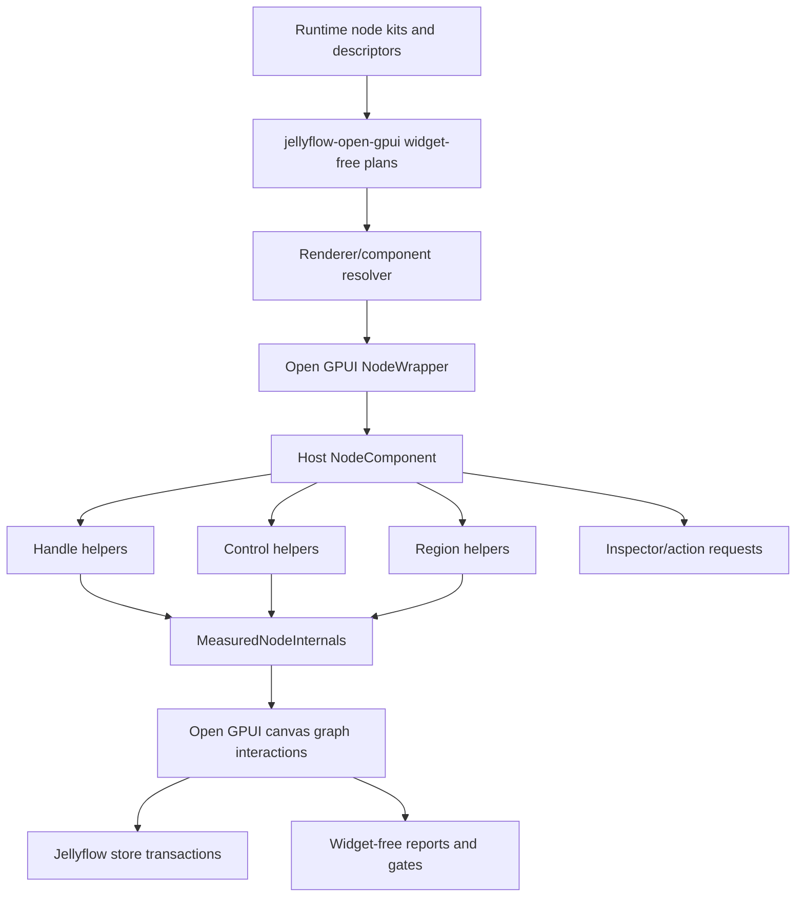
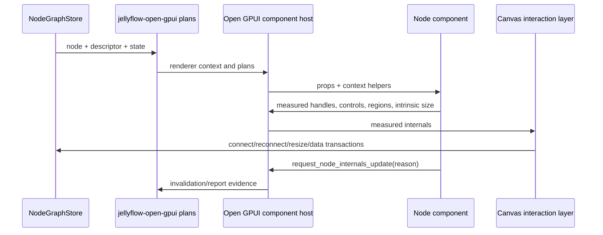

# Open GPUI Component Host Seam - Research and Refactor Plan

## Goal Capsule

| Field | Value |
| --- | --- |
| Objective | Stabilize Jellyflow's Open GPUI node-component foundation so Dify-style workflow nodes, shader/blueprint nodes, ERD/table nodes, and mind-map nodes use one measured component host seam instead of repeated product-renderer rewrites. |
| Primary target | `repo-ref/open-gpui/examples/canvas-jellyflow` and supporting generic Open GPUI canvas hooks. |
| Supporting target | `crates/jellyflow-open-gpui` only for widget-free plans, reports, and gates. |
| Source authority | Local reference clones under `repo-ref/` for XYFlow, Rete, BaklavaJS, Dify, Node-RED, egui-snarl, egui_node_graph2, and LiteGraph.js; current Jellyflow runtime schema; current Open GPUI canvas-jellyflow implementation. |
| Execution profile | Fearless breaking refactor. Delete duplicate, shallow, or heuristic component abstractions when they obscure the true boundary. |
| Stop condition | Product nodes render through one Open GPUI component host seam; handles, controls, drag-exclusion regions, readable regions, overflow, and intrinsic size are reported by real host measurement or explicit component declarations; routing/reconnect/selection consume those facts. |
| Explicit non-goal | Do not create a cross-framework widget crate, mature egui/Dioxus adapters, backend workflow runtime, shader compiler, or Dify clone in this slice. |

---

## Research Synthesis

### Reference Matrix

| Reference | What to adopt | What to avoid |
| --- | --- | --- |
| XYFlow | `NodeWrapper` owns graph interaction and measurement; custom node components get props; `Handle` elements are placed by user components; `useUpdateNodeInternals` explicitly remeasures dynamic internals. | DOM-specific assumptions and custom-node text fitting inside the graph library. |
| Rete | Separate node semantic model from UI controls; inputs, outputs, controls, and editor events are stable graph concepts. | Making the editor UI event pipe the runtime data model. |
| BaklavaJS | `NodeInterface` supports component metadata and dynamic node updates with stable ids; graph validates connections centrally. | Letting renderer-side dynamic rows mutate graph topology without a transaction contract. |
| Dify | A unified base node shell plus node handles, status, block selector, edge insert menu, and right-side node panels. Node cards stay compact while complex config lives in panels. | Copying ReactFlow/Tailwind component structure or baking Dify business concepts into Jellyflow runtime. |
| Node-RED | Node registration, defaults, validation, typed inputs, editable lists, dynamic outputs, and quick edge/node insertion are product-contract lessons. | Fixed node-size and port-position heuristics built for simple rectangular nodes. |
| egui-snarl | `SnarlViewer` is a deep native seam: header/body/footer/pins/menus are custom, while graph state and connect/disconnect effects stay owned by the graph. | A single renderer that owns both product UI and graph rules. |
| egui_node_graph2 | Traits split value widgets, data types, node data, and node templates; inline widgets are explicit. | Immediate-mode trait shape as the Open GPUI retained component API. |
| LiteGraph.js | Shader-style nodes add inputs, outputs, widgets, and connection positions explicitly; wire styles and edge insertion are productized. | Monolithic object model mixing execution, drawing, hit testing, and UI. |

### Current Jellyflow Facts

Jellyflow already has the semantic pieces that earlier gaps listed as missing:

- `NodeControlDescriptor`, `NodeControlKind`, control binding, validation, presentation, and editability.
- `NodeRepeatableCollectionDescriptor` plus stable item projection and anchor rules.
- `ActionTarget`, `ActionIntent`, `NodeActionDescriptor`, `MenuDescriptor`, `MenuSurface`.
- `BlackboardDescriptor`.
- `NodeSurfaceSlotDescriptor`, `NodeChromeDescriptor`, ports with `PortViewDescriptor`.
- `jellyflow-open-gpui` projection/planning modules for controls, actions, repeatables, inspector, measurement, and testing.

The missing piece is not more descriptor vocabulary. The missing piece is a stable Open GPUI host seam that turns those descriptors into local components and reports real internals back to the graph.

### Main Diagnosis

The implementation is currently correct in direction but unstable in module depth:

- `jellyflow-open-gpui::renderer` has a renderer registry, semantic context, host context, output source, and fallback model.
- `canvas-jellyflow/src/node_component_kit.rs` adds a second `OpenGpuiNodeComponentRegistry`, but this registry only stores `renderer_key` and `label`.
- The actual component render table is a product-renderer local `BTreeMap` in `product_renderers.rs`.
- Product renderer helpers now contain real UI behavior, measurement wrappers, controls, actions, repeatables, and adaptive layout. That is useful, but the seam is too spread out to be stable.
- Layout-pass measurement consumption and fallback projection policy still sit too close to `canvas-jellyflow/src/main.rs`, so the example owns more adapter mechanics than it should.
- Projection fallback is currently convenient enough that it can mask missing real GPUI layout-pass facts.
- Gesture shielding is still partly incidental: controls and drag surfaces rely on local event handling rather than a first-class measured interaction-region contract.
- Handle placement still has two paths: real measured anchors/handles and projected or hidden fallback anchors.

This creates repeated redesign pressure: every time a Dify/shader/ERD/mind-map issue appears, the fix has to decide again whether it belongs in runtime descriptors, adapter plans, component-kit helpers, product renderers, visual gates, or generic canvas.

---

## Direction

### Decision

Keep the established architecture:

```text
headless semantic runtime -> widget-free open-gpui plans/reports -> Open GPUI host-local components
```

Then deepen the Open GPUI host-local component layer.

Do not promote GPUI widget types into `jellyflow-runtime` or the current widget-free `jellyflow-open-gpui` policy/report layer. If a reusable GPUI widget crate is needed later, create it only after the example-local host seam stabilizes and after Open GPUI dependency boundaries are explicit.

### Why This Is The Correct Direction

XYFlow succeeds because the graph library does not know custom node internals; it knows node wrappers, measured DOM bounds, and handles. egui-snarl succeeds because graph state and effects stay in `Snarl`, while `SnarlViewer` owns concrete UI. Dify succeeds because product complexity is split between compact graph nodes and full configuration panels.

Jellyflow should be the Rust/Open GPUI equivalent:

- Runtime owns semantic graph and node-kit data.
- `jellyflow-open-gpui` owns adapter plans, mutation planning, measurement contracts, and tests.
- Open GPUI canvas owns pointer capture, viewport transforms, hit testing, wires, reconnect, and selection.
- Host components own the actual GPUI element tree, local layout, local widgets, and explicit region registration.

---

## Proposed Architecture





### Component Host Interface

The next refactor should replace the shallow example-local component registry with one host seam. The exact Rust names can change during implementation, but the shape should be:

```rust
pub struct OpenGpuiNodeComponentProps {
    pub node_id: NodeId,
    pub node_kind: String,
    pub renderer_key: String,
    pub title: String,
    pub selected: bool,
    pub hovered: bool,
    pub focused: bool,
    pub dragging: bool,
    pub disabled: bool,
    pub connectable: bool,
    pub size_policy: OpenGpuiNodeSizePolicy,
    pub node_size: CanvasSize,
    pub node_data: Value,
    pub surface: OpenGpuiNodeRendererContext,
}

pub struct OpenGpuiNodeComponentContext<'a, Services> {
    pub services: &'a Services,
    pub actions: OpenGpuiNodeComponentActions,
    pub measurement: OpenGpuiNodeComponentMeasurement,
    pub interaction: OpenGpuiNodeComponentInteraction,
}
```

The host context should provide helpers, not hidden layout guesses:

- `handle(port_key, role, options, child)` wraps a visible GPUI element, records measured handle bounds, and registers the canvas hit target.
- `control_region(control_key, child)` records control bounds and shields graph drag/pan/keyboard gestures.
- `readable_region(key, child)` records text/content bounds for evidence.
- `drag_exclusion(key, child)` records regions where node dragging should not start.
- `overflow(key, indicator)` records component-declared overflow.
- `request_node_internals_update(reason)` schedules a real remeasure, analogous to XYFlow's update-internals hook.
- `open_inspector`, `dispatch_action`, `dispatch_control`, and `dispatch_repeatable` emit plans through the existing authoring facade.

### Widget-Free Adapter Helpers

`jellyflow-open-gpui` should stay widget-free, but it can still deepen the adapter-facing helper layer:

- `NodeSurfacePlan`: descriptor, node data, graph state, viewport, and product preset resolved into render-planning facts.
- `NodeInternalsReporter`: measured regions converted into `NodeMeasurement` and revision decisions before store reporting.
- `NodeInteractionRegions`: drag surfaces, drag exclusions, readable regions, control shields, resize handles, and menu triggers as serializable evidence.
- `NodeComponentHostContext`: semantic lookups, measurement ids, authoring plans, dropped-wire menus, inspector targets, and blackboard plans.

These helpers should not import `open_gpui::AnyElement`; the concrete element wrapping remains in the host layer.

### Registry Consolidation

There should be one semantic renderer resolver and one concrete host render table:

- Keep or rename `jellyflow-open-gpui::OpenGpuiNodeRendererRegistry` as the widget-free renderer capability resolver.
- Delete the example-local label-only `OpenGpuiNodeComponentRegistry` unless it becomes the concrete render table.
- Use a single host table keyed by `renderer_key` for actual GPUI rendering functions.
- Ensure fallback rendering goes through the same `NodeWrapper`, measurement, handle, and interaction path.

This mirrors XYFlow's `nodeTypes`: the library resolves node type, wraps it, and calls the component. It does not maintain a second parallel registration concept.

### Size Policy

Stop treating text/control fit as a library oracle. Replace it with explicit size authority:

| Policy | Meaning | Example |
| --- | --- | --- |
| `Fixed` | Graph node size is authoritative; component clips or declares overflow. | compact workflow node in a fixed card |
| `Intrinsic` | Component reports preferred size; host applies it when node is first materialized or when data changes. | mind-map/topic nodes |
| `Resizable` | User size is authoritative within min/preferred constraints; component reports overflow if constrained. | Dify container, ERD table |

The host may use semantic `default_size`, `preferred_size`, and `min_readable_size` as initial constraints, but correctness must come from measured internals and explicit overflow reporting.

### Node-Inside UI Product Model

Adopt the Dify/Node-RED split:

- Node card: title, icon, status, port handles, compact summary, key inline controls, validation badges, quick actions.
- Inspector/panel: full configuration, variable picker, code editor, long text, asset selection, advanced repeatable lists, runtime logs.
- Graph/edge menu: add node, insert between nodes, reconnect, delete, duplicate, change kind, layout actions.
- Blackboard: graph-level variables, reusable symbols, palette context, diagnostics, and candidate nodes.

This keeps graph nodes readable and draggable while still supporting complex product workflows.

### Interaction Regions

Graph interaction must consume component-reported regions:

| Region | Graph behavior |
| --- | --- |
| node drag surface | starts node drag after threshold |
| control region | does not start node drag/pan; keyboard goes to widget |
| handle hit region | starts connect/reconnect or opens port menu |
| resize handle | starts resize |
| menu trigger | opens host menu without dragging |
| readable region | evidence only unless explicitly interactive |

This is the native equivalent of XYFlow's `nodrag`/`nopan` classes, but measurement-backed and not DOM-dependent.

---

## Alternatives Considered

### Option A: Keep evolving product renderers directly

**Pros**

- Fastest for one visual issue.
- Minimal public API movement.

**Cons**

- Every new product family reopens the same boundary question.
- The current duplicate registry shape remains.
- Measurement, actions, controls, and layout helpers stay scattered across product renderers.

**Decision**: Rejected. This is the source of the current churn.

### Option B: Promote a shared cross-framework widget crate

**Pros**

- Appears to solve reuse across GPUI, egui, and Dioxus.

**Cons**

- GPUI retained UI, egui immediate mode, Dioxus DOM-like components, and self-drawn canvas have incompatible widget lifecycles.
- It would leak framework concepts into semantic node kits.
- Current user goal only requires mature Open GPUI support.

**Decision**: Rejected for this stage.

### Option C: Add `open_gpui` types to `jellyflow-open-gpui`

**Pros**

- Component host could become a single public adapter crate.

**Cons**

- The current crate is intentionally widget-free and can be tested without the forked Open GPUI workspace.
- It would make descriptor/report planning harder to reuse and publish later.
- It would blur the successful policy/report vs host-widget split.

**Decision**: Rejected now. Revisit only if a separate `jellyflow-open-gpui-host` crate is created with explicit dependency boundaries.

### Option D: Build one Open GPUI host seam first

**Pros**

- Matches XYFlow and egui-snarl's mature separation.
- Lets Open GPUI mature without claiming cross-framework widgets.
- Keeps runtime semantic and `jellyflow-open-gpui` widget-free.
- Gives Dify/shader/ERD/mind-map examples one stable component foundation.

**Cons**

- Requires breaking refactor of the example-local product renderer structure.
- Requires stronger measurement and interaction contracts before visual polish feels stable.

**Decision**: Chosen.

---

## Implementation Plan

### U1. Consolidate Renderer And Component Registration

**Goal**: Delete duplicate registry concepts and make renderer resolution a single flow.

**Work**

- Remove or replace the example-local label-only `OpenGpuiNodeComponentRegistry`.
- Keep one host render table keyed by `renderer_key`.
- Route Dify, shader, ERD, mind-map, and fallback nodes through one `NodeWrapper` entry.
- Ensure fallback nodes still report measured internals and drag/handle regions.

**Definition of Done**

- Searching for component registration shows one semantic resolver and one concrete host render table.
- No product renderer bypasses the wrapper.
- Existing product-gallery tests still pass after rerouting.

### U2. Introduce Open GPUI NodeWrapper And Component Context

**Goal**: Make selection, hover, focus, drag state, node chrome, measurement collector, actions, and control dispatch available through a deep host context.

**Work**

- Extract wrapper responsibilities from `main.rs` and `product_renderers.rs`.
- Add `OpenGpuiNodeComponentProps` with stable selected/hovered/focused/dragging/disabled/connectable fields.
- Add host context helpers for actions, controls, repeatables, inspector, blackboard, and internals invalidation.
- Keep concrete GPUI `AnyElement` usage in the host/example layer.

**Definition of Done**

- Product renderers no longer receive ad hoc bags of services.
- Component code can request an internals update without touching store internals directly.
- Context helpers are small and testable.

### U3. Make Handles Component-Owned And Graph-Consumed

**Goal**: Handles are visible GPUI elements placed by components and measured by the host, while canvas owns hit testing and graph effects.

**Work**

- Add a host helper for port/handle elements.
- Record stable handle id, node id, port key, direction, side, bounds, connectability, style, and measurement source.
- Remove remaining side-default endpoint assumptions where measured handles exist.
- Ensure repeatable item ports bind by stable item/anchor ids rather than row index.
- Replace hidden off-screen anchor tricks with explicit `handle()` or `anchor()` helper calls.
- Treat projection fallback as an initial/missing/dirty fallback only; product maturity tests should report fallback as a gap.

**Definition of Done**

- Shader dynamic inputs and ERD field-row ports route from measured handle bounds.
- Reconnect can target alternate compatible ports.
- Product tests fail if a visible port lacks a measured handle.
- Product fixture reports do not claim complete measured internals when handle or anchor endpoints came from projection fallback.

### U4. Add Intrinsic Size And Overflow Contract

**Goal**: Fix clipped text and node-size instability without heuristic text fitting.

**Work**

- Add host-local `OpenGpuiNodeSizePolicy`: fixed, intrinsic, resizable.
- Let components report preferred/min/intrinsic size from real layout pass when available.
- Apply initial intrinsic size through a stable graph transaction only when policy allows it.
- Preserve user-resized dimensions under `Resizable`.
- Record explicit component overflow indicators for hidden repeatable rows or clipped content.

**Definition of Done**

- Dify, ERD, and mind-map nodes no longer rely on character-count fit predictions.
- Text clipping is either eliminated by size policy or accompanied by explicit overflow evidence.
- Measurement changes do not reset unrelated node positions.

### U5. Normalize Control, Drag-Exclusion, And Keyboard Shielding

**Goal**: Make node dragging feel native while controls remain usable.

**Work**

- Wrap text inputs, selects, switches, sliders, buttons, and menus with measured control regions.
- Ensure graph drag starts only from drag-eligible regions.
- Ensure controls can consume pointer and keyboard events without canvas interference.
- Lock box-select coordinate origin and viewport transform behavior with tests.

**Definition of Done**

- Dragging a node is consistent across Dify/shader/ERD/mind-map nodes.
- Clicking controls does not start node drag.
- Box-select starts at the visual pointer position in canvas coordinates.

### U6. Split Node Card, Inspector, Menu, And Blackboard Product Surfaces

**Goal**: Make Dify/Node-RED-style product complexity explicit.

**Work**

- Keep node card renderers compact: summary, status, handles, limited inline controls.
- Route long forms, variable pickers, code editors, asset pickers, and debug/log views to inspector plans.
- Route edge insertion, dropped-wire node selection, and graph menus through action/menu plans.
- Keep blackboard descriptors as graph-level data sources for variable/palette/diagnostic surfaces.

**Definition of Done**

- At least one Dify-style node uses node card plus inspector plan rather than putting all config into the card.
- Edge insert and dropped-wire insert share action/menu planning.
- Product renderer code stops owning graph-global state directly.

### U7. Tighten Evidence And Regression Gates

**Goal**: Make the hard gates prove measured behavior, not visual guesses.

**Work**

- Gate on measured internals coverage: node bounds, handles, controls, drag exclusions, readable regions, overflow declarations, stale/fallback counts.
- Gate route/reconnect against measured handles.
- Keep screenshot output as review evidence only.
- Add product family fixtures for Dify, shader, ERD, and mind-map.

**Definition of Done**

- `jellyflow-open-gpui` tests reject missing or stale measured internals.
- `canvas-jellyflow` product tests cover dynamic handles, reconnect, control shielding, intrinsic sizing, and overflow.
- No public API claims arbitrary text/control fit.

### U8. Documentation And Memory Closeout

**Goal**: Make the new boundary durable for future sessions.

**Work**

- Update engineering memory and docs to mark component host seam as the next baseline.
- Amend old plan language that could imply shared widgets or heuristic fit.
- Document when to promote an example-local host seam into a dedicated `jellyflow-open-gpui-host` crate.

**Definition of Done**

- Current-state memory points to this plan.
- ADR 0008/0009 remain valid; add a new ADR only if the host crate boundary becomes permanent.
- Next `ce-work` can execute without re-researching component ownership.

---

## Deletion And Cleanup Targets

Delete or merge:

- Example-local `OpenGpuiNodeComponentRegistry` if it remains only label/key metadata.
- Parallel component and renderer registries when one resolver plus one host table is enough.
- Product-renderer service bags that duplicate `OpenGpuiNodeRendererHostContext`.
- Example-owned layout-pass measurement submission code that can be expressed as a widget-free adapter helper plus host-local measured element wrappers.
- Hidden anchor or off-screen measurement hacks used only to satisfy endpoint fallback paths.
- Any remaining public or test evidence that estimates arbitrary UI fit from text length, line count, or fixed row height.
- Row-index-based port binding for repeatable fields when stable anchors or item ids exist.

Keep:

- Runtime semantic descriptors for slots, controls, repeatables, actions, menus, inspector, blackboard, chrome, and ports.
- `jellyflow-open-gpui` widget-free plans and report contracts.
- Host-local GPUI layout helpers when they are private implementation detail.
- Screenshot smoke artifacts as review aids.

---

## Success Metrics

| Metric | Target |
| --- | --- |
| Registry depth | One semantic renderer resolver and one concrete host render table. |
| Measurement coverage | Product fixtures report node bounds, handle bounds, control regions, drag exclusions, readable regions, and overflow declarations. |
| Fallback honesty | Projection fallback is counted as missing maturity evidence for product fixtures, not as complete measured internals. |
| Dynamic ports | Shader and ERD repeatable ports update without node-position reset and without row-index endpoint drift. |
| Drag quality | Node drag, control shielding, box-select, connect, reconnect, and dropped-wire insert pass pointer-sequence tests. |
| Product split | Dify-style full config lives in inspector/panel plans; graph card stays readable and compact. |
| Headless boundary | No framework widget type enters `jellyflow-runtime`; current `jellyflow-open-gpui` remains widget-free unless a separate host crate is explicitly introduced. |

---

## Risks And Mitigations

| Risk | Severity | Likelihood | Mitigation |
| --- | --- | --- | --- |
| Host seam becomes another shallow wrapper | High | Medium | Delete duplicate registry first; make measurement/action/control helpers the real leverage. |
| Intrinsic sizing causes layout churn | High | Medium | Apply only through explicit size policy and unchanged-measurement revision checks. |
| Components hide graph handles inside complex UI | High | Medium | Gate visible handles against measured handle reports. |
| Inspector work expands into a full app framework | Medium | Medium | Keep inspector as plans and host-local UI, not runtime state. |
| Open GPUI fork-specific APIs block future publish | Medium | Medium | Keep widget-free crate separate; delay dedicated host crate until dependency boundary is stable. |
| Product examples overfit to Dify | Medium | Medium | Validate against shader, ERD, and mind-map fixtures in the same gate. |

---

## Recommended Next Goal

Use this plan as the next `ce-work` target.

Start with U1-U3 before visual polish. The main instability is the shallow/duplicated component seam, not the card styling itself. Once renderer registration, wrapper/context, and measured handles are stable, Dify/shader/ERD/mind-map UI polish becomes ordinary host-component work instead of architecture churn.
