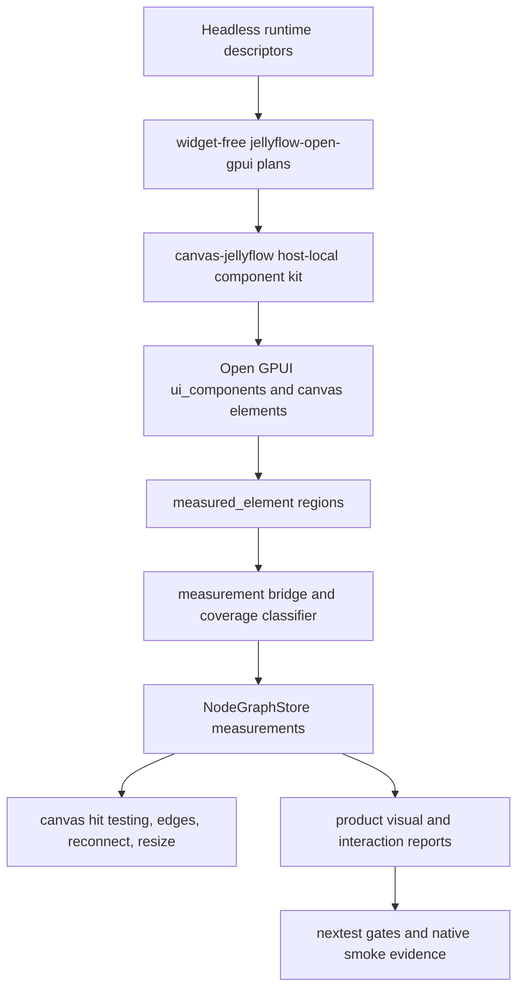
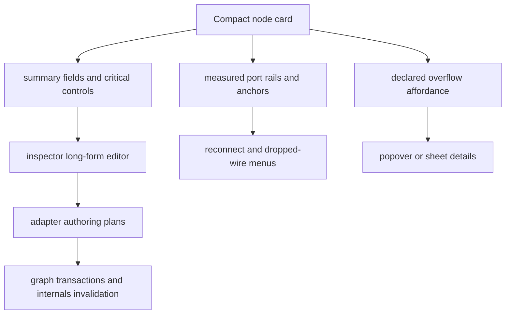

## Goal Capsule

| Field | Decision |
|---|---|
| Objective | Make the Open GPUI adapter feel product-ready for Dify-style workflow cards, shader graph nodes, ERD tables, and mind-map/source nodes by relying on real layout-pass evidence, host-local component atoms, and richer product surfaces. |
| Authority | Runtime remains headless; `jellyflow-open-gpui` defines widget-free contracts and evidence; `repo-ref/open-gpui/examples/canvas-jellyflow` owns concrete Open GPUI widgets and product composition. |
| Execution profile | Deep refactor across adapter evidence, Open GPUI host components, canvas interaction reports, fixtures, and docs. Breaking changes and deletion of obsolete host helpers are allowed when they simplify the boundary. |
| Stop conditions | Stop if a requirement would require a shared cross-framework widget crate, a backend workflow/shader engine, or a product behavior decision not covered by this plan. |
| Tail ownership | Execute through `ce-work` or goal mode against this plan; progress is derived from git, not written into this artifact. |

---

## Product Contract

### Summary

The next stage should turn the current Open GPUI proof into a cleaner product reference: nodes should display usable internal UI, ports and reconnect affordances should follow measured internals, and product reports should distinguish real layout evidence from projection fallback.
The core positioning remains unchanged: Jellyflow is a Rust headless node graph runtime plus adapter contracts, and Open GPUI is the first mature concrete host.

### Problem Frame

Recent work proved semantic node surfaces, component host rendering, dynamic repeatables, menus, inspectors, and measured interaction regions.
The remaining gap is product trust.
Some reports and visuals can still be satisfied through projection fallback, several advanced controls are still stubs, and product renderers contain bespoke layout constants that make Dify/shader/ERD/mind-map polish harder to evolve.
This plan replaces heuristic polish with measured evidence and host-local component composition.

### Requirements

**Measurement and evidence**

- R1. Layout-pass measurements from Open GPUI `measured_element` are authoritative for product readiness when available, while projection fallback remains an initial or degraded state that reports as such.
- R2. Product visual gates must prove readable text, control bounds, repeatable rows, anchors, and overflow from measured regions rather than text-length or surface-budget guesses.
- R3. Measurement refresh must not break node dragging, reconnecting, resizing, viewport resize, or edge endpoint synchronization.

**Product node UI**

- R4. Dify workflow, shader graph, ERD table, and mind-map/source fixtures must render usable node-internal UI in compact cards without clipped core text or hidden controls.
- R5. Long-form editing belongs in inspector, blackboard, menu, or popover surfaces instead of forcing every field into the compact node card.
- R6. Semantic controls for text, textarea, number, select, switch, slider, code, color, asset, variable, and port binding must report native, fallback, stub, or unsupported status with visible degradation and tests.
- R7. Dynamic repeatable slots must keep add, remove, reorder, overflow, anchor binding, and reconnect affordances coherent after edits.

**Adapter and framework boundary**

- R8. Runtime/core crates stay toolkit-free, and `jellyflow-open-gpui` stays widget-free except for adapter plans, measurement facts, authoring plans, evidence, and test fixtures.
- R9. Concrete Open GPUI widgets stay host-local in `canvas-jellyflow` unless a later plan promotes them into a dedicated Open GPUI host crate.
- R10. The design must not introduce a shared widget crate for egui, Dioxus, GPUI, or web; other frameworks map the same semantic contracts locally.

### Acceptance Examples

- AE1. Given a Dify-style decision node, when it is selected and edited, then the compact node card keeps model, prompt summary, status, actions, and handles readable while the inspector carries long-form prompt/config fields.
- AE2. Given a shader node with dynamic inputs, when an input is added, removed, reordered, or reconnected, then measured handles and edge endpoints follow the current row without stale projection fallback.
- AE3. Given an ERD table node, when the card is compact, then table rows have readable height, field overflow is declared, and detailed field editing is available outside the compressed row.
- AE4. Given mind-map/source fixtures, when the gallery opens or the window resizes, then nodes start non-overlapping, remain draggable, and do not pin the product cards to the viewport top.
- AE5. Given missing or dirty layout-pass regions, when host reports are generated, then the report names projection fallback or stale coverage and does not claim full product readiness.

### Scope Boundaries

In scope: Open GPUI product reference polish, measurement evidence, host-local component atoms, inspector/blackboard/menu surfaces, dynamic repeatable UX, reconnect/drag stability, and visual/report gates.

Deferred to follow-up work: a dedicated `jellyflow-open-gpui-host` crate, Dioxus or egui mature adapters, backend workflow execution, shader compilation, persistence, and full accessibility audits beyond the available Open GPUI component primitives.

Outside this product's identity: a DOM clone of XYFlow, a universal cross-framework widget crate, and hidden fit heuristics that guess text or control sizes without renderer evidence.

---

## Planning Contract

### Key Technical Decisions

- KTD1. Demote projection fallback from proof to degraded evidence. Fallback remains useful for initial projection and missing/dirty measurements, but product readiness gates should fail or warn when fallback is the only proof.
- KTD2. Keep component atoms host-local. Open GPUI cards, fields, rows, rails, and menus should live in the example host while `jellyflow-open-gpui` exposes only semantic plans, ids, authoring plans, measurement facts, and evidence structs.
- KTD3. Split compact cards from long-form surfaces. Dify, shader, ERD, and mind-map cards should summarize and expose key controls; inspector, blackboard, menu, and popover surfaces should carry dense editing.
- KTD4. Replace fit heuristics with measurement contracts. Readability and clipping checks should use measured readable/control/overflow regions plus component-declared overflow, not inferred string length or fixed text budgets.
- KTD5. Touch generic Open GPUI canvas APIs only for reusable measurement, hit-test, close-lifecycle, or interaction-region fixes. Product layout and component styling should stay in `canvas-jellyflow`.
- KTD6. Use existing `ui_components` before inventing new widgets. `Button`, `TextInput`, `Textarea`, `Select`, `Switch`, `Slider`, `NumberInput`, `Menu`, `Table`, `Tooltip`, `Popover`, `Sheet`, `Sidebar`, and related primitives are the preferred host-local building blocks.

### High-Level Technical Design

### Assumptions

- Open GPUI remains the only mature adapter target for this phase.
- The current `repo-ref/open-gpui/crates/ui_components` crate is available to the example and should be preferred over bespoke widgets where it fits.
- Fixture-level native screenshot or smoke tests can be strengthened without requiring a full end-to-end GUI automation framework.
- Some advanced controls may remain fallback or stub if Open GPUI does not yet expose an appropriate primitive, but the gap must be visible in reports and UI.

### Sources and Research

- `docs/knowledge/engineering/current-state.md` records the current architecture direction and the next-action focus on product polish plus real layout-pass bound harvesting.
- `docs/plans/2026-07-02-006-refactor-open-gpui-component-host-seam-plan.md` is the baseline seam plan: host-local components, size policy, measured ids, and no shared widget crate.
- `crates/jellyflow-open-gpui/README.md` documents the adapter boundary, layout-pass measurement contract, graph affordance evidence, and current control support.
- `crates/jellyflow-open-gpui/src/measurement.rs` owns measurement ids, coverage, and layout-pass conversion.
- `crates/jellyflow-open-gpui/src/testing.rs` owns product fixture gates and current gaps such as text overflow, control clipping, projection fallback evidence, and dynamic repeatable lifecycle issues.
- `crates/jellyflow-open-gpui/src/controls.rs` shows native, fallback, stub, and unsupported control mapping status.
- `repo-ref/open-gpui/examples/canvas-jellyflow/src/node_component_kit.rs` is the current host-local component kit.
- `repo-ref/open-gpui/examples/canvas-jellyflow/src/product_renderers.rs` contains Dify, shader, ERD, topic, and source product renderers that should be simplified into reusable atoms.
- `repo-ref/open-gpui/examples/canvas-jellyflow/src/main.rs` currently consumes layout-pass measurements and applies projection fallback for projection/report paths.
- `repo-ref/open-gpui/crates/ui_components/src` provides reusable Open GPUI controls and layout primitives to evaluate before building bespoke product widgets.

### Risks and Dependencies

- Risk: Demoting projection fallback may initially make product gates fail more often. Mitigation: keep fallback as an explicit degraded state and migrate one fixture family at a time to real layout-pass evidence.
- Risk: Host-local component atoms could become a hidden widget crate inside the example. Mitigation: only abstract repeated Open GPUI composition that has current Dify, shader, ERD, or mind-map/source consumers.
- Risk: Open GPUI `ui_components` may not cover every advanced Jellyflow control yet. Mitigation: use native components where credible, keep fallback/stub states visible elsewhere, and avoid pretending unsupported controls are complete.
- Risk: Measurement refresh can fight pointer interactions. Mitigation: preserve the existing deferred-refresh behavior while adding coverage tests for drag, reconnect, resize, and dynamic repeatables.
- Dependency: This plan assumes `repo-ref/open-gpui` remains available as the concrete host and that example-local changes can be committed there separately from the root Jellyflow repository.

### Alternative Approaches Considered

- Shared cross-framework widget crate: rejected because egui, Dioxus, GPUI, and DOM-style renderers have different layout, focus, event, and measurement models. The reusable layer should be semantic contracts and evidence, not widgets.
- Keep projection fallback as accepted product proof: rejected because it hides the exact class of bugs users are reporting, including clipped text, stale handles, unreachable ports, and viewport resize drift.
- Polish each product renderer independently: rejected because it preserves duplicated layout constants and makes Dify/shader/ERD/mind-map improvements diverge. Host-local atoms give reuse without leaking widgets into the adapter crate.

---

## Implementation Units

### U1. Extract host measurement bridge and fallback policy

- **Goal:** Move layout-pass measurement consumption and projection fallback classification into a focused host-local module so product reports can reason about real, dirty, missing, and fallback measurements consistently.
- **Requirements:** R1, R2, R3, AE5.
- **Dependencies:** None.
- **Files:** `repo-ref/open-gpui/examples/canvas-jellyflow/src/main.rs`, `repo-ref/open-gpui/examples/canvas-jellyflow/src/measurement_bridge.rs`, `repo-ref/open-gpui/examples/canvas-jellyflow/src/visual_regression.rs`, `crates/jellyflow-open-gpui/src/measurement.rs`, `crates/jellyflow-open-gpui/src/testing.rs`.
- **Approach:** Extract the current `consume_layout_pass_measurements` and `measurement_store_with_projection_fallback` responsibilities behind a host-local bridge that returns measurement plus coverage state. Keep projection fallback as an explicit degraded source instead of silently filling product proof paths. Preserve existing projection behavior for initial graph projection and missing live regions.
- **Patterns to follow:** `layout_pass_measurement_from_regions`, `OpenGpuiMeasurementCoverage::is_full_layout_pass`, `assign_layout_pass_measurement_revision`, and existing measured-region ids in `node_component_kit.rs`.
- **Test scenarios:**
  - Given fresh layout-pass regions for a node, when the bridge consumes them, then the store receives a fresh measurement with layout-pass coverage and no projection fallback regions.
  - Given missing handle regions, when the bridge classifies coverage, then fallback anchors are reported as degraded coverage instead of full layout-pass proof.
  - Given dirty internals after a control edit while the pointer is interacting, when measurements are consumed, then the refresh is deferred without resetting node positions.
  - Covers AE5. Given no measured regions during initial projection, when reports are generated, then reports name projection fallback and do not pass full product gates.
- **Verification:** Measurement coverage tests distinguish layout-pass, missing, dirty, stale, duplicate, partial, and projection fallback states; existing drag/reconnect tests continue to pass.

### U2. Replace readable and control proof heuristics with measured evidence

- **Goal:** Make text readability, control clipping, overflow, and product-ready claims depend on measured readable/control/overflow regions and component-declared overflow.
- **Requirements:** R2, R4, R6, AE1, AE3, AE5.
- **Dependencies:** U1.
- **Files:** `crates/jellyflow-open-gpui/src/testing.rs`, `crates/jellyflow-open-gpui/src/measurement.rs`, `repo-ref/open-gpui/examples/canvas-jellyflow/src/node_component_kit.rs`, `repo-ref/open-gpui/examples/canvas-jellyflow/src/product_renderers.rs`, `repo-ref/open-gpui/examples/canvas-jellyflow/src/main.rs`.
- **Approach:** Tighten `OpenGpuiHostVisualInteractionReport` and related gates so readable/control coverage is sourced from measured regions. Keep component-declared overflow as an allowed product state only when a visible overflow affordance exists. Remove or quarantine any text-length fit logic from product readiness paths.
- **Patterns to follow:** `OpenGpuiMeasuredRegionKind::Readable`, `OpenGpuiMeasuredRegionKind::Control`, `OpenGpuiMeasuredRegionKind::Overflow`, `OpenGpuiHostVisualInteractionGap`, and existing tests that reject projection fallback internals as product proof.
- **Test scenarios:**
  - Given a product card with a readable label but no readable measured region, when visual gates run, then they fail with a readable-evidence gap.
  - Given a compact card with declared overflow and a visible overflow measured region, when visual gates run, then overflow is accepted without treating hidden rows as lost content.
  - Given a control whose measured bounds extend outside node bounds, when reports are generated, then control clipping is reported.
  - Covers AE3. Given an ERD compact card with hidden field rows, when overflow is declared, then a measured overflow affordance is required.
- **Verification:** Product gates fail on missing measured readable/control regions and pass only when measured evidence or declared overflow supports the UI state.

### U3. Consolidate Open GPUI host-local component atoms

- **Goal:** Replace repeated product renderer layout constants and bespoke card composition with a small host-local component atom layer.
- **Requirements:** R4, R5, R8, R9, R10.
- **Dependencies:** U1, U2.
- **Files:** `repo-ref/open-gpui/examples/canvas-jellyflow/src/node_component_kit.rs`, `repo-ref/open-gpui/examples/canvas-jellyflow/src/product_renderers.rs`, `repo-ref/open-gpui/examples/canvas-jellyflow/src/main.rs`, `repo-ref/open-gpui/examples/canvas-jellyflow/src/lib.rs`.
- **Approach:** Introduce host-local atoms for card frame, section header, field row, control row, port rail, repeatable list, compact metric, status chip, and overflow affordance. Use Open GPUI `ui_components` primitives where available. Delete product-specific helpers that encode the same layout rule multiple times.
- **Patterns to follow:** Existing `OpenGpuiNodeComponentContext`, `render_control_plan`, `render_measured_region`, `render_drag_exclusion_region`, `render_readable_region`, `render_overflow_region`, and Open GPUI `ui_components` prelude conventions.
- **Test scenarios:**
  - Given Dify, shader, ERD, and mind-map renderers, when they render through the atom layer, then each visible row still emits stable measured ids.
  - Given compact and full node sizes, when the same atom composes fields, then stable dimensions prevent hover, label, and control states from resizing the node unexpectedly.
  - Given a disabled or stub control, when it renders through the atom layer, then the visible degradation state and capability gap are preserved.
  - Given a drag exclusion region around an editable control, when the control receives pointer input, then graph drag is not started.
- **Verification:** Product renderers shrink in duplicated layout logic; tests prove measured ids and drag exclusion survive the component atom refactor.

### U4. Product-polish Dify and shader graph nodes

- **Goal:** Make the Dify and shader fixtures the first polished examples of compact-card plus inspector/menu composition.
- **Requirements:** R4, R5, R6, R7, AE1, AE2.
- **Dependencies:** U2, U3.
- **Files:** `repo-ref/open-gpui/examples/canvas-jellyflow/src/product_renderers.rs`, `repo-ref/open-gpui/examples/canvas-jellyflow/src/node_component_kit.rs`, `repo-ref/open-gpui/examples/canvas-jellyflow/src/main.rs`, `crates/jellyflow-open-gpui/src/controls.rs`, `crates/jellyflow-open-gpui/src/authoring.rs`, `crates/jellyflow-open-gpui/src/testing.rs`.
- **Approach:** Keep Dify cards compact by showing summary, status, key controls, and actions while pushing long prompt/model configuration into inspector or popover surfaces. For shader nodes, make dynamic input rows, color/code controls, port-binding displays, and reconnect affordances visible and measured. Promote any advanced control from stub only when a credible Open GPUI primitive exists; otherwise keep the stub but make it honest and usable as a disabled or display state.
- **Patterns to follow:** `OpenGpuiAuthoringController`, `OpenGpuiRepeatableActionPlan`, `project_slot_controls`, `render_action_menu`, `repeatable_action_button`, and product interaction evidence tests.
- **Test scenarios:**
  - Covers AE1. Given a Dify node, when prompt text is long, then the card shows a readable summary and the inspector exposes the long editor without card clipping.
  - Given a Dify control edit, when the value changes, then the authoring plan updates live store data and invalidates node internals without stale captured state.
  - Covers AE2. Given a shader node, when an input row is added, removed, or reordered, then the matching handle id and measured anchor move with the row.
  - Given a shader reconnect gesture, when the pointer targets a measured dynamic input, then the endpoint hit area is reachable and the committed edge follows the row.
  - Given a code or color control without a full native editor, when it renders, then the report marks fallback or stub status rather than unsupported success.
- **Verification:** Dify and shader product fixture reports have no hidden core content, no stale dynamic anchors, and no reconnect endpoint drift under edit and resize scenarios.

### U5. Product-polish ERD and mind-map/source nodes

- **Goal:** Fix the remaining ERD row readability and mind-map/source initial layout problems while keeping compact cards stable.
- **Requirements:** R3, R4, R5, R6, AE3, AE4.
- **Dependencies:** U2, U3.
- **Files:** `repo-ref/open-gpui/examples/canvas-jellyflow/src/product_renderers.rs`, `repo-ref/open-gpui/examples/canvas-jellyflow/src/node_component_kit.rs`, `repo-ref/open-gpui/examples/canvas-jellyflow/src/main.rs`, `crates/jellyflow-open-gpui/src/testing.rs`, `crates/jellyflow-runtime/src/schema/tests/view_descriptor.rs`.
- **Approach:** Give ERD rows measured readable height and overflow behavior instead of trying to fit every field into the card. Make mind-map/source fixture placement use graph layout data and size policy rather than viewport-top accidental positioning. Keep source preview compact and measured, with details in inspector or popover.
- **Patterns to follow:** Product fixture catalog, `OpenGpuiNodeSizePolicy`, `project_kit_fixture`, `product_gallery_fixtures_project_non_overlapping_node_bounds`, and existing node surface projection tests.
- **Test scenarios:**
  - Covers AE3. Given an ERD table with more fields than compact space, when the card renders, then visible rows are readable and hidden rows require overflow evidence.
  - Given an ERD field selected for detail editing, when inspector content renders, then field name, type, nullability, and relation metadata are editable or visibly read-only according to control support.
  - Covers AE4. Given mind-map/source fixtures, when the gallery first opens, then node bounds do not overlap.
  - Covers AE4. Given a window resize, when layout refreshes, then yellow, orange, and green product nodes do not pin to the top and remain draggable.
- **Verification:** ERD and mind-map/source fixture tests fail on row clipping, initial overlap, viewport-top pinning, or missing inspector detail paths.

### U6. Productize inspector, blackboard, and menu surfaces

- **Goal:** Make non-card product surfaces carry the editing density needed for Dify, shader, ERD, and mind-map workflows.
- **Requirements:** R5, R6, R7, AE1, AE2, AE3.
- **Dependencies:** U3, U4, U5.
- **Files:** `repo-ref/open-gpui/examples/canvas-jellyflow/src/main.rs`, `repo-ref/open-gpui/examples/canvas-jellyflow/src/node_component_kit.rs`, `repo-ref/open-gpui/examples/canvas-jellyflow/src/product_renderers.rs`, `crates/jellyflow-open-gpui/src/authoring.rs`, `crates/jellyflow-open-gpui/src/menus.rs`, `crates/jellyflow-open-gpui/src/testing.rs`.
- **Approach:** Route dense node configuration into inspector, blackboard, context menu, dropped-wire insert menu, popover, or sheet surfaces using semantic action/menu/inspector plans. Do not invent graph-global actions when semantic descriptors do not supply them. Ensure these surfaces use drag exclusion, keyboard focus handling, and live authoring plans.
- **Patterns to follow:** Existing dropped-wire insert projection, inspector target evidence, menu/action projection, and Open GPUI `Menu`, `Popover`, `Sheet`, `Sidebar`, and `TextInput` components.
- **Test scenarios:**
  - Given a dropped wire from a compatible source port, when the menu opens, then enabled insert actions are in bounds and dispatch to the expected semantic action.
  - Given a node control inside inspector, when the user edits it, then canvas dragging and shortcut handling do not steal the interaction.
  - Given no graph-level semantic action exists, when the canvas context menu is requested, then no fake empty graph menu is reported as product evidence.
  - Given a repeatable row action in blackboard or inspector, when add/remove/reorder is dispatched, then measured anchors and visual reports update.
- **Verification:** Product interaction report covers dense editing surfaces, dropped-wire menus, action dispatch, focus/drag arbitration, and honest absence of unsupported graph menus.

### U7. Strengthen native visual and interaction regression gates

- **Goal:** Make the regression suite catch the issues the user reported: hard-to-drag nodes, unreachable ports, clipped node UI, shader drag failures, ERD row clipping, mind-map overlap, and macOS close lifecycle.
- **Requirements:** R1, R2, R3, R4, R7, AE1, AE2, AE3, AE4, AE5.
- **Dependencies:** U1, U2, U4, U5, U6.
- **Files:** `repo-ref/open-gpui/examples/canvas-jellyflow/src/visual_regression.rs`, `repo-ref/open-gpui/examples/canvas-jellyflow/src/native_smoke.rs`, `repo-ref/open-gpui/examples/canvas-jellyflow/src/gallery_screenshot.rs`, `repo-ref/open-gpui/examples/canvas-jellyflow/src/main.rs`, `crates/jellyflow-open-gpui/src/testing.rs`.
- **Approach:** Expand structured gates before relying on screenshots. Cover full, compact, and shell states for each product family; include invalid hover, dropped-wire menu, reconnect, resize, drag exclusion, measured internals, and native last-window-close evidence. Keep screenshot checks focused on nonblank real content and obvious regression pixels.
- **Patterns to follow:** Existing `assert_host_visual_interaction_report_gates`, `assert_product_interaction_report_gates`, native lifecycle evidence, and gallery screenshot tests.
- **Test scenarios:**
  - Given each product fixture family, when full, compact, and shell reports run, then no content overflow, handle overlap, stale measurement, or projection-only proof passes as product-ready.
  - Given a product node drag, when dragging starts on node chrome, then it moves continuously until release and does not reset other node positions.
  - Given a pointer over a port handle, when reconnect starts, then the target can be hit and route preview follows the committed route family.
  - Given macOS last-window-close behavior, when the product window is closed, then the closest available Open GPUI lifecycle path observes app quit or reports a hard skipped evidence gap.
  - Given a screenshot smoke, when gallery content renders, then the image is nonblank and includes product node internals.
- **Verification:** Focused regression tests cover every previously reported UX issue and fail on projection-only product proof.

### U8. Document the Open GPUI adapter maturity boundary

- **Goal:** Update user-facing and engineering docs so future work understands what is product-ready, what remains host-local, and when promotion into a host crate is justified.
- **Requirements:** R8, R9, R10.
- **Dependencies:** U1 through U7.
- **Files:** `crates/jellyflow-open-gpui/README.md`, `docs/knowledge/engineering/current-state.md`, `docs/knowledge/engineering/log.md`.
- **Approach:** Record the adapter boundary, real measurement requirement, component atom guidance, control support matrix, and promotion criteria for a future Open GPUI host crate. Keep docs honest about egui/Dioxus being semantic-contract targets rather than mature adapters.
- **Patterns to follow:** Existing `jellyflow-open-gpui` README sections and engineering memory format.
- **Test scenarios:** Test expectation: none -- this is documentation and memory update work, with correctness verified by doc review and engineering memory validation.
- **Verification:** Docs name the final boundary, no longer imply projection fallback is product proof, and preserve the no shared widget crate decision.

---

## Verification Contract

| Gate | Applies When | Expected Signal |
|---|---|---|
| `cargo fmt --all` | Any root crate or workspace Rust changes | Formatting succeeds with no unintended churn. |
| `cargo fmt --manifest-path repo-ref/open-gpui/examples/canvas-jellyflow/Cargo.toml` | Any Open GPUI example changes | Example formatting succeeds. |
| `git diff --check` | Before each commit in root repo | No whitespace or conflict-marker issues. |
| `git -C repo-ref/open-gpui diff --check` | Before each Open GPUI commit | No whitespace or conflict-marker issues. |
| `cargo nextest run -p jellyflow-open-gpui --no-fail-fast` | Adapter evidence, authoring, controls, testing, or README-related test changes | All adapter contract tests pass. |
| `cargo nextest run -p jellyflow-runtime --no-fail-fast` | Runtime descriptors, node kits, fixtures, or projection contract changes | Runtime semantic surface tests pass. |
| `cargo nextest run --manifest-path repo-ref/open-gpui/examples/canvas-jellyflow/Cargo.toml -p open-gpui-canvas-jellyflow --no-fail-fast` | Any Open GPUI example, component kit, renderer, native smoke, or visual regression changes | All example host tests pass. |
| Focused visual/native smoke tests | U7 or UI layout changes | Reports prove nonblank product content, native close evidence, draggable nodes, reachable ports, and no projection-only product proof. |
| Engineering memory validation | U8 or durable architecture updates | Memory docs validate and reflect the new boundary. |

---

## Definition of Done

- Product gates distinguish real layout-pass measurement from projection fallback and do not pass product readiness on fallback-only evidence.
- Dify, shader, ERD, and mind-map/source fixtures render readable compact node UI with measured controls, readable regions, overflow affordances, and stable port anchors.
- Inspector, blackboard, context menu, dropped-wire menu, popover, or sheet surfaces carry dense editing paths that do not interfere with graph drag or keyboard focus.
- Dynamic repeatable edits keep anchors, ports, reconnect targets, edge endpoints, and reports synchronized.
- Product renderers use a cleaner host-local component atom layer and delete obsolete duplicated layout helpers.
- Tests cover the reported UX issues: clipped node UI, shader drag, hard node dragging, unreachable ports, ERD row height, mind-map overlap, viewport resize pinning, and macOS close lifecycle.
- Runtime and core crates remain toolkit-free, `jellyflow-open-gpui` remains widget-free, and no shared cross-framework widget crate is introduced.
- Documentation and engineering memory explain the Open GPUI adapter maturity boundary and the criteria for future host-crate promotion.
- Root and `repo-ref/open-gpui` worktrees contain only intentional changes, with abandoned experiments and dead helpers removed before completion.
