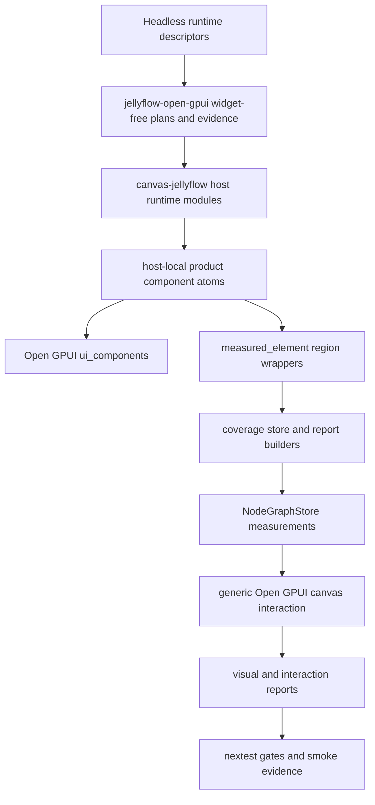
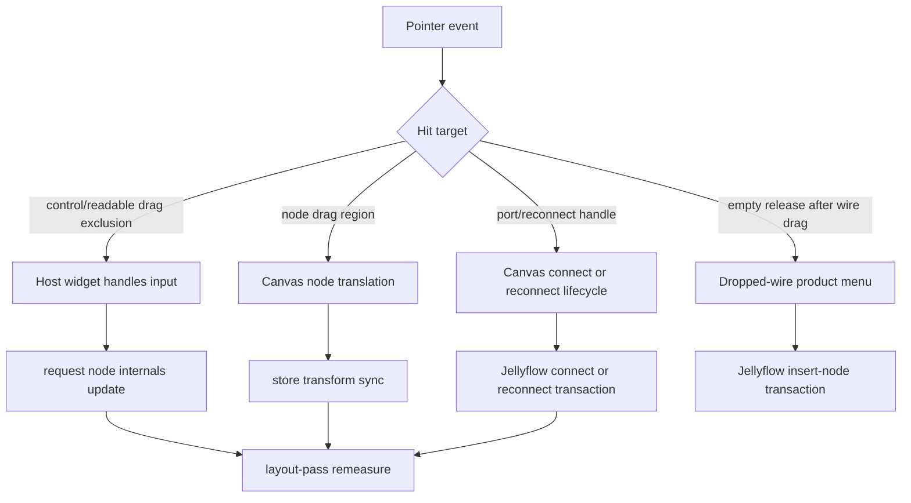
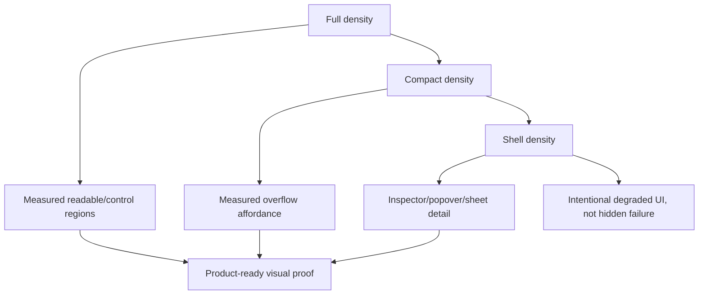

## Goal Capsule

| Field | Decision |
|---|---|
| Objective | Productize the Open GPUI adapter path so Jellyflow can act like a Rust-native XYFlow-style node UI library for Dify, shader graph, ERD, and mind-map shaped nodes without turning runtime into a widget crate. |
| Authority | Runtime remains headless; `jellyflow-open-gpui` owns widget-free contracts, evidence, ids, authoring plans, and gates; `repo-ref/open-gpui/crates/canvas` owns generic graph interaction primitives; `repo-ref/open-gpui/examples/canvas-jellyflow` owns concrete Open GPUI widgets and product renderers. |
| Execution profile | Deep refactor across the root adapter crate and the local Open GPUI fork. Breaking changes, module moves, and deletion of obsolete example helpers are allowed when they clarify the boundary. |
| Stop conditions | Stop if implementation requires a cross-framework widget crate, a backend Dify workflow engine, shader compilation, a DOM-style measurement model, or a product behavior decision not covered by this plan. |
| Tail ownership | Execute with `ce-work` or goal mode; progress is tracked through commits and verification, not by editing this plan. |

---

## Product Contract

### Summary

The next stage converts the current Open GPUI proof from a polished example into a mature adapter reference.
Users should be able to build rich native nodes with measured internals, reliable ports, useful controls, and product-grade visual regressions while Jellyflow keeps the reusable layer semantic and headless.

### Problem Frame

The current implementation has crossed the main feasibility threshold: Open GPUI product nodes render UI, consume layout-pass measurements, cache coverage, and reject projection fallback as product proof.
The remaining risk is architectural drift.
Several production-shaped behaviors still live as example-local probes or visual-report helpers, product components still contain repeated layout and control composition, and port/reconnect UX is not yet designed as a mature product surface.

Mature reference libraries point to the same boundary.
XYFlow wraps custom node components in a graph-owned `NodeWrapper`, gives user components explicit `Handle` elements, and provides an update-internals hook for dynamic handle geometry.
egui-snarl keeps graph connections in `Snarl` while `SnarlViewer` owns header/body/pin UI and connection decisions.
Jellyflow's Open GPUI path should keep that separation: graph interaction is generic, adapter contracts are widget-free, and product UI is host-local but rigorous enough to copy into real Open GPUI apps.

### Requirements

**Adapter contract and ownership**

- R1. `jellyflow-open-gpui` must expose the reusable widget-free contracts needed by real Open GPUI hosts: measurement coverage state, region-kind evidence, authoring plans, renderer resolution, scoped ids, product fixture gates, and visual/interaction report types.
- R2. `canvas-jellyflow` must stop being the only place where reusable adapter policy is understood; host-local modules may keep widgets, but generic measurement/evidence decisions should move to the adapter crate when they do not require Open GPUI element types.
- R3. The boundary must keep `jellyflow-runtime`, layout crates, egui, proof, and future Dioxus targets free of Open GPUI widget types and host-specific lifecycle assumptions.

**Node-internal UI**

- R4. Dify workflow, shader graph, ERD table, and mind-map/source fixtures must share host-local component atoms for card frame, sections, field rows, control rows, repeatable lists, port rails, status chips, overflow affordances, menus, and inspectors.
- R5. Open GPUI `ui_components` primitives should be the preferred building blocks for controls and dense surfaces before bespoke widgets are added.
- R6. Node cards must use explicit density and overflow contracts: compact cards summarize, shell mode degrades intentionally, and inspector/popover/sheet surfaces carry long-form editing.
- R7. Control support must remain honest. Native, fallback, stub, disabled, readonly, and unsupported states must be visible in UI and reports.

**Ports, wires, and graph interaction**

- R8. Port hit targets must be reachable independently of tiny visual markers, and measured handle geometry must drive edge endpoints, reconnect targets, invalid hover feedback, and dropped-wire menus.
- R9. Direct graph gestures own continuous connect/reconnect/drag lifecycle; semantic menus and actions own discrete product choices such as dropped-wire insertion, node menus, inspector actions, toolbar actions, and blackboard mutations.
- R10. Wire route style should be a product policy with structured evidence: orthogonal/stepped routes for product graphs by default, no silent direct-line fallback when a graph claims product readiness.

**Regression and product proof**

- R11. Product readiness must be proven through structured evidence and focused smoke tests across full, compact, shell, resize, selected/unselected, drag, reconnect, invalid hover, overflow, and dirty-measurement states.
- R12. Projection fallback remains a valid degraded state for initial projection and missing/dirty bounds, but it must not pass product-ready visual or interaction gates.
- R13. Screenshot ROI and native smoke tests remain review aids, while correctness gates stay structured and deterministic.

### Acceptance Examples

- AE1. Given a Dify-style LLM card with long prompt configuration, when it renders compact, then the card keeps title, model/status summary, key actions, handles, and overflow affordance readable while the inspector or popover owns long-form editing.
- AE2. Given a shader node with dynamic inputs, when an input is added, removed, reordered, or reconnected, then measured port targets, edge endpoints, and row labels move together without stale projection fallback.
- AE3. Given an ERD table node in a constrained card, when rows exceed available height, then rows remain readable up to the declared limit and a measured overflow affordance exposes the hidden detail path.
- AE4. Given mind-map/source fixtures, when the gallery opens or the viewport resizes, then initial nodes do not overlap, intrinsic cards do not pin to the viewport top, and dragging any card keeps the store and canvas synchronized.
- AE5. Given a control area inside any product node, when the user clicks or drags the control, then graph node dragging does not start, but clicking on graph-owned drag regions still moves the node.
- AE6. Given a product edge, when the user hovers, reconnects, drops on an invalid target, or drops in empty canvas, then the route, hit area, release event, and Jellyflow store transaction are all reported in structured evidence.

### Scope Boundaries

In scope: Open GPUI adapter contracts, host-local component atoms, product fixture polish, generic canvas interaction changes required for ports/wires, visual and interaction gates, docs, and cleanup of obsolete example helpers.

Deferred to follow-up work: mature egui or Dioxus adapter parity, dedicated `jellyflow-open-gpui-host` crate extraction, pixel-golden infrastructure, full accessibility audit, plugin marketplace packaging, and additional real Open GPUI apps beyond the local example.

Outside this product's identity: shared cross-framework widgets, Dify backend execution, shader compilation, DOM-specific APIs, text-fit heuristics presented as adapter proof, and renderer-specific behavior hidden inside runtime descriptors.

---

## Planning Contract

### Key Technical Decisions

- KTD1. Promote only widget-free proof surfaces. Move coverage state, evidence structs, report builders, and gate helpers into `jellyflow-open-gpui` when they do not depend on Open GPUI elements; keep concrete `AnyElement`, focus, popup, and layout composition inside the Open GPUI host.
- KTD2. Treat `canvas-jellyflow` as the reference host, not the reusable library. It can contain polished components and demo renderers, but reusable adapter semantics should be reachable without importing the example.
- KTD3. Use XYFlow's wrapper model as the mental reference. The graph owns selection, drag, connection, reconnect, viewport, hit testing, and internals refresh; product components own visible internals and measured regions.
- KTD4. Use egui-snarl's viewer model as the native UI reference. The host can deeply customize header, body, pins, footer, menus, and connection responses while graph state and connection validity remain centralized.
- KTD5. Separate port visual size from hit target size. Product nodes may show small markers, but the graph must expose measured and testable hit budgets for connect, reconnect, and edge interaction.
- KTD6. Keep overflow explicit. Compact/shell degradation is valid only when product components declare measured overflow or move detail into inspector, popover, sheet, blackboard, or menu surfaces.
- KTD7. Prefer Open GPUI `ui_components` over bespoke widget code. Bespoke widgets are allowed only where the component library lacks a credible primitive or where the graph-specific measured wrapper is the point.
- KTD8. Delete obsolete helpers aggressively. Example-local registries, string-fit paths, duplicated layout constants, and projection-proof adapters should be removed when the new contract makes them redundant.

### High-Level Technical Design

### Assumptions

- Open GPUI is the only mature adapter target in this phase; egui and proof continue validating shared headless contracts but are not product-polish peers for this work.
- `repo-ref/open-gpui` remains a local fork on `main`; changes there should be committed locally and not pushed unless separately requested.
- The current Open GPUI `ui_components` crate is available and should be used before adding new local widgets.
- Product proofs should prefer structured nextest assertions over brittle pixel-golden checks; screenshot ROI and native smoke remain supplementary.
- The plan may require edits in both the root Jellyflow repo and `repo-ref/open-gpui`; those are separate git repositories and should be committed separately.

### Sources and Research

- `repo-ref/xyflow/packages/react/src/container/NodeRenderer/index.tsx` and `repo-ref/xyflow/packages/react/src/components/NodeWrapper/index.tsx` show the wrapper/custom-node split and visible-node rendering boundary.
- `repo-ref/xyflow/packages/react/src/hooks/useUpdateNodeInternals.ts` shows the explicit dynamic-internals update hook to mirror in retained native hosts.
- `repo-ref/egui-snarl/src/ui/viewer.rs` shows the deep native viewer seam for node frame, header, body, pins, footer, and connection behavior.
- `repo-ref/egui-snarl/examples/demo.rs` shows viewer-owned connection decisions while graph state remains centralized.
- `repo-ref/egui_node_graph2/egui_node_graph2/src/editor_ui.rs` shows wide input ports, multiple connection hooks, and connection hover behavior as relevant shader graph prior art.
- `repo-ref/open-gpui/crates/ui_components/src/lib.rs` confirms available controls and dense surfaces: text input, textarea, select, slider, switch, menu, popover, sheet, table, tooltip, tabs, tree, and related primitives.
- `repo-ref/open-gpui/crates/canvas/src/tool` and `repo-ref/open-gpui/crates/canvas/src/index.rs` contain existing connection release, reconnect, route, and hit-test infrastructure.
- `crates/jellyflow-open-gpui/README.md` documents the current adapter maturity boundary and conservative layout-pass measurement capability.
- `crates/jellyflow-open-gpui/src/measurement.rs` and `crates/jellyflow-open-gpui/src/testing.rs` own measurement ids, coverage, measured internals evidence, and hard product gates.
- `repo-ref/open-gpui/examples/canvas-jellyflow/src/measurement_bridge.rs`, `visual_regression.rs`, `node_component_kit.rs`, `product_renderers.rs`, and `main.rs` are the current host-local proof surfaces to productize or simplify.

### Risks and Dependencies

| Risk | Mitigation |
|---|---|
| Moving too much from the example into `jellyflow-open-gpui` creates a hidden widget crate. | Promote only widget-free evidence, plans, ids, coverage, and report helpers; keep element trees and focus state host-local. |
| Keeping too much in the example makes real Open GPUI apps copy private policy. | Extract reusable measurement and report contracts into the adapter crate once they prove independent of widgets. |
| Port hit-target changes in `open-gpui/crates/canvas` may affect non-Jellyflow canvas users. | Keep generic APIs opt-in or backward-compatible and add canvas crate tests that do not depend on Jellyflow. |
| Product UI polish could reintroduce fit heuristics. | Require measured readable/control/overflow/drag-exclusion evidence in gates and delete heuristic proof paths. |
| Dense Open GPUI controls may fight graph gestures. | Route continuous graph gestures through canvas hit tests and shield controls through measured drag-exclusion regions. |
| Two repositories increase commit and verification complexity. | Stage root Jellyflow and `repo-ref/open-gpui` changes separately, with explicit verification for each. |

### Alternative Approaches Considered

- Promote a shared cross-framework component library now: rejected because GPUI, egui, Dioxus, and DOM do not share lifecycle, focus, popup, layout, or measurement models.
- Keep everything in `canvas-jellyflow`: rejected because reusable adapter policy would remain trapped inside a demo and every real Open GPUI host would have to copy private logic.
- Move concrete product renderers into `jellyflow-open-gpui`: rejected for this phase because `jellyflow-open-gpui` must remain widget-free and reusable by multiple Open GPUI hosts.
- Focus only on visuals before port/wire UX: rejected because Dify, shader, ERD, and mind-map nodes are not product-ready if they cannot be dragged, connected, reconnected, and invalid-hovered reliably.

---

## Implementation Units

### U1. Promote widget-free coverage and report contracts

- **Goal:** Move reusable layout-pass coverage state and product report classification out of the example path and into `jellyflow-open-gpui` without importing Open GPUI widget types.
- **Requirements:** R1, R2, R3, R11, R12, AE5.
- **Dependencies:** None.
- **Files:** `crates/jellyflow-open-gpui/src/measurement.rs`, `crates/jellyflow-open-gpui/src/testing.rs`, `crates/jellyflow-open-gpui/src/adapter.rs`, `crates/jellyflow-open-gpui/src/lib.rs`, `repo-ref/open-gpui/examples/canvas-jellyflow/src/measurement_bridge.rs`, `repo-ref/open-gpui/examples/canvas-jellyflow/src/visual_regression.rs`.
- **Approach:** Introduce adapter-level types for per-node coverage snapshots, measurement source classification, product-readiness evidence, and projection-fallback downgrade reporting. Keep `OpenGpuiBoundsCollector` and `OpenGpuiMeasurementId` as the bridge from host measured elements into widget-free facts. The example should call these contracts rather than locally re-deriving what counts as layout-pass, fallback, stale, or partial coverage.
- **Execution note:** Start from characterization tests that fail if projection fallback or missing region-kind coverage is promoted to product proof.
- **Patterns to follow:** `OpenGpuiMeasurementCoverage`, `OpenGpuiMeasuredInternalsEvidence`, `OpenGpuiAdapter::layout_pass`, `assert_layout_pass_capability_requires_real_bounds`, and the current `ProjectionFallbackStoreEvidence` shape.
- **Test scenarios:**
  - Given full layout-pass regions with readable, control, drag-exclusion, overflow, slot, and anchor coverage, when the adapter classifies node internals, then it reports product-ready layout-pass evidence.
  - Given fresh slot and anchor measurements without region-kind coverage, when visual internals evidence is built, then product renderer readiness remains incomplete.
  - Given dirty or missing measurements, when fallback projections are injected, then fallback is named separately from stale, missing, or partial live coverage.
  - Given duplicate or zero-size measured regions, when coverage is accumulated, then product readiness fails and the duplicate/missing counts remain visible.
- **Verification:** Root adapter tests prove coverage classification and product gates without depending on Open GPUI element types; the example still compiles after deleting local duplicate classification logic.

### U2. Split the Open GPUI example host runtime into focused modules

- **Goal:** Reduce `canvas-jellyflow/src/main.rs` to orchestration by extracting host runtime responsibilities into focused modules that mirror the adapter boundary.
- **Requirements:** R1, R2, R3, R11.
- **Dependencies:** U1.
- **Files:** `repo-ref/open-gpui/examples/canvas-jellyflow/src/main.rs`, `repo-ref/open-gpui/examples/canvas-jellyflow/src/measurement_bridge.rs`, `repo-ref/open-gpui/examples/canvas-jellyflow/src/visual_regression.rs`, `repo-ref/open-gpui/examples/canvas-jellyflow/src/product_gallery.rs`, `repo-ref/open-gpui/examples/canvas-jellyflow/src/native_smoke.rs`, `repo-ref/open-gpui/examples/canvas-jellyflow/src/gallery_screenshot.rs`.
- **Approach:** Extract view-local coverage cache handling, measurement consumption, visual/interaction report construction, gallery fixture switching, and smoke helpers into modules with small public surfaces. Keep `JellyflowCanvasView` as the retained GPUI view that wires editor, store, renderer registry, and host services together.
- **Execution note:** Preserve native drag and close behavior while moving code; this is a refactor with behavior-sensitive smoke coverage.
- **Patterns to follow:** Existing `measurement_bridge`, `visual_regression`, `product_gallery`, `native_smoke`, and `gallery_screenshot` modules.
- **Test scenarios:**
  - Given measured regions arrive during render, when the extracted host runtime consumes them, then per-node coverage is cached and stale coverage is cleared on no-region frames.
  - Given a control edit invalidates internals, when the extracted invalidation path runs, then only affected node coverage is cleared and the editor refresh policy remains unchanged.
  - Given product gallery fixture switching, when the active fixture changes, then coverage, pending frame state, viewport fit state, and document bounds cache reset.
  - Given the macOS close lifecycle smoke test, when the last window closes, then the app quits according to the configured quit mode.
- **Verification:** Open GPUI example nextest covers the same behavior after `main.rs` shrinks; no new module owns concrete widget rendering unless it is a host-local UI module.

### U3. Consolidate host-local product component atoms around `ui_components`

- **Goal:** Turn `node_component_kit` into a mature host-local atom layer backed by Open GPUI `ui_components`, not a collection of renderer-specific helpers.
- **Requirements:** R4, R5, R6, R7, AE1, AE3, AE5.
- **Dependencies:** U1, U2.
- **Files:** `repo-ref/open-gpui/examples/canvas-jellyflow/src/node_component_kit.rs`, `repo-ref/open-gpui/examples/canvas-jellyflow/src/product_renderers.rs`, `repo-ref/open-gpui/examples/canvas-jellyflow/Cargo.toml`, `crates/jellyflow-open-gpui/src/controls.rs`, `crates/jellyflow-open-gpui/src/testing.rs`.
- **Approach:** Define reusable atoms for product card frame, section header, property row, control row, repeatable list, port row, status chip, overflow indicator, toolbar/action menu, inspector trigger, and blackboard entry. Prefer `Button`, `IconButton`, `Badge`, `TextInput`, `Textarea`, `NumberInput`, `Select`, `Switch`, `Slider`, `Menu`, `Tooltip`, `Popover`, `Sheet`, and `Table` where they fit. Keep measured wrappers around every atom that contributes to product evidence.
- **Execution note:** Delete duplicated bespoke layout helpers once an atom replaces two or more real renderer uses.
- **Patterns to follow:** Existing `OpenGpuiNodeComponentProps`, `OpenGpuiNodeComponentContext`, `render_readable_region`, `render_drag_exclusion_region`, `render_overflow_region`, and Open GPUI `ui_components` state/size conventions.
- **Test scenarios:**
  - Given Dify, shader, ERD, and mind-map renderers, when each renders through atoms, then stable element ids and measured region ids stay node-scoped and collision-free.
  - Given text, textarea, select, switch, slider, and number controls, when controls render through atoms, then editable, readonly, disabled, fallback, and stub states remain visible.
  - Given a popover or sheet owns long-form content, when compact card overflow exists, then the compact card declares measured overflow instead of clipping hidden content silently.
  - Given a control atom receives pointer input, when pointer down starts inside the atom, then graph drag is shielded by an explicit measured drag-exclusion region.
- **Verification:** Renderer-specific helper count and duplicated layout constants drop; product renderers still pass visual and interaction gates.

### U4. Mature port, handle, and wire interaction UX

- **Goal:** Make ports and wires feel like a real shader/Dify graph surface: easy to hit, clear to route, recoverable on invalid targets, and backed by structured evidence.
- **Requirements:** R8, R9, R10, R11, AE2, AE6.
- **Dependencies:** U1, U2.
- **Files:** `repo-ref/open-gpui/crates/canvas/src/tool/context.rs`, `repo-ref/open-gpui/crates/canvas/src/tool/builtin.rs`, `repo-ref/open-gpui/crates/canvas/src/tool/select.rs`, `repo-ref/open-gpui/crates/canvas/src/index.rs`, `repo-ref/open-gpui/crates/canvas/src/gpui.rs`, `repo-ref/open-gpui/examples/canvas-jellyflow/src/main.rs`, `crates/jellyflow-open-gpui/src/testing.rs`.
- **Approach:** Separate visual handle markers from hit targets, expose route policy and preview parity in graph affordance evidence, strengthen reconnect target selection, and keep direct connect/reconnect gestures out of semantic action menus. Generic changes belong in `open-gpui/crates/canvas`; Jellyflow-specific store transactions remain in `canvas-jellyflow`.
- **Execution note:** Use characterization tests around current canvas release/reconnect behavior before changing hit testing or route policy.
- **Patterns to follow:** `CanvasConnectionRelease`, `CanvasConnectionPreviewRoute`, `connection_hit_options`, `selected_reconnect_target_at`, `CanvasGeometryFacts`, `OpenGpuiGraphAffordanceEvidence`, and existing reconnect sequence tests.
- **Test scenarios:**
  - Given a small visual port marker with a larger hit budget, when the pointer is within the hit budget but outside the marker, then connect/reconnect can still target the port.
  - Given a product graph using orthogonal routes, when a connection preview is shown, then preview route family matches committed route family.
  - Covers AE6. Given a selected edge, when the user reconnects source or target to a valid port, then the same edge id is preserved and structured release evidence reports the endpoint switch.
  - Covers AE6. Given an invalid reconnect target, when the pointer releases, then the edge rolls back and the report records the rejection without corrupting the store.
  - Given a dropped wire on empty canvas, when the source port supports insertion actions, then dropped-wire menu bounds stay inside canvas and insertion creates a node plus edge transaction.
- **Verification:** Canvas crate tests prove generic hit/route behavior; Jellyflow example tests prove store synchronization and product interaction reports.

### U5. Polish Dify and shader graph product nodes through the new atoms

- **Goal:** Make Dify and shader fixtures the first high-quality reference nodes for compact-card plus dense-surface composition.
- **Requirements:** R4, R5, R6, R7, R8, R10, AE1, AE2, AE5.
- **Dependencies:** U3, U4.
- **Files:** `repo-ref/open-gpui/examples/canvas-jellyflow/src/product_renderers.rs`, `repo-ref/open-gpui/examples/canvas-jellyflow/src/node_component_kit.rs`, `repo-ref/open-gpui/examples/canvas-jellyflow/src/main.rs`, `crates/jellyflow-open-gpui/src/authoring.rs`, `crates/jellyflow-open-gpui/src/repeatable.rs`, `crates/jellyflow-open-gpui/src/testing.rs`.
- **Approach:** Dify cards should show title, model/status, prompt summary, critical controls, run/insert actions, and measured overflow into inspector or popover. Shader cards should show typed input rows, dynamic port status, preview values, compact controls, and precise measured port rails. Repeatable edits must update data, graph ports, measured anchors, and edge endpoints together.
- **Execution note:** Work fixture-first: tighten Dify and shader report expectations before renderer polish.
- **Patterns to follow:** `OpenGpuiAuthoringController`, `OpenGpuiRepeatableActionPlan`, `repeatable_item_projection`, `render_action_menu`, `render_dispatch_action_button`, and shader repeatable lifecycle tests.
- **Test scenarios:**
  - Covers AE1. Given a Dify node with a long prompt, when compact rendering runs, then measured readable regions cover summary content and a dense editor surface owns the long text.
  - Given Dify controls edited in quick succession, when authoring plans run, then each edit reads current store state and invalidates internals without stale captured data.
  - Covers AE2. Given a shader node dynamic input row, when it is added, removed, or reordered, then graph port binding, measured anchor identity, and edge endpoint position stay coherent.
  - Given shader row controls for numeric/select/color/code-like values, when native controls are available they render natively, and when unavailable the fallback/stub state is visible and reported.
  - Given shader connect/reconnect on dense rows, when the pointer targets a row's port hit area, then the interaction succeeds without requiring pixel-perfect marker clicks.
- **Verification:** Dify and shader fixture reports pass visual, interaction, dynamic repeatable, and graph affordance gates without projection fallback product proof.

### U6. Polish ERD and mind-map/source product nodes

- **Goal:** Finish the remaining product node families so the adapter reference covers data modeling and knowledge/mind-map shapes, not only workflow and shader cards.
- **Requirements:** R4, R5, R6, R8, R11, AE3, AE4, AE5.
- **Dependencies:** U3, U4.
- **Files:** `repo-ref/open-gpui/examples/canvas-jellyflow/src/product_renderers.rs`, `repo-ref/open-gpui/examples/canvas-jellyflow/src/product_gallery.rs`, `repo-ref/open-gpui/examples/canvas-jellyflow/src/node_component_kit.rs`, `repo-ref/open-gpui/examples/canvas-jellyflow/src/main.rs`, `crates/jellyflow-open-gpui/src/testing.rs`.
- **Approach:** ERD cards should use row atoms and measured overflow instead of clipped text boxes. Mind-map/source nodes should use intrinsic sizing and stable gallery layout so initial placement does not overlap or stick to the viewport top. Both families should expose edit detail outside the compact card when fields exceed readable budgets.
- **Execution note:** Preserve existing product-gallery non-overlap and viewport tests while changing size policy.
- **Patterns to follow:** `OpenGpuiNodeSizePolicy`, `AdaptiveNodeLayoutStack`, product gallery fixture projection, `product_gallery_fixtures_project_non_overlapping_node_bounds`, and viewport resize tests.
- **Test scenarios:**
  - Covers AE3. Given an ERD table with more rows than compact height allows, when rendered, then visible rows meet readable height and overflow is measured.
  - Given an ERD field edit from an inspector or dense surface, when committed, then row labels and measured anchors refresh without stale handles.
  - Covers AE4. Given mind-map/source gallery fixtures, when the gallery initializes, then all nodes have non-overlapping document bounds.
  - Covers AE4. Given a viewport resize after user interaction, when the window changes size, then cards preserve document center and do not pin to the top.
  - Given a low-zoom shell state, when mind-map/source nodes render, then shell content is intentional and reports degraded density rather than hidden clipping.
- **Verification:** ERD and mind-map/source fixtures pass visual gates for readable content, overflow, non-overlap, drag, and resize.

### U7. Build the product visual and interaction regression matrix

- **Goal:** Turn the four product fixture families into a matrix that prevents regressions across density, selection, resize, drag, connect/reconnect, overflow, and degraded measurement states.
- **Requirements:** R11, R12, R13, AE1, AE2, AE3, AE4, AE5, AE6.
- **Dependencies:** U1, U4, U5, U6.
- **Files:** `crates/jellyflow-open-gpui/src/testing.rs`, `repo-ref/open-gpui/examples/canvas-jellyflow/src/visual_regression.rs`, `repo-ref/open-gpui/examples/canvas-jellyflow/src/native_smoke.rs`, `repo-ref/open-gpui/examples/canvas-jellyflow/src/gallery_screenshot.rs`, `repo-ref/open-gpui/examples/canvas-jellyflow/src/main.rs`.
- **Approach:** Make the matrix explicit in structured reports. Each fixture family should have rows for full/compact/shell density where applicable, selected/unselected state, resized node, dirty measurement fallback, invalid hover, dropped-wire menu, reconnect, repeatable overflow, and screenshot ROI smoke when available. Keep screenshot outputs non-golden unless a later plan introduces pixel infrastructure.
- **Execution note:** Add failing gates before broad renderer polish when practical; this unit is the release net for the whole plan.
- **Patterns to follow:** `OpenGpuiHostVisualInteractionReport`, `OpenGpuiHostProductInteractionReport`, `OpenGpuiScreenshotRegionReport`, native lifecycle evidence, and current projection-only degradation tests.
- **Test scenarios:**
  - Given every product fixture family, when visual reports run, then product renderer rows have measured internals evidence or explicit degraded gaps.
  - Given compact/shell cards, when core content is hidden, then a measured overflow or dense-surface path exists.
  - Given dirty measurements, when reports run before the next layout pass, then projection fallback and stale coverage are visible and product-ready proof fails.
  - Given screenshot smoke export is available, when ROIs are captured, then each product family produces nonblank, multi-color regions or an explicit skip reason.
  - Given native launch/drag/close smoke, when the app window closes on macOS, then lifecycle evidence reports last-window-close quit behavior.
- **Verification:** Root and example nextest suites include deterministic product matrix gates; screenshot/native smoke stays supplemental and does not replace structured assertions.

### U8. Document the mature Open GPUI adapter recipe and clean obsolete code

- **Goal:** Close the phase by documenting how users should build Open GPUI nodes and removing stale helpers that conflict with the mature boundary.
- **Requirements:** R1, R2, R3, R7, R12, R13.
- **Dependencies:** U1, U2, U3, U4, U5, U6, U7.
- **Files:** `crates/jellyflow-open-gpui/README.md`, `docs/knowledge/engineering/current-state.md`, `docs/knowledge/engineering/decisions/open-gpui-node-component-kit.md`, `docs/knowledge/engineering/decisions/node-ui-kit-component-contract.md`, `repo-ref/open-gpui/examples/canvas-jellyflow/src/node_component_kit.rs`, `repo-ref/open-gpui/examples/canvas-jellyflow/src/product_renderers.rs`, `repo-ref/open-gpui/examples/canvas-jellyflow/src/main.rs`.
- **Approach:** Update the recipe around the mature boundary: semantic descriptors, renderer registry, host-local atoms, measured regions, coverage cache, control authoring, repeatable lifecycle, ports/wires, and visual reports. Delete obsolete registry wrappers, duplicate layout helpers, string-fit proof helpers, and projection-fallback product-proof paths after tests cover the replacement.
- **Execution note:** Treat cleanup as part of Definition of Done; dead-end code from intermediate approaches should not remain in the final diff.
- **Patterns to follow:** Existing README adapter maturity sections, engineering memory decision documents, and current structured gate terminology.
- **Test scenarios:**
  - Test expectation: none for documentation-only edits, but code cleanup must remain covered by U1-U7 tests.
  - Given deleted helpers, when the full targeted suites run, then no product gate relies on removed heuristic or duplicated paths.
  - Given README examples or recipes mention capability levels, when reviewed, then projection fallback is described as degraded evidence rather than product proof.
- **Verification:** Documentation and engineering memory match the implemented boundary; both root and `repo-ref/open-gpui` worktrees are clean after separate commits.

---

## Verification Contract

| Gate | Applies to | Expected evidence |
|---|---|---|
| `cargo fmt --all -- --check` | Root Jellyflow repo | Root Rust formatting is clean. |
| `cargo fmt --manifest-path repo-ref/open-gpui/examples/canvas-jellyflow/Cargo.toml -- --check` | Local Open GPUI example | Example Rust formatting is clean. |
| `git diff --check` | Root Jellyflow repo | No whitespace errors in root changes. |
| `git -C repo-ref/open-gpui diff --check` | Local Open GPUI fork | No whitespace errors in Open GPUI changes. |
| `RUSTFLAGS='-Awarnings' cargo nextest run -p jellyflow-open-gpui --no-fail-fast` | Root adapter crate | Widget-free contracts, reports, and product gates pass. |
| `RUSTFLAGS='-Awarnings' cargo nextest run --manifest-path repo-ref/open-gpui/examples/canvas-jellyflow/Cargo.toml -p open-gpui-canvas-jellyflow --no-fail-fast` | Open GPUI example | Host-local components, visual reports, native smoke, screenshot smoke, drag, reconnect, and gallery fixtures pass. |
| `cargo nextest run -p jellyflow-runtime -p jellyflow-egui -p jellyflow-proof --lib --no-fail-fast` | Shared headless contract check when runtime-facing contracts change | Runtime, egui, and proof stay compatible with headless semantic contracts. |
| `python "$HOME/.codex/skills/engineering-wiki-memory/scripts/wiki_memory.py" validate --root docs/knowledge/engineering` | Root docs | `docs/knowledge/engineering` remains structurally valid after memory updates. |

The existing `block v0.1.6` future-incompat warning in the local Open GPUI tree is known noise and is not a blocker for this plan unless it becomes a hard error.

---

## Definition of Done

- `jellyflow-open-gpui` exposes reusable widget-free measurement, report, and product evidence contracts so real Open GPUI hosts do not need to copy private `canvas-jellyflow` policy.
- `canvas-jellyflow` is organized as a reference host with focused runtime modules, host-local product atoms, and product renderers that use Open GPUI `ui_components` where credible.
- Dify, shader graph, ERD, and mind-map/source fixtures pass structured visual and interaction gates across compact/product states without relying on projection fallback as product proof.
- Port, handle, wire, reconnect, and dropped-wire interactions are reachable, route-consistent, and backed by generic canvas or adapter evidence rather than renderer-local guesses.
- Projection fallback, stale coverage, partial coverage, duplicate regions, missing regions, unsupported controls, and stub controls remain visible as degraded states in UI or reports.
- Runtime/core/layout crates remain Open GPUI-widget-free, and egui/proof compatibility is preserved where shared contracts changed.
- Obsolete helper code, duplicate layout constants, and abandoned refactor paths introduced during the work are removed before final commits.
- Root Jellyflow changes and `repo-ref/open-gpui` changes are committed separately with conventional commit messages, and neither worktree has unrelated staged changes.
