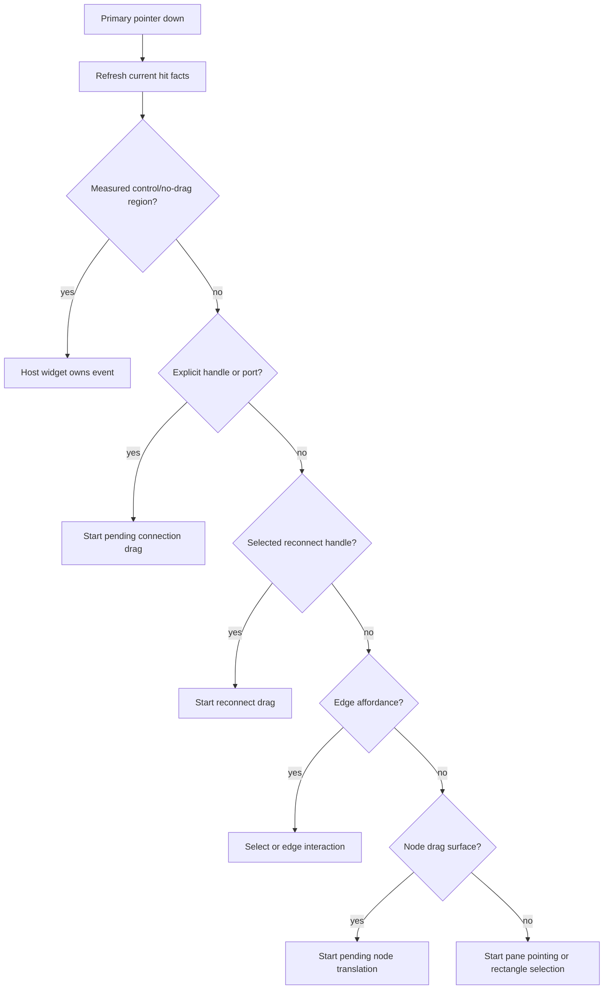
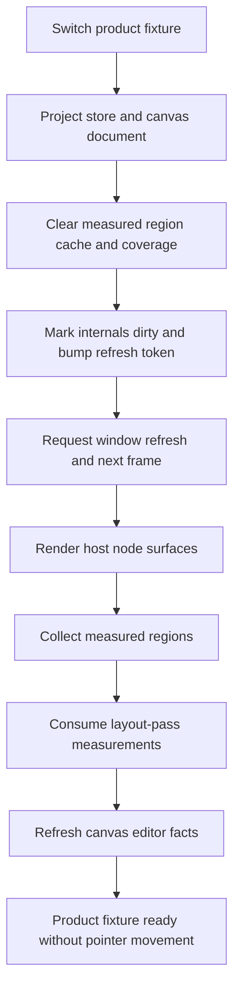
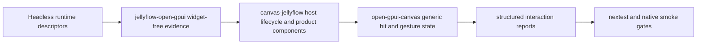

## Goal Capsule

| Field | Decision |
|---|---|
| Objective | Make the Open GPUI Jellyflow path deterministic enough to behave like a mature native XYFlow-style node graph: first pointer on a port connects, node body drag moves, selection starts only from pane space, fixture switches render without pointer nudges, and product node internals measure back into graph facts. |
| Authority | `jellyflow-runtime` remains headless and semantic; `jellyflow-open-gpui` owns widget-free evidence and adapter reports; `repo-ref/open-gpui/crates/canvas` owns generic graph hit testing and continuous gesture state; `repo-ref/open-gpui/examples/canvas-jellyflow` owns concrete Open GPUI node components and host lifecycle wiring. |
| Execution profile | Fearless refactor across Jellyflow and the local Open GPUI fork. Breaking changes, module moves, and deletion of stale host hacks are allowed when they simplify ownership. |
| Stop conditions | Stop if the implementation requires a cross-framework widget crate, DOM-style APIs, heuristic text fitting as proof, Dify backend execution, shader compilation, or runtime-owned pointer event policy. |
| Tail ownership | Execute with `ce-work` or goal mode. This plan is the source of truth; progress is tracked by implementation commits, verification, and engineering memory updates rather than mutating the plan during development. |

---

## Product Contract

### Summary

The current Open GPUI example proves rich node UI can render, but the interaction model is still not product-grade.
Reported behavior shows the same root problem in several forms: the graph does not have a deterministic pointer-claim contract between controls, ports, node bodies, reconnect handles, edges, and pane selection, and the retained Open GPUI host does not always request the next measurement/render pass after fixture or internals changes.

This plan turns those observations into a focused refactor.
The target is not a shared widget crate.
The target is a mature Open GPUI adapter path that borrows the right lessons from XYFlow and egui-snarl while keeping Jellyflow's core library headless.

### Problem Frame

Manual review found these failures:

- Switching product examples can leave node internals incomplete until the mouse moves.
- The first drag on a node port can start rectangle selection instead of connection.
- After clicking elsewhere and returning, the same port may become draggable, which implies stale state or missing first-frame hit facts.
- Mind-map node body drag can start a connection line instead of moving the node.
- Node dragging and wire interaction feel less predictable than egui-snarl or XYFlow.

The code points at the same boundary.
Open GPUI canvas `HitOptions::default()` excludes handles, and Select mode uses that default path for ordinary pointer down.
Open GPUI canvas `connection_hit_at` treats a node body as a valid connection endpoint.
The product node component kit renders visible handle regions as measured regions, but those regions are not yet the explicit owner of connection-start behavior.
The gallery fixture switch clears measurements and calls notify, but it does not express a hard lifecycle contract that the next layout pass must be requested and consumed without another pointer event.

### Requirements

**Deterministic pointer ownership**

- R1. A primary pointer down must be claimed by exactly one interaction owner according to a documented priority order: control/no-drag shield, explicit port/handle, reconnect handle, edge affordance, node drag surface, pane selection.
- R2. Default Select mode must allow direct drag from a connectable port/handle, matching XYFlow and egui-snarl expectations.
- R3. Node body drag must not start a connection unless a graph kind or explicit policy opts into whole-node endpoints.
- R4. Rectangle selection must start only from pane/blank space or an explicit selection path, never from a visible port or control region.
- R5. Connection and node drag gestures must use small movement thresholds so click, slight pointer jitter, drag, and release do not collapse into the wrong state.

**Measurement and render lifecycle**

- R6. Switching a product fixture must request a deterministic next-frame render/measurement cycle and must not depend on pointer movement to finish node internals.
- R7. Any node-internal change that affects controls, repeatables, ports, size policy, density, or handles must invalidate and refresh measured internals through one host-owned path.
- R8. Stale, missing, projected, and layout-pass measured internals must remain visibly separate in widget-free evidence.

**Adapter and component boundary**

- R9. Jellyflow runtime must not own GPUI pointer routing, focus, retained layout scheduling, or widget state.
- R10. `jellyflow-open-gpui` may add report/evidence fields for pointer priority, handle-only connection policy, and no-pointer fixture readiness, but it must remain widget-free.
- R11. `canvas-jellyflow` must expose host-local component roles such as `drag_surface`, `control/no_drag`, `port_handle`, and `content_only`; product renderers should not scatter ad hoc mouse-down forwarding.
- R12. Obsolete fit heuristics, hidden/offscreen handle hacks, duplicate local evidence classifiers, and example-only interaction probes must be deleted when the new boundary replaces them.

**Product UX evidence**

- R13. Dify, shader graph, ERD, mind-map, and source product fixtures must all pass the same structured interaction gates for first-pointer port drag, body drag, control shielding, fixture switch readiness, reconnect, invalid hover, and dropped-wire behavior.
- R14. Product port visuals may stay small, but hit targets and measured handle facts must be large, aligned, and testable.
- R15. Screenshot/native smoke can remain review aids, but correctness must be gated by deterministic nextest assertions and structured reports.

### Acceptance Examples

- AE1. Given the user switches from Dify to shader graph, when no mouse movement occurs, then product node internals still complete their render and measured-handle refresh by the scheduled frame.
- AE2. Given Select mode and a visible output port, when the user presses and drags from the port for the first time after fixture load, then the canvas enters connection drag and never starts rectangle selection.
- AE3. Given a mind-map node body, when the user presses and drags from body or header drag surface, then the node moves and no connection line appears.
- AE4. Given a button, select, text field, slider, or repeatable action inside a product node, when the user clicks or drags it, then graph drag, selection, and connection gestures do not start.
- AE5. Given a selected edge reconnect handle, when the user drags it, then reconnect has priority over node drag and pane selection.
- AE6. Given a dynamic shader input or ERD row is added, removed, or reordered, when the host invalidates internals, then handle bounds, edge endpoints, and hit targets follow the measured row location.
- AE7. Given an empty-canvas dropped wire from a handle, when the user releases in blank space, then a dropped-wire product action/menu may open; the same action must not open from node body drag.

### Scope Boundaries

In scope: Open GPUI canvas hit/gesture policy, canvas-jellyflow host interaction roles, deterministic measurement scheduling, widget-free adapter evidence, product interaction gates, product component cleanup, docs, and deletion of obsolete hacks.

Deferred: mature egui or Dioxus adapter parity, a new public `jellyflow-open-gpui-host` crate, pixel-golden infrastructure, full accessibility audit, non-GPUI product widget libraries, and complete Dify/shader runtime execution.

Out of scope: shared cross-framework widgets, DOM APIs, text-fit heuristics as library proof, backend orchestration, shader compilation, and runtime-owned GPUI pointer state.

---

## Planning Contract

### Key Technical Decisions

- KTD1. Use XYFlow's split as the primary model: the graph-owned wrapper handles selection, drag, connection, reconnect, viewport, hit testing, and internals refresh; user node components own visible internals and explicit handles.
- KTD2. Use egui-snarl's native interaction model as the second reference: pins, node frames, selection, and dropped-wire menus each get their own interaction response while viewer code remains free to render rich custom UI.
- KTD3. Make pointer priority explicit and reusable inside Open GPUI canvas: control/no-drag shield, explicit handle, reconnect handle, edge affordance, node drag surface, pane selection.
- KTD4. Make Select mode port drag first-class. A user should not need to switch tools before dragging a visible port, and the first pointer after fixture load must behave the same as later pointers.
- KTD5. Remove node-body-as-endpoint from product default behavior. Keep it only behind an explicit whole-node endpoint policy for graph kinds that truly need it.
- KTD6. Do not fix layout by guessing text or control fit. Product readiness comes from real measured regions, explicit density/overflow policies, and stale/missing/projection classification.
- KTD7. Centralize retained-host measurement refresh. Fixture switches, authoring changes, repeatable actions, resize changes, and dynamic handle changes should all call one host lifecycle function that schedules render and measurement consumption.
- KTD8. Keep reusable policy in the right repository. Generic hit and gesture behavior belongs in `repo-ref/open-gpui/crates/canvas`; widget-free evidence belongs in `jellyflow-open-gpui`; concrete UI belongs in `canvas-jellyflow`.
- KTD9. Delete replaced code aggressively. Example-local hacks are worse than a temporary breaking change because they make future Open GPUI apps copy unstable behavior.

### High-Level Technical Design

### Root Cause Classification

| Symptom | Likely layer | Root cause | Planned fix |
|---|---|---|---|
| Fixture switch finishes only after mouse movement | `canvas-jellyflow` host lifecycle | Measurement cache is cleared but the host does not guarantee next-frame render/consume without input | U4 centralizes internals refresh and no-pointer fixture readiness |
| First port drag starts rectangle selection | `open-gpui-canvas` Select tool and `canvas-jellyflow` handle ownership | Select hit path excludes handles; visible handles are measured but not first-class pointer owners | U2 and U5 make handle-first hit priority and direct Select-mode connection |
| Clicking away then back changes port behavior | `open-gpui-canvas` state plus stale measured facts | First-frame hit facts and tool state are not refreshed through one lifecycle | U2, U4, U7 add characterization and structured gates |
| Mind-map node drag creates a line | `open-gpui-canvas` connection policy | Connection hit treats `HitTarget::Node` as a valid endpoint | U2 makes whole-node endpoints explicit opt-in |
| Product UI controls can conflict with graph gestures | `canvas-jellyflow` product components | Roles are implicit and mouse handlers are scattered | U3 and U5 introduce host roles and control shields |

### Assumptions

- Open GPUI remains the only mature adapter target in this phase.
- Default product graphs should use explicit ports/handles for connection start and target selection.
- Whole-node endpoints may exist for whiteboard-like graphs, but not as the product default for Dify, shader graph, ERD, or mind-map fixtures.
- `repo-ref/open-gpui` stays a local fork on `main`; local commits are allowed, but remote push is separate user intent.
- The known screenshot PNG exporter hang remains excluded unless this plan directly fixes that exporter.

### Sources and Research

- `repo-ref/xyflow/packages/react/src/container/NodeRenderer/index.tsx` keeps visible-node rendering separate from node-specific updates.
- `repo-ref/xyflow/packages/react/src/components/NodeWrapper/index.tsx` wraps custom nodes with graph-owned drag, selection, measurement, and NodeProps.
- `repo-ref/xyflow/packages/react/src/components/Handle/index.tsx` gives handles their own pointer-down path and `nodrag`/`nopan` classes.
- `repo-ref/xyflow/packages/system/src/xyhandle/XYHandle.ts` owns connection drag lifecycle, validation, thresholds, and release cleanup.
- `repo-ref/xyflow/packages/system/src/xydrag/XYDrag.ts` checks no-drag regions and drag handles before node movement.
- `repo-ref/xyflow/packages/react/src/hooks/useUpdateNodeInternals.ts` mirrors the explicit dynamic-internals refresh Jellyflow needs in retained native hosts.
- `repo-ref/egui-snarl/src/ui/viewer.rs` gives native users deep customization over header/body/pin/menu rendering while graph state remains centralized.
- `repo-ref/egui-snarl/src/ui.rs` uses separate pin, node, selection, and dropped-wire responses instead of a single ambiguous mouse-down path.
- `repo-ref/egui-snarl/examples/demo.rs` shows viewer-owned connection decisions and dropped-wire menus without making node body drag ambiguous.
- `repo-ref/open-gpui/crates/canvas/src/tool/select.rs` currently uses default hit options in Select pointer down.
- `repo-ref/open-gpui/crates/canvas/src/tool/context.rs` currently treats node hits as connection endpoints.
- `repo-ref/open-gpui/crates/canvas/src/index.rs` makes handle hit testing opt-in through `include_handles`.
- `repo-ref/open-gpui/examples/canvas-jellyflow/src/main.rs` owns fixture switching, measurement consumption, editor refresh, and surface overlay orchestration.
- `repo-ref/open-gpui/examples/canvas-jellyflow/src/node_component_kit.rs` owns concrete product cards, controls, measured regions, and visible handles.
- `crates/jellyflow-runtime/src/runtime/measurement.rs` already provides semantic measurement freshness and should not become a GPUI pointer router.

### Risks and Mitigations

| Risk | Mitigation |
|---|---|
| Generic canvas behavior changes break non-Jellyflow Open GPUI canvas users. | Add canvas crate unit tests and expose whole-node endpoints as explicit policy instead of silently changing every graph kind. |
| Direct Select-mode port drag conflicts with existing Connect tool. | Reuse the same connection state machine and release events; Connect tool becomes an explicit mode, not the only way to start connections. |
| Host roles become another example-only abstraction. | Keep roles minimal and delete duplicated ad hoc mouse handlers once roles exist. Promote only widget-free reports to `jellyflow-open-gpui`. |
| Measurement refresh loops can cause frame churn. | Track refresh tokens and changed geometry; only schedule next-frame work for dirty, missing, no-region, or changed facts. |
| UI polish reintroduces fit heuristics. | Gate on measured readable/control/overflow/handle regions and delete string-length or arbitrary text-fit evidence paths. |
| Two repositories complicate commits. | Stage and commit root Jellyflow and `repo-ref/open-gpui` separately with Conventional Commit messages. |

---

## Implementation Units

### U1. Characterize the current interaction failures

- **Goal:** Add focused regression coverage before changing behavior, so the refactor proves the user-reported failures stay fixed.
- **Requirements:** R1, R2, R3, R4, R6, R13, AE1, AE2, AE3, AE4.
- **Dependencies:** None.
- **Files:** `repo-ref/open-gpui/crates/canvas/src/tool/select.rs`, `repo-ref/open-gpui/crates/canvas/src/tool/builtin.rs`, `repo-ref/open-gpui/crates/canvas/src/tool/context.rs`, `repo-ref/open-gpui/crates/canvas/src/tool.rs`, `repo-ref/open-gpui/examples/canvas-jellyflow/src/main.rs`, `repo-ref/open-gpui/examples/canvas-jellyflow/src/native_smoke.rs`, `crates/jellyflow-open-gpui/src/testing.rs`.
- **Approach:** Write tests that pin the intended behavior rather than the current bug. Start with direct reducer-level tests for handle-first Select behavior and node-body drag. Add example-level structured evidence for no-pointer fixture readiness and first-port drag.
- **Test scenarios:**
  - Given Select mode and a connectable source handle under the pointer, pointer down enters a pending connection path rather than `Pointing` or rectangle selection.
  - Given Select mode and a node body drag surface under the pointer, pointer down enters pending translation and not connection.
  - Given Connect mode and a product node body, connection start is rejected unless the graph policy enables whole-node endpoints.
  - Given fixture switch, node internals readiness is achieved after scheduled frames without mouse movement.
  - Given a product control region, graph gestures are not started.
- **Verification:** Tests initially fail or expose gaps; after U2-U5 they pass through normal nextest gates.

### U2. Refactor Open GPUI canvas pointer priority and endpoint policy

- **Goal:** Make generic canvas hit and gesture selection deterministic, with handles and reconnect affordances taking precedence over node body and pane selection.
- **Requirements:** R1, R2, R3, R4, R5, AE2, AE3, AE5, AE7.
- **Dependencies:** U1 characterization.
- **Files:** `repo-ref/open-gpui/crates/canvas/src/tool/select.rs`, `repo-ref/open-gpui/crates/canvas/src/tool/builtin.rs`, `repo-ref/open-gpui/crates/canvas/src/tool/context.rs`, `repo-ref/open-gpui/crates/canvas/src/tool.rs`, `repo-ref/open-gpui/crates/canvas/src/index.rs`, `repo-ref/open-gpui/crates/canvas/src/geometry_facts.rs`, `repo-ref/open-gpui/crates/canvas/src/document.rs`.
- **Approach:** Introduce a reusable pointer-target resolution helper for primary pointer down. It should ask for connection handles with handle-inclusive options before ordinary node/shape hits. It should keep reconnect before ordinary handle connection when selected reconnect handles are under the pointer. Replace node-body endpoint fallback with an explicit policy field or kind-registry decision. Add pending thresholds for connection and translation where necessary.
- **Execution note:** Keep pan behavior intact and avoid making `HitOptions::default()` include handles globally. The fix is priority-specific, not a broad query default change.
- **Test scenarios:**
  - Handle hit outranks node hit when both share the same spatial region.
  - Reconnect handle outranks node body and pane selection.
  - Node body endpoint is unavailable by default and available only through explicit policy.
  - Empty pane pointer down still starts pointing/rectangle selection.
  - Connection threshold prevents tiny jitter from immediately committing a connection drag.
- **Verification:** `open-gpui-canvas` reducer tests prove the behavior without Jellyflow dependencies.

### U3. Introduce canvas-jellyflow host interaction roles

- **Goal:** Replace scattered product-card mouse handlers with explicit host-local roles that map Open GPUI elements to graph gesture intent.
- **Requirements:** R1, R4, R9, R11, R12, AE2, AE3, AE4.
- **Dependencies:** U1, U2.
- **Files:** `repo-ref/open-gpui/examples/canvas-jellyflow/src/main.rs`, `repo-ref/open-gpui/examples/canvas-jellyflow/src/node_component_kit.rs`, `repo-ref/open-gpui/examples/canvas-jellyflow/src/product_renderers.rs`, `repo-ref/open-gpui/examples/canvas-jellyflow/src/visual_regression.rs`.
- **Approach:** Add a small host-local interaction helper that exposes roles such as drag surface, control/no-drag, port handle, readable/content, and overflow/action. Product components should call those wrappers instead of manually forwarding node surface mouse-down. Port handle regions should either dispatch a direct connection-start path or rely on the generic canvas handle-first path while still stopping propagation from host overlays when needed.
- **Execution note:** This is a cleanup unit. Delete any duplicated handler once the role wrapper replaces it.
- **Test scenarios:**
  - Product card/header/body drag surfaces move nodes.
  - Buttons, selects, text inputs, sliders, and repeatable actions do not move nodes or start connections.
  - Visible handle regions are aligned with canvas handle facts and can start connection on the first try.
  - Overlay elements do not obscure edge/reconnect affordances outside their measured regions.
- **Verification:** Example structured interaction tests and manual smoke show consistent first-click behavior.

### U4. Centralize retained-host measurement refresh

- **Goal:** Ensure fixture switches and internals mutations schedule render, measurement collection, measurement consumption, and editor refresh without relying on pointer movement.
- **Requirements:** R6, R7, R8, R10, R13, AE1, AE6.
- **Dependencies:** U1.
- **Files:** `repo-ref/open-gpui/examples/canvas-jellyflow/src/main.rs`, `repo-ref/open-gpui/examples/canvas-jellyflow/src/measurement_bridge.rs`, `repo-ref/open-gpui/examples/canvas-jellyflow/src/product_gallery.rs`, `crates/jellyflow-open-gpui/src/measurement.rs`, `crates/jellyflow-open-gpui/src/testing.rs`.
- **Approach:** Introduce one host lifecycle function for internals refresh requests. Fixture switches, control edits, repeatable actions, density changes, viewport resize, and dynamic handle changes should call that function. The function clears stale coverage for affected nodes, marks internals dirty, schedules `window.refresh` plus `cx.notify` on the next frame, and avoids repeated frame churn when geometry is unchanged.
- **Test scenarios:**
  - Fixture switch produces measured internals evidence after scheduled frames with no pointer events.
  - Control edit invalidates only affected nodes and does not churn revisions when geometry is unchanged.
  - Dynamic handle changes update handle facts before the next connection attempt.
  - No-region, missing, dirty, and projection fallback states remain separately reported.
- **Verification:** Example nextest and adapter evidence tests prove no-pointer readiness.

### U5. Align visible ports, hit targets, and measured handle facts

- **Goal:** Make product port UI small, readable, and visually polished while exposing larger, deterministic hit regions to canvas.
- **Requirements:** R2, R4, R7, R10, R11, R14, AE2, AE6.
- **Dependencies:** U2, U3, U4.
- **Files:** `repo-ref/open-gpui/examples/canvas-jellyflow/src/node_component_kit.rs`, `repo-ref/open-gpui/examples/canvas-jellyflow/src/product_renderers.rs`, `repo-ref/open-gpui/examples/canvas-jellyflow/src/measurement_bridge.rs`, `crates/jellyflow-open-gpui/src/testing.rs`, `crates/jellyflow-open-gpui/src/presets.rs`.
- **Approach:** Separate port marker visuals from interaction/hit regions. Each product handle should register stable measured ids, visual side/placement, hit budget, connectability, role, and dynamic status. Remove hidden or offscreen fallback handle hacks if any remain. Store evidence that visible marker, measured anchor, canvas handle, and edge endpoint agree.
- **Test scenarios:**
  - Every visible product port has a measured handle fact with a hit budget above the configured minimum.
  - Missing or disabled ports render status but do not become connectable.
  - Shader dynamic inputs and ERD rows move handle facts with the row.
  - Edge endpoint geometry follows measured handles after layout refresh.
- **Verification:** Adapter report gates fail when handles are projected, stale, hidden-only, or below hit budget.

### U6. Productize connection, reconnect, and dropped-wire UX

- **Goal:** Bring wire interaction closer to XYFlow and egui-snarl expectations: visible handles, stable previews, valid/invalid feedback, and clear dropped-wire behavior.
- **Requirements:** R1, R2, R3, R5, R13, R14, AE5, AE7.
- **Dependencies:** U2, U5.
- **Files:** `repo-ref/open-gpui/crates/canvas/src/gpui/frame.rs`, `repo-ref/open-gpui/crates/canvas/src/gpui/painter.rs`, `repo-ref/open-gpui/crates/canvas/src/tool/builtin.rs`, `repo-ref/open-gpui/crates/canvas/src/tool/select.rs`, `repo-ref/open-gpui/examples/canvas-jellyflow/src/main.rs`, `repo-ref/open-gpui/examples/canvas-jellyflow/src/visual_regression.rs`, `crates/jellyflow-open-gpui/src/testing.rs`.
- **Approach:** Keep orthogonal/stepped route preview policy for product fixtures, improve invalid hover and selected reconnect affordance visibility, and ensure dropped-wire menus/actions are emitted only from real handle drag releases. Confirm line/route style is a product policy and not a fallback caused by stale endpoint facts.
- **Test scenarios:**
  - Valid and invalid hover states are distinguishable in structured evidence.
  - Reconnect source and target sequences remain reachable on the first try.
  - Dropping a wire in blank space emits dropped-wire release; dragging a node body does not.
  - Product fixtures do not silently fall back to direct-line previews when they claim orthogonal routes.
- **Verification:** Existing graph affordance gates expand to cover the new priority and dropped-wire evidence.

### U7. Expand structured interaction and native smoke gates

- **Goal:** Convert the manual failures into durable gates so future component polish cannot regress event priority or no-pointer rendering.
- **Requirements:** R8, R10, R13, R15.
- **Dependencies:** U1-U6.
- **Files:** `crates/jellyflow-open-gpui/src/testing.rs`, `repo-ref/open-gpui/examples/canvas-jellyflow/src/visual_regression.rs`, `repo-ref/open-gpui/examples/canvas-jellyflow/src/native_smoke.rs`, `repo-ref/open-gpui/examples/canvas-jellyflow/src/gallery_screenshot.rs`, `repo-ref/open-gpui/examples/canvas-jellyflow/src/main.rs`.
- **Approach:** Add report fields for first-pointer owner, no-pointer fixture readiness, handle-first connection, body-drag-vs-connect disambiguation, control shielding, and dynamic handle freshness. Keep screenshot ROI as a visual review aid while structured gates own correctness.
- **Test scenarios:**
  - All product fixture categories report first-pointer pass for handle drag and node body drag.
  - No fixture requires mouse movement to reach measured readiness.
  - Control shielding and handle hit budgets are visible in report output.
  - Screenshot exporter hang remains excluded by name if still unresolved.
- **Verification:** Root and Open GPUI example nextest gates include the structured report assertions.

### U8. Simplify docs, memory, and obsolete code paths

- **Goal:** Preserve the new boundary and delete the code paths this refactor replaces.
- **Requirements:** R9, R10, R11, R12, R15.
- **Dependencies:** U2-U7.
- **Files:** `docs/knowledge/engineering/current-state.md`, `docs/knowledge/engineering/log.md`, `docs/knowledge/engineering/decisions/open-gpui-node-component-kit.md`, `crates/jellyflow-open-gpui/README.md`, `repo-ref/open-gpui/examples/canvas-jellyflow/README.md` if present, plus any replaced source files from U2-U7.
- **Approach:** Document the final split: runtime semantics, adapter evidence, generic Open GPUI canvas gestures, and host-local GPUI widgets. Delete stale heuristic fit helpers, duplicate classifiers, hidden handle paths, and example probes that no longer represent the product contract.
- **Test scenarios:**
  - Docs describe direct handle gestures and host-owned measurement refresh.
  - Engineering memory names Open GPUI as the only mature adapter target for this phase.
  - Code search shows obsolete fit or hidden-handle helpers are gone or explicitly confined to degraded fallback tests.
- **Verification:** `rg` checks and final code review confirm no dead paths remain.

---

## Verification Contract

Run verification incrementally after relevant units and repeat the full gate before final commit.

| Gate | Command | Purpose |
|---|---|---|
| Root formatting | `cargo fmt --all -- --check` | Ensure Jellyflow workspace formatting is stable. |
| Open GPUI example formatting | `cargo fmt --manifest-path repo-ref/open-gpui/examples/canvas-jellyflow/Cargo.toml -- --check` | Ensure local Open GPUI example formatting is stable. |
| Root whitespace | `git diff --check` | Catch whitespace and conflict marker errors in Jellyflow. |
| Open GPUI whitespace | `git -C repo-ref/open-gpui diff --check` | Catch whitespace and conflict marker errors in the fork. |
| Adapter evidence tests | `cargo nextest run -p jellyflow-open-gpui --no-fail-fast` | Prove widget-free report and evidence gates. |
| Canvas unit tests | `cargo nextest run --manifest-path repo-ref/open-gpui/Cargo.toml -p open-gpui-canvas --lib --no-fail-fast` | Prove generic hit, gesture, endpoint, preview, and reconnect behavior. |
| Open GPUI example tests | `cargo nextest run --manifest-path repo-ref/open-gpui/examples/canvas-jellyflow/Cargo.toml -p open-gpui-canvas-jellyflow --no-fail-fast` | Prove host lifecycle, product roles, and structured interaction reports. Exclude only the known hanging PNG exporter if it is still unresolved. |
| Shared semantic regression | `cargo nextest run -p jellyflow-runtime -p jellyflow-egui -p jellyflow-proof --lib --no-fail-fast` | Run when runtime contracts or shared descriptor behavior are touched. |
| Manual native smoke | `cargo run --manifest-path repo-ref/open-gpui/examples/canvas-jellyflow/Cargo.toml --bin open-gpui-canvas-jellyflow` | Manually confirm fixture switching, first port drag, node body drag, reconnect, and close lifecycle. |

Known external noise: existing Open GPUI future-incompat or platform warnings are not blockers unless this plan introduces new errors.

---

## Definition of Done

- The reported first-interaction bugs are fixed: fixture switch needs no pointer nudge, first port drag connects, node body drag moves, and pane selection does not steal visible ports.
- Mind-map, Dify, shader graph, ERD, and source/product fixtures all pass the structured interaction evidence gates.
- Node body endpoint behavior is no longer the product default; whole-node connection requires explicit policy.
- Product component roles are explicit and ad hoc card-level mouse-down forwarding is removed or confined behind a single host helper.
- Dynamic measured handles, control shields, readable regions, overflow regions, and edge endpoints refresh through one retained-host lifecycle.
- Runtime remains headless and free of GPUI widget or pointer routing assumptions.
- Public adapter proof does not use arbitrary text-fit or heuristic layout estimation.
- Obsolete hacks and duplicate classifiers discovered during implementation are deleted.
- Root Jellyflow and `repo-ref/open-gpui` changes are committed separately with Conventional Commit messages if commits are made.
- Verification Contract gates pass, with any known screenshot exporter exclusion named explicitly.
