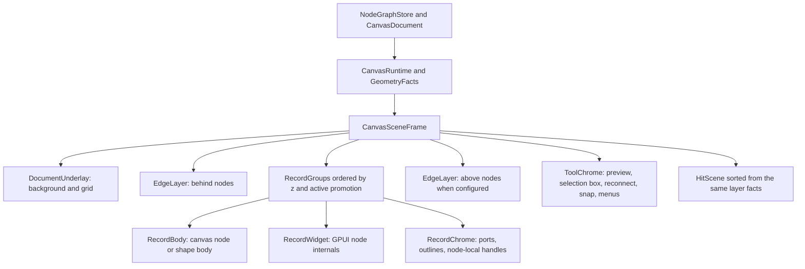
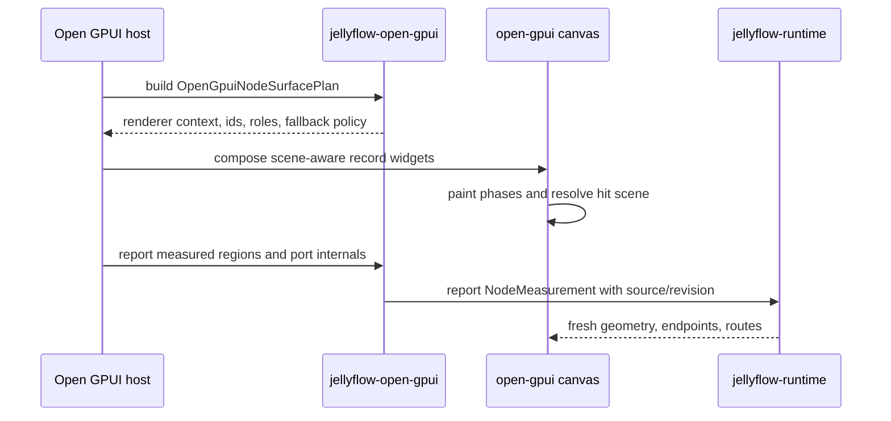
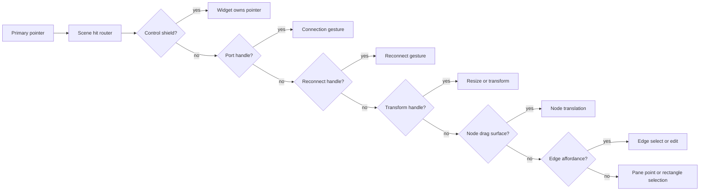

# Open GPUI Atomic Node Scene - Plan

## Goal Capsule

| Field | Decision |
| --- | --- |
| Objective | Root-fix Open GPUI rich node layering so each graph node behaves as one atomic display item: canvas body, GPUI node internals, port visuals, selection outline, resize handles, reconnect affordances, and hit targets must be ordered from one scene contract instead of separate global canvas and widget layers. |
| User-visible problem | Overlapping product nodes can show one node's GPUI internals through another node's canvas body or selection chrome; some nodes finish internals only after pointer movement; ports and node bodies still feel easier to mis-hit than xyflow or egui-snarl. |
| Architecture stance | Keep `jellyflow-runtime` headless, keep `jellyflow-open-gpui` widget-free, and make `repo-ref/open-gpui` the only mature concrete adapter target in this phase. The fix is a scene/layer/hit-test refactor, not a cross-framework widget crate. |
| Execution profile | Fearless refactor across Jellyflow root and local `repo-ref/open-gpui`. Breaking internal APIs, moving modules, and deleting proof-only overlay or fit code is allowed when it simplifies ownership. |
| Stop conditions | Stop if the implementation requires DOM z-index, runtime-owned GPUI widgets, heuristic text fitting as proof, backend Dify execution, shader compilation, or mature egui/Dioxus adapter parity in this slice. |
| Tail ownership | Execute with `ce-work` or goal mode. Track implementation progress in commits, test output, and engineering memory rather than mutating this plan during development. |

## Product Contract

### Summary

The current Open GPUI example has enough rich UI to expose the real architectural gap.
The graph is rendered as one canvas child, then all Jellyflow GPUI node surfaces are appended as later sibling children.
That means all canvas records live below all custom node UI, regardless of per-node z order.
When nodes overlap, the node body, custom internals, ports, and selection chrome are not one sortable unit.

This plan replaces that shape with a scene contract.
The scene has explicit phases, record groups, widget slots, tool chrome, and hit priorities.
The same ordered facts should drive paint, GPUI widget placement, port endpoints, edge routing, and pointer ownership.

### Problem Frame

Manual review found a representative bug: a selected source node overlaps a topic node, but the lower node's GPUI content remains visible through the upper node area.
The current minimal wrapper fix covers the full node bounds, but it only reduces the leak.
It does not remove the root cause because the graph still has two global layers:

- `repo-ref/open-gpui/crates/canvas/src/gpui/view.rs` returns one `Canvas` child and `paint_canvas_frame` draws background, records, labels, selection, connection previews, snap guides, transform handles, and reconnect handles inside that child.
- `repo-ref/open-gpui/examples/canvas-jellyflow/src/main.rs` then appends `.children(self.render_node_surfaces(...))`, so every GPUI product node surface is a sibling above the entire canvas.
- `surface_render_nodes` sorts only node surfaces. It cannot interleave a front node's canvas body or chrome above a back node's GPUI internals.
- `CanvasWidgetOverlayFrame` only describes selected placement metadata. It is not connected to renderer composition, hit routing, GPUI widget lifecycle, or product node measurement.
- `CanvasRuntimeQuery` and `CanvasGeometryFacts` know records and handles, while product controls and drag exclusions use separate GPUI event shields. Hit testing and event routing do not share one scene table.
- Measurement is intentionally one frame delayed, but stale/fallback facts can still look equivalent to fresh layout-pass facts unless the adapter reports them as different sources.

### Requirements

**Atomic display and layer contract**

- R1. Each visible node must be rendered as an atomic record group ordered by document z order and active interaction promotion.
- R2. A node record group must own its body/backplate, optional GPUI internals, node-local port visuals, node-local selection/hover outline, and node-local resize affordances unless a tool phase explicitly promotes an affordance globally.
- R3. A lower z node's GPUI internals must never paint above a higher z node's body, internals, or node-local chrome.
- R4. Global tool chrome must be explicit and limited to connection preview, rubber-band selection, snap guides, selected-edge reconnect handles, transform handles when intentionally topmost, menus, and popovers.
- R5. Edge layers must be explicit. The scene must support behind-nodes wires, above-nodes wires, preview wires, selected/hover wires, and labels without accidentally interleaving with node internals.
- R6. Scene ordering must be deterministic and testable from data without requiring screenshots.
- R7. Existing canvas-only behavior must stay equivalent when no widget-backed nodes are present.

**Hit testing and pointer ownership**

- R8. Paint order and hit-test order must come from the same scene/layer facts, with only documented exceptions such as control shields and top-level tool handles.
- R9. Pointer ownership priority must be explicit: control/no-drag region, port handle, reconnect handle, resize/transform handle, node drag surface, edge affordance, pane selection.
- R10. Rectangle selection must start only from pane space or a declared selection path, not from a visible port, control, or node body.
- R11. Product port visuals, port hit targets, canvas handles, edge endpoints, and connection previews must be derived from one port/anchor fact path.
- R12. Dynamic ports and repeatable rows must refresh their handle facts before connection hit tests can claim product readiness.
- R13. Node body endpoint behavior remains opt-in. Dify, shader graph, ERD, and mind-map fixtures use explicit ports/handles by default.

**Adapter and host boundaries**

- R14. `jellyflow-runtime` remains renderer neutral. It owns semantic descriptors, node-kit data, anchors, slots, repeatables, actions, menus, measurement facts, and transactions.
- R15. `jellyflow-open-gpui` remains widget-free but may own scene/measurement evidence, surface planning, internals reporting, region roles, and port-handle plans.
- R16. `repo-ref/open-gpui/crates/canvas` owns generic scene ordering, canvas paint phases, geometry facts, route hit tests, pointer capture, and graph tool state.
- R17. `repo-ref/open-gpui/examples/canvas-jellyflow` owns concrete Open GPUI elements, host lifecycle scheduling, local component helpers, focus, popups, and product renderer polish.
- R18. Fallback and custom node renderers must receive the same surface plan and wrapper lifecycle. A fallback path cannot bypass measurement or hit facts.
- R19. Projection fallback must be reported as fallback evidence, not silently treated as fresh layout-pass measurement.
- R20. Host measurement refresh must be centralized so fixture switches, dynamic internals, resize, authoring edits, and pointer-interaction deferral do not each flip scattered flags.

**Product proof**

- R21. Dify, shader graph, ERD, mind-map, and source fixtures must pass overlap, no-pointer readiness, body drag, port drag, control shielding, reconnect, invalid hover, and dropped-wire gates.
- R22. Product nodes must avoid silent clipping at default launch and after resize by using measured readable regions, density degradation, or explicit overflow indicators.
- R23. Regression confidence must come from `cargo nextest` and structured reports first. Screenshots remain review aids.
- R24. Transitional overlay, wrapper padding, hidden/offscreen handle, and text-fit heuristics must be deleted once the scene contract replaces them.

### Acceptance Examples

- AE1. Given two overlapping widget-backed nodes, when the higher z node covers the lower z node, then the lower node's GPUI content is not visible through the higher node's body or wrapper.
- AE2. Given a selected widget-backed node over another node, when it renders, then its selection outline, ports, and transform affordances are visible according to the documented node-local or tool-chrome phase.
- AE3. Given a selected edge with reconnect handles, when a node overlaps the edge, then reconnect handles appear only in the explicit top-level tool phase and remain hittable by the same facts used for paint.
- AE4. Given Select mode and a visible port, when the first pointer after fixture load presses the port, then the connection path starts and rectangle selection does not.
- AE5. Given a mind-map node body, when the pointer drags the header or declared drag surface, then the node moves and no connection line appears.
- AE6. Given a text field, select, slider, button, or repeatable action inside a node, when the pointer interacts with it, then graph drag, connection, and pane selection do not start.
- AE7. Given a fixture switch from ERD to shader graph, when no mouse movement occurs, then node internals and measured handles become ready through the scheduled frame lifecycle.
- AE8. Given a repeatable shader input is added, removed, or reordered, when a connection is attempted, then stale/projected ports cannot pass the product-ready gate.
- AE9. Given fallback node rendering, when the node overlaps a custom node, then fallback content participates in the same atomic record group and ordering.
- AE10. Given no custom widget nodes, when the generic canvas renders, then canvas-only paint output and hit tests remain behaviorally equivalent.

### Scope Boundaries

In scope:

- Generic Open GPUI canvas scene data, layer phases, paint splitting, hit priority, and scene tests.
- `canvas-jellyflow` migration from global widget overlay to scene-aware node groups or equivalent phase composition.
- `jellyflow-open-gpui` widget-free surface plan, internals reporter, region roles, port-handle plan, and product evidence refinements.
- Product fixture migration and deletion of proof-only overlay/fit/hidden-handle code.
- Engineering memory and docs updates after implementation.

Deferred:

- Extracting a reusable `jellyflow-open-gpui-host` crate.
- Mature egui and Dioxus adapters for the new scene contract.
- Pixel-golden infrastructure beyond targeted screenshot/native smoke probes.
- Full keyboard accessibility and screen-reader semantics.
- Advanced edge label portals, minimap, route avoidance, cable bundling, and animation polish.

Out of scope:

- Shared cross-framework widget crates.
- DOM/CSS z-index APIs as the model.
- Runtime-owned GPUI widget state, focus, pointer capture, or retained layout scheduling.
- Dify backend execution, shader compilation, database persistence, multiplayer, or cloud sync.

## Planning Contract

### Key Technical Decisions

- KTD1. Treat the Open GPUI graph as a scene, not as "one canvas plus one widget overlay." A scene item is the unit that can be sorted, painted, hit-tested, and measured.
- KTD2. Borrow xyflow's responsibility split: graph-owned wrapper/handles/measurement/drag, user-owned node internals. Do not borrow DOM-specific portals or CSS as the abstraction.
- KTD3. Borrow egui-snarl's geometry discipline: port visual rect, port hit rect, and wire endpoint are all facts produced from the same UI layout.
- KTD4. Keep node internals local to the Open GPUI host, but make their measured regions feed a widget-free adapter reporter before graph interactions claim readiness.
- KTD5. Replace `CanvasWidgetOverlayFrame` as the long-term abstraction with a scene/display-list contract. Existing overlay APIs may stay temporarily as compatibility adapters only.
- KTD6. Avoid broad defaults such as "include handles in every hit test." Pointer priority should ask for the right scene phases for the current interaction.
- KTD7. Treat projection fallback as a degraded source. It can seed initial placement, but it cannot satisfy product-ready gates that require fresh layout-pass internals.
- KTD8. Prefer typed scene phases and region roles over padding, wrapper shields, z-index constants, string-length fit checks, or offscreen/hidden handle hacks.
- KTD9. Keep deletion aggressive after each migration step. The codebase should converge toward fewer seams: one surface plan, one internals reporter, one host lifecycle, one scene ordering path.
- KTD10. Preserve existing green interaction determinism work. This plan deepens the layer architecture; it must not reintroduce "node moves a little then stops," first-click port selection fallback, or stale fixture refresh.

### High-Level Technical Design

### Scene Layer Model

| Phase | Owner | Contents | Ordering rule |
| --- | --- | --- | --- |
| `DocumentUnderlay` | `open-gpui-canvas` | Background, grid, document backdrop | Always below records |
| `EdgeBehindNodes` | `open-gpui-canvas` | Committed wires configured behind nodes | Edge z/order before node groups |
| `RecordBody` | `open-gpui-canvas` | Canvas node body, fallback backplate, shape body | Inside each record group |
| `RecordWidget` | `canvas-jellyflow` host through scene slot | GPUI node internals and component content | Inside same record group as body |
| `RecordChrome` | `open-gpui-canvas` plus host roles | Port markers, node-local hover/selection outlines, node-local badges | Above widget content but still inside record group |
| `EdgeAboveNodes` | `open-gpui-canvas` | Wires configured above nodes or selected edge emphasis | Above record groups only by explicit policy |
| `ToolChrome` | `open-gpui-canvas` | Rubber-band, connection preview, reconnect handles, transform handles, snap guides | Explicit global top phase |
| `HostPortal` | `canvas-jellyflow` host | Menus, popovers, inspector triggers that intentionally float | Top-level UI, not part of ordinary node occlusion |

### Root Cause Matrix

| Symptom | Current cause | Root fix |
| --- | --- | --- |
| Lower node UI leaks through upper node | All GPUI surfaces are appended above the whole canvas | Scene record groups interleave body, widget, and chrome per node |
| Selection/ports appear under custom node UI | Canvas chrome is painted inside lower sibling canvas | Node-local chrome or explicit tool chrome phase is rendered above the right content |
| First frame needs pointer movement | Host measurement refresh and scene readiness are scattered | One host measurement lifecycle and no-pointer readiness gate |
| Port visual and connection hit drift | Port marker, measured anchor, canvas handle, and endpoint have separate paths | `OpenGpuiPortHandlePlan` ties descriptor, measured region, hit rect, and endpoint evidence |
| Product controls conflict with graph gestures | GPUI shields and canvas hit tests do not share one priority model | `HitScene` includes widget region roles and uses one router |
| Projection fallback masks missing internals | Fallback store can be consumed like fresh measurement | Internals reporter returns source and coverage evidence with degraded gates |

### Prior-Art Synthesis

- `repo-ref/xyflow/packages/react/src/container/GraphView/index.tsx` separates viewport, edge renderer, connection line, edge labels, node renderer, and portals.
- `repo-ref/xyflow/packages/react/src/components/NodeWrapper/index.tsx` keeps custom node components inside a graph-owned wrapper that owns selection, drag, measurement, z order, and node props.
- `repo-ref/xyflow/packages/react/src/components/Handle/index.tsx` and `repo-ref/xyflow/packages/system/src/xyhandle/XYHandle.ts` make handles independent connection affordances with stable ids.
- `repo-ref/xyflow/packages/system/src/xydrag/XYDrag.ts` treats no-drag and drag-handle regions as first-class interaction facts.
- `repo-ref/egui-snarl/src/ui.rs` draws nodes in a stored order, collects pin responses, then draws/hits wires from the same pin facts.
- `repo-ref/egui-snarl/src/ui/viewer.rs` gives product code deep rendering hooks while graph state and connection effects remain centralized.
- `repo-ref/egui-snarl/src/ui/wire.rs` uses geometric wire hit tests rather than painter order as a proxy for interaction.

### Assumptions

- Open GPUI element ordering can be controlled through explicit child order and absolute groups even if it does not offer DOM-style z-index.
- A scene renderer can use multiple canvas layers or per-record wrapper groups if GPUI cannot interleave arbitrary painted records and child widgets inside one primitive.
- Some paint implementation details may remain in `CanvasPaintFrame` during migration, but the public direction should be `CanvasSceneFrame` or equivalent.
- The current uncommitted `repo-ref/open-gpui` changes for wrapper coverage and stale measurement generation are valid characterization work, but this plan may replace their final shape.
- The user wants local Open GPUI `main` to remain unpushed unless explicitly requested.

### Risks and Mitigations

| Risk | Mitigation |
| --- | --- |
| GPUI cannot interleave canvas painter calls and element children per record. | Use scene-generated absolute record groups plus phase-specific canvas overlays. Keep tool chrome in a top canvas layer. |
| New scene contract duplicates `CanvasPaintFrame` for too long. | Start with an adapter function from paint frame to scene, then migrate call sites and delete compatibility once tests pass. |
| Hit router breaks existing canvas-only users. | Add canvas-only equivalence tests and keep policy defaults explicit. |
| Measurement updates churn every frame. | Use revision/source equality, dirty flags, and changed-region detection in `OpenGpuiNodeInternalsReporter`. |
| Product renderers reintroduce fit heuristics under pressure. | Gate on measured readable/control/overflow/handle facts and reject string-length or arbitrary row-count proof. |
| The refactor spans two repositories. | Commit Jellyflow root and `repo-ref/open-gpui` separately when implementation reaches stable slices. |

## Implementation Units

### U1. Characterize atomic layering and no-pointer readiness failures

**Goal:** Lock the reported overlap and stale-render failures before refactoring the rendering architecture.

**Requirements:** R1, R3, R6, R7, R21, AE1, AE2, AE7, AE10.

**Dependencies:** None.

**Files:** `repo-ref/open-gpui/crates/canvas/src/gpui/frame.rs`, `repo-ref/open-gpui/crates/canvas/src/gpui.rs`, `repo-ref/open-gpui/examples/canvas-jellyflow/src/main.rs`, `repo-ref/open-gpui/examples/canvas-jellyflow/src/native_smoke.rs`, `repo-ref/open-gpui/examples/canvas-jellyflow/src/visual_regression.rs`.

**Approach:** Add data-level tests for overlapping records before relying on screenshots. Keep the current `node_surface_wrapper_covers_full_canvas_node_bounds` test if useful, but add stronger tests that fail under global canvas-plus-widget layering. Capture no-pointer readiness after fixture switches and stale measurement generation.

**Test scenarios:**

- Two overlapping widget-backed nodes with different z values produce an ordering where the higher node owns body, widget, and chrome above the lower node's widget.
- Canvas-only records keep their existing order and selected feedback.
- Fixture switch builds product surfaces and measured handles without pointer movement.
- A selected overlapping node exposes exactly the chrome phases expected by the layer contract.

**Verification:** These tests should drive U2-U4 and should not be deleted after implementation.

### U2. Introduce `CanvasSceneFrame` and typed layer items

**Goal:** Create the single data contract that describes paint phases, record groups, widget slots, tool chrome, and hit order.

**Requirements:** R1, R2, R4, R5, R6, R7, R8, AE1, AE2, AE3, AE10.

**Dependencies:** U1.

**Files:** `repo-ref/open-gpui/crates/canvas/src/gpui/frame.rs`, `repo-ref/open-gpui/crates/canvas/src/gpui/model.rs`, `repo-ref/open-gpui/crates/canvas/src/lib.rs`, `repo-ref/open-gpui/crates/canvas/src/runtime_query.rs`, optional new `repo-ref/open-gpui/crates/canvas/src/gpui/scene.rs`.

**Approach:** Add a scene model that can be derived from the current `CanvasPaintFrame`. The first pass can adapt `CanvasPaintRecord` into `CanvasSceneRecordGroup` and move interaction chrome into typed scene phases. Include deterministic sort keys: z index, document ordinal, active interaction promotion, layer phase, and target id.

**Delete or downgrade:** Mark `CanvasWidgetOverlayFrame`, `CanvasWidgetOverlayPlacement`, and `CanvasWidgetOverlayHitPriority` as compatibility-only once the scene replacement is available.

**Test scenarios:**

- Scene record groups sort by z index and ordinal.
- Dragged or selected promotion is explicit and stable.
- `RecordWidget` cannot outpaint a higher z `RecordBody`.
- `ToolChrome` is the only phase allowed above all record groups by default.
- Scene derivation preserves canvas-only records, labels, hover, selection, and route geometry.

**Verification:** `cargo nextest run --manifest-path repo-ref/open-gpui/crates/canvas/Cargo.toml -p open-gpui-canvas --lib --no-fail-fast`.

### U3. Split canvas painting into phase-aware renderer entry points

**Goal:** Let Open GPUI compose canvas paint phases and GPUI node widgets without forcing all canvas paint below all widgets.

**Requirements:** R1, R2, R3, R4, R5, R7, AE1, AE2, AE3, AE9, AE10.

**Dependencies:** U2.

**Files:** `repo-ref/open-gpui/crates/canvas/src/gpui/painter.rs`, `repo-ref/open-gpui/crates/canvas/src/gpui/view.rs`, `repo-ref/open-gpui/crates/canvas/src/gpui/frame.rs`, `repo-ref/open-gpui/crates/canvas/src/gpui.rs`, `repo-ref/open-gpui/crates/canvas/src/lib.rs`.

**Approach:** Refactor `paint_canvas_frame` into phase-specific functions or a scene painter that can paint underlay, edge layers, record bodies, record chrome, and tool chrome independently. Keep `canvas_editor_view_with_frame` as the simple canvas-only convenience path, but expose enough phase rendering for hosts that need embedded widgets.

**Execution note:** If GPUI cannot mix paint calls and element children inside one record group, create layered children: base canvas, sorted record groups with optional widget children and local chrome, then top tool-chrome canvas.

**Test scenarios:**

- Phase painter emits the same labels and shapes as the old full painter for canvas-only content.
- `RecordChrome` for a lower node does not exceed a higher node unless marked tool chrome.
- Connection preview and reconnect handles remain in the documented top phase.
- Edge route visual states remain unchanged.

**Verification:** Canvas unit tests plus a focused `cargo check` for `open-gpui-canvas-jellyflow`.

### U4. Move `canvas-jellyflow` node surfaces into scene-aware record groups

**Goal:** Delete the global "append all node surfaces after the canvas" layering pattern.

**Requirements:** R1, R2, R3, R4, R6, R17, R18, R21, R24, AE1, AE2, AE6, AE9.

**Dependencies:** U2, U3.

**Files:** `repo-ref/open-gpui/examples/canvas-jellyflow/src/main.rs`, optional new `repo-ref/open-gpui/examples/canvas-jellyflow/src/node_scene_host.rs`, `repo-ref/open-gpui/examples/canvas-jellyflow/src/node_component_kit.rs`, `repo-ref/open-gpui/examples/canvas-jellyflow/src/product_renderers.rs`.

**Approach:** Replace `render_node_surfaces` and `surface_render_nodes` with a scene-host renderer that iterates scene record groups. For widget-backed Jellyflow nodes, render the GPUI surface in the group's `RecordWidget` slot. For fallback nodes, render through the same wrapper and measurement path. Preserve the full-bounds wrapper as a correctness guard, not as the primary occlusion mechanism.

**Delete or replace:**

- Delete independent node-only z sorting once scene group order drives rendering.
- Delete any wrapper padding or inset shielding code that exists only to hide layering leaks.
- Remove duplicated canvas node label/body paint for widget-backed nodes when the group body/widget path replaces it.

**Test scenarios:**

- Overlapping Dify, shader, ERD, and mind-map nodes obey scene order.
- Fallback renderer and custom renderer share wrapper, measurement, and ordering.
- Selected node chrome stays attached to the same node group.
- Node internals render on fixture switch without pointer movement.

**Verification:** `cargo nextest run --manifest-path repo-ref/open-gpui/examples/canvas-jellyflow/Cargo.toml -p open-gpui-canvas-jellyflow --no-fail-fast` with PNG-exporter-only exclusions if the known exporter hang still exists.

### U5. Unify hit routing with scene regions

**Goal:** Use the same scene facts for pointer priority, control shields, ports, node drag, reconnect, edge affordances, and pane selection.

**Requirements:** R8, R9, R10, R11, R12, R13, R21, AE3, AE4, AE5, AE6, AE8.

**Dependencies:** U2, U3, U4.

**Files:** `repo-ref/open-gpui/crates/canvas/src/runtime_query.rs`, `repo-ref/open-gpui/crates/canvas/src/geometry_facts.rs`, `repo-ref/open-gpui/crates/canvas/src/tool/context.rs`, `repo-ref/open-gpui/crates/canvas/src/tool/select.rs`, `repo-ref/open-gpui/crates/canvas/src/tool.rs`, `repo-ref/open-gpui/examples/canvas-jellyflow/src/main.rs`, `repo-ref/open-gpui/examples/canvas-jellyflow/src/node_component_kit.rs`.

**Approach:** Add a `HitScene` or equivalent router derived from `CanvasSceneFrame` plus host region roles. The router should return an explicit pointer owner rather than forcing each call site to combine `HitOptions`, GPUI event stopping, and ad hoc forwarding. Keep existing precise edge geometry and handle facts, but route them through the scene priority order.

**Delete or replace:**

- Replace scattered `handle_product_surface_pointer_down` forwarding where the scene router can classify node drag surfaces.
- Replace independent control shield logic with region roles where possible.
- Do not make `HitOptions::default()` include handles globally.

**Test scenarios:**

- Control shield beats node drag and connection.
- Port handle beats node body and pane selection.
- Reconnect handle beats node body and ordinary edge hit when selected.
- Node drag surface beats pane selection and does not start connection.
- Edge body hit follows route interaction width.
- Empty pane still starts rectangle selection.

**Verification:** Canvas crate hit-router tests plus example product interaction report gates.

### U6. Consolidate adapter surface planning and internals reporting

**Goal:** Move duplicated surface aggregation and reusable measurement reporting from the example into widget-free adapter helpers.

**Requirements:** R14, R15, R18, R19, R20, R22, R24, AE7, AE8, AE9.

**Dependencies:** U4.

**Files:** `crates/jellyflow-open-gpui/src/renderer.rs`, `crates/jellyflow-open-gpui/src/measurement.rs`, optional new `crates/jellyflow-open-gpui/src/surface.rs`, `crates/jellyflow-open-gpui/src/testing.rs`, `repo-ref/open-gpui/examples/canvas-jellyflow/src/main.rs`, `repo-ref/open-gpui/examples/canvas-jellyflow/src/measurement_bridge.rs`.

**Approach:** Introduce `OpenGpuiNodeSurfacePlan` or equivalent to produce one renderer context for custom and fallback nodes. Introduce `OpenGpuiNodeInternalsReporter` or equivalent to convert measured regions into `NodeMeasurement`, coverage evidence, revision decisions, and store-report outcomes. Keep concrete GPUI elements out of these modules.

**Delete or replace:**

- Delete `NodeSurfaceSummary` duplication once the adapter plan covers slots, repeatables, chrome, menus, toolbar, projection, and measurement ids.
- Move generic measurement bridge logic out of the example.
- Rename layout-pass "consume" types if they are really internals report outcomes.

**Test scenarios:**

- Custom and fallback renderers receive identical slots, repeatables, menus, toolbar, projection, and measurement id facts.
- Unchanged measured internals reuse revision.
- Changed internals bump revision.
- Dirty or partial measurement cannot reuse stale handles as fresh endpoints.
- Projection fallback returns explicit fallback evidence.

**Verification:** `cargo nextest run -p jellyflow-open-gpui --no-fail-fast` and targeted example tests.

### U7. Formalize node region roles and port-handle plans

**Goal:** Make product node roles and port facts explicit enough that Dify/shader/ERD/mind-map fixtures can support rich UI without hit ambiguity.

**Requirements:** R9, R11, R12, R15, R17, R21, R22, AE4, AE5, AE6, AE8.

**Dependencies:** U5, U6.

**Files:** `crates/jellyflow-open-gpui/src/measurement.rs`, `crates/jellyflow-open-gpui/src/testing.rs`, optional new `crates/jellyflow-open-gpui/src/regions.rs`, `repo-ref/open-gpui/examples/canvas-jellyflow/src/node_component_kit.rs`, `repo-ref/open-gpui/examples/canvas-jellyflow/src/product_renderers.rs`, `repo-ref/open-gpui/examples/canvas-jellyflow/src/visual_regression.rs`.

**Approach:** Merge the widget-free parts of measured region kinds and product interaction roles into a small `OpenGpuiNodeRegionRole` vocabulary: drag surface, control shield, port handle, readable, overflow, menu trigger, resize handle. Add `OpenGpuiPortHandlePlan` or equivalent to tie descriptor, anchor, measured region, hit rect, connectability, and endpoint evidence.

**Test scenarios:**

- Every product fixture reports readable, drag-surface, control-shield, overflow, and port-handle role coverage where applicable.
- Visible marker, measured anchor, canvas handle, hit rect, and edge endpoint align within configured tolerances.
- Disabled, missing, stale, or projection-only ports cannot pass connectability gates.
- Repeatable reorder/remove refreshes port facts before hit testing.

**Verification:** `jellyflow-open-gpui` gates and `canvas-jellyflow` product report tests.

### U8. Migrate product renderers and delete transitional hacks

**Goal:** Keep the user-facing component UI polished while removing code that was compensating for the old layer model.

**Requirements:** R18, R21, R22, R24, AE1, AE4, AE5, AE6, AE7, AE8, AE9.

**Dependencies:** U4, U5, U6, U7.

**Files:** `repo-ref/open-gpui/examples/canvas-jellyflow/src/product_renderers.rs`, `repo-ref/open-gpui/examples/canvas-jellyflow/src/node_component_kit.rs`, `repo-ref/open-gpui/examples/canvas-jellyflow/src/main.rs`, `repo-ref/open-gpui/examples/canvas-jellyflow/src/gallery_screenshot.rs`, `repo-ref/open-gpui/examples/canvas-jellyflow/src/native_smoke.rs`.

**Approach:** Rework Dify, shader graph, ERD, mind-map, and source renderers around declared regions and scene grouping. Use measured readable regions, compact/shell degradation, and explicit overflow indicators. Avoid fixed row hacks where the component kit can express a region or stack. Keep visual design local to Open GPUI.

**Delete or replace:**

- Delete hidden/offscreen handles that are superseded by measured anchors.
- Delete wrapper-only occlusion shields that the scene contract makes unnecessary.
- Delete text-length fit estimators and row-count proofs that are not backed by measured regions.
- Delete duplicate surface summaries, role classifiers, and product probes replaced by adapter reports.

**Test scenarios:**

- Dify nodes show readable compact card content without clipping key controls.
- Shader graph nodes drag from body/header and connect from ports without ambiguity.
- ERD rows have adequate height and overflow indicators when constrained.
- Mind-map nodes launch non-overlapping and drag as nodes, not wires.
- Product fixture switch remains ready without pointer movement.

**Verification:** Example nextest gates plus manual native launch review.

### U9. Add regression harness, docs, and engineering memory

**Goal:** Make the new scene boundary durable for future contributors and agents.

**Requirements:** R6, R14, R15, R16, R17, R21, R23, R24.

**Dependencies:** U1-U8.

**Files:** `docs/knowledge/engineering/current-state.md`, `docs/knowledge/engineering/log.md`, `docs/knowledge/engineering/decisions/open-gpui-node-component-kit.md`, `docs/knowledge/engineering/decisions/node-ui-kit-component-contract.md`, `crates/jellyflow-open-gpui/README.md`, `repo-ref/open-gpui/examples/canvas-jellyflow/src/visual_regression.rs`, `repo-ref/open-gpui/examples/canvas-jellyflow/src/native_smoke.rs`.

**Approach:** Update memory with the final ownership split: generic canvas scene and graph UX in Open GPUI canvas, widget-free surface/internals/region evidence in `jellyflow-open-gpui`, concrete GPUI components in `canvas-jellyflow`, and runtime headless semantics unchanged. Add regression reports that specifically name atomic layering, stale measurement source, and port/endpoint alignment failures.

**Test scenarios:**

- Visual report fails on node bounds overlap when product fixtures are expected to launch separated.
- Visual report fails on lower-z widget content visible through a higher-z node group when overlap is intentional.
- Native smoke covers close behavior, fixture switch readiness, and representative overlap/port interactions where feasible.

**Verification:** Docs are updated after code lands; no doc claim says egui or Dioxus has mature parity for this Open GPUI scene layer.

## Verification Contract

Run the narrow gates after each affected slice and the broad gates before commit.

**Open GPUI canvas gates**

- `cargo fmt --manifest-path repo-ref/open-gpui/crates/canvas/Cargo.toml -- --check`
- `cargo nextest run --manifest-path repo-ref/open-gpui/crates/canvas/Cargo.toml -p open-gpui-canvas --lib --no-fail-fast`

**Open GPUI Jellyflow example gates**

- `cargo fmt --manifest-path repo-ref/open-gpui/examples/canvas-jellyflow/Cargo.toml -- --check`
- `git -C repo-ref/open-gpui diff --check`
- `cargo check --manifest-path repo-ref/open-gpui/examples/canvas-jellyflow/Cargo.toml -p open-gpui-canvas-jellyflow`
- `cargo nextest run --manifest-path repo-ref/open-gpui/examples/canvas-jellyflow/Cargo.toml -p open-gpui-canvas-jellyflow --no-fail-fast`

**Jellyflow adapter/runtime gates**

- `cargo fmt --all --check`
- `cargo nextest run -p jellyflow-runtime -p jellyflow-open-gpui --no-fail-fast`

**Manual/native review**

- Launch `open-gpui-canvas-jellyflow` and review Dify, shader graph, ERD, mind-map, and source fixtures.
- Check overlap ordering by intentionally dragging one widget-backed node over another.
- Check first-pointer port drag, node body drag, control shielding, reconnect, invalid hover, and fixture switch readiness without pointer movement.
- Keep known Open GPUI warning noise separate from new failures.

## Definition of Done

- The reported overlapping-node layer bug is fixed by scene architecture, not just by a wrapper padding or z-index patch.
- A node's body, GPUI internals, node-local chrome, and hit regions are one ordered record group unless a documented tool phase intentionally lifts chrome globally.
- Paint order and hit-test order share one scene/hit contract with explicit exceptions.
- Product ports use one fact path for visual marker, measured anchor, hit rect, canvas handle, edge endpoint, and connectability.
- Fixture switches and dynamic internals reach product readiness without pointer movement.
- Dify, shader graph, ERD, mind-map, and source fixtures pass structured gates for overlap, drag, ports, controls, reconnect, invalid hover, dropped-wire, readable regions, and overflow.
- `CanvasWidgetOverlayFrame` and global `render_node_surfaces` are removed or clearly demoted to compatibility shims with no product path dependency.
- Heuristic text/control fit, hidden/offscreen handles, and ad hoc overlay shields replaced by measured regions and scene roles are deleted.
- Runtime remains free of GPUI/widget types, and docs do not claim cross-framework widget parity.
- Verification Contract gates pass or any excluded gate is documented with a concrete reason.
- Engineering memory records the new scene/adapter/host ownership boundary.
